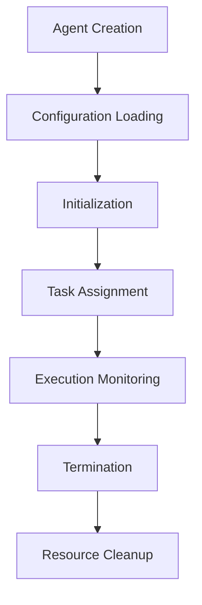
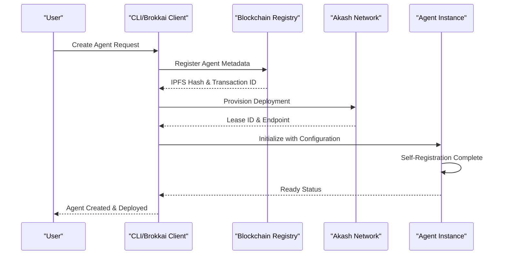
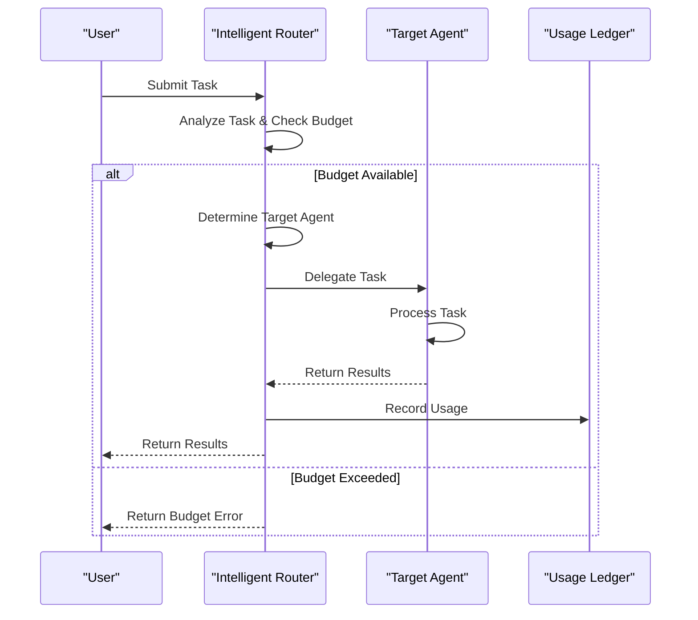
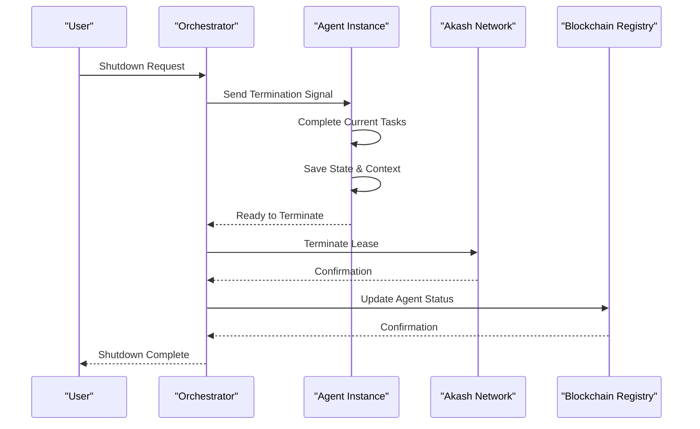

# Agent Lifecycle and Orchestration

<cite>
**Referenced Files in This Document**   
- [intelligent_router_agent.py](file://371-os/src/minds371/adaptive_llm_router/intelligent_router_agent.py)
- [adaptive_llm_router_example.py](file://371-os/src/minds371/adaptive_llm_router/adaptive_llm_router_example.py)
- [config.py](file://371-os/src/minds371/adaptive_llm_router/config.py)
- [data_models.py](file://371-os/src/minds371/adaptive_llm_router/data_models.py)
- [policy_engine.py](file://371-os/src/minds371/adaptive_llm_router/policy_engine.py)
- [deployment_agent.py](file://371-os/src/minds371/agents/technical/deployment_agent.py)
- [comet_371os_shortcuts.py](file://371-os/src/minds371/comet/comet_371os_shortcuts.py)
- [cro_agent.py](file://371-os/src/minds371/agents/cro_agent/cro_agent.py)
- [actions.ts](file://packages/elizaos-plugins/universal-tool-server/src/actions.ts)
- [blockchain-registry.ts](file://packages/elizaos-plugins/universal-tool-server/src/blockchain-registry.ts)
- [Adaptive_Router_Logic.md](file://371-os/Adaptive_Router_Logic.md)
- [README.md](file://README.md)
- [IMPLEMENTATION_GUIDE.md](file://IMPLEMENTATION_GUIDE.md)
</cite>

## Table of Contents
1. [Introduction](#introduction)
2. [Agent Lifecycle Overview](#agent-lifecycle-overview)
3. [Agent Creation and Configuration](#agent-creation-and-configuration)
4. [Intelligent Task Routing](#intelligent-task-routing)
5. [Model Context Protocol (MCP) for Agent Coordination](#model-context-protocol-mcp-for-agent-coordination)
6. [Workspace Automation with Comet](#workspace-automation-with-comet)
7. [Dynamic Scaling and Failover](#dynamic-scaling-and-failover)
8. [Decentralized Deployment and Resource Management](#decentralized-deployment-and-resource-management)
9. [Sequence Diagrams](#sequence-diagrams)
10. [Conclusion](#conclusion)

## Introduction
The 371OS agent ecosystem enables autonomous, intelligent agents to perform complex tasks through a sophisticated lifecycle management and orchestration system. This document details the complete agent lifecycle from creation to termination, including task routing, context sharing, workspace automation, and decentralized deployment. The system integrates advanced routing logic, Model Context Protocol (MCP) for coordination, and Akash Network for cost-efficient infrastructure.

**Section sources**
- [README.md](file://README.md)

## Agent Lifecycle Overview
The agent lifecycle in 371OS consists of five key phases: creation, initialization, execution, monitoring, and termination. Each agent follows a standardized process that ensures consistent behavior across the system. The lifecycle is managed by the core orchestration framework, which coordinates agent activities and maintains system integrity.

Agents are created through either the brokkai_client interface or CLI commands, then undergo configuration loading and initialization before becoming available for task assignment. During execution, agents process tasks according to their specialized capabilities, with performance monitored throughout their operational period. Termination occurs either through explicit shutdown commands or automated resource cleanup processes.



**Diagram sources**
- [IMPLEMENTATION_GUIDE.md](file://IMPLEMENTATION_GUIDE.md)

## Agent Creation and Configuration
Agents are created through multiple entry points, with configuration managed through a hierarchical system. The primary creation methods include the brokkai_client Python interface and command-line tools. During creation, agents are assigned unique identifiers and type classifications that determine their capabilities and routing behavior.

Configuration is loaded from multiple sources, including environment variables, JSON configuration files, and blockchain-registered settings. The system prioritizes configuration from the blockchain registry to ensure consistency and security across distributed environments.

```python
# Example agent creation via brokkai_client
from brokkai_client import BrokkaiClient

client = BrokkaiClient(api_key="your_api_key")
agent = client.create_agent(
    name="marketing_analyst",
    agent_type="CMO",
    capabilities=["data_analysis", "campaign_optimization"],
    economic_terms={"rate": 0.05, "currency": "USD"}
)
```

**Section sources**
- [brokkai_client.py](file://371-os/src/minds371/agents/brokkai_client/brokkai_client.py)

## Intelligent Task Routing
The Intelligent Router Agent in the adaptive_llm_router module routes tasks based on capability, cost, and availability metrics. This routing system uses a decision graph that evaluates multiple factors to determine the optimal agent for each task.

The routing process begins with task ingestion, followed by budget validation through the Budget Guard component. The Policy Engine then analyzes task metadata, estimated token usage, and current system constraints to select the most appropriate LLM provider and model. Routing decisions consider privacy requirements, task criticality, context length needs, and remaining budget.

```mermaid
graph TD
subgraph "Intelligent Router: Core System Workflow"
Start((User Request Ingested)) --> CheckBudget[Check Budget Guard];
CheckBudget -- "Budget OK" --> A[Use Adaptive LLM Router to Analyze Request];
A --> Decompose[Decompose Request into Tasks];
Decompose --> Classify{Classify Task Category};
Classify -- "Strategic/Executive" --> RouteCEO[Route to CEO Agent];
Classify -- "Technical" --> RouteCTO[Route to CTO Agent];
Classify -- "Marketing" --> RouteCMO[Route to CMO (Marketing) Agent];
Classify -- "Monetization" --> RouteCMO2[Route to CMO (Monetization) Agent];
Classify -- "Product" --> RouteCPO[Route to CPO Agent];
Classify -- "Community" --> RouteCCO[Route to CCO Agent];
Classify -- "Financial" --> RouteCFO[Route to CFO Agent];
Classify -- "Learning/Optimization" --> RouteCLO[Route to CLO Agent];
CheckBudget -- "Budget Exceeded" --> B(Return Budget Exceeded Error);
B --> End((Request Cycle Complete));
RouteCEO --> End;
RouteCTO --> End;
RouteCMO --> End;
RouteCMO2 --> End;
RouteCPO --> End;
RouteCCO --> End;
RouteCFO --> End;
RouteCLO --> End;
end
subgraph "Core Components Utilized"
style Core fill:#e6f3ff,stroke:#0066cc
Comp1[Adaptive LLM Router]
Comp2[Budget Manager]
Comp3[Usage Ledger]
end
```

**Diagram sources**
- [Adaptive_Router_Logic.md](file://371-os/Adaptive_Router_Logic.md)
- [intelligent_router_agent.py](file://371-os/src/minds371/adaptive_llm_router/intelligent_router_agent.py)

### Policy Engine Decision Logic
The Policy Engine implements a hierarchical decision-making process that evaluates multiple criteria in sequence:

```python
def select_provider(meta: Dict[str, Any], est_in: int, est_out: int) -> str:
    """
    Selects the best provider and model based on task metadata and budget.
    This is a simplified implementation of the decision graph.
    """
    budget_percentage = budget_manager.get_remaining_budget_percentage()

    # 1. Privacy Flag: forces LocalAI
    if meta.get("confidential"):
        return "localai:phi-4-14b"

    # 2. Task Criticality: high-quality model for critical tasks if budget allows
    if meta.get("quality") == "high" and budget_percentage > 0.20:
        return "openrouter:gpt-4o-mini"

    # 3. Context Length: long-context model for large inputs
    if est_in > 8000:
        return "requesty:claude-3-sonnet"

    # 4. Low Budget Mode: cheapest model when budget is low
    if budget_percentage < 0.05:
        return "openrouter:mistral-7b"

    # 5. Balanced Default: the default choice for all other cases
    return "openrouter:qwen2-72b"
```

**Section sources**
- [policy_engine.py](file://371-os/src/minds371/adaptive_llm_router/policy_engine.py)
- [data_models.py](file://371-os/src/minds371/adaptive_llm_router/data_models.py)

## Model Context Protocol (MCP) for Agent Coordination
The Model Context Protocol (MCP) enables seamless coordination and context sharing between agents in the 371OS ecosystem. MCP servers provide standardized interfaces for memory access, file system operations, and agent-to-agent communication.

The MCP architecture consists of multiple specialized servers:
- **Memory MCP**: Manages shared memory and context storage
- **Filesystem MCP**: Provides secure file system access
- **Custom Agent MCP**: Enables agent coordination and task delegation

Agents use MCP to share context, exchange data, and coordinate complex workflows that require multiple specialized capabilities. The protocol ensures that context is preserved across agent boundaries while maintaining security and access controls.

```javascript
// Dynamic context configuration for agent coordination
const agentContextConfig = {
  contextName: "Agent Coordination Context",
  httpMethod: "GET",
  endpointURL: "http://localhost:3001/agent-context",
  headers: {
    "Authorization": "Bearer ${ELECTRON_BRIDGE_TOKEN}",
    "Content-Type": "application/json"
  },
  cachePolicy: {
    enabled: true,
    duration: 30 // seconds
  },
  variables: {
    agentId: "{characterID}",
    chatId: "{chatID}",
    lastMessage: "{lastUserMessage}"
  }
};
```

**Section sources**
- [memory_mcp.md](file://371-os/src/minds371/mcp_servers/memory_mcp.md)
- [local_file_mcp.md](file://371-os/src/minds371/mcp_servers/local_file_mcp.md)
- [agent_dynamic_context.js](file://371-os/src/minds371/platforms/typingmind/extensions/agent_dynamic_context.js)

## Workspace Automation with Comet
Comet shortcuts and deployment agents automate workspace setup and agent provisioning through predefined templates and workflows. The system enables rapid deployment of specialized environments tailored to specific agent types and use cases.

The Comet system includes shortcut definitions that map natural language commands to specific agent workflows and configuration templates. These shortcuts streamline the creation of development environments, deployment pipelines, and specialized agent configurations.

```python
COMET_SHORTCUTS = {
    "/generate-dev-docs": {
        "prompt": """
        You are a Lead Systems Architect for 371OS. Convert business requirements 
        into technical specifications for JetBrains development environment.
        
        Input: Business asset (community strategy, agent behavior spec)
        Output: Developer_Specification.md with:
        - File locations in src/minds371/
        - Dependencies and integrations
        - Core functions and data schemas
        - Implementation roadmap
        """,
        "output_format": "markdown",
        "integration": "jetbrains_space"
    },
    "/prototype-agent-workflow": {
        "prompt": """
        Design and validate C-Suite agent workflow for 371OS:
        - Community data ingestion pipeline
        - Decision-making logic
        - Action execution framework
        - Cross-agent communication protocols
        """,
        "output_format": "workflow_diagram",
        "integration": "youtrack_workflow"
    }
}
```

**Section sources**
- [comet_371os_shortcuts.py](file://371-os/src/minds371/comet/comet_371os_shortcuts.py)

## Dynamic Scaling and Failover
The 371OS system implements dynamic agent scaling and failover mechanisms to ensure resilience and optimal resource utilization. The Chief Resilience Officer (CRO) agent monitors system health and triggers scaling and failover procedures when necessary.

Scaling decisions are based on workload metrics, resource utilization, and performance targets. The system can automatically provision additional agent instances during periods of high demand and decommission them during low-usage periods to optimize costs.

Failover mechanisms include automatic backup mode activation, peer-to-peer mesh networking during internet outages, and redundant deployment across multiple providers and regions.

```python
class CROAgent(ImprovedBaseAgent):
    """
    Chief Resilience Officer (CRO) Agent
    Monitors: Offline sync rates, platform dependency risks, cross-community redundancy
    Decides: How much to decentralize, when to activate backup modes
    Action Example: Internet outage detected -> shifts to peer-to-peer mesh mode with cached content
    """

    def _monitor_resilience(self) -> Dict[str, Any]:
        """Monitors offline sync rates, dependency risks, and redundancy."""
        sync_rate = 0.98
        dependency_risk = "low"
        redundancy = "high"

        if sync_rate < 0.9:
            self.network_status = "degraded"
            self.logger.warning("Offline sync rate is low. Considering backup mode.")

        return {
            "status": "completed",
            "metrics": {
                "offline_sync_rate": sync_rate,
                "platform_dependency_risk": dependency_risk,
                "cross_community_redundancy": redundancy,
            },
            "network_status": self.network_status,
        }

    def _activate_backup_mode(self) -> Dict[str, Any]:
        """Activates a backup mode, like peer-to-peer."""
        self.is_backup_mode = True
        self.network_status = "backup_mode_active"
        self.logger.info("Backup mode activated. Shifting to peer-to-peer mesh mode with cached content.")
        return {
            "status": "completed",
            "message": "Shifted to peer-to-peer mesh mode with cached content.",
            "backup_mode_active": self.is_backup_mode,
        }
```

**Section sources**
- [cro_agent.py](file://371-os/src/minds371/agents/cro_agent/cro_agent.py)

## Decentralized Deployment and Resource Management
371OS integrates with the Universal Tool Server for execution environment provisioning and Akash Network for decentralized deployment. This integration enables cost-efficient, scalable infrastructure that reduces costs by up to 97.6% compared to traditional cloud providers.

The deployment process involves registering agents in a blockchain-based registry, provisioning resources on Akash Network, and establishing monitoring and cost optimization mechanisms.

```typescript
/**
 * Action: Deploy to Akash Network
 * 
 * Deploys agent or tool to Akash Network with automatic resource optimization,
 * cost monitoring, and multi-region availability.
 */
export const deployToAkashAction: Action = {
  name: 'DEPLOY_TO_AKASH',
  description: 'Deploy agent or tool to Akash Network with cost optimization',
  validate: async (runtime: IAgentRuntime, message: Memory) => {
    const content = message.content;
    return !!(content.dockerImage || content.manifestPath);
  },
  handler: async (
    runtime: IAgentRuntime,
    message: Memory,
    state: State,
    options: any,
    callback?: HandlerCallback
  ): Promise<boolean> => {
    try {
      const akashProvider = new AkashIntegrationProvider();
      
      const deploymentConfig = {
        image: message.content.dockerImage,
        resources: message.content.resources || {
          cpu: '0.5',
          memory: '1Gi',
          storage: '10Gi'
        },
        replicas: message.content.replicas || 1,
        expose: message.content.ports || [{ port: 8080, protocol: 'http' }],
        env: message.content.environment || {},
        budget: options.maxCost || 100, // USD per month
        regions: options.preferredRegions || ['us-west', 'eu-central'],
        persistence: message.content.persistence || false
      };
      
      const deployment = await akashProvider.createDeployment(deploymentConfig);
      
      // Register deployment in blockchain registry
      const registryProvider = new BlockchainRegistryProvider();
      await registryProvider.updateDeployment(runtime.agentId, {
        akashDeployment: {
          leaseId: deployment.leaseId,
          provider: deployment.provider,
          endpoint: deployment.endpoints[0],
          resources: deploymentConfig.resources,
          cost: deployment.costPerMonth,
          region: deployment.region
        }
      });
      
      if (callback) {
        callback({
          text: `Successfully deployed to Akash Network. Endpoint: ${deployment.endpoints[0]}. Cost: $${deployment.costPerMonth}/month`,
          content: {
            success: true,
            deployment,
            monitoring: {
              dashboardUrl: `https://console.akash.network/deployments/${deployment.leaseId}`,
              metricsEndpoint: `${deployment.endpoints[0]}/metrics`,
              logsEndpoint: `${deployment.endpoints[0]}/logs`
            },
            costOptimization: {
              estimatedMonthlyCost: deployment.costPerMonth,
              savingsVsTraditional: `${((200 - deployment.costPerMonth) / 200 * 100).toFixed(1)}%`,
              autoScaling: deployment.autoScaling
            }
          }
        });
      }
      
      return true;
    } catch (error) {
      console.error('Failed to deploy to Akash Network:', error);
      if (callback) {
        callback({
          text: `Deployment failed: ${error.message}`,
          content: { error: error.message }
        });
      }
      return false;
    }
  }
};
```

**Section sources**
- [actions.ts](file://packages/elizaos-plugins/universal-tool-server/src/actions.ts)
- [blockchain-registry.ts](file://packages/elizaos-plugins/universal-tool-server/src/blockchain-registry.ts)

## Sequence Diagrams
### Agent Startup Process


**Diagram sources**
- [actions.ts](file://packages/elizaos-plugins/universal-tool-server/src/actions.ts)
- [deployment_agent.py](file://371-os/src/minds371/agents/technical/deployment_agent.py)

### Task Delegation Process


**Diagram sources**
- [intelligent_router_agent.py](file://371-os/src/minds371/adaptive_llm_router/intelligent_router_agent.py)
- [policy_engine.py](file://371-os/src/minds371/adaptive_llm_router/policy_engine.py)

### Agent Shutdown Process


**Diagram sources**
- [deployment_agent.py](file://371-os/src/minds371/agents/technical/deployment_agent.py)
- [cro_agent.py](file://371-os/src/minds371/agents/cro_agent/cro_agent.py)

## Conclusion
The 371OS agent lifecycle and orchestration system provides a comprehensive framework for managing autonomous agents from creation to termination. The integration of intelligent routing, Model Context Protocol, workspace automation, and decentralized deployment creates a powerful ecosystem that optimizes performance, cost, and resilience. By leveraging blockchain-based registries, Akash Network infrastructure, and sophisticated policy engines, 371OS delivers a next-generation agent platform that scales efficiently and operates reliably in distributed environments.