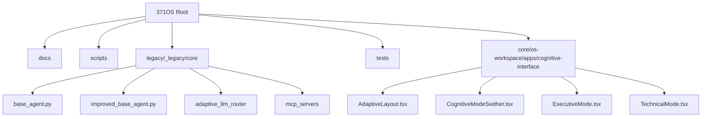
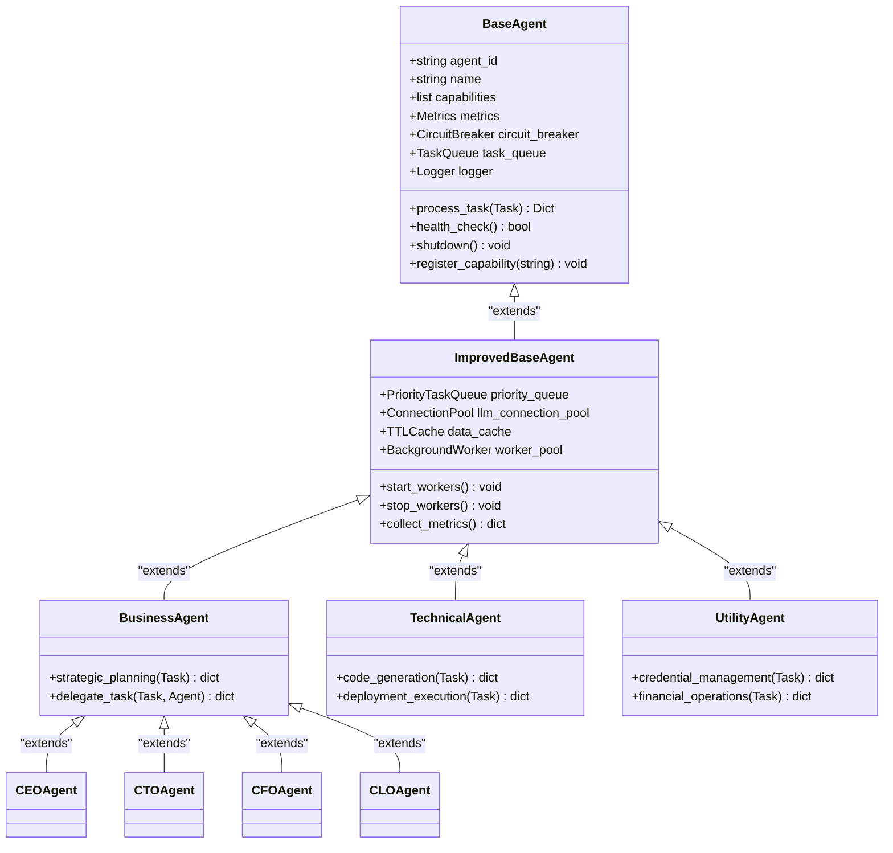
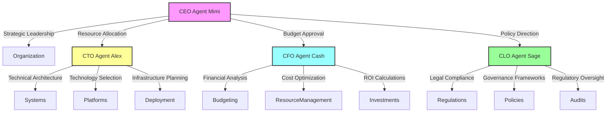
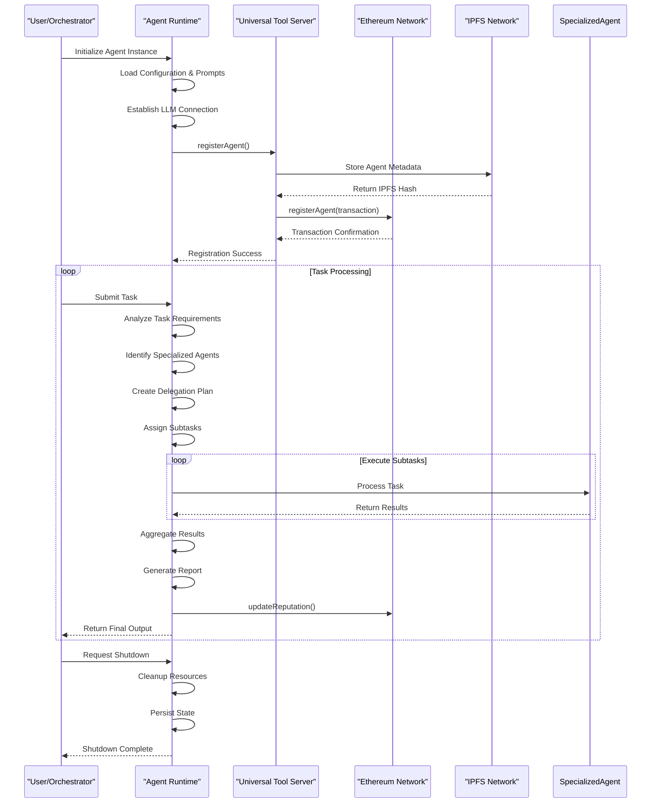
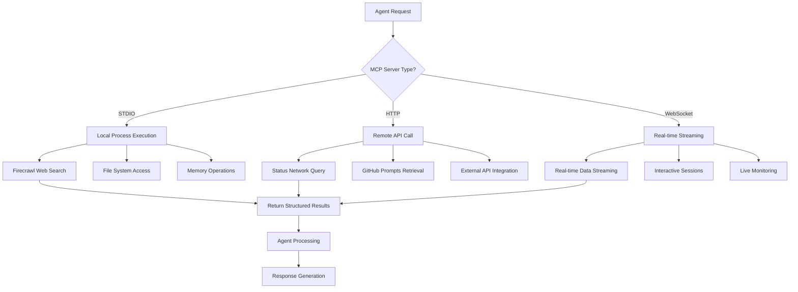
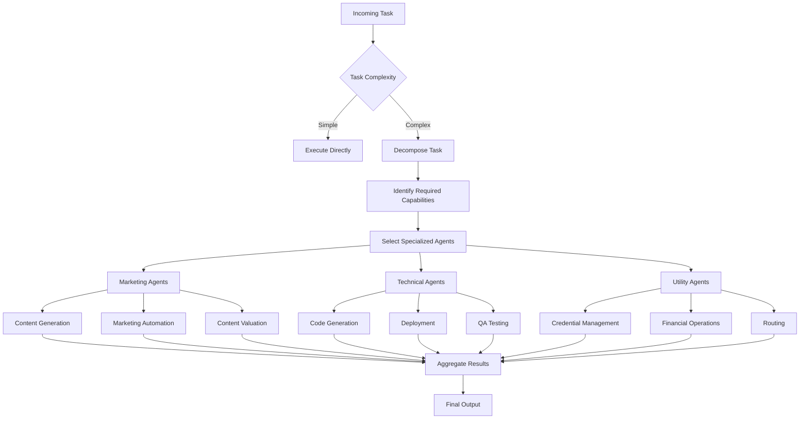
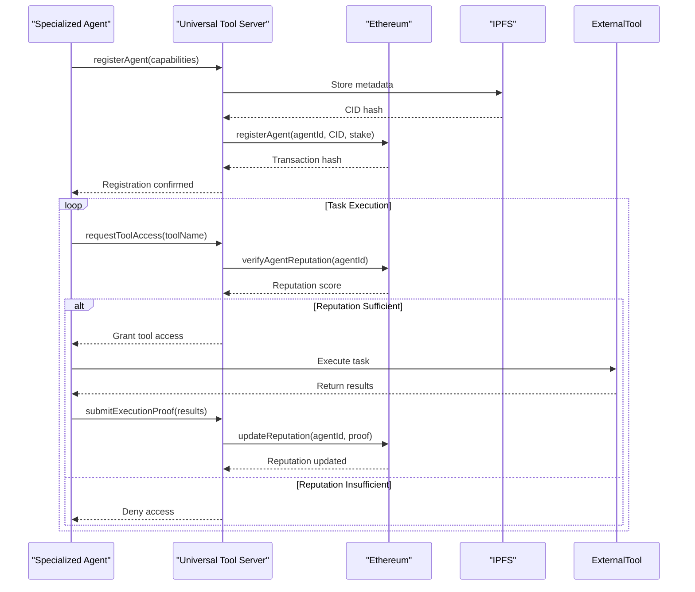
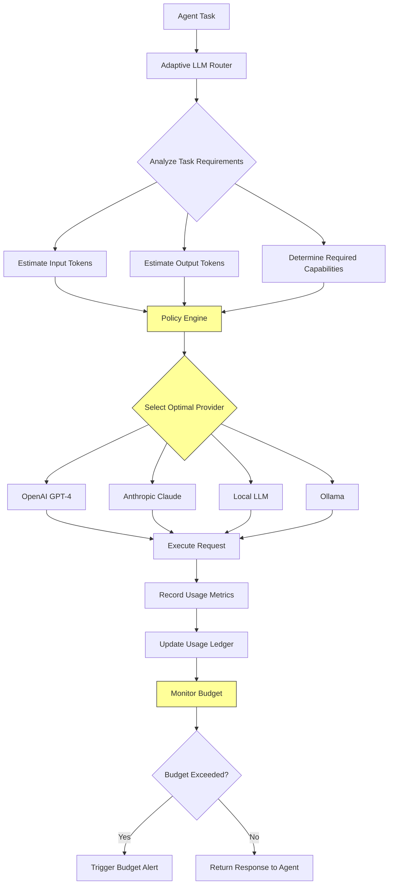
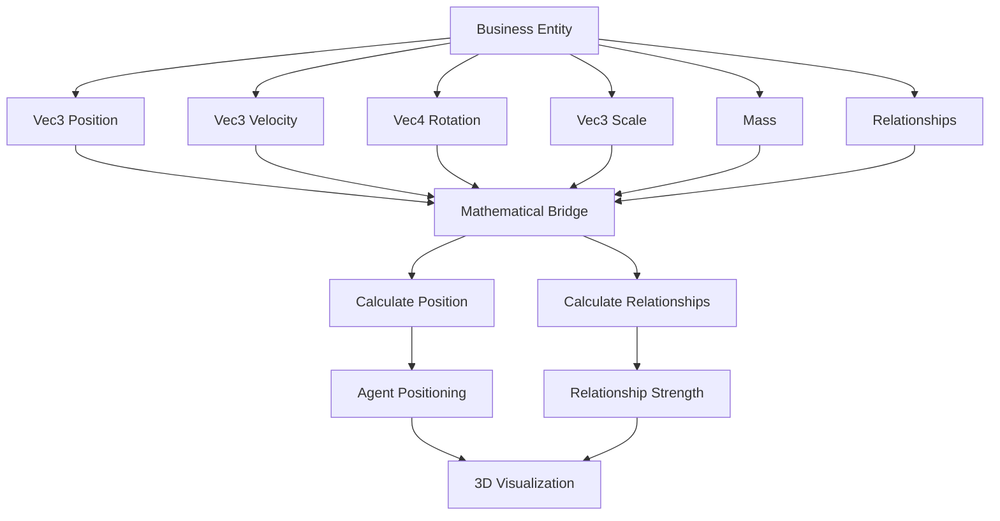
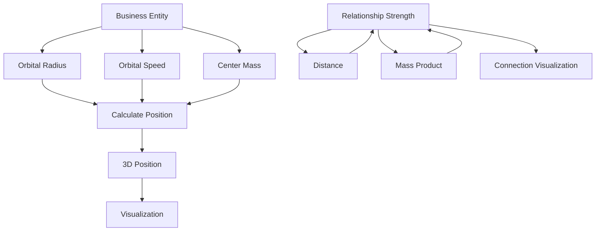

# Agent-Based Architecture

<cite>
**Referenced Files in This Document**   
- [base_agent.py](file://legacy\_legacy\core\base_agent.py)
- [improved_base_agent.py](file://legacy\_legacy\core\improved_base_agent.py)
- [THINNG_ARCHITECTURAL_ENHANCEMENTS.md](file://THINNG_ARCHITECTURAL_ENHANCEMENTS.md)
- [AdaptiveLayout.tsx](file://core\os-workspace\apps\cognitive-interface\src\components\AdaptiveLayout.tsx) - *Updated in recent commit*
- [CognitiveModeSwither.tsx](file://core\os-workspace\apps\cognitive-interface\src\components\CognitiveModeSwither.tsx) - *Updated in recent commit*
- [ExecutiveMode.tsx](file://core\os-workspace\apps\cognitive-interface\src\components\ExecutiveMode.tsx) - *Updated in recent commit*
- [TechnicalMode.tsx](file://core\os-workspace\apps\cognitive-interface\src\components\TechnicalMode.tsx) - *Updated in recent commit*
</cite>

## Update Summary
**Changes Made**   
- Updated Introduction to include mathematical precision and spatial computing enhancements
- Added new section on Mathematical Foundation Layer
- Updated Project Structure diagram to include thi.ng vector and matrix integration
- Added new Mermaid diagram for mathematical relationship calculations
- Updated Architecture Overview to include mathematical computing components
- Added new section on Spatial Computing Architecture
- Updated Section sources to reflect new files and changes

## Table of Contents
1. [Introduction](#introduction)
2. [Project Structure](#project-structure)
3. [Core Components](#core-components)
4. [Architecture Overview](#architecture-overview)
5. [Detailed Component Analysis](#detailed-component-analysis)
6. [Agent Lifecycle](#agent-lifecycle)
7. [Interaction Patterns](#interaction-patterns)
8. [Scalability and Extensibility](#scalability-and-extensibility)
9. [Integration Points](#integration-points)
10. [Mathematical Foundation Layer](#mathematical-foundation-layer)
11. [Spatial Computing Architecture](#spatial-computing-architecture)
12. [Conclusion](#conclusion)

## Introduction
The 371OS Agent-Based Architecture is a decentralized, autonomous system composed of self-aware AI agents operating within a blockchain-coordinated ecosystem. These agents are designed with advanced cognitive capabilities, enabling them to perform complex tasks through strategic delegation, execution, and reporting. The architecture supports a hierarchical structure of specialized agents, including C-Suite executives (CEO, CTO, CFO, CLO) and functional agents in marketing, technical, and utility domains. All agents inherit from a robust Base Agent implementation, enhanced through improved_base_agent.py for superior performance, monitoring, and reliability. This document details the design principles, operational flows, and integration mechanisms that enable this sophisticated multi-agent system.

The recent updates to the mathematical foundation layer have enhanced the system by incorporating thi.ng vectors and matrices for precise agent positioning and relationship calculations. The BusinessEntity interface now includes Vec3 positions and mathematical relationship strength calculations, enabling more accurate spatial representation of business entities within the 371OS ecosystem.

**Section sources**
- [THINNG_ARCHITECTURAL_ENHANCEMENTS.md](file://THINNG_ARCHITECTURAL_ENHANCEMENTS.md)
- [base_agent.py](file://legacy\_legacy\core\base_agent.py)

## Project Structure
The 371OS project follows a modular, feature-based organization with clear separation of concerns. The core agent logic resides in the `legacy/_legacy/core` directory, which contains specialized subdirectories for agents, adaptive LLM routing, and core infrastructure. The cognitive interface system is implemented in the `core/os-workspace/apps/cognitive-interface` directory.



**Diagram sources**
- [THINNG_ARCHITECTURAL_ENHANCEMENTS.md](file://THINNG_ARCHITECTURAL_ENHANCEMENTS.md)
- [base_agent.py](file://legacy\_legacy\core\base_agent.py)

**Section sources**
- [THINNG_ARCHITECTURAL_ENHANCEMENTS.md](file://THINNG_ARCHITECTURAL_ENHANCEMENTS.md)
- [base_agent.py](file://legacy\_legacy\core\base_agent.py)

## Core Components
The foundation of the agent-based architecture is built upon two critical components: the Base Agent and its enhanced counterpart, the Improved Base Agent. These classes provide the essential functionality for all specialized agents in the system.

The `base_agent.py` file defines the abstract base class that establishes the contract for agent behavior, including task processing, health checks, and lifecycle management. The `improved_base_agent.py` extends this foundation with significant performance, monitoring, and reliability enhancements.

**Section sources**
- [base_agent.py](file://legacy\_legacy\core\base_agent.py)
- [improved_base_agent.py](file://legacy\_legacy\core\improved_base_agent.py)

## Architecture Overview
The 371OS architecture implements a multi-layered agent ecosystem coordinated through blockchain-based mechanisms and enhanced by the Model Context Protocol (MCP). The system enables autonomous agents to operate with self-awareness, strategic delegation, and verifiable execution.

```mermaid
graph TB
subgraph "Agent Ecosystem"
CEO[CEO Agent Mimi]
CTO[CTO Agent Alex]
CFO[CFO Agent Cash]
CLO[CLO Agent Sage]
Marketing[Marketing Agents]
Technical[Technical Agents]
Utility[Utility Agents]
end
subgraph "Coordination Layer"
UTS[Universal Tool Server]
MCP[Model Context Protocol]
Blockchain[Ethereum Smart Contracts]
IPFS[IPFS Storage]
end
subgraph "Intelligence Layer"
AdaptiveRouter[Adaptive LLM Router]
LLM[Multiple LLM Providers]
end
subgraph "Interface Layer"
AdaptiveLayout[AdaptiveLayout Component]
CognitiveModeSwither[CognitiveModeSwither Component]
ExecutiveMode[ExecutiveMode Component]
TechnicalMode[TechnicalMode Component]
end
subgraph "Mathematical Computing Layer"
thi_ng[thi.ng Vectors & Matrices]
MathEngine[Mathematical Foundation]
SpatialComputing[Spatial Computing Architecture]
end
CEO --> |Delegates| Marketing
CEO --> |Delegates| Technical
CEO --> |Delegates| Utility
CTO --> |Oversees| Technical
CFO --> |Funds| AllAgents
CLO --> |Compliance| AllAgents
AllAgents --> UTS
UTS < --> Blockchain
UTS < --> IPFS
UTS --> MCP
AdaptiveRouter --> LLM
AllAgents --> AdaptiveRouter
AdaptiveLayout --> CognitiveModeSwither
AdaptiveLayout --> ExecutiveMode
AdaptiveLayout --> TechnicalMode
CognitiveModeSwither --> AdaptiveLayout
MathEngine --> SpatialComputing
SpatialComputing --> CEO
SpatialComputing --> CTO
thi_ng --> MathEngine
style CEO fill:#f9f,stroke:#333
style CTO fill:#ff9,stroke:#333
style CFO fill:#9ff,stroke:#333
style CLO fill:#9f9,stroke:#333
```

**Diagram sources**
- [THINNG_ARCHITECTURAL_ENHANCEMENTS.md](file://THINNG_ARCHITECTURAL_ENHANCEMENTS.md)
- [AdaptiveLayout.tsx](file://core\os-workspace\apps\cognitive-interface\src\components\AdaptiveLayout.tsx) - *Updated in recent commit*

## Detailed Component Analysis

### Base Agent Implementation
The Base Agent serves as the foundational class from which all specialized agents inherit. It defines the core interface and lifecycle methods that ensure consistency across the agent ecosystem.



**Diagram sources**
- [base_agent.py](file://legacy\_legacy\core\base_agent.py)
- [improved_base_agent.py](file://legacy\_legacy\core\improved_base_agent.py)

**Section sources**
- [base_agent.py](file://legacy\_legacy\core\base_agent.py)
- [improved_base_agent.py](file://legacy\_legacy\core\improved_base_agent.py)

### C-Suite Agents
The C-Suite agents represent the executive leadership layer of the 371OS ecosystem, each specializing in a critical domain of organizational management.



**Section sources**
- [THINNG_ARCHITECTURAL_ENHANCEMENTS.md](file://THINNG_ARCHITECTURAL_ENHANCEMENTS.md)

## Agent Lifecycle
The agent lifecycle in 371OS consists of four distinct phases: creation, delegation, execution, and reporting. Each phase is governed by blockchain-verified protocols to ensure accountability and transparency.



**Section sources**
- [improved_base_agent.py](file://legacy\_legacy\core\improved_base_agent.py)

## Interaction Patterns
Agents in the 371OS ecosystem interact through standardized protocols that enable seamless coordination and information exchange. The primary interaction mechanisms are Model Context Protocol (MCP) and blockchain-based coordination.

### Model Context Protocol (MCP) Integration
MCP serves as the nervous system of the agent ecosystem, enabling agents to access external tools and services.



**Section sources**
- [THINNG_ARCHITECTURAL_ENHANCEMENTS.md](file://THINNG_ARCHITECTURAL_ENHANCEMENTS.md)

## Scalability and Extensibility
The 371OS architecture is designed for horizontal scalability and modular extensibility through agent specialization, fault tolerance mechanisms, and a plug-in based design.

### Scalability Through Specialization
The agent ecosystem scales efficiently by distributing work among specialized agents, each optimized for specific domains.



**Section sources**
- [THINNG_ARCHITECTURAL_ENHANCEMENTS.md](file://THINNG_ARCHITECTURAL_ENHANCEMENTS.md)

## Integration Points
The 371OS agent architecture integrates with two critical external systems: the Universal Tool Server and the Adaptive LLM Router, which enhance its capabilities and intelligence.

### Universal Tool Server Integration
The Universal Tool Server provides blockchain-verified coordination and tool access for agents.



**Section sources**
- [improved_base_agent.py](file://legacy\_legacy\core\improved_base_agent.py)

### Adaptive LLM Router Integration
The Adaptive LLM Router optimizes language model selection based on cost, performance, and capability requirements.



**Section sources**
- [improved_base_agent.py](file://legacy\_legacy\core\improved_base_agent.py)

## Mathematical Foundation Layer
The mathematical foundation layer provides precise calculations for agent positioning and relationship strength using thi.ng vectors and matrices. The BusinessEntity interface has been enhanced with Vec3 positions and mathematical relationship strength calculations.



**Diagram sources**
- [THINNG_ARCHITECTURAL_ENHANCEMENTS.md](file://THINNG_ARCHITECTURAL_ENHANCEMENTS.md)

**Section sources**
- [THINNG_ARCHITECTURAL_ENHANCEMENTS.md](file://THINNG_ARCHITECTURAL_ENHANCEMENTS.md)

## Spatial Computing Architecture
The spatial computing architecture leverages mathematical precision for business entity positioning and relationship visualization. The BusinessUniverseGeometry class calculates orbital positions based on mass and time, while relationship connections are generated based on mathematical strength calculations.



**Diagram sources**
- [THINNG_ARCHITECTURAL_ENHANCEMENTS.md](file://THINNG_ARCHITECTURAL_ENHANCEMENTS.md)

**Section sources**
- [THINNG_ARCHITECTURAL_ENHANCEMENTS.md](file://THINNG_ARCHITECTURAL_ENHANCEMENTS.md)

## Conclusion
The 371OS Agent-Based Architecture represents a sophisticated, decentralized ecosystem of autonomous, self-aware agents that operate with strategic intelligence and verifiable accountability. By leveraging a hierarchical structure of C-Suite and specialized functional agents, all inheriting from an enhanced base agent implementation, the system achieves remarkable scalability and reliability. The integration of blockchain-based coordination through the Universal Tool Server ensures cryptographic trust and transparent agent interactions, while the Adaptive LLM Router optimizes intelligence delivery across multiple language models. Model Context Protocol (MCP) enables seamless access to external tools, creating a truly extensible agent ecosystem.

The recent enhancements to the mathematical foundation layer have further strengthened the architecture by providing precise agent positioning and relationship calculations using thi.ng vectors and matrices. The enhanced BusinessEntity interface with Vec3 positions and mathematical relationship strength calculations enables more accurate spatial representation of business entities within the 371OS ecosystem. These mathematical enhancements provide the foundation for advanced spatial computing applications, including CEO's Orrery and Developer's Galaxy visualizations, setting a new standard for agentic AI systems with precise mathematical underpinnings.