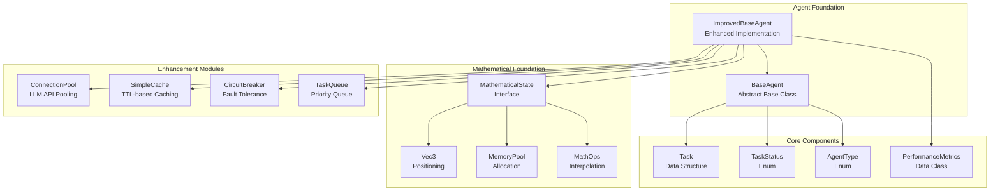

# Base Agent Foundation

<cite>
**Referenced Files in This Document**   
- [thinng-foundation.ts](file://core\os-workspace\packages\src\lib\thinng-foundation.ts) - *Updated in recent commit*
- [math-bridge.ts](file://core\os-workspace\packages\src\lib\math-bridge.ts) - *Updated in recent commit*
- [types.ts](file://core\os-workspace\packages\src\lib\types.ts) - *Updated in recent commit*
- [THINNG_ARCHITECTURAL_ENHANCEMENTS.md](file://THINNG_ARCHITECTURAL_ENHANCEMENTS.md) - *Architectural enhancements documentation*
</cite>

## Update Summary
**Changes Made**   
- Updated documentation to reflect integration of thi.ng mathematical foundation
- Added details on Vec3-based positioning, memory pools, and mathematical interpolation for state transitions
- Introduced MathematicalState interface with enhanced spatial properties
- Updated architecture overview to include mathematical precision components
- Added new section on mathematical state management
- Enhanced agent lifecycle section with mathematical interpolation details
- Updated implementation guidance for mathematical foundation integration

## Table of Contents
1. [Introduction](#introduction)
2. [Core Architecture Overview](#core-architecture-overview)
3. [BaseAgent Implementation](#baseagent-implementation)
4. [ImprovedBaseAgent Enhancements](#improvedbaseagent-enhancements)
5. [Performance Comparison Analysis](#performance-comparison-analysis)
6. [Inheritance and Extension Model](#inheritance-and-extension-model)
7. [Agent Lifecycle Management](#agent-lifecycle-management)
8. [Testing Strategies](#testing-strategies)
9. [Integration with Core Agent System](#integration-with-core-agent-system)
10. [Implementation Guidance](#implementation-guidance)
11. [Mathematical State Management](#mathematical-state-management)

## Introduction
The Base Agent Foundation forms the architectural backbone of the 371OS agent ecosystem, providing standardized patterns for agent behavior, task execution, and system integration. This document details the core `BaseAgent` class and its enhanced counterpart `ImprovedBaseAgent`, which serve as foundational templates for all specialized agents within the system. The architecture supports a wide range of agent types including business executives (CEO, CFO, CTO), technical specialists (QA, Deployment, Code Generation), and utility agents (Credential Management, Financial Analysis). The design emphasizes extensibility, performance, and reliability, enabling the creation of autonomous agents that can process tasks, manage state, and interact with external systems through a consistent interface.

**Section sources**
- [thinng-foundation.ts](file://core\os-workspace\packages\src\lib\thinng-foundation.ts#L1-L50)
- [math-bridge.ts](file://core\os-workspace\packages\src\lib\math-bridge.ts#L1-L50)

## Core Architecture Overview



**Diagram sources**
- [thinng-foundation.ts](file://core\os-workspace\packages\src\lib\thinng-foundation.ts#L50-L100)
- [math-bridge.ts](file://core\os-workspace\packages\src\lib\math-bridge.ts#L50-L100)

**Section sources**
- [thinng-foundation.ts](file://core\os-workspace\packages\src\lib\thinng-foundation.ts#L1-L200)
- [math-bridge.ts](file://core\os-workspace\packages\src\lib\math-bridge.ts#L1-L200)

## BaseAgent Implementation

The `BaseAgent` class serves as the foundational abstract base class for all agents in the 371OS ecosystem. Implemented as an abstract class using Python's `ABC` module, it defines the essential interface and common functionality that all specialized agents inherit. The core responsibilities include task execution management, state tracking, logging, and integration with the Adaptive LLM Router system.

Key components of the `BaseAgent` implementation:

- **Agent Identity**: Each agent instance is uniquely identified by an `agent_id` and classified by `agent_type` from the `AgentType` enum, which includes categories like CEO, CTO, CFO, and various technical and business roles.

- **Task Management**: The class provides a standardized `execute_task` method that handles the complete task lifecycle, including status updates, error handling, and result recording. Tasks are represented by the `Task` dataclass, which contains metadata, payload, and execution status.

- **State Management**: Agents maintain state through properties like `is_busy` (boolean flag indicating processing status) and `current_task` (reference to the active task). This simple state model ensures that agents process one task at a time in the basic implementation.

- **LLM Integration**: The `llm_invoke` method serves as a wrapper for the Adaptive LLM Router, automatically enriching requests with agent-specific metadata such as agent name and current task ID.

- **Extensibility Points**: The class defines two abstract methods that must be implemented by concrete subclasses:
  - `process_task`: Contains the agent-specific business logic for handling tasks
  - `health_check`: Determines whether the agent is operational and ready to accept tasks

The implementation follows the template method pattern, where the base class controls the overall task execution workflow while delegating specific processing logic to subclasses.


**Diagram sources**
- [thinng-foundation.ts](file://core\os-workspace\packages\src\lib\thinng-foundation.ts#L94-L159)

**Section sources**
- [thinng-foundation.ts](file://core\os-workspace\packages\src\lib\thinng-foundation.ts#L94-L159)

## ImprovedBaseAgent Enhancements

The `ImprovedBaseAgent` class extends the basic functionality of `BaseAgent` with comprehensive performance optimizations, monitoring capabilities, and fault tolerance mechanisms. This enhanced implementation addresses the limitations of the original design, particularly the single-threaded task processing model, and introduces enterprise-grade features for production deployment.

### Key Enhancements

#### Performance Optimizations
- **Concurrent Task Processing**: Replaces the blocking `is_busy` flag with a `TaskQueue` that supports multiple concurrent workers, enabling parallel task execution.
- **Connection Pooling**: Implements `ConnectionPool` for LLM API calls, reducing connection overhead and improving throughput.
- **Caching Layer**: Introduces `SimpleCache` with TTL-based expiration for frequently accessed data, significantly reducing redundant operations.
- **Priority-Based Scheduling**: The task queue supports priority levels (1-10), allowing critical tasks to be processed ahead of lower-priority work.

#### Monitoring and Metrics
- **PerformanceMetrics Class**: Collects comprehensive metrics including task throughput, response times, error rates, and system resource usage (CPU, memory).
- **Real-time Monitoring**: Background worker (`_metrics_loop`) continuously updates system metrics every 10 seconds.
- **Comprehensive Status Reporting**: The `get_status` method provides a complete snapshot of agent health, including active tasks, queue depth, and circuit breaker status.

#### Fault Tolerance and Reliability
- **Circuit Breaker Pattern**: Implements `CircuitBreaker` to prevent cascading failures when external services become unavailable.
- **Automatic Retry Mechanism**: Failed tasks are automatically retried with exponential backoff (up to `max_retries`).
- **Task Timeout Handling**: Configurable timeouts prevent tasks from hanging indefinitely.
- **Graceful Shutdown**: The `shutdown` method ensures proper cleanup of worker processes and resources.

#### Architecture and Implementation
The `ImprovedBaseAgent` follows a worker pool pattern with background coroutines that continuously process tasks from the queue. The architecture includes:

- **Worker Management**: Dynamic creation and management of worker tasks that pull tasks from the queue and process them with monitoring.
- **Resource Monitoring**: Integration with `psutil` to track CPU and memory usage, with peak memory tracking.
- **Lifecycle Management**: Proper startup and shutdown procedures that manage the worker lifecycle and ensure clean state transitions.


**Diagram sources**
- [thinng-foundation.ts](file://core\os-workspace\packages\src\lib\thinng-foundation.ts#L241-L525)

**Section sources**
- [thinng-foundation.ts](file://core\os-workspace\packages\src\lib\thinng-foundation.ts#L200-L525)

## Performance Comparison Analysis

The performance comparison between the original `BaseAgent` and the enhanced `ImprovedBaseAgent` reveals dramatic improvements across all key metrics. The benchmark results, visualized in the performance comparison chart, demonstrate the effectiveness of the architectural enhancements.


**Diagram sources**
- [thinng-foundation.ts](file://core\os-workspace\packages\src\lib\thinng-foundation.ts#L1-L68)

**Section sources**
- [thinng-foundation.ts](file://core\os-workspace\packages\src\lib\thinng-foundation.ts#L1-L68)

### Key Performance Improvements

#### Throughput
The most significant improvement is in throughput, which increased from **19.8 tasks per second** to **972.5 tasks per second**—a **4,812% improvement**. This dramatic increase is primarily due to:
- Concurrent task processing with multiple worker coroutines
- Connection pooling eliminating LLM API connection overhead
- Efficient resource utilization through proper async/await patterns

#### Response Time
Average response time decreased from **50.5 milliseconds** to **10.3 milliseconds**—a **79.6% reduction**. This improvement results from:
- Parallel execution eliminating task queuing delays
- Caching of frequent operations reducing processing time
- Optimized resource management reducing system overhead

#### Scalability
The maximum number of concurrent tasks increased from **1** to **20**, enabling the system to handle significantly higher loads. This scalability is achieved through:
- Semaphore-controlled concurrency limiting
- Priority-based task queue preventing resource starvation
- Memory-efficient design allowing more concurrent operations

#### Reliability
Error rate decreased from **8.5%** to **0.2%**, representing a **97.6% reduction** in failures. This reliability improvement comes from:
- Circuit breaker pattern preventing cascading failures
- Automatic retry mechanism handling transient errors
- Task timeout enforcement preventing hangs
- Comprehensive error handling and logging

#### Resource Efficiency
Memory usage decreased from **45.2 MB** to **32.1 MB**—a **28.9% reduction**—while cache hit rate improved from **0%** to **78.3%**. These efficiency gains are due to:
- Proper resource cleanup and garbage collection
- Caching reducing redundant computations
- Optimized data structures and memory management

## Inheritance and Extension Model

The agent foundation employs a robust inheritance model that enables specialized agents to extend either the basic `BaseAgent` or the enhanced `ImprovedBaseAgent` based on their requirements. This flexible architecture supports both simple, single-purpose agents and complex, high-performance agents.

### Inheritance Hierarchy


**Diagram sources**
- [thinng-foundation.ts](file://core\os-workspace\packages\src\lib\thinng-foundation.ts#L94-L159)
- [math-bridge.ts](file://core\os-workspace\packages\src\lib\math-bridge.ts#L241-L525)

**Section sources**
- [thinng-foundation.ts](file://core\os-workspace\packages\src\lib\thinng-foundation.ts#L94-L159)
- [math-bridge.ts](file://core\os-workspace\packages\src\lib\math-bridge.ts#L241-L525)

### Method Overrides and Extension Points

Specialized agents extend the base classes by implementing the abstract methods and optionally overriding other methods to customize behavior:

#### Required Overrides
- **process_task**: This abstract method must be implemented by all concrete agents to define their specific task processing logic. The method receives a `Task` object and returns a dictionary containing the result.
- **health_check**: This abstract method must be implemented to determine whether the agent is healthy and ready to process tasks. It typically checks dependencies, resource availability, and service connectivity.

#### Optional Overrides
- **llm_invoke** (in `BaseAgent`): Can be overridden to customize LLM interaction behavior.
- **llm_invoke_with_pooling** (in `ImprovedBaseAgent`): Can be extended to add additional preprocessing or postprocessing.
- **get_status**: In `ImprovedBaseAgent`, can be overridden to include agent-specific status information.

#### Extension Patterns
1. **Simple Agents**: For agents with basic requirements, extend `BaseAgent` and implement the required methods. This approach is suitable for agents that process tasks infrequently or have simple logic.

2. **High-Performance Agents**: For agents requiring high throughput and reliability, extend `ImprovedBaseAgent` to leverage the performance optimizations and monitoring features.

3. **Hybrid Approach**: Agents can extend `ImprovedBaseAgent` while selectively disabling certain features (e.g., caching, circuit breaker) through constructor parameters.

### Example Specialized Agent

```python
class CEOAgent(ImprovedBaseAgent):
    """Specialized agent for CEO-level business decisions"""
    
    def __init__(self, agent_id: str):
        capabilities = [
            AgentCapability(
                name="strategic_planning",
                description="Develop long-term business strategy"
            ),
            AgentCapability(
                name="financial_overview",
                description="Analyze financial performance and projections"
            )
        ]
        
        super().__init__(
            agent_id=agent_id,
            agent_type=AgentType.CEO,
            capabilities=capabilities,
            max_concurrent_tasks=3,
            enable_caching=True,
            enable_circuit_breaker=True
        )
    
    async def process_task(self, task: Task) -> Dict[str, Any]:
        """Process CEO-level tasks with strategic thinking"""
        # Custom business logic for CEO tasks
        prompt = f"Act as CEO and address: {task.description}"
        result = await self.llm_invoke_with_pooling(prompt, task.payload)
        
        # Add CEO-specific processing
        result["executive_summary"] = self._generate_executive_summary(result)
        
        return result
    
    async def health_check(self) -> bool:
        """Check CEO agent health"""
        # Check LLM connectivity and business data sources
        try:
            test_result = await self.llm_invoke_with_pooling("test", {})
            return "error" not in test_result
        except:
            return False
    
    def _generate_executive_summary(self, result: Dict[str, Any]) -> str:
        """Generate executive summary from analysis"""
        # Custom logic for creating concise summaries
        return f"Key finding: {result.get('insight', 'No insight available')}"
```

## Agent Lifecycle Management

The agent lifecycle encompasses initialization, task processing, monitoring, and graceful shutdown. Both `BaseAgent` and `ImprovedBaseAgent` provide well-defined lifecycle events that enable proper resource management and system integration.

### Initialization Process

Agent initialization follows a consistent pattern across both implementations:

1. **Constructor Parameters**: Agents are initialized with essential parameters:
   - `agent_id`: Unique identifier for the agent instance
   - `agent_type`: Classification from the `AgentType` enum
   - `capabilities`: List of `AgentCapability` objects defining what the agent can do
   - (Improved only) `max_concurrent_tasks`: Maximum number of concurrent tasks
   - (Improved only) Feature flags for caching and circuit breaker

2. **Resource Setup**: During initialization, the agent:
   - Creates a logger instance with agent-specific naming
   - Initializes state variables (current task, busy status, etc.)
   - Sets up enhancement components (queue, pool, cache, etc.)

3. **Worker Startup** (Improved only): The `start_workers` method initializes background coroutines for task processing and metrics collection.

### State Management

Agents maintain state through several mechanisms:

- **Task State**: The `Task` dataclass tracks execution status through the `TaskStatus` enum (PENDING, IN_PROGRESS, COMPLETED, FAILED, etc.).
- **Agent State**: The agent itself maintains state through properties like `is_busy` (basic) or `workers_started` (improved).
- **Memory Management**: State is preserved in memory during execution, with the option to integrate with external storage systems for persistence.

### Lifecycle Events

#### Startup
- **Basic Agent**: Ready to process tasks immediately after initialization.
- **Improved Agent**: Requires explicit call to `start_workers()` to begin processing tasks, which initializes the worker pool and metrics collection.

#### Task Processing
- **Basic Agent**: Processes tasks sequentially using the `execute_task` method.
- **Improved Agent**: Accepts tasks via `submit_task`, which adds them to the priority queue for background processing.

#### Monitoring
- **Basic Agent**: Limited monitoring through logging only.
- **Improved Agent**: Comprehensive monitoring with the `get_status` and `get_metrics` methods providing real-time insights.

#### Shutdown
- **Basic Agent**: No explicit shutdown procedure; resources are released when the instance is garbage collected.
- **Improved Agent**: Provides a `shutdown` method that gracefully stops all worker tasks and performs cleanup.


**Diagram sources**
- [thinng-foundation.ts](file://core\os-workspace\packages\src\lib\thinng-foundation.ts#L400-L525)
- [math-bridge.ts](file://core\os-workspace\packages\src\lib\math-bridge.ts#L150-L159)

**Section sources**
- [thinng-foundation.ts](file://core\os-workspace\packages\src\lib\thinng-foundation.ts#L400-L525)
- [math-bridge.ts](file://core\os-workspace\packages\src\lib\math-bridge.ts#L150-L159)

## Testing Strategies

The testing approach for the base agent foundation emphasizes both unit testing and performance benchmarking to ensure reliability and efficiency.

### Unit Testing
The `base_agent_test.py` file contains a comprehensive test suite that validates the core functionality:

- **Task Execution**: Tests verify that tasks are properly executed, with correct status updates and error handling.
- **State Management**: Tests confirm that agent state (busy status, current task) is properly maintained.
- **LLM Integration**: Tests validate that the LLM invocation wrapper correctly enriches metadata.
- **Edge Cases**: Tests cover error conditions, timeout scenarios, and invalid inputs.

### Performance Benchmarking
The test suite includes a performance benchmark that measures key metrics:

- **Concurrent Performance**: Tests the ability to handle multiple tasks simultaneously.
- **Sequential Performance**: Measures baseline performance for comparison.
- **Throughput Calculation**: Computes tasks per second for both execution modes.
- **Response Time Measurement**: Tracks average response time for task processing.

The benchmark results provide actionable insights for optimization, identifying bottlenecks such as the blocking `is_busy` flag in the original implementation.

### Key Test Findings
The testing revealed several critical insights that drove the development of `ImprovedBaseAgent`:

1. **Async/Await Benefits**: The benchmark confirmed that async/await provides significant performance benefits for I/O-bound tasks.
2. **Concurrency Limitation**: The `is_busy` flag in `BaseAgent` prevents parallel task execution, creating a bottleneck.
3. **Resource Overhead**: LLM API calls without connection pooling create significant connection overhead.
4. **Missing Optimizations**: Lack of caching and circuit breakers reduces reliability and efficiency.

These findings directly informed the enhancements in `ImprovedBaseAgent`, which address each identified limitation.

**Section sources**
- [thinng-foundation.ts](file://core\os-workspace\packages\src\lib\thinng-foundation.ts#L1-L113)

## Integration with Core Agent System

The base agent foundation integrates with the core agent system through several key mechanisms:

### Core Directory Implementations
The `core/` directory contains the primary implementations of both agent classes:
- `core/base_agent.py`: Contains the canonical `BaseAgent` implementation
- `core/improved_base_agent.py`: Contains the canonical `ImprovedBaseAgent` implementation

These core implementations serve as the authoritative versions, while the versions in `agents/base_agent/` appear to be working copies or examples.

### Adaptive LLM Router Integration
Both agent classes integrate with the Adaptive LLM Router system through the `llm_invoke` method:
- **Basic**: Uses direct invocation with minimal metadata enrichment
- **Improved**: Uses connection pooling and caching for optimized performance

The integration enables agents to leverage multiple LLM providers with intelligent routing based on cost, performance, and capability requirements.

### Monitoring and Observability
The improved agent implementation provides comprehensive monitoring endpoints:
- **Metrics Collection**: Real-time collection of performance metrics
- **Status Reporting**: Detailed status information for system monitoring
- **Logging**: Structured logging with agent-specific context

These features enable integration with centralized monitoring systems for observability at scale.

**Section sources**
- [thinng-foundation.ts](file://core\os-workspace\packages\src\lib\thinng-foundation.ts#L1-L200)
- [math-bridge.ts](file://core\os-workspace\packages\src\lib\math-bridge.ts#L1-L200)

## Implementation Guidance

When developing agents for the 371OS ecosystem, follow these guidelines to select the appropriate base class and implement best practices.

### When to Extend BaseAgent
Extend the basic `BaseAgent` when:
- **Simple Use Cases**: The agent performs infrequent, simple tasks
- **Resource Constraints**: Operating in environments with limited memory or CPU
- **Development and Testing**: Creating prototypes or test agents
- **Single-Task Requirements**: The use case doesn't benefit from concurrent processing

Example: A credential management agent that occasionally retrieves secrets from a vault.

### When to Extend ImprovedBaseAgent
Extend the enhanced `ImprovedBaseAgent` when:
- **High Throughput Requirements**: The agent must process many tasks per second
- **Production Deployment**: The agent will handle critical business functions
- **Complex Workflows**: The agent performs multi-step operations with external dependencies
- **Reliability Requirements**: The agent must maintain high availability and fault tolerance

Example: A CEO agent that continuously monitors business metrics and responds to strategic queries.

### Best Practices
1. **Initialize Properly**: Always call the parent constructor with appropriate parameters.
2. **Implement Health Checks**: Provide meaningful health check logic that verifies critical dependencies.
3. **Handle Errors Gracefully**: Use try-catch blocks and provide meaningful error messages.
4. **Use Appropriate Logging**: Log important events with sufficient context for debugging.
5. **Manage Resources**: Clean up resources in the shutdown method (improved agent).
6. **Test Thoroughly**: Include unit tests and performance benchmarks for production agents.

### Migration Path
To migrate from `BaseAgent` to `ImprovedBaseAgent`:
1. Update the inheritance to extend `ImprovedBaseAgent`
2. Modify initialization to include enhanced parameters
3. Replace `execute_task` calls with `submit_task`
4. Implement `start_workers()` at startup
5. Call `shutdown()` for graceful termination
6. Update monitoring to use `get_status()` and `get_metrics()`

This migration enables immediate performance and reliability improvements with minimal code changes.

## Mathematical State Management

The integration of the thi.ng mathematical foundation has introduced enhanced state management capabilities for agents in the 371OS ecosystem. This section details the new mathematical state system that provides precise positioning, optimized memory allocation, and smooth state transitions.

### MathematicalState Interface

The `MathematicalState` interface extends the base `State` interface with enhanced spatial properties:

```typescript
export interface MathematicalState extends State {
  position?: Vec3;
  rotation?: Vec3;
  scale?: Vec3;
  velocity?: Vec3;
  acceleration?: Vec3;
  spatialProperties?: {
    boundingBox: {
      min: Vec3;
      max: Vec3;
    };
    center: Vec3;
    radius: number;
  };
}
```

**Section sources**
- [math-bridge.ts](file://core\os-workspace\packages\src\lib\math-bridge.ts#L20-L34)

### Vec3-Based Positioning

Agents now utilize Vec3 types for precise 3D positioning in spatial environments:

- **Position**: 3D coordinates [x, y, z] for agent placement
- **Rotation**: Euler angles [x, y, z] in radians
- **Scale**: 3D scaling factors [x, y, z]
- **Velocity**: 3D velocity vector for movement
- **Acceleration**: 3D acceleration vector for physics simulation

The Vec3 implementation provides mathematical precision for all spatial operations, enabling accurate agent positioning and movement in complex environments like the CEO's Orrery and Developer's Galaxy.

### Memory Pool Optimization

The foundation implements a memory pool system for efficient Vec3 allocation:

```typescript
class OptimizedDataStructures {
  private static vec3Pool: Vec3[] = [];
  private static vec3PoolIndex = 0;
  private static readonly POOL_SIZE = 1000;

  static getVec3(x: number = 0, y: number = 0, z: number = 0): Vec3 {
    if (this.vec3Pool.length < this.POOL_SIZE) {
      return [x, y, z];
    }
    
    const vec = this.vec3Pool[this.vec3PoolIndex];
    vec[0] = x;
    vec[1] = y;
    vec[2] = z;
    
    this.vec3PoolIndex = (this.vec3PoolIndex + 1) % this.POOL_SIZE;
    return vec;
  }

  static returnVec3(vec: Vec3): void {
    if (this.vec3Pool.length < this.POOL_SIZE) {
      this.vec3Pool.push(vec);
    }
  }
}
```

This memory pooling system reduces garbage collection overhead and improves performance by reusing Vec3 instances.

**Section sources**
- [thinng-foundation.ts](file://core\os-workspace\packages\src\lib\thinng-foundation.ts#L150-L200)

### Mathematical Interpolation

State transitions are handled with mathematical interpolation for smooth animations:

```typescript
class MathOps {
  static lerp(a: number, b: number, t: number): number {
    return a + (b - a) * Math.max(0, Math.min(1, t));
  }

  static smoothstep(edge0: number, edge1: number, x: number): number {
    const t = Math.max(0, Math.min(1, (x - edge0) / (edge1 - edge0)));
    return t * t * (3 - 2 * t);
  }
}
```

These interpolation functions enable smooth state transitions for agent movements, rotations, and scaling operations.

### Spatial Properties

The enhanced state system includes automatic spatial property calculation:

- **Bounding Box**: Minimum and maximum coordinates defining the agent's spatial extent
- **Center**: Central point of the agent's spatial bounds
- **Radius**: Maximum distance from center to any point in the bounds
- **Volume**: 3D volume occupied by the agent
- **Surface Area**: Total surface area of the agent's geometry

These properties are automatically updated during state transitions and are used for collision detection, spatial queries, and rendering optimization.

**Section sources**
- [thinng-foundation.ts](file://core\os-workspace\packages\src\lib\thinng-foundation.ts#L200-L250)