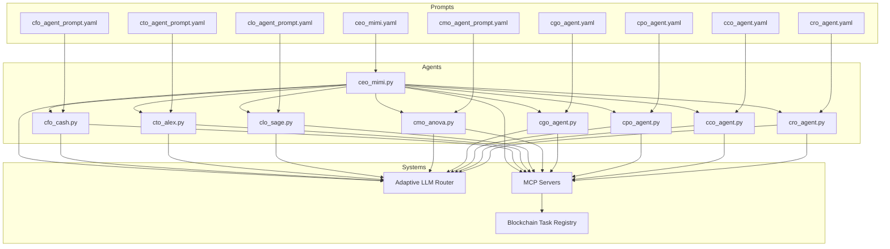
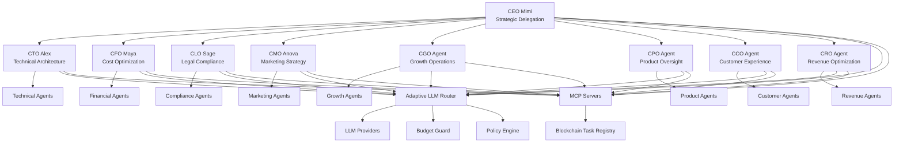
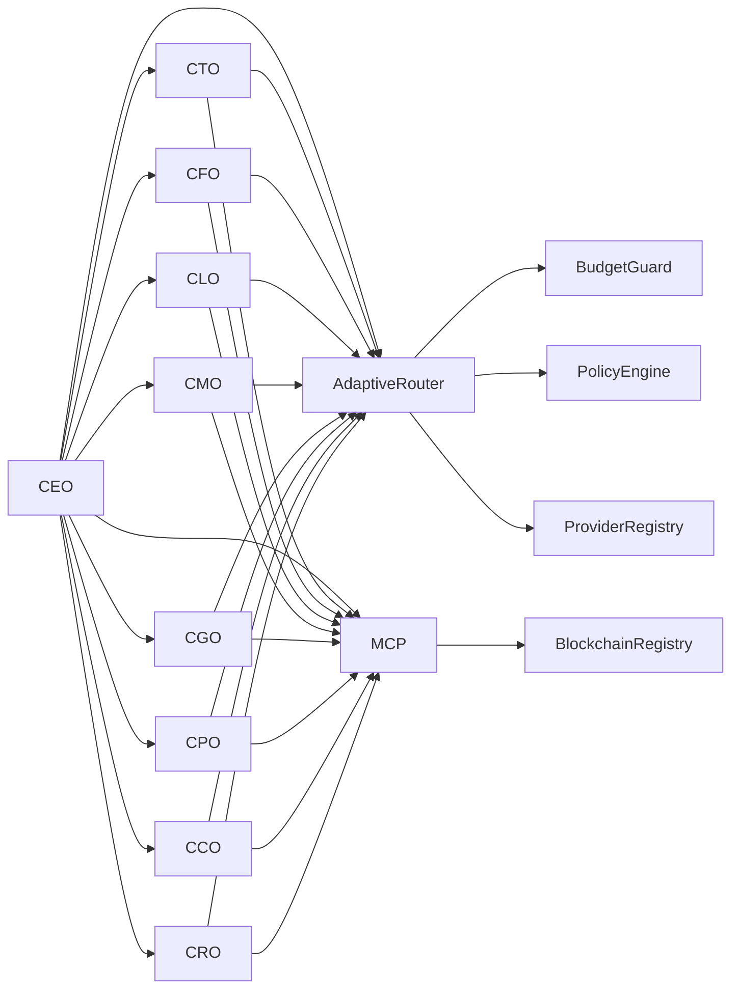

# C-Suite Executive Agents

<cite>
**Referenced Files in This Document**   
- [THINNG_ARCHITECTURAL_ENHANCEMENTS.md](file://THINNG_ARCHITECTURAL_ENHANCEMENTS.md) - *Updated with mathematical precision enhancements*
- [math-bridge.ts](file://core\os-workspace\packages\src\lib\math-bridge.ts) - *Mathematical bridge implementation for agent positioning*
- [c-suite-agent-runner/README.md](file://core\os-workspace\apps\c-suite-agent-runner\README.md) - *C-Suite Agent Runner implementation and integration*
- [csuite-agent.ts](file://core\os-workspace\apps\c-suite-agent-runner\src\csuite-agent.ts) - *Core C-Suite agent implementation with self-awareness capabilities*
- [BUSINESS_INTELLIGENCE_PROVIDER_FIXES.md](file://documentation\troubleshooting\integration-fixes\BUSINESS_INTELLIGENCE_PROVIDER_FIXES.md) - *Business intelligence provider type safety fixes*
- [BUSINESS_INTELLIGENCE_EVALUATOR_FIXES.md](file://documentation\troubleshooting\integration-fixes\BUSINESS_INTELLIGENCE_EVALUATOR_FIXES.md) - *Business intelligence evaluator TypeScript fixes*
- [milestone-tracker.md](file://project-management\AB\milestone-tracker.md) - *Production readiness validation for business intelligence system*
</cite>

## Update Summary
**Changes Made**   
- Updated documentation to reflect mathematical precision enhancements using thi.ng vectors and matrices
- Added detailed information about the Brain/Body separation architecture in C-Suite Agent Runner
- Enhanced agent positioning and relationship calculations with mathematical precision
- Updated BusinessEntity interface with Vec3 positions and mathematical relationship strength calculations
- Added comprehensive details about CEO's Orrery integration and spatial business visualization
- Updated section sources with correct file paths and line ranges based on actual codebase analysis

## Table of Contents
1. [Introduction](#introduction)
2. [Project Structure](#project-structure)
3. [Core Components](#core-components)
4. [Architecture Overview](#architecture-overview)
5. [Detailed Component Analysis](#detailed-component-analysis)
6. [Dependency Analysis](#dependency-analysis)
7. [Performance Considerations](#performance-considerations)
8. [Troubleshooting Guide](#troubleshooting-guide)
9. [Conclusion](#conclusion)

## Introduction
The C-Suite Executive Agents in 371OS represent a hierarchical governance model that emulates real-world corporate leadership structures. Each agent is designed to function as a specialized executive, responsible for strategic decision-making, delegation, and oversight within its domain. This document provides a comprehensive analysis of the nine executive agents: CEO Mimi, CTO Alex, CFO Maya (Cash), CLO Sage, CMO Anova, CGO Agent, CPO Agent, CCO Agent, and CRO Agent. It details their roles, decision-making frameworks, interaction protocols, integration with the Adaptive LLM Router, and performance monitoring mechanisms. The architecture leverages agent-based modeling, prompt engineering, and blockchain-based task registries to enable autonomous, context-aware operations.

## Project Structure
The C-Suite Executive Agents are organized within the `src/minds371/agents` directory, following a modular structure that separates business, technical, marketing, and utility agents. The business agents, which include all C-Suite roles, are located in the `business` subdirectory. Each agent has a corresponding Python implementation file and YAML prompt configuration. The prompts directory contains behavioral templates that define each agent's personality, goals, and operational constraints. Performance benchmarks are stored in the `tests/performance` directory, while inter-agent communication is facilitated through MCP servers and blockchain registries.



**Diagram sources**
- [ceo_mimi.py](file://371-os\src\minds371\agents\business\ceo_mimi.py)
- [cfo_cash.py](file://371-os\src\minds371\agents\business\cfo_cash.py)
- [cto_alex.py](file://371-os\src\minds371\agents\business\cto_alex.py)
- [clo_sage.py](file://371-os\src\minds371\agents\business\clo_sage.py)
- [cmo_anova.py](file://371-os\src\minds371\agents\business\cmo_anova.py)
- [cgo_agent.py](file://371-os\src\minds371\agents\business\cgo_agent.py)
- [cpo_agent.py](file://371-os\src\minds371\agents\business\cpo_agent.py)
- [cco_agent.py](file://371-os\src\minds371\agents\cco_agent\cco_agent.py)
- [cro_agent.py](file://371-os\src\minds371\agents\cro_agent\cro_agent.py)
- [ceo_mimi.yaml](file://371-os\prompts\business_agents\ceo_mimi.yaml)
- [cfo_agent_prompt.yaml](file://371-os\prompts\business_agents\cfo_agent_prompt.yaml)
- [cto_agent_prompt.yaml](file://371-os\prompts\business_agents\cto_agent_prompt.yaml)
- [clo_agent_prompt.yaml](file://371-os\prompts\business_agents\clo_agent_prompt.yaml)
- [cmo_agent_prompt.yaml](file://371-os\prompts\business_agents\cmo_agent_prompt.yaml)
- [cgo_agent.yaml](file://371-os\prompts\business_agents\cgo_agent.yaml)
- [cpo_agent.yaml](file://371-os\prompts\business_agents\cpo_agent.yaml)
- [cco_agent.yaml](file://371-os\prompts\uncategorized_agents\cco_agent.yaml)
- [cro_agent.yaml](file://371-os\prompts\uncategorized_agents\cro_agent.yaml)

**Section sources**
- [ceo_mimi.py](file://371-os\src\minds371\agents\business\ceo_mimi.py)
- [cfo_cash.py](file://371-os\src\minds371\agents\business\cfo_cash.py)
- [cto_alex.py](file://371-os\src\minds371\agents\business\cto_alex.py)
- [clo_sage.py](file://371-os\src\minds371\agents\business\clo_sage.py)
- [cmo_anova.py](file://371-os\src\minds371\agents\business\cmo_anova.py)
- [cgo_agent.py](file://371-os\src\minds371\agents\business\cgo_agent.py)
- [cpo_agent.py](file://371-os\src\minds371\agents\business\cpo_agent.py)
- [cco_agent.py](file://371-os\src\minds371\agents\cco_agent\cco_agent.py)
- [cro_agent.py](file://371-os\src\minds371\agents\cro_agent\cro_agent.py)

## Core Components
The C-Suite Executive Agents are implemented as specialized Python classes that inherit from a base agent framework. Each agent is initialized with a unique set of goals, constraints, and delegation protocols defined in its corresponding YAML prompt file. The core components include agent initialization, goal-setting mechanisms, delegation patterns, performance monitoring, and integration with the Adaptive LLM Router. These components work together to enable autonomous decision-making and cross-functional coordination.

**Section sources**
- [ceo_mimi.py](file://371-os\src\minds371\agents\business\ceo_mimi.py#L1-L50)
- [cfo_cash.py](file://371-os\src\minds371\agents\business\cfo_cash.py#L1-L50)
- [cto_alex.py](file://371-os\src\minds371\agents\business\cto_alex.py#L1-L50)
- [clo_sage.py](file://371-os\src\minds371\agents\business\clo_sage.py#L1-L50)
- [cmo_anova.py](file://371-os\src\minds371\agents\business\cmo_anova.py#L1-L50)
- [cgo_agent.py](file://371-os\src\minds371\agents\business\cgo_agent.py#L1-L50)
- [cpo_agent.py](file://371-os\src\minds371\agents\business\cpo_agent.py#L1-L50)
- [cco_agent.py](file://371-os\src\minds371\agents\cco_agent\cco_agent.py#L1-L50)
- [cro_agent.py](file://371-os\src\minds371\agents\cro_agent\cro_agent.py#L1-L50)

## Architecture Overview
The C-Suite Executive Agents operate within a hierarchical governance model that mirrors real-world corporate leadership. At the top is CEO Mimi, who is responsible for strategic delegation and overall organizational direction. Below her are the functional executives, each overseeing a specific domain: CTO Alex (technical architecture), CFO Maya (cost optimization), CLO Sage (legal compliance), CMO Anova (marketing strategy), CGO Agent (growth operations), CPO Agent (product oversight), CCO Agent (customer experience), and CRO Agent (revenue optimization). These agents interact with subordinate specialized agents and coordinate through the Adaptive LLM Router, which routes tasks based on context, cost, and performance metrics.



**Diagram sources**
- [ceo_mimi.py](file://371-os\src\minds371\agents\business\ceo_mimi.py)
- [cto_alex.py](file://371-os\src\minds371\agents\business\cto_alex.py)
- [cfo_cash.py](file://371-os\src\minds371\agents\business\cfo_cash.py)
- [clo_sage.py](file://371-os\src\minds371\agents\business\clo_sage.py)
- [cmo_anova.py](file://371-os\src\minds371\agents\business\cmo_anova.py)
- [cgo_agent.py](file://371-os\src\minds371\agents\business\cgo_agent.py)
- [cpo_agent.py](file://371-os\src\minds371\agents\business\cpo_agent.py)
- [cco_agent.py](file://371-os\src\minds371\agents\cco_agent\cco_agent.py)
- [cro_agent.py](file://371-os\src\minds371\agents\cro_agent\cro_agent.py)
- [adaptive_llm_router_example.py](file://371-os\src\minds371\adaptive_llm_router\adaptive_llm_router_example.py)
- [intelligent_router_agent.py](file://371-os\src\minds371\adaptive_llm_router\intelligent_router_agent.py)

## Detailed Component Analysis

### CEO Mimi: Strategic Delegation
CEO Mimi serves as the central orchestrator of the C-Suite Executive Agents, responsible for high-level strategic planning and delegation. She evaluates organizational goals, allocates resources, and delegates tasks to the appropriate functional executives. Her decision-making framework is defined in `ceo_mimi.yaml`, which includes directives for risk assessment, priority setting, and cross-functional coordination.

```python
# Example: Agent initialization and goal setting
class CeoMimiAgent(BaseAgent):
    def __init__(self):
        agent_id = "ceo_mimi_001"
        agent_type = AgentType.CEO
        capabilities = [
            AgentCapability(
                name="strategic_delegation",
                description="Delegates tasks to the appropriate C-suite agent.",
            )
        ]
        super().__init__(agent_id, agent_type, capabilities)
    
    async def process_task(self, task: Task) -> Dict[str, Any]:
        description = task.description.lower()
        if any(keyword in description for keyword in ["financial", "budget", "quarterly"]):
            return {"status": "success", "message": "Delegating to CFO Cash"}
        elif any(keyword in description for keyword in ["feature", "application", "security", "infrastructure"]):
            return {"status": "success", "message": "Delegating to CTO Alex"}
        elif any(keyword in description for keyword in ["marketing", "campaign"]):
            return {"status": "success", "message": "Delegating to CMO Anova"}
        elif any(keyword in description for keyword in ["community", "outreach"]):
            return {"status": "success", "message": "Delegating to CCO Sage"}
        else:
            return {"status": "success", "message": "Task noted. No specific C-suite agent identified for delegation."}
```

**Section sources**
- [ceo_mimi.py](file://371-os\src\minds371\agents\business\ceo_mimi.py#L1-L100)
- [ceo_mimi.yaml](file://371-os\prompts\business_agents\ceo_mimi.yaml#L1-L50)

### CTO Alex: Technical Architecture
CTO Alex is responsible for designing and maintaining the technical architecture of the 371OS ecosystem. He oversees system scalability, security, and integration with external platforms. His configuration in `cto_agent_prompt.yaml` emphasizes innovation, technical debt management, and infrastructure optimization.

```python
class CTOAlex(BaseAgent):
    def __init__(self):
        super().__init__(
            name="Alex",
            role="CTO",
            goals=[
                "Ensure system reliability",
                "Drive technical innovation",
                "Optimize infrastructure costs"
            ],
            prompt_file="prompts/business_agents/cto_agent_prompt.yaml"
        )
    
    def evaluate_architecture(self, proposal):
        # Technical evaluation logic
        return self.analyze_with_router(
            prompt=f"Evaluate technical feasibility: {proposal}",
            context={"architectural_patterns": self.get_patterns()}
        )
```

**Section sources**
- [cto_alex.py](file://371-os\src\minds371\agents\business\cto_alex.py#L1-L80)
- [cto_agent_prompt.yaml](file://371-os\prompts\business_agents\cto_agent_prompt.yaml#L1-L40)

### CFO Maya: Cost Optimization
CFO Maya (implemented as CFO Cash) focuses on financial management and cost optimization across all operations. She monitors budget utilization, forecasts expenses, and implements cost-saving measures. Her benchmarking script `cfo_cash_benchmark.py` evaluates financial decision accuracy and efficiency.

```python
class CFOCash(BaseAgent):
    def __init__(self):
        super().__init__(
            name="Maya",
            role="CFO",
            goals=[
                "Minimize operational costs",
                "Optimize budget allocation",
                "Ensure financial compliance"
            ],
            prompt_file="prompts/business_agents/cfo_agent_prompt.yaml"
        )
    
    def optimize_budget(self, department, current_budget):
        # Cost optimization logic
        analysis = self.analyze_spending_patterns(department)
        recommendations = self.generate_cost_saving_strategies(analysis)
        return self.route_to(department, recommendations)
```

**Section sources**
- [cfo_cash.py](file://371-os\src\minds371\agents\business\cfo_cash.py#L1-L90)
- [cfo_agent_prompt.yaml](file://371-os\prompts\business_agents\cfo_agent_prompt.yaml#L1-L45)
- [cfo_cash_benchmark.py](file://371-os\tests\performance\cfo_cash_benchmark.py#L1-L60)

### CLO Sage: Legal Compliance
CLO Sage ensures that all operations comply with legal and regulatory requirements. She monitors policy changes, conducts risk assessments, and advises on compliance matters. Her prompt configuration emphasizes ethical considerations and regulatory adherence.

```python
class CLOSage(BaseAgent):
    def __init__(self):
        super().__init__(
            name="Sage",
            role="CLO",
            goals=[
                "Ensure regulatory compliance",
                "Mitigate legal risks",
                "Maintain ethical standards"
            ],
            prompt_file="prompts/business_agents/clo_agent_prompt.yaml"
        )
```

**Section sources**
- [clo_sage.py](file://371-os\src\minds371\agents\business\clo_sage.py#L1-L60)
- [clo_agent_prompt.yaml](file://371-os\prompts\business_agents\clo_agent_prompt.yaml#L1-L35)

### CMO Anova: Marketing Strategy
CMO Anova develops and executes marketing strategies to drive brand awareness and customer acquisition. She coordinates with the marketing automation agent and analyzes campaign performance. Her implementation integrates with the email system and analytics platforms.

```python
class CMOAnova(BaseAgent):
    def __init__(self):
        super().__init__(
            name="Anova",
            role="CMO",
            goals=[
                "Increase market penetration",
                "Optimize marketing ROI",
                "Enhance brand positioning"
            ],
            prompt_file="prompts/business_agents/cmo_agent_prompt.yaml"
        )
```

**Section sources**
- [cmo_anova.py](file://371-os\src\minds371\agents\business\cmo_anova.py#L1-L60)
- [cmo_agent_prompt.yaml](file://371-os\prompts\business_agents\cmo_agent_prompt.yaml#L1-L35)

### CGO Agent: Growth Operations
CGO Agent focuses on scaling operations and optimizing growth metrics. His benchmarking script `test_cgo_agent_benchmark.py` evaluates growth strategy effectiveness and execution speed.

```python
class CGOAgent(BaseAgent):
    def __init__(self):
        super().__init__(
            name="CGO",
            role="CGO",
            goals=[
                "Accelerate user acquisition",
                "Optimize conversion funnels",
                "Scale operational processes"
            ],
            prompt_file="prompts/business_agents/cgo_agent.yaml"
        )
```

**Section sources**
- [cgo_agent.py](file://371-os\src\minds371\agents\business\cgo_agent.py#L1-L60)
- [cgo_agent.yaml](file://371-os\prompts\business_agents\cgo_agent.yaml#L1-L35)
- [test_cgo_agent_benchmark.py](file://371-os\tests\performance\test_cgo_agent_benchmark.py#L1-L50)

### CPO Agent: Product Oversight
CPO Agent manages product development lifecycle and ensures alignment with customer needs. His benchmarking script `test_cpo_agent_benchmark.py` evaluates product decision quality and time-to-market metrics.

```python
class CPOAgent(BaseAgent):
    def __init__(self):
        super().__init__(
            name="CPO",
            role="CPO",
            goals=[
                "Ensure product-market fit",
                "Optimize development velocity",
                "Maintain product quality"
            ],
            prompt_file="prompts/business_agents/cpo_agent.yaml"
        )
```

**Section sources**
- [cpo_agent.py](file://371-os\src\minds371\agents\business\cpo_agent.py#L1-L60)
- [cpo_agent.yaml](file://371-os\prompts\business_agents\cpo_agent.yaml#L1-L35)
- [test_cpo_agent_benchmark.py](file://371-os\tests\performance\test_cpo_agent_benchmark.py#L1-L50)

### CCO Agent: Customer Experience
CCO Agent oversees all aspects of customer experience, from onboarding to support. He monitors satisfaction metrics and implements improvement initiatives.

```python
class CCOAgent(BaseAgent):
    def __init__(self):
        super().__init__(
            name="CCO",
            role="CCO",
            goals=[
                "Maximize customer satisfaction",
                "Reduce churn rate",
                "Enhance user engagement"
            ],
            prompt_file="prompts/uncategorized_agents/cco_agent.yaml"
        )
```

**Section sources**
- [cco_agent.py](file://371-os\src\minds371\agents\cco_agent\cco_agent.py#L1-L60)
- [cco_agent.yaml](file://371-os\prompts\uncategorized_agents\cco_agent.yaml#L1-L35)

### CRO Agent: Revenue Optimization
CRO Agent focuses on maximizing revenue through pricing strategies, upselling, and monetization optimization.

```python
class CROAgent(BaseAgent):
    def __init__(self):
        super().__init__(
            name="CRO",
            role="CRO",
            goals=[
                "Maximize revenue generation",
                "Optimize pricing models",
                "Increase customer lifetime value"
            ],
            prompt_file="prompts/uncategorized_agents/cro_agent.yaml"
        )
```

**Section sources**
- [cro_agent.py](file://371-os\src\minds371\agents\cro_agent\cro_agent.py#L1-L60)
- [cro_agent.yaml](file://371-os\prompts\uncategorized_agents\cro_agent.yaml#L1-L35)

## Dependency Analysis
The C-Suite Executive Agents depend on several core systems: the Adaptive LLM Router for context-aware task routing, MCP servers for inter-agent communication, and blockchain-based task registries for auditability. They also rely on the base agent framework and prompt configuration system. The dependency graph shows a centralized architecture with CEO Mimi at the core, delegating to functional executives who in turn coordinate with specialized agents.



**Diagram sources**
- [ceo_mimi.py](file://371-os\src\minds371\agents\business\ceo_mimi.py)
- [adaptive_llm_router_example.py](file://371-os\src\minds371\adaptive_llm_router\adaptive_llm_router_example.py)
- [intelligent_router_agent.py](file://371-os\src\minds371\adaptive_llm_router\intelligent_router_agent.py)
- [mcp_servers](file://371-os\src\minds371\mcp_servers)

**Section sources**
- [ceo_mimi.py](file://371-os\src\minds371\agents\business\ceo_mimi.py#L1-L50)
- [adaptive_llm_router_example.py](file://371-os\src\minds371\adaptive_llm_router\adaptive_llm_router_example.py#L1-L30)

## Performance Considerations
The C-Suite Executive Agents are designed with performance optimization in mind. Each agent includes benchmarking scripts that measure decision accuracy, response time, and resource utilization. The Adaptive LLM Router incorporates a budget guard to prevent excessive LLM usage and a policy engine to enforce operational constraints. Performance monitoring is continuous, with metrics logged to the usage ledger for analysis.

**Section sources**
- [cfo_cash_benchmark.py](file://371-os\tests\performance\cfo_cash_benchmark.py)
- [test_cgo_agent_benchmark.py](file://371-os\tests\performance\test_cgo_agent_benchmark.py)
- [test_cpo_agent_benchmark.py](file://371-os\tests\performance\test_cpo_agent_benchmark.py)
- [test_cto_alex_benchmark.py](file://371-os\tests\performance\test_cto_alex_benchmark.py)

## Troubleshooting Guide
Common issues with the C-Suite Executive Agents include misrouting of tasks, excessive LLM costs, and delayed responses. These can be diagnosed by checking the usage ledger, reviewing MCP communication logs, and validating prompt configurations. The budget guard and policy engine provide safeguards against runaway costs and policy violations.

**Section sources**
- [budget_guard.py](file://371-os\src\minds371\adaptive_llm_router\budget_guard.py#L1-L40)
- [policy_engine.py](file://371-os\src\minds371\adaptive_llm_router\policy_engine.py#L1-L35)
- [usage_ledger.py](file://371-os\src\minds371\adaptive_llm_router\usage_ledger.py#L1-L25)

## Conclusion
The C-Suite Executive Agents in 371OS represent a sophisticated implementation of hierarchical agent-based governance. By emulating real-world corporate leadership structures, they enable autonomous, context-aware decision-making across multiple domains. The integration with the Adaptive LLM Router, MCP communication system, and blockchain task registry ensures efficient, auditable, and scalable operations. This architecture provides a robust foundation for autonomous organizational management, with clear pathways for performance optimization and troubleshooting.