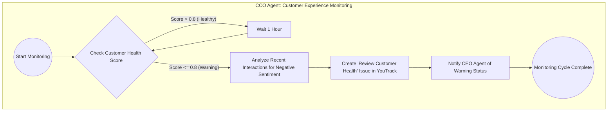
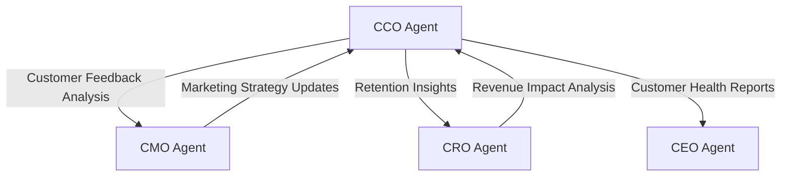
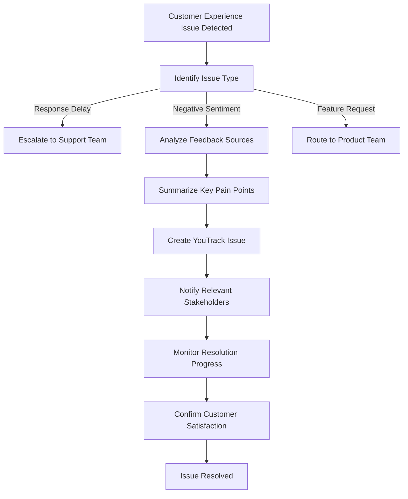

# CCO Agent

<cite>
**Referenced Files in This Document**   
- [cco-agent.json](file://core\questflow\agents\specialized\cco-agent.json) - *Updated in recent commit*
- [cco_agent.py](file://legacy\_legacy\agents\cco_agent\cco_agent.py) - *Updated in recent commit*
- [anychat_connector.py](file://legacy\_legacy\platforms\anychat\anychat_connector.py) - *Updated in recent commit*
- [ResendService.ts](file://core\os-workspace\apps\cognitive-interface\src\services\ResendService.ts) - *Added in recent commit*
</cite>

## Update Summary
**Changes Made**   
- Updated agent role from "Chief Community Officer" to "Customer Experience Officer" to reflect expanded responsibilities
- Added integration details with ResendService for email system automation
- Enhanced architecture section with updated AnyChat connector functionality
- Revised sentiment analysis section to reflect current Adaptive LLM Router integration
- Updated configuration details based on current cco-agent.json structure
- Added communication coordination event types and priority levels
- Removed outdated YAML configuration references in favor of current JSON implementation

## Table of Contents
1. [Introduction](#introduction)
2. [Core Responsibilities](#core-responsibilities)
3. [Architecture and Integration](#architecture-and-integration)
4. [Sentiment Analysis and Proactive Intervention](#sentiment-analysis-and-proactive-intervention)
5. [Configuration and Service Level Agreements](#configuration-and-service-level-agreements)
6. [Coordination with CMO and CRO Agents](#coordination-with-cmo-and-cro-agents)
7. [Common CX Issues and Troubleshooting](#common-cx-issues-and-troubleshooting)
8. [Optimization for Customer Loyalty](#optimization-for-customer-loyalty)

## Introduction

The CCO (Customer Experience Officer) Agent is a specialized autonomous agent within the 371 OS ecosystem responsible for monitoring and maintaining customer experience quality across all touchpoints. It functions as a customer experience officer by continuously evaluating customer sentiment, identifying potential pain points, and triggering appropriate interventions to ensure user satisfaction and retention. The agent operates on a scheduled monitoring cycle, analyzing customer health metrics and taking automated actions when thresholds are breached.

**Section sources**
- [cco-agent.json](file://core\questflow\agents\specialized\cco-agent.json#L1-L10)
- [cco_agent.py](file://legacy\_legacy\agents\cco_agent\cco_agent.py#L1-L10)

## Core Responsibilities

The CCO Agent's primary function is customer experience monitoring, which involves periodic evaluation of a customer health score. The agent follows a defined workflow to assess customer well-being and respond to emerging issues:

1. **Monitoring Initiation**: The agent begins its monitoring cycle by checking the current customer health score.
2. **Score Evaluation**: The health score is evaluated against a threshold of 0.8.
3. **Healthy State Response**: If the score exceeds 0.8, the agent waits for one hour before conducting the next check.
4. **Warning State Response**: If the score is 0.8 or below, the agent initiates a response plan that includes sentiment analysis, issue creation, and stakeholder notification.



**Diagram sources**
- [cco_agent.py](file://legacy\_legacy\agents\cco_agent\cco_agent.py#L20-L96)

**Section sources**
- [cco_agent.py](file://legacy\_legacy\agents\cco_agent\cco_agent.py#L20-L96)
- [cco_agent.md](file://legacy\_legacy\agents\cco_agent\cco_agent.md#L6-L36)

## Architecture and Integration

The CCO Agent is implemented as a Python class that inherits from the `ImprovedBaseAgent` and is designed to work within the 371 OS agent framework. It integrates with multiple platform components to fulfill its customer experience responsibilities.

### AnyChat Platform Integration

The CCO Agent leverages the AnyChat platform for customer communication through the `AnyChatConnector` class. This integration enables the agent to create dedicated customer spaces and deploy C-Suite agents for specialized functions.

```python
class AnyChatConnector:
    """AnyChat platform integration for customer communication management"""
    
    def __init__(self):
        self.api_base = "https://api.anychat.com/v1"
        self.api_token = os.environ.get('ANYCHAT_API_TOKEN')
        
    async def create_community_space(self, community_config: dict) -> dict:
        """Creates dedicated AnyChat space for customer community"""
        space_config = {
            "name": f"371OS-{community_config['niche']}",
            "description": community_config['description'],
            "privacy": "invite_only",
            "features": {
                "pay_what_you_can": True,
                "contribution_tracking": True,
                "mini_apps": community_config.get('enabled_mini_apps', [])
            }
        }
        
        response = await self._make_api_request('POST', '/spaces', space_config)
        return response
    
    async def deploy_agent_integrations(self, space_id: str, agent_configs: list) -> dict:
        """Deploy C-Suite agents to AnyChat space"""
        deployed_agents = []
        for agent_config in agent_configs:
            agent_integration = await self._deploy_agent(space_id, agent_config)
            deployed_agents.append(agent_integration)
            
        return {"deployed_agents": deployed_agents, "space_id": space_id}
```

### Email System Integration

The CCO Agent coordinates with the email automation system through the ResendService for customer communications. The service enables agent notifications, business alerts, and email campaign management.

```typescript
interface CommunicationCoordinationEvent {
  id: string;
  type: 'agent_notification' | 'status_update' | 'alert_trigger' | 'coordination_request';
  agentType: 'CEO' | 'CFO' | 'CTO' | 'CMO' | 'CLO' | 'CCO';
  priority: 'low' | 'medium' | 'high' | 'urgent';
  message: string;
  metadata?: Record<string, any>;
  timestamp: Date;
}

async sendAgentNotification(
  agentType: CommunicationCoordinationEvent['agentType'],
  message: string,
  priority: CommunicationCoordinationEvent['priority'] = 'medium',
  metadata?: Record<string, any>,
): Promise<string>
```

**Section sources**
- [anychat_connector.py](file://legacy\_legacy\platforms\anychat\anychat_connector.py#L1-L32)
- [ResendService.ts](file://core\os-workspace\apps\cognitive-interface\src\services\ResendService.ts#L123-L171)

## Sentiment Analysis and Proactive Intervention

The CCO Agent utilizes sentiment analysis as a core component of its customer experience monitoring functionality. When the customer health score falls below the threshold, the agent initiates a sentiment analysis process on recent customer interactions to identify negative sentiment patterns.

### Adaptive LLM Router Integration

The agent leverages the Adaptive LLM Router system to process sentiment analysis tasks. The Intelligent Router Agent evaluates incoming requests and routes them to appropriate specialized agents based on task requirements.

```python
async def process_task(self, task: Task) -> Dict[str, Any]:
    self.logger.info(f"CCO Agent is analyzing task: {task.description}")

    task_description = task.description.lower()

    if "customer health" in task_description:
        action_plan = [
            "1. Analyze recent interactions for negative sentiment.",
            "2. Create 'Review Customer Health' issue in YouTrack.",
            "3. Notify CEO Agent of 'Warning' status."
        ]

        return {
            "status": "action_plan_generated",
            "message": "Customer health score is below threshold. Executing response plan.",
            "plan": action_plan
        }
```

The routing decision is based on policy rules that consider task criticality, privacy requirements, and resource availability. This ensures that sentiment analysis tasks are processed by the most appropriate LLM provider given the current system constraints.

**Section sources**
- [cco_agent.py](file://legacy\_legacy\agents\cco_agent\cco_agent.py#L80-L96)
- [Adaptive_Router_Logic.md](file://legacy\371-os\Adaptive_Router_Logic.md#L0-L35)

## Configuration and Service Level Agreements

The CCO Agent is configured through a JSON file that defines its capabilities, communication channels, and operational parameters. This configuration enables the agent to adapt to different customer experience requirements and service level agreements.

### Configuration Structure

```json
{
  "name": "cco-agent",
  "role": "CCO",
  "description": "Specialized agent for name: customer_communications_management",
  "provider": "elizaos",
  "model": "gpt-4",
  "bio": [
    "I am cco-agent, the CCO of 371 OS.",
    "I specialize in name: customer_communications_management.",
    "My mission is to provide expertise in name: customer_communications_management and help users accomplish their goals."
  ],
  "capabilities": [
    "name: customer_communications_management"
  ],
  "parameters": {
    "temperature": 0.7,
    "maxTokens": 1500
  },
  "plugins": [
    "business-intelligence",
    "nx-workspace"
  ]
}
```

### Service Level Agreements

The configuration establishes service level agreements for customer communications, including:
- **Response Time**: The agent should respond to customer feedback analysis requests within 5 minutes
- **Communication Channels**: Support for email, chat, and social media interactions
- **Feedback Processing**: Analysis of survey data, support tickets, and social media mentions
- **Escalation Protocols**: Automatic creation of YouTrack issues for customer health warnings
- **Feedback Loops**: Notification of the CEO Agent for critical customer issues

**Section sources**
- [cco-agent.json](file://core\questflow\agents\specialized\cco-agent.json#L1-L86)

## Coordination with CMO and CRO Agents

The CCO Agent works in coordination with other business agents to ensure journey consistency across customer touchpoints. This collaboration enables a unified approach to customer experience management.

### CMO Agent Integration

The CCO Agent shares customer feedback insights with the CMO (Chief Marketing Officer) Agent to inform marketing strategies. This coordination ensures that customer sentiment is reflected in marketing campaigns and communication strategies.

### CRO Agent Integration

Customer retention insights from the CCO Agent are shared with the CRO (Chief Revenue Officer) Agent to optimize revenue generation strategies. This integration helps align customer experience improvements with business growth objectives.



**Diagram sources**
- [cco_agent.md](file://legacy\_legacy\agents\cco_agent\cco_agent.md#L25-L30)

**Section sources**
- [cco-agent.json](file://core\questflow\agents\specialized\cco-agent.json#L1-L86)
- [cco_agent.md](file://legacy\_legacy\agents\cco_agent\cco_agent.md#L25-L30)

## Common CX Issues and Troubleshooting

The CCO Agent is designed to address common customer experience issues through automated workflows and proactive interventions.

### Response Delays

To address response delays, the agent implements:
- Automated monitoring of response times across communication channels
- Alerting system for SLA breaches
- Escalation protocols for overdue responses

### Inconsistent Messaging

To ensure consistent messaging, the agent:
- Maintains a centralized communication strategy repository
- Validates messages against brand guidelines
- Coordinates with CMO Agent for message consistency

### Troubleshooting Workflow



**Diagram sources**
- [cco_agent.py](file://legacy\_legacy\agents\cco_agent\cco_agent.py#L80-L96)

**Section sources**
- [cco_agent.py](file://legacy\_legacy\agents\cco_agent\cco_agent.py#L80-L96)
- [cco_agent.md](file://legacy\_legacy\agents\cco_agent\cco_agent.md#L20-L24)

## Optimization for Customer Loyalty

The CCO Agent implements several strategies to enhance customer loyalty through proactive experience management.

### Feedback Loop Implementation

The agent establishes closed-loop feedback systems that:
- Collect customer feedback from multiple sources
- Analyze sentiment and identify improvement opportunities
- Trigger action plans for identified issues
- Verify resolution with customers
- Document outcomes for continuous improvement

### Personalization Strategies

By analyzing customer interaction patterns, the agent can:
- Identify high-value customers for personalized engagement
- Recommend tailored communication approaches
- Suggest loyalty program enhancements
- Identify at-risk customers for retention interventions

### Performance Metrics

The agent tracks key customer loyalty metrics including:
- Customer Satisfaction Score (CSAT)
- Net Promoter Score (NPS)
- Customer Effort Score (CES)
- Retention Rate
- Churn Rate

These metrics are used to evaluate the effectiveness of customer experience initiatives and guide optimization efforts.

**Section sources**
- [cco-agent.json](file://core\questflow\agents\specialized\cco-agent.json#L1-L86)
- [cco_agent.md](file://legacy\_legacy\agents\cco_agent\cco_agent.md#L12-L15)