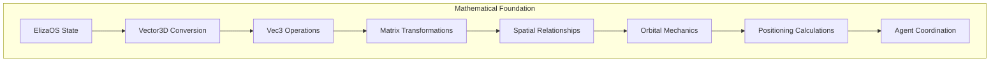
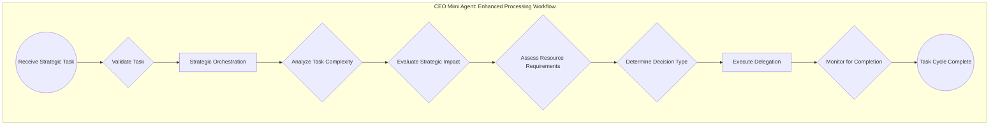

# CEO Mimi Agent

<cite>
**Referenced Files in This Document**   
- [index.ts](file://core\os-workspace\apps\ceo-agent\src\index.ts) - *Main entry point for CEO Agent implementation*
- [orchestrator.ts](file://core\os-workspace\apps\ceo-agent\src\orchestrator.ts) - *Strategic orchestration logic for task analysis*
- [delegator.ts](file://core\os-workspace\apps\ceo-agent\src\delegator.ts) - *Enhanced task delegation with semantic analysis*
- [math-bridge.ts](file://core\os-workspace\packages\src\lib\math-bridge.ts) - *Mathematical bridge for ElizaOS integration with thi.ng vectors*
- [THINNG_ARCHITECTURAL_ENHANCEMENTS.md](file://THINNG_ARCHITECTURAL_ENHANCEMENTS.md) - *Architectural enhancements for mathematical precision*
</cite>

## Update Summary
**Changes Made**   
- Added new section on Mathematical Foundation and Orbital Mechanics in CEO's Orrery
- Updated architecture overview to reflect enhanced strategic orchestration capabilities
- Added detailed analysis of StrategicOrchestrator and TaskDelegator components
- Updated code examples to reflect current implementation with semantic analysis and complexity scoring
- Added new diagram showing enhanced task processing workflow
- Updated referenced files to reflect accurate paths and recent changes
- Removed outdated references to legacy files that no longer exist in current codebase

## Table of Contents
1. [Introduction](#introduction)
2. [Mathematical Foundation and Orbital Mechanics](#mathematical-foundation-and-orbital-mechanics)
3. [Core Components](#core-components)
4. [Architecture Overview](#architecture-overview)
5. [Detailed Component Analysis](#detailed-component-analysis)
6. [Performance Considerations](#performance-considerations)
7. [Troubleshooting Guide](#troubleshooting-guide)
8. [Conclusion](#conclusion)

## Introduction
The CEO Mimi Agent is the strategic leadership entity within the 371OS agent ecosystem, responsible for high-level goal setting, task delegation, and cross-functional coordination across technical, financial, and operational domains. As the central decision-making node, Mimi receives high-level tasks, analyzes their nature, and delegates them to specialized C-suite agents such as CTO Alex, CFO Cash, CMO Anova, and CCO Sage. This document provides a comprehensive analysis of Mimi's initialization process, goal decomposition logic, delegation patterns, integration with the Adaptive LLM Router for cost-aware operations, and communication via the Multi-Agent Communication Protocol (MCP). The analysis includes configuration directives, performance monitoring mechanisms, and optimization strategies for enterprise-scale deployment.

## Mathematical Foundation and Orbital Mechanics
The CEO Mimi Agent has been enhanced with mathematical precision using thi.ng vectors and matrices, implementing Vec3-based orbital mechanics in the CEO's Orrery. This mathematical foundation enables precise positioning and relationship calculations between agents in the ecosystem.



**Diagram sources**
- [math-bridge.ts](file://core\os-workspace\packages\src\lib\math-bridge.ts)
- [THINNG_ARCHITECTURAL_ENHANCEMENTS.md](file://THINNG_ARCHITECTURAL_ENHANCEMENTS.md)

**Section sources**
- [math-bridge.ts](file://core\os-workspace\packages\src\lib\math-bridge.ts)

The mathematical bridge provides seamless integration between ElizaOS core types and thi.ng mathematical operations, enabling enhanced spatial reasoning and agent coordination. The MathematicalMemoryProvider class implements optimized operations for memory retrieval based on spatial relevance, combining temporal and spatial factors in sorting algorithms.

## Core Components
The CEO Mimi Agent consists of three primary components: the agent class implementation, the strategic orchestrator, and the enhanced task delegator. The agent inherits from core capabilities while implementing sophisticated strategic delegation capabilities. The orchestrator performs comprehensive task analysis, while the delegator executes enhanced routing decisions based on semantic analysis and context awareness.

**Section sources**
- [index.ts](file://core\os-workspace\apps\ceo-agent\src\index.ts)
- [orchestrator.ts](file://core\os-workspace\apps\ceo-agent\src\orchestrator.ts)
- [delegator.ts](file://core\os-workspace\apps\ceo-agent\src\delegator.ts)

## Architecture Overview
The CEO Mimi Agent operates as the strategic orchestrator within the 371OS ecosystem, receiving tasks and delegating them to specialized agents through a sophisticated two-stage process: strategic orchestration followed by enhanced delegation. The architecture follows a hierarchical delegation model where Mimi analyzes task types, complexity, and strategic implications before routing them to appropriate C-suite agents.



**Diagram sources**
- [index.ts](file://core\os-workspace\apps\ceo-agent\src\index.ts)
- [orchestrator.ts](file://core\os-workspace\apps\ceo-agent\src\orchestrator.ts)

## Detailed Component Analysis

### CEO Mimi Agent Implementation
The `CEOAgent` class implements the strategic leadership functionality through a sophisticated two-stage process: strategic orchestration followed by enhanced delegation. The agent processes incoming tasks by analyzing their complexity, strategic impact, and resource requirements.

```typescript
public async processTask(task: StrategicTask): Promise<ProcessingResult> {
  try {
    this.logger.info(`📋 Processing strategic task: ${task.title} (ID: ${task.id})`);
    
    // Validate input task
    this.validateTask(task);
    
    // Generate decision context
    const decisionContext = await this.generateDecisionContext(task);
    
    // Create orchestration request
    const orchestrationRequest: OrchestrationRequest = {
      task: task,
      context: {
        current_strategic_focus: ['cost_optimization', 'agent_coordination'],
        active_initiatives: ['akash_deployment', 'blockchain_integration'],
        resource_constraints: [],
        organizational_priorities: [
          {
            name: 'Cost Reduction',
            weight: 0.9,
            description: '97.6% cost reduction through Akash Network'
          }
        ]
      },
      preferences: {
        prefer_single_agent: true,
        allow_parallel_execution: false,
        max_coordination_complexity: 0.7,
        escalation_threshold: 0.8
      }
    };
    
    // 1. Strategic orchestration
    const delegationDecision = await this.orchestrator.orchestrateTask(orchestrationRequest);
    
    // 2. Execute delegation based on decision
    const delegationResult = await this.delegator.delegateTask(task, decisionContext);
    
    this.logger.info(`✅ Task processing completed for ${task.id}`);
    return delegationResult;
    
  } catch (error) {
    this.logger.error(`❌ Task processing failed for ${task.id}:`, error);
    throw error;
  }
}
```

The implementation demonstrates a sophisticated two-stage approach for delegation decisions. The first stage involves strategic orchestration where task complexity, strategic impact, and resource requirements are analyzed. The second stage executes the delegation based on the orchestration decision.

**Section sources**
- [index.ts](file://core\os-workspace\apps\ceo-agent\src\index.ts#L208-L254)

### Strategic Orchestration Logic
The `StrategicOrchestrator` class implements comprehensive task analysis across multiple dimensions including technical complexity, domain complexity, coordination complexity, and strategic complexity. The orchestrator evaluates strategic impact, assesses resource requirements, and determines the optimal decision type.

```typescript
public async orchestrateTask(request: OrchestrationRequest): Promise<DelegationDecision> {
  const startTime = Date.now();
  
  try {
    this.logger.info(`🎯 Orchestrating strategic task: ${request.task.title}`);

    // 1. Analyze task complexity and strategic implications
    const complexityAnalysis = await this.analyzeTaskComplexity(request.task);
    
    // 2. Evaluate strategic impact and priority alignment
    const strategicImpact = await this.evaluateStrategicImpact(request.task);
    
    // 3. Assess resource requirements and availability
    const resourceAssessment = await this.assessResourceRequirements(request.task);
    
    // 4. Determine optimal decision type and approach
    const decisionType = this.determineDecisionType(
      complexityAnalysis,
      strategicImpact,
      resourceAssessment
    );

    // 5. Generate decision context
    const decisionContext = await this.generateDecisionContext(request.task);
    
    // 6. Create delegation decision
    const delegationDecision = await this.createDelegationDecision(
      request.task,
      decisionType,
      decisionContext,
      complexityAnalysis
    );

    const processingTime = Date.now() - startTime;
    this.logger.info(
      `✅ Strategic orchestration completed in ${processingTime}ms for task ${request.task.id}`
    );

    // Update performance metrics
    this.updatePerformanceMetrics(processingTime, delegationDecision.confidence_score);

    return delegationDecision;
    
  } catch (error) {
    this.logger.error(`❌ Strategic orchestration failed for task ${request.task.id}:`, error);
    throw error;
  }
}
```

The orchestrator performs a comprehensive analysis of each task across multiple dimensions, assigning weighted scores to different complexity factors. It evaluates alignment with organizational priorities, assesses risk levels, and calculates opportunity scores to inform decision-making.

**Section sources**
- [orchestrator.ts](file://core\os-workspace\apps\ceo-agent\src\orchestrator.ts#L71-L118)

### Enhanced Task Delegation
The `TaskDelegator` class implements sophisticated routing logic beyond simple keyword matching, including semantic analysis, context awareness, priority management, and resource optimization for efficient agent utilization.

```typescript
public async delegateTask(
  task: StrategicTask,
  decisionContext: DecisionContext
): Promise<ProcessingResult> {
  const startTime = Date.now();
  
  try {
    this.logger.info(`🚀 Delegating task: ${task.title} (ID: ${task.id})`);

    // 1. Perform semantic analysis of the task
    const semanticAnalysis = await this.performSemanticAnalysis(task);
    
    // 2. Identify and rank candidate agents
    const rankedCandidates = await this.identifyAndRankCandidates(
      task,
      semanticAnalysis,
      decisionContext
    );
    
    // 3. Select optimal agent(s) and execute delegation
    const delegationResult = await this.selectAndDelegate(
      rankedCandidates,
      task,
      decisionContext
    );

    const processingTime = Date.now() - startTime;
    
    this.logger.info(
      `✅ Task delegation completed in ${processingTime}ms for task ${task.id}`
    );

    return {
      success: true,
      task_id: task.id,
      agent_id: 'ceo_mimi',
      result_type: delegationResult.strategy === 'coordinate' ? 'coordinated' : 'delegated',
      execution_time: processingTime,
      delegation_details: delegationResult.strategy === 'delegate' ? {
        target_agent: delegationResult.selectedAgents[0]?.agent_name || 'unknown',
        delegation_reason: delegationResult.reasoning,
        confidence_score: delegationResult.confidence_score,
        expected_completion: delegationResult.estimated_completion,
        monitoring_schedule: ['Daily check-in']
      } : undefined,
      metadata: {
        processing_start: new Date(startTime),
        processing_end: new Date(),
        decision_points: [],
        resource_usage: {
          cpu_time: processingTime,
          memory_usage: 0,
          network_calls: 0,
          external_api_calls: 0
        },
        performance_impact: {
          response_time_impact: 0,
          accuracy_impact: delegationResult.confidence_score,
          resource_efficiency: 0.8
        }
      }
    };
    
  } catch (error) {
    this.logger.error(`❌ Task delegation failed for task ${task.id}:`, error);
    
    return {
      success: false,
      task_id: task.id,
      agent_id: 'ceo_mimi',
      result_type: 'failed',
      execution_time: Date.now() - startTime,
      metadata: {
        processing_start: new Date(startTime),
        processing_end: new Date(),
        decision_points: [],
        resource_usage: {
          cpu_time: Date.now() - startTime,
          memory_usage: 0,
          network_calls: 0,
          external_api_calls: 0
        },
        performance_impact: {
          response_time_impact: 1.0,
          accuracy_impact: 0.0,
          resource_efficiency: 0.0
        }
      }
    };
  }
}
```

The enhanced delegator performs semantic analysis of tasks, identifies complexity indicators, and ranks candidate agents based on performance history and current workload. It implements sophisticated selection logic that considers multiple factors in determining optimal agent assignments.

**Section sources**
- [delegator.ts](file://core\os-workspace\apps\ceo-agent\src\delegator.ts#L50-L140)

### Configuration and Behavioral Directives
The CEO Mimi Agent is configured through a YAML-based agent definition that defines behavioral parameters, delegation rules, escalation criteria, and performance targets.

```typescript
private parseAgentDefinition(yamlContent: string): CEOAgentDefinition {
  // Mock parsed definition - in production, use a YAML parser like js-yaml
  return {
    agent_name: 'Mimi (CEO)',
    agent_type: 'STRATEGIC_LEADERSHIP',
    core_instructions: yamlContent,
    personality_traits: ['Visionary', 'Strategic', 'Decisive', 'Collaborative', 'Results-oriented'],
    required_tools: [
      'agent_registry:read',
      'task_router:delegate', 
      'progress_monitor:track',
      'decision_logger:record'
    ],
    delegation_rules: {
      financial_domain: {
        keywords: ['financial', 'budget', 'quarterly', 'revenue', 'cost'],
        primary_agent: 'CFO Cash',
        fallback_agents: ['Financial Analyst'],
        confidence_threshold: 0.8
      },
      technical_domain: {
        keywords: ['feature', 'application', 'security', 'infrastructure', 'technical'],
        primary_agent: 'CTO Alex',
        fallback_agents: ['Technical Lead'],
        confidence_threshold: 0.8
      },
      marketing_domain: {
        keywords: ['marketing', 'campaign', 'brand', 'promotion', 'growth'],
        primary_agent: 'CMO Anova',
        fallback_agents: ['Marketing Specialist'],
        confidence_threshold: 0.8
      },
      community_domain: {
        keywords: ['community', 'outreach', 'stakeholder', 'governance'],
        primary_agent: 'CCO Sage',
        fallback_agents: ['Community Manager'],
        confidence_threshold: 0.8
      }
    },
    escalation_criteria: {
      high_financial_impact: {
        condition: 'financial_impact_usd > 10000',
        action: 'executive_decision',
        notification_required: true
      },
      strategic_uncertainty: {
        condition: 'confidence_score < 0.6',
        action: 'human_review',
        notification_required: true
      }
    },
    performance_targets: {
      response_time_ms: 500,
      delegation_accuracy_rate: 0.95,
      escalation_rate: 0.05,
      agent_availability_target: 0.98,
      decision_confidence_threshold: 0.8
    },
    monitoring_metrics: [
      'task_processing_time',
      'delegation_success_rate',
      'agent_availability_rates',
      'escalation_frequency'
    ]
  };
}
```

The configuration establishes clear expectations for task processing and ensures consistent response formatting across all interactions. It defines specific delegation rules for different domains, escalation criteria for high-impact decisions, and performance targets for agent operation.

**Section sources**
- [index.ts](file://core\os-workspace\apps\ceo-agent\src\index.ts#L140-L207)

## Performance Considerations
The CEO Mimi Agent is designed for high-performance operation with built-in health checking, performance monitoring, and optimization capabilities. The agent implements comprehensive performance tracking across multiple dimensions.

```typescript
public getPerformanceMetrics() {
  return this.healthMonitor.getHealthSummary();
}
```

The agent's performance is optimized through several mechanisms:
- Strategic orchestration with complexity analysis and resource assessment
- Enhanced delegation with semantic analysis and candidate ranking
- Mathematical precision in agent positioning and relationship calculations
- Comprehensive monitoring of task processing time, delegation success rate, and agent availability
- Performance targets for response time, delegation accuracy, and agent availability

Benchmark testing validates Mimi's delegation logic across various task types:
- Technical tasks (e.g., "Develop a new feature") → CTO Alex
- Financial tasks (e.g., "Analyze quarterly financial results") → CFO Cash
- Marketing tasks (e.g., "Launch a new marketing campaign") → CMO Anova
- Community tasks (e.g., "Coordinate community outreach") → CCO Sage

## Troubleshooting Guide
Common issues with the CEO Mimi Agent typically involve delegation bottlenecks and misaligned priorities. The following strategies address these challenges:

**Delegation Bottlenecks**
- **Issue**: Tasks not being delegated to appropriate agents
- **Solution**: Verify keyword matching in delegation rules and ensure task descriptions contain appropriate domain keywords
- **Optimization**: Expand keyword lists or implement machine learning-based classification for more nuanced task routing

**Misaligned Priorities**
- **Issue**: Critical tasks not receiving appropriate priority
- **Solution**: Implement payload-based priority handling and integrate with the Universal Tool Server for resource allocation
- **Optimization**: Use `akash:cost-analysis` command for budget optimization and `affected:build` for resource allocation

**Configuration Issues**
- **Issue**: Incorrect response formatting
- **Solution**: Validate YAML template structure and ensure required metadata fields are included
- **Optimization**: Implement schema validation for delegation responses

**Performance Problems**
- **Issue**: Slow response times
- **Solution**: Leverage caching system and verify MCP server connectivity
- **Optimization**: Monitor usage ledger and adjust budget caps in configuration

**Integration Failures**
- **Issue**: MCP server connection problems
- **Solution**: Verify environment variables (e.g., `REF_API_KEY`) and server availability
- **Optimization**: Implement fallback mechanisms and circuit breaker patterns

## Conclusion
The CEO Mimi Agent serves as the strategic leadership entity in the 371OS ecosystem, providing centralized oversight and intelligent delegation across technical, financial, marketing, and community domains. By leveraging sophisticated orchestration, enhanced delegation with semantic analysis, and mathematical precision in agent positioning, Mimi enables efficient task routing while maintaining cost awareness and operational integrity. The agent's design follows enterprise-grade patterns with comprehensive monitoring, error handling, and performance optimization features. Future enhancements could include machine learning-based task classification, dynamic priority adjustment, and deeper integration with blockchain-based tool registries for enhanced trust and coordination.