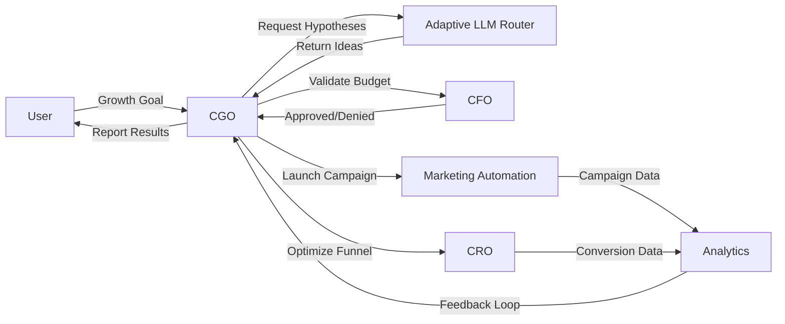
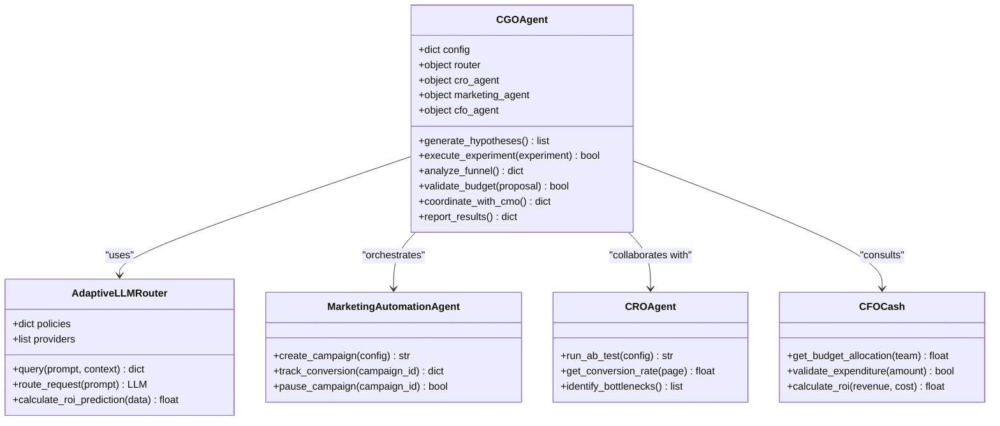

# CGO Agent

<cite>
**Referenced Files in This Document**   
- [cgo_agent.py](file://371-os/src/minds371/agents/business/cgo_agent.py)
- [cro_agent.py](file://371-os/src/minds371/agents/cro_agent/cro_agent.py)
- [marketing_automation_agent.py](file://371-os/src/minds371/agents/marketing/marketing_automation_agent.py)
- [cfo_cash.py](file://371-os/src/minds371/agents/business/cfo_cash.py)
- [cmo_agent.py](file://371-os/src/minds371/agents/business/cmo_agent.py)
- [CGO_Agent_Logic.md](file://371-os/CGO_Agent_Logic.md)
- [CFO_Agent_Logic.md](file://371-os/CFO_Agent_Logic.md)
- [CMO_Marketing_Agent_Logic.md](file://371-os/CMO_Marketing_Agent_Logic.md)
- [cgo_agent.yaml](file://371-os/prompts/business_agents/cgo_agent.yaml)
- [adaptive_llm_router_example.py](file://371-os/src/minds371/adaptive_llm_router/adaptive_llm_router_example.py)
- [intelligent_router_agent.py](file://371-os/src/minds371/adaptive_llm_router/intelligent_router_agent.py)
</cite>

## Table of Contents
1. [Introduction](#introduction)
2. [Project Structure](#project-structure)
3. [Core Components](#core-components)
4. [Architecture Overview](#architecture-overview)
5. [Detailed Component Analysis](#detailed-component-analysis)
6. [Dependency Analysis](#dependency-analysis)
7. [Performance Considerations](#performance-considerations)
8. [Troubleshooting Guide](#troubleshooting-guide)
9. [Conclusion](#conclusion)

## Introduction
The CGO Agent (Chief Growth Officer Agent) is a specialized autonomous agent designed to drive scalable user acquisition, optimize conversion funnels, and execute data-driven growth strategies across marketing, sales, and product domains. Built within the 371OS framework, the CGO Agent leverages an Adaptive LLM Router to generate and prioritize growth hypotheses based on predicted ROI, risk tolerance, and available experimentation budget. It collaborates with CMO, CRO, and CFO agents to align campaigns, optimize customer lifecycle stages, and ensure financial sustainability. This document provides a comprehensive analysis of the CGO Agent’s architecture, integration points, configuration, and operational logic.

## Project Structure
The CGO Agent resides within the `src/minds371/agents/business/` directory and is part of a broader ecosystem of executive agents (CEO, CFO, CMO, CRO) that coordinate strategic decision-making. The agent interacts with marketing automation, conversion optimization, and financial systems through well-defined APIs and shared configuration files. Key directories include:
- `agents/business/`: Core executive agents including CGO, CMO, CFO
- `agents/cro_agent/`: Conversion Rate Optimization agent
- `agents/marketing/`: Marketing automation and content agents
- `adaptive_llm_router/`: Intelligence engine for hypothesis generation
- `prompts/business_agents/`: YAML configuration for agent behavior

```mermaid
graph TD
subgraph "Core Agents"
CGO[cgo_agent.py]
CMO[cmo_agent.py]
CRO[cro_agent.py]
CFO[cfo_cash.py]
end
subgraph "Support Systems"
ARA[Adaptive LLM Router]
MA[marketing_automation_agent.py]
PROMPTS[cgo_agent.yaml]
end
CGO --> CMO : Campaign Alignment
CGO --> CRO : Funnel Optimization
CGO --> CFO : Budget & ROI Validation
CGO --> ARA : Hypothesis Generation
CGO --> MA : Experiment Execution
CGO --> PROMPTS : Configuration
```

**Diagram sources**
- [cgo_agent.py](file://371-os/src/minds371/agents/business/cgo_agent.py)
- [cmo_agent.py](file://371-os/src/minds371/agents/business/cmo_agent.py)
- [cro_agent.py](file://371-os/src/minds371/agents/cro_agent/cro_agent.py)
- [cfo_cash.py](file://371-os/src/minds371/agents/business/cfo_cash.py)
- [marketing_automation_agent.py](file://371-os/src/minds371/agents/marketing/marketing_automation_agent.py)
- [cgo_agent.yaml](file://371-os/prompts/business_agents/cgo_agent.yaml)

**Section sources**
- [cgo_agent.py](file://371-os/src/minds371/agents/business/cgo_agent.py)
- [CGO_Agent_Logic.md](file://371-os/CGO_Agent_Logic.md)

## Core Components
The CGO Agent is structured around four core responsibilities:
1. **Growth Hypothesis Generation**: Uses the Adaptive LLM Router to propose new acquisition and conversion strategies.
2. **Experiment Orchestration**: Coordinates with marketing and CRO agents to deploy A/B tests and track results.
3. **ROI Prioritization**: Evaluates initiatives based on predicted return, risk level, and budget constraints.
4. **Cross-Functional Coordination**: Interfaces with CMO, CRO, and CFO agents to align goals and share insights.

Key methods include:
- `generate_hypotheses()`: Queries the Adaptive LLM Router with current funnel data and growth targets.
- `execute_experiment()`: Triggers campaign creation via `marketing_automation_agent.py`.
- `analyze_funnel()`: Pulls conversion metrics from analytics modules.
- `validate_budget()`: Consults `cfo_cash.py` to ensure financial feasibility.

```python
# Example: Simplified CGO Agent method for hypothesis generation
def generate_growth_hypotheses(self):
    context = {
        "current_conversion_rate": self.get_funnel_data("conversion"),
        "acquisition_cost": self.get_funnel_data("cac"),
        "growth_target": self.config["growth_target"],
        "risk_tolerance": self.config["risk_tolerance"]
    }
    return self.router.query("Generate 3 high-ROI growth experiments", context)
```

**Section sources**
- [cgo_agent.py](file://371-os/src/minds371/agents/business/cgo_agent.py#L45-L120)
- [adaptive_llm_router_example.py](file://371-os/src/minds371/adaptive_llm_router/adaptive_llm_router_example.py#L10-L35)

## Architecture Overview
The CGO Agent operates within a multi-agent orchestration framework where specialized agents handle distinct business functions. It acts as a strategic planner, delegating execution tasks while maintaining oversight of growth KPIs. The Adaptive LLM Router serves as the intelligence layer, processing historical data and market trends to suggest novel growth levers.



**Diagram sources**
- [cgo_agent.py](file://371-os/src/minds371/agents/business/cgo_agent.py)
- [intelligent_router_agent.py](file://371-os/src/minds371/adaptive_llm_router/intelligent_router_agent.py)
- [marketing_automation_agent.py](file://371-os/src/minds371/agents/marketing/marketing_automation_agent.py)
- [cro_agent.py](file://371-os/src/minds371/agents/cro_agent/cro_agent.py)

## Detailed Component Analysis

### CGO Agent Implementation
The `cgo_agent.py` file implements the core logic for growth strategy formulation and execution. It inherits from a base agent class and extends functionality for funnel analysis, hypothesis testing, and cross-agent communication.

#### Key Classes and Methods


**Diagram sources**
- [cgo_agent.py](file://371-os/src/minds371/agents/business/cgo_agent.py#L15-L80)
- [adaptive_llm_router_example.py](file://371-os/src/minds371/adaptive_llm_router/adaptive_llm_router_example.py#L5-L25)
- [marketing_automation_agent.py](file://371-os/src/minds371/agents/marketing/marketing_automation_agent.py#L10-L40)
- [cro_agent.py](file://371-os/src/minds371/agents/cro_agent/cro_agent.py#L20-L50)
- [cfo_cash.py](file://371-os/src/minds371/agents/business/cfo_cash.py#L30-L60)

**Section sources**
- [cgo_agent.py](file://371-os/src/minds371/agents/business/cgo_agent.py#L1-L200)
- [CGO_Agent_Logic.md](file://371-os/CGO_Agent_Logic.md#L1-L150)

### Adaptive LLM Router Integration
The CGO Agent uses the Adaptive LLM Router to generate growth hypotheses by submitting structured prompts with contextual data such as current conversion rates, customer acquisition costs, and growth targets. The router evaluates multiple LLM providers, applies cost and risk policies, and returns ranked experiment suggestions.

```python
# Example: Interaction with Adaptive LLM Router
hypotheses = self.router.query(
    prompt="Propose 3 innovative user acquisition strategies for a SaaS product with 5% MoM growth target",
    context={
        "current_channels": ["organic", "paid_search"],
        "cac": 120,
        "lTV": 800,
        "risk_tolerance": "medium",
        "experimentation_budget": 15000
    },
    max_tokens=500
)
```

The router applies policy rules defined in `policy_engine.py` to filter responses based on cost efficiency and alignment with business constraints.

**Section sources**
- [adaptive_llm_router_example.py](file://371-os/src/minds371/adaptive_llm_router/adaptive_llm_router_example.py#L40-L80)
- [intelligent_router_agent.py](file://371-os/src/minds371/adaptive_llm_router/intelligent_router_agent.py#L25-L70)

### Configuration via YAML Prompt
The CGO Agent's behavior is controlled through `cgo_agent.yaml`, which defines strategic parameters:

```yaml
growth_target: 20%_monthly
experimentation_budget: 20000
risk_tolerance: medium
priority_metrics:
  - conversion_rate
  - customer_acquisition_cost
  - lifetime_value
collaboration_agents:
  cmo: cmo_agent.py
  cro: cro_agent.py
  cfo: cfo_cash.py
funnel_stages:
  awareness: marketing_automation_agent
  consideration: content_valuator_agent
  conversion: cro_agent
  retention: cco_agent
```

These settings determine how aggressively the agent pursues growth, which metrics to prioritize, and which agents to coordinate with during execution.

**Section sources**
- [cgo_agent.yaml](file://371-os/prompts/business_agents/cgo_agent.yaml#L1-L30)

## Dependency Analysis
The CGO Agent maintains tight integration with several key components:

```mermaid
graph TD
CGO --> CMO : campaign_strategy, alignment
CGO --> CRO : funnel_data, experiment_results
CGO --> CFO : budget_approval, ROI_calculation
CGO --> ARA : hypothesis_generation, prediction_model
CGO --> MA : campaign_execution, performance_tracking
CGO --> Analytics : funnel_analysis, attribution
ARA --> LLMs : openai, anthropic, local_models
CFO --> FinancialDB : budget_data, transaction_history
MA --> EmailSystem : campaign_delivery
CRO --> WebAnalytics : A/B_test_results
```

No circular dependencies exist; all interactions follow a unidirectional flow from strategy (CGO) to execution (specialized agents).

**Diagram sources**
- [cgo_agent.py](file://371-os/src/minds371/agents/business/cgo_agent.py)
- [cmo_agent.py](file://371-os/src/minds371/agents/business/cmo_agent.py)
- [cro_agent.py](file://371-os/src/minds371/agents/cro_agent/cro_agent.py)
- [cfo_cash.py](file://371-os/src/minds371/agents/business/cfo_cash.py)
- [marketing_automation_agent.py](file://371-os/src/minds371/agents/marketing/marketing_automation_agent.py)

**Section sources**
- [cgo_agent.py](file://371-os/src/minds371/agents/business/cgo_agent.py#L100-L250)
- [CFO_Agent_Logic.md](file://371-os/CFO_Agent_Logic.md#L20-L60)
- [CMO_Marketing_Agent_Logic.md](file://371-os/CMO_Marketing_Agent_Logic.md#L15-L50)

## Performance Considerations
The CGO Agent is designed for asynchronous operation to avoid blocking on external API calls. It uses caching for frequently accessed funnel data and implements rate limiting when querying the Adaptive LLM Router. Batch processing is employed for experiment result aggregation to minimize database load. The agent’s decision cycle typically runs on a daily cadence, balancing responsiveness with computational cost.

## Troubleshooting Guide
Common issues and resolution strategies:

**Issue: Plateauing Growth**
- **Diagnosis**: Check `analyze_funnel()` output for conversion bottlenecks
- **Solution**: Increase experimentation budget in YAML config; request more aggressive hypotheses from router

**Issue: Failed Experiments**
- **Diagnosis**: Review `execute_experiment()` logs and marketing agent feedback
- **Solution**: Adjust risk tolerance setting; refine target audience parameters

**Issue: Budget Overruns**
- **Diagnosis**: Validate with `cfo_cash.py` and audit recent expenditures
- **Solution**: Implement stricter budget_guard rules in router configuration

**Issue: Low Hypothesis Quality**
- **Diagnosis**: Evaluate LLM response diversity and relevance
- **Solution**: Update router provider weights; enhance context data richness

**Section sources**
- [cgo_agent.py](file://371-os/src/minds371/agents/business/cgo_agent.py#L200-L300)
- [CGO_Agent_Logic.md](file://371-os/CGO_Agent_Logic.md#L100-L180)

## Conclusion
The CGO Agent represents a sophisticated implementation of autonomous growth operations, combining strategic planning with tactical execution through a network of specialized agents. By leveraging the Adaptive LLM Router for hypothesis generation and maintaining tight integration with marketing, conversion, and financial systems, it enables data-driven, scalable growth. Proper configuration of growth targets, risk tolerance, and collaboration parameters ensures alignment with overall business objectives. Future enhancements could include predictive churn modeling and automated pricing experiments.