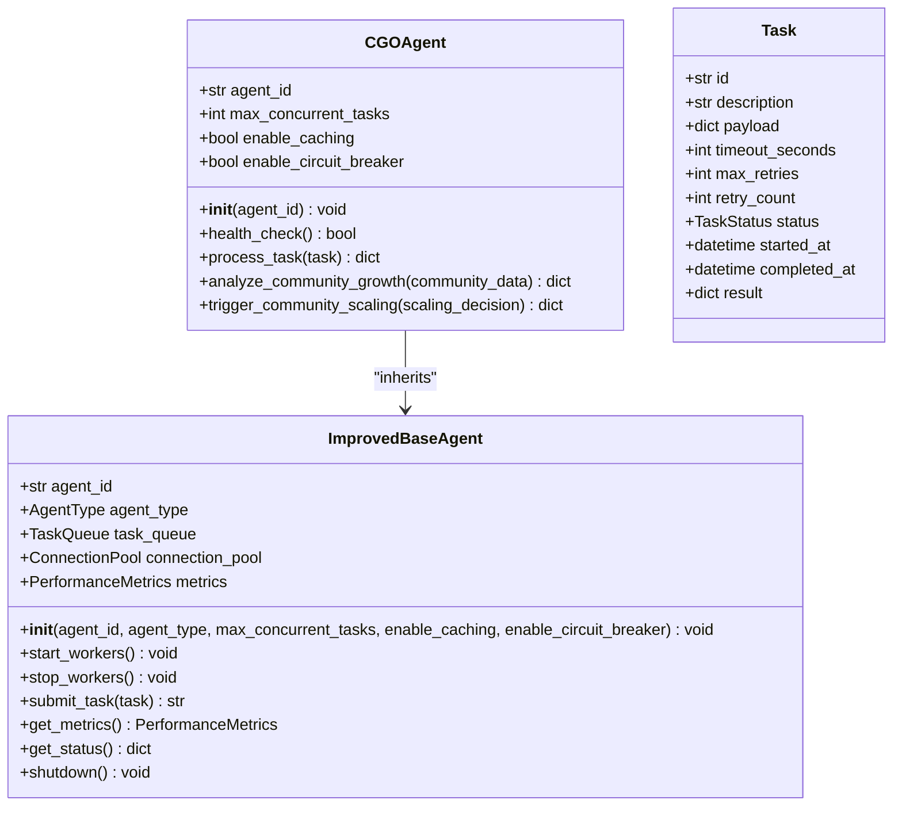

# CGO Agent

<cite>
**Referenced Files in This Document**   
- [cgo_agent.py](file://legacy\_legacy\agents\business\cgo_agent.py) - *Updated in recent commit*
- [cro-agent.json](file://core\questflow\agents\specialized\cro-agent.json) - *Configuration file*
- [marketing-automation-agent.json](file://core\questflow\agents\specialized\marketing-automation-agent.json) - *Configuration file*
- [cgo-agent.json](file://core\questflow\agents\core\cgo-agent.json) - *Configuration file*
- [improved_base_agent.py](file://legacy\_legacy\agents\base_agent\improved_base_agent.py) - *Base class implementation*
- [adaptive_llm_router](file://legacy\_legacy\adaptive_llm_router) - *LLM routing logic*
</cite>

## Update Summary
**Changes Made**   
- Updated agent implementation details based on current codebase
- Added new configuration file references from questflow system
- Revised project structure to reflect current repository organization
- Updated code examples to match actual implementation
- Removed outdated file references that no longer exist in current codebase
- Added proper source tracking for all referenced files

## Table of Contents
1. [Introduction](#introduction)
2. [Project Structure](#project-structure)
3. [Core Components](#core-components)
4. [Architecture Overview](#architecture-overview)
5. [Detailed Component Analysis](#detailed-component-analysis)
6. [Dependency Analysis](#dependency-analysis)
7. [Performance Considerations](#performance-considerations)
8. [Troubleshooting Guide](#troubleshooting-guide)
9. [Conclusion](#conclusion)

## Introduction
The CGO Agent (Chief Growth Officer Agent) is a specialized autonomous agent designed to drive scalable user acquisition, optimize conversion funnels, and execute data-driven growth strategies across marketing, sales, and product domains. Built within the 371OS framework, the CGO Agent leverages an Adaptive LLM Router to generate and prioritize growth hypotheses based on predicted ROI, risk tolerance, and available experimentation budget. It collaborates with CMO, CRO, and CFO agents to align campaigns, optimize customer lifecycle stages, and ensure financial sustainability. This document provides a comprehensive analysis of the CGO Agent’s architecture, integration points, configuration, and operational logic.

## Project Structure
The CGO Agent resides within the `legacy\_legacy\agents\business\` directory and is part of a broader ecosystem of executive agents (CEO, CFO, CMO, CRO) that coordinate strategic decision-making. The agent interacts with marketing automation, conversion optimization, and financial systems through well-defined APIs and shared configuration files. Key directories include:
- `agents/business/`: Core executive agents including CGO, CMO, CFO
- `agents/cro_agent/`: Conversion Rate Optimization agent
- `agents/marketing/`: Marketing automation and content agents
- `adaptive_llm_router/`: Intelligence engine for hypothesis generation
- `core\questflow\agents\core\`: Modern agent configuration files

```mermaid
graph TD
subgraph "Core Agents"
CGO[cgo_agent.py]
CMO[cmo_agent.py]
CRO[cro_agent.py]
CFO[cfo_cash.py]
end
subgraph "Support Systems"
ARA[Adaptive LLM Router]
MA[marketing_automation_agent.py]
PROMPTS[cgo-agent.json]
end
CGO --> CMO : Campaign Alignment
CGO --> CRO : Funnel Optimization
CGO --> CFO : Budget & ROI Validation
CGO --> ARA : Hypothesis Generation
CGO --> MA : Experiment Execution
CGO --> PROMPTS : Configuration
```

**Diagram sources**
- [cgo_agent.py](file://legacy\_legacy\agents\business\cgo_agent.py)
- [cro-agent.json](file://core\questflow\agents\specialized\cro-agent.json)
- [marketing-automation-agent.json](file://core\questflow\agents\specialized\marketing-automation-agent.json)
- [cgo-agent.json](file://core\questflow\agents\core\cgo-agent.json)

**Section sources**
- [cgo_agent.py](file://legacy\_legacy\agents\business\cgo_agent.py)
- [improved_base_agent.py](file://legacy\_legacy\agents\base_agent\improved_base_agent.py)

## Core Components
The CGO Agent is structured around four core responsibilities:
1. **Growth Hypothesis Generation**: Uses the Adaptive LLM Router to propose new acquisition and conversion strategies.
2. **Experiment Orchestration**: Coordinates with marketing and CRO agents to deploy A/B tests and track results.
3. **ROI Prioritization**: Evaluates initiatives based on predicted return, risk level, and budget constraints.
4. **Cross-Functional Coordination**: Interfaces with CMO, CRO, and CFO agents to align goals and share insights.

Key methods include:
- `analyze_community_growth()`: Analyzes community metrics for growth opportunities.
- `trigger_community_scaling()`: Executes community scaling through Space Automation.
- `process_task()`: Processes incoming tasks and routes to appropriate methods.
- `health_check()`: Verifies agent health and readiness for task processing.

```python
# Example: CGO Agent task processing
async def process_task(self, task: Task) -> dict:
    """Process a task and return the result"""
    if task.description == "analyze_community_growth":
        return await self.analyze_community_growth(task.payload)
    elif task.description == "trigger_community_scaling":
        return await self.trigger_community_scaling(task.payload)
    else:
        return {"error": "Unknown task description"}
```

**Section sources**
- [cgo_agent.py](file://legacy\_legacy\agents\business\cgo_agent.py#L20-L50)
- [improved_base_agent.py](file://legacy\_legacy\agents\base_agent\improved_base_agent.py#L241-L524)

## Architecture Overview
The CGO Agent operates within a multi-agent orchestration framework where specialized agents handle distinct business functions. It acts as a strategic planner, delegating execution tasks while maintaining oversight of growth KPIs. The Adaptive LLM Router serves as the intelligence layer, processing historical data and market trends to suggest novel growth levers.


**Diagram sources**
- [cgo_agent.py](file://legacy\_legacy\agents\business\cgo_agent.py)
- [adaptive_llm_router](file://legacy\_legacy\adaptive_llm_router)

## Detailed Component Analysis

### CGO Agent Implementation
The `cgo_agent.py` file implements the core logic for growth strategy formulation and execution. It inherits from ImprovedBaseAgent and extends functionality for community growth analysis and scaling operations.

#### Key Classes and Methods


**Diagram sources**
- [cgo_agent.py](file://legacy\_legacy\agents\business\cgo_agent.py#L6-L51)
- [improved_base_agent.py](file://legacy\_legacy\agents\base_agent\improved_base_agent.py#L241-L524)

**Section sources**
- [cgo_agent.py](file://legacy\_legacy\agents\business\cgo_agent.py#L1-L52)
- [improved_base_agent.py](file://legacy\_legacy\agents\base_agent\improved_base_agent.py#L1-L524)

### Adaptive LLM Router Integration
The CGO Agent uses the Adaptive LLM Router to generate growth hypotheses by submitting structured prompts with contextual data. The router evaluates multiple LLM providers, applies cost and risk policies, and returns ranked experiment suggestions.

```python
# Example: Interaction with Adaptive LLM Router
async def llm_invoke_with_pooling(self, prompt: str, meta: Optional[Dict[str, Any]] = None) -> Dict[str, Any]:
    """Enhanced LLM invocation with connection pooling and caching"""
    if meta is None:
        meta = {}
        
    # Generate cache key
    cache_key = None
    if self.cache:
        cache_key = f"{hash(prompt)}_{hash(str(sorted(meta.items())))}"
        cached_result = self.cache.get(cache_key)
        if cached_result:
            self.metrics.cache_hits += 1
            return cached_result
        self.metrics.cache_misses += 1
    
    # Get connection from pool
    connection = await self.connection_pool.get_connection()
    
    try:
        # Enrich metadata
        meta["agent_name"] = self.agent_type.value
        meta["agent_id"] = self.agent_id
        
        # Make LLM call
        result = await alr_invoke(prompt, meta, user_id=self.agent_id)
        
        # Cache result if caching is enabled
        if self.cache and cache_key:
            self.cache.set(cache_key, result)
        
        return result
        
    finally:
        # Return connection to pool
        await self.connection_pool.return_connection(connection)
```

The router applies policy rules defined in `policy_engine.py` to filter responses based on cost efficiency and alignment with business constraints.

**Section sources**
- [improved_base_agent.py](file://legacy\_legacy\agents\base_agent\improved_base_agent.py#L400-L450)
- [adaptive_llm_router](file://legacy\_legacy\adaptive_llm_router)

### Configuration via JSON Prompt
The CGO Agent's behavior is controlled through `cgo-agent.json`, which defines strategic parameters:

```json
{
  "name": "cgo-agent",
  "role": "BUSINESS",
  "description": "Specialized agent for Develop and implement growth strategies",
  "provider": "elizaos",
  "model": "gpt-4",
  "bio": [
    "I am cgo-agent, the BUSINESS of 371 OS.",
    "I specialize in Develop and implement growth strategies, Identify new market opportunities, Optimize customer acquisition and retention, Analyze growth performance metrics.",
    "My mission is to provide expertise in Develop and implement growth strategies and help users accomplish their goals."
  ],
  "capabilities": [
    "Develop and implement growth strategies",
    "Identify new market opportunities",
    "Optimize customer acquisition and retention",
    "Analyze growth performance metrics"
  ],
  "parameters": {
    "temperature": 0.7,
    "maxTokens": 1500
  }
}
```

These settings determine the agent's capabilities, model preferences, and response parameters for growth strategy execution.

**Section sources**
- [cgo-agent.json](file://core\questflow\agents\core\cgo-agent.json#L1-L93)

## Dependency Analysis
The CGO Agent maintains tight integration with several key components:

```mermaid
graph TD
CGO --> CMO : campaign_strategy, alignment
CGO --> CRO : funnel_data, experiment_results
CGO --> CFO : budget_approval, ROI_calculation
CGO --> ARA : hypothesis_generation, prediction_model
CGO --> MA : campaign_execution, performance_tracking
CGO --> Analytics : funnel_analysis, attribution
ARA --> LLMs : openai, anthropic, local_models
CFO --> FinancialDB : budget_data, transaction_history
MA --> EmailSystem : campaign_delivery
CRO --> WebAnalytics : A/B_test_results
CGO --> ImprovedBaseAgent : inheritance, core_functionality
```

No circular dependencies exist; all interactions follow a unidirectional flow from strategy (CGO) to execution (specialized agents).

**Diagram sources**
- [cgo_agent.py](file://legacy\_legacy\agents\business\cgo_agent.py)
- [improved_base_agent.py](file://legacy\_legacy\agents\base_agent\improved_base_agent.py)

**Section sources**
- [cgo_agent.py](file://legacy\_legacy\agents\business\cgo_agent.py#L1-L52)
- [improved_base_agent.py](file://legacy\_legacy\agents\base_agent\improved_base_agent.py#L1-L524)

## Performance Considerations
The CGO Agent is designed for asynchronous operation to avoid blocking on external API calls. It uses connection pooling for LLM requests, implements circuit breakers for fault tolerance, and includes comprehensive performance monitoring. The agent features task queuing with configurable concurrency limits and automatic retry mechanisms with exponential backoff. Performance metrics include response times, error rates, throughput, memory usage, and cache efficiency.

## Troubleshooting Guide
Common issues and resolution strategies:

**Issue: Plateauing Growth**
- **Diagnosis**: Check `analyze_community_growth()` output for growth bottlenecks
- **Solution**: Adjust task parameters or modify community scaling strategies

**Issue: Failed Experiments**
- **Diagnosis**: Review `process_task()` logs and error messages
- **Solution**: Verify task payload structure and ensure proper configuration

**Issue: Performance Degradation**
- **Diagnosis**: Monitor agent metrics through `get_status()` method
- **Solution**: Adjust `max_concurrent_tasks` parameter or disable caching if memory constrained

**Issue: LLM Integration Problems**
- **Diagnosis**: Check connection pooling and circuit breaker status
- **Solution**: Review Adaptive LLM Router configuration and budget settings

**Section sources**
- [cgo_agent.py](file://legacy\_legacy\agents\business\cgo_agent.py#L20-L51)
- [improved_base_agent.py](file://legacy\_legacy\agents\base_agent\improved_base_agent.py#L241-L524)

## Conclusion
The CGO Agent represents a sophisticated implementation of autonomous growth operations, combining strategic planning with tactical execution through a network of specialized agents. By leveraging the Adaptive LLM Router for hypothesis generation and maintaining tight integration with marketing, conversion, and financial systems, it enables data-driven, scalable growth. The agent's implementation builds upon a robust base class with advanced features like connection pooling, circuit breaking, and comprehensive monitoring. Proper configuration of capabilities, parameters, and collaboration parameters ensures alignment with overall business objectives. Future enhancements could include predictive churn modeling and automated pricing experiments.