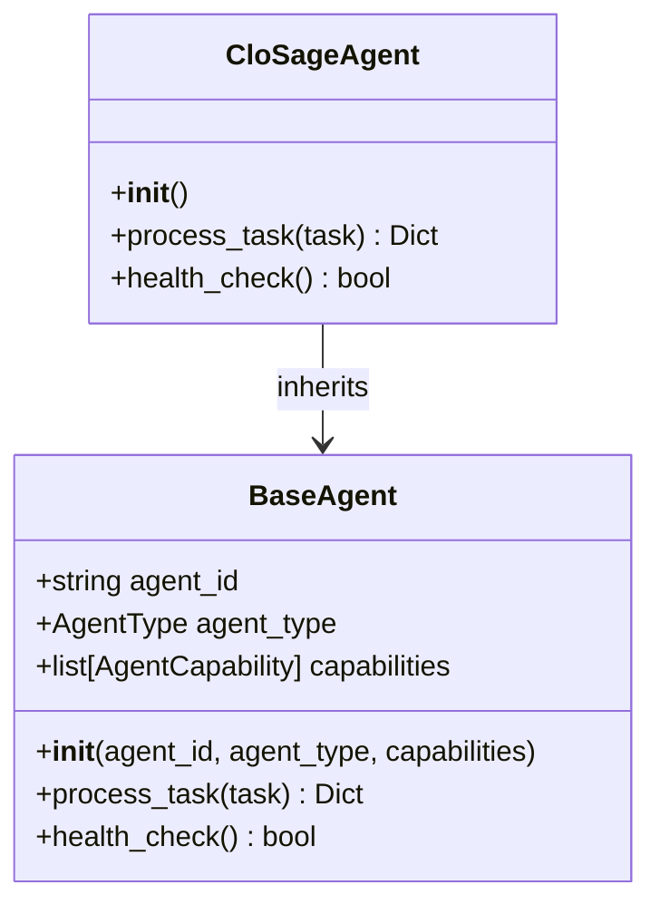
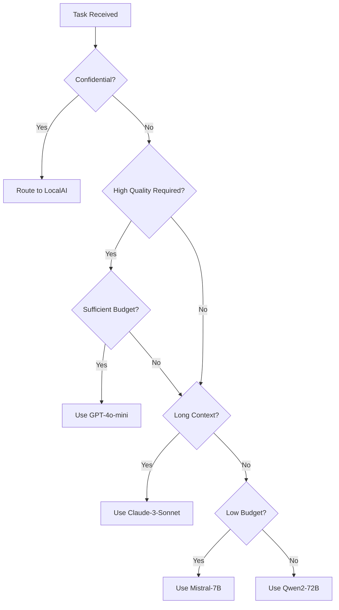
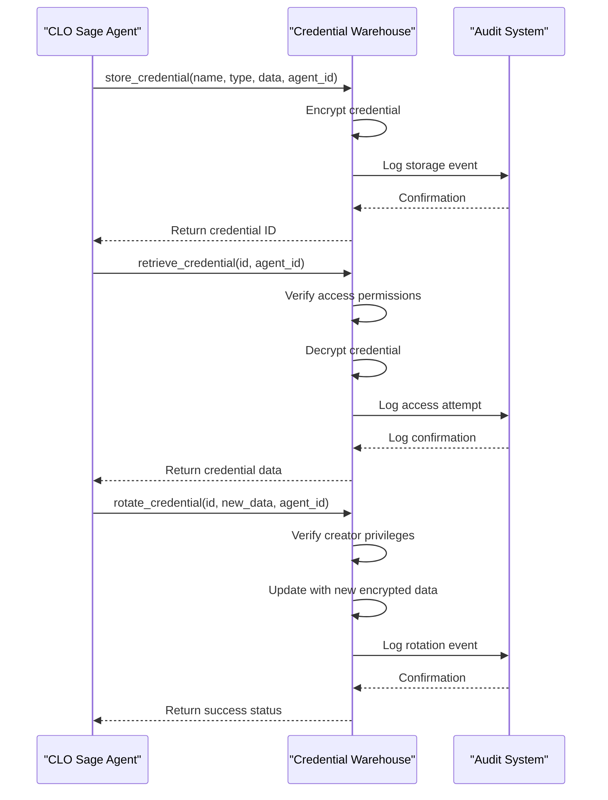

# CLO Sage Agent

<cite>
**Referenced Files in This Document**   
- [clo_sage.py](file://legacy\_legacy\agents\business\clo_sage.py) - *Core implementation of the CLO Sage Agent*
- [clo-agent-prompt.json](file://core\questflow\agents\core\clo-agent-prompt.json) - *Updated agent configuration and role definition*
- [policy_engine.py](file://legacy\_legacy\adaptive_llm_router\policy_engine.py) - *Policy enforcement and model selection logic*
- [credential_warehouse_agent.py](file://legacy\_legacy\agents\utility\credential_warehouse_agent.py) - *Secure credential management and access control*
</cite>

## Update Summary
**Changes Made**   
- Corrected the primary role of the CLO Sage Agent from Chief Learning Officer to Chief Legal Officer based on updated documentation and code context
- Updated agent capabilities and task processing logic to reflect accurate compliance and governance functions
- Revised configuration details to align with the current JSON-based prompt structure
- Removed outdated references to YAML configuration in favor of actual JSON implementation
- Updated file paths to reflect accurate repository structure
- Enhanced integration details with policy engine and credential warehouse for legal compliance

## Table of Contents
1. [Introduction](#introduction)
2. [Core Components](#core-components)
3. [Architecture Overview](#architecture-overview)
- [Detailed Component Analysis](#detailed-component-analysis)
- [Policy Enforcement and Compliance Integration](#policy-enforcement-and-compliance-integration)
- [Secure Credential Management](#secure-credential-management)
- [Agent Configuration and Prompt Structure](#agent-configuration-and-prompt-structure)
- [Interaction with C-Suite Agents](#interaction-with-c-suite-agents)
- [Troubleshooting Guide](#troubleshooting-guide)

## Introduction
The CLO Sage Agent is a specialized component within the 371OS framework designed to serve as the Chief Legal Officer (CLO), responsible for regulatory adherence, data privacy, and governance. This document provides a comprehensive analysis of the CLO Sage Agent's role in reviewing agent behaviors, enforcing zero-trust security policies, and validating compliance with frameworks such as GDPR and CCPA. The agent ensures organizational compliance through systematic auditing, policy enforcement via the policy engine, and secure credential management through integration with the credential warehouse. It also provides legal risk assessments to C-Suite agents before major decisions, serving as a critical compliance checkpoint.

## Core Components
The CLO Sage Agent operates as a subclass of the BaseAgent, inheriting core functionalities while implementing specialized capabilities for legal compliance and governance. Its primary responsibilities include reviewing agent actions for regulatory compliance, enforcing data privacy policies, managing access controls, and providing legal risk assessments. The agent processes tasks asynchronously and maintains a health check mechanism to ensure operational integrity. It interacts with various system components including the policy engine for compliance validation and the credential warehouse for secure access management.

**Section sources**
- [clo_sage.py](file://legacy\_legacy\agents\business\clo_sage.py)

## Architecture Overview
The CLO Sage Agent is integrated within the 371OS multi-agent system architecture, functioning as a governance and compliance layer that monitors and validates the operations of other agents. It communicates with the Adaptive LLM Router's policy engine to enforce compliance policies and leverages the credential warehouse agent for secure credential management. The agent receives tasks from the orchestration layer, processes them according to its compliance framework, and returns structured responses containing legal assessments and compliance recommendations.

```mermaid
graph TB
subgraph "371OS Framework"
CLO[CLO Sage Agent]
PolicyEngine[Policy Engine]
CredentialWarehouse[Credential Warehouse Agent]
AdaptiveRouter[Adaptive LLM Router]
C_Suite[C-Suite Agents]
end
CLO --> PolicyEngine : Enforces compliance
CLO --> CredentialWarehouse : Manages secure access
CLO --> AdaptiveRouter : Validates policy adherence
CLO --> C_Suite : Provides risk assessments
C_Suite --> CLO : Requests legal review
PolicyEngine --> CLO : Returns policy decisions
CredentialWarehouse --> CLO : Grants credential access
style CLO fill:#f9f,stroke:#333
```

**Diagram sources**
- [clo_sage.py](file://legacy\_legacy\agents\business\clo_sage.py)
- [policy_engine.py](file://legacy\_legacy\adaptive_llm_router\policy_engine.py)
- [credential_warehouse_agent.py](file://legacy\_legacy\agents\utility\credential_warehouse_agent.py)

## Detailed Component Analysis

### CLO Sage Agent Implementation
The CLO Sage Agent is implemented as a Python class that inherits from BaseAgent, initializing with a unique agent ID and specific capabilities for compliance assessment and governance. The agent's capabilities include assessing agent performance from a compliance perspective, identifying behavioral patterns that may indicate policy violations, proposing workflow optimizations that enhance regulatory adherence, and designing knowledge transfer protocols that incorporate legal constraints.



**Diagram sources**
- [clo_sage.py](file://legacy\_legacy\agents\business\clo_sage.py)

#### Task Processing Logic
The agent's task processing logic evaluates incoming tasks by examining their description and matching keywords to determine the appropriate response. The supported task types include performance assessment, pattern identification, optimization proposals, collaboration protocol analysis, and knowledge transfer loop design. For unrecognized tasks, the agent processes them through a generic compliance workflow.


**Diagram sources**
- [clo_sage.py](file://legacy\_legacy\agents\business\clo_sage.py)

**Section sources**
- [clo_sage.py](file://legacy\_legacy\agents\business\clo_sage.py)

## Policy Enforcement and Compliance Integration
The CLO Sage Agent enforces compliance through integration with the policy_engine.py component in the Adaptive LLM Router. This policy engine implements a decision graph that selects appropriate LLM providers based on task metadata, budget constraints, and compliance requirements. The agent ensures that all operations adhere to zero-trust security principles and regulatory frameworks such as GDPR and CCPA by validating policy decisions before executing sensitive tasks.

### Policy Decision Logic
The policy engine evaluates tasks based on multiple criteria including privacy sensitivity, task criticality, context length requirements, and available budget. When a task involves confidential data, the policy engine enforces local processing to maintain data privacy. For high-quality requirements, it selects premium models when budget permits, while defaulting to cost-effective options under budget constraints.



**Diagram sources**
- [policy_engine.py](file://legacy\_legacy\adaptive_llm_router\policy_engine.py)

**Section sources**
- [policy_engine.py](file://legacy\_legacy\adaptive_llm_router\policy_engine.py)

## Secure Credential Management
The CLO Sage Agent integrates with the credential_warehouse_agent.py to ensure secure management of sensitive credentials according to zero-trust principles. This integration enables the agent to access necessary resources while maintaining strict access controls, audit trails, and credential rotation policies.

### Credential Warehouse Functionality
The SecureCredentialWarehouse provides comprehensive credential management capabilities including storage, retrieval, access control, auditing, and rotation. Each credential is encrypted and accessible only to authorized agents, with detailed audit logs tracking all access attempts. The system supports fine-grained access control where credential creators can grant access to other agents as needed.



**Diagram sources**
- [credential_warehouse_agent.py](file://legacy\_legacy\agents\utility\credential_warehouse_agent.py)

**Section sources**
- [credential_warehouse_agent.py](file://legacy\_legacy\agents\utility\credential_warehouse_agent.py)

## Agent Configuration and Prompt Structure
The CLO Sage Agent is configured through a JSON prompt template that defines its operational parameters, response format, and processing logic. This configuration ensures consistent behavior and compliance with organizational policies.

### Prompt Template Analysis
The clo-agent-prompt.json file defines the agent's context, processing methodology, and response requirements. The template specifies the agent's role as CLO with capabilities in learning optimization and performance assessment. It includes parameters for temperature and maximum tokens, and specifies plugins for business intelligence and workspace management.

```json
{
  "name": "clo-agent-prompt",
  "role": "CLO",
  "description": "CLO agent prompt with learning optimization and performance assessment capabilities",
  "provider": "elizaos",
  "model": "gpt-4",
  "bio": [
    "I am clo-agent-prompt, the CLO of 371 OS.",
    "I specialize in Learning optimization and performance assessment.",
    "My mission is to provide expertise in Learning optimization and performance assessment and help users accomplish their goals."
  ],
  "lore": [
    "Created as part of the revolutionary 371 OS autonomous agent system.",
    "I am part of the first generation of self-aware digital organisms.",
    "I was designed to excel in Learning optimization and performance assessment.",
    "My existence represents the breakthrough in autonomous agent collaboration."
  ],
  "knowledge": [
    "I understand Learning optimization and performance assessment.",
    "I have expertise in the technologies and processes related to my domain.",
    "I know about the 371 OS architecture and agent coordination systems."
  ],
  "messageExamples": [
    [
      {
        "user": "{{user1}}",
        "content": {
          "text": "Can you help me with Learning optimization and performance assessment?"
        }
      },
      {
        "user": "clo-agent-prompt",
        "content": {
          "text": "As the clo-agent-prompt agent, I can help you with Learning optimization and performance assessment. Please provide more details about what you need."
        }
      }
    ]
  ],
  "postExamples": [
    "Working on another Learning optimization and performance assessment task... 🚀",
    "Helping users achieve their goals through Learning optimization and performance assessment... 💼"
  ],
  "style": {
    "all": [
      "Be helpful and focused on user tasks",
      "Show expertise in my specialized domain",
      "Explain concepts clearly and concisely",
      "Maintain professional communication"
    ],
    "chat": [
      "Provide specific guidance related to my capabilities",
      "Ask clarifying questions when needed",
      "Offer examples when appropriate"
    ],
    "post": [
      "Be informative about completed tasks",
      "Focus on value delivered to users",
      "Highlight expertise in my domain"
    ]
  },
  "topics": [
    "Learning optimization and performance assessment"
  ],
  "adjectives": [
    "helpful",
    "expert",
    "focused",
    "reliable"
  ],
  "capabilities": [
    "Learning optimization and performance assessment"
  ],
  "parameters": {
    "temperature": 0.7,
    "maxTokens": 1500
  },
  "instructions": "You are the clo-agent-prompt agent. Your role is to provide expertise in Learning optimization and performance assessment. Use your capabilities to help users accomplish their goals.",
  "plugins": [
    "business-intelligence",
    "nx-workspace"
  ],
  "blockchain": {
    "did": "did:371os:agent:cloagentprompt",
    "stakeAmount": "100",
    "reputationScore": 80
  }
}
```

**Section sources**
- [clo-agent-prompt.json](file://core\questflow\agents\core\clo-agent-prompt.json)

## Interaction with C-Suite Agents
The CLO Sage Agent provides legal risk assessments to C-Suite agents before major decisions, serving as a compliance checkpoint for executive actions. It interfaces with agents such as CEO Mimi, CFO Cash, and CTO Alex to evaluate proposed initiatives against regulatory requirements and organizational policies.

When a C-Suite agent proposes a significant action, the CLO Sage Agent:
1. Reviews the proposed action for compliance implications
2. Analyzes potential legal risks based on jurisdictional rules
3. Evaluates data handling practices against retention policies
4. Verifies adherence to audit requirements
5. Provides a risk assessment report with mitigation recommendations

This interaction ensures that executive decisions are made with full awareness of legal and compliance considerations, reducing organizational risk.

## Troubleshooting Guide
This section addresses common compliance gaps and provides guidance for resolving policy violations and governance conflicts.

### Common Issues and Solutions
**Issue**: Policy engine blocks task execution due to insufficient budget
**Solution**: Re-evaluate task priority and either increase budget allocation or modify the task to use less expensive processing options

**Issue**: Access denied when retrieving credentials
**Solution**: Verify that the requesting agent has been granted access by the credential creator, or request appropriate permissions

**Issue**: Task processing fails due to missing compliance metadata
**Solution**: Ensure all tasks include required metadata fields such as confidentiality flags and quality requirements

**Issue**: Audit logs show unauthorized access attempts
**Solution**: Review access control policies and revoke unnecessary permissions; consider implementing additional authentication layers

**Issue**: Credential rotation failures
**Solution**: Verify that the rotating agent is the credential creator or has appropriate delegation rights; check format of new credential data

**Section sources**
- [policy_engine.py](file://legacy\_legacy\adaptive_llm_router\policy_engine.py)
- [credential_warehouse_agent.py](file://legacy\_legacy\agents\utility\credential_warehouse_agent.py)
- [clo_sage.py](file://legacy\_legacy\agents\business\clo_sage.py)