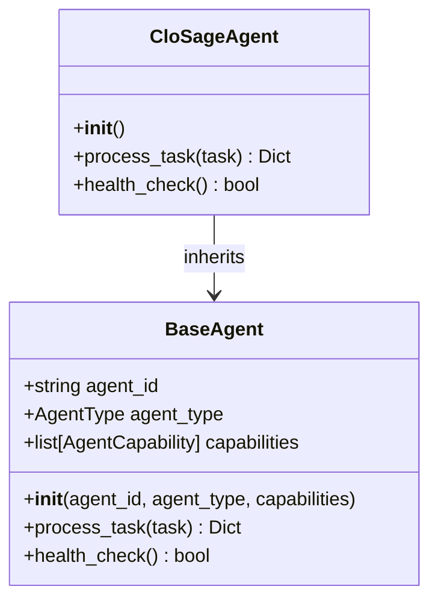
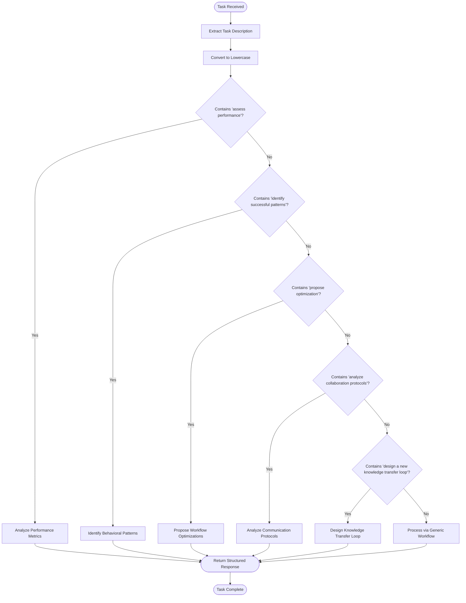
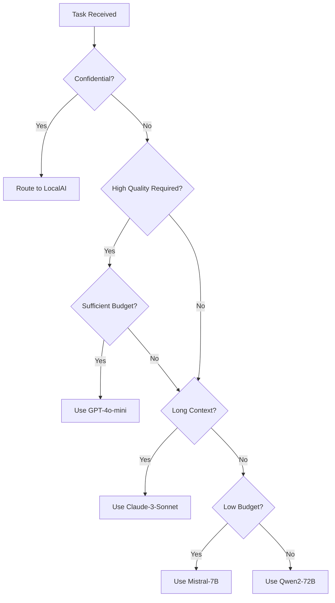
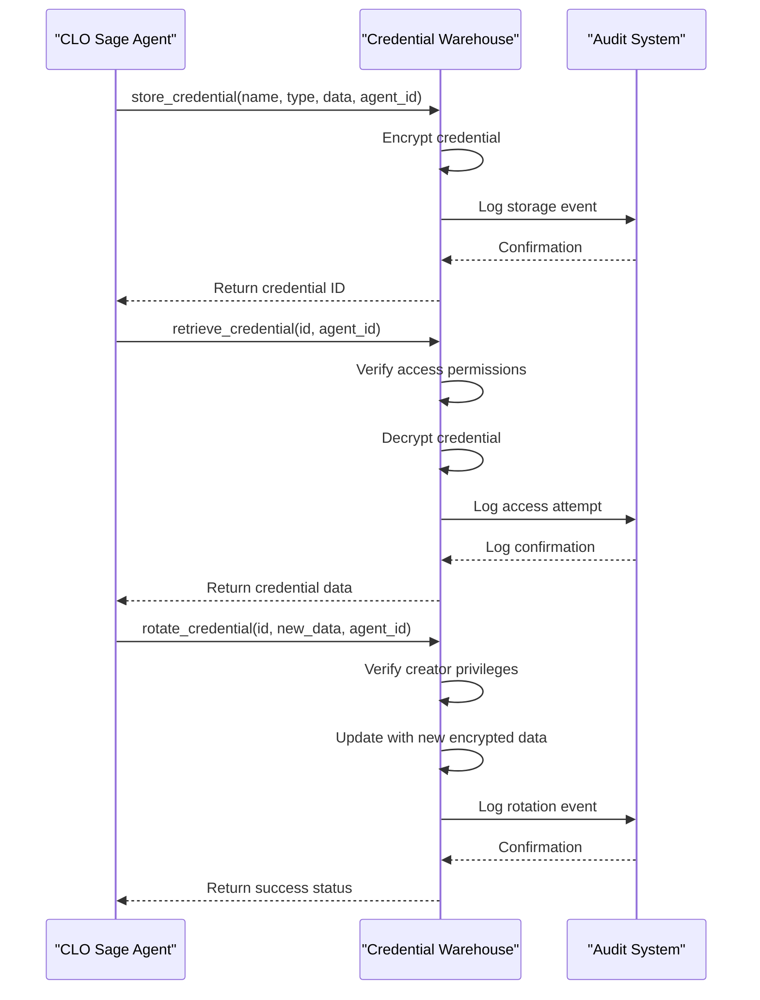

# CLO Sage Agent

<cite>
**Referenced Files in This Document**   
- [clo_sage.py](file://371-os/src/minds371/agents/business/clo_sage.py#L1-L77)
- [clo_sage.md](file://371-os/src/minds371/agents/business/clo_sage.md#L1-L28)
- [policy_engine.py](file://371-os/src/minds371/adaptive_llm_router/policy_engine.py#L1-L33)
- [credential_warehouse_agent.py](file://371-os/src/minds371/agents/utility/credential_warehouse_agent.py#L1-L203)
- [clo_agent_prompt.yaml](file://prompts/business_agents/clo_agent_prompt.yaml#L1-L46)
</cite>

## Table of Contents
1. [Introduction](#introduction)
2. [Core Components](#core-components)
3. [Architecture Overview](#architecture-overview)
4. [Detailed Component Analysis](#detailed-component-analysis)
5. [Policy Enforcement and Compliance Integration](#policy-enforcement-and-compliance-integration)
6. [Secure Credential Management](#secure-credential-management)
7. [Agent Configuration and Prompt Structure](#agent-configuration-and-prompt-structure)
8. [Interaction with C-Suite Agents](#interaction-with-c-suite-agents)
9. [Troubleshooting Guide](#troubleshooting-guide)

## Introduction
The CLO Sage Agent is a specialized component within the 371OS framework designed to serve as the Chief Learning Officer (CLO), responsible for continuous learning, performance optimization, and knowledge transfer across autonomous agents. This document provides a comprehensive analysis of the CLO Sage Agent's role in regulatory adherence, data privacy, and governance, with emphasis on its integration with security systems, policy enforcement mechanisms, and executive decision support. The agent ensures compliance with frameworks such as GDPR and CCPA through systematic auditing, zero-trust security enforcement, and legal constraint validation via the policy engine.

## Core Components
The CLO Sage Agent operates as a subclass of the BaseAgent, inheriting core functionalities while implementing specialized capabilities for learning optimization and performance assessment. Its primary responsibilities include analyzing agent behaviors, identifying successful patterns, proposing workflow optimizations, and designing knowledge transfer protocols. The agent processes tasks asynchronously and maintains a health check mechanism to ensure operational integrity. It interacts with various system components including the policy engine for compliance validation and the credential warehouse for secure access management.

**Section sources**
- [clo_sage.py](file://371-os/src/minds371/agents/business/clo_sage.py#L1-L77)

## Architecture Overview
The CLO Sage Agent is integrated within the 371OS multi-agent system architecture, functioning as a governance and optimization layer that monitors and enhances the performance of other agents. It communicates with the Adaptive LLM Router's policy engine to enforce compliance policies and leverages the credential warehouse agent for secure credential management. The agent receives tasks from the orchestration layer, processes them according to its learning optimization framework, and returns structured responses containing performance insights and recommendations.

```mermaid
graph TB
subgraph "371OS Framework"
CLO[CLO Sage Agent]
PolicyEngine[Policy Engine]
CredentialWarehouse[Credential Warehouse Agent]
AdaptiveRouter[Adaptive LLM Router]
C_Suite[C-Suite Agents]
end
CLO --> PolicyEngine : Enforces compliance
CLO --> CredentialWarehouse : Manages secure access
CLO --> AdaptiveRouter : Validates policy adherence
CLO --> C_Suite : Provides risk assessments
C_Suite --> CLO : Requests legal review
PolicyEngine --> CLO : Returns policy decisions
CredentialWarehouse --> CLO : Grants credential access
style CLO fill:#f9f,stroke:#333
```

**Diagram sources**
- [clo_sage.py](file://371-os/src/minds371/agents/business/clo_sage.py#L1-L77)
- [policy_engine.py](file://371-os/src/minds371/adaptive_llm_router/policy_engine.py#L1-L33)
- [credential_warehouse_agent.py](file://371-os/src/minds371/agents/utility/credential_warehouse_agent.py#L1-L203)

## Detailed Component Analysis

### CLO Sage Agent Implementation
The CLO Sage Agent is implemented as a Python class that inherits from BaseAgent, initializing with a unique agent ID and specific capabilities for performance assessment and optimization. The agent's capabilities include assessing agent performance, identifying behavioral patterns, proposing workflow optimizations, and designing knowledge transfer loops. These capabilities are registered during initialization and determine the types of tasks the agent can process.



**Diagram sources**
- [clo_sage.py](file://371-os/src/minds371/agents/business/clo_sage.py#L1-L77)

#### Task Processing Logic
The agent's task processing logic evaluates incoming tasks by examining their description and matching keywords to determine the appropriate response. The supported task types include performance assessment, pattern identification, optimization proposals, collaboration protocol analysis, and knowledge transfer loop design. For unrecognized tasks, the agent processes them through a generic learning workflow.



**Diagram sources**
- [clo_sage.py](file://371-os/src/minds371/agents/business/clo_sage.py#L35-L70)

**Section sources**
- [clo_sage.py](file://371-os/src/minds371/agents/business/clo_sage.py#L35-L70)
- [clo_sage.md](file://371-os/src/minds371/agents/business/clo_sage.md#L1-L28)

## Policy Enforcement and Compliance Integration
The CLO Sage Agent enforces compliance through integration with the policy_engine.py component in the Adaptive LLM Router. This policy engine implements a decision graph that selects appropriate LLM providers based on task metadata, budget constraints, and compliance requirements. The agent ensures that all operations adhere to zero-trust security principles and regulatory frameworks such as GDPR and CCPA by validating policy decisions before executing sensitive tasks.

### Policy Decision Logic
The policy engine evaluates tasks based on multiple criteria including privacy sensitivity, task criticality, context length requirements, and available budget. When a task involves confidential data, the policy engine enforces local processing to maintain data privacy. For high-quality requirements, it selects premium models when budget permits, while defaulting to cost-effective options under budget constraints.



**Diagram sources**
- [policy_engine.py](file://371-os/src/minds371/adaptive_llm_router/policy_engine.py#L1-L33)

**Section sources**
- [policy_engine.py](file://371-os/src/minds371/adaptive_llm_router/policy_engine.py#L1-L33)

## Secure Credential Management
The CLO Sage Agent integrates with the credential_warehouse_agent.py to ensure secure management of sensitive credentials according to zero-trust principles. This integration enables the agent to access necessary resources while maintaining strict access controls, audit trails, and credential rotation policies.

### Credential Warehouse Functionality
The SecureCredentialWarehouse provides comprehensive credential management capabilities including storage, retrieval, access control, auditing, and rotation. Each credential is encrypted and accessible only to authorized agents, with detailed audit logs tracking all access attempts. The system supports fine-grained access control where credential creators can grant access to other agents as needed.



**Diagram sources**
- [credential_warehouse_agent.py](file://371-os/src/minds371/agents/utility/credential_warehouse_agent.py#L1-L203)

**Section sources**
- [credential_warehouse_agent.py](file://371-os/src/minds371/agents/utility/credential_warehouse_agent.py#L1-L203)

## Agent Configuration and Prompt Structure
The CLO Sage Agent is configured through a YAML prompt template that defines its operational parameters, response format, and processing logic. This configuration ensures consistent behavior and compliance with organizational policies.

### Prompt Template Analysis
The clo_agent_prompt.yaml file defines the agent's context, processing methodology, and response requirements. The template specifies that the agent must return JSON-formatted responses containing learning analysis, status indicators, and relevant metadata. It includes variables for dynamic content insertion such as task descriptions, timestamps, and session identifiers.

```yaml
# CLO Agent Prompt Template
template: |
  # Agent Context
  - **Agent Type**: CLO
  - **Domain**: Learning optimization and performance assessment
  - **Capabilities**: Learning optimization, performance assessment, knowledge transfer
  - **Response Format**: Learning optimization response

  # Task Processing
  **Task Description**: {task_description}

  **Domain Processing**:
  - Apply learning optimization methodologies to the task
  - Analyze performance implications and learning impact
  - Generate learning insights and recommendations
  - Provide actionable learning outcomes

  # Response Requirements
  - **Status**: "processing" or "completed"
  - **Structure**: JSON with learning analysis
  - **Metadata**: Include learning metrics and recommendations
```

**Section sources**
- [clo_agent_prompt.yaml](file://prompts/business_agents/clo_agent_prompt.yaml#L1-L46)

## Interaction with C-Suite Agents
The CLO Sage Agent provides legal risk assessments to C-Suite agents before major decisions, serving as a compliance checkpoint for executive actions. It interfaces with agents such as CEO Mimi, CFO Cash, and CTO Alex to evaluate proposed initiatives against regulatory requirements and organizational policies.

When a C-Suite agent proposes a significant action, the CLO Sage Agent:
1. Reviews the proposed action for compliance implications
2. Analyzes potential legal risks based on jurisdictional rules
3. Evaluates data handling practices against retention policies
4. Verifies adherence to audit requirements
5. Provides a risk assessment report with mitigation recommendations

This interaction ensures that executive decisions are made with full awareness of legal and compliance considerations, reducing organizational risk.

## Troubleshooting Guide
This section addresses common compliance gaps and provides guidance for resolving policy violations and governance conflicts.

### Common Issues and Solutions
**Issue**: Policy engine blocks task execution due to insufficient budget
**Solution**: Re-evaluate task priority and either increase budget allocation or modify the task to use less expensive processing options

**Issue**: Access denied when retrieving credentials
**Solution**: Verify that the requesting agent has been granted access by the credential creator, or request appropriate permissions

**Issue**: Task processing fails due to missing compliance metadata
**Solution**: Ensure all tasks include required metadata fields such as confidentiality flags and quality requirements

**Issue**: Audit logs show unauthorized access attempts
**Solution**: Review access control policies and revoke unnecessary permissions; consider implementing additional authentication layers

**Issue**: Credential rotation failures
**Solution**: Verify that the rotating agent is the credential creator or has appropriate delegation rights; check format of new credential data

**Section sources**
- [policy_engine.py](file://371-os/src/minds371/adaptive_llm_router/policy_engine.py#L1-L33)
- [credential_warehouse_agent.py](file://371-os/src/minds371/agents/utility/credential_warehouse_agent.py#L1-L203)
- [clo_sage.py](file://371-os/src/minds371/agents/business/clo_sage.py#L1-L77)