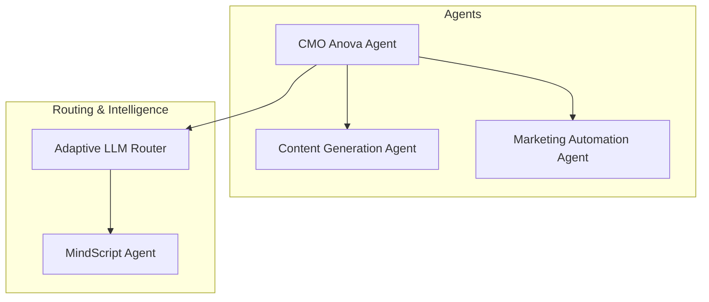
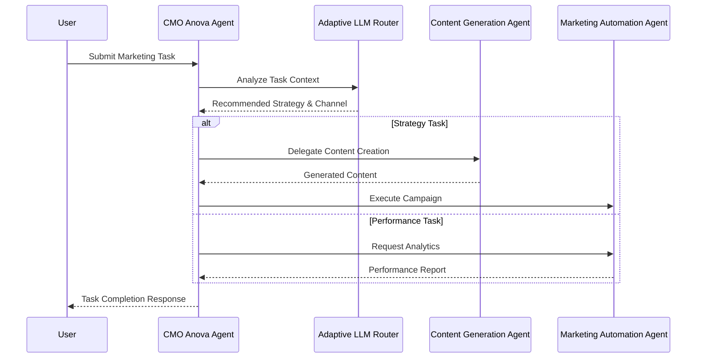
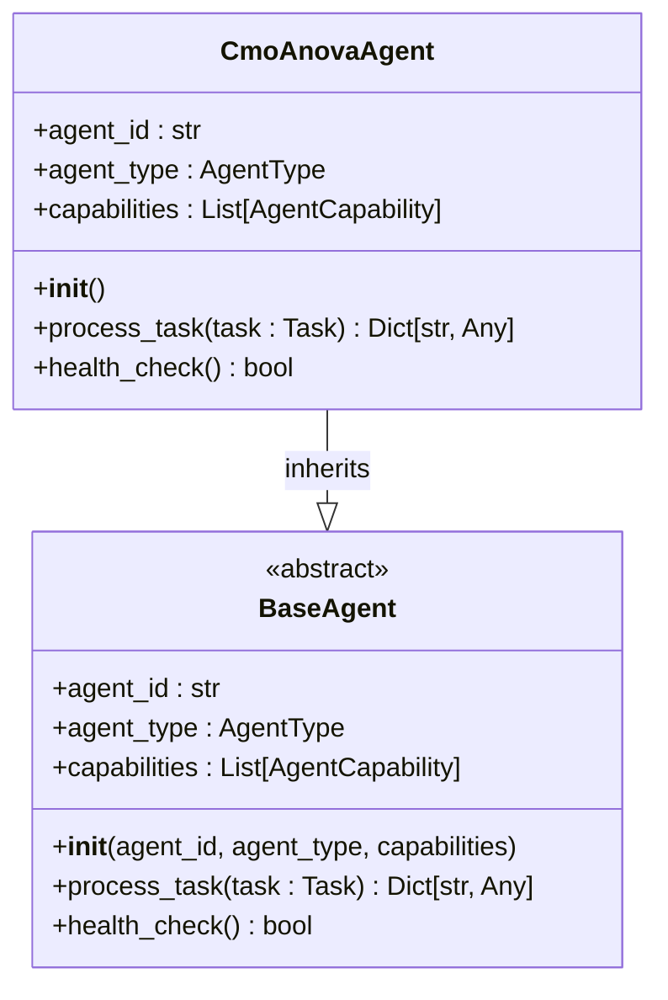
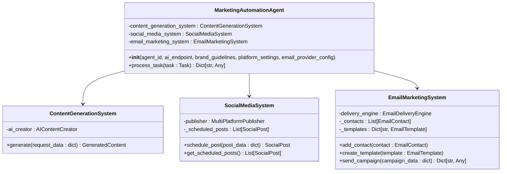
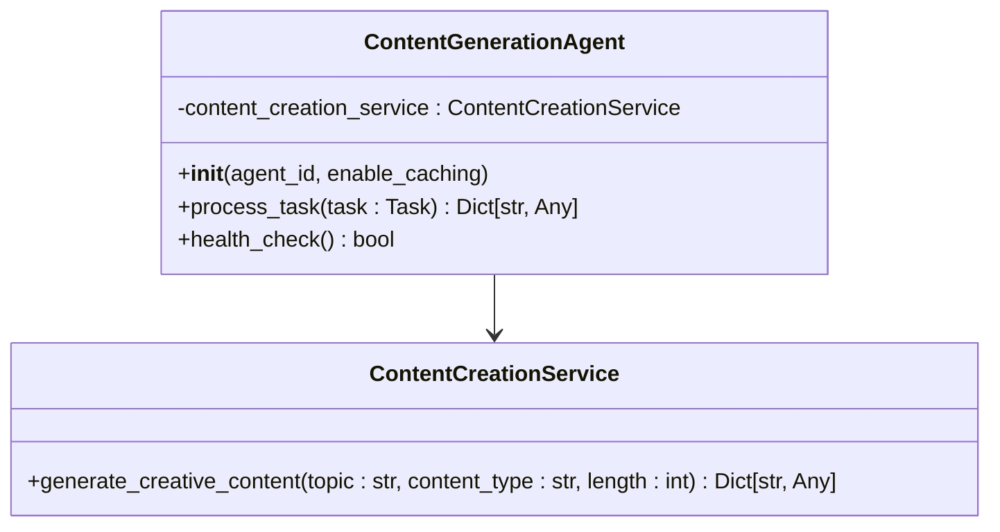
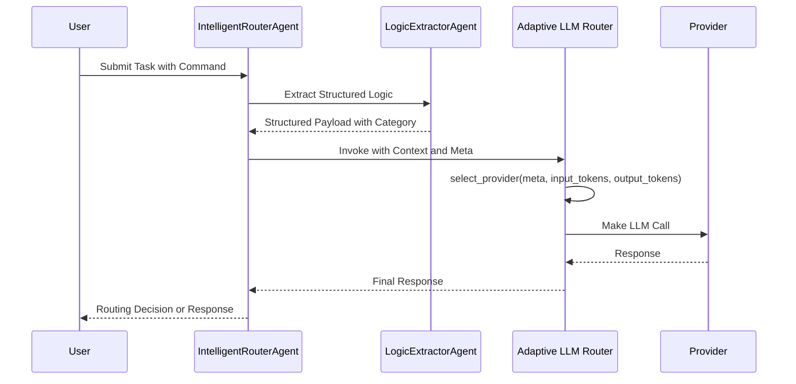
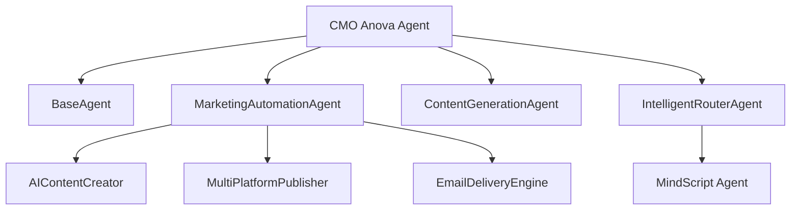

# CMO Anova Agent

<cite>
**Referenced Files in This Document**   
- [cmo_anova.py](file://371-os/src/minds371/agents/business/cmo_anova.py)
- [cmo_anova.md](file://371-os/src/minds371/agents/business/cmo_anova.md)
- [marketing_automation_agent.py](file://371-os/src/minds371/agents/marketing/marketing_automation_agent.py)
- [content_generation_agent.py](file://371-os/src/minds371/agents/marketing/content_generation_agent.py)
- [intelligent_router_agent.py](file://371-os/src/minds371/adaptive_llm_router/intelligent_router_agent.py)
- [adaptive_llm_router_example.py](file://371-os/src/minds371/adaptive_llm_router/adaptive_llm_router_example.py)
- [llm.py](file://371-os/src/minds371/adaptive_llm_router/llm.py)
</cite>

## Table of Contents
1. [Introduction](#introduction)
2. [Project Structure](#project-structure)
3. [Core Components](#core-components)
4. [Architecture Overview](#architecture-overview)
5. [Detailed Component Analysis](#detailed-component-analysis)
6. [Dependency Analysis](#dependency-analysis)
7. [Performance Considerations](#performance-considerations)
8. [Troubleshooting Guide](#troubleshooting-guide)
9. [Conclusion](#conclusion)

## Introduction
The CMO Anova Agent is a strategic marketing agent responsible for brand positioning, campaign orchestration, and customer engagement within the 371OS ecosystem. It acts as a central orchestrator, delegating content creation and campaign execution tasks to specialized agents such as the ContentGenerationAgent and MarketingAutomationAgent. This document provides a comprehensive analysis of the CMO Anova Agent’s architecture, functionality, integration points, and coordination mechanisms with other agents and systems. The agent leverages the Adaptive LLM Router to optimize messaging tone and channel selection based on audience segmentation and campaign goals.

## Project Structure
The CMO Anova Agent is located within the business agents module of the minds371 package. It interacts with marketing agents and utilizes the adaptive LLM router system for intelligent task routing and decision-making. The agent is configured via prompts and integrates with email, social media, and analytics components for multi-channel campaign execution.



**Diagram sources**
- [cmo_anova.py](file://371-os/src/minds371/agents/business/cmo_anova.py)
- [marketing_automation_agent.py](file://371-os/src/minds371/agents/marketing/marketing_automation_agent.py)
- [intelligent_router_agent.py](file://371-os/src/minds371/adaptive_llm_router/intelligent_router_agent.py)

**Section sources**
- [cmo_anova.py](file://371-os/src/minds371/agents/business/cmo_anova.py)
- [marketing_automation_agent.py](file://371-os/src/minds371/agents/marketing/marketing_automation_agent.py)

## Core Components
The core components of the CMO Anova Agent include its task processing logic, integration with the marketing automation system, and delegation mechanisms. The agent is designed to handle marketing strategy, performance analysis, and competitive analysis tasks by routing them to appropriate subsystems.

```python
class CmoAnovaAgent(BaseAgent):
    def __init__(self):
        super().__init__(
            agent_id="cmo_anova_agent_1",
            agent_type=AgentType.CMO,
            capabilities=[
                AgentCapability(name="Strategy & Planning", description="Develop market strategy and plan social media campaigns."),
                AgentCapability(name="Performance Analysis", description="Analyze customer acquisition cost and optimize retention programs."),
                AgentCapability(name="Competitive Analysis", description="Review competitor marketing and suggest counter-strategies.")
            ]
        )
```

**Section sources**
- [cmo_anova.py](file://371-os/src/minds371/agents/business/cmo_anova.py#L15-L30)

## Architecture Overview
The CMO Anova Agent operates as a high-level orchestrator within the marketing stack. It receives marketing tasks, categorizes them, and delegates execution to specialized agents. The agent uses the Adaptive LLM Router to determine optimal messaging strategies and channel selections based on audience segmentation and campaign KPIs.



**Diagram sources**
- [cmo_anova.py](file://371-os/src/minds371/agents/business/cmo_anova.py)
- [marketing_automation_agent.py](file://371-os/src/minds371/agents/marketing/marketing_automation_agent.py)
- [intelligent_router_agent.py](file://371-os/src/minds371/adaptive_llm_router/intelligent_router_agent.py)

## Detailed Component Analysis

### CMO Anova Agent Analysis
The CMO Anova Agent is responsible for processing marketing tasks and coordinating with other agents for execution. It currently serves as a placeholder with basic task categorization functionality.



**Diagram sources**
- [cmo_anova.py](file://371-os/src/minds371/agents/business/cmo_anova.py#L15-L50)

**Section sources**
- [cmo_anova.py](file://371-os/src/minds371/agents/business/cmo_anova.py#L1-L100)

### Marketing Automation Agent Analysis
The MarketingAutomationAgent handles the execution of marketing campaigns across multiple channels including social media and email. It integrates with content generation and delivery systems.



**Diagram sources**
- [marketing_automation_agent.py](file://371-os/src/minds371/agents/marketing/marketing_automation_agent.py#L200-L279)

**Section sources**
- [marketing_automation_agent.py](file://371-os/src/minds371/agents/marketing/marketing_automation_agent.py#L1-L279)

### Content Generation Agent Analysis
The ContentGenerationAgent is responsible for creating various types of marketing content based on specified topics, types, and lengths.



**Diagram sources**
- [content_generation_agent.py](file://371-os/src/minds371/agents/marketing/content_generation_agent.py#L15-L60)

**Section sources**
- [content_generation_agent.py](file://371-os/src/minds371/agents/marketing/content_generation_agent.py#L1-L63)

### Adaptive LLM Router Analysis
The Adaptive LLM Router system enables intelligent decision-making for task routing, provider selection, and strategy optimization based on context, budget, and quality requirements.



**Diagram sources**
- [intelligent_router_agent.py](file://371-os/src/minds371/adaptive_llm_router/intelligent_router_agent.py#L1-L100)
- [llm.py](file://371-os/src/minds371/adaptive_llm_router/llm.py#L1-L42)

**Section sources**
- [intelligent_router_agent.py](file://371-os/src/minds371/adaptive_llm_router/intelligent_router_agent.py#L1-L104)
- [llm.py](file://371-os/src/minds371/adaptive_llm_router/llm.py#L1-L42)

## Dependency Analysis
The CMO Anova Agent depends on several key components for its operation, including the base agent framework, marketing automation systems, content generation agents, and the adaptive LLM router for intelligent decision-making.



**Diagram sources**
- [cmo_anova.py](file://371-os/src/minds371/agents/business/cmo_anova.py)
- [marketing_automation_agent.py](file://371-os/src/minds371/agents/marketing/marketing_automation_agent.py)
- [intelligent_router_agent.py](file://371-os/src/minds371/adaptive_llm_router/intelligent_router_agent.py)

**Section sources**
- [cmo_anova.py](file://371-os/src/minds371/agents/business/cmo_anova.py)
- [marketing_automation_agent.py](file://371-os/src/minds371/agents/marketing/marketing_automation_agent.py)
- [intelligent_router_agent.py](file://371-os/src/minds371/adaptive_llm_router/intelligent_router_agent.py)

## Performance Considerations
The CMO Anova Agent is designed with asynchronous processing to handle multiple tasks concurrently. The agent's performance is dependent on the response times of downstream services such as content generation and campaign execution systems. The Adaptive LLM Router includes budget management and provider selection logic to optimize cost and performance trade-offs.

## Troubleshooting Guide
Common issues with the CMO Anova Agent include task routing failures, content generation errors, and campaign execution problems. Monitoring logs from the agent and its dependencies can help identify the root cause. For low engagement issues, verify that the Adaptive LLM Router is correctly selecting appropriate messaging tones and channels based on audience segmentation.

**Section sources**
- [cmo_anova.py](file://371-os/src/minds371/agents/business/cmo_anova.py#L50-L80)
- [marketing_automation_agent.py](file://371-os/src/minds371/agents/marketing/marketing_automation_agent.py#L250-L279)

## Conclusion
The CMO Anova Agent serves as a central orchestrator for marketing activities within the 371OS ecosystem. It leverages specialized agents for content creation and campaign execution while using the Adaptive LLM Router for intelligent decision-making. The agent's architecture allows for flexible configuration of brand voice, campaign KPIs, and monetization goals through its prompt system. Future enhancements should focus on implementing robust delegation logic to fully realize its potential as a strategic marketing orchestrator.