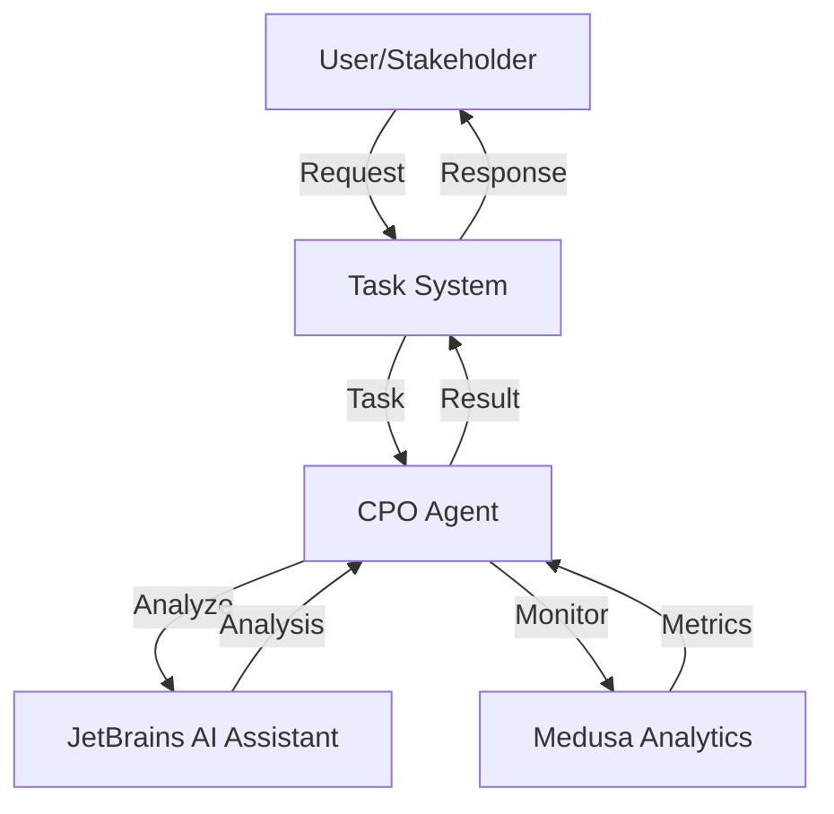
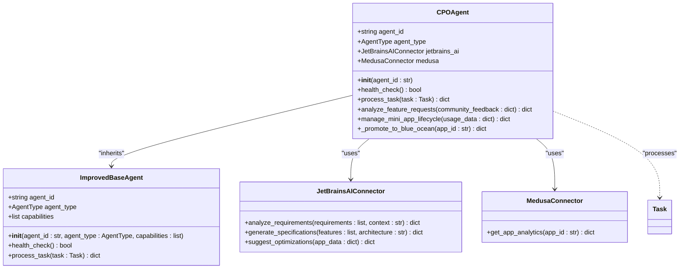
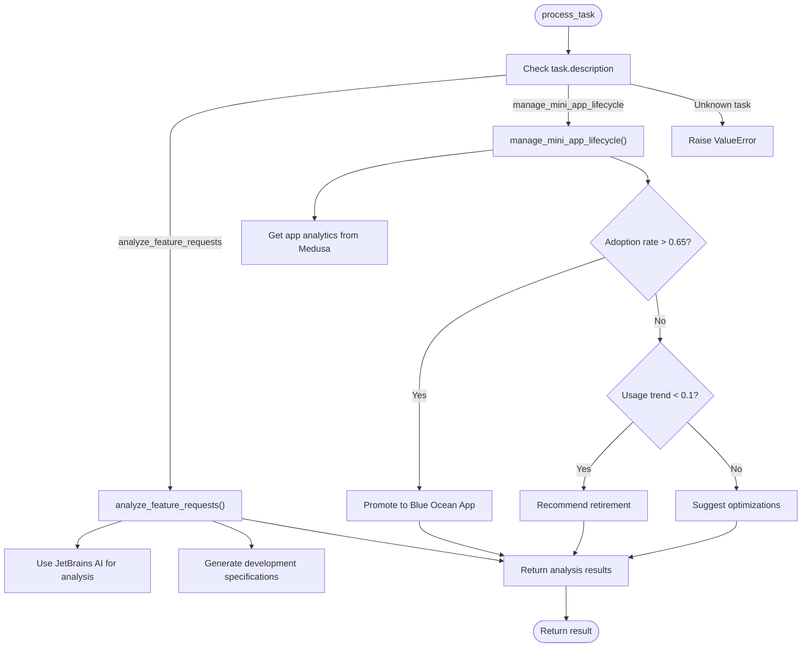
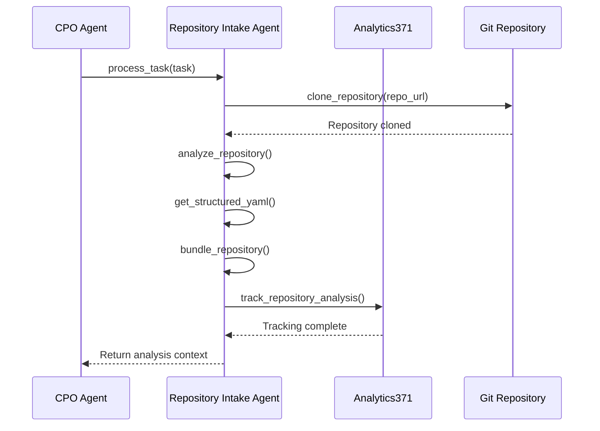
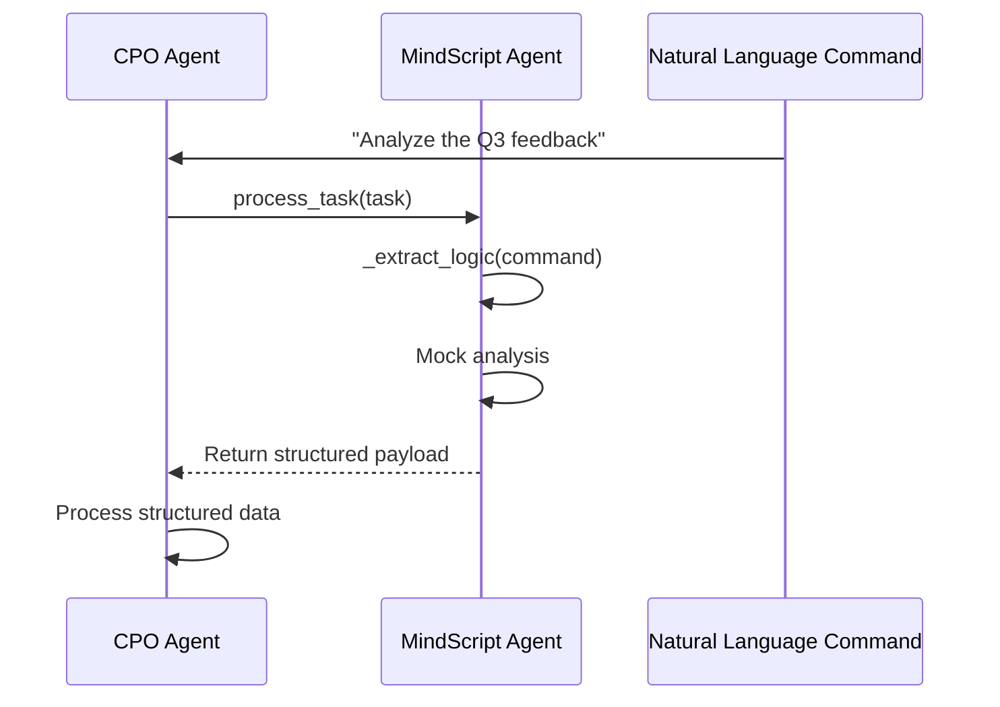
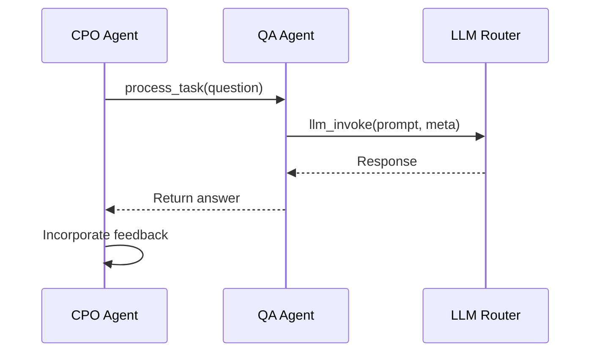
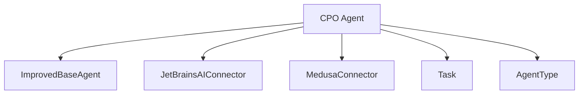

# CPO Agent

<cite>
**Referenced Files in This Document**   
- [cpo_agent.py](file://371-os/src/minds371/agents/business/cpo_agent.py)
- [cpo_agent.yaml](file://prompts/business_agents/cpo_agent.yaml)
- [repository_intake_agent.py](file://371-os/src/minds371/agents/technical/repository_intake_agent.py)
- [mindscript_agent.py](file://371-os/src/minds371/agents/mindscript_agent.py)
- [qa_agent.py](file://371-os/src/minds371/agents/technical/qa_agent.py)
</cite>

## Table of Contents
1. [Introduction](#introduction)
2. [Project Structure](#project-structure)
3. [Core Components](#core-components)
4. [Architecture Overview](#architecture-overview)
5. [Detailed Component Analysis](#detailed-component-analysis)
6. [Dependency Analysis](#dependency-analysis)
7. [Performance Considerations](#performance-considerations)
8. [Troubleshooting Guide](#troubleshooting-guide)
9. [Conclusion](#conclusion)

## Introduction
The CPO Agent (Chief Product Officer Agent) is a specialized AI agent responsible for product oversight, feature prioritization, roadmap planning, and user experience optimization within the 371OS ecosystem. As a key business agent, it integrates with technical and analytical systems to gather user feedback, analyze usage patterns, and coordinate with development and marketing agents to deliver value-driven product increments. This document provides a comprehensive analysis of the CPO Agent's architecture, functionality, configuration, and integration points, with a focus on its role in managing the product lifecycle and leveraging AI systems for strategic decision-making.

## Project Structure
The CPO Agent is part of a modular agent-based architecture within the 371OS system. It resides in the business agents module and interacts with various technical and analytical components through well-defined interfaces.


**Diagram sources**
- [cpo_agent.py](file://371-os/src/minds371/agents/business/cpo_agent.py)
- [repository_intake_agent.py](file://371-os/src/minds371/agents/technical/repository_intake_agent.py)
- [mindscript_agent.py](file://371-os/src/minds371/agents/mindscript_agent.py)
- [qa_agent.py](file://371-os/src/minds371/agents/technical/qa_agent.py)
- [cpo_agent.yaml](file://prompts/business_agents/cpo_agent.yaml)

**Section sources**
- [cpo_agent.py](file://371-os/src/minds371/agents/business/cpo_agent.py)
- [repository_intake_agent.py](file://371-os/src/minds371/agents/technical/repository_intake_agent.py)

## Core Components
The CPO Agent's core functionality revolves around product strategy, feature analysis, and lifecycle management. It inherits from the ImprovedBaseAgent class and implements specific methods for processing product-related tasks.

Key components include:
- **Feature Request Analysis**: Uses JetBrains AI Assistant to analyze community feedback and generate development specifications
- **Mini-App Lifecycle Management**: Monitors app performance and makes promotion/retirement decisions
- **Integration Connectors**: Interfaces with JetBrains AI and Medusa systems for AI-powered analysis
- **Task Processing Framework**: Implements a standardized task processing interface

```python
class CPOAgent(ImprovedBaseAgent):
    """Chief Product Officer - AI-Enhanced Product Development"""
    
    def __init__(self, agent_id: str):
        super().__init__(
            agent_id=agent_id,
            agent_type=AgentType.CPO,
        )
        self.jetbrains_ai = JetBrainsAIConnector()
        self.medusa = MedusaConnector()
```

**Section sources**
- [cpo_agent.py](file://371-os/src/minds371/agents/business/cpo_agent.py#L1-L15)

## Architecture Overview
The CPO Agent operates within a distributed agent architecture, interacting with various components to fulfill its product oversight responsibilities. It receives tasks through the agent system, processes them using specialized connectors, and returns structured results.



**Diagram sources**
- [cpo_agent.py](file://371-os/src/minds371/agents/business/cpo_agent.py)
- [repository_intake_agent.py](file://371-os/src/minds371/agents/technical/repository_intake_agent.py)

## Detailed Component Analysis

### CPO Agent Implementation
The CPO Agent is implemented as a Python class that extends the ImprovedBaseAgent, providing specialized functionality for product management tasks.

#### Class Structure


**Diagram sources**
- [cpo_agent.py](file://371-os/src/minds371/agents/business/cpo_agent.py#L1-L74)

**Section sources**
- [cpo_agent.py](file://371-os/src/minds371/agents/business/cpo_agent.py#L1-L74)

#### Task Processing Flow
The CPO Agent processes tasks through a defined workflow, routing them to appropriate methods based on the task description.



**Diagram sources**
- [cpo_agent.py](file://371-os/src/minds371/agents/business/cpo_agent.py#L25-L74)

**Section sources**
- [cpo_agent.py](file://371-os/src/minds371/agents/business/cpo_agent.py#L25-L74)

### Configuration Analysis
The CPO Agent is configured through a YAML file that defines its capabilities, routing rules, and performance metrics.

#### Configuration Structure
```yaml
agent_name: Chief Product Officer Agent
agent_type: BUSINESS
capabilities:
  - Define product vision and strategy
  - Oversee product development lifecycle
  - Prioritize features and roadmap
  - Conduct market research and competitive analysis
meta_prompt_pattern: |
  As the Chief Product Officer Agent, your role is to guide the product vision and strategy, ensuring the development of successful products that meet market needs.
  Task: {task_description}
  Context: {context}
  Parameters: {parameters}
  Provide a product-focused response, outlining strategy, features, or development plans.
routing_rules:
  - keyword: product strategy
    priority: 1
  - keyword: product roadmap
    priority: 1
  - keyword: define features
    priority: 1
configuration:
  reporting_format: detailed report
  key_performance_indicators:
    - User Adoption Rate
    - Customer Satisfaction Score (CSAT)
    - Net Promoter Score (NPS)
    - Feature Usage Metrics
test_cases:
  - input: "Define the roadmap for the next quarter."
    expected_output_snippet: "The product roadmap for the next quarter will focus on..."
```

**Section sources**
- [cpo_agent.yaml](file://prompts/business_agents/cpo_agent.yaml#L1-L30)

### Integration with Repository Intake Agent
The CPO Agent integrates with the Repository Intake Agent to analyze code repositories and extract product insights.

#### Repository Analysis Flow


**Diagram sources**
- [repository_intake_agent.py](file://371-os/src/minds371/agents/technical/repository_intake_agent.py#L1-L259)

**Section sources**
- [repository_intake_agent.py](file://371-os/src/minds371/agents/technical/repository_intake_agent.py#L1-L259)

### Integration with MindScript Agent
The CPO Agent can leverage the MindScript Agent to extract structured logic from natural language commands.

#### Logic Extraction Process


**Diagram sources**
- [mindscript_agent.py](file://371-os/src/minds371/agents/mindscript_agent.py#L1-L89)

**Section sources**
- [mindscript_agent.py](file://371-os/src/minds371/agents/mindscript_agent.py#L1-L89)

### Integration with QA Agent
The CPO Agent can coordinate with the QA Agent to validate product decisions and gather feedback.

#### QA Integration Flow


**Diagram sources**
- [qa_agent.py](file://371-os/src/minds371/agents/technical/qa_agent.py#L1-L45)

**Section sources**
- [qa_agent.py](file://371-os/src/minds371/agents/technical/qa_agent.py#L1-L45)

## Dependency Analysis
The CPO Agent has several key dependencies that enable its functionality:



**Diagram sources**
- [cpo_agent.py](file://371-os/src/minds371/agents/business/cpo_agent.py#L1-L74)
- [repository_intake_agent.py](file://371-os/src/minds371/agents/technical/repository_intake_agent.py#L1-L259)

**Section sources**
- [cpo_agent.py](file://371-os/src/minds371/agents/business/cpo_agent.py#L1-L74)

## Performance Considerations
The CPO Agent's performance is influenced by several factors:

- **External API Latency**: The agent depends on external services (JetBrains AI, Medusa) which may introduce latency
- **Task Complexity**: Feature analysis and lifecycle management tasks require significant processing
- **Error Handling**: The agent includes basic error handling but relies on the base agent for comprehensive error management
- **Scalability**: The agent is designed to handle multiple concurrent tasks through asynchronous processing

The agent uses asynchronous methods (`async`/`await`) to improve responsiveness and handle I/O operations efficiently. However, there are opportunities for optimization, such as implementing caching for frequently accessed data and adding circuit breakers for external service calls.

**Section sources**
- [cpo_agent.py](file://371-os/src/minds371/agents/business/cpo_agent.py#L1-L74)

## Troubleshooting Guide
Common issues and their solutions:

1. **Task Processing Failures**
   - **Symptom**: Unknown task description errors
   - **Solution**: Ensure task descriptions match supported operations (analyze_feature_requests, manage_mini_app_lifecycle)

2. **External Service Connectivity**
   - **Symptom**: JetBrains AI or Medusa connection failures
   - **Solution**: Verify connector initialization and network connectivity

3. **Configuration Issues**
   - **Symptom**: Unexpected behavior or missing capabilities
   - **Solution**: Validate cpo_agent.yaml configuration and ensure it's properly loaded

4. **Performance Bottlenecks**
   - **Symptom**: Slow response times
   - **Solution**: Monitor external service latency and consider implementing caching

**Section sources**
- [cpo_agent.py](file://371-os/src/minds371/agents/business/cpo_agent.py#L1-L74)
- [cpo_agent.yaml](file://prompts/business_agents/cpo_agent.yaml#L1-L30)

## Conclusion
The CPO Agent serves as a critical component in the 371OS product development lifecycle, bridging strategic product management with technical implementation. It effectively leverages AI-powered systems like JetBrains AI Assistant and Medusa Analytics to analyze user feedback, prioritize features, and make data-driven decisions about product evolution. Through its integration with repository intake, mindscript, and QA agents, it forms a comprehensive product oversight system that can gather insights from multiple sources and coordinate development efforts. The agent's configuration through YAML provides flexibility in defining its capabilities and performance metrics, while its modular design allows for easy extension and maintenance. Future enhancements could include more sophisticated sentiment analysis, predictive modeling for feature success, and tighter integration with the Adaptive LLM Router for dynamic decision-making.