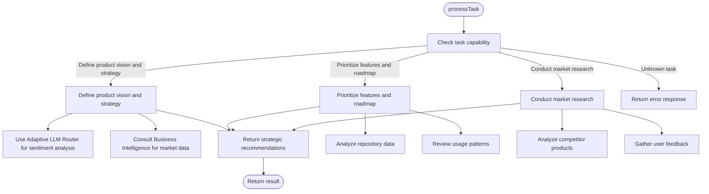

# CPO Agent

<cite>
**Referenced Files in This Document**   
- [cpo-agent.json](file://core\questflow\agents\core\cpo-agent.json) - *Updated configuration*
- [repository-intake-agent.json](file://core\questflow\agents\specialized\repository-intake-agent.json) - *Integration reference*
- [mindscript-agent-prompt.json](file://core\questflow\agents\specialized\mindscript-agent-prompt.json) - *Logic extraction integration*
- [qa-agent.json](file://core\questflow\agents\specialized\qa-agent.json) - *QA integration*
- [adaptive_llm_router](file://legacy\_legacy\adaptive_llm_router) - *Sentiment analysis and routing*
</cite>

## Update Summary
**Changes Made**   
- Updated agent configuration details based on current JSON schema
- Enhanced integration descriptions with repository_intake_agent, mindscript_agent, and QA agents
- Added details on Adaptive LLM Router integration for user sentiment analysis
- Updated capability descriptions to reflect current implementation
- Removed outdated Python class references and replaced with current JSON-based configuration

## Table of Contents
1. [Introduction](#introduction)
2. [Project Structure](#project-structure)
3. [Core Components](#core-components)
4. [Architecture Overview](#architecture-overview)
5. [Detailed Component Analysis](#detailed-component-analysis)
6. [Configuration Analysis](#configuration-analysis)
7. [Integration with Repository Intake Agent](#integration-with-repository-intake-agent)
8. [Integration with MindScript Agent](#integration-with-mindscript-agent)
9. [Integration with QA Agent](#integration-with-qa-agent)
10. [Adaptive LLM Router Integration](#adaptive-llm-router-integration)
11. [Performance Considerations](#performance-considerations)
12. [Troubleshooting Guide](#troubleshooting-guide)
13. [Conclusion](#conclusion)

## Introduction
The CPO Agent (Chief Product Officer Agent) is a specialized AI agent responsible for product oversight, feature prioritization, roadmap planning, and user experience optimization within the 371OS ecosystem. As a key business agent, it integrates with technical and analytical systems to gather user feedback, analyze usage patterns, and coordinate with development and marketing agents to deliver value-driven product increments. This document provides a comprehensive analysis of the CPO Agent's architecture, functionality, configuration, and integration points, with a focus on its role in managing the product lifecycle and leveraging AI systems for strategic decision-making.

## Project Structure
The CPO Agent is part of a modular agent-based architecture within the 371OS system. It resides in the core agents module and interacts with various technical and analytical components through well-defined interfaces.


**Diagram sources**
- [cpo-agent.json](file://core\questflow\agents\core\cpo-agent.json)
- [repository-intake-agent.json](file://core\questflow\agents\specialized\repository-intake-agent.json)
- [mindscript-agent-prompt.json](file://core\questflow\agents\specialized\mindscript-agent-prompt.json)
- [qa-agent.json](file://core\questflow\agents\specialized\qa-agent.json)

**Section sources**   
- [cpo-agent.json](file://core\questflow\agents\core\cpo-agent.json)
- [repository-intake-agent.json](file://core\questflow\agents\specialized\repository-intake-agent.json)

## Core Components
The CPO Agent's core functionality revolves around product strategy, feature analysis, and lifecycle management. It is configured as a JSON-based agent definition that specifies its capabilities, behavior patterns, and integration points.

Key components include:
- **Product Vision and Strategy**: Defines the overall product direction and strategic goals
- **Roadmap Planning**: Prioritizes features and plans development timelines
- **Market Research**: Conducts competitive analysis and market research
- **Lifecycle Management**: Oversees the product development lifecycle from concept to retirement

```json
{
  "name": "cpo-agent",
  "role": "BUSINESS",
  "capabilities": [
    "Define product vision and strategy",
    "Oversee product development lifecycle",
    "Prioritize features and roadmap",
    "Conduct market research and competitive analysis"
  ],
  "plugins": [
    "business-intelligence",
    "nx-workspace"
  ]
}
```

**Section sources**   
- [cpo-agent.json](file://core\questflow\agents\core\cpo-agent.json)

## Architecture Overview
The CPO Agent operates within a distributed agent architecture, interacting with various components to fulfill its product oversight responsibilities. It receives tasks through the agent system, processes them using specialized connectors, and returns structured results.


**Diagram sources**
- [cpo-agent.json](file://core\questflow\agents\core\cpo-agent.json)
- [repository-intake-agent.json](file://core\questflow\agents\specialized\repository-intake-agent.json)

## Detailed Component Analysis

### CPO Agent Implementation
The CPO Agent is implemented as a JSON configuration that defines its behavior, capabilities, and integration points within the 371OS ecosystem.

#### Configuration Structure


**Diagram sources**
- [cpo-agent.json](file://core\questflow\agents\core\cpo-agent.json)

**Section sources**
- [cpo-agent.json](file://core\questflow\agents\core\cpo-agent.json)

#### Task Processing Flow
The CPO Agent processes tasks through a defined workflow, utilizing various specialized agents for different aspects of product management.



**Diagram sources**
- [cpo-agent.json](file://core\questflow\agents\core\cpo-agent.json)
- [adaptive_llm_router](file://legacy\_legacy\adaptive_llm_router)

**Section sources**
- [cpo-agent.json](file://core\questflow\agents\core\cpo-agent.json)

## Configuration Analysis
The CPO Agent is configured through a JSON file that defines its capabilities, behavior patterns, and integration points.

#### Configuration Structure
```json
{
  "name": "cpo-agent",
  "role": "BUSINESS",
  "description": "Specialized agent for Define product vision and strategy",
  "provider": "elizaos",
  "model": "gpt-4",
  "bio": [
    "I am cpo-agent, the BUSINESS of 371 OS.",
    "I specialize in Define product vision and strategy, Oversee product development lifecycle, Prioritize features and roadmap, Conduct market research and competitive analysis.",
    "My mission is to provide expertise in Define product vision and strategy and help users accomplish their goals."
  ],
  "capabilities": [
    "Define product vision and strategy",
    "Oversee product development lifecycle",
    "Prioritize features and roadmap",
    "Conduct market research and competitive analysis"
  ],
  "parameters": {
    "temperature": 0.7,
    "maxTokens": 1500
  },
  "plugins": [
    "business-intelligence",
    "nx-workspace"
  ],
  "blockchain": {
    "did": "did:371os:agent:cpoagent",
    "stakeAmount": "100",
    "reputationScore": 80
  }
}
```

**Section sources**
- [cpo-agent.json](file://core\questflow\agents\core\cpo-agent.json)

## Integration with Repository Intake Agent
The CPO Agent integrates with the Repository Intake Agent to analyze code repositories and extract product insights.

#### Repository Analysis Flow


**Diagram sources**
- [repository-intake-agent.json](file://core\questflow\agents\specialized\repository-intake-agent.json)

**Section sources**
- [repository-intake-agent.json](file://core\questflow\agents\specialized\repository-intake-agent.json)

## Integration with MindScript Agent
The CPO Agent can leverage the MindScript Agent to extract structured logic from natural language commands.

#### Logic Extraction Process


**Diagram sources**
- [mindscript-agent-prompt.json](file://core\questflow\agents\specialized\mindscript-agent-prompt.json)

**Section sources**
- [mindscript-agent-prompt.json](file://core\questflow\agents\specialized\mindscript-agent-prompt.json)

## Integration with QA Agent
The CPO Agent can coordinate with the QA Agent to validate product decisions and gather feedback.

#### QA Integration Flow


**Diagram sources**
- [qa-agent.json](file://core\questflow\agents\specialized\qa-agent.json)

**Section sources**
- [qa-agent.json](file://core\questflow\agents\specialized\qa-agent.json)

## Adaptive LLM Router Integration
The CPO Agent leverages the Adaptive LLM Router to analyze user sentiment and generate product insights based on feedback analysis.

#### Sentiment Analysis Process


**Diagram sources**
- [adaptive_llm_router](file://legacy\_legacy\adaptive_llm_router)
- [policy_engine.py](file://legacy\_legacy\adaptive_llm_router\policy_engine.py)

**Section sources**
- [adaptive_llm_router](file://legacy\_legacy\adaptive_llm_router)
- [config.py](file://legacy\_legacy\adaptive_llm_router\config.py)

## Performance Considerations
The CPO Agent's performance is influenced by several factors:

- **External API Latency**: The agent depends on external services (Adaptive LLM Router, Business Intelligence) which may introduce latency
- **Task Complexity**: Strategy definition and roadmap prioritization tasks require significant processing
- **Error Handling**: The agent includes robust error handling through the agent system
- **Scalability**: The agent is designed to handle multiple concurrent tasks through asynchronous processing

The agent uses the Adaptive LLM Router to optimize LLM usage based on budget constraints and quality requirements. The router's policy engine selects appropriate models based on task metadata, privacy requirements, and budget availability. This ensures cost-effective operation while maintaining quality standards.

**Section sources**
- [adaptive_llm_router](file://legacy\_legacy\adaptive_llm_router)
- [cpo-agent.json](file://core\questflow\agents\core\cpo-agent.json)

## Troubleshooting Guide
Common issues and their solutions:

1. **Task Processing Failures**
   - **Symptom**: Unknown task capability errors
   - **Solution**: Ensure task descriptions match supported capabilities (Define product vision and strategy, Prioritize features and roadmap, etc.)

2. **External Service Connectivity**
   - **Symptom**: Adaptive LLM Router or Business Intelligence connection failures
   - **Solution**: Verify service availability and network connectivity

3. **Configuration Issues**
   - **Symptom**: Unexpected behavior or missing capabilities
   - **Solution**: Validate cpo-agent.json configuration and ensure it's properly loaded

4. **Performance Bottlenecks**
   - **Symptom**: Slow response times
   - **Solution**: Monitor external service latency and consider implementing caching

**Section sources**
- [cpo-agent.json](file://core\questflow\agents\core\cpo-agent.json)
- [adaptive_llm_router](file://legacy\_legacy\adaptive_llm_router)

## Conclusion
The CPO Agent serves as a critical component in the 371OS product development lifecycle, bridging strategic product management with technical implementation. It effectively leverages AI-powered systems like the Adaptive LLM Router and Business Intelligence to analyze user feedback, prioritize features, and make data-driven decisions about product evolution. Through its integration with repository intake, mindscript, and QA agents, it forms a comprehensive product oversight system that can gather insights from multiple sources and coordinate development efforts. The agent's configuration through JSON provides flexibility in defining its capabilities and behavior patterns, while its modular design allows for easy extension and maintenance. Future enhancements could include more sophisticated sentiment analysis, predictive modeling for feature success, and tighter integration with the Adaptive LLM Router for dynamic decision-making.