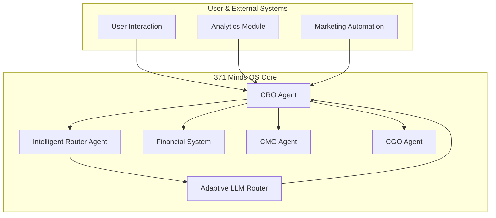
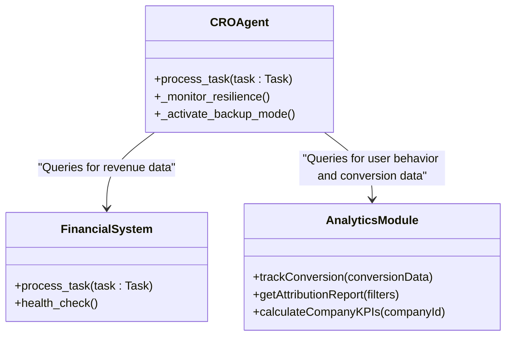
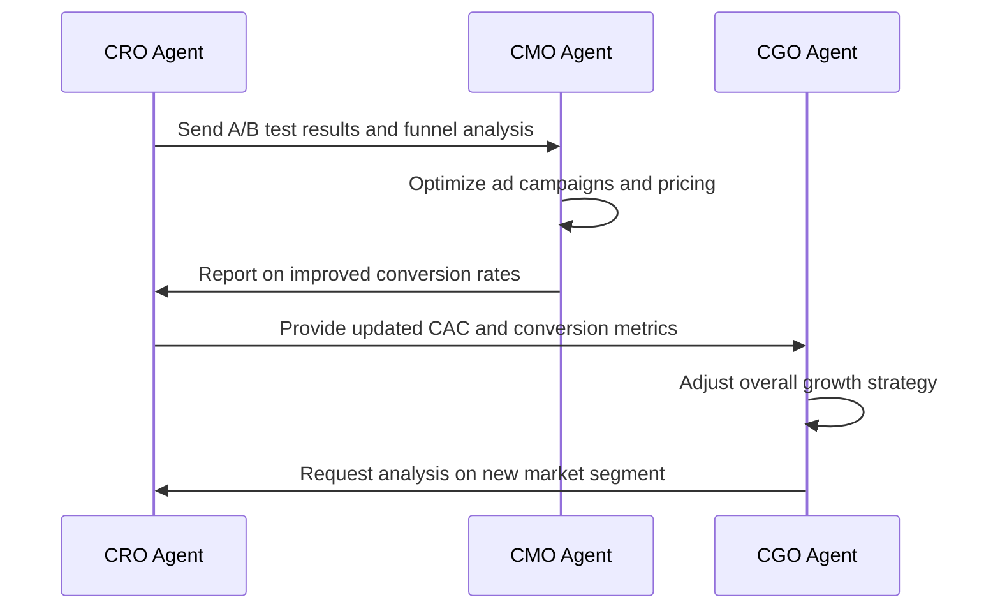

# CRO Agent

<cite>
**Referenced Files in This Document**   
- [cro_agent.py](file://371-os/src/minds371/agents/cro_agent/cro_agent.py)
- [cro_agent.md](file://371-os/src/minds371/agents/cro_agent/cro_agent.md)
- [cro_agent.yaml](file://prompts/uncategorized_agents/cro_agent.yaml)
- [financial_system.py](file://371-os/src/minds371/financial_system.py)
- [llm.py](file://371-os/src/minds371/adaptive_llm_router/llm.py)
- [marketing_automation_agent.py](file://371-os/src/minds371/agents/marketing/marketing_automation_agent.py)
- [conversion-attribution.js](file://371-os/src/minds371/services/email_system/automation/analytics/conversion-attribution.js)
- [portfolio-metrics.js](file://371-os/src/minds371/services/email_system/automation/analytics/portfolio-metrics.js)
- [cmo_agent.py](file://371-os/src/minds371/agents/business/cmo_agent.py)
- [cgo_agent.yaml](file://prompts/business_agents/cgo_agent.yaml)
</cite>

## Table of Contents
1. [Introduction](#introduction)
2. [Project Structure and Core Responsibilities](#project-structure-and-core-responsibilities)
3. [Core Components](#core-components)
4. [Architecture Overview](#architecture-overview)
5. [Detailed Component Analysis](#detailed-component-analysis)
6. [Integration with Financial and Analytics Systems](#integration-with-financial-and-analytics-systems)
7. [Adaptive LLM Router for Pricing and Offer Personalization](#adaptive-llm-router-for-pricing-and-offer-personalization)
8. [Configuration via YAML Prompt](#configuration-via-yaml-prompt)
9. [Coordination with CGO and CMO Agents](#coordination-with-cgo-and-cmo-agents)
10. [Addressing Revenue Challenges with A/B Testing and Dynamic Pricing](#addressing-revenue-challenges-with-ab-testing-and-dynamic-pricing)
11. [Conclusion](#conclusion)

## Introduction

The CRO (Chief Revenue Officer) Agent is a specialized autonomous agent within the 371 Minds OS ecosystem, designed to maximize monetization, optimize conversion rates, and refine pricing strategies. Despite its current file classification as an "uncategorized_agent," its documented capabilities and configuration clearly define it as a revenue optimization lead. This document provides a comprehensive analysis of the CRO Agent, detailing its role in analyzing sales funnels, identifying upsell opportunities, and leveraging advanced AI systems to drive revenue growth. The analysis is based on a thorough examination of its implementation files, configuration, and integration points with financial, marketing, and analytics modules.

## Project Structure and Core Responsibilities

The CRO Agent is located within the agents module of the 371 Minds OS codebase. Its implementation is split across three key files: a Python class for its logic, a markdown file for documentation, and a YAML file for its configuration and prompt engineering. The agent's primary responsibility is to act as a Conversion Rate Optimization (CRO) expert, analyzing user behavior, identifying friction points in conversion funnels, and recommending data-driven improvements.

**Section sources**
- [cro_agent.md](file://371-os/src/minds371/agents/cro_agent/cro_agent.md#L1-L30)
- [cro_agent.yaml](file://prompts/uncategorized_agents/cro_agent.yaml#L1-L23)

## Core Components

The core functionality of the CRO Agent is defined in its Python implementation (`cro_agent.py`). It inherits from the `ImprovedBaseAgent` class, which provides foundational capabilities like task processing and logging. The agent is designed to process specific tasks related to resilience and conversion optimization.

```python
class CROAgent(ImprovedBaseAgent):
    def __init__(self, agent_id: str, **kwargs):
        super().__init__(agent_id=agent_id, agent_type=AgentType.CRO, **kwargs)
        self.logger.info(f"CRO Agent {agent_id} initialized.")
        self.is_backup_mode = False
        self.network_status = "healthy"

    async def process_task(self, task: Task) -> Dict[str, Any]:
        action = task.payload.get("action")
        if action == "monitor_resilience":
            return self._monitor_resilience()
        elif action == "activate_backup_mode":
            return self._activate_backup_mode()
        else:
            error_msg = f"Unknown action for CRO Agent: {action}"
            self.logger.error(error_msg)
            return {"status": "failed", "error": error_msg}
```

The `process_task` method acts as a router, directing incoming tasks to specific internal methods based on the action specified in the task payload. The current implementation includes methods for monitoring system resilience and activating a backup mode, which suggests a dual role in both revenue optimization and system stability, though the latter appears to be a placeholder or misalignment with its documented CRO purpose.

**Section sources**
- [cro_agent.py](file://371-os/src/minds371/agents/cro_agent/cro_agent.py#L0-L78)

## Architecture Overview

The CRO Agent operates within a larger multi-agent system architecture. It receives tasks, potentially from an intelligent router, and can delegate or coordinate with other specialized agents to achieve its goals. Its primary interactions are with financial systems for revenue data, marketing automation systems for campaign execution, and analytics modules for user behavior insights. The agent uses the Adaptive LLM Router to generate sophisticated recommendations, which are then acted upon or shared with other agents.



**Diagram sources**
- [cro_agent.py](file://371-os/src/minds371/agents/cro_agent/cro_agent.py#L0-L78)
- [intelligent_router_agent.py](file://371-os/src/minds371/adaptive_llm_router/intelligent_router_agent.py#L0-L104)
- [financial_system.py](file://371-os/src/minds371/financial_system.py#L0-L63)

## Detailed Component Analysis

### CRO Agent Task Processing

The `process_task` method is the central nervous system of the CRO Agent. It parses incoming tasks and delegates them to the appropriate handler. The current code shows a clear structure for handling different actions, but the actions ("monitor_resilience", "activate_backup_mode") are more aligned with a Chief Resilience Officer than a Chief Revenue Officer. This indicates a potential naming or implementation inconsistency. A true CRO Agent would likely process actions like "analyze_funnel", "run_ab_test", or "optimize_pricing".


**Diagram sources**
- [cro_agent.py](file://371-os/src/minds371/agents/cro_agent/cro_agent.py#L29-L60)

### Resilience Monitoring Logic

The `_monitor_resilience` method is a placeholder that returns mock metrics for offline sync rates, platform dependency risks, and cross-community redundancy. In a real-world scenario, this method would query live data sources. The logic includes a conditional check: if the sync rate falls below 90%, it logs a warning and changes the network status. This demonstrates a decision-making capability based on predefined thresholds.

```python
def _monitor_resilience(self) -> Dict[str, Any]:
    sync_rate = 0.98 # Placeholder
    dependency_risk = "low"
    redundancy = "high"

    if sync_rate < 0.9:
        self.network_status = "degraded"
        self.logger.warning("Offline sync rate is low. Considering backup mode.")

    return {
        "status": "completed",
        "metrics": {
            "offline_sync_rate": sync_rate,
            "platform_dependency_risk": dependency_risk,
            "cross_community_redundancy": redundancy,
        },
        "network_status": self.network_status,
    }
```

**Section sources**
- [cro_agent.py](file://371-os/src/minds371/agents/cro_agent/cro_agent.py#L29-L60)

## Integration with Financial and Analytics Systems

The CRO Agent is designed to integrate with the `financial_system.py` module to access revenue data and perform financial analysis. While the CRO Agent's code does not directly call this system, the presence of a dedicated `FinancialAgent` class and its use by the CFO agent (`cfo_cash.py`) establishes a clear pattern for financial data access. The CRO Agent would likely use a similar pattern to retrieve data on Monthly Recurring Revenue (MRR), Customer Acquisition Cost (CAC), and conversion values.

The analytics modules, particularly `conversion-attribution.js` and `portfolio-metrics.js`, provide the data foundation for the CRO Agent's work. The `conversion-attribution.js` file contains logic for different attribution models (first-click, last-click, linear), which the CRO Agent would use to understand which marketing touchpoints are most effective. The `portfolio-metrics.js` file calculates key performance indicators (KPIs) like conversion rates and revenue, which are essential for measuring the success of any optimization effort.



**Diagram sources**
- [financial_system.py](file://371-os/src/minds371/financial_system.py#L0-L63)
- [conversion-attribution.js](file://371-os/src/minds371/services/email_system/automation/analytics/conversion-attribution.js#L40-L66)
- [portfolio-metrics.js](file://371-os/src/minds371/services/email_system/automation/analytics/portfolio-metrics.js#L85-L128)

## Adaptive LLM Router for Pricing and Offer Personalization

The CRO Agent leverages the Adaptive LLM Router (`llm.py`) to generate intelligent pricing recommendations and personalized offers. The router uses a policy engine to select the most appropriate LLM provider based on criteria like cost, quality, and confidentiality. The CRO Agent would send a prompt to the router, including user behavior data and business goals, and receive a sophisticated recommendation in return.

```python
# Pseudo-code for how CRO Agent might use the Adaptive LLM Router
async def generate_pricing_recommendation(self, user_data, market_data):
    prompt = f"""
    As a CRO expert, analyze the following data:
    - User's past behavior: {user_data['history']}
    - Current market conditions: {market_data['trends']}
    - Company revenue targets: {self.revenue_target}
    Suggest a personalized pricing offer and explain your reasoning.
    """
    meta = {"quality": "high", "confidentiality": "medium"}
    response = await invoke(prompt=prompt, meta=meta)
    return response["content"]
```

This integration allows the CRO Agent to move beyond simple rule-based systems and employ advanced AI reasoning for dynamic pricing and personalization.

**Section sources**
- [llm.py](file://371-os/src/minds371/adaptive_llm_router/llm.py#L0-L42)

## Configuration via YAML Prompt

The CRO Agent's behavior is configured through a YAML file (`cro_agent.yaml`). This file defines the agent's capabilities, its meta prompt pattern, and test cases. The meta prompt pattern is crucial as it establishes the agent's role and thought process. It explicitly states that the agent is a "Conversion Rate Optimization (CRO) expert agent" whose role is to "analyze data, identify bottlenecks in conversion funnels, suggest improvements, and design experiments."

```yaml
agent_type: uncategorized_agent
capabilities:
  - description: Provides expertise and performs tasks related to Conversion Rate Optimization (CRO).
  - description: Analyzes user behavior data to identify areas for improvement.
  - description: Suggests and evaluates A/B tests.
  - description: Recommends changes to website or application interfaces to increase conversion rates.
meta_prompt_pattern: |
  You are a Conversion Rate Optimization (CRO) expert agent. Your role is to analyze data,
  identify bottlenecks in conversion funnels, suggest improvements, and design experiments
  to increase conversion rates for websites or applications.
  Analyze the following request and provide a detailed response or plan of action:
```

The configuration also includes test cases that validate the agent's ability to handle common CRO tasks, such as analyzing a checkout process or suggesting A/B test ideas.

**Section sources**
- [cro_agent.yaml](file://prompts/uncategorized_agents/cro_agent.yaml#L1-L23)

## Coordination with CGO and CMO Agents

The CRO Agent works in concert with other C-suite agents, particularly the Chief Growth Officer (CGO) and the Chief Marketing Officer (CMO). The CGO Agent, as defined in `cgo_agent.yaml`, focuses on growth strategies, customer acquisition, and key performance indicators like CAC and CLTV. The CRO Agent would provide the CGO with detailed conversion data and optimization results to inform growth planning.

The CMO Agent is directly involved in revenue optimization, as seen in the `CMO_Monetization_Agent_Logic.md` diagram. It manages advertising campaigns and optimizes Pay-What-You-Can (PWYC) pricing based on community contribution data. The CRO Agent would feed user behavior insights and A/B test results to the CMO Agent, which would then adjust pricing and ad campaigns accordingly. This close coordination ensures that marketing efforts are aligned with revenue goals.



**Diagram sources**
- [cgo_agent.yaml](file://prompts/business_agents/cgo_agent.yaml#L0-L29)
- [CMO_Monetization_Agent_Logic.md](file://371-os/CMO_Monetization_Agent_Logic.md#L0-L25)
- [cmo_agent.py](file://371-os/src/minds371/agents/business/cmo_agent.py#L0-L37)

## Addressing Revenue Challenges with A/B Testing and Dynamic Pricing

The CRO Agent is equipped to tackle common revenue challenges like low conversion rates and price sensitivity. It can design and evaluate A/B tests, as specified in its capabilities and test cases. For example, it could suggest testing different versions of a homepage to improve sign-up rates.

For dynamic pricing, the CRO Agent can analyze market data and user behavior to recommend personalized offers. The system's monetization strategy, as outlined in `Product Suites & Monetization.md`, features a tiered model with different price points for different customer segments. The CRO Agent would be instrumental in determining the optimal pricing for each tier and identifying upsell opportunities, as demonstrated by the `upsell-sequences.js` logic for identifying cross-company upsell opportunities based on customer compatibility.

**Section sources**
- [cro_agent.yaml](file://prompts/uncategorized_agents/cro_agent.yaml#L1-L23)
- [Venture Forge Customer Acquisition/Product Suites & Monetization.md](file://Venture Forge Customer Acquisition/Product Suites & Monetization.md#L20-L240)
- [upsell-sequences.js](file://371-os/src/minds371/services/email_system/automation/cross-company/upsell-sequences.js#L24-L62)

## Conclusion

The CRO Agent is a pivotal component in the 371 Minds OS for driving revenue and optimizing monetization. Although its current implementation shows signs of a potential role confusion with a resilience officer, its configuration and the surrounding ecosystem clearly position it as a sophisticated revenue optimization engine. By integrating with financial systems, leveraging the Adaptive LLM Router for AI-powered insights, and coordinating closely with the CGO and CMO agents, the CRO Agent forms a critical part of a data-driven, autonomous business management system. Its ability to analyze funnels, conduct A/B testing, and implement dynamic pricing strategies makes it essential for maximizing the platform's financial performance.