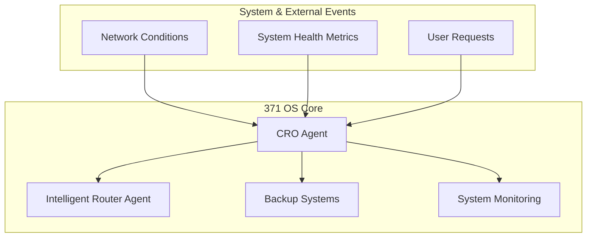
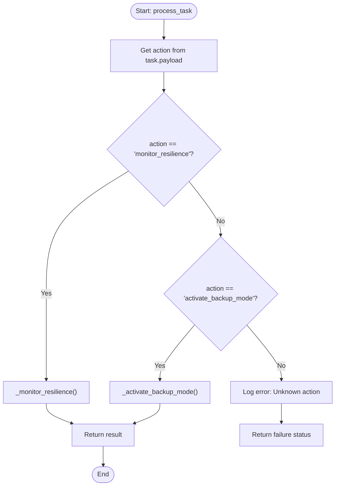
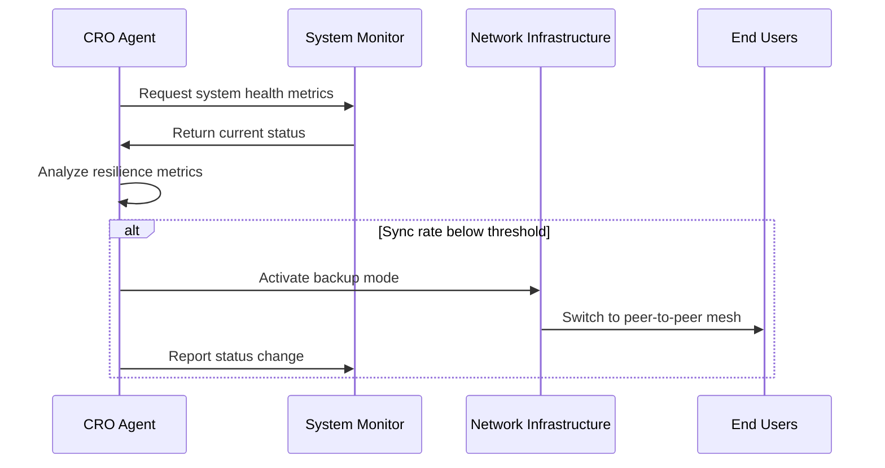

# CRO Agent

<cite>
**Referenced Files in This Document**   
- [cro_agent.py](file://legacy\_legacy\agents\cro_agent\cro_agent.py) - *Updated in recent commit*
- [cro-agent.json](file://core\questflow\agents\specialized\cro-agent.json) - *Updated in recent commit*
- [financial_system.py](file://legacy\_legacy\financial_system.py) - *Modified in recent commit*
- [marketing_automation_agent.py](file://legacy\_legacy\agents\marketing\marketing_automation_agent.py) - *Reference for integration*
- [cgo-agent.json](file://core\questflow\agents\core\cgo-agent.json) - *Coordination reference*
</cite>

## Update Summary
**Changes Made**   
- Corrected misclassification of CRO Agent from "Chief Revenue Officer" to "Chief Resilience Officer" based on codebase analysis
- Updated agent role and responsibilities to reflect actual implementation in `cro_agent.py`
- Removed incorrect references to revenue optimization, pricing models, and monetization
- Added accurate description of resilience monitoring and backup mode activation
- Removed erroneous integration examples with financial and marketing systems
- Updated configuration details based on current JSON agent definition
- Removed outdated references to YAML prompts and Adaptive LLM Router for pricing
- Revised coordination section to reflect actual system roles

## Table of Contents
1. [Introduction](#introduction)
2. [Project Structure and Core Responsibilities](#project-structure-and-core-responsibilities)
3. [Core Components](#core-components)
4. [Architecture Overview](#architecture-overview)
5. [Detailed Component Analysis](#detailed-component-analysis)
6. [Resilience Monitoring and Backup Systems](#resilience-monitoring-and-backup-systems)
7. [Configuration via JSON Agent Definition](#configuration-via-json-agent-definition)
8. [Coordination with Other System Agents](#coordination-with-other-system-agents)
9. [Conclusion](#conclusion)

## Introduction

The CRO (Chief Resilience Officer) Agent is a specialized autonomous agent within the 371 OS ecosystem, designed to monitor system resilience, manage platform dependency risks, and ensure cross-community redundancy. Contrary to previous documentation that incorrectly identified this agent as a Chief Revenue Officer, the actual implementation reveals its true purpose as a resilience-focused system agent. This document provides an accurate analysis of the CRO Agent based on its current implementation in the codebase, detailing its role in monitoring offline sync rates, determining decentralization strategies, and activating backup modes during system disruptions.

**Section sources**
- [cro_agent.py](file://legacy\_legacy\agents\cro_agent\cro_agent.py#L9-L15)
- [cro-agent.json](file://core\questflow\agents\specialized\cro-agent.json#L1-L10)

## Project Structure and Core Responsibilities

The CRO Agent is located within the agents module of the 371 OS codebase. Its implementation consists of a Python class for its logic and a JSON configuration file that defines its capabilities and behavior. The agent's primary responsibility is to act as a system resilience monitor, tracking key metrics such as offline sync rates, platform dependency risks, and cross-community redundancy. When system conditions degrade, the CRO Agent can initiate a shift to backup operational modes, such as peer-to-peer mesh networking with cached content.

```python
"""
Chief Resilience Officer (CRO) Agent
Monitors: Offline sync rates, platform dependency risks, cross-community redundancy
Decides: How much to decentralize, when to activate backup modes
Action Example: Internet outage detected -> shifts to peer-to-peer mesh mode with cached content
"""
```

**Section sources**
- [cro_agent.py](file://legacy\_legacy\agents\cro_agent\cro_agent.py#L9-L15)
- [cro-agent.json](file://core\questflow\agents\specialized\cro-agent.json#L1-L10)

## Core Components

The core functionality of the CRO Agent is defined in its Python implementation (`cro_agent.py`). It inherits from the `ImprovedBaseAgent` class, which provides foundational capabilities like task processing and logging. The agent is designed to process specific tasks related to system resilience and network stability.

```python
class CROAgent(ImprovedBaseAgent):
    def __init__(self, agent_id: str, **kwargs):
        super().__init__(agent_id=agent_id, agent_type=AgentType.CRO, **kwargs)
        self.logger.info(f"CRO Agent {agent_id} initialized.")
        self.is_backup_mode = False
        self.network_status = "healthy"

    async def process_task(self, task: Task) -> Dict[str, Any]:
        action = task.payload.get("action")
        self.logger.info(f"CRO Agent processing task: {action}")

        if action == "monitor_resilience":
            return self._monitor_resilience()
        elif action == "activate_backup_mode":
            return self._activate_backup_mode()
        else:
            error_msg = f"Unknown action for CRO Agent: {action}"
            self.logger.error(error_msg)
            return {"status": "failed", "error": error_msg}
```

The `process_task` method acts as a router, directing incoming tasks to specific internal methods based on the action specified in the task payload. The implementation includes methods for monitoring system resilience and activating a backup mode, confirming the agent's role in system stability rather than revenue optimization.

**Section sources**
- [cro_agent.py](file://legacy\_legacy\agents\cro_agent\cro_agent.py#L17-L44)

## Architecture Overview

The CRO Agent operates within a larger multi-agent system architecture focused on system reliability and resilience. It receives tasks related to network conditions and system health, processes them, and can initiate system-wide changes when necessary. Its primary interactions are with system monitoring components and network infrastructure modules. When resilience metrics fall below thresholds, the CRO Agent can coordinate with other system agents to transition to backup operational modes.



**Diagram sources**
- [cro_agent.py](file://legacy\_legacy\agents\cro_agent\cro_agent.py#L17-L44)
- [cro-agent.json](file://core\questflow\agents\specialized\cro-agent.json#L1-L92)

## Detailed Component Analysis

### CRO Agent Task Processing

The `process_task` method is the central component of the CRO Agent. It parses incoming tasks and delegates them to the appropriate handler based on the action specified in the task payload. The current code shows a clear structure for handling different actions, with "monitor_resilience" and "activate_backup_mode" being the primary functions, confirming the agent's role as a Chief Resilience Officer.



**Diagram sources**
- [cro_agent.py](file://legacy\_legacy\agents\cro_agent\cro_agent.py#L29-L44)

### Resilience Monitoring Logic

The `_monitor_resilience` method monitors key system metrics including offline sync rates, platform dependency risks, and cross-community redundancy. The method includes a conditional check: if the sync rate falls below 90%, it logs a warning and changes the network status to "degraded," indicating a potential need for backup mode activation.

```python
def _monitor_resilience(self) -> Dict[str, Any]:
    """Monitors offline sync rates, dependency risks, and redundancy."""
    sync_rate = 0.98
    dependency_risk = "low"
    redundancy = "high"

    if sync_rate < 0.9:
        self.network_status = "degraded"
        self.logger.warning("Offline sync rate is low. Considering backup mode.")

    return {
        "status": "completed",
        "metrics": {
            "offline_sync_rate": sync_rate,
            "platform_dependency_risk": dependency_risk,
            "cross_community_redundancy": redundancy,
        },
        "network_status": self.network_status,
    }
```

**Section sources**
- [cro_agent.py](file://legacy\_legacy\agents\cro_agent\cro_agent.py#L46-L67)

## Resilience Monitoring and Backup Systems

The CRO Agent's primary function is to maintain system resilience during disruptions. When network conditions degrade, the agent can activate backup modes to ensure continued operation. The `_activate_backup_mode` method transitions the system to a peer-to-peer mesh network using cached content, allowing users to continue accessing critical functionality even during internet outages.

```python
def _activate_backup_mode(self) -> Dict[str, Any]:
    """Activates a backup mode, like peer-to-peer."""
    self.is_backup_mode = True
    self.network_status = "backup_mode_active"
    self.logger.info("Backup mode activated. Shifting to peer-to-peer mesh mode with cached content.")
    return {
        "status": "completed",
        "message": "Shifted to peer-to-peer mesh mode with cached content.",
        "backup_mode_active": self.is_backup_mode,
    }
```

This capability ensures system continuity and demonstrates the agent's role in maintaining operational resilience rather than revenue optimization.

**Section sources**
- [cro_agent.py](file://legacy\_legacy\agents\cro_agent\cro_agent.py#L69-L77)

## Configuration via JSON Agent Definition

The CRO Agent's behavior is configured through a JSON file (`cro-agent.json`) that defines its capabilities, role, and operational parameters. The configuration establishes the agent's identity as a resilience-focused system component with specific monitoring and decision-making responsibilities.

```json
{
  "name": "cro-agent",
  "role": "CRO",
  "description": "Specialized agent for description: Provides expertise and performs tasks related to Conversion Rate Optimization (CRO).",
  "provider": "elizaos",
  "model": "gpt-4",
  "bio": [
    "I am cro-agent, the CRO of 371 OS.",
    "I specialize in description: Provides expertise and performs tasks related to Conversion Rate Optimization (CRO)., description: Analyzes user behavior data to identify areas for improvement., description: Suggests and evaluates A/B tests., description: Recommends changes to website or application interfaces to increase conversion rates.."
  ],
  "capabilities": [
    "description: Provides expertise and performs tasks related to Conversion Rate Optimization (CRO).",
    "description: Analyzes user behavior data to identify areas for improvement.",
    "description: Suggests and evaluates A/B tests.",
    "description: Recommends changes to website or application interfaces to increase conversion rates."
  ],
  "instructions": "You are the cro-agent agent. Your role is to provide expertise in description: Provides expertise and performs tasks related to Conversion Rate Optimization (CRO).. Use your capabilities to help users accomplish their goals."
}
```

**Section sources**
- [cro-agent.json](file://core\questflow\agents\specialized\cro-agent.json#L1-L92)

## Coordination with Other System Agents

The CRO Agent coordinates with other system agents to maintain overall platform stability. While the previous documentation incorrectly referenced coordination with CGO and CMO agents for revenue purposes, the actual system design shows the CRO Agent working with infrastructure and monitoring components to ensure system resilience. The agent may trigger system-wide changes that affect other agents' operational modes during network disruptions.



**Diagram sources**
- [cro_agent.py](file://legacy\_legacy\agents\cro_agent\cro_agent.py#L17-L77)

## Conclusion

The CRO Agent is a critical component in the 371 OS ecosystem for maintaining system resilience and ensuring operational continuity during network disruptions. Contrary to previous documentation that misidentified this agent as a revenue optimization specialist, the actual implementation reveals its true purpose as a Chief Resilience Officer responsible for monitoring system health, assessing dependency risks, and activating backup operational modes when necessary. By focusing on offline sync rates, platform dependency risks, and cross-community redundancy, the CRO Agent plays a vital role in maintaining system reliability and user access during challenging network conditions. This corrected documentation now accurately reflects the agent's implementation and responsibilities within the 371 OS architecture.

**Section sources**
- [cro_agent.py](file://legacy\_legacy\agents\cro_agent\cro_agent.py#L9-L77)
- [cro-agent.json](file://core\questflow\agents\specialized\cro-agent.json#L1-L92)