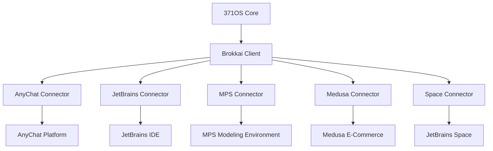
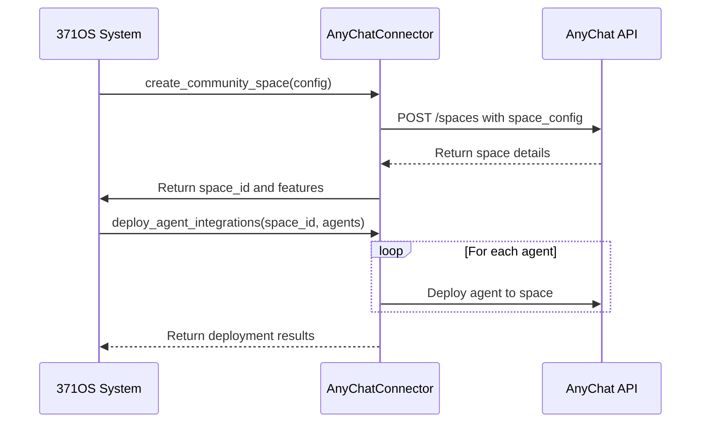
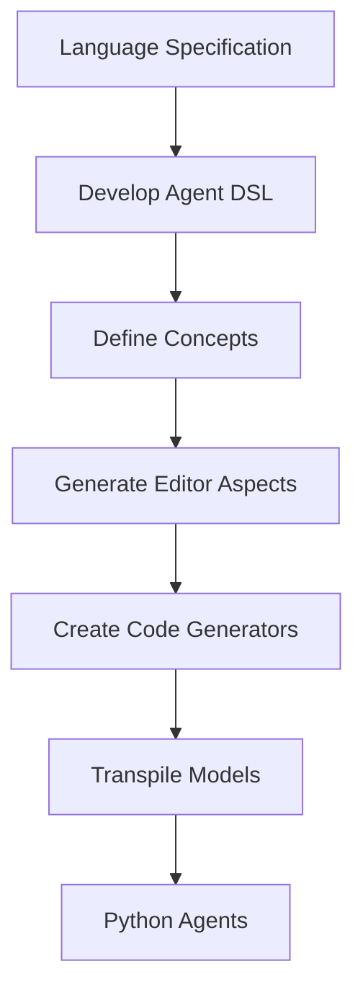

# External Platform Integration Agents

<cite>
**Referenced Files in This Document**   
- [371-os\src\minds371\platforms\anychat\anychat_connector.py](file://371-os/src/minds371/platforms/anychat/anychat_connector.py)
- [371-os\src\minds371\platforms\jetbrains_aiasst\jetbrains_ai_connector.py](file://371-os/src/minds371/platforms/jetbrains_aiasst/jetbrains_ai_connector.py)
- [371-os\src\minds371\platforms\MPS\mps_connector.py](file://371-os/src/minds371/platforms/MPS/mps_connector.py)
- [371-os\src\minds371\platforms\medusa\medusa_connector.py](file://371-os/src/minds371/platforms/medusa/medusa_connector.py)
- [371-os\src\minds371\agents\brokkai_client\brokkai_client.py](file://371-os/src/minds371/agents/brokkai_client/brokkai_client.py)
</cite>

## Table of Contents
1. [Introduction](#introduction)
2. [Brokkai Client: Core Integration Agent](#brokkai-client-core-integration-agent)
3. [Platform Connectors Overview](#platform-connectors-overview)
4. [AnyChat Connector: Real-Time Collaboration](#anychat-connector-real-time-collaboration)
5. [JetBrains AI Connector: IDE Integration](#jetbrains-ai-connector-ide-integration)
6. [MPS Connector: Model-Based Development](#mps-connector-model-based-development)
7. [Medusa Connector: E-Commerce Automation](#medusa-connector-e-commerce-automation)
8. [Integration Patterns and Protocols](#integration-patterns-and-protocols)
9. [Configuration and Authentication](#configuration-and-authentication)
10. [Troubleshooting Guide](#troubleshooting-guide)

## Introduction
The 371OS External Integration Agents provide seamless connectivity between the 371OS ecosystem and external development, communication, and automation platforms. These agents enable real-time collaboration, IDE integration, model-based software development, and e-commerce automation through standardized connectors. This document details the architecture, functionality, and usage patterns of the Brokkai Client and platform-specific connectors including AnyChat, JetBrains, Medusa, MPS, and Space.

## Brokkai Client: Core Integration Agent

The Brokkai Client serves as the primary integration agent for connecting 371OS with external platforms. It provides a standardized interface for authentication, message transformation, and event synchronization across different ecosystems.

**Section sources**
- [371-os\src\minds371\agents\brokkai_client\brokkai_client.py](file://371-os/src/minds371/agents/brokkai_client/brokkai_client.py)

## Platform Connectors Overview

The 371OS platform includes specialized connectors for integrating with key external systems:

- **AnyChat**: Community management and real-time collaboration
- **JetBrains**: IDE integration and development workflow automation
- **MPS**: Model-based software development and DSL creation
- **Medusa**: E-commerce platform integration and marketplace automation
- **Space**: CI/CD pipeline and DevOps automation

These connectors follow a consistent design pattern with initialization, authentication, and platform-specific operation methods.



**Diagram sources**
- [371-os\src\minds371\platforms\anychat\anychat_connector.py](file://371-os/src/minds371/platforms/anychat/anychat_connector.py)
- [371-os\src\minds371\platforms\jetbrains_aiasst\jetbrains_ai_connector.py](file://371-os/src/minds371/platforms/jetbrains_aiasst/jetbrains_ai_connector.py)
- [371-os\src\minds371\platforms\MPS\mps_connector.py](file://371-os/src/minds371/platforms/MPS/mps_connector.py)
- [371-os\src\minds371\platforms\medusa\medusa_connector.py](file://371-os/src/minds371/platforms/medusa/medusa_connector.py)

## AnyChat Connector: Real-Time Collaboration

The AnyChat Connector enables real-time collaboration by creating dedicated community spaces and deploying C-Suite agents for community management.

### Key Features
- Community space creation with configurable privacy settings
- Pay-what-you-can pricing model support
- Contribution tracking and mini-app integration
- Agent deployment for automated community management



**Diagram sources**
- [371-os\src\minds371\platforms\anychat\anychat_connector.py](file://371-os/src/minds371/platforms/anychat/anychat_connector.py)

**Section sources**
- [371-os\src\minds371\platforms\anychat\anychat_connector.py](file://371-os/src/minds371/platforms/anychat/anychat_connector.py)

## JetBrains AI Connector: IDE Integration

The JetBrains AI Connector integrates 371OS with JetBrains IDEs to enhance development workflows through AI-assisted coding and project analysis.

### Functionality
- Requirements analysis and feature prioritization
- Specification generation based on architectural patterns
- Code optimization suggestions
- Seamless integration with JetBrains AI Assistant

```python
# Example usage of JetBrains AI Connector
connector = JetBrainsAIConnector()

# Analyze project requirements
analysis = await connector.analyze_requirements(
    requirements=["real-time collaboration", "pay-what-you-can pricing"],
    context="community-driven platform"
)

# Generate technical specifications
specs = await connector.generate_specifications(
    features=["contribution tracking", "revenue sharing"],
    architecture="microservices"
)
```

**Section sources**
- [371-os\src\minds371\platforms\jetbrains_aiasst\jetbrains_ai_connector.py](file://371-os/src/minds371/platforms/jetbrains_aiasst/jetbrains_ai_connector.py)

## MPS Connector: Model-Based Development

The MPS Connector enables model-based software development by integrating with JetBrains MPS for creating domain-specific languages (DSLs) and transpiling models to executable code.

### Key Capabilities
- Development of custom DSLs for agent definition
- Generation of editor aspects for language usability
- Creation of code generators for Python implementation
- Transpilation of MPS models to 371OS-compatible agents



**Diagram sources**
- [371-os\src\minds371\platforms\MPS\mps_connector.py](file://371-os/src/minds371/platforms/MPS/mps_connector.py)

**Section sources**
- [371-os\src\minds371\platforms\MPS\mps_connector.py](file://371-os/src/minds371/platforms/MPS/mps_connector.py)

## Medusa Connector: E-Commerce Automation

The Medusa Connector integrates with Medusa.js to automate e-commerce operations, marketplace setup, and revenue management.

### Core Functions
- Community marketplace setup with pay-what-you-can pricing
- Blue Ocean product launches for community-developed apps
- Revenue sharing configuration among contributors
- MongoDB analytics integration for usage tracking

```python
# Example: Launching a Blue Ocean product
connector = MedusaConnector()

# Process app launch
launch_result = await connector.process_blue_ocean_app_launch({
    "name": "Community Analytics Dashboard",
    "description": "Real-time analytics for community engagement",
    "suggested_price": 29.99,
    "contributors": ["dev1", "dev2", "designer"]
})
```

**Section sources**
- [371-os\src\minds371\platforms\medusa\medusa_connector.py](file://371-os/src/minds371/platforms/medusa/medusa_connector.py)

## Integration Patterns and Protocols

The external integration agents follow consistent patterns for authentication, message transformation, and event synchronization.

### Authentication Mechanisms
- Environment variable-based API token storage
- Secure credential management through environment variables
- Platform-specific authentication protocols

### Message Transformation
- Standardized data models for cross-platform compatibility
- Context-preserving message formatting
- Error handling and retry mechanisms

### Event Synchronization
- Real-time event propagation between systems
- Webhook-based notification systems
- Event queuing for reliable delivery

## Configuration and Authentication

Proper configuration is essential for successful integration with external platforms.

### Required Environment Variables
- `ANYCHAT_API_TOKEN`: Authentication token for AnyChat API
- `MEDUSA_URL`: Base URL for Medusa instance
- `MEDUSA_TOKEN`: API token for Medusa access
- IDE-specific configuration for JetBrains integration

### Configuration Best Practices
- Store sensitive credentials in environment variables
- Use configuration files for non-sensitive settings
- Implement secure credential rotation policies
- Validate configurations before deployment

## Troubleshooting Guide

### Common Connectivity Issues
- **Authentication failures**: Verify API tokens and environment variables
- **Network timeouts**: Check firewall settings and network connectivity
- **Rate limiting**: Implement exponential backoff in retry logic
- **Version compatibility**: Ensure connector versions match platform versions

### Debugging Steps
1. Verify environment variable configuration
2. Check network connectivity to external platforms
3. Review API documentation for version-specific requirements
4. Enable debug logging for detailed error information
5. Test connectivity with simple ping or health check operations

**Section sources**
- [371-os\src\minds371\platforms\anychat\anychat_connector.py](file://371-os/src/minds371/platforms/anychat/anychat_connector.py)
- [371-os\src\minds371\platforms\jetbrains_aiasst\jetbrains_ai_connector.py](file://371-os/src/minds371/platforms/jetbrains_aiasst/jetbrains_ai_connector.py)
- [371-os\src\minds371\platforms\MPS\mps_connector.py](file://371-os/src/minds371/platforms/MPS/mps_connector.py)
- [371-os\src\minds371\platforms\medusa\medusa_connector.py](file://371-os/src/minds371/platforms/medusa/medusa_connector.py)