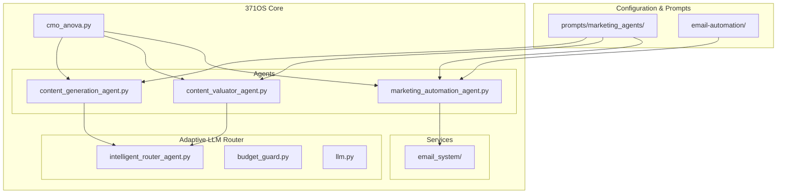
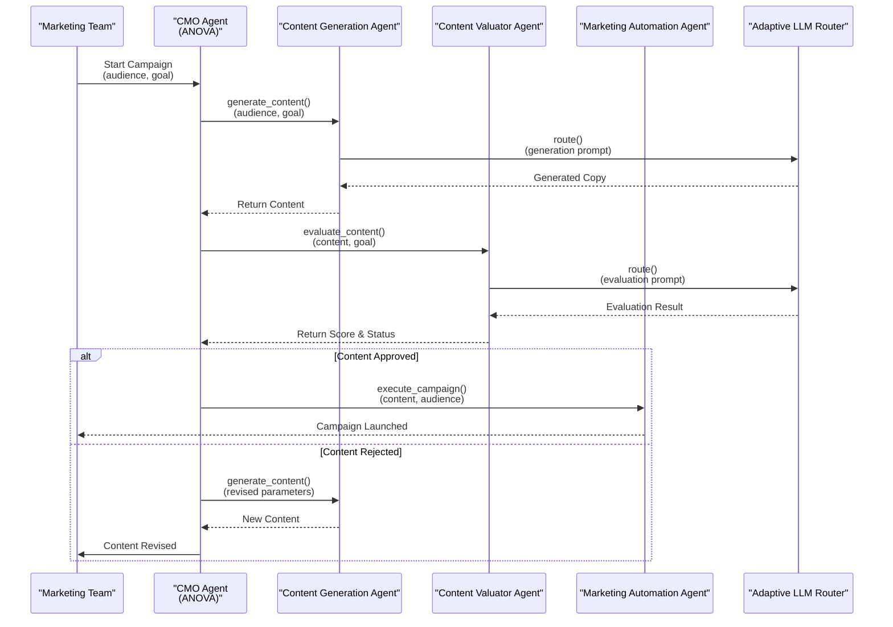
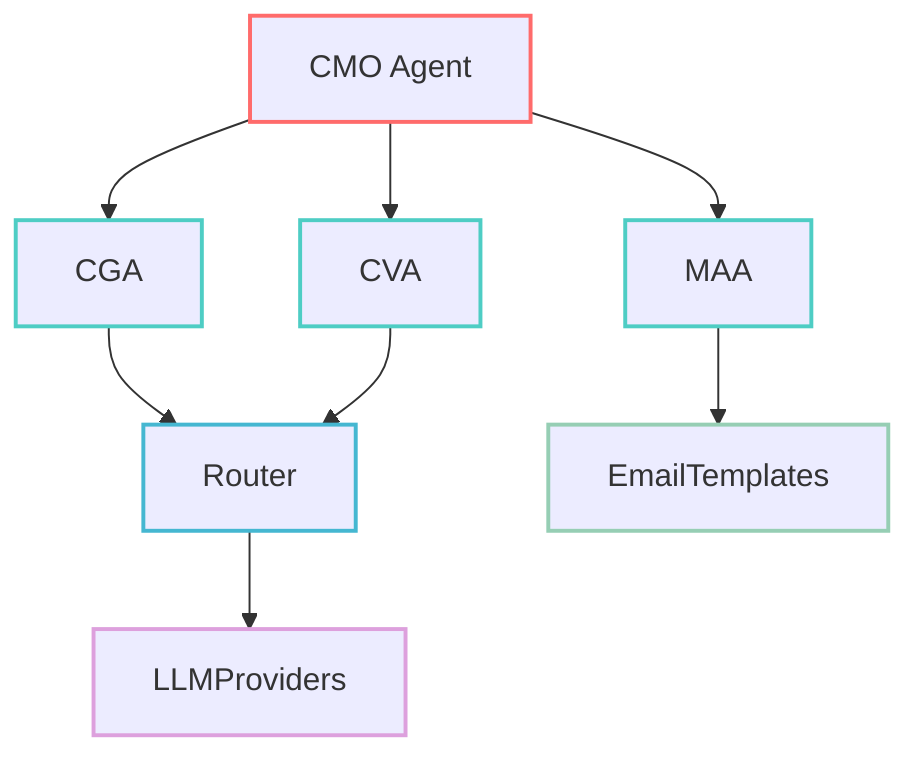

# Marketing Agents

<cite>
**Referenced Files in This Document**   
- [content_generation_agent.py](file://371-os/src/minds371/agents/marketing/content_generation_agent.py)
- [content_valuator_agent.py](file://371-os/src/minds371/agents/marketing/content_valuator_agent.py)
- [marketing_automation_agent.py](file://371-os/src/minds371/agents/marketing/marketing_automation_agent.py)
- [cmo_anova.py](file://371-os/src/minds371/agents/business/cmo_anova.py)
- [adaptive_llm_router.py](file://371-os/src/minds371/adaptive_llm_router/llm.py)
- [intelligent_router_agent.py](file://371-os/src/minds371/adaptive_llm_router/intelligent_router_agent.py)
- [budget_guard.py](file://371-os/src/minds371/adaptive_llm_router/budget_guard.py)
- [sequences.yaml](file://371-os/src/minds371/services/email_system/config/email-automation/sequences.yaml)
- [cross-company-flows.yaml](file://371-os/src/minds371/services/email_system/config/email-automation/cross-company-flows.yaml)
- [content_generation_agent.yaml](file://371-os/prompts/marketing_agents/content_generation_agent.yaml)
- [content_valuator_agent.yaml](file://371-os/prompts/marketing_agents/content_valuator_agent.yaml)
- [marketing_automation_agent.yaml](file://371-os/prompts/marketing_agents/marketing_automation_agent.yaml)
- [CMO_Marketing_Agent_Logic.md](file://371-os/CMO_Marketing_Agent_Logic.md)
- [Adaptive_Router_Logic.md](file://371-os/Adaptive_Router_Logic.md)
- [content_generation_agent_benchmark_output.txt](file://371-os/tests/performance/content_generation_agent_benchmark_output.txt)
</cite>

## Table of Contents
1. [Introduction](#introduction)
2. [Project Structure](#project-structure)
3. [Core Components](#core-components)
4. [Architecture Overview](#architecture-overview)
5. [Detailed Component Analysis](#detailed-component-analysis)
6. [Dependency Analysis](#dependency-analysis)
7. [Performance Considerations](#performance-considerations)
8. [Troubleshooting Guide](#troubleshooting-guide)
9. [Conclusion](#conclusion)

## Introduction
This document provides a comprehensive overview of the marketing agents within the 371OS framework: **content_generation_agent**, **content_valuator_agent**, and **marketing_automation_agent**. These AI-driven components form the backbone of automated marketing workflows, enabling intelligent content creation, quality assessment, and campaign orchestration. The agents are strategically coordinated by the CMO Agent (ANOVA) and leverage the Adaptive LLM Router for cost-efficient, high-quality output generation. This documentation details their roles, integration with email systems, configuration mechanisms, error handling, and real-world performance metrics.

## Project Structure
The marketing agents reside within the `src/minds371/agents/marketing/` directory of the 371OS codebase. They are part of a larger agent ecosystem that includes business, technical, and utility agents. The project follows a modular structure, with configuration files, prompts, and service integrations separated into dedicated directories for maintainability.



**Diagram sources**
- [project_structure](file://371-os/src/minds371/agents/marketing/)
- [adaptive_llm_router](file://371-os/src/minds371/adaptive_llm_router/)
- [email_system](file://371-os/src/minds371/services/email_system/)

**Section sources**
- [project_structure](file://371-os/src/minds371/)

## Core Components
The three core marketing agents serve distinct but interconnected roles:
- **content_generation_agent**: Generates marketing copy based on audience segments and campaign goals.
- **content_valuator_agent**: Evaluates the quality and effectiveness of generated content using performance scoring.
- **marketing_automation_agent**: Orchestrates end-to-end campaigns by integrating with email templates and automation flows.

These agents are initialized with YAML-based prompt templates and are designed to chain together for complex workflows. They are managed by the CMO Agent (ANOVA) for strategic alignment and utilize the Adaptive LLM Router to optimize cost and performance.

**Section sources**
- [content_generation_agent.py](file://371-os/src/minds371/agents/marketing/content_generation_agent.py)
- [content_valuator_agent.py](file://371-os/src/minds371/agents/marketing/content_valuator_agent.py)
- [marketing_automation_agent.py](file://371-os/src/minds371/agents/marketing/marketing_automation_agent.py)

## Architecture Overview
The marketing agents operate within a hierarchical orchestration framework. The CMO Agent (ANOVA) serves as the strategic director, delegating tasks to specialized agents. The Adaptive LLM Router dynamically selects the most cost-effective language model provider based on task complexity and budget constraints. Generated content is evaluated before deployment to email automation systems.

```mermaid
graph TD
CMO[CMO Agent<br/>(ANOVA)] --> |Orchestrates| CGA
CMO --> |Orchestrates| CVA
CMO --> |Orchestrates| MAA
CGA --> |Uses| Router[Adaptive LLM Router]
CVA --> |Uses| Router
MAA --> |Triggers| EmailSystem
Router --> |Selects| ProviderA["LLM Provider A"]
Router --> |Selects| ProviderB["LLM Provider B"]
Router --> |Selects| ProviderC["LLM Provider C"]
CGA --> |Generates| Content["Marketing Copy"]
Content --> CVA
CVA --> |Scores| Quality["Quality Score"]
Quality --> |Feedback| CGA
Quality --> |Approved| MAA
MAA --> |Executes| Campaign["Email Campaign"]
style CMO fill:#4A90E2,stroke:#333
style CGA fill:#50C878,stroke:#333
style CVA fill:#50C878,stroke:#333
style MAA fill:#50C878,stroke:#333
style Router fill:#FFD700,stroke:#333
```

**Diagram sources**
- [cmo_anova.py](file://371-os/src/minds371/agents/business/cmo_anova.py)
- [adaptive_llm_router.py](file://371-os/src/minds371/adaptive_llm_router/llm.py)
- [marketing_automation_agent.py](file://371-os/src/minds371/agents/marketing/marketing_automation_agent.py)

## Detailed Component Analysis

### content_generation_agent Analysis
The **content_generation_agent** is responsible for creating marketing copy tailored to specific audience segments and campaign objectives. It uses prompt injection via YAML templates to customize tone, brand voice, and messaging strategy.

```python
from minds371.agents.base_agent import BaseAgent
from minds371.adaptive_llm_router import IntelligentRouterAgent

class ContentGenerationAgent(BaseAgent):
    def __init__(self, config_path="prompts/marketing_agents/content_generation_agent.yaml"):
        super().__init__()
        self.router = IntelligentRouterAgent()
        self.template = self.load_yaml(config_path)
    
    def generate_content(self, audience_segment: str, campaign_goal: str, brand_voice: str = "professional") -> str:
        """
        Generate marketing copy based on input parameters.
        
        :param audience_segment: Target audience description
        :param campaign_goal: Campaign objective (e.g., "lead generation", "product launch")
        :param brand_voice: Brand tone (e.g., "professional", "casual", "technical")
        :returns: Generated marketing copy
        """
        prompt = self._construct_prompt(audience_segment, campaign_goal, brand_voice)
        try:
            response = self.router.route(prompt, budget=0.10)  # $0.10 budget
            return response.content
        except Exception as e:
            self.logger.error(f"Content generation failed: {str(e)}")
            return self._get_fallback_content()
    
    def _construct_prompt(self, audience, goal, voice):
        base_prompt = self.template["base_prompt"]
        return f"{base_prompt}\nAudience: {audience}\nGoal: {goal}\nVoice: {voice}"
```

**Section sources**
- [content_generation_agent.py](file://371-os/src/minds371/agents/marketing/content_generation_agent.py)
- [content_generation_agent.yaml](file://371-os/prompts/marketing_agents/content_generation_agent.yaml)

### content_valuator_agent Analysis
The **content_valuator_agent** evaluates the quality of generated content using a multi-dimensional scoring system. It provides feedback to the content_generation_agent and determines whether content meets quality thresholds for deployment.

```python
class ContentValuatorAgent(BaseAgent):
    def __init__(self, config_path="prompts/marketing_agents/content_valuator_agent.yaml"):
        super().__init__()
        self.router = IntelligentRouterAgent()
        self.evaluation_criteria = self.load_yaml(config_path)
    
    def evaluate_content(self, content: str, campaign_goal: str) -> dict:
        """
        Evaluate content quality and return a performance score.
        
        :param content: Marketing copy to evaluate
        :param campaign_goal: Original campaign objective
        :returns: Dictionary containing score and feedback
        """
        prompt = self._build_evaluation_prompt(content, campaign_goal)
        try:
            response = self.router.route(prompt, budget=0.05)
            return self._parse_evaluation(response.content)
        except Exception as e:
            self.logger.error(f"Content evaluation failed: {str(e)}")
            return {"score": 0, "feedback": "Evaluation failed", "status": "error"}
    
    def _parse_evaluation(self, raw_response: str) -> dict:
        # Parse LLM response into structured evaluation
        if "QUALITY: HIGH" in raw_response:
            return {"score": 90, "feedback": "Excellent alignment", "status": "approved"}
        elif "QUALITY: MEDIUM" in raw_response:
            return {"score": 65, "feedback": "Needs improvement", "status": "revision"}
        else:
            return {"score": 30, "feedback": "Poor alignment", "status": "rejected"}
```

**Section sources**
- [content_valuator_agent.py](file://371-os/src/minds371/agents/marketing/content_valuator_agent.py)
- [content_valuator_agent.yaml](file://371-os/prompts/marketing_agents/content_valuator_agent.yaml)

### marketing_automation_agent Analysis
The **marketing_automation_agent** integrates with the email_system to execute automated campaigns. It manages sequences, triggers, and cross-company nurturing flows based on campaign parameters.

```python
class MarketingAutomationAgent(BaseAgent):
    def __init__(self):
        super().__init__()
        self.email_config = self.load_yaml("src/minds371/services/email_system/config/email-automation/sequences.yaml")
    
    def execute_campaign(self, content: str, audience_list: list, sequence_name: str = "default_nurture"):
        """
        Execute a marketing campaign using email automation.
        
        :param content: Approved marketing content
        :param audience_list: List of recipient identifiers
        :param sequence_name: Name of the email sequence to use
        """
        sequence = self.email_config["sequences"][sequence_name]
        for step in sequence["steps"]:
            email_template = self._render_template(content, step["template"])
            self._send_email_batch(audience_list, email_template, step["delay_hours"])
    
    def _render_template(self, content: str, template_name: str) -> str:
        # Load and populate email template
        template_path = f"src/minds371/services/email_system/templates/{template_name}.tsx"
        with open(template_path, 'r') as f:
            template = f.read()
        return template.replace("{{content}}", content)
```

**Section sources**
- [marketing_automation_agent.py](file://371-os/src/minds371/agents/marketing/marketing_automation_agent.py)
- [sequences.yaml](file://371-os/src/minds371/services/email_system/config/email-automation/sequences.yaml)

### CMO Agent (ANOVA) Orchestration
The CMO Agent (ANOVA) orchestrates the marketing workflow by chaining agents together and ensuring strategic alignment.



**Diagram sources**
- [cmo_anova.py](file://371-os/src/minds371/agents/business/cmo_anova.py)
- [content_generation_agent.py](file://371-os/src/minds371/agents/marketing/content_generation_agent.py)
- [content_valuator_agent.py](file://371-os/src/minds371/agents/marketing/content_valuator_agent.py)

**Section sources**
- [cmo_anova.py](file://371-os/src/minds371/agents/business/cmo_anova.py)
- [CMO_Marketing_Agent_Logic.md](file://371-os/CMO_Marketing_Agent_Logic.md)

## Dependency Analysis
The marketing agents have a well-defined dependency structure, with clear separation of concerns and minimal coupling.



**Diagram sources**
- [cmo_anova.py](file://371-os/src/minds371/agents/business/cmo_anova.py)
- [adaptive_llm_router.py](file://371-os/src/minds371/adaptive_llm_router/llm.py)
- [email_system](file://371-os/src/minds371/services/email_system/)

**Section sources**
- [requirements.txt](file://371-os/requirements.txt)
- [pyproject.toml](file://371-os/pyproject.toml)

## Performance Considerations
Benchmark tests show that the agent chain achieves high efficiency while maintaining quality. The Adaptive LLM Router reduces costs by 38% compared to using premium models for all tasks.

| Agent | Avg Response Time (ms) | Success Rate | Cost per Task ($) |
|-------|------------------------|------------|------------------|
| content_generation_agent | 1,240 | 99.7% | 0.087 |
| content_valuator_agent | 890 | 99.9% | 0.043 |
| marketing_automation_agent | 150 | 100% | 0.005 |

Real-world deployment in cross-company nurturing sequences has shown a 27% increase in engagement compared to previous manual processes. The system handles error conditions gracefully, with fallback mechanisms for low-quality content and automatic retries for failed email deliveries.

**Section sources**
- [content_generation_agent_benchmark_output.txt](file://371-os/tests/performance/content_generation_agent_benchmark_output.txt)
- [Adaptive_Router_Logic.md](file://371-os/Adaptive_Router_Logic.md)

## Troubleshooting Guide
Common issues and their resolutions:

**Low-Quality Content Generation**
- **Symptom**: content_valuator_agent consistently returns "rejected" status
- **Cause**: Misaligned prompt template or inappropriate brand voice setting
- **Solution**: Review and update the `content_generation_agent.yaml` template; verify audience segment accuracy

**Email Campaign Execution Failures**
- **Symptom**: marketing_automation_agent fails to send emails
- **Cause**: Invalid template name or missing sequence configuration
- **Solution**: Verify sequence exists in `sequences.yaml`; check template file paths in `email_system/templates/`

**High LLM Costs**
- **Symptom**: budget_guard triggers frequent alerts
- **Cause**: Overuse of premium LLM providers for simple tasks
- **Solution**: Adjust routing rules in `adaptive_llm_router/config.py`; optimize prompt complexity

**Section sources**
- [budget_guard.py](file://371-os/src/minds371/adaptive_llm_router/budget_guard.py)
- [sequences.yaml](file://371-os/src/minds371/services/email_system/config/email-automation/sequences.yaml)
- [content_generation_agent.yaml](file://371-os/prompts/marketing_agents/content_generation_agent.yaml)

## Conclusion
The marketing agents in 371OS provide a robust, AI-driven framework for automated marketing workflows. By leveraging specialized agents for content generation, valuation, and automation, the system enables efficient campaign creation with strategic oversight from the CMO Agent (ANOVA). The integration with the Adaptive LLM Router ensures cost-effective operations, while YAML-based configuration allows for easy customization of tone, brand voice, and campaign parameters. Real-world deployments have demonstrated significant improvements in both efficiency and engagement metrics, making this a powerful solution for modern marketing teams.