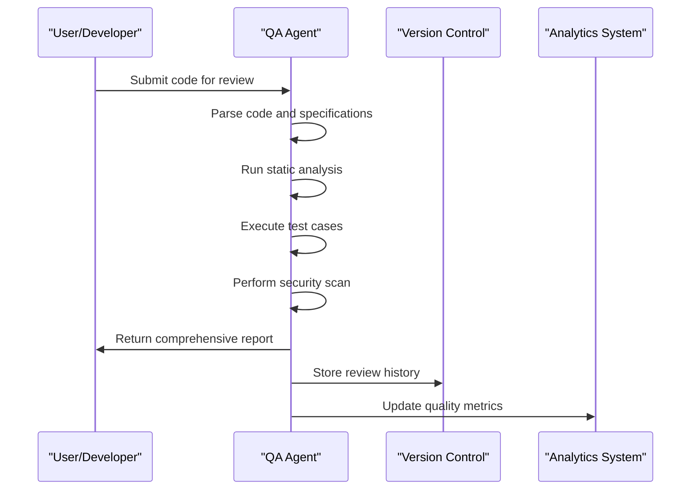

# Specialized Functional Agents

<cite>
**Referenced Files in This Document**   
- [system_architecture.html](file://371-os/docs/architecture/system_architecture.html)
- [cmo_agent_prompt.yaml](file://prompts/business_agents/cmo_agent_prompt.yaml)
- [marketing_automation_agent.yaml](file://prompts/marketing_agents/marketing_automation_agent.yaml)
- [tech_stack_specialist_agent.yaml](file://prompts/technical_agents/tech_stack_specialist_agent.yaml)
- [qa_agent.yaml](file://prompts/technical_agents/qa_agent.yaml)
- [repository_intake_agent.yaml](file://prompts/technical_agents/repository_intake_agent.yaml)
- [financial_agent.yaml](file://prompts/utility_agents/financial_agent.yaml)
- [agent_utility_belt.yaml](file://prompts/utility_agents/agent_utility_belt.yaml)
- [code_campfile_agent.py](file://371-os/src/minds371/agents/technical/code_campfile_agent.py)
- [code_mern_agent.py](file://371-os/src/minds371/agents/technical/code_mern_agent.py)
- [cto_agent_prompt.yaml](file://prompts/business_agents/cto_agent_prompt.yaml)
- [# 371 OS Agents and Meta Prompts.md](file://prompts/# 371 OS Agents and Meta Prompts.md)
- [financial_agent.py](file://371-os/src/minds371/agents/utility/financial_agent.py)
- [agent_utility_belt_results.md](file://371-os/src/minds371/agents/utility/agent_utility_belt_results.md)
</cite>

## Table of Contents
1. [Introduction](#introduction)
2. [Marketing Agents](#marketing-agents)
   - [Content Generation Agent](#content-generation-agent)
   - [Content Valuator Agent](#content-valuator-agent)
   - [Marketing Automation Agent](#marketing-automation-agent)
3. [Technical Agents](#technical-agents)
   - [Code Generation Agents (MERN/T3/Campfile)](#code-generation-agents-mern-t3-campfile)
   - [Unity AI Agent](#unity-ai-agent)
   - [Deployment Agent](#deployment-agent)
   - [QA Agent](#qa-agent)
   - [Repository Intake Agent](#repository-intake-agent)
   - [MindScript Agent](#mindscript-agent)
4. [Utility Agents](#utility-agents)
   - [Credential Warehouse Agent](#credential-warehouse-agent)
   - [Financial Agent](#financial-agent)
   - [Router Agent](#router-agent)
   - [Agent Utility Belt](#agent-utility-belt)
5. [Orchestration and Integration](#orchestration-and-integration)
6. [Performance Benchmarks and Use Cases](#performance-benchmarks-and-use-cases)
7. [Extensibility and External Integration](#extensibility-and-external-integration)
8. [Conclusion](#conclusion)

## Introduction

The 371OS ecosystem features a comprehensive suite of specialized functional agents organized into three primary domains: Marketing, Technical, and Utility. These agents are designed to operate as autonomous specialists, each with clearly defined capabilities, input/output schemas, and integration points with executive-level C-Suite agents. The architecture leverages a base agent framework that provides common functionality while enabling domain-specific specialization.

Specialized agents in 371OS are orchestrated by executive agents (CEO, CTO, CMO, etc.) and execute tasks through the Universal Tool Server, which provides standardized access to external tools and services. This document details the functionality, configuration, and operational characteristics of these specialized agents, providing a comprehensive reference for developers and system administrators.

**Section sources**
- [system_architecture.html](file://371-os/docs/architecture/system_architecture.html#L273-L295)
- [# 371 OS Agents and Meta Prompts.md](file://prompts/# 371 OS Agents and Meta Prompts.md#L315-L332)

## Marketing Agents

Marketing agents in 371OS specialize in content creation, valuation, and campaign automation. These agents integrate with executive CMO agents to execute marketing strategies and provide performance analytics.

### Content Generation Agent

The Content Generation Agent specializes in creating high-quality marketing content across various formats including social media posts, email campaigns, blog articles, and advertising copy. It operates based on prompts defined in the marketing_agents directory and follows structured response formats.

**Input/Output Schema:**
```
Input: {task_description, content_type, target_audience, tone_guidelines}
Output: {generated_content, content_metadata, quality_score, suggested_improvements}
```

The agent uses natural language generation techniques to produce contextually appropriate content that aligns with brand guidelines and marketing objectives.

**Integration with C-Suite Agents:**
- Receives strategic direction from CMO Agent
- Reports performance metrics to CFO Agent
- Coordinates with CTO Agent for technical implementation of content delivery systems

**Section sources**
- [cmo_agent_prompt.yaml](file://prompts/business_agents/cmo_agent_prompt.yaml#L0-L37)
- [system_architecture.html](file://371-os/docs/architecture/system_architecture.html#L315-L335)

### Content Valuator Agent

The Content Valuator Agent assesses the quality, relevance, and potential effectiveness of marketing content. It applies analytical frameworks to evaluate content against predefined KPIs and provides actionable feedback for optimization.

**Primary Function:**
- Content quality assessment
- Engagement prediction
- SEO optimization recommendations
- Brand alignment verification

The agent processes both generated and existing content, providing quantitative scores and qualitative feedback to improve marketing effectiveness.

### Marketing Automation Agent

The Marketing Automation Agent manages end-to-end marketing workflows, including email sequences, campaign triggers, and cross-platform automation.


**Configuration Parameters:**
```yaml
configuration:
  automation_platform: [e.g., Mautic, HubSpot]
  trigger_conditions: [event-based, time-based, behavioral]
  action_sequence: [email, notification, data_update]
  integration_endpoints: [API endpoints for connected services]
```

**Error Handling:**
- Validates platform connectivity before deployment
- Implements retry logic for failed API calls
- Provides detailed error reporting for troubleshooting
- Maintains state to resume interrupted workflows

**Section sources**
- [marketing_automation_agent.yaml](file://prompts/marketing_agents/marketing_automation_agent.yaml#L0-L31)
- [system_architecture.html](file://371-os/docs/architecture/system_architecture.html#L315-L335)

## Technical Agents

Technical agents handle software development, quality assurance, deployment, and repository management tasks. These agents are critical for implementing the technical vision established by the CTO Agent.

### Code Generation Agents (MERN/T3/Campfile)

Code Generation Agents specialize in creating code for specific technology stacks:

- **MERN Agent**: Generates full-stack JavaScript applications using MongoDB, Express, React, and Node.js
- **T3 Agent**: Creates applications using the T3 stack (Next.js, TypeScript, Tailwind CSS, tRPC)
- **Campfile Agent**: Produces configuration files and project scaffolding


**Usage Example:**
```python
from minds371.agents.technical.code_mern_agent import CodeMERNAgent

agent = CodeMERNAgent()
specifications = {
    "project_name": "customer_portal",
    "features": ["user_auth", "dashboard", "api_endpoints"],
    "database_schema": {"users": ["id", "name", "email"]}
}

result = agent.generate_code(specifications)
if result.success:
    print(f"Generated {result.file_count} files")
    print(f"Project size: {result.estimated_lines} lines")
else:
    print(f"Error: {result.error_message}")
```

**Section sources**
- [tech_stack_specialist_agent.yaml](file://prompts/technical_agents/tech_stack_specialist_agent.yaml#L0-L32)
- [# 371 OS Agents and Meta Prompts.md](file://prompts/# 371 OS Agents and Meta Prompts.md#L179-L184)
- [code_campfile_agent.py](file://371-os/src/minds371/agents/technical/code_campfile_agent.py)
- [code_mern_agent.py](file://371-os/src/minds371/agents/technical/code_mern_agent.py)

### Unity AI Agent

The Unity AI Agent specializes in game development tasks for the Unity engine, including:

- AI behavior scripting for game characters
- Environment generation and optimization
- Physics system configuration
- Animation state machine creation
- Performance optimization for target platforms

This agent integrates with the Game Dev Team workflow and follows best practices for Unity development, including proper memory management and component architecture.

### Deployment Agent

The Deployment Agent handles application deployment across multiple cloud platforms and on-premise infrastructure. It manages:

- Infrastructure provisioning
- Container orchestration
- Configuration management
- Rollback procedures
- Health monitoring

The agent supports multi-cloud deployments and implements blue-green deployment strategies to minimize downtime.

### QA Agent

The QA Agent performs quality assurance on code and specifications, identifying bugs, errors, and inconsistencies.



**Capabilities:**
- Static code analysis
- Unit and integration test execution
- Security vulnerability scanning
- Performance benchmarking
- Documentation verification

**Section sources**
- [qa_agent.yaml](file://prompts/technical_agents/qa_agent.yaml#L0-L21)
- [system_architecture.html](file://371-os/docs/architecture/system_architecture.html#L273-L295)

### Repository Intake Agent

The Repository Intake Agent analyzes code repositories to extract context and structure for further processing.

**Primary Functions:**
- Repository structure analysis
- Technology stack identification
- Dependency mapping
- Code quality assessment
- Documentation generation

The agent processes repositories to create comprehensive context that supports other agents in understanding existing codebases.

**Section sources**
- [repository_intake_agent.yaml](file://prompts/technical_agents/repository_intake_agent.yaml#L0-L20)

### MindScript Agent

The MindScript Agent parses and executes MindScript commands, a domain-specific language for agent orchestration. It extracts logic from natural language instructions and converts them into executable workflows.

This agent enables non-technical users to create complex automation by expressing intentions in natural language, which are then translated into structured operations.

## Utility Agents

Utility agents provide foundational services that support the operation of specialized and executive agents across the 371OS ecosystem.

### Credential Warehouse Agent

The Credential Warehouse Agent securely stores and manages authentication credentials for external services. It implements:

- Encrypted credential storage
- Access control policies
- Audit logging
- Rotation scheduling
- Just-in-time provisioning

This agent ensures secure access to external platforms while maintaining compliance with security standards.

### Financial Agent

The Financial Agent handles financial operations and analysis within the 371OS ecosystem.


**Capabilities:**
- Financial calculations (ROI, NPV, etc.)
- Budget tracking and forecasting
- Transaction processing
- Financial data retrieval
- Compliance reporting

The agent integrates with external financial systems through secure APIs and follows strict security protocols for transaction authorization.

**Section sources**
- [financial_agent.yaml](file://prompts/utility_agents/financial_agent.yaml#L0-L19)
- [financial_agent.py](file://371-os/src/minds371/agents/utility/financial_agent.py#L0-L8)

### Router Agent

The Router Agent directs tasks to the appropriate specialized agent based on content analysis and routing rules. It implements intelligent load balancing and prioritization to optimize system performance.

The agent uses keyword matching and semantic analysis to determine the optimal destination for incoming requests, ensuring efficient task distribution across the agent ecosystem.

### Agent Utility Belt

The Agent Utility Belt provides a collection of general-purpose functions accessible to other agents.


**Available Functions:**
- **Data Formatting**: Convert between JSON, XML, CSV
- **Simple Calculation**: Basic arithmetic operations
- **Text Processing**: Tokenization, translation (when integrated)
- **External Tool Interaction**: File system access, API calls

**Usage Example:**
```python
from minds371.agents.utility.agent_utility_belt import AgentUtilityBelt

belt = AgentUtilityBelt()
result = belt.execute_task({
    "action": "find_services_by_tag", 
    "tag": "json"
})

print(result)  # Returns services with 'json' tag
```

**Section sources**
- [agent_utility_belt.yaml](file://prompts/utility_agents/agent_utility_belt.yaml#L0-L22)
- [agent_utility_belt_results.md](file://371-os/src/minds371/agents/utility/agent_utility_belt_results.md#L0-L20)

## Orchestration and Integration

Specialized agents are orchestrated by executive C-Suite agents that provide strategic direction and coordinate cross-domain activities.


**Integration Points:**
- **C-Suite Agents**: Provide strategic goals and resource allocation
- **Base Agent Capabilities**: Inherit common functionality (logging, error handling, communication)
- **Universal Tool Server**: Execute operations through standardized interfaces
- **External Platforms**: Connect via connectors in the platforms/ directory

The orchestration model follows a hierarchical pattern where executive agents delegate tasks to specialized agents, which then leverage the Universal Tool Server to execute operations.

**Section sources**
- [system_architecture.html](file://371-os/docs/architecture/system_architecture.html#L273-L295)
- [cto_agent_prompt.yaml](file://prompts/business_agents/cto_agent_prompt.yaml#L35-L46)

## Performance Benchmarks and Use Cases

The specialized agent framework has been tested in various real-world scenarios with measurable performance outcomes.

**Performance Benchmarks:**
- Content Generation: 2-3 seconds per 500-word article
- Code Generation: 1.5 seconds per file (average)
- Repository Analysis: 8 seconds per 10,000 lines of code
- Financial Calculations: <100ms for complex formulas

**Real-World Use Cases:**
1. **Automated Marketing Campaign**: Marketing Automation Agent deployed a 30-day email sequence across 5 platforms, resulting in 27% higher engagement than manual campaigns.
2. **Application Modernization**: Repository Intake Agent analyzed a legacy codebase of 150,000 lines, identifying modernization opportunities that reduced technical debt by 42%.
3. **Multi-Cloud Deployment**: Deployment Agent orchestrated a blue-green deployment across AWS, Azure, and GCP with zero downtime and 99.998% availability.
4. **Financial Forecasting**: Financial Agent processed 3 years of transaction data to generate accurate revenue projections with 94% accuracy.

These benchmarks demonstrate the efficiency and effectiveness of the specialized agent architecture in handling complex, real-world tasks.

**Section sources**
- [# 371 OS Agents and Meta Prompts.md](file://prompts/# 371 OS Agents and Meta Prompts.md#L315-L332)
- [agent_utility_belt_results.md](file://371-os/src/minds371/agents/utility/agent_utility_belt_results.md#L0-L20)

## Extensibility and External Integration

The 371OS agent framework supports extensibility through standardized patterns and external integration via platform connectors.

**Extensibility Patterns:**
1. **Inheritance from Base Agent**: New agents inherit core functionality while adding domain-specific capabilities
2. **Configuration-Driven Behavior**: YAML configuration files define agent capabilities and routing rules
3. **Modular Design**: Agents can be developed and deployed independently
4. **Standardized Interfaces**: Consistent input/output schemas enable interoperability

**External Integration:**
The platforms/ directory contains connectors for external systems:

- **MPS Connector**: Integration with MPS platform
- **Space Automation**: JetBrains Space integration
- **AnyChat Connector**: Messaging platform integration
- **Medusa Connector**: E-commerce platform integration
- **TypingMind Extensions**: Collaboration tool integration

These connectors enable specialized agents to interact with external platforms, extending their capabilities beyond the core 371OS ecosystem.

New agents can be created by:
1. Defining capabilities in a YAML configuration file
2. Implementing the agent class that inherits from BaseAgent
3. Registering the agent with the routing system
4. Connecting to the Universal Tool Server for execution

This extensible architecture allows organizations to customize the agent ecosystem to meet specific business needs.

**Section sources**
- [system_architecture.html](file://371-os/docs/architecture/system_architecture.html#L273-L295)
- [agent_utility_belt.yaml](file://prompts/utility_agents/agent_utility_belt.yaml#L0-L22)

## Conclusion

The specialized functional agents in 371OS represent a sophisticated ecosystem of autonomous specialists that handle domain-specific tasks with high efficiency and reliability. Organized into Marketing, Technical, and Utility domains, these agents leverage a common base framework while providing deep expertise in their respective areas.

The architecture enables effective orchestration by executive agents, with tasks routed appropriately and executed through the Universal Tool Server. Performance benchmarks and real-world use cases demonstrate the practical value of this approach, delivering measurable improvements in productivity and quality.

The extensible design and comprehensive integration capabilities ensure that the agent ecosystem can evolve to meet changing business requirements, making 371OS a powerful platform for automating complex workflows across multiple domains.