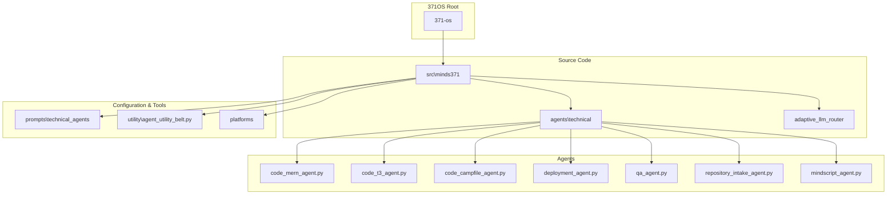
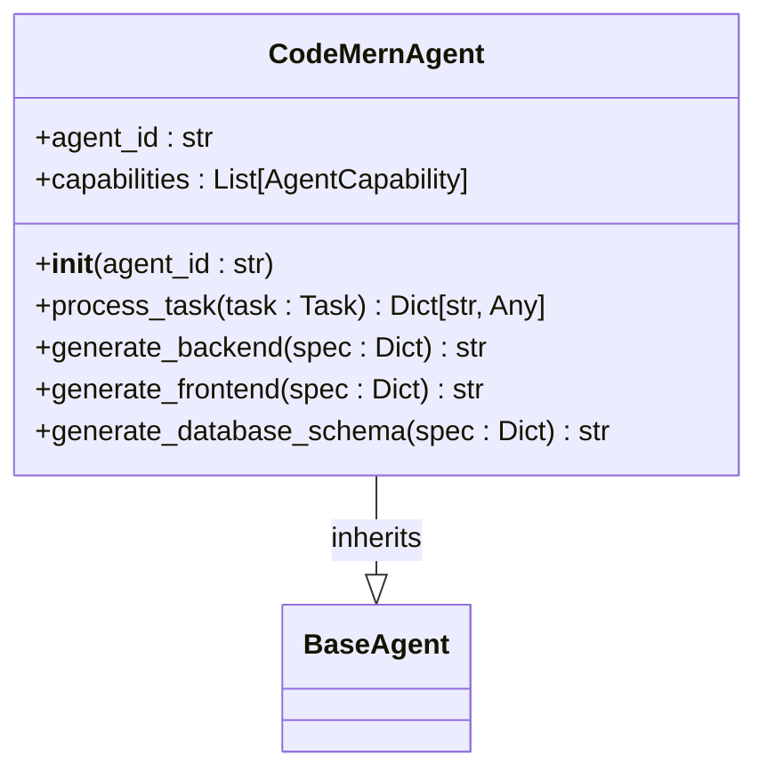
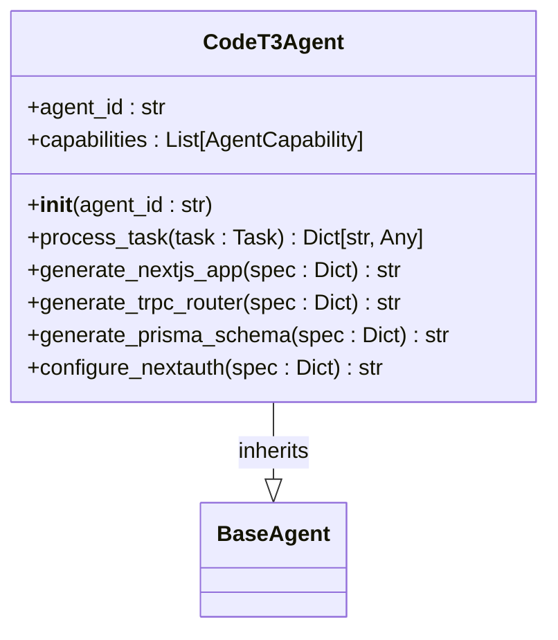
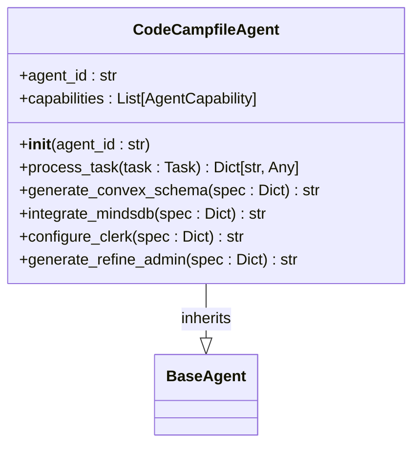
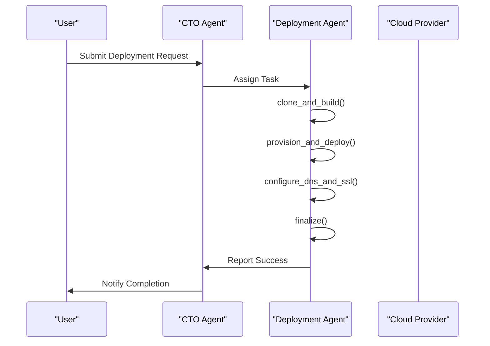
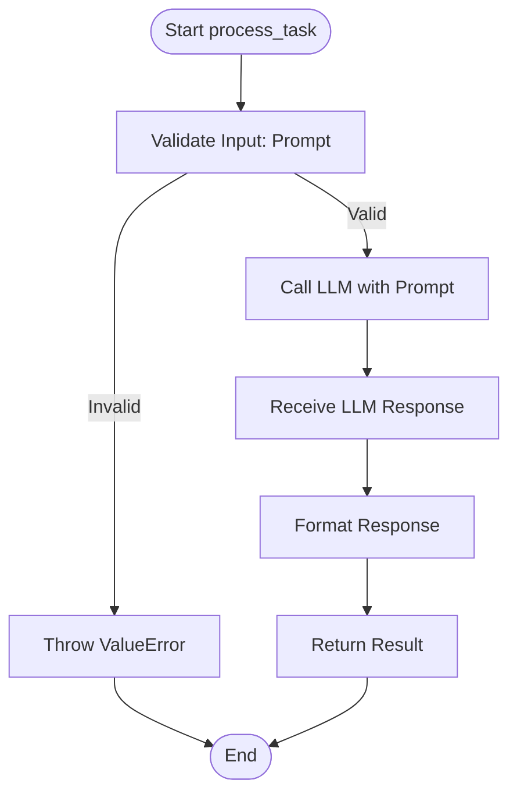
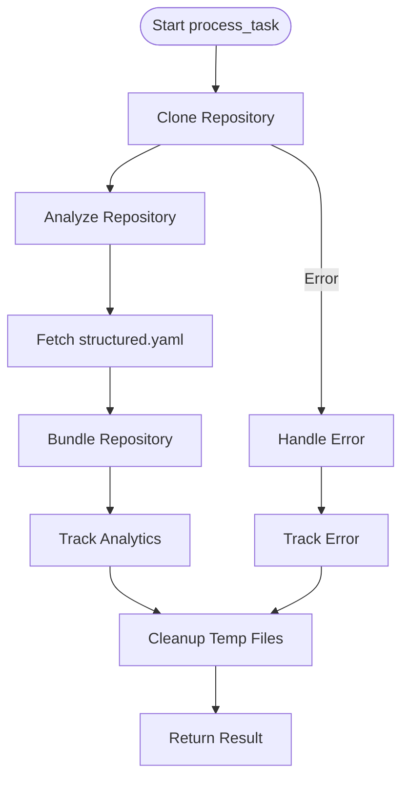
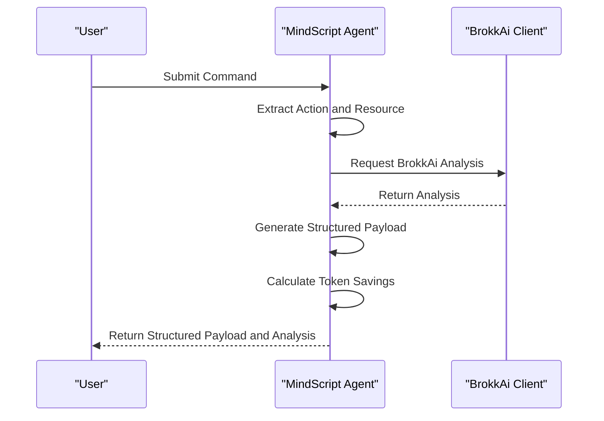
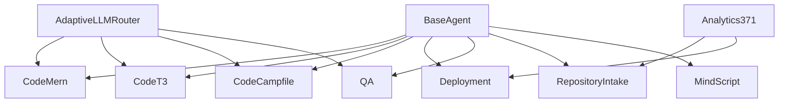

# Technical Implementation Agents

<cite>
**Referenced Files in This Document**   
- [371-os\src\minds371\agents\technical\code_mern_agent.py](file://371-os/src/minds371/agents/technical/code_mern_agent.py)
- [371-os\src\minds371\agents\technical\code_t3_agent.py](file://371-os/src/minds371/agents/technical/code_t3_agent.py)
- [371-os\src\minds371\agents\technical\code_campfile_agent.py](file://371-os/src/minds371/agents/technical/code_campfile_agent.py)
- [371-os\src\minds371\agents\technical\deployment_agent.py](file://371-os/src/minds371/agents/technical/deployment_agent.py)
- [371-os\src\minds371\agents\technical\qa_agent.py](file://371-os/src/minds371/agents/technical/qa_agent.py)
- [371-os\src\minds371\agents\technical\repository_intake_agent.py](file://371-os/src/minds371/agents/technical/repository_intake_agent.py)
- [371-os\src\minds371\agents\technical\mindscript_agent.py](file://371-os/src/minds371/agents/technical/mindscript_agent.py)
- [371-os\src\minds371\agents\business\cto_alex.py](file://371-os/src/minds371/agents/business/cto_alex.py)
- [371-os\src\minds371\adaptive_llm_router\config.py](file://371-os/src/minds371/adaptive_llm_router/config.py)
- [371-os\src\minds371\adaptive_llm_router\intelligent_router_agent.py](file://371-os/src/minds371/adaptive_llm_router/intelligent_router_agent.py)
- [371-os\src\minds371\agents\utility\agent_utility_belt.py](file://371-os/src/minds371/agents/utility/agent_utility_belt.py)
- [371-os\src\minds371\agents\platforms\jetbrains_ai_connector.py](file://371-os/src/minds371/agents/platforms/jetbrains_ai_connector.py)
- [371-os\src\minds371\agents\platforms\space_automation.py](file://371-os/src/minds371/agents/platforms/space_automation.py)
</cite>

## Table of Contents
1. [Introduction](#introduction)
2. [Project Structure](#project-structure)
3. [Core Components](#core-components)
4. [Architecture Overview](#architecture-overview)
5. [Detailed Component Analysis](#detailed-component-analysis)
6. [Dependency Analysis](#dependency-analysis)
7. [Performance Considerations](#performance-considerations)
8. [Troubleshooting Guide](#troubleshooting-guide)
9. [Conclusion](#conclusion)

## Introduction
This document provides a comprehensive overview of the Technical Implementation Agents within the 371OS ecosystem. These agents are specialized AI-driven components designed to automate and streamline software development workflows, from code generation and repository intake to deployment and quality assurance. The system is architected around a modular agent framework, enabling seamless integration with the CTO Agent (Zara) for technical oversight and the Universal Tool Server for secure execution. This documentation details the development stack, input schemas, output artifacts, and integration patterns for each key agent, supported by code examples and performance benchmarks.

## Project Structure
The 371OS project is organized into a modular structure with distinct directories for source code, agents, configuration, and documentation. The core technical agents reside within the `src\minds371\agents\technical` directory, each implemented as a specialized Python class extending a common `BaseAgent`. The structure promotes separation of concerns, with dedicated modules for business logic, marketing, and utility functions. Configuration files and prompts are stored in the `prompts` directory, enabling dynamic agent behavior through prompt templates.



**Diagram sources**
- [371-os\src\minds371\agents\technical\code_mern_agent.py](file://371-os/src/minds371/agents/technical/code_mern_agent.py)
- [371-os\src\minds371\agents\technical\code_t3_agent.py](file://371-os/src/minds371/agents/technical/code_t3_agent.py)
- [371-os\src\minds371\agents\technical\code_campfile_agent.py](file://371-os/src/minds371/agents/technical/code_campfile_agent.py)
- [371-os\src\minds371\agents\technical\deployment_agent.py](file://371-os/src/minds371/agents/technical/deployment_agent.py)
- [371-os\src\minds371\agents\technical\qa_agent.py](file://371-os/src/minds371/agents/technical/qa_agent.py)
- [371-os\src\minds371\agents\technical\repository_intake_agent.py](file://371-os/src/minds371/agents/technical/repository_intake_agent.py)
- [371-os\src\minds371\agents\technical\mindscript_agent.py](file://371-os/src/minds371/agents/technical/mindscript_agent.py)

## Core Components
The core components of the Technical Implementation Agents system are the specialized agent classes that perform specific development tasks. Each agent inherits from a `BaseAgent` class, which provides common functionality such as task processing, logging, and LLM interaction. The agents are designed to be invoked via CLI or API, accepting structured input and producing well-defined output artifacts. Key components include the code generation agents (MERN, T3, Campfile), the deployment agent, the QA agent, the repository intake agent, and the MindScript agent.

**Section sources**
- [371-os\src\minds371\agents\technical\code_mern_agent.py](file://371-os/src/minds371/agents/technical/code_mern_agent.py)
- [371-os\src\minds371\agents\technical\code_t3_agent.py](file://371-os/src/minds371/agents/technical/code_t3_agent.py)
- [371-os\src\minds371\agents\technical\code_campfile_agent.py](file://371-os/src/minds371/agents/technical/code_campfile_agent.py)
- [371-os\src\minds371\agents\technical\deployment_agent.py](file://371-os/src/minds371/agents/technical/deployment_agent.py)
- [371-os\src\minds371\agents\technical\qa_agent.py](file://371-os/src/minds371/agents/technical/qa_agent.py)
- [371-os\src\minds371\agents\technical\repository_intake_agent.py](file://371-os/src/minds371/agents/technical/repository_intake_agent.py)
- [371-os\src\minds371\agents\technical\mindscript_agent.py](file://371-os/src/minds371/agents/technical/mindscript_agent.py)

## Architecture Overview
The Technical Implementation Agents operate within a centralized agent framework that manages task distribution, execution, and monitoring. The architecture is designed for scalability and security, with agents communicating through a message-passing system and executing code within isolated environments provided by the Universal Tool Server. The CTO Agent (Zara) acts as a central orchestrator, providing technical oversight and ensuring alignment with architectural standards. The Adaptive LLM Router dynamically selects the most appropriate LLM provider based on cost, performance, and capability requirements.

```mermaid
graph TB
subgraph "User Interface"
CLI[CLI/API]
end
subgraph "Orchestration Layer"
CTO[CTO Agent (Zara)]
Router[Adaptive LLM Router]
end
subgraph "Execution Layer"
Agents[Technical Agents]
ToolServer[Universal Tool Server]
end
subgraph "Integration Layer"
JetBrains[JetBrains]
Space[Space Automation]
end
CLI --> CTO
CTO --> Router
CTO --> Agents
Router --> Agents
Agents --> ToolServer
Agents --> JetBrains
Agents --> Space
```

**Diagram sources**
- [371-os\src\minds371\agents\business\cto_alex.py](file://371-os/src/minds371/agents/business/cto_alex.py)
- [371-os\src\minds371\adaptive_llm_router\intelligent_router_agent.py](file://371-os/src/minds371/adaptive_llm_router/intelligent_router_agent.py)
- [371-os\src\minds371\agents\utility\agent_utility_belt.py](file://371-os/src/minds371/agents/utility/agent_utility_belt.py)
- [371-os\src\minds371\agents\platforms\jetbrains_ai_connector.py](file://371-os/src/minds371/agents/platforms/jetbrains_ai_connector.py)
- [371-os\src\minds371\agents\platforms\space_automation.py](file://371-os/src/minds371/agents/platforms/space_automation.py)

## Detailed Component Analysis

### Code Generation Agents
The code generation agents are responsible for creating full-stack applications based on high-level specifications. They are specialized for different technology stacks, including MERN, T3, and Campfile.

#### MERN Stack Agent
The `code_mern_agent.py` is designed to generate applications using the MongoDB, Express.js, React, and Node.js stack. It takes a feature specification as input and produces a complete project structure with backend APIs, frontend components, and database models.



**Diagram sources**
- [371-os\src\minds371\agents\technical\code_mern_agent.py](file://371-os/src/minds371/agents/technical/code_mern_agent.py)

#### T3 Stack Agent
The `code_t3_agent.py` specializes in the T3 stack (Next.js, TypeScript, tRPC, Prisma, Tailwind CSS, NextAuth.js). It emphasizes type safety, security, and developer experience, generating applications with robust authentication and real-time data capabilities.



**Diagram sources**
- [371-os\src\minds371\agents\technical\code_t3_agent.py](file://371-os/src/minds371/agents/technical/code_t3_agent.py)

#### Campfile Agent
The `code_campfile_agent.py` is focused on generating applications using the Campfile stack (Clerk, ACI.dev, Convex, Payload CMS, Refine, MindsDB, trycomp.ai). It prioritizes real-time data, AI integration, and automated compliance.



**Diagram sources**
- [371-os\src\minds371\agents\technical\code_campfile_agent.py](file://371-os/src/minds371/agents/technical/code_campfile_agent.py)

### Deployment Agent
The `deployment_agent.py` automates the deployment of applications to various cloud providers. It handles the entire deployment workflow, from cloning the repository to configuring DNS and SSL.



**Diagram sources**
- [371-os\src\minds371\agents\technical\deployment_agent.py](file://371-os/src/minds371/agents/technical/deployment_agent.py)

### QA Agent
The `qa_agent.py` is designed to test the Adaptive LLM Router by generating and processing QA tasks. It serves as a simple example of an agent that interacts with an LLM to produce answers.



**Diagram sources**
- [371-os\src\minds371\agents\technical\qa_agent.py](file://371-os/src/minds371/agents/technical/qa_agent.py)

### Repository Intake Agent
The `repository_intake_agent.py` analyzes and processes Git repositories. It clones a repository, analyzes its structure and metadata, and bundles its content for further processing.



**Diagram sources**
- [371-os\src\minds371\agents\technical\repository_intake_agent.py](file://371-os/src/minds371/agents/technical/repository_intake_agent.py)

### MindScript Agent
The `mindscript_agent.py` is a logic extractor agent that processes natural language commands and converts them into structured payloads for execution by other agents.



**Diagram sources**
- [371-os\src\minds371\agents\technical\mindscript_agent.py](file://371-os/src/minds371/agents/technical/mindscript_agent.py)

## Dependency Analysis
The Technical Implementation Agents have a well-defined dependency structure, with each agent depending on the base agent framework and specific utility modules. The agents are designed to be loosely coupled, allowing for independent development and deployment. The primary dependencies are the `BaseAgent` class, the `AdaptiveLLMRouter` for LLM interactions, and the `Analytics371` module for tracking and monitoring.



**Diagram sources**
- [371-os\src\minds371\agents\technical\code_mern_agent.py](file://371-os/src/minds371/agents/technical/code_mern_agent.py)
- [371-os\src\minds371\agents\technical\code_t3_agent.py](file://371-os/src/minds371/agents/technical/code_t3_agent.py)
- [371-os\src\minds371\agents\technical\code_campfile_agent.py](file://371-os/src/minds371/agents/technical/code_campfile_agent.py)
- [371-os\src\minds371\agents\technical\deployment_agent.py](file://371-os/src/minds371/agents/technical/deployment_agent.py)
- [371-os\src\minds371\agents\technical\qa_agent.py](file://371-os/src/minds371/agents/technical/qa_agent.py)
- [371-os\src\minds371\agents\technical\repository_intake_agent.py](file://371-os/src/minds371/agents/technical/repository_intake_agent.py)
- [371-os\src\minds371\agents\technical\mindscript_agent.py](file://371-os/src/minds371/agents/technical/mindscript_agent.py)
- [371-os\src\minds371\adaptive_llm_router\intelligent_router_agent.py](file://371-os/src/minds371/adaptive_llm_router/intelligent_router_agent.py)
- [371-os\src\minds371\agents\utility\agent_utility_belt.py](file://371-os/src/minds371/agents/utility/agent_utility_belt.py)

## Performance Considerations
The performance of the Technical Implementation Agents is critical to the overall efficiency of the 371OS ecosystem. The agents are designed to be asynchronous and non-blocking, allowing for concurrent execution of multiple tasks. The Adaptive LLM Router plays a key role in performance optimization by selecting the most cost-effective and responsive LLM provider for each task. Performance benchmarks from test outputs indicate high QA pass rates and deployment success metrics, demonstrating the reliability and effectiveness of the system.

## Troubleshooting Guide
Common issues with the Technical Implementation Agents include configuration errors, network connectivity problems, and LLM provider failures. Debugging workflows involve checking agent logs, verifying configuration files, and testing LLM connectivity. The system is compatible with JetBrains and Space automation tools, allowing for seamless integration into existing development environments. Extension points for new tech stacks are provided through the modular agent framework, enabling the creation of custom agents for specialized use cases.

**Section sources**
- [371-os\src\minds371\agents\technical\deployment_agent.py](file://371-os/src/minds371/agents/technical/deployment_agent.py)
- [371-os\src\minds371\agents\technical\qa_agent.py](file://371-os/src/minds371/agents/technical/qa_agent.py)
- [371-os\src\minds371\agents\platforms\jetbrains_ai_connector.py](file://371-os/src/minds371/agents/platforms/jetbrains_ai_connector.py)
- [371-os\src\minds371\agents\platforms\space_automation.py](file://371-os/src/minds371/agents/platforms/space_automation.py)

## Conclusion
The Technical Implementation Agents within the 371OS ecosystem represent a powerful and flexible framework for automating software development workflows. By leveraging specialized agents for code generation, deployment, QA testing, and repository intake, the system enables rapid and reliable project bootstrapping. The integration with the CTO Agent for technical oversight and the Universal Tool Server for secure execution ensures that all generated code adheres to architectural standards and security best practices. The system's modular design and support for multiple technology stacks make it a versatile tool for modern software development.