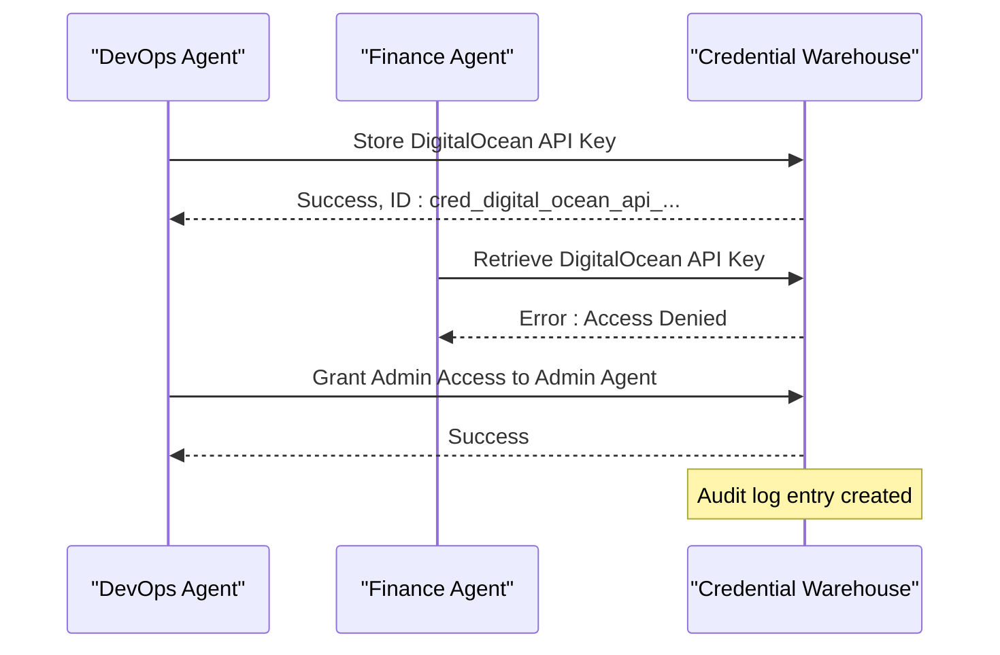
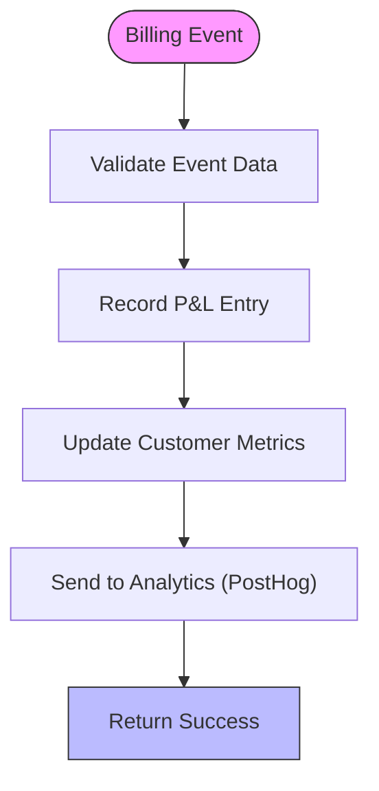
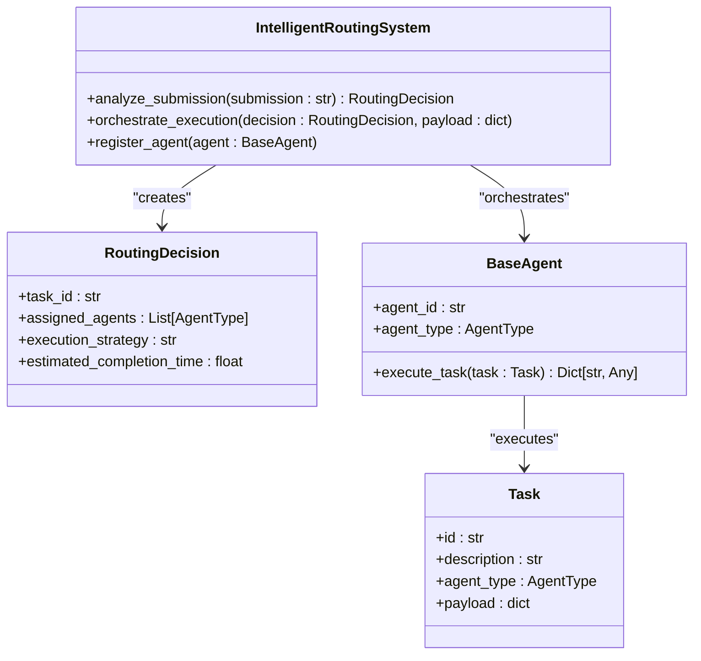
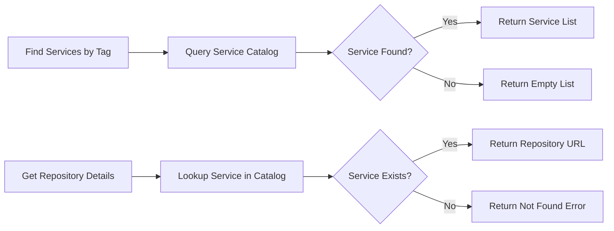

# Utility and Coordination Agents

<cite>
**Referenced Files in This Document**   
- [credential_warehouse_agent.md](file://371-os/src/minds371/agents/utility/credential_warehouse_agent.md)
- [financial_agent.md](file://371-os/src/minds371/agents/utility/financial_agent.md)
- [router_agent.py](file://371-os/src/minds371/agents/utility/router_agent.py)
- [agent_utility_belt.py](file://371-os/src/minds371/agents/utility/agent_utility_belt.py)
</cite>

## Table of Contents
1. [Introduction](#introduction)
2. [Core Utility Agents Overview](#core-utility-agents-overview)
3. [Credential Warehouse Agent](#credential-warehouse-agent)
4. [Financial Agent](#financial-agent)
5. [Router Agent](#router-agent)
6. [Agent Utility Belt](#agent-utility-belt)
7. [Integration with Executive Agents](#integration-with-executive-agents)
8. [Security and Compliance Measures](#security-and-compliance-measures)
9. [Configuration and Extensibility](#configuration-and-extensibility)
10. [Error Handling and Resilience](#error-handling-and-resilience)

## Introduction
The 371OS ecosystem relies on a suite of utility and coordination agents to manage critical cross-cutting concerns such as credential management, financial operations, task routing, and shared tool access. These agents form the backbone of secure, efficient, and scalable operations across the autonomous agent network. This document provides a comprehensive analysis of four key utility agents: credential_warehouse_agent, financial_agent, router_agent, and agent_utility_belt, detailing their roles, interactions, and implementation patterns.

## Core Utility Agents Overview
The utility agents in 371OS serve as foundational services that support higher-level business and technical agents. They operate under a zero-trust security model and are designed for high reliability, auditability, and integration with executive oversight agents such as the CFO (Maya) and CLO (Alex). Each agent specializes in a specific domain while maintaining loose coupling through standardized task and payload interfaces.

**Section sources**
- [credential_warehouse_agent.md](file://371-os/src/minds371/agents/utility/credential_warehouse_agent.md)
- [financial_agent.md](file://371-os/src/minds371/agents/utility/financial_agent.md)
- [router_agent.py](file://371-os/src/minds371/agents/utility/router_agent.py)
- [agent_utility_belt.py](file://371-os/src/minds371/agents/utility/agent_utility_belt.py)

## Credential Warehouse Agent

### Role and Functionality
The credential_warehouse_agent serves as a secure vault for storing, managing, and distributing sensitive credentials across the agent ecosystem. It enforces strict access controls, supports credential rotation, and maintains comprehensive audit logs for compliance purposes.

### Security and Access Control
The agent implements a creator-owns model where only the agent that created a credential can grant access to others. This prevents privilege escalation and ensures accountability. Access attempts by unauthorized agents are explicitly logged and rejected.

**Diagram sources**
- [credential_warehouse_agent.md](file://371-os/src/minds371/agents/utility/credential_warehouse_agent.md#L1-L56)

### Key Operations
- **Storing Credentials**: Validates required fields before storage
- **Access Control**: Enforces creator-based access delegation
- **Retrieval**: Provides decrypted secrets only to authorized agents
- **Rotation**: Supports secure credential rotation
- **Auditing**: Maintains logs of all access and modification events
- **Expiration Management**: Tracks and alerts on expiring credentials

**Section sources**
- [credential_warehouse_agent.md](file://371-os/src/minds371/agents/utility/credential_warehouse_agent.md#L1-L56)

## Financial Agent

### Role and Functionality
The financial_agent handles all financial operations within the 371OS ecosystem, including P&L analysis, tax optimization, billing orchestration, and banking synchronization. It integrates with external financial platforms like Stripe and Creem.io to ensure accurate revenue recognition and compliance.

### Financial Operations Workflow
The agent processes financial events through a standardized pipeline that includes transaction recording, customer metrics updates, and analytics reporting. It supports both immediate deductions and retroactive tax claims.

**Diagram sources**
- [financial_agent.md](file://371-os/src/minds371/agents/utility/financial_agent.md#L1-L28)

### Key Operations
- **P&L Analysis**: Generates profit and loss reports
- **R&D Tax Optimization**: Identifies eligible expenses and projects tax savings
- **Billing Orchestration**: Processes subscription events from multiple platforms
- **Banking Synchronization**: Syncs transactions with financial institutions
- **Compliance Documentation**: Generates required tax and financial records

**Section sources**
- [financial_agent.md](file://371-os/src/minds371/agents/utility/financial_agent.md#L1-L28)

## Router Agent

### Role and Functionality
The router_agent is responsible for intelligent task routing and orchestration across the agent ecosystem. It analyzes incoming requests and determines the optimal agent or agent team to handle each task based on type, complexity, and required capabilities.

### Routing Decision Process
The agent uses an IntelligentRoutingSystem to evaluate submissions and generate routing decisions that include assigned agents, execution strategy, and estimated completion time.

**Diagram sources**
- [router_agent.py](file://371-os/src/minds371/agents/utility/router_agent.py#L1-L105)

### Key Operations
- **Submission Analysis**: Parses natural language requests to determine intent
- **Agent Assignment**: Maps tasks to appropriate agent types (Business, Technical, Marketing, etc.)
- **Orchestration**: Coordinates execution across multiple agents when needed
- **Execution Strategy**: Determines sequential, parallel, or hybrid execution approaches
- **Health Monitoring**: Checks agent availability before task assignment

**Section sources**
- [router_agent.py](file://371-os/src/minds371/agents/utility/router_agent.py#L1-L105)

## Agent Utility Belt

### Role and Functionality
The agent_utility_belt provides a centralized repository of common tools and services that can be accessed by any agent in the system. It functions as a service catalog that enables discovery and utilization of shared resources.

### Service Catalog Operations
The utility belt maintains a categorized service catalog that agents can query to find tools by tags or specific service names. It supports dynamic catalog updates and graceful handling of non-existent services.

**Diagram sources**
- [agent_utility_belt.py](file://371-os/src/minds371/agents/utility/agent_utility_belt.py#L1-L82)

### Key Operations
- **Service Discovery**: Find services by tags (e.g., "curl", "json")
- **Repository Details**: Retrieve GitHub repository URLs for services
- **Catalog Management**: Update the service catalog dynamically
- **Error Handling**: Gracefully handle requests for non-existent services
- **Payload Processing**: Standardized task processing interface

**Section sources**
- [agent_utility_belt.py](file://371-os/src/minds371/agents/utility/agent_utility_belt.py#L1-L82)

## Integration with Executive Agents
The utility agents integrate closely with executive oversight agents to ensure proper governance:

- **CFO Agent (Maya)**: Receives financial data from the financial_agent for budget tracking and forecasting. The financial_agent reports all revenue impacts and tax implications to Maya for consolidated financial reporting.

- **CLO Agent (Alex)**: Receives audit logs from the credential_warehouse_agent and compliance documentation from the financial_agent. Alex enforces zero-trust access policies and validates that all credential access follows the principle of least privilege.

These integrations ensure that all utility operations are transparent, accountable, and aligned with organizational policies.

## Security and Compliance Measures
The utility agents implement multiple layers of security and compliance controls:

- **Encryption-at-Rest**: All sensitive data, especially credentials, are encrypted when stored
- **Audit Logging**: Comprehensive logs are maintained for all access and modification events
- **Zero-Trust Access**: Strict access controls based on agent identity and creator ownership
- **Regular Rotation**: Automated credential rotation to minimize exposure windows
- **Compliance Documentation**: Automatic generation of required financial and security records
- **Permission Validation**: Runtime checks for agent authorization before sensitive operations

## Configuration and Extensibility
The utility agents are designed for flexibility and extensibility:

- **JSON/YAML Configuration**: Service catalogs and routing rules can be defined in configuration files
- **Plugin Architecture**: New utility functions can be added through a plugin system
- **Dynamic Updates**: Service catalogs and access policies can be updated at runtime
- **Standardized Interfaces**: Consistent task and payload structures enable easy integration

This design allows the system to adapt to new requirements without modifying core agent implementations.

## Error Handling and Resilience
The utility agents implement robust error handling for common failure scenarios:

- **Credential Expiration**: Detects and alerts on credentials nearing expiration, with automated rotation capabilities
- **Balance Overruns**: Financial_agent monitors transaction volumes and can trigger alerts when thresholds are exceeded
- **Invalid Requests**: Rejects credential storage requests with missing fields and provides clear error messages
- **Access Violations**: Properly handles unauthorized access attempts without exposing sensitive information
- **Service Unavailability**: Gracefully handles requests for non-existent services or unavailable external systems

These mechanisms ensure system stability and provide clear feedback for troubleshooting.