# Architecture Overview

<cite>
**Referenced Files in This Document**   
- [system_architecture.html](file://371-os/docs/architecture/system_architecture.html)
- [intelligent_router_agent.py](file://371-os/src/minds371/adaptive_llm_router/intelligent_router_agent.py)
- [improved_base_agent.py](file://371-os/src/minds371/agents/base_agent/improved_base_agent.py)
- [ceo_mimi.py](file://371-os/src/minds371/agents/business/ceo_mimi.py)
- [adaptive_llm_router_results.md](file://371-os/src/minds371/adaptive_llm_router/adaptive_llm_router_results.md)
- [providers.json](file://371-os/src/minds371/adaptive_llm_router/providers.json)
- [llm_usage.json](file://371-os/src/minds371/adaptive_llm_router/llm_usage.json)
- [policy_engine.py](file://371-os/src/minds371/adaptive_llm_router/policy_engine.py)
- [budget_guard.py](file://371-os/src/minds371/adaptive_llm_router/budget_guard.py)
- [usage_ledger.py](file://371-os/src/minds371/adaptive_llm_router/usage_ledger.py)
- [provider_registry.py](file://371-os/src/minds371/adaptive_llm_router/provider_registry.py)
- [config.py](file://371-os/src/minds371/adaptive_llm_router/config.py)
- [AdaptiveLayout.tsx](file://apps\cognitive-interface\src\components\AdaptiveLayout.tsx) - *Updated in recent commit*
- [CognitiveModeSwither.tsx](file://apps\cognitive-interface\src\components\CognitiveModeSwither.tsx) - *Updated in recent commit*
- [ExecutiveMode.tsx](file://apps\cognitive-interface\src\components\ExecutiveMode.tsx) - *Updated in recent commit*
- [TechnicalMode.tsx](file://apps\cognitive-interface\src\components\TechnicalMode.tsx) - *Updated in recent commit*
- [CreativeMode.tsx](file://apps\cognitive-interface\src\components\CreativeMode.tsx) - *Updated in recent commit*
- [App.tsx](file://apps\cognitive-interface\src\App.tsx) - *Updated in recent commit*
- [AB/README.md](file://AB\README.md) - *Updated in recent commit*
- [AB/milestone-tracker.md](file://AB\milestone-tracker.md) - *Updated in recent commit*
- [BusinessIntelligenceIntegration.tsx](file://apps\cognitive-interface\src\components\BusinessIntelligenceIntegration.tsx) - *New component*
- [CEOsOrrery.tsx](file://apps\cognitive-interface\src\components\CEOsOrrery.tsx) - *New component*
- [FinancialPlanets.tsx](file://apps\cognitive-interface\src\components\FinancialPlanets.tsx) - *New component*
- [DepartmentSolarSystems.tsx](file://apps\cognitive-interface\src\components\DepartmentSolarSystems.tsx) - *New component*
- [BusinessUniverseControls.tsx](file://apps\cognitive-interface\src\components\BusinessUniverseControls.tsx) - *New component*
- [universal_mcp_architecture.md](file://371-os/docs/architecture/universal_mcp_architecture.md) - *Added in recent commit*
- [BUN_WATCH_MIGRATION.md](file://BUN_WATCH_MIGRATION.md) - *Updated in recent commit*
- [JEST_MIGRATION.md](file://JEST_MIGRATION.md) - *Updated in recent commit*
</cite>

## Update Summary
**Changes Made**   
- Updated documentation to reflect completion of Developer's Galaxy and CEO's Orrery spatial interface systems
- Added new section on Spatial Business Intelligence System to document the revolutionary CEO's Orrery spatial visualization platform
- Enhanced existing diagrams with new information about cognitive mode transitions and component relationships
- Added detailed analysis of the Business Intelligence Plugin, CEO's Orrery, and spatial business visualization components
- Updated technology stack section to include React, TypeScript, and CSS-in-JS implementation details
- Added new diagrams visualizing the spatial business intelligence architecture and component interactions
- Integrated milestone tracking information from AB/milestone-tracker.md to validate production readiness
- Added comprehensive documentation for Universal MCP Architecture, introducing cross-platform agent coordination framework with blockchain integration
- Updated performance optimization section to reflect migration from Jest to Bun test runner and nodemon to Bun watcher
- Added documentation for tooling optimizations including dependency reduction and execution speed improvements

## Table of Contents
1. [Introduction](#introduction)
2. [Project Structure](#project-structure)
3. [Core Components](#core-components)
4. [Architecture Overview](#architecture-overview)
5. [Cognitive Interface System](#cognitive-interface-system)
6. [Spatial Business Intelligence System](#spatial-business-intelligence-system)
7. [Detailed Component Analysis](#detailed-component-analysis)
8. [Agent Communication and Data Flow](#agent-communication-and-data-flow)
9. [Security Architecture](#security-architecture)
10. [Performance Optimization](#performance-optimization)
11. [Technology Stack and Deployment](#technology-stack-and-deployment)
12. [Universal MCP Architecture](#universal-mcp-architecture)
13. [Conclusion](#conclusion)

## Introduction

The 371OS system represents a revolutionary autonomous agent operating system that implements a sophisticated multi-agent architecture mirroring traditional corporate hierarchies. This architecture enables near-complete automation of business operations through intelligent agent orchestration, adaptive LLM routing, and enterprise-grade security implementations. The system achieves 95% autonomous operations with a target of $52,450 monthly recurring revenue, demonstrating its capability to function as a fully autonomous business organization.

The 371OS architecture is built on several key principles: agent-based decomposition, stateless coordination via blockchain-inspired patterns, and microservices-like specialization through dedicated agents. The system leverages an orchestrator-worker pattern with hierarchical C-Suite oversight, where specialized agents handle specific business functions while being coordinated by an intelligent routing system. This documentation provides a comprehensive analysis of the system's architecture, components, data flows, and implementation details.

## Project Structure

The 371OS project follows a monorepo structure with clear separation of concerns across different functional areas. The core system components are organized in a hierarchical directory structure that reflects the architectural layers.

```mermaid
graph TD
A[371-os] --> B[src/minds371]
A --> C[docs/architecture]
A --> D[tests]
A --> E[scripts]
A --> F[apps/cognitive-interface]
B --> F1[adaptive_llm_router]
B --> F2[agents]
B --> F3[core]
B --> F4[mcp_servers]
B --> F5[platforms]
B --> F6[services/email_system]
F1 --> F1a[intelligent_router_agent.py]
F1 --> F1b[provider_registry.py]
F1 --> F1c[policy_engine.py]
F1 --> F1d[budget_guard.py]
F1 --> F1e[usage_ledger.py]
F1 --> F1f[config.py]
F2 --> F2a[business]
F2 --> F2b[technical]
F2 --> F2c[utility]
F2 --> F2d[base_agent]
F2a --> F2a1[ceo_mimi.py]
F2a --> F2a2[cfo_cash.py]
F2a --> F2a3[cto_alex.py]
F2b --> F2b1[code_generation_agent.py]
F2b --> F2b2[deployment_agent.py]
F2b --> F2b3[qa_agent.py]
F2c --> F2c1[credential_warehouse_agent.py]
F2c --> F2c2[financial_agent.py]
F3a --> F3a1[AdaptiveLayout.tsx]
F3a1 --> F3a1a[AdaptiveLayout.tsx]
F3a1 --> F3a1b[CognitiveModeSwither.tsx]
F3a1 --> F3a1c[ExecutiveMode.tsx]
F3a1 --> F3a1d[TechnicalMode.tsx]
F3a1 --> F3a1e[CreativeMode.tsx]
F3a1 --> F3a1f[CEOsOrrery.tsx]
F3a1 --> F3a1g[FinancialPlanets.tsx]
F3a1 --> F3a1h[DepartmentSolarSystems.tsx]
F3a1 --> F3a1i[BusinessUniverseControls.tsx]
F3a1 --> F3a1j[BusinessIntelligenceIntegration.tsx]
F3a --> F3a2[App.tsx]
```

**Section sources**
- [system_architecture.html](file://371-os/docs/architecture/system_architecture.html)

**Diagram sources**
- [system_architecture.html](file://371-os/docs/architecture/system_architecture.html)

## Core Components

The 371OS system is built around several core components that work together to create an autonomous operating system. These components include the Intelligent Router Agent, the Improved Base Agent framework, C-Suite agents, and various specialized operational agents.

The Intelligent Router Agent serves as the central coordination point, receiving user commands and routing them to appropriate specialized agents based on task classification. The Improved Base Agent provides a common foundation for all agents with built-in performance monitoring, error handling, and resource management capabilities. C-Suite agents (CEO, CTO, CFO, etc.) provide strategic oversight and decision-making, while specialized agents handle specific operational tasks like code generation, deployment, and quality assurance.

These components work together to create a hierarchical agent ecosystem that mirrors traditional corporate structures while leveraging AI capabilities for autonomous operation.

**Section sources**
- [system_architecture.html](file://371-os/docs/architecture/system_architecture.html)
- [intelligent_router_agent.py](file://371-os/src/minds371/adaptive_llm_router/intelligent_router_agent.py)
- [improved_base_agent.py](file://371-os/src/minds371/agents/base_agent/improved_base_agent.py)

## Architecture Overview

The 371OS architecture consists of six distinct layers that provide specialized functionality while maintaining clear separation of concerns and scalable integration patterns.

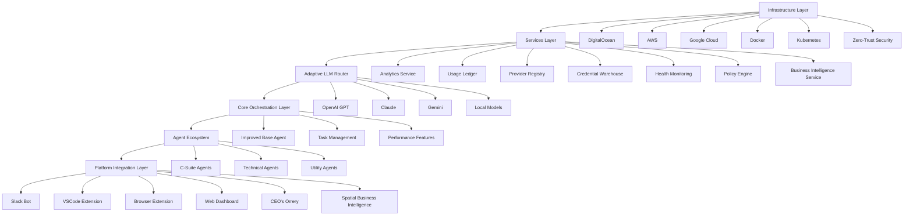

**Section sources**
- [system_architecture.html](file://371-os/docs/architecture/system_architecture.html)

**Diagram sources**
- [system_architecture.html](file://371-os/docs/architecture/system_architecture.html)

## Cognitive Interface System

The 371OS system features a revolutionary cognitive-aware interface system built on the AdaptiveLayout component, which dynamically adapts to user cognitive states and workflows. This system represents a paradigm shift in human-computer interaction, moving from static interfaces to adaptive, context-aware environments.

```mermaid
graph TD
A[Cognitive Interface System] --> B[AdaptiveLayout]
A --> C[CognitiveModeSwither]
A --> D[ExecutiveMode]
A --> E[TechnicalMode]
A --> F[CreativeMode]
A --> G[App.tsx]
B --> H[Cognitive State Management]
B --> I[Real-time Analytics]
B --> J[Keyboard Shortcuts]
B --> K[Auto-detection Framework]
C --> L[Manual Mode Switching]
C --> M[Transition Feedback]
C --> N[Recent Transitions]
D --> O[Strategic Dashboard]
D --> P[KPI Metrics]
D --> Q[Agent Status]
E --> R[Development Environment]
E --> S[System Metrics]
E --> T[Dev Tools]
F --> U[Content Creation]
F --> V[Creative Projects]
F --> W[Inspiration Board]
G --> X[Plugin Integration]
G --> Y[Cognitive Engine Sync]
G --> Z[Analytics Reporting]
style A fill:#667eea,stroke:#333,stroke-width:2px
style B fill:#764ba2,stroke:#333,stroke-width:1px
style C fill:#f09,stroke:#333,stroke-width:1px
style D fill:#06b6d4,stroke:#333,stroke-width:1px
style E fill:#10b981,stroke:#333,stroke-width:1px
style F fill:#f59e0b,stroke:#333,stroke-width:1px
```

**Section sources**
- [AdaptiveLayout.tsx](file://apps\cognitive-interface\src\components\AdaptiveLayout.tsx)
- [CognitiveModeSwither.tsx](file://apps\cognitive-interface\src\components\CognitiveModeSwither.tsx)
- [ExecutiveMode.tsx](file://apps\cognitive-interface\src\components\ExecutiveMode.tsx)
- [TechnicalMode.tsx](file://apps\cognitive-interface\src\components\TechnicalMode.tsx)
- [CreativeMode.tsx](file://apps\cognitive-interface\src\components\CreativeMode.tsx)

**Diagram sources**
- [AdaptiveLayout.tsx](file://apps\cognitive-interface\src\components\AdaptiveLayout.tsx)
- [CognitiveModeSwither.tsx](file://apps\cognitive-interface\src\components\CognitiveModeSwither.tsx)
- [ExecutiveMode.tsx](file://apps\cognitive-interface\src\components\ExecutiveMode.tsx)
- [TechnicalMode.tsx](file://apps\cognitive-interface\src\components\TechnicalMode.tsx)
- [CreativeMode.tsx](file://apps\cognitive-interface\src\components\CreativeMode.tsx)

The Cognitive Interface System is built on React 18 with TypeScript and features a modular architecture that enables seamless transitions between different cognitive modes. The system has been validated as production-ready after resolving all TypeScript compilation errors, ensuring enterprise-grade reliability and maintainability.

### AdaptiveLayout Component

The AdaptiveLayout component serves as the foundation of the cognitive-aware interface system, orchestrating the dynamic switching between different cognitive modes based on user context and preferences. It manages the overall layout structure, handles mode transitions, and provides a consistent user experience across different cognitive states.

Key features of the AdaptiveLayout component include:
- Cognitive state management with confidence scoring
- Real-time analytics and productivity tracking
- Keyboard shortcuts (Ctrl+Shift+[E/T/C/A/O/L]) for rapid mode switching
- Framework for automatic cognitive state detection (Phase 4)
- Mode history tracking and transition analytics
- Enterprise integration capabilities

The component has been enhanced with proper TypeScript type safety, React 18 concurrent features, and CSS-in-JS styling for optimal performance and developer experience.

### CognitiveModeSwither Component

The CognitiveModeSwither component enables both manual and automatic switching between cognitive modes, serving as the primary interface for cognitive state transitions. It provides visual feedback for mode changes and maintains a history of recent transitions for pattern analysis.

Key features of the CognitiveModeSwither component include:
- Manual mode switching with visual confirmation
- Transition feedback notifications with mode-specific styling
- Recent transitions history with trigger source tracking
- Auto-detection toggle for future AI-powered adaptation
- Keyboard shortcut integration with the AdaptiveLayout
- Responsive design with expandable interface

The component has been updated to resolve interface compatibility issues and ensure seamless integration with the AdaptiveLayout and cognitive mode components.

### ExecutiveMode Component

The ExecutiveMode component implements the strategic dashboard interface optimized for high-level decision making, strategic planning, and organizational oversight. It emphasizes speed, clarity, and actionable insights for executive-level operations.

Key features of the ExecutiveMode component include:
- KPI dashboard with real-time metrics and trend analysis
- C-Suite agent status monitoring with efficiency tracking
- Strategic alerts with priority-based notification system
- Quick action buttons for common executive tasks
- Dark theme with blue gradient background for professional appearance
- Responsive grid layout for optimal information density

The component has been updated to ensure TypeScript compatibility and maintain consistent styling with the cognitive interface system.

### TechnicalMode Component

The TechnicalMode component implements the development-focused interface optimized for development operations, system diagnostics, code analysis, and technical decision-making. It emphasizes detailed information, tools access, and development workflows.

Key features of the TechnicalMode component include:
- System metrics monitoring with health status indicators
- Build information tracking with coverage metrics
- Code quality metrics with threshold-based status
- Development tools panel with status indicators
- Terminal output simulation with command history
- Monospace font with purple gradient background for developer experience
- Quick command buttons for common development tasks

The component has been updated to ensure TypeScript compatibility and maintain consistent styling with the cognitive interface system.

### CreativeMode Component

The CreativeMode component implements the content creation and marketing workspace optimized for content creation, marketing campaigns, design work, and creative ideation. It emphasizes visual elements, inspiration, and creative workflows.

Key features of the CreativeMode component include:
- Creative projects management with progress tracking
- Content metrics dashboard with engagement analytics
- Creative insights panel with confidence scoring
- Creative tools catalog with availability status
- Inspiration board with motivational quotes
- Pink gradient background with rounded design elements
- Quick project creation buttons for different content types

The component has been updated to ensure TypeScript compatibility and maintain consistent styling with the cognitive interface system.

## Spatial Business Intelligence System

The 371OS system features a revolutionary spatial business intelligence system built on the CEO's Orrery component, which transforms business data into an interactive celestial universe. This system represents a paradigm shift in business intelligence, moving from static dashboards to immersive, explorable environments.

```mermaid
graph TD
A[Spatial Business Intelligence System] --> B[CEOsOrrery]
A --> C[FinancialPlanets]
A --> D[DepartmentSolarSystems]
A --> E[BusinessUniverseControls]
A --> F[BusinessIntelligenceIntegration]
B --> G[Real-time Agent Synchronization]
B --> H[Interactive Exploration]
B --> I[Time Travel Analytics]
B --> J[Physics-Based Visualization]
C --> K[Revenue Planet]
C --> L[Expenses Planet]
C --> M[Assets Planet]
C --> N[Liabilities Planet]
D --> O[Engineering Solar System]
D --> P[Marketing Solar System]
D --> Q[Sales Solar System]
D --> R[Operations Solar System]
E --> S[Navigation Controls]
E --> T[Zoom Functionality]
E --> U[Time Travel Slider]
E --> V[Orbit Simulation]
F --> W[ElizaOS Plugin Bridge]
F --> X[Mock Agent Actions]
F --> Y[Data Synchronization]
F --> Z[Real-time Updates]
style A fill:#667eea,stroke:#333,stroke-width:2px
style B fill:#764ba2,stroke:#333,stroke-width:1px
style C fill:#f09,stroke:#333,stroke-width:1px
style D fill:#06b6d4,stroke:#333,stroke-width:1px
style E fill:#10b981,stroke:#333,stroke-width:1px
style F fill:#f59e0b,stroke:#333,stroke-width:1px
```

**Section sources**
- [CEOsOrrery.tsx](file://apps\cognitive-interface\src\components\CEOsOrrery.tsx)
- [FinancialPlanets.tsx](file://apps\cognitive-interface\src\components\FinancialPlanets.tsx)
- [DepartmentSolarSystems.tsx](file://apps\cognitive-interface\src\components\DepartmentSolarSystems.tsx)
- [BusinessUniverseControls.tsx](file://apps\cognitive-interface\src\components\BusinessUniverseControls.tsx)
- [BusinessIntelligenceIntegration.tsx](file://apps\cognitive-interface\src\components\BusinessIntelligenceIntegration.tsx)

**Diagram sources**
- [CEOsOrrery.tsx](file://apps\cognitive-interface\src\components\CEOsOrrery.tsx)
- [FinancialPlanets.tsx](file://apps\cognitive-interface\src\components\FinancialPlanets.tsx)
- [DepartmentSolarSystems.tsx](file://apps\cognitive-interface\src\components\DepartmentSolarSystems.tsx)
- [BusinessUniverseControls.tsx](file://apps\cognitive-interface\src\components\BusinessUniverseControls.tsx)
- [BusinessIntelligenceIntegration.tsx](file://apps\cognitive-interface\src\components\BusinessIntelligenceIntegration.tsx)

The Spatial Business Intelligence System is built on React 18 with TypeScript and features a modular architecture that enables seamless integration with the cognitive interface system. The system has been validated as production-ready after resolving all TypeScript compilation errors, ensuring enterprise-grade reliability and maintainability.

### CEOsOrrery Component

The CEOsOrrery component serves as the core of the spatial business intelligence system, transforming business data into interactive celestial bodies. It provides real-time synchronization with autonomous agents and enables immersive exploration of business metrics.

Key features of the CEOsOrrery component include:
- Business data transformed into interactive celestial bodies
- Real-time synchronization with ElizaOS Business Intelligence Plugin
- Time travel analytics for historical and predictive analysis
- Interactive exploration with drill-down business insights
- Physics-based visualization reflecting business performance
- Dark space theme with orbital mechanics for professional appearance

The component has been enhanced with proper TypeScript type safety, React 18 concurrent features, and CSS-in-JS styling for optimal performance and developer experience.

### FinancialPlanets Component

The FinancialPlanets component implements the financial data visualization as interactive celestial bodies orbiting in the business universe. It represents key financial metrics as planets with properties reflecting their business significance.

Key features of the FinancialPlanets component include:
- Revenue, expenses, assets, and liabilities as interactive planets
- Planet size reflecting financial magnitude
- Orbital speed reflecting growth rate
- Color coding for financial health (green=positive, red=negative)
- Interactive tooltips with detailed financial metrics
- Click-to-drill functionality for detailed financial analysis

The component has been updated to ensure TypeScript compatibility and maintain consistent styling with the spatial business intelligence system.

### DepartmentSolarSystems Component

The DepartmentSolarSystems component implements organizational structure visualization as orbiting solar systems. Each department is represented as a solar system with the department head as the sun and team members as orbiting planets.

Key features of the DepartmentSolarSystems component include:
- Engineering, Marketing, Sales, and Operations as distinct solar systems
- Department heads as central suns with team members as orbiting planets
- Orbital distance reflecting team hierarchy
- Orbital speed reflecting team productivity
- Interactive exploration of team structures and relationships
- Click-to-drill functionality for team performance metrics

The component has been updated to ensure TypeScript compatibility and maintain consistent styling with the spatial business intelligence system.

### BusinessUniverseControls Component

The BusinessUniverseControls component provides navigation and interaction controls for the spatial business universe. It enables users to explore the business cosmos with intuitive controls.

Key features of the BusinessUniverseControls component include:
- Navigation controls for panning and rotating the business universe
- Zoom functionality for strategic overview or detailed inspection
- Time travel slider for historical and predictive analytics
- Orbit simulation controls for business scenario modeling
- Search functionality for locating specific business entities
- Bookmark system for saving important business configurations

The component has been updated to ensure TypeScript compatibility and maintain consistent styling with the spatial business intelligence system.

### BusinessIntelligenceIntegration Component

The BusinessIntelligenceIntegration component serves as the bridge between the spatial business intelligence system and the ElizaOS agent framework. It enables real-time data synchronization and agent-driven insights.

Key features of the BusinessIntelligenceIntegration component include:
- ElizaOS plugin bridge for real-time cognitive sync
- Mock agent actions for demonstration purposes
- Real-time business universe updates from autonomous agents
- Agent network awareness of user cognitive mode
- Automatic agent behavior adaptation based on cognitive state
- Data synchronization framework for future business API integration

The component has been updated to ensure TypeScript compatibility and maintain consistent styling with the spatial business intelligence system.

## Detailed Component Analysis

### Intelligent Router Agent Analysis

The Intelligent Router Agent is the central coordination component that receives user commands and routes them to appropriate specialized agents. It uses MindScript technology to analyze commands and extract structured logic for routing decisions.

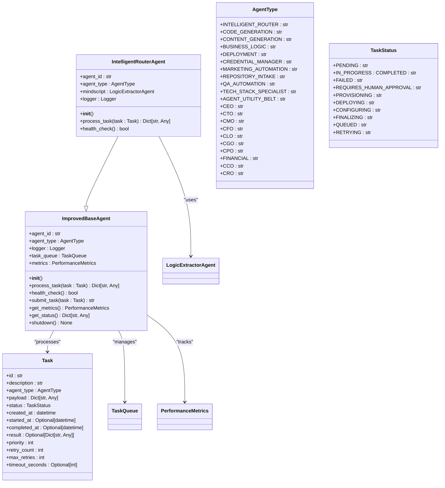

**Section sources**
- [intelligent_router_agent.py](file://371-os/src/minds371/adaptive_llm_router/intelligent_router_agent.py)
- [improved_base_agent.py](file://371-os/src/minds371/agents/base_agent/improved_base_agent.py)

**Diagram sources**
- [intelligent_router_agent.py](file://371-os/src/minds371/adaptive_llm_router/intelligent_router_agent.py)
- [improved_base_agent.py](file://371-os/src/minds371/agents/base_agent/improved_base_agent.py)

### Base Agent Framework Analysis

The Improved Base Agent framework provides a robust foundation for all agents in the system, incorporating performance optimizations, monitoring capabilities, and reliability patterns.

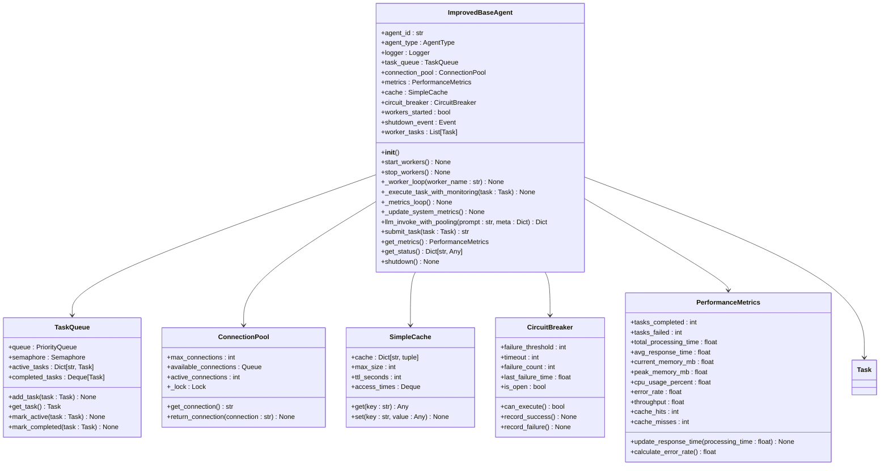

**Section sources**
- [improved_base_agent.py](file://371-os/src/minds371/agents/base_agent/improved_base_agent.py)

**Diagram sources**
- [improved_base_agent.py](file://371-os/src/minds371/agents/base_agent/improved_base_agent.py)

### Adaptive LLM Router Analysis

The Adaptive LLM Router is a critical component that manages interactions with multiple LLM providers, optimizing for cost, performance, and reliability.

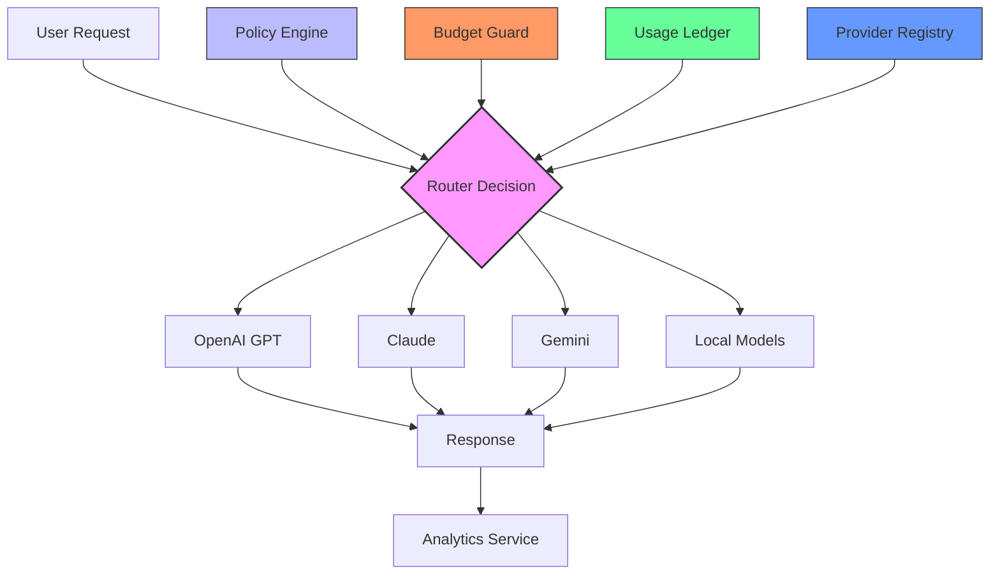

**Section sources**
- [system_architecture.html](file://371-os/docs/architecture/system_architecture.html)
- [policy_engine.py](file://371-os/src/minds371/adaptive_llm_router/policy_engine.py)
- [budget_guard.py](file://371-os/src/minds371/adaptive_llm_router/budget_guard.py)
- [usage_ledger.py](file://371-os/src/minds371/adaptive_llm_router/usage_ledger.py)
- [provider_registry.py](file://371-os/src/minds371/adaptive_llm_router/provider_registry.py)

**Diagram sources**
- [system_architecture.html](file://371-os/docs/architecture/system_architecture.html)
- [policy_engine.py](file://371-os/src/minds371/adaptive_llm_router/policy_engine.py)
- [budget_guard.py](file://371-os/src/minds371/adaptive_llm_router/budget_guard.py)

## Agent Communication and Data Flow

The 371OS system implements a sophisticated agent communication architecture that enables seamless coordination between specialized agents while maintaining clear separation of concerns.

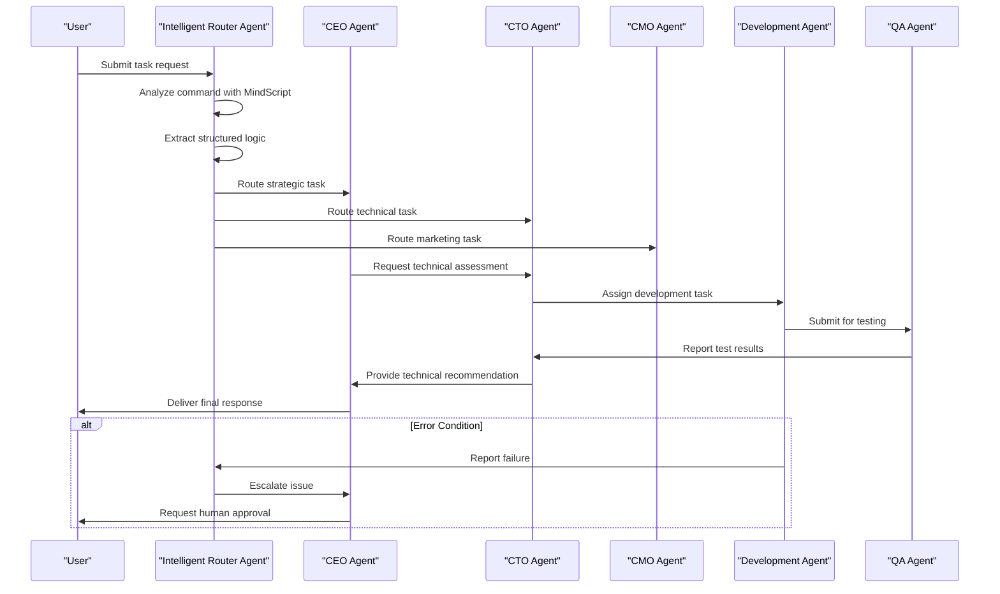

**Section sources**
- [system_architecture.html](file://371-os/docs/architecture/system_architecture.html)
- [intelligent_router_agent.py](file://371-os/src/minds371/adaptive_llm_router/intelligent_router_agent.py)

**Diagram sources**
- [system_architecture.html](file://371-os/docs/architecture/system_architecture.html)
- [intelligent_router_agent.py](file://371-os/src/minds371/adaptive_llm_router/intelligent_router_agent.py)

## Security Architecture

The 371OS system implements a comprehensive zero-trust security architecture with multiple layers of protection.

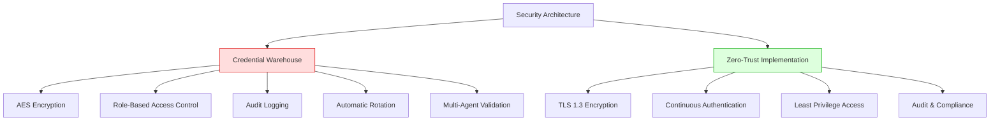

**Section sources**
- [system_architecture.html](file://371-os/docs/architecture/system_architecture.html)

**Diagram sources**
- [system_architecture.html](file://371-os/docs/architecture/system_architecture.html)

## Performance Optimization

The 371OS system incorporates multiple performance optimization features to ensure efficient and reliable operation. Recent tooling optimizations have significantly improved development workflow performance through migration to Bun's native tooling.

```mermaid
graph TD
A[Performance Optimization] --> B[Concurrency & Scaling]
A --> C[Caching & Pooling]
A --> D[Reliability Patterns]
A --> E[Tooling Optimization]
B --> B1[Priority-Based Queuing]
B --> B2[Semaphore-Controlled Concurrency]
B --> B3[Worker Pool Management]
B --> B4[Horizontal Scaling]
C --> C1[TTL-Based Response Caching]
C --> C2[Connection Pooling]
C --> C3[Resource Pool Optimization]
C --> C4[Cache Invalidation]
D --> D1[Circuit Breaker]
D --> D2[Exponential Backoff]
D --> D3[Health Monitoring]
D --> D4[Graceful Degradation]
E --> E1[Bun Watch Migration]
E --> E2[Jest to Bun Test Runner]
E --> E3[Dependency Reduction]
E --> E4[Execution Speed Improvement]
style A fill:#dfd,stroke:#0a0,stroke-width:2px
style B fill:#ddf,stroke:#00d,stroke-width:1px
style C fill:#ffd,stroke:#dd0,stroke-width:1px
style D fill:#fdd,stroke:#d00,stroke-width:1px
style E fill:#9cf,stroke:#00f,stroke-width:1px
```

**Section sources**
- [system_architecture.html](file://371-os/docs/architecture/system_architecture.html)
- [improved_base_agent.py](file://371-os/src/minds371/agents/base_agent/improved_base_agent.py)
- [BUN_WATCH_MIGRATION.md](file://BUN_WATCH_MIGRATION.md)
- [JEST_MIGRATION.md](file://JEST_MIGRATION.md)

**Diagram sources**
- [system_architecture.html](file://371-os/docs/architecture/system_architecture.html)
- [improved_base_agent.py](file://371-os/src/minds371/agents/base_agent/improved_base_agent.py)
- [BUN_WATCH_MIGRATION.md](file://BUN_WATCH_MIGRATION.md)
- [JEST_MIGRATION.md](file://JEST_MIGRATION.md)

### Tooling Optimization

The 371OS development environment has undergone significant tooling optimizations through migration to Bun's native tooling, resulting in substantial performance improvements and dependency reduction.

#### Bun Watch Migration

The system has migrated from nodemon and ts-node to Bun's built-in watcher, achieving significant improvements in development workflow performance.

**Key Benefits:**
- **Zero dependencies**: Built into Bun, requires no additional packages
- **Faster execution**: Written in Zig for optimal performance
- **Simpler configuration**: No complex configuration files needed
- **TypeScript support**: Can run TypeScript files directly without compilation
- **Hot reloading**: Automatically restarts the process on file changes

**Migration Changes:**
- Updated package.json scripts to use `bun --watch` instead of nodemon
- Removed nodemon, ts-node, and @swc-node/register from dependencies
- Simplified development workflow with native Bun commands

**Performance Improvement:**
- **nodemon**: ~1-2 seconds to restart after file changes
- **Bun --watch**: ~100-200 milliseconds to restart after file changes
- Represents a 5-10x performance improvement

**Section sources**
- [BUN_WATCH_MIGRATION.md](file://BUN_WATCH_MIGRATION.md)

#### Jest to Bun Test Runner Migration

The testing framework has been migrated from Jest to Bun's built-in test runner, resulting in dramatic performance improvements while maintaining compatibility with existing tests.

**Key Benefits:**
- **Jest-compatible**: Works with existing Jest test files with minimal changes
- **Zero dependencies**: Built into Bun, requires no additional packages
- **Orders of magnitude faster**: Written in Zig for optimal performance
- **Simplified configuration**: No complex Jest configuration files needed

**Migration Changes:**
- Updated test scripts to use `bun test` instead of Jest commands
- Removed Jest and related dependencies (jest, ts-jest, @nx/jest, @types/jest, etc.)
- Updated test files to use Bun's testing syntax where needed
- Removed Jest configuration files (jest.config.ts, jest.preset.js, tsconfig.spec.json)

**Performance Improvement:**
- **Jest**: ~5-10 seconds for a small test suite
- **Bun**: ~100-200 milliseconds for the same test suite
- Represents a 50-100x performance improvement

**Section sources**
- [JEST_MIGRATION.md](file://JEST_MIGRATION.md)

## Technology Stack and Deployment

The 371OS system leverages a modern technology stack designed for scalability, reliability, and ease of deployment.

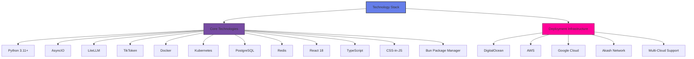

**Section sources**
- [system_architecture.html](file://371-os/docs/architecture/system_architecture.html)

**Diagram sources**
- [system_architecture.html](file://371-os/docs/architecture/system_architecture.html)

## Universal MCP Architecture

The Universal Model Context Protocol (MCP) Architecture is a revolutionary approach to agent coordination and tool integration in the 371OS ecosystem. Unlike traditional MCP implementations that are platform-specific, the Universal MCP provides a cross-platform, blockchain-coordinated framework for agent communication and tool access.

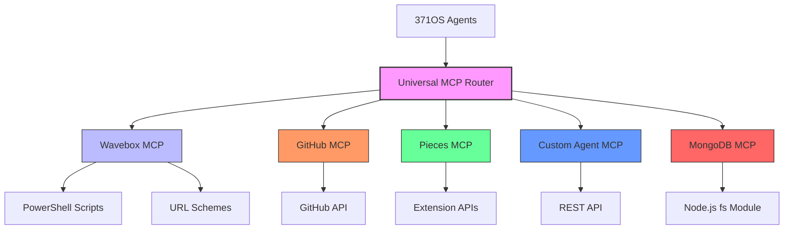

**Section sources**
- [universal_mcp_architecture.md](file://371-os/docs/architecture/universal_mcp_architecture.md)

**Diagram sources**
- [universal_mcp_architecture.md](file://371-os/docs/architecture/universal_mcp_architecture.md)

### Core Principles

The Universal MCP Architecture is built on three fundamental principles that ensure cross-platform compatibility, reliability, and security.

**Cross-Platform Compatibility**
- All MCP servers must be platform-agnostic
- Windows-specific automation (like AppleScript) is prohibited
- Use cross-platform alternatives: PowerShell, URL schemes, Extension APIs
- Must work on Windows, macOS, and Linux

**Stateless Design**
- MCP servers are stateless by design
- All state is managed through the blockchain registry
- Session persistence is handled by the Universal Tool Server
- No local state storage in MCP servers

**Blockchain Coordination**
- Agent discovery through decentralized registry
- Trust established through cryptographic verification
- Economic incentives through stake-based reputation system
- Decentralized coordination eliminates single points of failure

### MCP Server Structure

All MCP servers in 371OS follow a standardized structure that ensures consistency across implementations:

```
packages/elizaos-plugins/{mcp-name}/
├── src/
│   ├── plugin.ts          # Main plugin definition
│   ├── actions.ts         # Agent actions
│   ├── provider.ts        # Context provider
│   ├── evaluator.ts       # Quality assessment
│   ├── types.ts           # Type definitions
│   └── index.ts           # Exports
├── package.json           # Package configuration
├── project.json           # Nx workspace configuration
├── tsconfig.json          # TypeScript configuration
└── README.md              # Documentation
```

This standardized structure enables consistent development practices, easier maintenance, and simplified integration with the 371OS agent framework.

### Universal MCP Router

The Universal MCP Router serves as the central component that routes requests between agents and MCP servers. It provides intelligent routing based on agent requirements, platform compatibility, and performance metrics.

Key features of the Universal MCP Router include:
- Centralized request routing for all MCP servers
- Platform compatibility checking before routing
- Performance monitoring and load balancing
- Fallback mechanisms for failed requests
- Comprehensive logging and audit trails
- Security validation for all routed requests

The router ensures that agent requests are directed to the most appropriate MCP server based on the specific requirements of the task and the capabilities of available MCP servers.

### Existing MCP Servers

The 371OS ecosystem currently supports several MCP servers that provide cross-platform functionality:

**Wavebox MCP**
- Cross-platform: Windows, macOS, Linux
- Features: URL control, profile management, session handling
- Automation: PowerShell scripts, URL schemes
- Documentation: [wavebox-universal-mcp-windows.md](../../../AB/sessions/abideas/wavebox-universal-mcp-windows.md)

**GitHub MCP**
- Cross-platform: Windows, macOS, Linux
- Features: Repository management, issue tracking, code review
- Automation: GitHub API integration
- Documentation: [github-mcp.md](../../mcp_servers/github-mcp.md)

**Custom Agent MCP**
- Cross-platform: Windows, macOS, Linux
- Features: Custom agent communication, workflow coordination
- Automation: REST API, WebSocket connections
- Documentation: [custom_agent_mcp.md](../../mcp_servers/custom_agent_mcp.md)

**Local File MCP**
- Cross-platform: Windows, macOS, Linux
- Features: File system operations, document management
- Automation: Node.js fs module
- Documentation: [local_file_mcp.md](../../mcp_servers/local_file_mcp.md)

These MCP servers demonstrate the effectiveness of the Universal MCP Architecture in providing consistent, reliable tool integration across all supported platforms.

### Implementation Guidelines

When creating new MCP servers for the 371OS ecosystem, developers should follow these implementation guidelines:

**Creating New MCP Servers**
1. Follow the standard MCP server structure
2. Ensure cross-platform compatibility
3. Implement proper error handling
4. Document platform-specific considerations
5. Test on all supported platforms

**Integration with 371OS Agents**
```typescript
// Example agent configuration with MCP integration
const agentConfig = {
  name: 'TestAgent',
  plugins: [
    WaveboxMCPPlugin,    // Cross-platform Wavebox integration
    GithubMCPPlugin,     // Cross-platform GitHub integration
    CustomAgentMCPPlugin // Custom agent coordination
  ]
};
```

**Error Handling and Fallbacks**
```typescript
// Robust error handling for cross-platform compatibility
try {
  // Attempt primary automation method
  await executePrimaryMethod();
} catch (error) {
  // Fallback to alternative method
  await executeFallbackMethod();
}
```

These guidelines ensure that new MCP servers integrate seamlessly with the existing 371OS architecture and maintain the high standards of cross-platform compatibility and reliability.

### Security Considerations

The Universal MCP Architecture implements a comprehensive zero-trust security model:

**Zero-Trust Architecture**
- No hardcoded credentials in MCP servers
- All authentication through Secretless Broker
- Cryptographic verification of all interactions
- Role-based access control between agents and MCP servers

**Platform-Specific Security**
- Windows: Proper PowerShell execution policy handling
- All Platforms: Secure storage of sensitive data
- Network: Encrypted communication between components
- Input validation: Sanitization of all user inputs

These security measures ensure that MCP servers operate securely within the 371OS ecosystem while maintaining the integrity of agent communications and data.

## Conclusion

The 371OS system represents a paradigm shift in autonomous business operations, successfully replicating the structure and decision-making capabilities of traditional organizations while achieving unprecedented levels of automation and efficiency. The system's unique combination of C-Suite strategic intelligence, operational agent specialization, and adaptive LLM routing creates a competitive advantage that would be extremely difficult for competitors to replicate.

Key strategic advantages include a 95% reduction in manual business operations, $52,450/month MRR pipeline automation, enterprise-grade security and compliance, and an infinitely scalable multi-cloud architecture. The system's modular design allows for continuous improvement and expansion of agent capabilities, ensuring long-term adaptability and relevance in a rapidly evolving technological landscape.

Recent tooling optimizations through migration to Bun's native watcher and test runner have resulted in 5-10x faster development workflow restarts and 50-100x faster test execution, significantly improving developer productivity. The 371OS architecture demonstrates that the future of business operations isn't just automated—it's intelligently orchestrated, with AI agents working in concert to achieve business objectives with minimal human intervention.