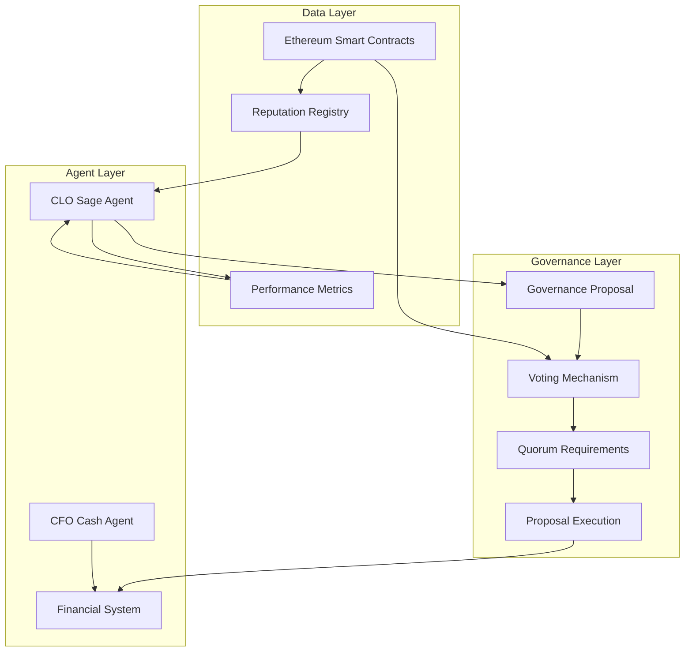
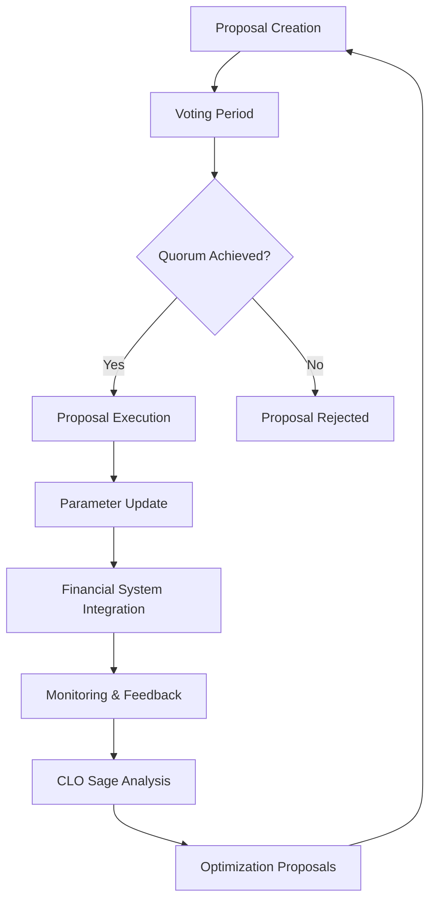
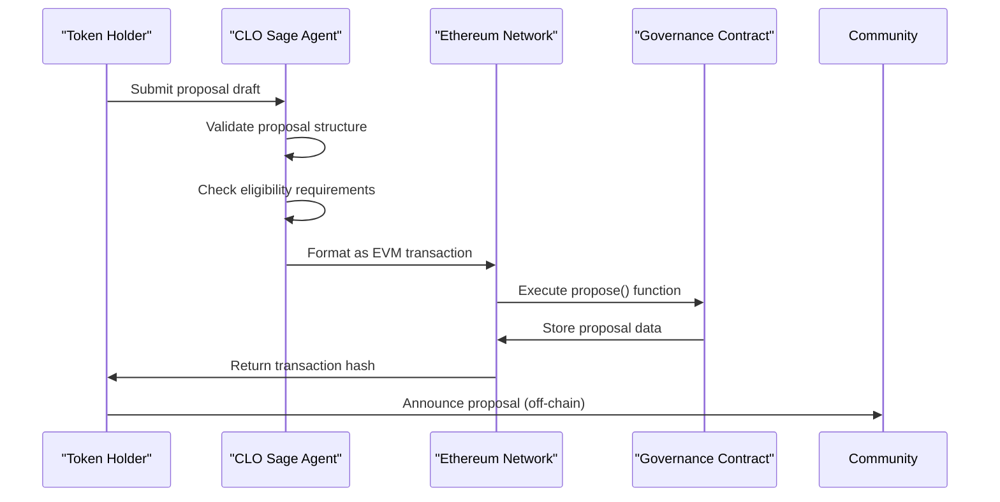
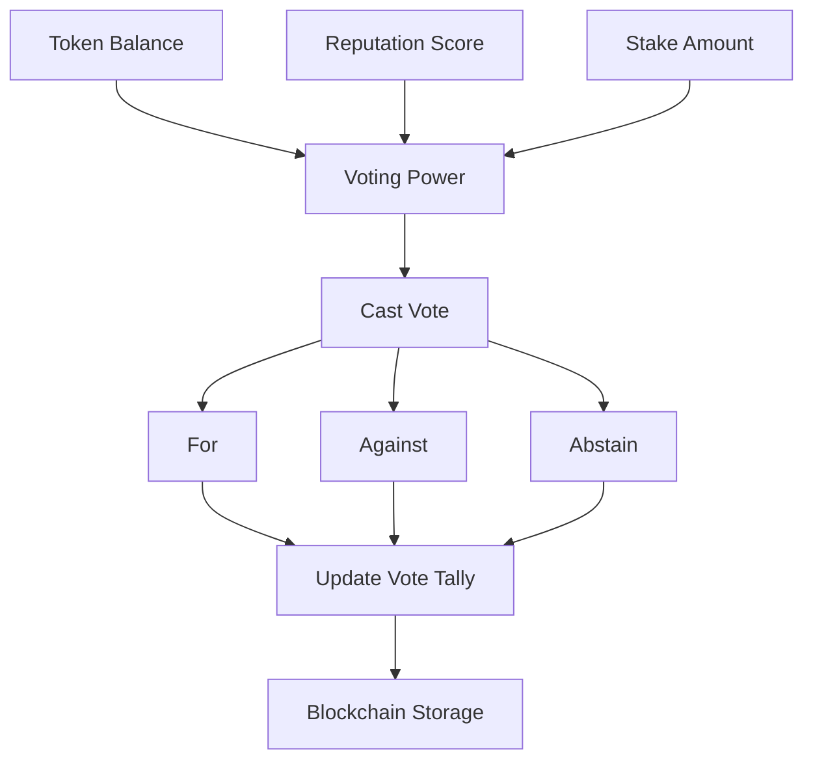
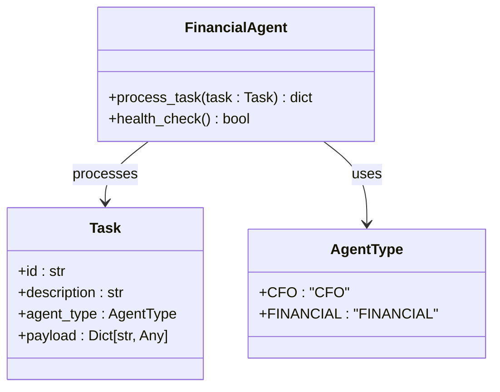
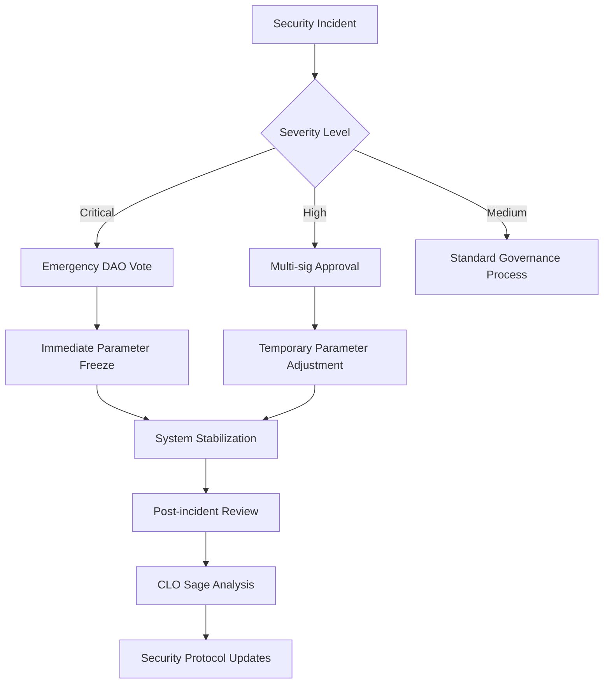

# DAO Governance for Economic Parameters

<cite>
**Referenced Files in This Document**   
- [clo_sage.py](file://371-os/src/minds371/agents/business/clo_sage.py)
- [financial_system.py](file://371-os/src/minds371/financial_system.py)
- [CLO_Agent_Logic.md](file://371-os/CLO_Agent_Logic.md)
- [CFO_Agent_Logic.md](file://371-os/CFO_Agent_Logic.md)
- [GovernanceProposal](file://packages/elizaos-plugins/universal-tool-server/src/types.ts#L186-L239)
- [EVM Developer Guide.md](file://elizaos/Plugins/DeFi Plugins/EVM/Developer Guide.md#L306-L361)
- [blockchain-registry.ts](file://packages/elizaos-plugins/universal-tool-server/src/blockchain-registry.ts)
- [371-OS-Launch-Notebook.md](file://371-os/src/minds371/371OS_launch/371-OS-Launch-Notebook.md#L373-L412)
</cite>

## Table of Contents
1. [Introduction](#introduction)
2. [Core Governance Components](#core-governance-components)
3. [Governance Workflow Overview](#governance-workflow-overview)
4. [Proposal Submission Process](#proposal-submission-process)
5. [Voting Mechanism and Power Calculation](#voting-mechanism-and-power-calculation)
6. [Quorum Requirements and Proposal Execution](#quorum-requirements-and-proposal-execution)
7. [Financial System Integration](#financial-system-integration)
8. [Security Considerations and Emergency Protocols](#security-considerations-and-emergency-protocols)
9. [Configuration Examples](#configuration-examples)
10. [Conclusion](#conclusion)

## Introduction
The DAO governance model in 371OS enables decentralized decision-making for economic parameters through a structured framework that combines token-based voting, reputation systems, and agent-driven optimization. This document details how token holders and high-reputation agents participate in collective decision-making to adjust incentive structures, fee schedules, and protocol rules. The system leverages blockchain-based governance mechanisms integrated with specialized agents like the CLO Sage and CFO Cash to ensure transparent, secure, and efficient parameter management. Governance outcomes directly influence the financial system, enabling dynamic updates to reward rates, stake requirements, and transaction fees based on community consensus.

## Core Governance Components

The governance architecture in 371OS consists of several interconnected components that facilitate decentralized economic parameter management:

- **CLO Sage Agent**: Responsible for continuous learning and optimization of agent performance, identifying patterns, and proposing workflow improvements.
- **Governance Proposals**: Structured on-chain proposals that define changes to economic parameters with specific types and execution parameters.
- **Voting Mechanism**: Token-based voting system with support for different vote types (for, against, abstain) and cryptographic transaction handling.
- **Financial System**: Integrates governance outcomes to update economic parameters such as reward rates and fee schedules.
- **Reputation System**: Tracks agent performance and contribution history to influence governance participation.



**Diagram sources**
- [clo_sage.py](file://371-os/src/minds371/agents/business/clo_sage.py)
- [financial_system.py](file://371-os/src/minds371/financial_system.py)
- [GovernanceProposal](file://packages/elizaos-plugins/universal-tool-server/src/types.ts#L186-L239)

**Section sources**
- [clo_sage.py](file://371-os/src/minds371/agents/business/clo_sage.py#L1-L77)
- [financial_system.py](file://371-os/src/minds371/financial_system.py#L1-L63)

## Governance Workflow Overview

The governance workflow in 371OS follows a structured process from proposal creation to parameter implementation:



This cyclical process ensures continuous improvement of economic parameters based on community input and performance data. The CLO Sage Agent plays a crucial role in analyzing outcomes and proposing future optimizations, creating a feedback loop that enhances governance effectiveness over time.

**Diagram sources**
- [CLO_Agent_Logic.md](file://371-os/CLO_Agent_Logic.md)
- [CFO_Agent_Logic.md](file://371-os/CFO_Agent_Logic.md)

## Proposal Submission Process

The proposal submission process in 371OS follows a standardized workflow that ensures proper formatting and validation:



Proposals are created using the `EVM_GOV_PROPOSE` action, which interfaces with the Governor contract on the Ethereum blockchain. The process involves:

1. **Draft Submission**: Token holders submit proposal drafts through the CLO Sage Agent interface.
2. **Validation**: The system validates proposal structure, required parameters, and eligibility criteria.
3. **Transaction Formatting**: Valid proposals are formatted as EVM transactions with appropriate calldata.
4. **On-chain Submission**: The proposal is submitted to the Governor contract via the `propose()` function.
5. **Confirmation**: The system returns a transaction hash for verification.

Each proposal includes essential parameters:
- **Targets**: Contract addresses to be modified
- **Values**: Ether values to send (if applicable)
- **Calldatas**: Encoded function calls for parameter updates
- **Description**: Human-readable explanation of the proposed changes

**Section sources**
- [EVM Developer Guide.md](file://elizaos/Plugins/DeFi Plugins/EVM/Developer Guide.md#L306-L361)
- [clo_sage.py](file://371-os/src/minds371/agents/business/clo_sage.py#L14-L52)

## Voting Mechanism and Power Calculation

The voting mechanism in 371OS combines token-based voting power with reputation-weighted influence to ensure balanced decision-making:



Voting power is calculated using a composite formula that considers multiple factors:

**Voting Power = (Token Balance × Token Weight) + (Reputation Score × Reputation Weight) + (Stake Amount × Stake Weight)**

The system implements the following voting mechanics:

- **Vote Types**: Support (for), oppose (against), and abstain options
- **Weighted Voting**: Different weights applied to tokens, reputation, and stake
- **Cryptographic Signing**: Votes are signed transactions on the Ethereum blockchain
- **Vote Delegation**: Token holders can delegate voting power to trusted agents

The actual vote casting occurs through the `EVM_GOV_VOTE` action, which calls the Governor contract's `castVote()` function with the appropriate vote value (1 for support, 0 for oppose, 2 for abstain).

Reputation scores are updated based on agent performance and contribution history, with the `updateReputation()` function submitting cryptographic proofs of execution results to the blockchain. The success rate calculation considers both positive reputation events and negative slashing events:

**Success Rate = (Total Events - Negative Events) / Total Events**

**Section sources**
- [blockchain-registry.ts](file://packages/elizaos-plugins/universal-tool-server/src/blockchain-registry.ts#L332-L368)
- [EVM Developer Guide.md](file://elizaos/Plugins/DeFi Plugins/EVM/Developer Guide.md#L306-L361)
- [blockchain-registry.ts](file://packages/elizaos-plugins/universal-tool-server/src/blockchain-registry.ts#L181-L232)

## Quorum Requirements and Proposal Execution

Quorum requirements in 371OS ensure that governance decisions reflect sufficient community participation before execution:

```mermaid
flowchart TD
A[Proposal Active] --> B{Voting Period<br>Completed?}
B --> |No| C[Continue Voting]
B --> |Yes| D{Quorum Met?<br>(Minimum Participation)}
D --> |No| E[Proposal Rejected]
D --> |Yes| F{Majority Support?<br>(Threshold Criteria)}
F --> |No| G[Proposal Rejected]
F --> |Yes| H[Execute Proposal]
H --> I[Update Economic Parameters]
I --> J[Financial System Sync]
J --> K[Monitoring Phase]
```

The quorum system operates with the following parameters:

- **Voting Period**: Configurable duration for vote collection (default: 7 days)
- **Minimum Participation**: Required percentage of total voting power (configurable by proposal type)
- **Approval Threshold**: Required majority for different proposal types (simple majority for minor changes, supermajority for critical parameters)

Proposal execution follows a secure process:
1. **Validation**: The system verifies quorum and approval thresholds have been met.
2. **Transaction Generation**: The Governor contract generates execution transactions.
3. **Parameter Updates**: Target contracts are modified with new economic parameters.
4. **Event Emission**: The system emits events to notify all components of changes.

The status lifecycle of a governance proposal includes:
- **Pending**: Proposal submitted but voting not yet active
- **Active**: Voting period in progress
- **Passed**: Quorum and approval thresholds met
- **Rejected**: Failed to meet requirements
- **Executed**: Changes implemented in the system

**Section sources**
- [blockchain-registry.ts](file://packages/elizaos-plugins/universal-tool-server/src/blockchain-registry.ts#L274-L313)
- [GovernanceProposal](file://packages/elizaos-plugins/universal-tool-server/src/types.ts#L186-L239)

## Financial System Integration

The financial system in 371OS integrates with governance outcomes to dynamically update economic parameters:



When a governance proposal is executed, the financial system updates parameters through the following workflow:

1. **Event Detection**: The system listens for `ProposalExecuted` events from the Governor contract.
2. **Parameter Extraction**: Relevant economic parameters are extracted from the proposal calldata.
3. **System Update**: The FinancialAgent processes the changes through its task processing system.
4. **Verification**: The system verifies the successful application of new parameters.

The integration supports updates to various economic parameters:

**Reward Rates**
- Staking rewards
- Incentive program payouts
- Referral bonuses

**Stake Requirements**
- Minimum stake for agent operation
- Capability-based stake multipliers
- Dynamic adjustment based on network conditions

**Transaction Fees**
- Base transaction costs
- Priority fee multipliers
- Volume-based discounts

The financial system processes these updates through task-based workflows, where each parameter change is treated as a discrete task with appropriate validation and error handling.

**Diagram sources**
- [financial_system.py](file://371-os/src/minds371/financial_system.py#L1-L63)

**Section sources**
- [financial_system.py](file://371-os/src/minds371/financial_system.py#L1-L63)
- [CFO_Agent_Logic.md](file://371-os/CFO_Agent_Logic.md)

## Security Considerations and Emergency Protocols

The governance system in 371OS incorporates multiple security measures to prevent attacks and ensure system integrity:

### Governance Attack Vectors and Mitigations

| Attack Vector | Mitigation Strategy |
|-------------|-------------------|
| **Vote Manipulation** | Multi-factor voting power calculation combining tokens, reputation, and stake |
| **Proposal Spam** | Proposal submission fees and eligibility requirements |
| **Sybil Attacks** | Identity verification and reputation-based participation limits |
| **Rug Pulls** | Timelock contracts for parameter changes and emergency override mechanisms |
| **Front-running** | Commit-reveal voting schemes and transaction ordering protection |

### Emergency Override Mechanisms

The system includes emergency protocols for critical situations:



Emergency protocols include:
- **Circuit Breakers**: Automatic system pauses during extreme market conditions
- **Multi-sig Controls**: Required approvals from multiple trusted parties for emergency actions
- **Timelock Delays**: Mandatory waiting periods for critical parameter changes
- **Audit Trails**: Comprehensive logging of all governance actions and system changes

The system also implements Zero Trust security principles with per-session, least-privilege access controls and secretless authentication to prevent credential exposure.

**Section sources**
- [Consulting\Legal and Compliance Guide.txt](file://Consulting/Legal and Compliance Guide.txt)
- [thought_leadership\AASA\Revolutionary Autonomous Agent Operating System.md](file://thought_leadership/AASA/Revolutionary Autonomous Agent Operating System.md)

## Configuration Examples

### Governance Council Setup
```typescript
// Governance council configuration
const governanceCouncil = {
  members: [
    { id: "clo_sage_001", role: "Chief Learning Officer", votingWeight: 1.5 },
    { id: "cfo_cash_001", role: "Chief Financial Officer", votingWeight: 1.5 },
    { id: "cto_alex_001", role: "Chief Technology Officer", votingWeight: 1.2 }
  ],
  quorumRequirements: {
    "economic-parameter": "20% of total voting power",
    "security-policy": "33% of total voting power",
    "tool-update": "10% of total voting power"
  },
  votingPeriods: {
    standard: "7d",
    emergency: "24h",
    routine: "14d"
  }
};
```

### Proposal Template Configuration
```json
{
  "proposalTypes": {
    "economic-parameter": {
      "requiredParameters": [
        "targetContract",
        "parameterName",
        "newValue",
        "implementationDate"
      ],
      "approvalThreshold": "60%",
      "votingPeriod": "604800" // 7 days in seconds
    },
    "fee-schedule": {
      "requiredParameters": [
        "feeType",
        "oldRate",
        "newRate",
        "effectiveDate"
      ],
      "approvalThreshold": "55%",
      "votingPeriod": "432000" // 5 days in seconds
    }
  }
}
```

### Voting Period Management
```python
# Voting period configuration in blockchain-registry.ts
def parseTimeWindow(timeWindow: str) -> int:
    """
    Convert time window string to block count
    """
    unit = timeWindow[-1]
    value = int(timeWindow[:-1])
    
    conversion_factors = {
        'h': 300,    # ~300 blocks per hour
        'd': 7200,   # ~7200 blocks per day  
        'w': 50400   # ~50400 blocks per week
    }
    
    return value * conversion_factors.get(unit, 7200)  # Default to 1 day
```

### Stake Requirement Calculation
```python
def calculateStakeRequirement(capabilities: List[AgentCapability]) -> float:
    """
    Calculate minimum stake requirement based on agent capabilities
    """
    baseStake = 10.0  # AKT
    capabilityStake = len(capabilities) * 2.0  # 2 AKT per capability
    complexityMultiplier = 2.0 if any(
        'financial' in cap.name or 'crypto' in cap.name 
        for cap in capabilities
    ) else 1.0
    
    return baseStake + (capabilityStake * complexityMultiplier)
```

**Section sources**
- [blockchain-registry.ts](file://packages/elizaos-plugins/universal-tool-server/src/blockchain-registry.ts#L332-L368)
- [371-OS-Launch-Notebook.md](file://371-os/src/minds371/371OS_launch/371-OS-Launch-Notebook.md#L373-L412)
- [types.ts](file://packages/elizaos-plugins/universal-tool-server/src/types.ts#L65-L125)

## Conclusion
The DAO governance model in 371OS provides a comprehensive framework for decentralized economic parameter management that balances community participation with technical expertise. By integrating token-based voting, reputation systems, and agent-driven optimization, the system enables secure and efficient collective decision-making. The CLO Sage Agent plays a crucial role in continuous learning and optimization, while the financial system ensures seamless integration of governance outcomes into operational parameters. Security considerations are addressed through multiple layers of protection, including quorum requirements, emergency override mechanisms, and Zero Trust principles. The configurable nature of the system allows for adaptation to different governance scenarios while maintaining transparency and accountability throughout the decision-making process.