# Economic Incentive Model

<cite>
**Referenced Files in This Document**   
- [financial_system.py](file://371-os/src/minds371/financial_system.py)
- [financial_agent.py](file://371-os/src/minds371/agents/utility/financial_agent.py)
- [cfo_cash.py](file://371-os/src/minds371/agents/business/cfo_cash.py)
- [CFO_Agent_Logic.md](file://371-os/CFO_Agent_Logic.md)
- [improved_base_agent.py](file://371-os/src/minds371/agents/base_agent/improved_base_agent.py)
- [blockchain-registry.ts](file://packages/elizaos-plugins/universal-tool-server/src/blockchain-registry.ts)
- [economics.ts](file://packages/elizaos-plugins/universal-tool-server/src/economics.ts)
- [actions.ts](file://packages/elizaos-plugins/universal-tool-server/src/actions.ts)
</cite>

## Table of Contents
1. [Introduction](#introduction)
2. [Project Structure](#project-structure)
3. [Core Components](#core-components)
4. [Architecture Overview](#architecture-overview)
5. [Detailed Component Analysis](#detailed-component-analysis)
6. [Reputation System](#reputation-system)
7. [Incentive Distribution Mechanism](#incentive-distribution-mechanism)
8. [DAO Governance Model](#dao-governance-model)
9. [Blockchain Integration](#blockchain-integration)
10. [Security Considerations](#security-considerations)
11. [Configuration Examples](#configuration-examples)
12. [CFO Agent Role](#cfo-agent-role)
13. [Conclusion](#conclusion)

## Introduction
The Economic Incentive Model in 371OS is a comprehensive system designed to align agent behavior with organizational goals through a stake-based reputation system and economic incentives. This model integrates financial oversight, performance tracking, reputation scoring, and reward distribution mechanisms to create a self-sustaining ecosystem where agents are motivated to perform optimally. The system leverages blockchain technology for transparent transaction recording and smart contract execution, ensuring trust and accountability across all interactions.

## Project Structure
The economic incentive system is distributed across multiple components within the 371OS architecture, with core functionality residing in the financial system and agent modules. The structure follows a layered approach with clear separation of concerns between financial processing, reputation management, and governance.

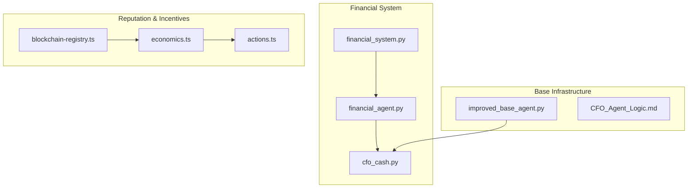
```mermaid
graph TD
subgraph "Financial System"
FS[financial_system.py]
FA[financial_agent.py]
CFA[cfo_cash.py]
end
subgraph "Reputation & Incentives"
BR[blockchain-registry.ts]
E[economics.ts]
A[actions.ts]
end
subgraph "Base Infrastructure"
IBA[improved_base_agent.py]
CAL[CFO_Agent_Logic.md]
end
FS --> FA
FA --> CFA
BR --> E
E --> A
IBA --> CFA
```

**Diagram sources**
- [financial_system.py](file://371-os/src/minds371/financial_system.py)
- [financial_agent.py](file://371-os/src/minds371/agents/utility/financial_agent.py)
- [cfo_cash.py](file://371-os/src/minds371/agents/business/cfo_cash.py)
- [blockchain-registry.ts](file://packages/elizaos-plugins/universal-tool-server/src/blockchain-registry.ts)
- [economics.ts](file://packages/elizaos-plugins/universal-tool-server/src/economics.ts)
- [actions.ts](file://packages/elizaos-plugins/universal-tool-server/src/actions.ts)

**Section sources**
- [financial_system.py](file://371-os/src/minds371/financial_system.py)
- [cfo_cash.py](file://371-os/src/minds371/agents/business/cfo_cash.py)

## Core Components
The economic incentive model comprises several interconnected components that work together to manage agent economics and performance. The core components include the Financial System, Financial Agent, CFO Agent, and Blockchain Registry, each serving specific functions in the incentive ecosystem.

**Section sources**
- [financial_system.py](file://371-os/src/minds371/financial_system.py)
- [financial_agent.py](file://371-os/src/minds371/agents/utility/financial_agent.py)
- [cfo_cash.py](file://371-os/src/minds371/agents/business/cfo_cash.py)

## Architecture Overview
The economic incentive architecture follows a decentralized model where financial operations, reputation management, and governance are handled through specialized components that interact via well-defined interfaces. The system is designed to be transparent, secure, and resistant to gaming or manipulation.

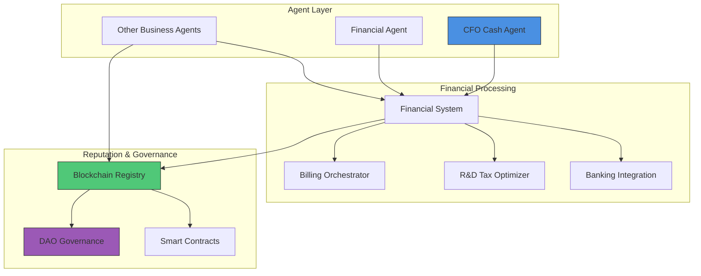
```mermaid
graph TB
subgraph "Agent Layer"
CFO[CFO Cash Agent]
FA[Financial Agent]
Other[Other Business Agents]
end
subgraph "Financial Processing"
FS[Financial System]
BT[Billing Orchestrator]
RT[R&D Tax Optimizer]
BI[Banking Integration]
end
subgraph "Reputation & Governance"
BR[Blockchain Registry]
DAO[DAO Governance]
SC[Smart Contracts]
end
CFO --> FS
FA --> FS
FS --> BT
FS --> RT
FS --> BI
FS --> BR
BR --> DAO
BR --> SC
Other --> BR
Other --> FS
style CFO fill:#4a90e2,stroke:#333
style BR fill:#50c878,stroke:#333
style DAO fill:#9b59b6,stroke:#333
```

**Diagram sources**
- [financial_system.py](file://371-os/src/minds371/financial_system.py)
- [cfo_cash.py](file://371-os/src/minds371/agents/business/cfo_cash.py)
- [blockchain-registry.ts](file://packages/elizaos-plugins/universal-tool-server/src/blockchain-registry.ts)

## Detailed Component Analysis

### Financial System Analysis
The financial system serves as the foundation for all economic operations within 371OS, providing core functionality for processing financial tasks and managing economic data.

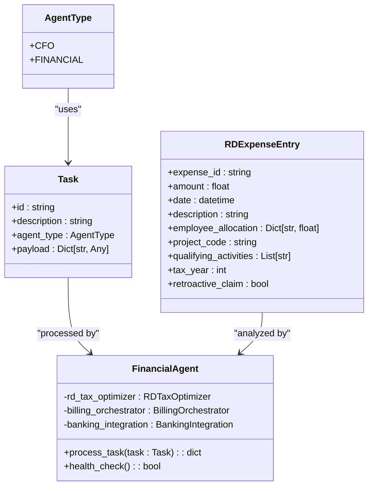
```mermaid
classDiagram
class AgentType {
+CFO
+FINANCIAL
}
class Task {
+id : string
+description : string
+agent_type : AgentType
+payload : Dict[str, Any]
}
class RDExpenseEntry {
+expense_id : string
+amount : float
+date : datetime
+description : string
+employee_allocation : Dict[str, float]
+project_code : string
+qualifying_activities : List[str]
+tax_year : int
+retroactive_claim : bool
}
class FinancialAgent {
-rd_tax_optimizer : RDTaxOptimizer
-billing_orchestrator : BillingOrchestrator
-banking_integration : BankingIntegration
+process_task(task : Task) : dict
+health_check() : bool
}
AgentType --> Task : "uses"
Task --> FinancialAgent : "processed by"
RDExpenseEntry --> FinancialAgent : "analyzed by"
```

**Diagram sources**
- [financial_system.py](file://371-os/src/minds371/financial_system.py#L1-L63)

**Section sources**
- [financial_system.py](file://371-os/src/minds371/financial_system.py#L1-L63)

### Financial Agent Implementation
The Financial Agent extends the base financial system with utility functions for financial tasks, serving as a bridge between the core financial system and specialized financial agents.

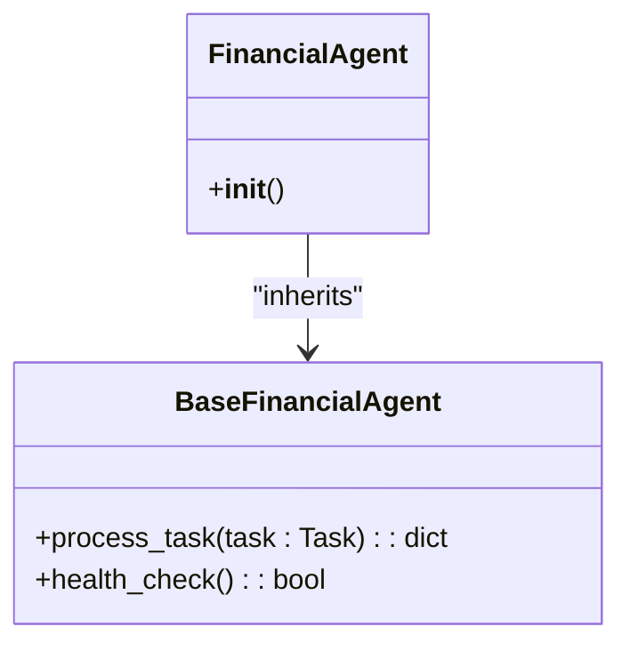
```mermaid
classDiagram
class FinancialAgent {
+__init__()
}
class BaseFinancialAgent {
+process_task(task : Task) : dict
+health_check() : bool
}
FinancialAgent --> BaseFinancialAgent : "inherits"
```

**Diagram sources**
- [financial_agent.py](file://371-os/src/minds371/agents/utility/financial_agent.py#L1-L10)

**Section sources**
- [financial_agent.py](file://371-os/src/minds371/agents/utility/financial_agent.py#L1-L10)

### CFO Agent Workflow
The CFO Cash Agent implements financial workflow logic by orchestrating various financial tasks and delegating execution to the underlying financial system.

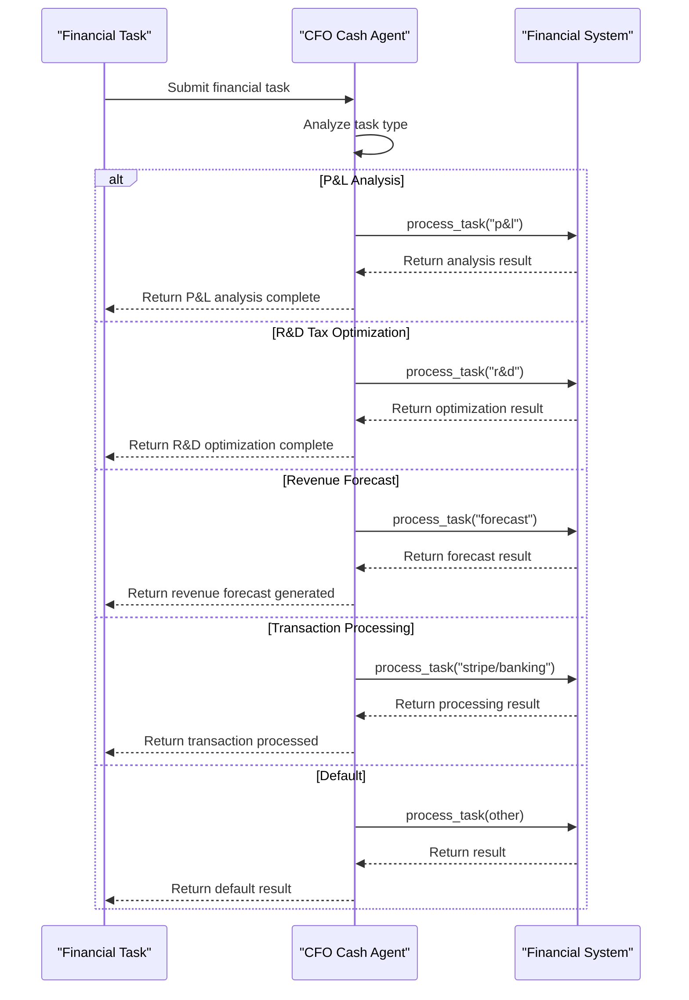
```mermaid
sequenceDiagram
participant Task as "Financial Task"
participant CFO as "CFO Cash Agent"
participant FS as "Financial System"
Task->>CFO : Submit financial task
CFO->>CFO : Analyze task type
alt P&L Analysis
CFO->>FS : process_task("p&l")
FS-->>CFO : Return analysis result
CFO-->>Task : Return P&L analysis complete
else R&D Tax Optimization
CFO->>FS : process_task("r&d")
FS-->>CFO : Return optimization result
CFO-->>Task : Return R&D optimization complete
else Revenue Forecast
CFO->>FS : process_task("forecast")
FS-->>CFO : Return forecast result
CFO-->>Task : Return revenue forecast generated
else Transaction Processing
CFO->>FS : process_task("stripe/banking")
FS-->>CFO : Return processing result
CFO-->>Task : Return transaction processed
else Default
CFO->>FS : process_task(other)
FS-->>CFO : Return result
CFO-->>Task : Return default result
end
```

**Diagram sources**
- [cfo_cash.py](file://371-os/src/minds371/agents/business/cfo_cash.py#L1-L50)
- [CFO_Agent_Logic.md](file://371-os/CFO_Agent_Logic.md#L1-L24)

**Section sources**
- [cfo_cash.py](file://371-os/src/minds371/agents/business/cfo_cash.py#L1-L50)
- [CFO_Agent_Logic.md](file://371-os/CFO_Agent_Logic.md#L1-L24)

## Reputation System

### Reputation Scoring Mechanism
The reputation system in 371OS is built on blockchain technology, providing a transparent and tamper-proof method for tracking agent performance and trustworthiness. Reputation scores are updated based on completed interactions, user feedback, and automated performance metrics.

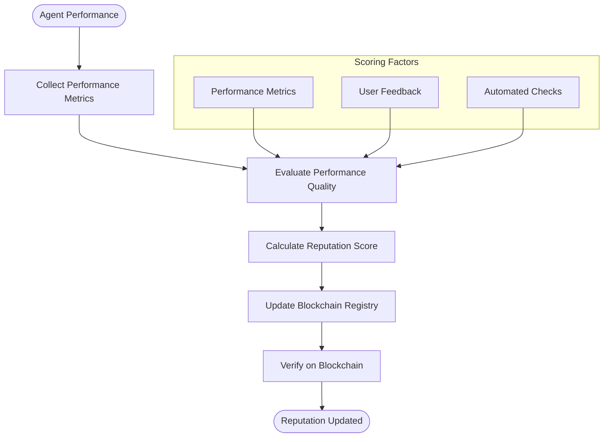
```mermaid
flowchart TD
Start([Agent Performance]) --> CollectMetrics["Collect Performance Metrics"]
CollectMetrics --> Evaluate["Evaluate Performance Quality"]
Evaluate --> Calculate["Calculate Reputation Score"]
Calculate --> Update["Update Blockchain Registry"]
Update --> Verify["Verify on Blockchain"]
Verify --> Complete([Reputation Updated])
subgraph "Scoring Factors"
PF[Performance Metrics]
UF[User Feedback]
AC[Automated Checks]
end
PF --> Evaluate
UF --> Evaluate
AC --> Evaluate
```

**Diagram sources**
- [blockchain-registry.ts](file://packages/elizaos-plugins/universal-tool-server/src/blockchain-registry.ts#L181-L232)
- [actions.ts](file://packages/elizaos-plugins/universal-tool-server/src/actions.ts#L267-L305)

**Section sources**
- [blockchain-registry.ts](file://packages/elizaos-plugins/universal-tool-server/src/blockchain-registry.ts#L181-L232)
- [actions.ts](file://packages/elizaos-plugins/universal-tool-server/src/actions.ts#L267-L305)

### Reputation Update Workflow
The reputation update process follows a secure workflow that ensures only valid performance data is recorded on the blockchain, with cryptographic proof and evidence linking to verifiable execution results.

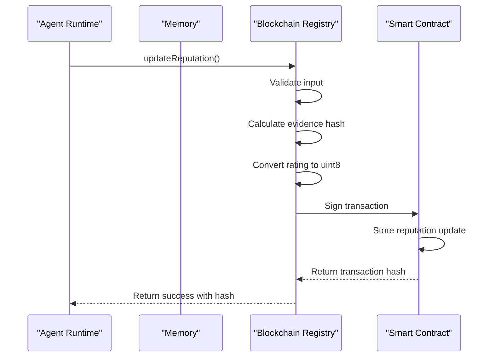
```mermaid
sequenceDiagram
participant Runtime as "Agent Runtime"
participant Memory as "Memory"
participant Registry as "Blockchain Registry"
participant Contract as "Smart Contract"
Runtime->>Registry : updateReputation()
Registry->>Registry : Validate input
Registry->>Registry : Calculate evidence hash
Registry->>Registry : Convert rating to uint8
Registry->>Contract : Sign transaction
Contract->>Contract : Store reputation update
Contract-->>Registry : Return transaction hash
Registry-->>Runtime : Return success with hash
```

**Diagram sources**
- [blockchain-registry.ts](file://packages/elizaos-plugins/universal-tool-server/src/blockchain-registry.ts#L181-L232)

## Incentive Distribution Mechanism

### Economic Incentive Pattern
The economic incentive system follows a structured pattern that ensures fair reward distribution based on performance quality, with escrow-based payments and quality verification.

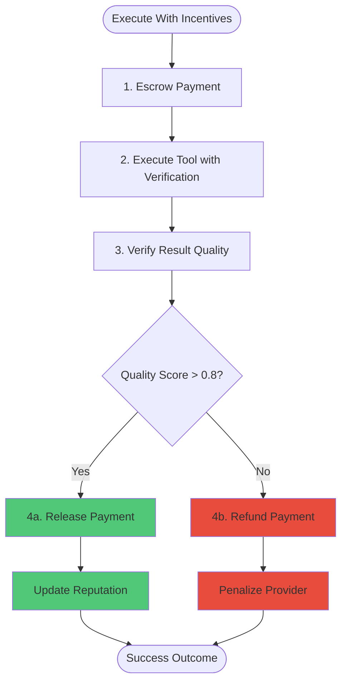
```mermaid
flowchart TD
Start([Execute With Incentives]) --> Escrow["1. Escrow Payment"]
Escrow --> Execute["2. Execute Tool with Verification"]
Execute --> Verify["3. Verify Result Quality"]
Verify --> Decision{"Quality Score > 0.8?"}
Decision --> |Yes| Release["4a. Release Payment"]
Decision --> |No| Refund["4b. Refund Payment"]
Release --> Reputation["Update Reputation"]
Refund --> Penalty["Penalize Provider"]
Reputation --> Complete([Success Outcome])
Penalty --> Complete
style Release fill:#50c878
style Refund fill:#e74c3c
style Reputation fill:#50c878
style Penalty fill:#e74c3c
```

**Diagram sources**
- [economics.ts](file://packages/elizaos-plugins/universal-tool-server/src/economics.ts#L1-L20)

**Section sources**
- [economics.ts](file://packages/elizaos-plugins/universal-tool-server/src/economics.ts#L1-L20)

### Reward Distribution Workflow
The reward distribution system ensures that agents are compensated fairly based on their performance, with automated payment release for successful outcomes and refunds for subpar results.

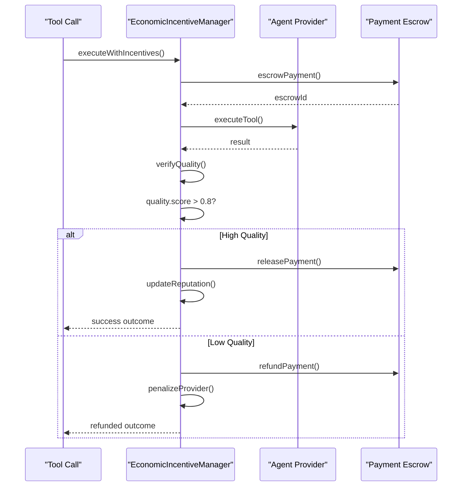
```mermaid
sequenceDiagram
participant ToolCall as "Tool Call"
participant Manager as "EconomicIncentiveManager"
participant Provider as "Agent Provider"
participant Escrow as "Payment Escrow"
ToolCall->>Manager : executeWithIncentives()
Manager->>Escrow : escrowPayment()
Escrow-->>Manager : escrowId
Manager->>Provider : executeTool()
Provider-->>Manager : result
Manager->>Manager : verifyQuality()
Manager->>Manager : quality.score > 0.8?
alt High Quality
Manager->>Escrow : releasePayment()
Manager->>Manager : updateReputation()
Manager-->>ToolCall : success outcome
else Low Quality
Manager->>Escrow : refundPayment()
Manager->>Manager : penalizeProvider()
Manager-->>ToolCall : refunded outcome
end
```

**Diagram sources**
- [economics.ts](file://packages/elizaos-plugins/universal-tool-server/src/economics.ts#L1-L20)

## DAO Governance Model

### Collective Decision-Making Process
The DAO governance model enables collective decision-making on economic parameters, allowing stakeholders to vote on key system changes and compensation frameworks.

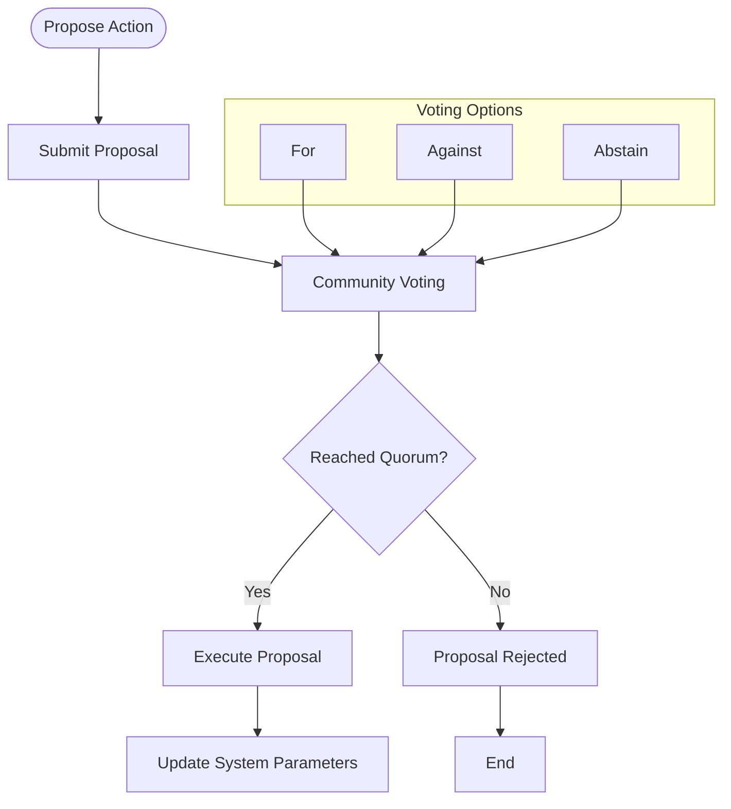
```mermaid
flowchart TD
Propose([Propose Action]) --> Submit["Submit Proposal"]
Submit --> Vote["Community Voting"]
Vote --> Threshold{"Reached Quorum?"}
Threshold --> |Yes| Execute["Execute Proposal"]
Threshold --> |No| Reject["Proposal Rejected"]
Execute --> Update["Update System Parameters"]
Reject --> End
subgraph "Voting Options"
For[For]
Against[Against]
Abstain[Abstain]
end
For --> Vote
Against --> Vote
Abstain --> Vote
```

**Diagram sources**
- [EVM\Developer Guide.md](file://elizaos/Plugins/DeFi Plugins/EVM/Developer Guide.md#L306-L361)

**Section sources**
- [EVM\Developer Guide.md](file://elizaos/Plugins/DeFi Plugins/EVM/Developer Guide.md#L306-L361)

### Compensation Framework
The compensation framework combines base allocation with performance bonuses and community governance, creating a balanced incentive structure.

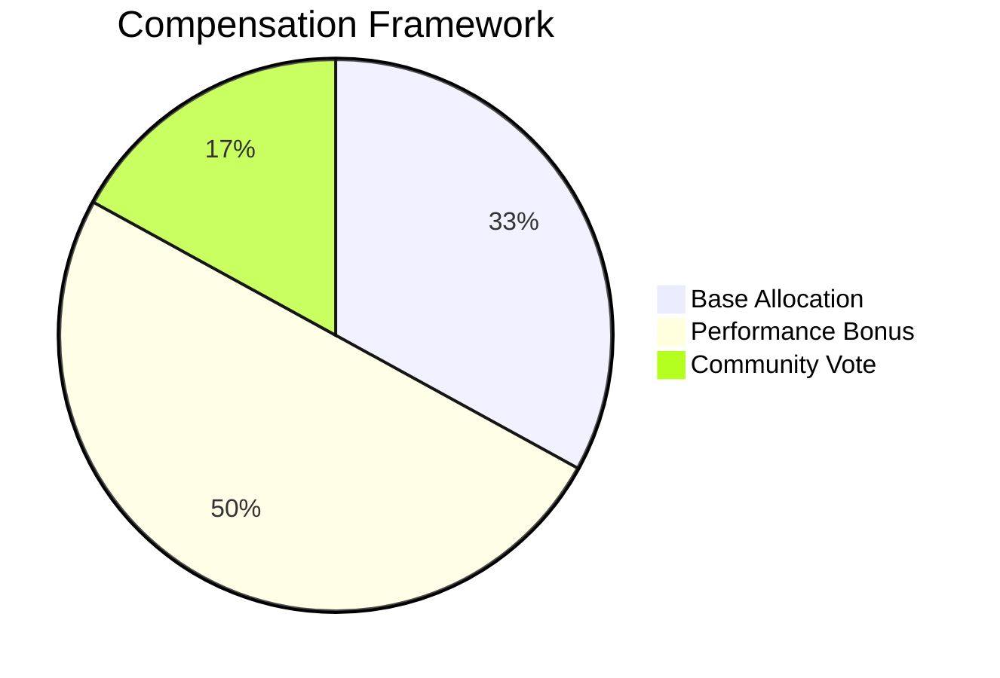
```mermaid
pie
title Compensation Framework
"Base Allocation" : 33
"Performance Bonus" : 50
"Community Vote" : 17
```

**Diagram sources**
- [371-OS-Launch-Notebook.md](file://371-os/src/minds371/371OS_launch/371-OS-Launch-Notebook.md#L373-L412)

## Blockchain Integration

### Decentralized Agent Registry
The blockchain-based Universal Tool Server implements a distributed agent registry that enables trustless agent discovery, reputation management, and economic coordination without centralized authorities.

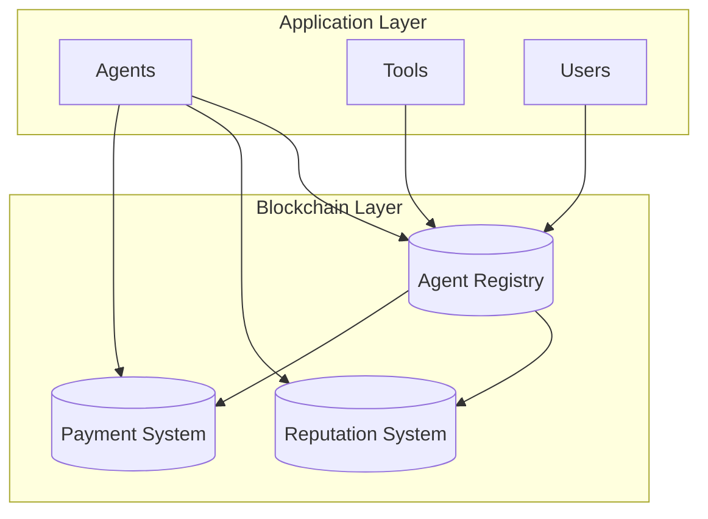
```mermaid
graph TD
subgraph "Blockchain Layer"
Registry[(Agent Registry)]
Reputation[(Reputation System)]
Payments[(Payment System)]
end
subgraph "Application Layer"
Agents[Agents]
Tools[Tools]
Users[Users]
end
Agents --> Registry
Tools --> Registry
Users --> Registry
Agents --> Reputation
Agents --> Payments
Registry --> Reputation
Registry --> Payments
```

**Diagram sources**
- [blockchain-registry.ts](file://packages/elizaos-plugins/universal-tool-server/src/blockchain-registry.ts#L1-L22)

**Section sources**
- [blockchain-registry.ts](file://packages/elizaos-plugins/universal-tool-server/src/blockchain-registry.ts#L1-L22)

### Smart Contract Execution
Smart contracts handle critical economic operations including reputation updates, payment processing, and governance actions, ensuring transparent and verifiable execution.

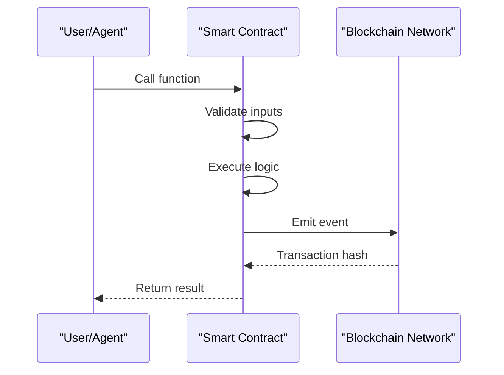
```mermaid
sequenceDiagram
participant User as "User/Agent"
participant Contract as "Smart Contract"
participant Blockchain as "Blockchain Network"
User->>Contract : Call function
Contract->>Contract : Validate inputs
Contract->>Contract : Execute logic
Contract->>Blockchain : Emit event
Blockchain-->>Contract : Transaction hash
Contract-->>User : Return result
```

**Diagram sources**
- [blockchain-registry.ts](file://packages/elizaos-plugins/universal-tool-server/src/blockchain-registry.ts#L181-L232)

## Security Considerations

### Anti-Gaming Measures
The system implements multiple security measures to prevent gaming of the incentive system and ensure fair reward distribution.

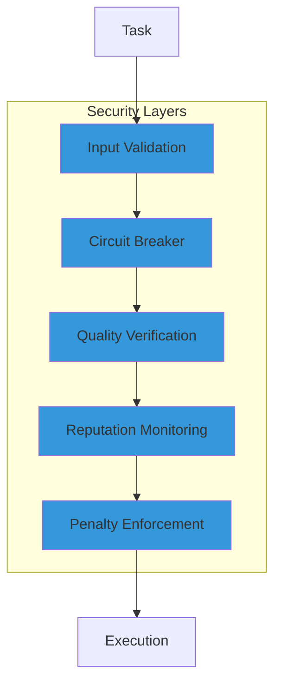
```mermaid
flowchart TD
subgraph "Security Layers"
SL1[Input Validation]
SL2[Circuit Breaker]
SL3[Quality Verification]
SL4[Reputation Monitoring]
SL5[Penalty Enforcement]
end
Task --> SL1
SL1 --> SL2
SL2 --> SL3
SL3 --> SL4
SL4 --> SL5
SL5 --> Execution
style SL1 fill:#3498db
style SL2 fill:#3498db
style SL3 fill:#3498db
style SL4 fill:#3498db
style SL5 fill:#3498db
```

**Section sources**
- [improved_base_agent.py](file://371-os/src/minds371/agents/base_agent/improved_base_agent.py#L1-L526)
- [economics.ts](file://packages/elizaos-plugins/universal-tool-server/src/economics.ts#L1-L20)

### Penalty Enforcement System
The penalty system, or "slashing" mechanism, enforces accountability by penalizing agents for poor performance or malicious behavior.

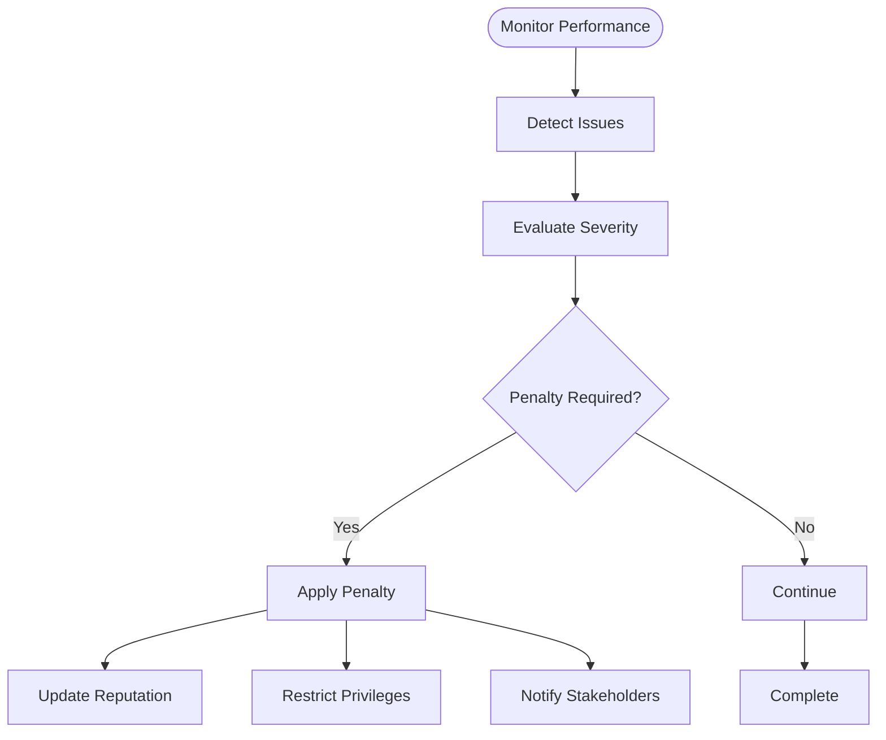
```mermaid
flowchart TD
Monitor([Monitor Performance]) --> Detect["Detect Issues"]
Detect --> Evaluate["Evaluate Severity"]
Evaluate --> Decision{"Penalty Required?"}
Decision --> |Yes| Apply["Apply Penalty"]
Decision --> |No| Continue
Apply --> Update["Update Reputation"]
Apply --> Restrict["Restrict Privileges"]
Apply --> Notify["Notify Stakeholders"]
Continue --> Complete
```

**Section sources**
- [economics.ts](file://packages/elizaos-plugins/universal-tool-server/src/economics.ts#L1-L20)
- [blockchain-registry.ts](file://packages/elizaos-plugins/universal-tool-server/src/blockchain-registry.ts#L181-L232)

## Configuration Examples

### Incentive Parameters Setup
Configuration example for setting up economic incentive parameters:

```typescript
// Economic incentive configuration
const incentiveConfig = {
  qualityThreshold: 0.8,
  escrowDuration: '72h',
  reputationWeight: 0.6,
  performanceWeight: 0.4,
  maxBonusMultiplier: 2.0,
  penaltyMultiplier: 0.5
};
```

### Reward Structure Definition
Example of defining a reward structure for agent compensation:

```typescript
// Reward structure configuration
const rewardStructure = {
  baseAllocation: 'equal',
  performanceBonus: {
    threshold: 0.8,
    multiplier: 2.0,
    maxMultiplier: 3.0
  },
  communityGovernance: {
    votingWeight: 0.25,
    proposalThreshold: 0.51
  },
  vestingSchedule: {
    cliff: '90d',
    duration: '365d'
  }
};
```

### Stake Requirements Configuration
Configuration for stake requirements based on agent capabilities:

```typescript
// Stake requirement calculation
private calculateStakeRequirement(capabilities: AgentCapability[]): number {
  const baseStake = 10; // AKT
  const capabilityStake = capabilities.length * 2; // 2 AKT per capability
  const complexityMultiplier = capabilities.some(cap => 
    cap.name.includes('financial') || cap.name.includes('crypto')
  ) ? 2 : 1;
  
  return baseStake + (capabilityStake * complexityMultiplier);
}
```

**Section sources**
- [blockchain-registry.ts](file://packages/elizaos-plugins/universal-tool-server/src/blockchain-registry.ts#L332-L368)

## CFO Agent Role

### Financial Oversight Responsibilities
The CFO Agent (Maya) plays a critical role in financial oversight and optimization, managing key financial workflows and ensuring economic efficiency.

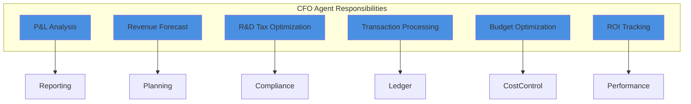
```mermaid
flowchart TD
subgraph "CFO Agent Responsibilities"
PNL[P&L Analysis]
Forecast[Revenue Forecast]
RDTax[R&D Tax Optimization]
Transactions[Transaction Processing]
Budget[Budget Optimization]
ROI[ROI Tracking]
end
PNL --> Reporting
Forecast --> Planning
RDTax --> Compliance
Transactions --> Ledger
Budget --> CostControl
ROI --> Performance
style PNL fill:#4a90e2
style Forecast fill:#4a90e2
style RDTax fill:#4a90e2
style Transactions fill:#4a90e2
style Budget fill:#4a90e2
style ROI fill:#4a90e2
```

**Section sources**
- [cfo_cash.py](file://371-os/src/minds371/agents/business/cfo_cash.py#L1-L50)
- [CFO_Agent_Logic.md](file://371-os/CFO_Agent_Logic.md#L1-L24)

### Optimization Workflow
The CFO Agent's optimization workflow follows a structured process for analyzing financial data and generating insights.

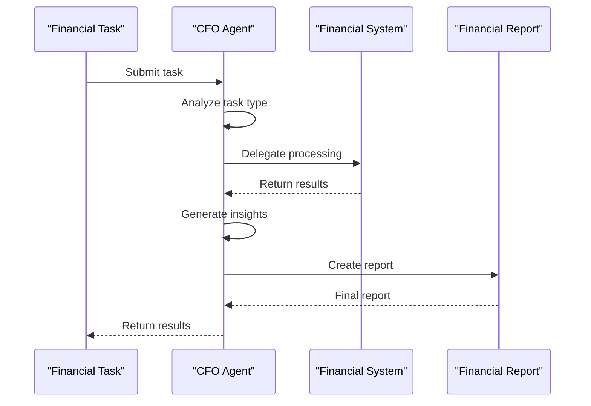
```mermaid
sequenceDiagram
participant Task as "Financial Task"
participant CFO as "CFO Agent"
participant System as "Financial System"
participant Report as "Financial Report"
Task->>CFO : Submit task
CFO->>CFO : Analyze task type
CFO->>System : Delegate processing
System-->>CFO : Return results
CFO->>CFO : Generate insights
CFO->>Report : Create report
Report-->>CFO : Final report
CFO-->>Task : Return results
```

**Section sources**
- [cfo_cash.py](file://371-os/src/minds371/agents/business/cfo_cash.py#L1-L50)

## Conclusion
The Economic Incentive Model in 371OS represents a sophisticated integration of financial systems, reputation management, and decentralized governance. By aligning agent behavior with system goals through economic incentives, the model creates a self-reinforcing ecosystem where performance is rewarded and accountability is enforced. The stake-based reputation system, combined with blockchain-based transparency and DAO governance, ensures that the system remains fair, secure, and resistant to manipulation. The CFO Agent plays a pivotal role in financial oversight, while the comprehensive incentive distribution mechanism ensures that rewards are distributed fairly based on verifiable performance metrics. This architecture provides a robust foundation for autonomous agent economies, enabling sustainable growth and value creation within the 371OS ecosystem.