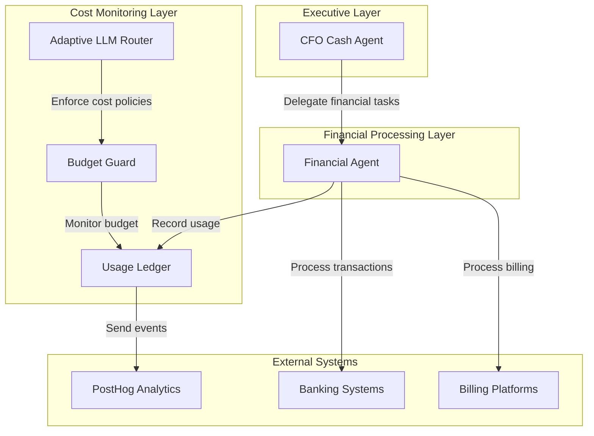
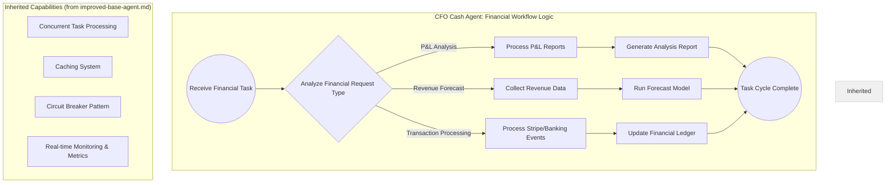
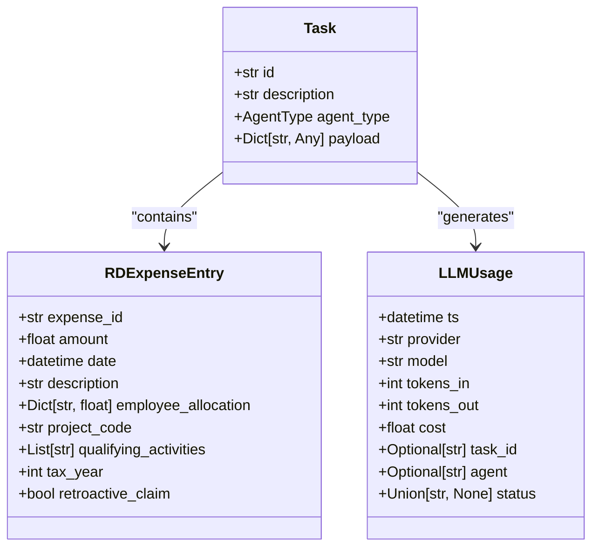
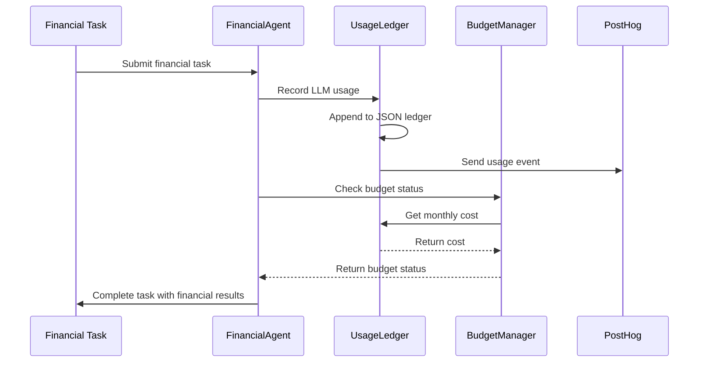
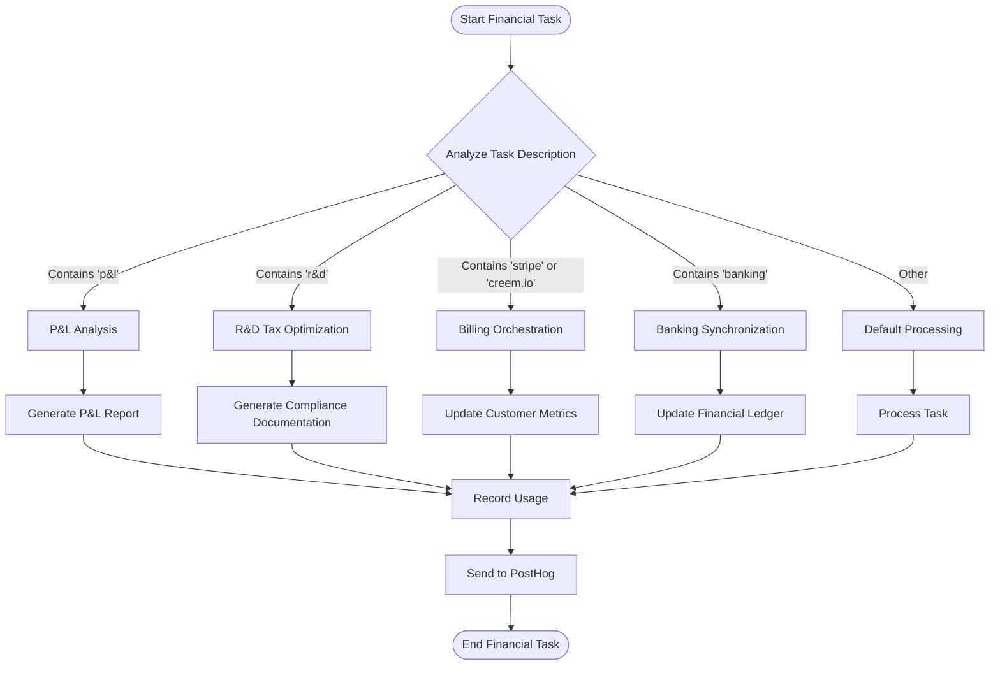

# Financial Agent Implementation

<cite>
**Referenced Files in This Document**   
- [financial_system.py](file://371-os\src\minds371\financial_system.py)
- [financial_agent.py](file://371-os\src\minds371\agents\utility\financial_agent.py)
- [financial_agent.md](file://371-os\src\minds371\agents\utility\financial_agent.md)
- [cfo_cash.py](file://371-os\src\minds371\agents\business\cfo_cash.py)
- [CFO_Agent_Logic.md](file://371-os\CFO_Agent_Logic.md)
- [budget_guard.py](file://371-os\src\minds371\adaptive_llm_router\budget_guard.py)
- [usage_ledger.py](file://371-os\src\minds371\adaptive_llm_router\usage_ledger.py)
- [data_models.py](file://371-os\src\minds371\adaptive_llm_router\data_models.py)
- [config.py](file://371-os\src\minds371\adaptive_llm_router\config.py)
</cite>

## Table of Contents
1. [Introduction](#introduction)
2. [Core Architecture](#core-architecture)
3. [Financial Agent Implementation](#financial-agent-implementation)
4. [CFO Agent Integration](#cfo-agent-integration)
5. [Financial Data Models](#financial-data-models)
6. [Cost Monitoring and Budget Management](#cost-monitoring-and-budget-management)
7. [Transaction Processing Workflow](#transaction-processing-workflow)
8. [Error Handling and Audit Trail](#error-handling-and-audit-trail)
9. [Configuration and External Integration](#configuration-and-external-integration)
10. [Conclusion](#conclusion)

## Introduction
The Financial Agent in 371OS serves as the central component for managing all economic operations within the autonomous agent ecosystem. This document provides a comprehensive analysis of the financial agent's architecture, responsibilities, and integration points. The Financial Agent is designed to handle cost accounting, revenue tracking, profit distribution, and financial reporting across the multi-agent system. It interfaces with various components including the CFO Agent (Maya), Adaptive LLM Router for cost monitoring, external payment systems, and blockchain ledgers. The implementation follows a modular design pattern, inheriting core capabilities from the improved base agent while providing specialized financial processing functions. This documentation details the key functions, data models, integration patterns, and operational workflows that enable the financial agent to maintain accurate financial records and optimize economic performance across the 371OS platform.

## Core Architecture
The financial architecture in 371OS follows a layered design pattern with clear separation of concerns between financial processing, cost monitoring, and executive decision-making components. At the core is the FinancialAgent class, which provides fundamental financial operations and serves as the base for specialized financial agents. The architecture implements a delegation pattern where higher-level agents like the CFO Cash Agent route financial tasks to the FinancialAgent for execution. This design enables specialization while maintaining a single source of truth for financial operations.

The system integrates with the Adaptive LLM Router to monitor and optimize LLM usage costs, ensuring financial operations remain within budget constraints. The architecture leverages PostHog for analytics and event tracking, providing visibility into financial operations and system performance. A key architectural principle is the separation of financial processing from executive decision-making, allowing the CFO agent to focus on strategic financial management while delegating operational tasks to the financial agent.



**Diagram sources**
- [financial_system.py](file://371-os\src\minds371\financial_system.py)
- [cfo_cash.py](file://371-os\src\minds371\agents\business\cfo_cash.py)
- [budget_guard.py](file://371-os\src\minds371\adaptive_llm_router\budget_guard.py)
- [usage_ledger.py](file://371-os\src\minds371\adaptive_llm_router\usage_ledger.py)

## Financial Agent Implementation

The FinancialAgent class is implemented as a mock financial processing component that provides core financial operations for the 371OS ecosystem. The implementation follows a simple yet effective design pattern that allows for easy extension and integration with other system components.

### Core Implementation
The FinancialAgent is defined in the `financial_system.py` file and serves as the base class for financial operations. It includes placeholder implementations for various financial modules that would be replaced with actual integrations in a production environment.

```python
class FinancialAgent:
    """
    A mock FinancialAgent for demonstration purposes.
    """
    def __init__(self):
        # In a real scenario, these would be complex modules.
        # Here, we just create placeholder objects.
        self.rd_tax_optimizer = type('RDTaxOptimizer', (), {'analyze_rd_expenses': lambda expenses: {}})()
        self.billing_orchestrator = type('BillingOrchestrator', (), {'process_event': lambda event: {}})()
        self.banking_integration = type('BankingIntegration', (), {'mercury_api': type('MercuryAPI', (), {'get_transactions': lambda: []})()})()
```

The agent initializes three key components:
- **RD Tax Optimizer**: Handles R&D tax credit optimization
- **Billing Orchestrator**: Manages billing events from platforms like Stripe and Creem.io
- **Banking Integration**: Interfaces with banking systems like Mercury for transaction synchronization

### Task Processing
The FinancialAgent implements a `process_task` method that handles different types of financial tasks based on the task description:

```python
async def process_task(self, task: Task) -> dict:
    """
    Processes a task based on its description.
    """
    description = task.description.lower()

    if "p&l" in description:
        return {"status": "success", "message": "P&L analysis complete."}
    elif "r&d" in description:
        return {"status": "success", "message": "R&D tax optimization complete."}
    elif "stripe" in description or "creem.io" in description:
        return {"status": "success", "message": "Billing event processed."}
    elif "banking" in description:
        return {"status": "success", "message": "Banking sync complete."}
    else:
        return {"status": "unsupported", "message": "Task not supported."}
```

The task processing logic uses simple string matching to determine the type of financial operation required. This approach allows for flexible task routing while maintaining simplicity in the core implementation.

### Inheritance Pattern
The actual FinancialAgent used in the system is defined in `financial_agent.py` and inherits from the base FinancialAgent:

```python
from ...financial_system import FinancialAgent as BaseFinancialAgent

class FinancialAgent(BaseFinancialAgent):
    """
    A utility agent for financial tasks.
    This agent can be extended with more specialized financial capabilities.
    """
    def __init__(self):
        super().__init__()
```

This inheritance pattern allows the system to extend the base financial agent with additional capabilities while maintaining compatibility with the core financial processing interface.

**Section sources**
- [financial_system.py](file://371-os\src\minds371\financial_system.py#L0-L63)
- [financial_agent.py](file://371-os\src\minds371\agents\utility\financial_agent.py#L0-L9)

## CFO Agent Integration

The CFO Cash Agent (Maya) serves as the executive financial manager in the 371OS ecosystem, interfacing with the FinancialAgent to execute financial operations. The integration between these components follows a delegation pattern where the CFO agent routes financial tasks to the FinancialAgent for processing.

### CFO Agent Implementation
The CfoCashAgent class is implemented in `cfo_cash.py` and extends the ImprovedBaseAgent:

```python
class CfoCashAgent(BaseAgent):
    """
    CFO Cash Agent for financial workflow logic.
    """

    def __init__(self, financial_agent=None):
        super().__init__(agent_id="cfo_cash_agent", agent_type=AgentType.CFO)
        self.financial_agent = financial_agent or FinancialAgent()
```

The CFO agent maintains a reference to the FinancialAgent, which it uses to delegate financial operations. This design allows the CFO agent to focus on financial strategy and decision-making while leveraging the FinancialAgent for operational execution.

### Task Routing Logic
The CFO agent implements specific routing logic for different types of financial tasks:

```python
async def process_task(self, task: Task) -> dict:
    """
    Processes a task based on its description, implementing the CFO_Agent_Logic.md blueprint.
    """
    description = task.description.lower()

    if "p&l" in description:
        result = await self.financial_agent.process_task(task)
        return {"status": "success", "message": "P&L analysis complete.", "payload": result.get("payload")}

    elif "r&d" in description:
        result = await self.financial_agent.process_task(task)
        return {"status": "success", "message": "R&D tax optimization complete.", "payload": result.get("payload")}
    elif "forecast" in description:
        result = await self.financial_agent.process_task(task)
        return {"status": "success", "message": "Revenue forecast generated.", "payload": result.get("payload")}

    elif "stripe" in description or "banking" in description:
        result = await self.financial_agent.process_task(task)
        return {"status": "success", "message": "Transaction processed.", "payload": result.get("payload")}

    else:
        return await self.financial_agent.process_task(task)
```

The CFO agent routes tasks based on keywords in the task description:
- **P&L Analysis**: Tasks containing "p&l" are routed for profit and loss analysis
- **R&D Tax Optimization**: Tasks containing "r&d" are routed for R&D tax credit optimization
- **Revenue Forecast**: Tasks containing "forecast" are routed for revenue forecasting
- **Transaction Processing**: Tasks containing "stripe" or "banking" are routed for transaction processing

### Health Monitoring
The CFO agent also delegates health checks to the FinancialAgent:

```python
async def health_check(self):
    """
    Performs a health check on the agent and its dependencies.
    """
    return await self.financial_agent.health_check()
```

This ensures that the financial system's health is monitored through the same interface used for operational tasks.



**Diagram sources**
- [CFO_Agent_Logic.md](file://371-os\CFO_Agent_Logic.md)
- [cfo_cash.py](file://371-os\src\minds371\agents\business\cfo_cash.py#L0-L50)

**Section sources**
- [cfo_cash.py](file://371-os\src\minds371\agents\business\cfo_cash.py#L0-L50)
- [CFO_Agent_Logic.md](file://371-os\CFO_Agent_Logic.md)

## Financial Data Models

The financial system in 371OS utilizes several key data models to represent financial entities and operations. These models are defined using Python's dataclass and Pydantic frameworks to ensure type safety and data integrity.

### Task Model
The Task model is used to represent financial tasks that are processed by the system:

```python
@dataclass
class Task:
    id: str
    description: str
    agent_type: AgentType
    payload: Dict[str, Any]
```

The Task model includes:
- **id**: Unique identifier for the task
- **description**: Human-readable description of the task
- **agent_type**: Enum indicating the type of agent that should handle the task
- **payload**: Dictionary containing additional task-specific data

### R&D Expense Model
The RDExpenseEntry model represents R&D expense entries for tax optimization purposes:

```python
@dataclass
class RDExpenseEntry:
    expense_id: str
    amount: float
    date: datetime
    description: str
    employee_allocation: Dict[str, float]
    project_code: str
    qualifying_activities: List[str]
    tax_year: int
    retroactive_claim: bool = False
```

This model captures detailed information about R&D expenses, including:
- **expense_id**: Unique identifier for the expense
- **amount**: Monetary amount of the expense
- **date**: Date when the expense was incurred
- **description**: Description of the expense
- **employee_allocation**: Mapping of employees to their contribution percentage
- **project_code**: Code identifying the project associated with the expense
- **qualifying_activities**: List of activities that qualify for R&D tax credits
- **tax_year**: Year for which the expense is claimed
- **retroactive_claim**: Boolean indicating if this is a retroactive claim

### LLM Usage Model
The LLMUsage model tracks usage and costs for LLM operations:

```python
class LLMUsage(BaseModel):
    """
    Represents a single usage event, mirroring the `llm_usage` table.
    """
    ts: datetime = Field(default_factory=datetime.now)
    provider: str
    model: str
    tokens_in: int
    tokens_out: int
    cost: float
    task_id: Optional[str] = None
    agent: Optional[str] = None
    status: Union[str, None] = "ok" # "ok", "fallback", "error"
```

This model captures:
- **ts**: Timestamp of the usage event
- **provider**: LLM provider (e.g., OpenRouter, LocalAI)
- **model**: Specific model used
- **tokens_in**: Number of input tokens
- **tokens_out**: Number of output tokens
- **cost**: Cost of the operation in USD
- **task_id**: ID of the task that triggered the usage
- **agent**: Agent that performed the operation
- **status**: Status of the operation



**Diagram sources**
- [financial_system.py](file://371-os\src\minds371\financial_system.py#L0-L63)
- [data_models.py](file://371-os\src\minds371\adaptive_llm_router\data_models.py#L0-L39)

**Section sources**
- [financial_system.py](file://371-os\src\minds371\financial_system.py#L0-L63)
- [data_models.py](file://371-os\src\minds371\adaptive_llm_router\data_models.py#L0-L39)

## Cost Monitoring and Budget Management

The 371OS financial system includes comprehensive cost monitoring and budget management capabilities through the Adaptive LLM Router. This system ensures that LLM usage remains within budget constraints while optimizing cost-effectiveness.

### Budget Configuration
The system defines a monthly budget cap in the configuration file:

```python
"""
Configuration for the Adaptive LLM Router.
"""

# The monthly budget cap for LLM usage in USD.
MONTHLY_BUDGET_CAP = 20.00
```

This configuration sets a hard limit of $20.00 per month for LLM usage, providing clear financial boundaries for the system.

### Budget Manager
The BudgetManager class enforces the budget constraints:

```python
class BudgetManager:
    """
    Manages the LLM budget by checking usage against a monthly cap.
    """
    def __init__(self, monthly_cap: float, ledger: UsageLedger):
        self.monthly_cap = monthly_cap
        self.ledger = ledger

    def get_remaining_budget_percentage(self) -> float:
        """
        Calculates the percentage of the budget that remains.
        """
        if self.monthly_cap <= 0:
            return 0.0

        current_spend = self.ledger.get_total_cost_for_current_month()
        remaining = self.monthly_cap - current_spend

        if remaining <= 0:
            return 0.0

        return (remaining / self.monthly_cap)

    def is_budget_exceeded(self) -> bool:
        """
        Checks if the current spend has exceeded the monthly cap.
        """
        return self.get_remaining_budget_percentage() <= 0

    def check_budget(self):
        """
        Raises a BudgetExceededError if the budget is exhausted.
        """
        if self.is_budget_exceeded():
            raise BudgetExceededError(f"Monthly budget of ${self.monthly_cap} has been exceeded.")
```

The BudgetManager provides three key methods:
- **get_remaining_budget_percentage**: Calculates the percentage of budget remaining
- **is_budget_exceeded**: Checks if the budget has been exceeded
- **check_budget**: Raises an exception if the budget is exceeded

### Usage Ledger
The UsageLedger class tracks all LLM usage and costs:

```python
class UsageLedger:
    """
    Tracks LLM usage by writing to a JSON file and sending events to PostHog.
    """
    def __init__(self, usage_file: Path, posthog_client: Optional[posthog.Posthog] = None):
        self.usage_file = usage_file
        self.posthog_client = posthog_client

    def record_usage(self, usage_data: LLMUsage):
        """
        Records a single usage event to the ledger and PostHog.
        """
        self._write_to_ledger(usage_data)
        self._capture_posthog_event(usage_data)

    def get_total_cost_for_current_month(self) -> float:
        """
        Calculates the total cost of LLM usage for the current calendar month.
        """
        if not self.usage_file.exists():
            return 0.0

        with open(self.usage_file, 'r') as f:
            try:
                records = json.load(f)
            except json.JSONDecodeError:
                return 0.0

        total_cost = 0.0
        current_month = datetime.now().month
        current_year = datetime.now().year

        for record in records:
            record_ts = datetime.fromisoformat(record['ts'])
            if record_ts.month == current_month and record_ts.year == current_year:
                total_cost += record.get('cost', 0.0)

        return total_cost
```

The UsageLedger provides persistent storage of usage data and integrates with PostHog for analytics. It records each usage event to a JSON file and sends events to PostHog for monitoring and analysis.



**Diagram sources**
- [budget_guard.py](file://371-os\src\minds371\adaptive_llm_router\budget_guard.py#L0-L49)
- [usage_ledger.py](file://371-os\src\minds371\adaptive_llm_router\usage_ledger.py#L0-L88)
- [config.py](file://371-os\src\minds371\adaptive_llm_router\config.py#L0-L6)

**Section sources**
- [budget_guard.py](file://371-os\src\minds371\adaptive_llm_router\budget_guard.py#L0-L49)
- [usage_ledger.py](file://371-os\src\minds371\adaptive_llm_router\usage_ledger.py#L0-L88)
- [config.py](file://371-os\src\minds371\adaptive_llm_router\config.py#L0-L6)

## Transaction Processing Workflow

The financial agent implements a comprehensive workflow for processing financial transactions, including P&L analysis, R&D tax optimization, billing orchestration, and banking synchronization.

### P&L Analysis
The Profit and Loss (P&L) analysis workflow begins when a task containing "p&l" in the description is received. The FinancialAgent processes the task and returns a success message indicating that P&L analysis is complete. The CFO agent then generates a detailed analysis report based on the results.

### R&D Tax Optimization
The R&D tax optimization workflow processes tasks containing "r&d" in the description. The FinancialAgent analyzes R&D expenses and identifies opportunities for tax credits, including immediate deductions and retroactive claims. The system generates compliance documentation for qualifying expenses.

### Billing Orchestration
The billing orchestration workflow handles subscription events from platforms like Stripe and Creem.io. When a new subscription is created, the system:
1. Records a P&L entry for the revenue
2. Updates customer metrics
3. Processes the billing event
4. Sends analytics events to PostHog

Example from financial_agent.md:
```
--- Task 3: Billing Orchestration (Stripe) ---
Recording P&L Entry: PLEntry(entry_id='stripe_sub_abc123', category='Revenue', subcategory='SaaS Subscriptions', amount=49.0, date=datetime.datetime(2025, 8, 11, 18, 24, 49, 301404), description='New subscription: Pro Tier', tax_treatment='Accrual Recognition', source_system='Stripe')
Updating customer metrics for event: {'platform': 'stripe', 'type': 'subscription_created', 'subscription_id': 'sub_abc123', 'amount': 4900, 'created': 1754936689.3014038, 'plan_name': 'Pro Tier'}
PostHog Capture: ('financial_task_billing_stripe_001', 'Process new Stripe subscription'), {'properties': {'agent_type': 'financial', 'execution_time': 0.00016021728515625, 'revenue_impact': 0, 'tax_implications': None, 'automation_source': None, 'status': 'success', 'message': 'Billing event processed.'}}
```

### Banking Synchronization
The banking synchronization workflow processes banking transactions by syncing with external banking systems. The system records the number of transactions synced and updates the financial ledger accordingly.

### Workflow Integration
The transaction processing workflow is integrated with analytics and monitoring systems. Each financial operation triggers a PostHog event that captures:
- **Task ID**: Unique identifier for the financial task
- **Agent type**: Type of agent performing the operation
- **Execution time**: Time taken to complete the operation
- **Status**: Success or failure status
- **Message**: Descriptive message about the operation result



**Diagram sources**
- [financial_agent.md](file://371-os\src\minds371\agents\utility\financial_agent.md)
- [financial_system.py](file://371-os\src\minds371\financial_system.py#L0-L63)

**Section sources**
- [financial_agent.md](file://371-os\src\minds371\agents\utility\financial_agent.md)
- [financial_system.py](file://371-os\src\minds371\financial_system.py#L0-L63)

## Error Handling and Audit Trail

The financial agent implements comprehensive error handling and audit trail mechanisms to ensure financial operations are reliable, traceable, and compliant.

### Exception Handling
The system defines a custom exception for budget-related errors:

```python
class BudgetExceededError(Exception):
    """Custom exception for when the budget is exceeded."""
    pass
```

This exception is raised by the BudgetManager when the monthly budget cap is exceeded, allowing higher-level components to handle the situation appropriately.

### Audit Trail
The system maintains a comprehensive audit trail through multiple mechanisms:

1. **Usage Ledger**: All LLM usage is recorded in a JSON file (`llm_usage.json`) with detailed information about each operation.

2. **PostHog Analytics**: Financial operations trigger events in PostHog, providing real-time monitoring and historical analysis capabilities.

3. **Structured Logging**: The system uses structured logging to capture detailed information about financial operations, including execution time, status, and relevant metadata.

Example audit trail entry from financial_agent.md:
```
PostHog Capture: ('financial_task_pnl_001', 'Analyze P&L for Q2 2025'), {'properties': {'agent_type': 'financial', 'execution_time': 2.3365020751953125e-05, 'revenue_impact': 0, 'tax_implications': None, 'automation_source': None, 'status': 'success', 'message': 'P&L analysis complete.'}}
```

The audit trail includes:
- **Event name**: Unique identifier for the financial task
- **Event description**: Human-readable description of the task
- **Properties**: Detailed metadata including:
  - agent_type: Type of agent performing the operation
  - execution_time: Time taken to complete the operation
  - revenue_impact: Impact on revenue (currently 0 in examples)
  - tax_implications: Tax implications of the operation
  - automation_source: Source of automation
  - status: Success or failure status
  - message: Descriptive message about the result

### Health Monitoring
The financial agent implements a health check method:

```python
async def health_check(self):
    return True
```

While the current implementation returns a constant True, in a production system this would check the health of all dependent services, including database connections, external API availability, and internal system state.

### Error Recovery
The system is designed with error recovery in mind:
- The UsageLedger handles JSON decode errors gracefully by initializing an empty records list if the file is corrupted.
- The BudgetManager handles cases where the monthly cap is zero or negative by returning appropriate values.
- The FinancialAgent returns specific status codes for unsupported tasks rather than raising exceptions.

**Section sources**
- [budget_guard.py](file://371-os\src\minds371\adaptive_llm_router\budget_guard.py#L0-L49)
- [usage_ledger.py](file://371-os\src\minds371\adaptive_llm_router\usage_ledger.py#L0-L88)
- [financial_system.py](file://371-os\src\minds371\financial_system.py#L0-L63)

## Configuration and External Integration

The financial agent system is configured through multiple configuration files and integrates with various external systems to provide comprehensive financial management capabilities.

### Configuration Files
The system uses several configuration files to manage settings:

**Adaptive LLM Router Configuration (`config.py`):**
```python
"""
Configuration for the Adaptive LLM Router.
"""

# The monthly budget cap for LLM usage in USD.
MONTHLY_BUDGET_CAP = 20.00
```

This configuration sets the monthly budget cap for LLM usage at $20.00, providing a hard limit on AI-related expenses.

**Data Models Configuration (`data_models.py`):**
```python
class Settings(BaseModel):
    """
    Represents system settings, mirroring the `settings` table.
    """
    monthly_cap: float = 20.00
```

This Pydantic model provides type-safe access to system settings, with a default monthly cap of $20.00.

### External Integrations
The financial agent integrates with several external systems:

**PostHog Analytics:**
The system integrates with PostHog for event tracking and analytics. The UsageLedger sends events to PostHog for every LLM usage, providing visibility into financial operations and system performance.

**Banking Systems:**
The financial agent includes a placeholder for banking integration:
```python
self.banking_integration = type('BankingIntegration', (), {'mercury_api': type('MercuryAPI', (), {'get_transactions': lambda: []})()})()
```
This indicates integration with Mercury, a banking platform for startups, for transaction synchronization.

**Billing Platforms:**
The system processes events from billing platforms like Stripe and Creem.io:
```python
elif "stripe" in description or "creem.io" in description:
    return {"status": "success", "message": "Billing event processed."}
```

**LLM Providers:**
The Adaptive LLM Router manages integration with multiple LLM providers, with cost tracking for each provider and model.

### Integration Points
The financial agent has several key integration points:

1. **CFO Agent**: The primary integration point for executive financial management.
2. **Adaptive LLM Router**: Integration for cost monitoring and budget management.
3. **PostHog**: Integration for analytics and event tracking.
4. **Banking Systems**: Integration for transaction synchronization.
5. **Billing Platforms**: Integration for subscription and payment processing.
6. **External Accounting Software**: While not explicitly shown, the system design allows for integration with external accounting software through the financial agent's API.

The configuration and integration design follows a modular approach, allowing new integrations to be added without modifying the core financial agent implementation.

**Section sources**
- [config.py](file://371-os\src\minds371\adaptive_llm_router\config.py#L0-L6)
- [data_models.py](file://371-os\src\minds371\adaptive_llm_router\data_models.py#L0-L39)
- [financial_system.py](file://371-os\src\minds371\financial_system.py#L0-L63)
- [usage_ledger.py](file://371-os\src\minds371\adaptive_llm_router\usage_ledger.py#L0-L88)

## Conclusion
The Financial Agent implementation in 371OS provides a robust foundation for managing economic operations within the autonomous agent ecosystem. The system follows a modular architecture with clear separation of concerns between financial processing, executive decision-making, and cost monitoring components. The FinancialAgent serves as the core component for financial operations, handling tasks such as P&L analysis, R&D tax optimization, billing orchestration, and banking synchronization. It integrates with the CFO Cash Agent (Maya) which provides executive financial management and task routing capabilities.

The system includes comprehensive cost monitoring through the Adaptive LLM Router, which enforces budget constraints and optimizes LLM usage costs. The BudgetManager and UsageLedger components work together to track expenses and prevent budget overruns, with integration to PostHog for analytics and monitoring. The financial data models are well-defined using Python's dataclass and Pydantic frameworks, ensuring type safety and data integrity.

Key strengths of the implementation include:
- **Modular design** that allows for easy extension and integration
- **Comprehensive audit trail** through JSON logging and PostHog integration
- **Robust error handling** with custom exceptions and graceful recovery
- **Clear separation of concerns** between financial processing and executive decision-making
- **Flexible task routing** based on keyword matching in task descriptions

The system is well-positioned for future enhancements, including integration with external accounting software, blockchain ledgers for immutable financial records, and more sophisticated financial modeling capabilities. The current implementation provides a solid foundation for financial operations in the 371OS ecosystem, with room for growth as the platform evolves.