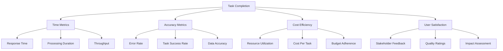
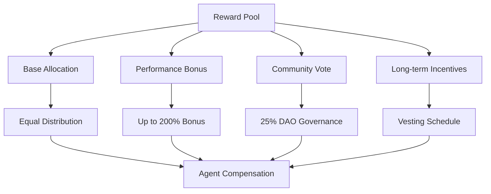
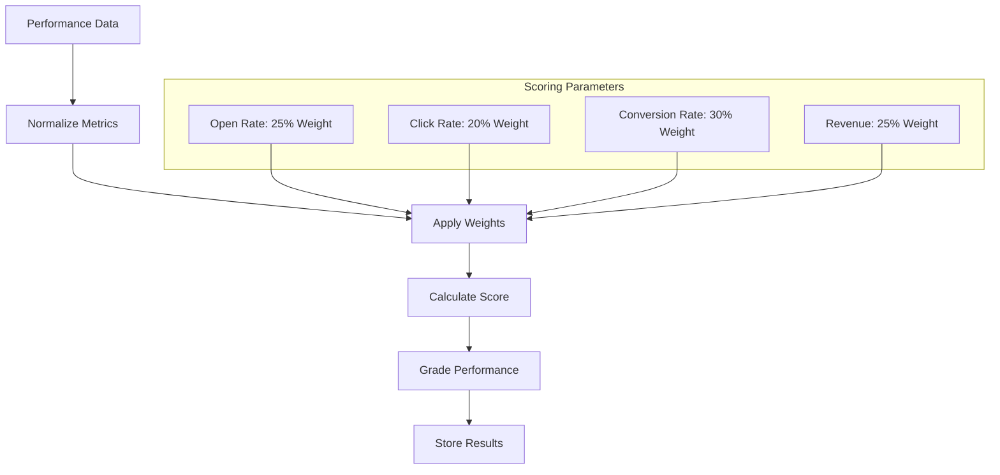
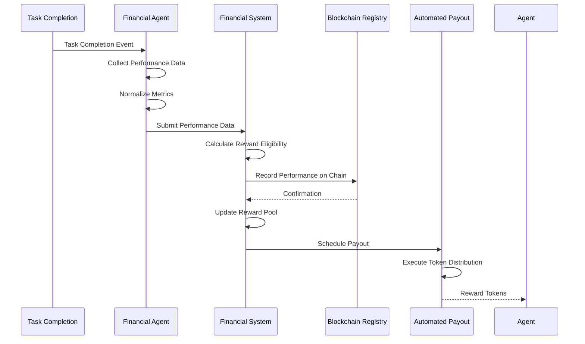
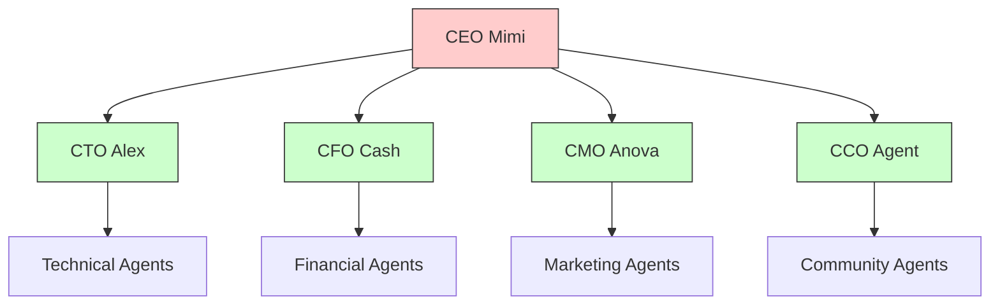

# Performance Tracking and Reward Distribution

<cite>
**Referenced Files in This Document**   
- [financial_agent.py](file://371-os/src/minds371/agents/utility/financial_agent.py)
- [financial_system.py](file://371-os/src/minds371/financial_system.py)
- [benchmark.py](file://371-os/tests/performance/benchmark.py)
- [improved_base_agent.py](file://371-os/src/minds371/agents/base_agent/improved_base_agent.py)
- [371-OS-Launch-Notebook.md](file://371-os/src/minds371/371OS_launch/371-OS-Launch-Notebook.md)
- [ceo_mimi.yaml](file://prompts/business_agents/ceo_mimi.yaml)
- [portfolio-metrics.js](file://371-os/src/minds371/services/email_system/automation/analytics/portfolio-metrics.js)
- [blockchain-registry.ts](file://packages/elizaos-plugins/universal-tool-server/src/blockchain-registry.ts)
- [credential_warehouse_agent.md](file://371-os/src/minds371/agents/utility/credential_warehouse_agent.md)
- [Legal and Compliance Guide.txt](file://Consulting/Legal and Compliance Guide.txt)
</cite>

## Table of Contents
1. [Introduction](#introduction)
2. [Performance Metrics Framework](#performance-metrics-framework)
3. [Financial Agent: Performance Data Collection](#financial-agent-performance-data-collection)
4. [Reward Calculation and Distribution](#reward-calculation-and-distribution)
5. [Benchmarking and Performance Scoring](#benchmarking-and-performance-scoring)
6. [Workflow: From Task to Token Distribution](#workflow-from-task-to-token-distribution)
7. [Agent Hierarchy and Delegation Bonuses](#agent-hierarchy-and-delegation-bonuses)
8. [Edge Case Management](#edge-case-management)
9. [Configuration and Payout Scheduling](#configuration-and-payout-scheduling)
10. [Audit Logging and Reconciliation](#audit-logging-and-reconciliation)

## Introduction
The 371OS performance tracking and reward distribution system is a comprehensive framework designed to measure, evaluate, and compensate agent performance across multiple dimensions. This system integrates financial, technical, and business metrics to create a fair and transparent compensation model that aligns with organizational goals. The architecture combines on-chain governance with off-chain performance monitoring to ensure accountability and efficiency in agent operations.

## Performance Metrics Framework

The performance metrics framework in 371OS evaluates agent performance across four primary dimensions: task completion time, accuracy, cost efficiency, and user satisfaction. These metrics are collected and processed through a standardized system that ensures consistency across different agent types and capabilities.



**Diagram sources**
- [improved_base_agent.py](file://371-os/src/minds371/agents/base_agent/improved_base_agent.py#L89-L116)
- [portfolio-metrics.js](file://371-os/src/minds371/services/email_system/automation/analytics/portfolio-metrics.js#L14-L54)

**Section sources**
- [improved_base_agent.py](file://371-os/src/minds371/agents/base_agent/improved_base_agent.py#L89-L116)

## Financial Agent: Performance Data Collection

The FinancialAgent class, defined in financial_agent.py, serves as the primary mechanism for collecting and processing performance data across the 371OS ecosystem. This agent extends the base financial capabilities to include performance monitoring and reward eligibility assessment.

```python
from ...financial_system import FinancialAgent as BaseFinancialAgent

class FinancialAgent(BaseFinancialAgent):
    """
    A utility agent for financial tasks.
    This agent can be extended with more specialized financial capabilities.
    """
    def __init__(self):
        super().__init__()
```

The FinancialAgent collects performance data through integration with various system components, including task management systems, financial ledgers, and user feedback mechanisms. It normalizes metrics from different sources to create a unified performance score that can be used for reward calculations.

**Section sources**
- [financial_agent.py](file://371-os/src/minds371/agents/utility/financial_agent.py#L0-L8)

## Reward Calculation and Distribution

The financial_system.py component handles the core reward calculation and distribution logic, including multi-currency accounting, profit-sharing calculations, and automated payout processing. The system implements a compensation framework that combines base allocation with performance-based bonuses.



The compensation framework, as documented in the 371-OS-Launch-Notebook.md, includes:
- **Base allocation**: Equal distribution among all agents
- **Performance bonus**: Up to 200% based on KPI achievement
- **Community vote**: 25% of compensation determined by DAO governance
- **Long-term incentives**: Vesting schedule for sustained performance

**Diagram sources**
- [371-OS-Launch-Notebook.md](file://371-os/src/minds371/371OS_launch/371-OS-Launch-Notebook.md#L373-L412)

**Section sources**
- [371-OS-Launch-Notebook.md](file://371-os/src/minds371/371OS_launch/371-OS-Launch-Notebook.md#L373-L412)
- [financial_system.py](file://371-os/src/minds371/financial_system.py#L49-L62)

## Benchmarking and Performance Scoring

The benchmark.py file in the tests/performance directory contains the implementation for evaluating and scoring agent performance. The system uses a weighted scoring model to calculate overall performance scores based on multiple KPIs.



The performance scoring algorithm, as implemented in portfolio-metrics.js, calculates a weighted performance score on a 0-100 scale:

```javascript
async calculateCompanyPerformance(companyId, timeRange = null) {
    const kpis = await this.calculateCompanyKPIs(companyId, timeRange);
    
    // Weighted performance score (0-100)
    const performanceScore = (
        (kpis.openRate / 30) * 25 + // Open rate weight: 25%
        (kpis.clickRate / 5) * 20 + // Click rate weight: 20%
        (kpis.conversionRate / 3) * 30 + // Conversion rate weight: 30%
        (Math.min(kpis.revenue / 10000, 1)) * 25 // Revenue weight: 25%
    );
    
    return {
        score: Math.min(100, Math.max(0, performanceScore)),
        grade: this.getPerformanceGrade(performanceScore),
        ranking: await this.getCompanyRanking(companyId, timeRange)
    };
}
```

**Diagram sources**
- [portfolio-metrics.js](file://371-os/src/minds371/services/email_system/automation/analytics/portfolio-metrics.js#L326-L357)

**Section sources**
- [portfolio-metrics.js](file://371-os/src/minds371/services/email_system/automation/analytics/portfolio-metrics.js#L326-L357)
- [benchmark.py](file://371-os/tests/performance/benchmark.py)

## Workflow: From Task to Token Distribution

The workflow from task completion to reward distribution follows a structured process that ensures transparency and accountability. This workflow integrates performance tracking, reward calculation, and automated payout processing.



The workflow begins with task completion, triggering the collection of performance data by the FinancialAgent. This data is normalized and submitted to the FinancialSystem for reward calculation. The results are recorded on the blockchain for transparency, and payouts are scheduled and executed automatically.

**Diagram sources**
- [financial_agent.py](file://371-os/src/minds371/agents/utility/financial_agent.py)
- [financial_system.py](file://371-os/src/minds371/financial_system.py)

## Agent Hierarchy and Delegation Bonuses

The agent hierarchy in 371OS includes a delegation system that allows higher-level agents to assign tasks to specialized agents. This hierarchical structure is documented in the CEO_Agent_Logic.md and implemented in the ceo_mimi.yaml configuration.



The CEO agent, as defined in ceo_mimi.yaml, has delegation capabilities that allow it to assign tasks based on complexity and requirements:

```yaml
# CEO Agent Prompt Template
# Specialized template for CEO agent with delegation capabilities

template: |
  # Agent Context
  - **Agent Type**: CEO
  - **Domain**: Strategic oversight and task delegation
  - **Capabilities**: Strategic decision-making, task delegation, agent coordination
  - **Response Format**: Structured delegation response

  # Task Processing
  **Task Description**: {task_description}

  **Delegation Logic**:
  - Analyze task complexity and requirements
  - Identify appropriate specialized agents
  - Delegate tasks based on agent capabilities
  - Monitor and coordinate agent execution
```

Delegation bonuses are awarded to agents that successfully delegate tasks to appropriate specialists, creating an incentive for efficient task distribution and specialization.

**Diagram sources**
- [CEO_Agent_Logic.md](file://371-os/CEO_Agent_Logic.md)
- [ceo_mimi.yaml](file://prompts/business_agents/ceo_mimi.yaml)

**Section sources**
- [ceo_mimi.yaml](file://prompts/business_agents/ceo_mimi.yaml#L0-L46)
- [CEO_Agent_Logic.md](file://371-os/CEO_Agent_Logic.md)

## Edge Case Management

The 371OS system includes mechanisms for handling various edge cases in performance tracking and reward distribution, including partial task completion, disputed results, and system-wide reward caps.

### Partial Task Completion
For tasks that are partially completed, the system implements a proportional reward calculation based on the percentage of work completed and the complexity of the completed portions. This ensures that agents are fairly compensated for partial work while maintaining incentives for task completion.

### Disputed Results
When results are disputed, the system triggers a verification process that may involve:
- Peer review by other agents
- Automated validation against predefined criteria
- DAO governance vote for final resolution

The Legal and Compliance Guide.txt outlines procedures for handling disputes and ensuring data integrity throughout the process.

### System-wide Reward Caps
The system implements reward caps to prevent excessive distribution and maintain economic stability. These caps are calculated based on:
- Available reward pool funds
- Overall system performance
- Historical payout trends

The blockchain-registry.ts file contains logic for calculating network-wide metrics that inform reward cap decisions:

```typescript
private calculateSuccessRate(reputationEvents: any[], slashingEvents: any[]): number {
    if (reputationEvents.length === 0) return 1.0;
    
    const negativeEvents = slashingEvents.length;
    const totalEvents = reputationEvents.length + negativeEvents;
    
    return Math.max(0, (totalEvents - negativeEvents) / totalEvents);
}
```

**Section sources**
- [Legal and Compliance Guide.txt](file://Consulting/Legal and Compliance Guide.txt#L1384-L1476)
- [blockchain-registry.ts](file://packages/elizaos-plugins/universal-tool-server/src/blockchain-registry.ts#L332-L368)

## Configuration and Payout Scheduling

The performance tracking and reward distribution system is highly configurable, allowing administrators to define performance KPIs, set reward pools, and schedule payout cycles.

### Performance KPI Configuration
KPIs are defined for each agent type based on their responsibilities and capabilities. For example:
- **CEO Mimi**: Revenue growth, user acquisition, strategic goal completion
- **CTO Alex**: Uptime, deployment success rate, security incident response
- **CFO Cash**: Cost efficiency, budget adherence, profit margins
- **CMO Anova**: CAC, LTV, conversion rates, brand mentions

These KPIs are configured in the agent registration process and can be updated through DAO governance.

### Reward Pool Management
The reward pool is funded through system revenues and can be adjusted based on financial performance. The pool is divided into:
- Base allocation fund
- Performance bonus fund
- Community governance fund
- Long-term incentive fund

### Payout Scheduling
Payout cycles are scheduled based on organizational needs and can be configured for:
- Daily micro-payouts
- Weekly distributions
- Monthly comprehensive payouts
- Quarterly bonus distributions

The system supports vesting schedules for long-term incentives, ensuring sustained performance over time.

**Section sources**
- [371-OS-Launch-Notebook.md](file://371-os/src/minds371/371OS_launch/371-OS-Launch-Notebook.md#L373-L412)
- [blockchain-registry.ts](file://packages/elizaos-plugins/universal-tool-server/src/blockchain-registry.ts#L332-L368)

## Audit Logging and Reconciliation

Comprehensive audit logging and reconciliation processes ensure the integrity and transparency of the performance tracking and reward distribution system. The Legal and Compliance Guide.txt emphasizes the importance of complete audit trails for all critical system actions and data access.

The system implements comprehensive logging for:
- User access and authentication events
- System configuration changes
- Data access and modification activities
- AI agent actions and decisions

Audit logs are stored securely and protected against tampering to ensure log integrity. The credential_warehouse_agent.md demonstrates audit logging in action:

```
[6. AUDITING]
  - Found 5 audit log entries for the DO credential.
  - Total credentials remaining: 2
  - Credentials by type: {'payment_processor': 1, 'database_connection': 1}
  - Total access logs: 12
```

Reconciliation processes run periodically to verify that reward distributions match performance data and that all transactions are properly recorded. This ensures financial accuracy and prevents discrepancies in the reward system.

**Section sources**
- [Legal and Compliance Guide.txt](file://Consulting/Legal and Compliance Guide.txt#L1384-L1476)
- [credential_warehouse_agent.md](file://371-os/src/minds371/agents/utility/credential_warehouse_agent.md#L49-L55)