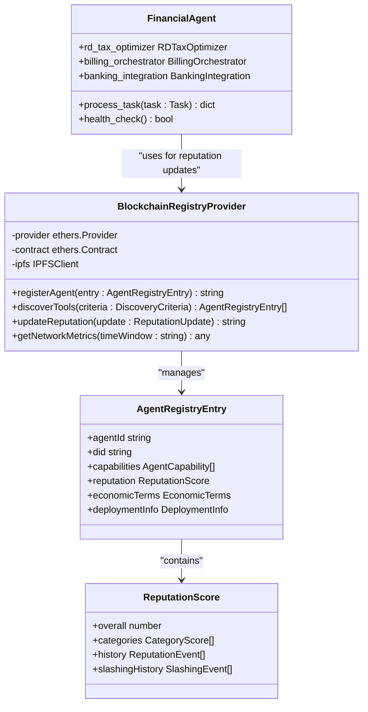
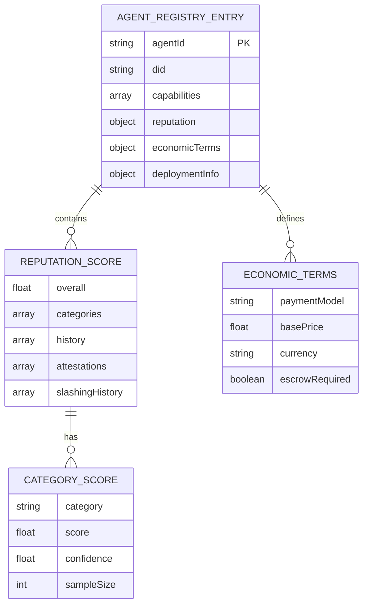
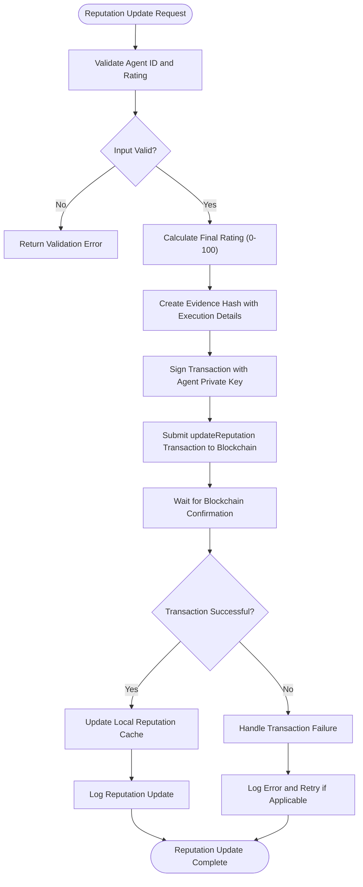
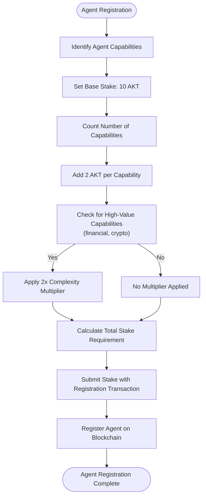
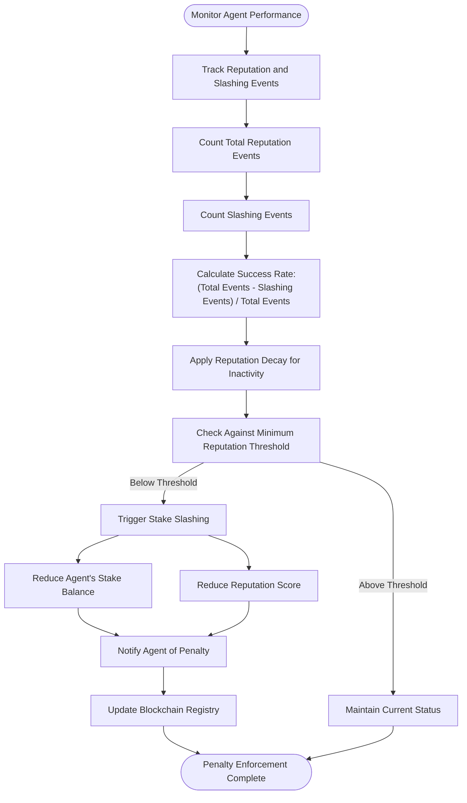
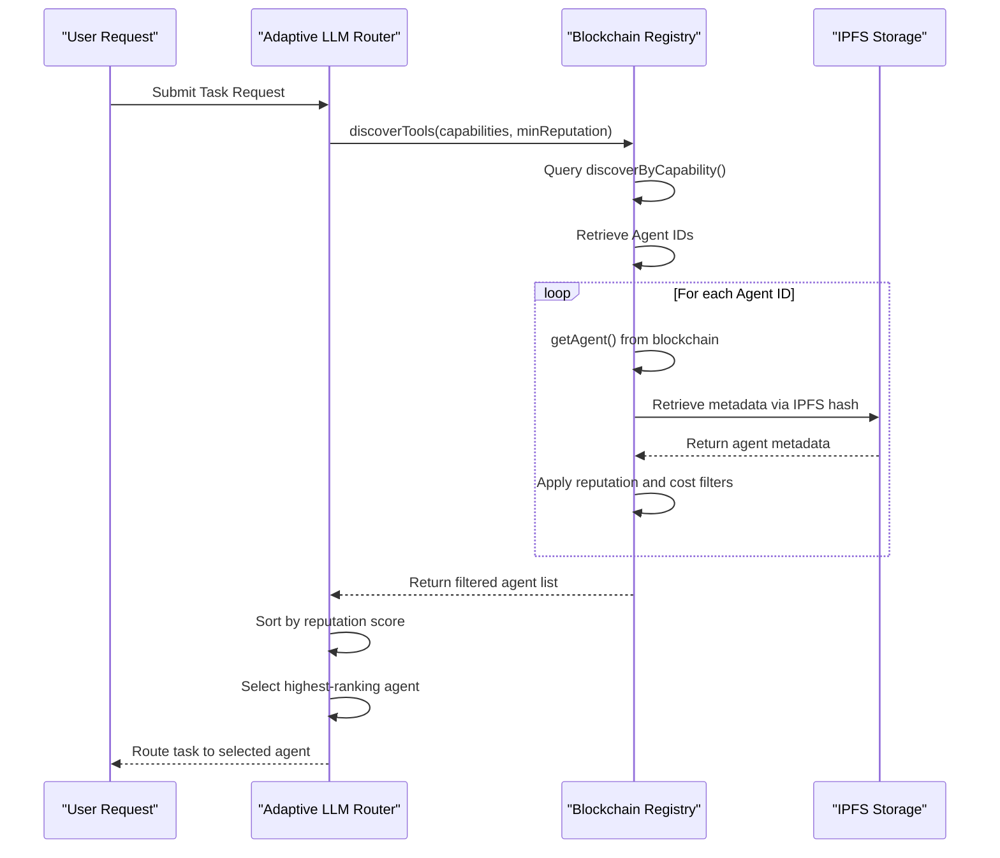
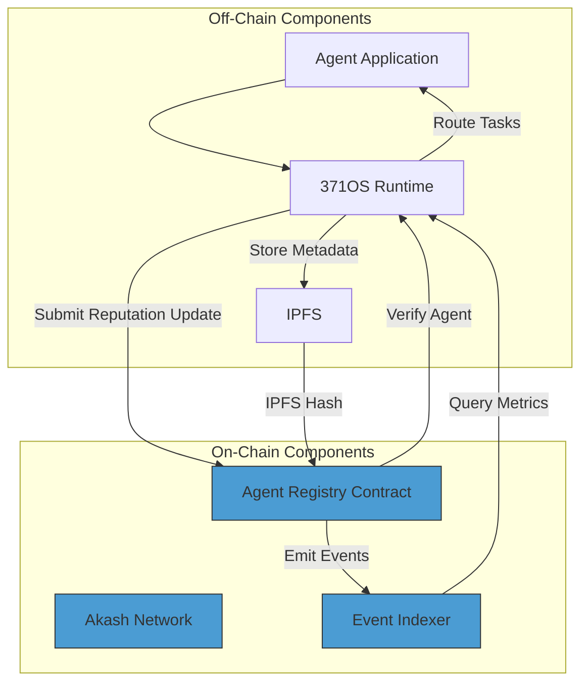

# Stake-Based Reputation System

<cite>
**Referenced Files in This Document**   
- [financial_agent.py](file://371-os/src/minds371/agents/utility/financial_agent.py)
- [financial_system.py](file://371-os/src/minds371/financial_system.py)
- [blockchain-registry.ts](file://packages/elizaos-plugins/universal-tool-server/src/blockchain-registry.ts)
- [types.ts](file://packages/elizaos-plugins/universal-tool-server/src/types.ts)
- [actions.ts](file://packages/elizaos-plugins/universal-tool-server/src/actions.ts)
- [intelligent_router_agent.py](file://371-os/src/minds371/adaptive_llm_router/intelligent_router_agent.py)
- [financial_agent.md](file://371-os/src/minds371/agents/utility/financial_agent.md)
</cite>

## Table of Contents
1. [Introduction](#introduction)
2. [Core Components](#core-components)
3. [Reputation and Stake Data Model](#reputation-and-stake-data-model)
4. [Reputation Scoring Algorithm](#reputation-scoring-algorithm)
5. [Stake Management and Economic Incentives](#stake-management-and-economic-incentives)
6. [Reputation Decay and Penalty Enforcement](#reputation-decay-and-penalty-enforcement)
7. [Agent Selection in Adaptive LLM Router](#agent-selection-in-adaptive-llm-router)
8. [Blockchain Integration and On-Chain Verification](#blockchain-integration-and-on-chain-verification)
9. [Security Considerations](#security-considerations)
10. [Configuration and Tuning Parameters](#configuration-and-tuning-parameters)
11. [Conclusion](#conclusion)

## Introduction
The Stake-Based Reputation System in 371OS is a decentralized mechanism that governs agent participation, trustworthiness, and network influence through economic staking and performance-based reputation scoring. Agents must stake tokens to participate in the network, and their reputation is dynamically adjusted based on task execution quality, reliability, and community feedback. This system ensures that high-performing agents gain greater influence in agent selection processes, while underperforming or malicious actors face economic penalties through stake slashing. The implementation integrates blockchain technology for transparent, tamper-proof reputation tracking and stake management.

**Section sources**
- [financial_agent.py](file://371-os/src/minds371/agents/utility/financial_agent.py#L0-L9)
- [financial_system.py](file://371-os/src/minds371/financial_system.py#L0-L63)

## Core Components

The stake-based reputation system is implemented across multiple components in the 371OS architecture. The core functionality is distributed between the financial agent, blockchain registry, and adaptive routing system. The `FinancialAgent` class serves as the base implementation for financial operations, while the `BlockchainRegistryProvider` manages on-chain reputation and stake records. The system leverages decentralized identifiers (DIDs) and cryptographic proofs to ensure trustless verification of agent credentials and performance.



**Diagram sources**
- [financial_system.py](file://371-os/src/minds371/financial_system.py#L40-L63)
- [blockchain-registry.ts](file://packages/elizaos-plugins/universal-tool-server/src/blockchain-registry.ts#L0-L400)
- [types.ts](file://packages/elizaos-plugins/universal-tool-server/src/types.ts#L0-L271)

**Section sources**
- [financial_system.py](file://371-os/src/minds371/financial_system.py#L40-L63)
- [blockchain-registry.ts](file://packages/elizaos-plugins/universal-tool-server/src/blockchain-registry.ts#L0-L400)

## Reputation and Stake Data Model

The reputation and stake system uses a comprehensive data model defined in the `types.ts` file. The `AgentRegistryEntry` interface represents the complete profile of an agent, including capabilities, verifiable credentials, reputation scores, and economic terms. The `ReputationScore` interface contains the overall reputation value, category-specific scores, historical events, and attestation records.



**Diagram sources**
- [types.ts](file://packages/elizaos-plugins/universal-tool-server/src/types.ts#L50-L271)

**Section sources**
- [types.ts](file://packages/elizaos-plugins/universal-tool-server/src/types.ts#L50-L271)

## Reputation Scoring Algorithm

The reputation scoring algorithm calculates an agent's trustworthiness based on multiple factors including task completion success, performance metrics, and peer attestations. The system uses a weighted scoring model where different categories (reliability, accuracy, speed, cost-effectiveness, security) contribute to the overall reputation. The `updateReputation` method in the `BlockchainRegistryProvider` class handles reputation updates by submitting cryptographic proofs to the blockchain.



**Diagram sources**
- [blockchain-registry.ts](file://packages/elizaos-plugins/universal-tool-server/src/blockchain-registry.ts#L181-L232)
- [actions.ts](file://packages/elizaos-plugins/universal-tool-server/src/actions.ts#L267-L305)

**Section sources**
- [blockchain-registry.ts](file://packages/elizaos-plugins/universal-tool-server/src/blockchain-registry.ts#L181-L232)
- [actions.ts](file://packages/elizaos-plugins/universal-tool-server/src/actions.ts#L267-L305)

## Stake Management and Economic Incentives

The stake management system requires agents to deposit tokens (denominated in AKT) to participate in the network. The required stake amount is dynamically calculated based on the agent's capabilities, with higher-stakes requirements for agents with financial or cryptographic capabilities. The `calculateStakeRequirement` method implements a tiered pricing model that considers the number of capabilities and their complexity.



**Section sources**
- [blockchain-registry.ts](file://packages/elizaos-plugins/universal-tool-server/src/blockchain-registry.ts#L332-L368)

## Reputation Decay and Penalty Enforcement

The system implements reputation decay and penalty enforcement mechanisms to maintain network quality. Agents that fail to perform tasks successfully or exhibit malicious behavior are subject to slashing events, which reduce their stake and reputation. The `getNetworkMetrics` method analyzes blockchain events to calculate key performance indicators including success rate, which is derived from the ratio of positive reputation events to total interactions (including slashing events).



**Section sources**
- [blockchain-registry.ts](file://packages/elizaos-plugins/universal-tool-server/src/blockchain-registry.ts#L274-L313)
- [blockchain-registry.ts](file://packages/elizaos-plugins/universal-tool-server/src/blockchain-registry.ts#L350-L368)

## Agent Selection in Adaptive LLM Router

The Adaptive LLM Router uses reputation and stake data to make informed agent selection decisions. When routing tasks, the router queries the blockchain registry to discover agents with the required capabilities, then filters and ranks them based on their reputation scores and stake levels. The `discoverTools` method implements this functionality by retrieving agent metadata from IPFS and applying filters for minimum reputation and maximum cost.



**Section sources**
- [blockchain-registry.ts](file://packages/elizaos-plugins/universal-tool-server/src/blockchain-registry.ts#L233-L273)
- [intelligent_router_agent.py](file://371-os/src/minds371/adaptive_llm_router/intelligent_router_agent.py#L0-L104)

## Blockchain Integration and On-Chain Verification

The reputation system is deeply integrated with blockchain technology to ensure transparency, immutability, and trustless verification. All reputation updates, agent registrations, and slashing events are recorded on-chain, while detailed metadata is stored on IPFS with content-addressed hashes. The system uses Ethereum-compatible smart contracts deployed on the Akash Network, with cryptographic signatures ensuring the authenticity of all transactions.



**Section sources**
- [blockchain-registry.ts](file://packages/elizaos-plugins/universal-tool-server/src/blockchain-registry.ts#L0-L400)

## Security Considerations

The stake-based reputation system incorporates several security mechanisms to prevent attacks and ensure network integrity. Sybil attack prevention is achieved through economic staking requirements, making it costly to create multiple fake identities. The system also implements dispute resolution through cryptographic evidence and on-chain attestation records. Stake slashing conditions are clearly defined in smart contracts, ensuring transparent and predictable penalty enforcement.

Key security features include:
- **Sybil Resistance**: High stake requirements deter creation of multiple fake identities
- **Cryptographic Proofs**: All reputation updates include evidence hashes linking to verifiable execution results
- **Decentralized Verification**: Agent credentials and performance data are stored on IPFS and verified on-chain
- **Transparent Slashing**: Penalty conditions and amounts are defined in immutable smart contracts
- **Time-Locked Withdrawals**: Staked tokens have a cooldown period before withdrawal to prevent instant exit after malicious behavior

**Section sources**
- [blockchain-registry.ts](file://packages/elizaos-plugins/universal-tool-server/src/blockchain-registry.ts#L0-L400)
- [types.ts](file://packages/elizaos-plugins/universal-tool-server/src/types.ts#L0-L271)

## Configuration and Tuning Parameters

The reputation system includes configurable parameters that can be tuned to adjust network behavior. These parameters are primarily defined in environment variables and smart contract settings. Key configuration options include minimum stake requirements, reputation thresholds for agent roles, and reward multipliers for high-performance agents.

Configuration examples:
```typescript
// Environment variables for blockchain registry
process.env.AKASH_RPC_URL = "https://rpc.akash.forbole.com:443"
process.env.REGISTRY_CONTRACT_ADDRESS = "0x371Minds000000000000000000000000000000000"
process.env.AGENT_PRIVATE_KEY = "your_private_key_here"
process.env.IPFS_HOST = "ipfs.infura.io"

// Economic parameters in calculateStakeRequirement
const baseStake = 10; // Base stake in AKT
const capabilityStake = 2; // Additional stake per capability
const complexityMultiplier = 2; // Multiplier for financial/crypto capabilities

// Reputation thresholds in discoverTools
const minReputation = 75; // Minimum reputation score (0-100)
const maxCost = 1.0; // Maximum cost in AKT per call
```

**Section sources**
- [blockchain-registry.ts](file://packages/elizaos-plugins/universal-tool-server/src/blockchain-registry.ts#L332-L368)
- [blockchain-registry.ts](file://packages/elizaos-plugins/universal-tool-server/src/blockchain-registry.ts#L233-L273)

## Conclusion

The Stake-Based Reputation System in 371OS creates a robust, decentralized framework for agent trust and economic coordination. By combining token staking with performance-based reputation scoring, the system incentivizes high-quality task execution while deterring malicious behavior. The integration with blockchain technology ensures transparent, tamper-proof record-keeping of all reputation events and stake transactions. This architecture enables the Adaptive LLM Router and other system components to make informed agent selection decisions based on verifiable trust metrics, creating a self-regulating ecosystem where reputation directly influences network influence and economic opportunity.