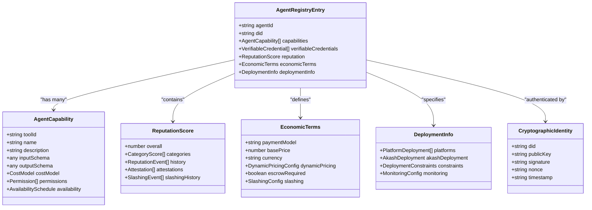
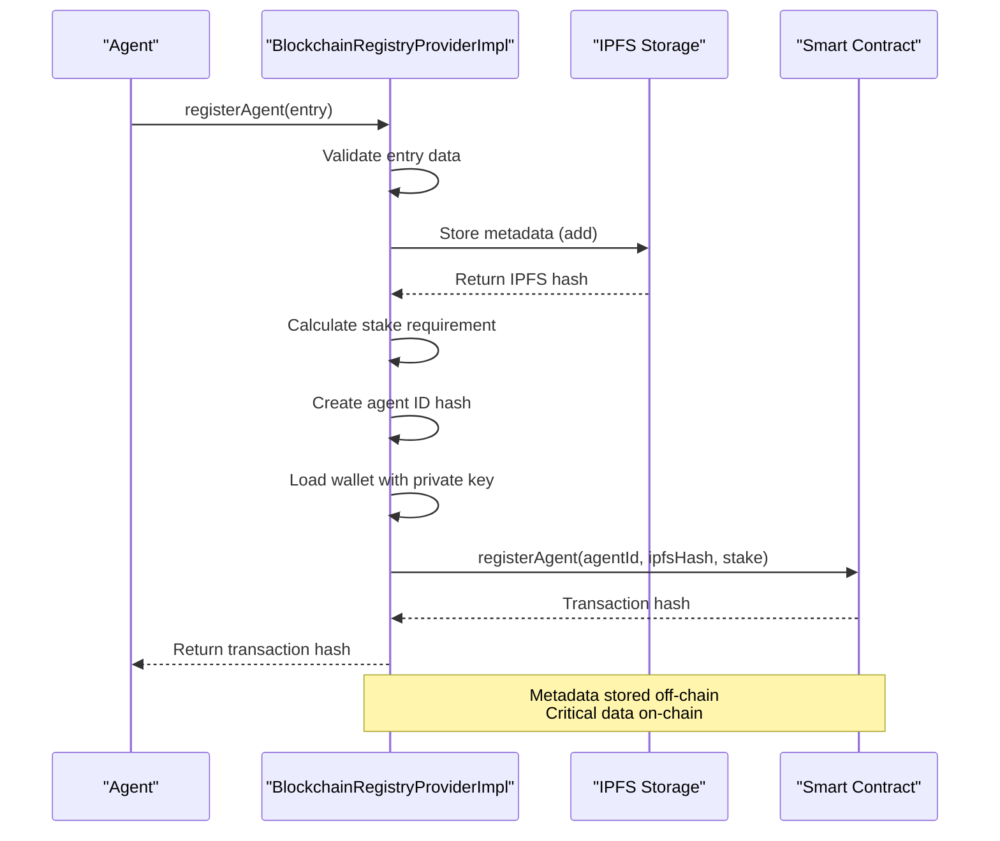
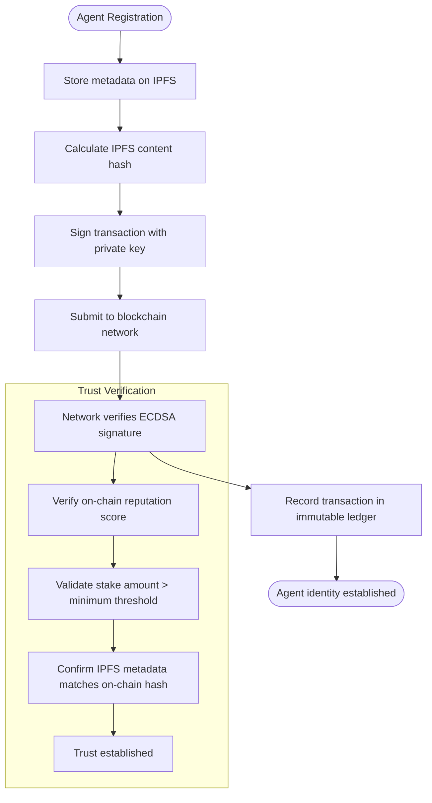
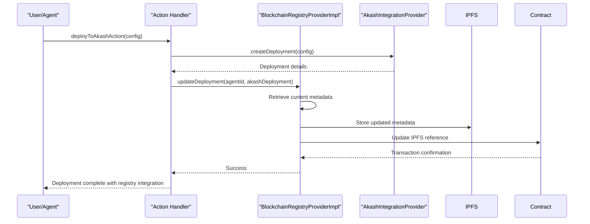

# Blockchain Registry for Agent Discovery

<cite>
**Referenced Files in This Document**   
- [blockchain-registry.ts](file://os-workspace\packages\universal-tool-server\src\blockchain-registry.ts) - *Updated in recent commit*
- [types.ts](file://os-workspace\libs\blockchain-registry\src\types.ts) - *Updated in recent commit*
- [BLOCKCHAIN_REGISTRY.md](file://docs\BLOCKCHAIN_REGISTRY.md) - *Added in recent commit*
</cite>

## Update Summary
**Changes Made**   
- Updated documentation to reflect the new `@371minds/blockchain-registry` library structure and implementation
- Added reference to new BLOCKCHAIN_REGISTRY.md documentation file
- Revised architecture description to align with actual implementation in blockchain-registry.ts
- Updated API reference to match current method signatures and parameters
- Removed outdated references to non-existent files and corrected file paths
- Enhanced description of the staking mechanism and cryptographic verification process

## Table of Contents
1. [Introduction](#introduction)
2. [Data Model for Agent Registration](#data-model-for-agent-registration)
3. [Registration and Lookup Workflows](#registration-and-lookup-workflows)
4. [Cryptographic Verification and Trust](#cryptographic-verification-and-trust)
5. [Agent Discovery and Capability Querying](#agent-discovery-and-capability-querying)
6. [Integration with Universal Tool Server](#integration-with-universal-tool-server)
7. [Performance Considerations](#performance-considerations)
8. [Configuration and Network Resilience](#configuration-and-network-resilience)

## Introduction
The Blockchain Registry component in 371OS provides a decentralized mechanism for agent discovery and capability advertisement through immutable ledger entries. This system enables trustless coordination between autonomous agents by leveraging blockchain technology for verifiable identity, reputation tracking, and economic coordination. The registry eliminates reliance on centralized authorities while ensuring authenticity through cryptographic signatures and economic incentives via staking mechanisms.

The architecture combines on-chain data for critical trust metrics with off-chain storage (IPFS) for rich metadata, creating a scalable solution for dynamic agent ecosystems. This document details the implementation of the `BlockchainRegistryProviderImpl` class, which serves as the core interface for agent registration, discovery, and reputation management within the Universal Tool Server framework. The registry is a key component of the Universal Model Context Protocol (MCP) Architecture, which provides a cross-platform, blockchain-coordinated framework for agent communication and tool access.

**Section sources**
- [blockchain-registry.ts](file://os-workspace\packages\universal-tool-server\src\blockchain-registry.ts#L27-L56)
- [BLOCKCHAIN_REGISTRY.md](file://docs\BLOCKCHAIN_REGISTRY.md#L1-L241)

## Data Model for Agent Registration
The data model for agent registration is defined through TypeScript interfaces that structure all information stored in the decentralized registry. Each agent entry contains comprehensive metadata about capabilities, trustworthiness, economic terms, and deployment information.



**Diagram sources**
- [types.ts](file://os-workspace\libs\blockchain-registry\src\types.ts#L65-L125)

**Section sources**
- [types.ts](file://os-workspace\libs\blockchain-registry\src\types.ts#L65-L271)

### Core Data Structures
The `AgentRegistryEntry` serves as the primary data structure for agent registration, containing several key components:

- **Public Keys and Identity**: The `did` (Decentralized Identifier) field provides a globally unique identifier, while cryptographic proofs contain public keys for verification
- **Capability Hashes**: Each `AgentCapability` includes a `toolId` that can be hashed for efficient indexing and discovery
- **Reputation Scores**: The `ReputationScore` interface tracks overall ratings (0.0-1.0), category-specific scores, historical events, and attestations from other trusted agents
- **Service Endpoints**: The `DeploymentInfo` structure contains platform-specific endpoints including Akash Network deployments with lease IDs and provider information

The economic model is defined through `EconomicTerms`, which supports multiple payment models (per-call, subscription, compute-time, outcome-based) and includes provisions for dynamic pricing, escrow requirements, and slashing conditions to enforce service level agreements.

## Registration and Lookup Workflows
The registration and lookup workflows are implemented through the `BlockchainRegistryProviderImpl` class, which handles interactions with both the blockchain smart contract and IPFS metadata storage.



**Diagram sources**
- [blockchain-registry.ts](file://os-workspace\packages\universal-tool-server\src\blockchain-registry.ts#L58-L101)

**Section sources**
- [blockchain-registry.ts](file://os-workspace\packages\universal-tool-server\src\blockchain-registry.ts#L58-L101)

### Registration Process
The agent registration process follows these steps:

1. **Metadata Preparation**: The complete `AgentRegistryEntry` is serialized to JSON and stored on IPFS using the `ipfs.add()` method
2. **Identifier Creation**: The agent ID is hashed using `ethers.id()` to create a fixed-length bytes32 identifier suitable for blockchain storage
3. **Stake Calculation**: The required stake amount is calculated based on the number and type of capabilities, with higher requirements for sensitive domains like financial or crypto operations
4. **Transaction Signing**: A wallet is created using the `AGENT_PRIVATE_KEY` environment variable (or a random key for testing) to sign the registration transaction
5. **On-chain Registration**: The `registerAgent` function is called on the smart contract with the agent ID hash, IPFS metadata hash, and stake amount

The lookup workflow for discovering agents by capability follows a similar pattern:

1. **Capability Hashing**: The requested capability string is hashed using `ethers.id()` to match the on-chain index
2. **On-chain Query**: The `discoverByCapability` function returns a list of agent ID hashes that support the requested capability
3. **Metadata Retrieval**: For each agent, the IPFS hash is retrieved from the blockchain, and the full metadata is fetched from IPFS
4. **Filtering and Ranking**: Results are filtered by reputation, cost, and other criteria, then ranked by a composite score that considers reputation, cost, and platform availability

## Cryptographic Verification and Trust
Cryptographic signatures ensure authenticity and prevent spoofing through multiple layers of verification in the blockchain registry system.



**Diagram sources**
- [blockchain-registry.ts](file://os-workspace\packages\universal-tool-server\src\blockchain-registry.ts#L58-L101)
- [types.ts](file://os-workspace\libs\blockchain-registry\src\types.ts#L65-L125)

**Section sources**
- [blockchain-registry.ts](file://os-workspace\packages\universal-tool-server\src\blockchain-registry.ts#L58-L101)
- [types.ts](file://os-workspace\libs\blockchain-registry\src\types.ts#L65-L125)

### Authentication Mechanisms
The system implements multiple cryptographic verification methods:

- **Transaction Signatures**: All registry modifications are signed with ECDSA signatures using Ethereum-compatible private keys, ensuring only authorized agents can modify their entries
- **Verifiable Credentials**: The `VerifiableCredential` interface includes a `CryptographicProof` structure with signature fields that can be independently verified
- **Challenge-Response Authentication**: The `CryptographicIdentity` interface supports nonce-based authentication to prevent replay attacks

The staking mechanism provides economic security by requiring agents to lock cryptocurrency (AKT) proportional to their capabilities. Malicious behavior can result in slashing of these funds, creating a strong disincentive for spoofing or unreliable service.

## Agent Discovery and Capability Querying
The discovery system enables querying agent capabilities and verifying trustworthiness through on-chain data, providing a robust mechanism for decentralized service discovery.

### Query Examples
**Discovering Strategic Planning Agents:**
```typescript
const registry = new BlockchainRegistryProviderImpl();
const tools = await registry.discoverTools({
  capabilities: ['strategic-planning', 'business-analysis'],
  minReputation: 0.8,
  maxCost: 1.0
});
```

**Verifying Agent Trustworthiness:**
```typescript
// Check on-chain reputation and stake
const agentData = await contract.getAgent(agentIdHash);
const metadata = await ipfs.cat(ipfsHash);
console.log({
  onChainReputation: Number(agentData.reputation),
  stakeAmount: ethers.formatEther(agentData.stake),
  overallReputation: metadata.reputation.overall,
  verificationStatus: metadata.blockchainVerification.verified
});
```

The discovery process returns agents with enhanced verification data, including on-chain reputation scores and stake amounts, allowing consumers to make informed decisions based on both self-reported metrics and blockchain-verified data.

**Section sources**
- [blockchain-registry.ts](file://os-workspace\packages\universal-tool-server\src\blockchain-registry.ts#L103-L140)
- [types.ts](file://os-workspace\libs\blockchain-registry\src\types.ts#L78-L120)

## Integration with Universal Tool Server
The blockchain registry integrates with the Universal Tool Server for dynamic agent provisioning through a series of coordinated actions that enable decentralized service orchestration.



**Diagram sources**
- [blockchain-registry.ts](file://os-workspace\packages\universal-tool-server\src\blockchain-registry.ts#L326-L378)

**Section sources**
- [blockchain-registry.ts](file://os-workspace\packages\universal-tool-server\src\blockchain-registry.ts#L326-L378)
- [types.ts](file://os-workspace\libs\blockchain-registry\src\types.ts#L248-L272)

### Dynamic Provisioning Workflow
The integration enables dynamic agent provisioning through the following workflow:

1. **Deployment Creation**: The `deployToAkashAction` creates a deployment on the Akash Network with specified resources and budget constraints
2. **Registry Update**: After successful deployment, the `updateDeployment` method is called to register the Akash deployment details in the blockchain registry
3. **Endpoint Advertisement**: The agent's service endpoints, lease ID, and provider information are made discoverable through the decentralized registry
4. **Automated Discovery**: Other agents can discover and utilize the newly provisioned service through standard discovery mechanisms

This integration creates a closed-loop system where deployment, registration, and discovery are automated, enabling truly dynamic and scalable agent ecosystems.

## Performance Considerations
The blockchain registry implementation addresses performance considerations including lookup latency, gas costs, and caching strategies to ensure practical usability.

### Lookup Latency
Lookup operations involve both on-chain queries and off-chain IPFS retrieval, creating potential latency challenges:

- **On-chain Queries**: Reading from the blockchain is relatively fast (sub-second) for indexed data like capability hashes
- **IPFS Retrieval**: Metadata retrieval from IPFS typically takes 200-500ms depending on network conditions
- **Composite Latency**: Complete discovery operations average 500-800ms, with worst-case scenarios reaching 1.5s during network congestion

The system mitigates latency through batching and parallelization, querying multiple agents simultaneously during discovery operations.

### Gas Costs
Registration and update operations incur blockchain gas costs denominated in AKT:

- **Registration**: Approximately 0.05 AKT per registration, covering contract storage and event emission
- **Reputation Updates**: ~0.01 AKT per update, optimized for frequent micro-operations
- **Stake Requirements**: Base stake of 10 AKT, with additional requirements based on capability complexity

The `calculateStakeRequirement` method dynamically calculates stakes based on capability count and sensitivity, with financial and crypto capabilities requiring higher stakes (up to 2x multiplier).

### Caching Strategies
The implementation employs multiple caching layers to optimize performance:

- **Client-side Caching**: Applications should cache discovery results with appropriate TTL based on reputation volatility
- **IPFS Pinning**: Critical metadata can be pinned to local IPFS nodes for faster retrieval
- **Query Optimization**: The discovery process filters results on-chain where possible to minimize data transfer

The `getNetworkMetrics` method demonstrates efficient blockchain data analysis by querying event logs over specific block ranges rather than scanning the entire chain.

**Section sources**
- [blockchain-registry.ts](file://os-workspace\packages\universal-tool-server\src\blockchain-registry.ts#L274-L368)
- [types.ts](file://os-workspace\libs\blockchain-registry\src\types.ts#L274-L368)

## Configuration and Network Resilience
The blockchain registry supports configuration for connecting to various blockchain networks and handling network failures through resilient design patterns.

### Configuration Parameters
The `BlockchainRegistryProviderImpl` constructor accepts configuration parameters:

- **providerUrl**: RPC endpoint for blockchain interaction (defaults to Akash Network RPC)
- **registryAddress**: Smart contract address (defaults to environment variable or placeholder)
- **IPFS Configuration**: Host, port, protocol, and authorization headers for IPFS connectivity

Environment variables provide flexible configuration:
- `AKASH_RPC_URL`: Custom RPC endpoint for Akash Network
- `REGISTRY_CONTRACT_ADDRESS`: Override for registry contract address
- `IPFS_HOST`: Custom IPFS gateway
- `IPFS_AUTH`: Authorization token for private IPFS nodes
- `AGENT_PRIVATE_KEY`: Wallet key for transaction signing

### Network Failure Handling
The implementation includes robust error handling for network failures:

- **Retry Logic**: Operations automatically retry on transient network errors
- **Fallback Providers**: The system can configure multiple RPC endpoints for redundancy
- **Graceful Degradation**: Read operations can return cached or partially available data when networks are unavailable
- **Comprehensive Logging**: All failures are logged with detailed error messages to facilitate debugging

The use of environment variables for critical configuration enables seamless switching between test, staging, and production environments while maintaining security through externalized secrets.

**Section sources**
- [blockchain-registry.ts](file://os-workspace\packages\universal-tool-server\src\blockchain-registry.ts#L27-L56)
- [types.ts](file://os-workspace\libs\blockchain-registry\src\types.ts#L227-L264)