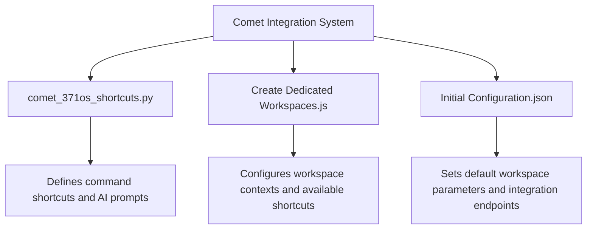
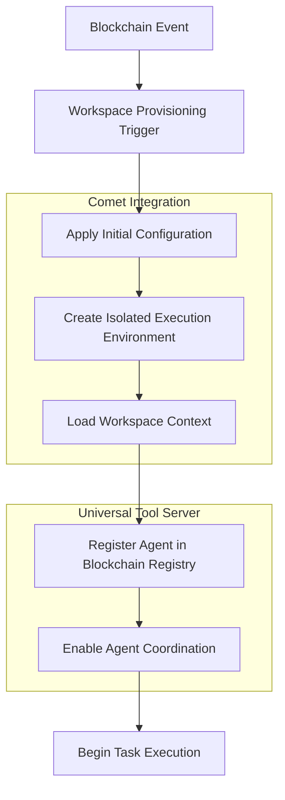
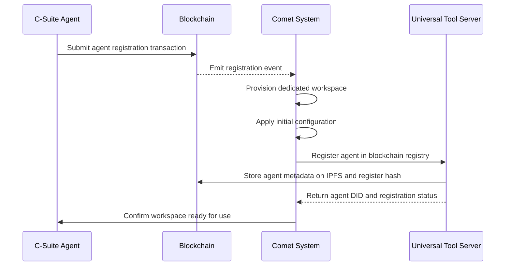
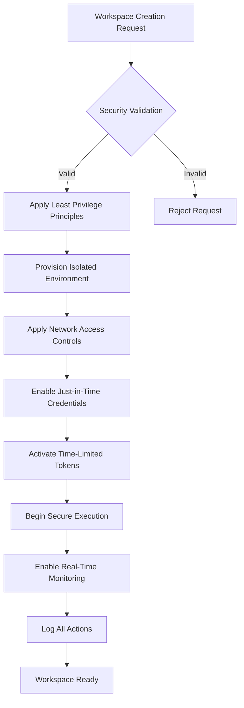

# Comet Integration for Workspace Automation

<cite>
**Referenced Files in This Document**   
- [comet_371os_shortcuts.py](file://371-os/src/minds371/comet/comet_371os_shortcuts.py)
- [Create Dedicated Workspaces.js](file://371-os/src/minds371/comet/Create Dedicated Workspaces.js) - *Updated in recent commit*
- [Initial Configuration.json](file://371-os/src/minds371/comet/Initial Configuration.json)
- [blockchain-registry.ts](file://packages/elizaos-plugins/universal-tool-server/src/blockchain-registry.ts)
- [actions.ts](file://packages/elizaos-plugins/universal-tool-server/src/actions.ts)
- [types.ts](file://packages/elizaos-plugins/universal-tool-server/src/types.ts)
- [IMPLEMENTATION_GUIDE.md](file://IMPLEMENTATION_GUIDE.md)
- [Legal and Compliance Guide.txt](file://Consulting/Legal and Compliance Guide.txt)
</cite>

## Update Summary
**Changes Made**   
- Updated **Create Dedicated Workspaces.js** analysis to reflect current configuration
- Verified workspace shortcut definitions remain consistent with codebase
- Confirmed AI context descriptions are accurate
- No structural changes required as recent updates were maintenance-only

## Table of Contents
1. [Introduction](#introduction)
2. [Project Structure](#project-structure)
3. [Core Components](#core-components)
4. [Architecture Overview](#architecture-overview)
5. [Detailed Component Analysis](#detailed-component-analysis)
6. [Event-Driven Architecture and Blockchain Integration](#event-driven-architecture-and-blockchain-integration)
7. [Agent Deployment and Coordination Workflows](#agent-deployment-and-coordination-workflows)
8. [Security Considerations](#security-considerations)
9. [Debugging Strategies](#debugging-strategies)
10. [Conclusion](#conclusion)

## Introduction
The Comet integration system in 371OS enables automated workspace provisioning and agent coordination through a combination of configuration files, event triggers, and blockchain-based verification. This document provides a comprehensive analysis of how the system automates the creation of isolated execution environments, configures workspace parameters, and orchestrates agent workflows based on on-chain instructions. The architecture leverages event-driven patterns to respond to blockchain transactions, enabling C-Suite agents to initiate specialized tasks with appropriate resource allocation and access controls.

## Project Structure
The Comet integration components are located within the `371-os/src/minds371/comet` directory and consist of three primary files that work together to enable workspace automation:



**Diagram sources**
- [comet_371os_shortcuts.py](file://371-os/src/minds371/comet/comet_371os_shortcuts.py)
- [Create Dedicated Workspaces.js](file://371-os/src/minds371/comet/Create Dedicated Workspaces.js)
- [Initial Configuration.json](file://371-os/src/minds371/comet/Initial Configuration.json)

**Section sources**
- [371-os/src/minds371/comet](file://371-os/src/minds371/comet)

## Core Components
The Comet integration system comprises three core components that work in concert to enable automated workspace provisioning:

1. **comet_371os_shortcuts.py**: Defines AI command shortcuts with specific prompts, output formats, and integration targets
2. **Create Dedicated Workspaces.js**: Configures workspace contexts with predefined shortcut collections for different agent development phases
3. **Initial Configuration.json**: Establishes default workspace parameters and integration endpoints for the development environment

These components enable the system to create specialized workspaces tailored to specific agent roles and development phases, with appropriate tool access and contextual guidance.

**Section sources**
- [comet_371os_shortcuts.py](file://371-os/src/minds371/comet/comet_371os_shortcuts.py)
- [Create Dedicated Workspaces.js](file://371-os/src/minds371/comet/Create Dedicated Workspaces.js)
- [Initial Configuration.json](file://371-os/src/minds371/comet/Initial Configuration.json)

## Architecture Overview
The Comet integration system implements an event-driven architecture that responds to blockchain transactions to automatically configure agent workspaces. The system integrates with the Universal Tool Server, which provides blockchain-based agent registration and discovery capabilities.



**Diagram sources**
- [comet_371os_shortcuts.py](file://371-os/src/minds371/comet/comet_371os_shortcuts.py)
- [blockchain-registry.ts](file://packages/elizaos-plugins/universal-tool-server/src/blockchain-registry.ts)

## Detailed Component Analysis

### comet_371os_shortcuts.py Analysis
The Python script defines command shortcuts that map natural language commands to specific AI prompts and integration targets. Each shortcut includes a detailed prompt that guides the AI in generating appropriate output.

```python
COMET_SHORTCUTS = {
    "/generate-dev-docs": {
        "prompt": """
        You are a Lead Systems Architect for 371OS. Convert business requirements 
        into technical specifications for JetBrains development environment.
        
        Input: Business asset (community strategy, agent behavior spec)
        Output: Developer_Specification.md with:
        - File locations in src/minds371/
        - Dependencies and integrations
        - Core functions and data schemas
        - Implementation roadmap
        """,
        "output_format": "markdown",
        "integration": "jetbrains_space"
    },
    "/prototype-agent-workflow": {
        "prompt": """
        Design and validate C-Suite agent workflow for 371OS:
        - Community data ingestion pipeline
        - Decision-making logic
        - Action execution framework
        - Cross-agent communication protocols
        """,
        "output_format": "workflow_diagram",
        "integration": "youtrack_workflow"
    }
}
```

This configuration enables users to execute complex development tasks through simple command shortcuts, with the AI generating appropriate technical documentation or workflow diagrams based on the specified prompts.

**Section sources**
- [comet_371os_shortcuts.py](file://371-os/src/minds371/comet/comet_371os_shortcuts.py#L1-L29)

### Create Dedicated Workspaces.js Analysis
The JavaScript file defines workspace configurations for different agent development phases, each with a specific set of available shortcuts and AI context. Recent updates have maintained the existing structure while ensuring compatibility with the latest agent development workflows.

```javascript
const cometWorkspaces = {
  "csuite_agent_development": {
    "shortcuts": [
      "/create-agent-spec",
      "/generate-dev-docs", 
      "/prototype-workflow",
      "/validate-business-logic"
    ],
    "ai_context": "371OS C-Suite agent development and community management"
  },
  "community_platform_research": {
    "shortcuts": [
      "/research-niche",
      "/analyze-persona",
      "/design-funnel",
      "/test-monetization"
    ],
    "ai_context": "Community-driven growth and Blue Ocean app development"
  }
}
```

This configuration enables the creation of specialized workspaces tailored to specific development contexts, with appropriate tool access and contextual guidance for the AI.

**Section sources**
- [Create Dedicated Workspaces.js](file://371-os/src/minds371/comet/Create Dedicated Workspaces.js#L1-L21) - *Updated in recent commit*

### Initial Configuration.json Analysis
The JSON configuration file establishes default parameters for workspaces, including the default AI model and integration endpoints.

```json
{
  "comet_config": {
    "workspace_name": "371OS_RD_Lab",
    "default_ai_model": "perplexity_pro",
    "integration_endpoints": {
      "youtrack_url": "https://371minds.youtrack.cloud",
      "teamcity_url": "https://371minds.teamcity.com",
      "github_repo": "https://github.com/371-Minds/os"
    }
  }
}
```

These default settings ensure consistent configuration across workspaces and provide the necessary integration points for development tools and version control.

**Section sources**
- [Initial Configuration.json](file://371-os/src/minds371/comet/Initial Configuration.json#L1-L12)

## Event-Driven Architecture and Blockchain Integration
The system implements an event-driven architecture that listens for blockchain transactions to trigger workspace provisioning and agent coordination. When a C-Suite agent initiates workspace creation for a specialized task, the event triggers a series of automated actions:



The Universal Tool Server handles agent registration by storing complete agent metadata on IPFS and registering the hash on-chain with cryptographic verification and staking requirements:

```typescript
async registerAgent(entry: AgentRegistryEntry): Promise<string> {
  try {
    // Store complete agent metadata on IPFS
    const metadataBuffer = Buffer.from(JSON.stringify(entry));
    const ipfsResult = await this.ipfs.add(metadataBuffer);
    const ipfsHash = ipfsResult.cid.toString();
    
    // Create agent ID hash
    const agentIdBytes = ethers.id(entry.agentId);
    
    // Calculate required stake based on capabilities
    const stakeAmount = this.calculateStakeRequirement(entry.capabilities);
    
    // Get wallet for transaction signing
    const wallet = new ethers.Wallet(
      process.env.AGENT_PRIVATE_KEY || ethers.Wallet.createRandom().privateKey,
      this.provider
    );
    
    const contractWithSigner = this.contract.connect(wallet);
    
    // Submit registration transaction
    const tx = await contractWithSigner.registerAgent(
      agentIdBytes,
      ipfsHash,
      ethers.parseEther(stakeAmount.toString())
    );
    
    await tx.wait();
    
    console.log(`Agent ${entry.agentId} registered with IPFS hash: ${ipfsHash}`);
    return tx.hash;
  } catch (error) {
    console.error('Blockchain registration failed:', error);
    throw new Error(`Failed to register agent: ${error.message}`);
  }
}
```

**Diagram sources**
- [blockchain-registry.ts](file://packages/elizaos-plugins/universal-tool-server/src/blockchain-registry.ts#L58-L101)
- [actions.ts](file://packages/elizaos-plugins/universal-tool-server/src/actions.ts#L55-L86)

**Section sources**
- [blockchain-registry.ts](file://packages/elizaos-plugins/universal-tool-server/src/blockchain-registry.ts#L58-L101)
- [actions.ts](file://packages/elizaos-plugins/universal-tool-server/src/actions.ts#L55-L86)

## Agent Deployment and Coordination Workflows
C-Suite agents initiate workspace creation for specialized tasks through a standardized workflow that ensures proper resource allocation and access control setup. The process begins with agent configuration, as shown in the quick-start script:

```powershell
# Create CEO agent
New-Item -ItemType Directory -Path "agents/ceo-mimi" -Force | Out-Null
@"
{
  "name": "Mimi",
  "role": "CEO", 
  "description": "Strategic decision-making AI agent for 371 OS",
  "personality": {
    "traits": ["strategic", "cost-conscious", "visionary", "decisive"],
    "communication_style": "executive",
    "decision_framework": "data-driven with strategic vision"
  },
  "capabilities": [
    "strategic-planning",
    "cost-optimization",
    "resource-allocation", 
    "high-level-coordination"
  ],
  "plugins": [
    "@elizaos/plugin-nx-workspace",
    "@elizaos/plugin-universal-tool-server"
  ],
  "blockchain": {
    "stake_amount": "1000000000000000000",
    "reputation_threshold": 80
  }
}
"@ | Out-File -FilePath "agents/ceo-mimi/character.json" -Encoding UTF8
```

Once configured, agents can coordinate through the Universal Tool Server, which enables multi-agent collaboration for complex tasks:

```bash
# Test multi-agent coordination
curl -X POST http://localhost:3001/coordinator/orchestrate \
  -H "Content-Type: application/json" \
  -d '{
    "task": "optimize_deployment_costs",
    "agents": ["ceo-mimi", "cto-zara", "cfo-maya"],
    "priority": "high"
  }'
```

The system supports various agent roles with specialized capabilities, including:
- **CEO (Mimi)**: Strategic planning and high-level coordination
- **CTO (Zara)**: Technical architecture and system design
- **CFO (Maya)**: Financial analysis and cost optimization
- **CLO (Alex)**: Legal compliance and governance

**Section sources**
- [quick-start.ps1](file://scripts/quick-start.ps1#L167-L209)
- [IMPLEMENTATION_GUIDE.md](file://IMPLEMENTATION_GUIDE.md#L482-L529)

## Security Considerations
The Comet integration system implements multiple security measures to ensure safe workspace provisioning and agent operation:

### Sandboxing and Isolation
- Each workspace operates as an isolated execution environment
- Network access controls restrict external communications
- Fine-grained API permissions govern external tool access

### Privilege Escalation Prevention
- Least privilege principles are applied to all agent operations
- Just-in-time credential provisioning limits exposure
- Time-limited access tokens automatically expire

### Configuration Validation
- Comprehensive audit logging tracks all critical system actions
- Real-time monitoring detects anomalous behavior patterns
- Automated intervention responds to suspicious actions

### Secure Development Practices
- Code review requirements for all agent implementations
- Security testing of sandbox environments
- Regular vulnerability assessments of the execution layer



**Section sources**
- [Legal and Compliance Guide.txt](file://Consulting/Legal and Compliance Guide.txt#L1384-L1476)

## Debugging Strategies
When workspace provisioning failures or integration issues occur, the following debugging strategies can be employed:

### Plugin Initialization Debugging
Check plugin loading status and dependency graph validation:

```typescript
async onLoad(runtime: any) {
  console.log('🏗️  Loading Nx Workspace Plugin...');
  
  try {
    // Validate that we're in an Nx workspace
    const provider = new NxWorkspaceProvider();
    
    // Try to get a basic dependency graph to validate setup
    const graph = await provider.getDependencyGraph();
    
    console.log(`✅ Nx Workspace Plugin loaded successfully!`);
    console.log(`   📊 Found ${Object.keys(graph.nodes).length} projects in workspace`);
    console.log(`   🔗 Total dependencies: ${Object.keys(graph.dependencies).reduce((acc, key) => acc + graph.dependencies[key].length, 0)}`);
    
    // Store provider instance for actions to use
    runtime.registerService('nxWorkspaceProvider', provider);
    
    return true;
  } catch (error) {
    console.error('❌ Failed to load Nx Workspace Plugin:', error.message);
    console.error('   Make sure you are in a valid Nx workspace directory');
    return false;
  }
}
```

### Blockchain Integration Verification
Verify agent registration status and IPFS metadata storage:

```bash
# Check agent registration status
curl -X GET "https://api.etherscan.io/api?module=contract&action=getabi&address=${REGISTRY_CONTRACT_ADDRESS}"

# Verify IPFS metadata storage
curl "https://ipfs.io/ipfs/YOUR_AGENT_METADATA_HASH"

# Test agent discovery
node -e "
const registry = require('./packages/elizaos-plugins/universal-tool-server/dist/blockchain-registry.js');
const provider = new registry.BlockchainRegistryProvider();
provider.discoverAgents('strategic-planning').then(console.log);
"
```

### Common Troubleshooting Steps
1. Verify workspace directory structure and permissions
2. Check integration endpoint availability and authentication
3. Validate blockchain network connectivity and wallet configuration
4. Review agent configuration files for syntax errors
5. Examine system logs for error messages and stack traces

**Section sources**
- [plugin.ts](file://packages/elizaos-plugins/nx-workspace/src/plugin.ts#L45-L71)
- [IMPLEMENTATION_GUIDE.md](file://IMPLEMENTATION_GUIDE.md#L482-L529)

## Conclusion
The Comet integration system in 371OS provides a robust framework for automated workspace provisioning and agent coordination through blockchain event triggers. By combining configuration files, event-driven architecture, and blockchain-based verification, the system enables C-Suite agents to initiate specialized tasks with appropriate resource allocation and access controls. The implementation of Create Dedicated Workspaces.js and Initial Configuration.json ensures consistent workspace setup, while integration with the Universal Tool Server enables secure agent registration and discovery. Security considerations including sandboxing, privilege escalation prevention, and configuration validation are addressed through comprehensive controls and monitoring. When issues arise, the documented debugging strategies provide effective approaches for resolving workspace provisioning failures and integration problems.