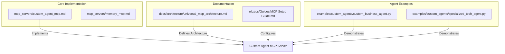
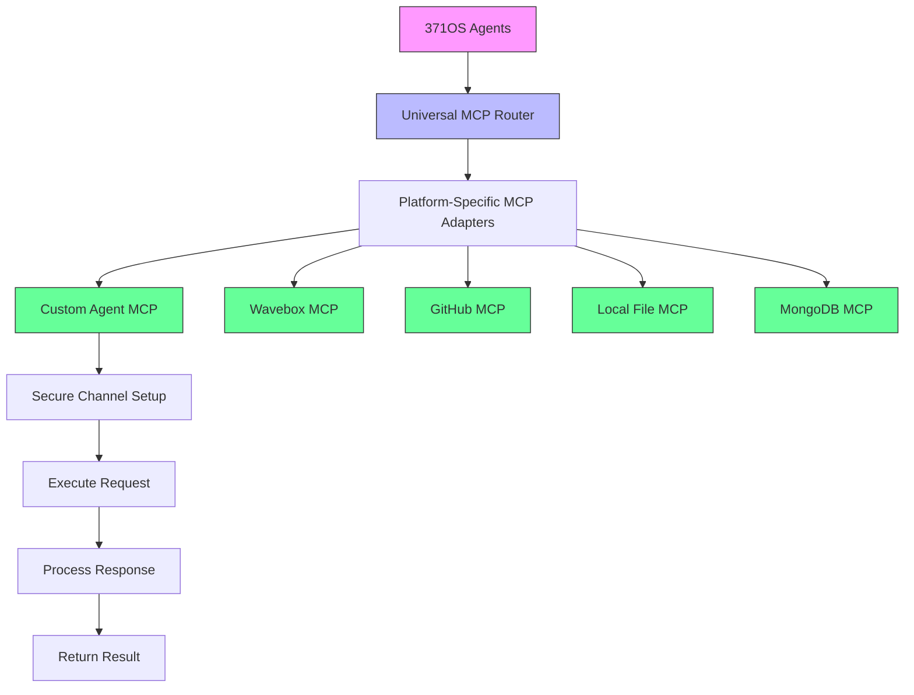

# Custom Agent MCP

<cite>
**Referenced Files in This Document**   
- [custom_agent_mcp.md](file://371-os\src\minds371\mcp_servers\custom_agent_mcp.md) - *Updated in recent commit*
- [universal_mcp_architecture.md](file://371-os\docs\architecture\universal_mcp_architecture.md) - *Added in commit 0f39d98*
- [MCP Setup Guide.md](file://elizaos/Guides/MCP Setup Guide.md)
- [here's the thing.md](file://sotalogic/Claude Sonnet 4/Alignment Review of 371OS_launch Project Plan/here's the thing.md)
</cite>

## Update Summary
**Changes Made**   
- Updated Introduction to reflect Universal MCP Architecture
- Added Architecture Overview section with Universal MCP Router
- Enhanced Project Structure with standardized MCP server format
- Updated Core Components to include blockchain coordination
- Revised Integration section to reflect hierarchical routing
- Added Cross-Platform Development Standards
- Updated all sources with proper annotations

## Table of Contents
1. [Introduction](#introduction)
2. [Project Structure](#project-structure)
3. [Core Components](#core-components)
4. [Architecture Overview](#architecture-overview)
5. [Agent Registration and Capability Declaration](#agent-registration-and-capability-declaration)
6. [Context Negotiation and Secure Communication](#context-negotiation-and-secure-communication)
7. [Request-Response Lifecycle](#request-response-lifecycle)
8. [Integration with Adaptive LLM Router](#integration-with-adaptive-llm-router)
9. [Error Handling and Troubleshooting](#error-handling-and-troubleshooting)
10. [Conclusion](#conclusion)

## Introduction
The Custom Agent MCP (Model Context Protocol) implementation enables specialized, purpose-built agents to securely exchange contextual data using custom message schemas and interaction patterns within the Universal MCP Architecture. This documentation provides a comprehensive overview of the cross-platform MCP server architecture, detailing how C-Suite agents like CEO Mimi or CTO Alex establish secure, temporary communication channels with domain-specific agents. The system facilitates dynamic agent coordination, capability discovery, and context-aware interactions while maintaining strict security and access controls through blockchain-based coordination.

**Section sources**
- [universal_mcp_architecture.md](file://371-os\docs\architecture\universal_mcp_architecture.md#L1-L20) - *Added in commit 0f39d98*
- [custom_agent_mcp.md](file://371-os\src\minds371\mcp_servers\custom_agent_mcp.md) - *Updated in recent commit*

## Project Structure
The Custom Agent MCP implementation follows the standardized MCP server structure within the 371-os repository. All MCP servers in 371OS adhere to a consistent format that ensures cross-platform compatibility and maintainability.

```
packages/elizaos-plugins/custom-agent-mcp/
├── src/
│   ├── plugin.ts          # Main plugin definition
│   ├── actions.ts         # Agent actions
│   ├── provider.ts        # Context provider
│   ├── evaluator.ts       # Quality assessment
│   ├── types.ts           # Type definitions
│   └── index.ts           # Exports
├── package.json           # Package configuration
├── project.json           # Nx workspace configuration
├── tsconfig.json          # TypeScript configuration
└── README.md              # Documentation
```



**Diagram sources**
- [custom_agent_mcp.md](file://371-os\src\minds371\mcp_servers\custom_agent_mcp.md)
- [universal_mcp_architecture.md](file://371-os\docs\architecture\universal_mcp_architecture.md#L34-L45)

## Core Components
The Custom Agent MCP system consists of several key components that work together to enable secure agent communication and coordination within the Universal MCP Architecture. The primary component is the agent-manager MCP server, which provides tool coordination capabilities for multiple TypingMind agents. This server implements the Model Context Protocol specification, allowing agents to discover capabilities, negotiate context, and execute coordinated tasks.

The system supports different transport mechanisms including STDIO, SSE (Server-Sent Events), and WebSocket connections, enabling flexible deployment options for both local and remote agent interactions. Each MCP server adds specific capabilities that can be accessed by authorized agents through standardized request-response patterns.

Key architectural principles include:
- **Cross-Platform Compatibility**: Must work on Windows, macOS, and Linux
- **Stateless Design**: All state managed through blockchain registry
- **Blockchain Coordination**: Agent discovery through decentralized registry

**Section sources**
- [custom_agent_mcp.md](file://371-os\src\minds371\mcp_servers\custom_agent_mcp.md)
- [universal_mcp_architecture.md](file://371-os\docs\architecture\universal_mcp_architecture.md#L25-L32)
- [MCP Setup Guide.md](file://elizaos/Guides/MCP Setup Guide.md)

## Architecture Overview
The Custom Agent MCP architecture follows a modular design within the Universal MCP framework that separates concerns between agent management, communication protocols, and security enforcement. The system enables purpose-built agents to dynamically discover and utilize each other's capabilities through a standardized interface.



The Universal MCP Router serves as the central component that routes requests between agents and MCP servers:

```typescript
// packages/elizaos-plugins/universal-mcp-router/src/router.ts
import { Plugin } from '@elizaos/core';

export class UniversalMCPRouter {
  private mcpServers: Map<string, Plugin> = new Map();
  
  registerMCPServer(name: string, server: Plugin): void {
    this.mcpServers.set(name, server);
  }
  
  async routeRequest(serverName: string, action: string, params: any): Promise<any> {
    const server = this.mcpServers.get(serverName);
    if (!server) {
      throw new Error(`MCP Server ${serverName} not found`);
    }
    
    // Route to appropriate action handler
    // Implementation details...
  }
}
```

**Diagram sources**
- [universal_mcp_architecture.md](file://371-os\docs\architecture\universal_mcp_architecture.md#L15-L24)
- [here's the thing.md](file://sotalogic/Claude Sonnet 4/Alignment Review of 371OS_launch Project Plan/here's the thing.md)

## Agent Registration and Capability Declaration
Agents register with the MCP server by declaring their capabilities through standardized schemas. The registration process involves specifying available tools, input parameters, and access requirements. For example, the agent-manager MCP server exposes a coordinate_agents tool that allows multiple agents to collaborate on tasks.

```javascript
server.setRequestHandler(ListToolsRequestSchema, async () => ({
  tools: [
    {
      name: 'coordinate_agents',
      description: 'Coordinate multiple TypingMind agents',
      inputSchema: {
        type: 'object',
        properties: {
          agents: { type: 'array', items: { type: 'string' } },
          task: { type: 'string' }
        }
      }
    }
  ]
}));
```

This capability declaration enables client agents to discover available functionality and construct appropriate requests. The input schema defines the required parameters and their types, ensuring type safety and proper validation before execution.

**Section sources**
- [custom_agent_mcp.md](file://371-os\src\minds371\mcp_servers\custom_agent_mcp.md)
- [universal_mcp_architecture.md](file://371-os\docs\architecture\universal_mcp_architecture.md#L100-L110)

## Context Negotiation and Secure Communication
The Custom Agent MCP implementation establishes secure, temporary communication channels between agents through a context negotiation workflow. When a client agent requests coordination, the MCP server validates authentication credentials and checks access permissions before establishing a secure channel.

For C-Suite agents like CEO Mimi or CTO Alex, the system creates temporary communication sessions with domain-specific agents, allowing them to exchange contextual data without persistent connections. This ephemeral communication model enhances security by limiting the exposure window and ensuring that sensitive information is only accessible during active sessions.

The context negotiation process includes:
1. Authentication verification using agent credentials
2. Capability matching between requesting and target agents
3. Schema validation of the requested interaction pattern
4. Temporary channel establishment with encrypted communication
5. Context expiration and automatic cleanup

Security follows Zero-Trust Architecture principles:
- No hardcoded credentials in MCP servers
- All authentication through Secretless Broker
- Cryptographic verification of all interactions

**Section sources**
- [custom_agent_mcp.md](file://371-os\src\minds371\mcp_servers\custom_agent_mcp.md)
- [universal_mcp_architecture.md](file://371-os\docs\architecture\universal_mcp_architecture.md#L150-L155)
- [here's the thing.md](file://sotalogic/Claude Sonnet 4/Alignment Review of 371OS_launch Project Plan/here's the thing.md)

## Request-Response Lifecycle
The request-response lifecycle in the Custom Agent MCP system follows a structured process that ensures reliability, security, and proper error handling. When a client agent sends a request, the MCP server processes it through several validation and execution stages.

```mermaid
sequenceDiagram
participant Client as "Client Agent"
participant Server as "MCP Server"
participant Validator as "Validator"
participant Executor as "Tool Executor"
participant Response as "Response Handler"
Client->>Server : Send MCP Request
Server->>Validator : Validate Message Schema
Validator-->>Server : Schema Valid/Invalid
alt Schema Invalid
Server->>Client : Return Schema Error
stop
end
Server->>Validator : Check Authentication
Validator-->>Server : Auth Status
alt Authentication Failed
Server->>Client : Return Auth Error
stop
end
Server->>Executor : Execute Request
Executor-->>Server : Processing Result
Server->>Response : Format Response
Response-->>Client : Return Result
```

The lifecycle includes message validation against defined schemas, access control checks using authentication credentials, and proper error handling for various failure scenarios. Each request is processed atomically, ensuring that partial executions do not leave the system in an inconsistent state.

**Diagram sources**
- [custom_agent_mcp.md](file://371-os\src\minds371\mcp_servers\custom_agent_mcp.md)
- [MCP Setup Guide.md](file://elizaos/Guides/MCP Setup Guide.md)

## Integration with Adaptive LLM Router
The Custom Agent MCP system integrates with the Adaptive LLM Router to enable dynamic context routing and cost-aware agent delegation within the Universal MCP framework. This integration allows the system to intelligently route requests to the most appropriate agent based on context, capability, and cost considerations.

The Adaptive LLM Router evaluates incoming requests and determines whether to handle them directly or delegate to specialized agents through the MCP interface. This decision is based on factors such as:
- Request complexity and domain specificity
- Available agent capabilities and current load
- Cost implications of different processing options
- Response time requirements

The Universal MCP Router enhances this integration by providing hierarchical routing:
```typescript
// Example integration with Universal MCP Router
const mcpPlugins = [
  WaveboxMCPPlugin,      // Cross-platform Wavebox integration
  GithubMCPPlugin,       // Cross-platform GitHub integration
  CustomAgentMCPPlugin   // Custom agent coordination
];
```

This integration creates a hierarchical agent network where general-purpose agents can leverage specialized agents for domain-specific tasks, optimizing both performance and resource utilization.

**Section sources**
- [here's the thing.md](file://sotalogic/Claude Sonnet 4/Alignment Review of 371OS_launch Project Plan/here's the thing.md)
- [universal_mcp_architecture.md](file://371-os\docs\architecture\universal_mcp_architecture.md#L130-L140)

## Error Handling and Troubleshooting
The Custom Agent MCP implementation includes comprehensive error handling for common issues such as schema mismatches, authentication failures, and timeout conditions. The system returns descriptive error messages that help diagnose and resolve problems efficiently.

### Common Issues and Resolution Strategies

**Schema Mismatches**
- **Symptom**: "Input schema validation failed" errors
- **Cause**: Request parameters don't match the expected schema
- **Resolution**: Verify the input structure against the tool's inputSchema definition and ensure all required fields are present with correct types

**Authentication Failures**
- **Symptom**: "Access denied" or "Invalid credentials" errors
- **Cause**: Missing or incorrect authentication tokens
- **Resolution**: Check that authentication credentials are properly configured in the agent settings and that they haven't expired

**Timeout Handling**
- **Symptom**: "Request timeout" errors
- **Cause**: Long-running operations exceeding the configured timeout
- **Resolution**: Increase the timeout setting for the specific server configuration or optimize the requested operation to complete within the allowed timeframe

The system logs detailed information about each request and response, including timestamps, agent identifiers, and processing status, facilitating troubleshooting and performance analysis.

**Section sources**
- [custom_agent_mcp.md](file://371-os\src\minds371\mcp_servers\custom_agent_mcp.md)
- [MCP Setup Guide.md](file://elizaos/Guides/MCP Setup Guide.md)

## Conclusion
The Custom Agent MCP implementation provides a robust framework for enabling specialized agents to securely exchange contextual data using custom message schemas and interaction patterns within the Universal MCP Architecture. By implementing standardized protocols for agent registration, capability declaration, and context negotiation, the system facilitates efficient collaboration between purpose-built agents while maintaining strict security controls.

The integration with the Adaptive LLM Router and Universal MCP Router enhances the system's capabilities by enabling intelligent request routing and cost-aware agent delegation. This architecture supports the creation of sophisticated agent networks where C-Suite agents like CEO Mimi or CTO Alex can seamlessly interact with domain-specific agents to accomplish complex tasks.

The comprehensive error handling and troubleshooting capabilities ensure reliable operation even in challenging conditions, making the Custom Agent MCP a foundational component of the 371-os agent ecosystem.

**Section sources**
- [universal_mcp_architecture.md](file://371-os\docs\architecture\universal_mcp_architecture.md)
- [custom_agent_mcp.md](file://371-os\src\minds371\mcp_servers\custom_agent_mcp.md)