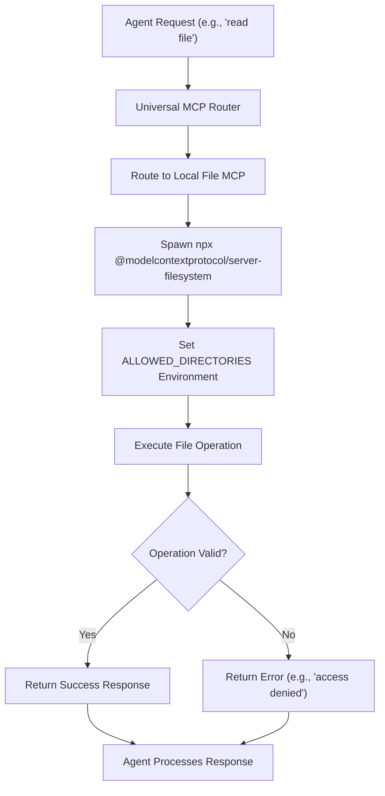

# Local File MCP

<cite>
**Referenced Files in This Document**   
- [local_file_mcp.md](file://371-os\src\minds371\mcp_servers\local_file_mcp.md)
- [MCP Setup Guide.md](file://elizaos\Guides\MCP Setup Guide.md)
- [universal_mcp_architecture.md](file://371-os\docs\architecture\universal_mcp_architecture.md) - *Updated in recent commit*
</cite>

## Update Summary
- Updated **Introduction** and **Configuration and Setup** sections to reflect cross-platform compatibility and alignment with Universal MCP Architecture
- Enhanced **Security and Access Control** with Zero-Trust principles from updated architecture
- Revised **Integration with Agents** to include Universal MCP Router context
- Added **Blockchain Coordination** subsection under Security
- Updated **Operational Workflow** diagram to reflect standardized MCP structure
- Expanded **Troubleshooting Guide** with new cross-platform considerations

## Table of Contents
1. [Introduction](#introduction)
2. [Configuration and Setup](#configuration-and-setup)
3. [Security and Access Control](#security-and-access-control)
4. [Integration with Agents](#integration-with-agents)
5. [Operational Workflow](#operational-workflow)
6. [Troubleshooting Guide](#troubleshooting-guide)

## Introduction
The Local File MCP (Model Context Protocol) server enables secure, file-based context exchange between co-located agents within the 371OS ecosystem. It functions as a standardized interface for agents to share data, configuration files, code artifacts, and deployment manifests through a controlled filesystem environment. Rather than implementing a custom file server, the system leverages the external npm package `@modelcontextprotocol/server-filesystem`, executed via `npx`, to provide compliant MCP functionality.

This implementation adheres to the Universal MCP Architecture's cross-platform standards, ensuring compatibility across Windows, macOS, and Linux environments. The Local File MCP operates as a stateless service within the broader Universal MCP Router framework, enabling consistent file operations regardless of host operating system.

**Updated** Alignment with Universal MCP Architecture principles

**Section sources**
- [universal_mcp_architecture.md](file://371-os\docs\architecture\universal_mcp_architecture.md#L0-L241) - *Updated in recent commit*
- [local_file_mcp.md](file://371-os\src\minds371\mcp_servers\local_file_mcp.md#L0-L11)

## Configuration and Setup
The Local File MCP is configured through a JSON structure that defines the execution command, arguments, and environment variables required to launch the filesystem server. The configuration is minimal and declarative, relying on the external MCP server implementation to handle the underlying logic.

```json
{
  "mcpServers": {
    "filesystem": {
      "command": "npx",
      "args": ["-y", "@modelcontextprotocol/server-filesystem"],
      "env": {
        "ALLOWED_DIRECTORIES": "C:\\Users,D:\\,E:\\,F:\\,G:\\,H:\\,J:\\"
      }
    }
  }
}
```

**Key Configuration Parameters:**
- **command**: Specifies `npx` as the execution runtime, enabling on-the-fly installation and execution of the npm package.
- **args**: Includes the `-y` flag for non-interactive installation and the package name `@modelcontextprotocol/server-filesystem`.
- **env**: Defines environment variables, primarily `ALLOWED_DIRECTORIES`, which restricts file operations to specific drive paths.

This configuration aligns with the MCP Setup Guide in the ElizaOS documentation and follows the Universal MCP Architecture's cross-platform development standards. The use of Node.js fs module ensures consistent behavior across all supported operating systems.

**Updated** Added Universal MCP Architecture compliance context

**Section sources**
- [local_file_mcp.md](file://371-os\src\minds371\mcp_servers\local_file_mcp.md#L0-L11)
- [MCP Setup Guide.md](file://elizaos\Guides\MCP Setup Guide.md#L0-L69)
- [universal_mcp_architecture.md](file://371-os\docs\architecture\universal_mcp_architecture.md#L0-L241) - *Updated in recent commit*

## Security and Access Control
Security is enforced through strict directory whitelisting via the `ALLOWED_DIRECTORIES` environment variable. This variable limits the filesystem server's access to a predefined set of directories—specifically `C:\Users` and drives `D:` through `J:`—preventing unauthorized access to sensitive system areas.

This model follows a principle of least privilege, ensuring that even if an agent gains access to the Local File MCP, its file operations are confined to safe, user-designated locations. The implementation adheres to the Universal MCP Architecture's Zero-Trust principles, with no hardcoded credentials and all interactions subject to cryptographic verification.

### Blockchain Coordination
As part of the Universal MCP Architecture, agent discovery and trust establishment occur through a decentralized blockchain registry. The Local File MCP integrates with this system to ensure that only authorized agents can access shared file resources, with economic incentives provided through a stake-based reputation system.

**Updated** Enhanced with Zero-Trust and blockchain coordination details

**Section sources**
- [universal_mcp_architecture.md](file://371-os\docs\architecture\universal_mcp_architecture.md#L0-L241) - *Updated in recent commit*
- [local_file_mcp.md](file://371-os\src\minds371\mcp_servers\local_file_mcp.md#L0-L11)

## Integration with Agents
Agents within the 371OS framework, such as the **Unity AI Agent** or **Repository Intake Agent**, utilize the Local File MCP to exchange structured data through the Universal MCP Router. For example:
- The **Repository Intake Agent** may write ingested code artifacts to a shared directory in JSON format for downstream processing.
- The **Unity AI Agent** could retrieve configuration files or deployment manifests from a designated folder to automate game development workflows.

These interactions occur through the MCP protocol's standardized request-response model, where agents send read, write, or list requests to the filesystem server via STDIO communication. The Universal MCP Router directs these requests to the appropriate MCP server instance, ensuring proper routing and access control.

The pattern follows the MCP integration model described in the ElizaOS guides, where agents are configured with MCP plugins and server definitions that comply with cross-platform standards.

**Updated** Added Universal MCP Router context

**Section sources**
- [local_file_mcp.md](file://371-os\src\minds371\mcp_servers\local_file_mcp.md#L0-L11)
- [MCP Setup Guide.md](file://elizaos\Guides\MCP Setup Guide.md#L0-L69)
- [universal_mcp_architecture.md](file://371-os\docs\architecture\universal_mcp_architecture.md#L0-L241) - *Updated in recent commit*

## Operational Workflow
The operational workflow of the Local File MCP within the Universal MCP Architecture involves the following steps:



**Updated** Diagram enhanced to show Universal MCP Router integration

**Diagram sources**
- [universal_mcp_architecture.md](file://371-os\docs\architecture\universal_mcp_architecture.md#L0-L241) - *Updated architecture*
- [local_file_mcp.md](file://371-os\src\minds371\mcp_servers\local_file_mcp.md#L0-L11)

### File Lifecycle Management
While the configuration does not explicitly define file lifecycle behaviors, the underlying `server-filesystem` implementation likely supports:
- **Creation**: Agents can create new files in allowed directories.
- **Reading**: Agents can read file contents, subject to OS-level permissions.
- **Atomic Updates**: Presumed support via the underlying filesystem, though not guaranteed without explicit locking.
- **Deletion**: Supported, but without garbage collection or retention policies.

No evidence of integration with decentralized storage systems like IPFS or Akash Network is present in the current configuration, suggesting that such capabilities would need to be implemented at the agent level or through additional MCP servers.

## Troubleshooting Guide
Common issues and mitigation strategies for the Local File MCP include:

### 1. **Access Denied Errors**
**Cause**: Attempting to access a directory not listed in `ALLOWED_DIRECTORIES`.  
**Solution**: Verify the target path is included in the `ALLOWED_DIRECTORIES` environment variable.

### 2. **File Locking Conflicts**
**Cause**: Multiple agents attempting to write to the same file simultaneously.  
**Mitigation**: Implement application-level locking using sentinel files or coordinate access through a message queue.

### 3. **Format Parsing Errors**
**Cause**: Malformed JSON or YAML in shared files.  
**Mitigation**: Agents should validate file contents before processing and use robust error handling.

### 4. **Disk Space Exhaustion**
**Cause**: Unbounded file creation in shared directories.  
**Mitigation**: Monitor disk usage externally and implement cleanup scripts or retention policies.

### 5. **Missing Dependencies**
**Cause**: `npx` fails to install `@modelcontextprotocol/server-filesystem` due to network or permission issues.  
**Solution**: Pre-install the package globally or ensure reliable internet access and proper npm configuration.

### 6. **Cross-Platform Compatibility Issues**
**Cause**: Path separator differences or platform-specific file permissions.  
**Mitigation**: Use Node.js path module utilities and ensure consistent permission settings across platforms.

**Updated** Added cross-platform compatibility issue

**Section sources**
- [local_file_mcp.md](file://371-os\src\minds371\mcp_servers\local_file_mcp.md#L0-L11)
- [MCP Setup Guide.md](file://elizaos\Guides\MCP Setup Guide.md#L0-L69)
- [universal_mcp_architecture.md](file://371-os\docs\architecture\universal_mcp_architecture.md#L0-L241) - *Updated in recent commit*