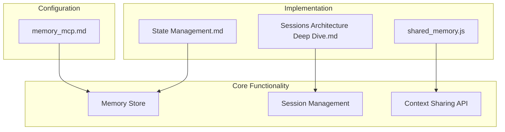
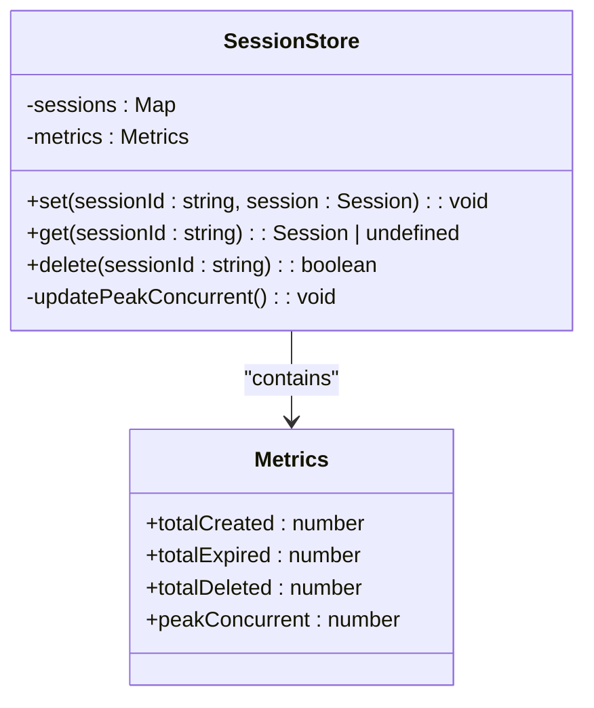
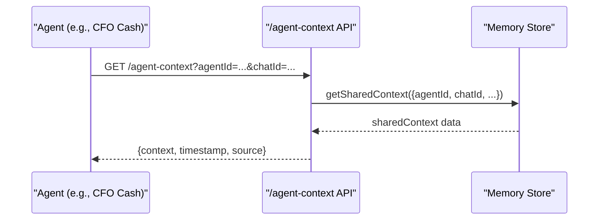
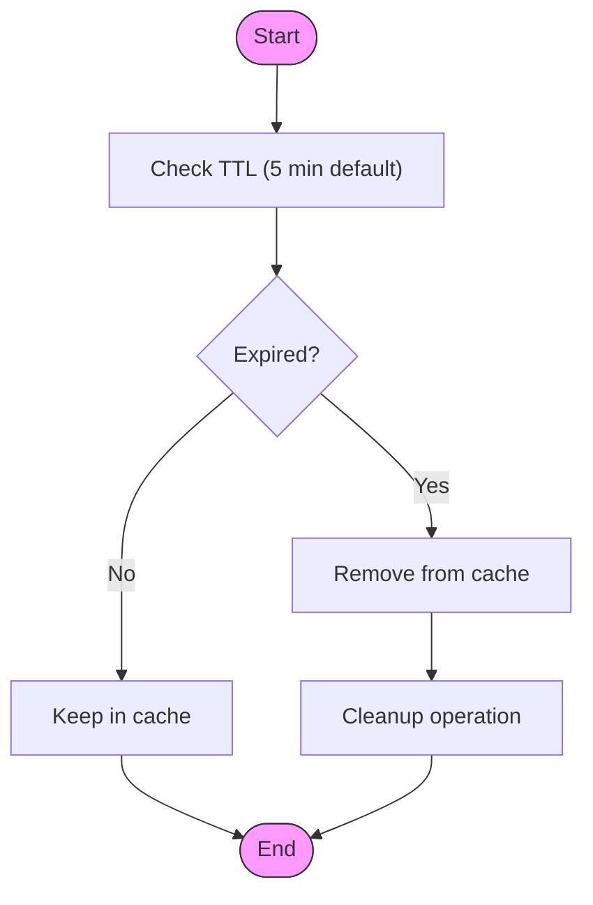
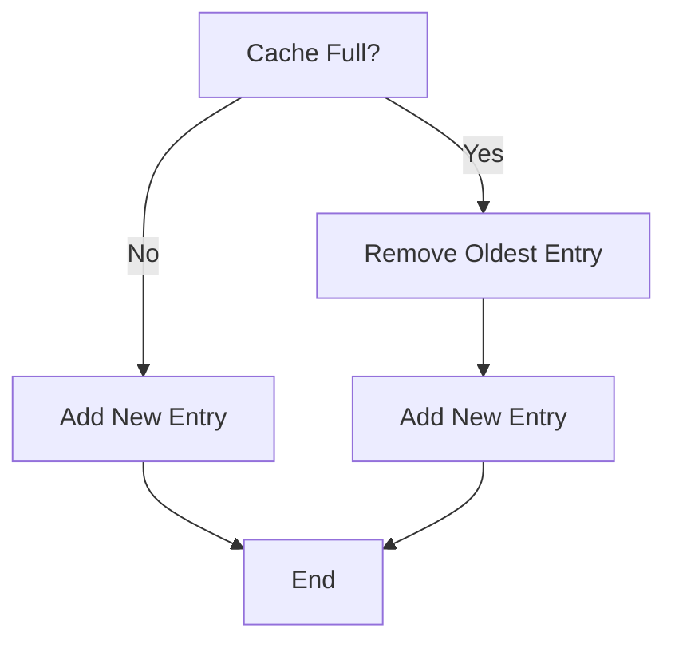

# Memory MCP

<cite>
**Referenced Files in This Document**   
- [memory_mcp.md](file://371-os\src\minds371\mcp_servers\memory_mcp.md) - *Updated in recent commit*
- [shared_memory.js](file://371-os\src\minds371\platforms\typingmind\extensions\shared_memory.js) - *Updated in recent commit*
- [Sessions Architecture Deep Dive.md](file://elizaos\Deep Dive\Sessions Architecture Deep Dive.md) - *Updated in recent commit*
- [State Management.md](file://elizaos\Guides\State Management.md) - *Updated in recent commit*
- [universal_mcp_architecture.md](file://371-os\docs\architecture\universal_mcp_architecture.md) - *Added in recent commit*
</cite>

## Update Summary
**Changes Made**   
- Updated documentation to reflect Universal MCP Architecture integration
- Added blockchain coordination details for agent discovery
- Enhanced security considerations with zero-trust architecture
- Updated diagram sources to reflect new architectural components
- Added cross-platform compatibility requirements

## Table of Contents
1. [Introduction](#introduction)
2. [Project Structure](#project-structure)
3. [Core Components](#core-components)
4. [Architecture Overview](#architecture-overview)
5. [Detailed Component Analysis](#detailed-component-analysis)
6. [Dependency Analysis](#dependency-analysis)
7. [Performance Considerations](#performance-considerations)
8. [Troubleshooting Guide](#troubleshooting-guide)
9. [Conclusion](#conclusion)

## Introduction
The Memory MCP (Model Context Protocol) server provides ephemeral, in-memory context storage for transient agent interactions within the 371OS ecosystem. This implementation enables stateless coordination between autonomous agents without persistent data leakage, supporting high-frequency workflows such as real-time decision chains between executive agents like CFO Cash and CMO Anova. The system leverages an in-memory data store with time-to-live (TTL) mechanisms and automatic garbage collection to ensure efficient memory utilization and data isolation. The Memory MCP is now integrated into the Universal MCP Architecture, providing cross-platform compatibility and blockchain-coordinated agent discovery.

**Section sources**
- [universal_mcp_architecture.md](file://371-os\docs\architecture\universal_mcp_architecture.md) - *Added in recent commit*

## Project Structure
The Memory MCP implementation is organized across multiple directories within the 371OS architecture, primarily focused on agent coordination and context sharing. The core configuration resides in the mcp_servers directory, while the actual implementation logic is distributed across platform extensions and deep architectural components.



**Diagram sources**
- [memory_mcp.md](file://371-os\src\minds371\mcp_servers\memory_mcp.md) - *Updated in recent commit*
- [shared_memory.js](file://371-os\src\minds371\platforms\typingmind\extensions\shared_memory.js) - *Updated in recent commit*

**Section sources**
- [memory_mcp.md](file://371-os\src\minds371\mcp_servers\memory_mcp.md) - *Updated in recent commit*

## Core Components
The Memory MCP system consists of several interconnected components that provide temporary context storage for agent interactions. The primary components include the memory store, session management system, and context sharing API endpoint. These components work together to enable secure, efficient, and transient data sharing between agents during collaborative tasks.

The memory store uses an in-memory Map structure for optimal performance, implementing lazy expiration checks and automatic cleanup of expired sessions. This design ensures minimal latency for context retrieval while preventing memory bloat through systematic garbage collection.

**Section sources**
- [Sessions Architecture Deep Dive.md](file://elizaos\Deep Dive\Sessions Architecture Deep Dive.md#L324-L375)
- [State Management.md](file://elizaos\Guides\State Management.md#L331-L351)

## Architecture Overview
The Memory MCP architecture follows a layered approach with clear separation between configuration, API interface, and storage management. The system is designed to provide ephemeral context storage that supports stateless agent coordination while maintaining data isolation and security. Integrated with the Universal MCP Architecture, the system now supports cross-platform compatibility and blockchain-based agent discovery.

```mermaid
graph TD
Client[Agent Client] --> API[/agent-context API]
API --> Store[Memory Store]
Store --> TTL[TTL Management]
Store --> Metrics[Usage Metrics]
TTL --> GC[Garbage Collection]
GC --> Store
classDef default fill:#f9f9f9,stroke:#333,stroke-width:1px;
```

**Diagram sources**
- [shared_memory.js](file://371-os\src\minds371\platforms\typingmind\extensions\shared_memory.js#L0-L17)
- [Sessions Architecture Deep Dive.md](file://elizaos\Deep Dive\Sessions Architecture Deep Dive.md#L324-L375)

## Detailed Component Analysis

### Memory Store Implementation
The memory store is implemented as a class-based structure using TypeScript, leveraging JavaScript's Map object for efficient key-value storage. The implementation includes comprehensive metrics tracking and automatic memory management features.



**Diagram sources**
- [Sessions Architecture Deep Dive.md](file://elizaos\Deep Dive\Sessions Architecture Deep Dive.md#L324-L375)

**Section sources**
- [Sessions Architecture Deep Dive.md](file://elizaos\Deep Dive\Sessions Architecture Deep Dive.md#L324-L375)

### Context Sharing API
The context sharing API provides a RESTful endpoint for agents to retrieve shared context information. This endpoint serves as the primary interface between agents and the memory store, enabling cross-agent collaboration.



**Diagram sources**
- [shared_memory.js](file://371-os\src\minds371\platforms\typingmind\extensions\shared_memory.js#L0-L17)

**Section sources**
- [shared_memory.js](file://371-os\src\minds371\platforms\typingmind\extensions\shared_memory.js#L0-L17)

### Memory Management Strategies
The system implements several memory management strategies to prevent leaks and ensure optimal performance. These include TTL-based expiration, bounded cache sizes, and periodic cleanup operations.



**Diagram sources**
- [State Management.md](file://elizaos\Guides\State Management.md#L789-L833)

**Section sources**
- [State Management.md](file://elizaos\Guides\State Management.md#L789-L833)

## Dependency Analysis
The Memory MCP implementation has minimal external dependencies, relying primarily on the core Node.js runtime and the Model Context Protocol SDK. The system is designed to be lightweight and focused on its specific purpose of ephemeral context storage. Integrated with the Universal MCP Architecture, it now follows standardized cross-platform development practices.

```mermaid
graph LR
A[Memory MCP] --> B[@modelcontextprotocol/server-memory]
A --> C[Node.js Runtime]
A --> D[Express.js]
B --> E[@modelcontextprotocol/sdk]
classDef default fill:#f9f9f9,stroke:#333,stroke-width:1px;
```

**Diagram sources**
- [memory_mcp.md](file://371-os\src\minds371\mcp_servers\memory_mcp.md) - *Updated in recent commit*
- [shared_memory.js](file://371-os\src\minds371\platforms\typingmind\extensions\shared_memory.js) - *Updated in recent commit*

## Performance Considerations
The Memory MCP system is optimized for high-performance, low-latency operations. Key performance considerations include:

- **In-memory storage**: Using JavaScript's Map object for O(1) lookup performance
- **Lazy expiration**: Checking expiration only during get operations to minimize overhead
- **Metrics tracking**: Monitoring creation, expiration, and deletion rates to identify potential issues
- **Peak concurrency tracking**: Recording maximum concurrent sessions to inform capacity planning

The implementation avoids synchronous operations that could block the event loop, ensuring responsiveness even under heavy load. Automatic garbage collection prevents memory bloat, while the TTL mechanism ensures that stale data does not accumulate.

## Troubleshooting Guide
Common issues with the Memory MCP system and their solutions include:

#### 1. Memory Leaks
**Symptoms**: Increasing memory usage over time
**Solution**: Implement bounded cache with size limits as shown in the BoundedCache class example



**Section sources**
- [State Management.md](file://elizaos\Guides\State Management.md#L864-L931)

#### 2. Stale Data
**Symptoms**: Outdated context being returned
**Solution**: Implement TTL-based cache invalidation or force fresh data retrieval

#### 3. High Latency
**Symptoms**: Slow response times from /agent-context endpoint
**Solution**: Optimize memory store queries and ensure proper indexing

## Conclusion
The Memory MCP implementation provides a robust solution for ephemeral context storage in multi-agent systems. By leveraging in-memory storage with TTL-based expiration and automatic garbage collection, the system enables efficient, secure, and transient data sharing between agents. The architecture supports high-frequency workflows like real-time decision chains between executive agents while preventing persistent data leakage. With proper configuration and monitoring, this system can effectively support complex agent collaborations without compromising performance or security. Integrated into the Universal MCP Architecture, the Memory MCP now supports cross-platform compatibility and blockchain-coordinated agent discovery, enhancing its capabilities in the 371OS ecosystem.