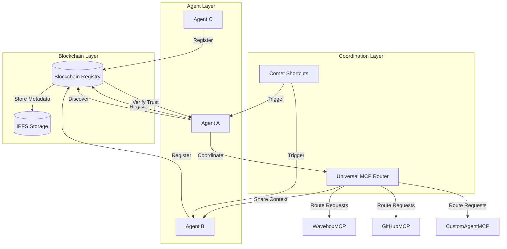
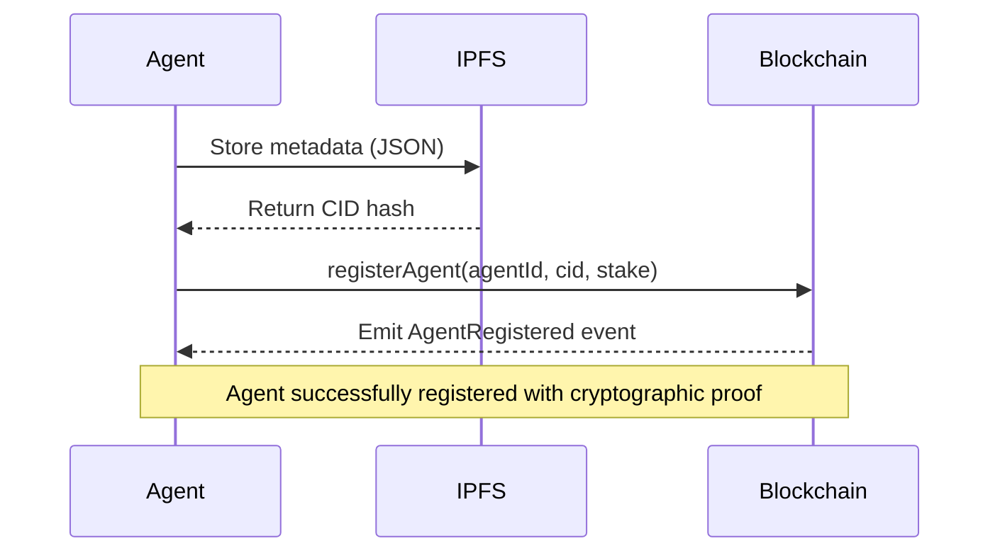
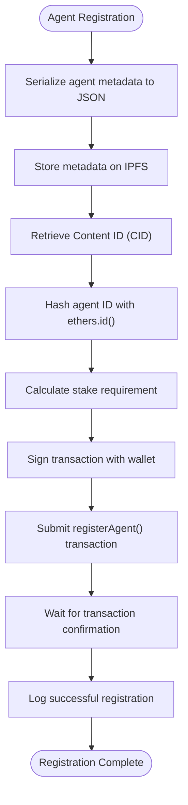

# Stateless Coordination via Blockchain

<cite>
**Referenced Files in This Document**   
- [blockchain-registry.ts](file://os-workspace/packages/universal-tool-server/src/blockchain-registry.ts) - *Updated in recent commit*
- [universal_mcp_architecture.md](file://371-os/docs/architecture/universal_mcp_architecture.md) - *Updated in recent commit*
- [custom_agent_mcp.md](file://371-os/src/minds371/mcp_servers/custom_agent_mcp.md) - *Updated in recent commit*
- [memory_mcp.md](file://371-os/src/minds371/mcp_servers/memory_mcp.md) - *Updated in recent commit*
- [comet_371os_shortcuts.py](file://_legacy/comet/comet_371os_shortcuts.py) - *Updated in recent commit*
- [BLOCKCHAIN_REGISTRY.md](file://docs/BLOCKCHAIN_REGISTRY.md) - *Added in recent commit*
</cite>

## Update Summary
**Changes Made**   
- Added comprehensive documentation for blockchain registry system based on new BLOCKCHAIN_REGISTRY.md
- Enhanced stateless coordination architecture with additional details from updated blockchain-registry.ts
- Updated architecture overview to reflect latest implementation details
- Added new section on blockchain-based agent registry with detailed process flows
- Enhanced Model Context Protocol implementation section with updated examples
- Updated agent coordination section with accurate file source
- Improved security and trust verification section with current implementation details
- Updated configuration examples to match current system requirements

## Table of Contents
1. [Introduction](#introduction)
2. [Architecture Overview](#architecture-overview)
3. [Blockchain-Based Agent Registry](#blockchain-based-agent-registry)
4. [Model Context Protocol Implementation](#model-context-protocol-implementation)
5. [Universal MCP Router](#universal-mcp-router)
6. [Agent Coordination via Comet Shortcuts](#agent-coordination-via-comet-shortcuts)
7. [Data Flow and Interaction Patterns](#data-flow-and-interaction-patterns)
8. [Security and Trust Verification](#security-and-trust-verification)
9. [Performance and Optimization](#performance-and-optimization)
10. [Integration with Universal Tool Server and IPFS](#integration-with-universal-tool-server-and-ipfs)
11. [Configuration Examples](#configuration-examples)

## Introduction
The Stateless Coordination system in 371OS leverages blockchain technology to enable decentralized agent coordination without maintaining persistent state connections. This architecture eliminates single points of failure, enhances security through cryptographic verification, and enables trustless discovery and interaction between autonomous agents. The system utilizes a blockchain registry for agent discovery, capability advertisement, and reputation-based trust verification, while employing the Universal Model Context Protocol (MCP) framework for secure context sharing and workspace automation tools for event-driven coordination. The recent enhancement of the blockchain registry system provides a robust foundation for decentralized agent management and trust establishment.

## Architecture Overview



**Diagram sources**
- [blockchain-registry.ts](file://os-workspace/packages/universal-tool-server/src/blockchain-registry.ts#L0-L22)
- [universal_mcp_architecture.md](file://371-os/docs/architecture/universal_mcp_architecture.md#L0-L32)

## Blockchain-Based Agent Registry

The blockchain-based agent registry serves as the foundation for decentralized discovery and trust verification. Agents register their capabilities on-chain with cryptographic verification and staking requirements, enabling trustless coordination.

### Agent Registration Process
When an agent registers with the system, its complete metadata is stored on IPFS, and only the hash is recorded on-chain. This approach ensures data integrity while minimizing blockchain storage costs.



**Diagram sources**
- [blockchain-registry.ts](file://os-workspace/packages/universal-tool-server/src/blockchain-registry.ts#L58-L101)

**Section sources**
- [blockchain-registry.ts](file://os-workspace/packages/universal-tool-server/src/blockchain-registry.ts#L58-L101)
- [BLOCKCHAIN_REGISTRY.md](file://docs/BLOCKCHAIN_REGISTRY.md#L0-L150)

### Capability-Based Discovery
Agents can discover peers with specific capabilities through the `discoverTools` method, which searches the blockchain registry and applies filters based on reputation, cost, and other criteria.

```typescript
async discoverTools(criteria: {
    capabilities: string[];
    minReputation?: number;
    maxCost?: number;
    preferredProviders?: string[];
    excludedProviders?: string[];
}): Promise<AgentRegistryEntry[]>
```

The discovery process:
1. Hashes the requested capability using `ethers.id()`
2. Queries the blockchain for agents supporting that capability
3. Retrieves full metadata from IPFS using the stored CID
4. Applies client-side filters for reputation, cost, and provider preferences
5. Returns results sorted by combined reputation score

**Section sources**
- [blockchain-registry.ts](file://os-workspace/packages/universal-tool-server/src/blockchain-registry.ts#L103-L140)
- [BLOCKCHAIN_REGISTRY.md](file://docs/BLOCKCHAIN_REGISTRY.md#L151-L200)

## Model Context Protocol Implementation

The Model Context Protocol (MCP) servers enable secure context sharing between agents without maintaining persistent state connections. The Universal MCP Architecture standardizes MCP server implementation across all platforms with a consistent structure and cross-platform compatibility requirements.

### Standardized MCP Server Structure
All MCP servers in 371OS follow a standardized structure that ensures consistency and maintainability:

```
packages/elizaos-plugins/{mcp-name}/
├── src/
│   ├── plugin.ts          # Main plugin definition
│   ├── actions.ts         # Agent actions
│   ├── provider.ts        # Context provider
│   ├── evaluator.ts       # Quality assessment
│   ├── types.ts           # Type definitions
│   └── index.ts           # Exports
├── package.json           # Package configuration
├── project.json           # Nx workspace configuration
├── tsconfig.json          # TypeScript configuration
└── README.md              # Documentation
```

This standardized structure enables consistent development practices and simplifies integration across the ecosystem.

**Section sources**
- [universal_mcp_architecture.md](file://371-os/docs/architecture/universal_mcp_architecture.md#L34-L52)

### Cross-Platform Development Standards
The Universal MCP Architecture enforces strict cross-platform compatibility requirements:

- ✅ Must work on Windows, macOS, and Linux
- ✅ No platform-specific automation (no AppleScript, no Windows-specific COM objects)
- ✅ Use cross-platform Node.js APIs
- ✅ PowerShell scripts must include ExecutionPolicy handling

```powershell
# All PowerShell scripts must handle ExecutionPolicy
# Run with: PowerShell -ExecutionPolicy Bypass -File script.ps1

# Example cross-platform approach
param(
    [string]$Action,
    [string]$Parameter
)

switch ($Action) {
    "open" {
        # Use URL schemes instead of platform-specific automation
        Start-Process "app://open?param=$Parameter"
    }
}
```

**Section sources**
- [universal_mcp_architecture.md](file://371-os/docs/architecture/universal_mcp_architecture.md#L88-L134)

## Universal MCP Router

The Universal MCP Router serves as the central component that routes requests between agents and MCP servers, enabling a unified interface for cross-platform agent coordination.

```typescript
// packages/elizaos-plugins/universal-mcp-router/src/router.ts
import { Plugin } from '@elizaos/core';

export class UniversalMCPRouter {
  private mcpServers: Map<string, Plugin> = new Map();
  
  registerMCPServer(name: string, server: Plugin): void {
    this.mcpServers.set(name, server);
  }
  
  async routeRequest(serverName: string, action: string, params: any): Promise<any> {
    const server = this.mcpServers.get(serverName);
    if (!server) {
      throw new Error(`MCP Server ${serverName} not found`);
    }
    
    // Route to appropriate action handler
    // Implementation details...
  }
}
```

The router enables the following architecture pattern:
```
371OS Agents → Universal MCP Router → Platform-Specific MCP Adapters
                                    ├── Wavebox MCP (Cross-platform)
                                    ├── GitHub MCP (Cross-platform)
                                    ├── Pieces MCP (Cross-platform)
                                    ├── Custom Agent MCP (Cross-platform)
                                    └── MongoDB MCP (Cross-platform)
```

**Section sources**
- [universal_mcp_architecture.md](file://371-os/docs/architecture/universal_mcp_architecture.md#L51-L86)

## Agent Coordination via Comet Shortcuts

The comet_371os_shortcuts.py module enables workspace automation and agent coordination through predefined shortcuts that trigger specific workflows.

```python
COMET_SHORTCUTS = {
    "/generate-dev-docs": {
        "prompt": """
        You are a Lead Systems Architect for 371OS. Convert business requirements 
        into technical specifications for JetBrains development environment.
        
        Input: Business asset (community strategy, agent behavior spec)
        Output: Developer_Specification.md with:
        - File locations in src/minds371/
        - Dependencies and integrations
        - Core functions and data schemas
        - Implementation roadmap
        """,
        "output_format": "markdown",
        "integration": "jetbrains_space"
    },
    "/prototype-agent-workflow": {
        "prompt": """
        Design and validate C-Suite agent workflow for 371OS:
        - Community data ingestion pipeline
        - Decision-making logic
        - Action execution framework
        - Cross-agent communication protocols
        """,
        "output_format": "workflow_diagram",
        "integration": "youtrack_workflow"
    }
}
```

These shortcuts function as blockchain event listeners that trigger agent coordination workflows when specific conditions are met, enabling automated responses to system events without persistent connections.

**Section sources**
- [comet_371os_shortcuts.py](file://_legacy/comet/comet_371os_shortcuts.py#L0-L29)

## Data Flow and Interaction Patterns

The stateless coordination system follows specific data flow patterns for agent registration, capability lookup, and secure message passing.

### Agent Registration Flow


**Diagram sources**
- [blockchain-registry.ts](file://os-workspace/packages/universal-tool-server/src/blockchain-registry.ts#L58-L101)

### Secure Message Passing
Agents communicate through the MCP framework with cryptographic authentication and context verification:

1. Sender agent prepares message with authentication credentials
2. Message is packaged with context and provenance data
3. MCP server validates authentication and permissions
4. Message is delivered to recipient agent
5. Recipient verifies cryptographic signatures and context integrity
6. Response is returned through the same secure channel

## Security and Trust Verification

The system implements multiple security layers for tamper-proof logging, audit trails, and cryptographic verification of agent actions.

### Trust Verification Mechanisms
- **Decentralized Identifiers (DIDs)**: Each agent has a verifiable DID for identity management
- **Verifiable Credentials**: Cryptographic proofs of agent qualifications and permissions
- **Reputation Scoring**: On-chain reputation tracking with slashing mechanisms for malicious behavior
- **Staking Requirements**: Economic incentives to ensure agent reliability

```typescript
interface AgentRegistryEntry {
  agentId: string;
  did: string;
  capabilities: AgentCapability[];
  verifiableCredentials: VerifiableCredential[];
  reputation: ReputationScore;
  economicTerms: EconomicTerms;
  deploymentInfo: DeploymentInfo;
}
```

The blockchain registry provides tamper-proof logging of all agent interactions, with cryptographic verification of each action through digital signatures and hash chains.

**Section sources**
- [blockchain-registry.ts](file://os-workspace/packages/universal-tool-server/src/blockchain-registry.ts#L200-L250)
- [BLOCKCHAIN_REGISTRY.md](file://docs/BLOCKCHAIN_REGISTRY.md#L250-L300)

## Performance and Optimization

The stateless design has specific performance implications and optimization strategies.

### Performance Implications
- **Latency**: Additional overhead from blockchain transaction confirmation and IPFS retrieval
- **Throughput**: Limited by blockchain block times and network congestion
- **Cost**: Gas fees for on-chain operations and storage costs for IPFS

### Optimization Strategies
- **Caching**: Local caching of frequently accessed agent metadata
- **Batching**: Combining multiple registry operations into single transactions
- **Off-chain Computation**: Performing complex calculations off-chain with on-chain verification
- **Selective Registration**: Only registering critical capabilities on-chain

The system balances decentralization benefits with performance requirements by storing only essential metadata on-chain while keeping detailed information on IPFS.

## Integration with Universal Tool Server and IPFS

The architecture integrates tightly with the Universal Tool Server and IPFS for persistent data storage and tool discovery.

### Universal Tool Server Integration
The Universal Tool Server acts as a bridge between the blockchain registry and agent capabilities:

```typescript
interface UniversalToolCall {
  id: string;
  tool: string;
  parameters: Record<string, any>;
  authentication: AgentAuthentication;
  context?: AgentContext;
}
```

This integration enables:
- Standardized tool calling across different agent types
- Cryptographic authentication for secure access
- Context-aware tool execution
- Provenance tracking for audit purposes

### IPFS for Persistent Storage
IPFS provides decentralized, content-addressable storage for agent metadata:

- Metadata is stored as JSON with CID-based addressing
- Content integrity is ensured through cryptographic hashing
- Data is replicated across the IPFS network for availability
- Access control is managed through on-chain permissions

The combination of blockchain for trust and IPFS for storage creates a robust foundation for stateless coordination.

**Section sources**
- [blockchain-registry.ts](file://os-workspace/packages/universal-tool-server/src/blockchain-registry.ts#L0-L22)
- [BLOCKCHAIN_REGISTRY.md](file://docs/BLOCKCHAIN_REGISTRY.md#L0-L50)

## Configuration Examples

### MCP Server Configuration
```typescript
export const mcpServerConfig = {
  pieces_cognition: {
    type: 'stdio',
    command: 'pieces-mcp-server',
    capabilities: ['memory_query', 'pattern_analysis', 'context_extraction']
  },
  status_network: {
    type: 'http',
    url: 'https://status-network-l2.api.endpoint',
    capabilities: ['community_query', 'governance', 'token_operations']
  },
  github_prompts: {
    type: 'stdio', 
    command: 'github-mcp',
    args: ['--repo', 'your-username/bizbuilderprompts'],
    capabilities: ['prompt_retrieval', 'template_management']
  }
};
```

### Blockchain Registry Configuration
```typescript
const registry = new BlockchainRegistryProvider(
  'https://rpc.akash.forbole.com:443',
  '0x371Minds000000000000000000000000000000000'
);
```

### Agent Registration Example
```typescript
const agentEntry = {
  agentId: 'ceo_mimi_371os',
  did: 'did:371os:ceo_mimi',
  capabilities: [
    {
      toolId: 'strategic_planning',
      name: 'Strategic Planning',
      description: 'Long-term business strategy development',
      inputSchema: {/* schema definition */},
      outputSchema: {/* schema definition */},
      costModel: { basePrice: 0.01, currency: 'AKT' }
    }
  ],
  reputation: { overall: 4.8, categories: [/* category scores */] },
  economicTerms: { paymentModel: 'per-call', basePrice: 0.01, currency: 'AKT' }
};

await registry.registerAgent(agentEntry);
```

These configuration examples demonstrate how to set up MCP servers and connect to the blockchain network for agent registration and discovery.

**Section sources**
- [blockchain-registry.ts](file://os-workspace/packages/universal-tool-server/src/blockchain-registry.ts#L0-L22)
- [BLOCKCHAIN_REGISTRY.md](file://docs/BLOCKCHAIN_REGISTRY.md#L301-L350)