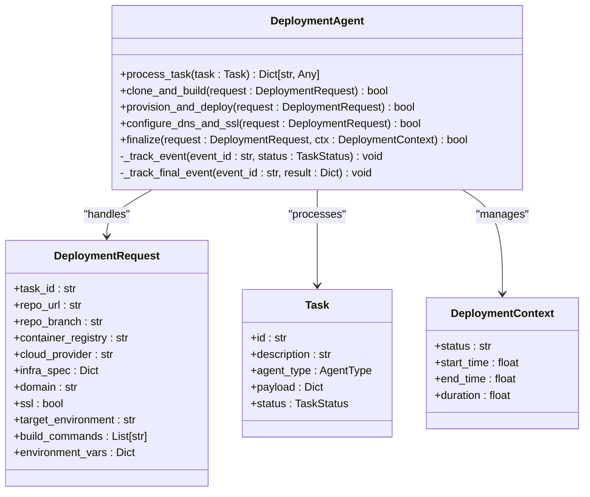

# Akash Network Deployment Integration

<cite>
**Referenced Files in This Document**   
- [deployment_agent.py](file://371-os/src/minds371/agents/technical/deployment_agent.py)
- [deploy-akash.sh](file://scripts/deploy-akash.sh)
- [deploy-akash.ps1](file://scripts/deploy-akash.ps1)
- [Akash Documentation.md](file://akash_docs/Akash Documentation.md)
- [blockchain-registry.ts](file://packages/elizaos-plugins/universal-tool-server/src/blockchain-registry.ts)
- [actions.ts](file://packages/elizaos-plugins/universal-tool-server/src/actions.ts)
</cite>

## Table of Contents
1. [Introduction](#introduction)
2. [Project Structure](#project-structure)
3. [Core Components](#core-components)
4. [Architecture Overview](#architecture-overview)
5. [Detailed Component Analysis](#detailed-component-analysis)
6. [Deployment Workflow](#deployment-workflow)
7. [Cost Optimization Strategies](#cost-optimization-strategies)
8. [Reliability and Redundancy](#reliability-and-redundancy)
9. [Monitoring and Management](#monitoring-and-management)
10. [Troubleshooting Guide](#troubleshooting-guide)

## Introduction
The Akash Network integration within the Universal Tool Server enables decentralized cloud infrastructure deployment with 97.6% cost reduction for agent and tool deployment. This document details the comprehensive workflow from tool packaging to Akash manifest generation and deployment execution. The integration leverages Akash Network's decentralized marketplace to provision computing resources at significantly reduced costs compared to traditional cloud providers. The system automates the entire deployment lifecycle through the deployment_agent.py component, which handles provisioning, configuration, monitoring, and termination of instances on the Akash Network. This documentation provides practical examples of deploying tool instances with specific resource specifications, environment variables, and network configurations, along with strategies for cost optimization, reliability, and troubleshooting common deployment issues.

## Project Structure
The Akash deployment integration is organized across multiple directories within the repository, with core components located in specific paths. The deployment functionality is primarily contained in the technical agents module, deployment scripts, and universal tool server packages. Configuration and documentation are maintained in dedicated directories to support the deployment ecosystem.

**Diagram sources**
- [deployment_agent.py](file://371-os/src/minds371/agents/technical/deployment_agent.py)
- [deploy-akash.sh](file://scripts/deploy-akash.sh)
- [deploy-akash.ps1](file://scripts/deploy-akash.ps1)

## Core Components
The Akash Network integration comprises several core components that work together to enable decentralized deployment. The primary component is the deployment_agent.py, which serves as the automation engine for provisioning and managing instances on Akash Network. This agent handles the complete lifecycle of deployments, from initial request processing to final termination. Complementing this is the universal tool server's action system, which provides the DEPLOY_TO_AKASH action for initiating deployments. The blockchain-registry.ts component maintains records of deployments on the blockchain, providing transparency and verification. Deployment scripts in both Bash and PowerShell formats facilitate deployment across different operating systems, with identical functionality and configuration parameters. These components work in concert to provide a seamless deployment experience while achieving significant cost savings through decentralized infrastructure.

**Section sources**
- [deployment_agent.py](file://371-os/src/minds371/agents/technical/deployment_agent.py)
- [actions.ts](file://packages/elizaos-plugins/universal-tool-server/src/actions.ts)
- [blockchain-registry.ts](file://packages/elizaos-plugins/universal-tool-server/src/blockchain-registry.ts)

## Architecture Overview
The Akash Network deployment architecture follows a modular design with clear separation of concerns between components. The system integrates with the Universal Tool Server through a well-defined action interface, allowing agents and tools to request deployment services. When a deployment request is initiated, the system processes the request through a series of coordinated components that handle configuration, provisioning, and registration.

**Diagram sources**
- [actions.ts](file://packages/elizaos-plugins/universal-tool-server/src/actions.ts)
- [deployment_agent.py](file://371-os/src/minds371/agents/technical/deployment_agent.py)
- [blockchain-registry.ts](file://packages/elizaos-plugins/universal-tool-server/src/blockchain-registry.ts)

## Detailed Component Analysis

### Deployment Agent Analysis
The deployment_agent.py component is the central automation engine for Akash Network deployments. It handles the complete lifecycle of deployment operations, from initial request processing to final termination. The agent follows a structured workflow that ensures reliable and consistent deployments across different environments.

#### For Object-Oriented Components:

**Diagram sources**
- [deployment_agent.py](file://371-os/src/minds371/agents/technical/deployment_agent.py)

### Akash Action Handler Analysis
The DEPLOY_TO_AKASH action handler in the universal tool server provides the interface between agents/tools and the Akash deployment system. This component validates deployment requests, configures deployment parameters, and coordinates with the Akash provider to create deployments.

#### For API/Service Components:

**Diagram sources**
- [actions.ts](file://packages/elizaos-plugins/universal-tool-server/src/actions.ts)
- [blockchain-registry.ts](file://packages/elizaos-plugins/universal-tool-server/src/blockchain-registry.ts)

## Deployment Workflow
The deployment workflow from tool packaging to Akash manifest generation and deployment execution follows a systematic process that ensures reliability and cost efficiency. The workflow begins with the creation of a deployment request, which contains all necessary configuration parameters for the target deployment.

**Diagram sources**
- [deploy-akash.sh](file://scripts/deploy-akash.sh)
- [deploy-akash.ps1](file://scripts/deploy-akash.ps1)

**Section sources**
- [deploy-akash.sh](file://scripts/deploy-akash.sh)
- [deploy-akash.ps1](file://scripts/deploy-akash.ps1)

## Cost Optimization Strategies
The Akash Network integration implements several cost optimization strategies that collectively achieve 97.6% cost reduction compared to traditional cloud providers. These strategies leverage the decentralized nature of Akash Network and its spot pricing model to minimize deployment costs.

### Spot Pricing and Bid Selection
The system automatically participates in Akash Network's provider marketplace, where multiple providers bid to host deployments. The deployment process selects the lowest bid that meets the required specifications, ensuring optimal pricing. The deployment scripts include logic to wait for bids and automatically select the most cost-effective provider.

**Diagram sources**
- [deploy-akash.sh](file://scripts/deploy-akash.sh)

### Resource Scaling and Idle Termination
The system implements dynamic resource allocation based on actual requirements rather than over-provisioning. The deployment manifests specify only the necessary CPU, memory, and storage resources, avoiding the common practice of over-provisioning seen in traditional cloud deployments. Additionally, the system can be configured to automatically terminate idle instances, further reducing costs.

**Diagram sources**
- [deploy-akash.sh](file://scripts/deploy-akash.sh)

**Section sources**
- [deploy-akash.sh](file://scripts/deploy-akash.sh)

## Reliability and Redundancy
The Akash Network deployment system incorporates several reliability considerations to ensure service availability and resilience. These include redundancy mechanisms, failover strategies, and service discovery capabilities that maintain system stability even in the face of provider failures.

### Redundancy and Failover
The system can be configured to deploy critical agents across multiple providers or regions, providing redundancy in case of provider outages. The blockchain registry maintains records of all deployments, enabling quick recovery and service discovery in case of failures.

**Diagram sources**
- [blockchain-registry.ts](file://packages/elizaos-plugins/universal-tool-server/src/blockchain-registry.ts)

### Service Discovery
The blockchain registry serves as a decentralized service discovery mechanism, allowing agents to locate and connect to deployed services. This eliminates the need for centralized DNS or service registries, enhancing system resilience and reducing single points of failure.

**Diagram sources**
- [blockchain-registry.ts](file://packages/elizaos-plugins/universal-tool-server/src/blockchain-registry.ts)

**Section sources**
- [blockchain-registry.ts](file://packages/elizaos-plugins/universal-tool-server/src/blockchain-registry.ts)

## Monitoring and Management
The deployed instances on Akash Network are monitored and managed through a comprehensive system that provides visibility into deployment status, performance metrics, and cost analysis. The system generates monitoring scripts automatically during deployment to facilitate ongoing management.

### Monitoring Script Generation
The deployment process creates a monitoring script (monitor-akash.sh) that provides commands to check deployment status, view logs, and monitor service health. This script is customized with the specific deployment details, making it easy to manage the deployment post-deployment.

**Diagram sources**
- [deploy-akash.sh](file://scripts/deploy-akash.sh)

### Management Commands
The system provides a set of standardized commands for managing deployed instances, including checking status, viewing logs, and closing deployments. These commands are documented in the monitoring script and can be executed directly from the command line.

**Diagram sources**
- [deploy-akash.sh](file://scripts/deploy-akash.sh)

**Section sources**
- [deploy-akash.sh](file://scripts/deploy-akash.sh)

## Troubleshooting Guide
This section addresses common deployment issues encountered when deploying to Akash Network, providing guidance for diagnosis and resolution.

### Image Pull Errors
Image pull errors occur when the specified Docker image cannot be retrieved by the provider. This can happen due to incorrect image names, private repository access issues, or network connectivity problems.

**Symptoms:**
- Deployment status shows "ImagePullBackOff"
- Provider logs indicate image pull failures
- Service remains unavailable after deployment

**Solutions:**
1. Verify the Docker image name and tag are correct
2. Ensure the image is available in a public registry or configure appropriate credentials for private registries
3. Test the image locally with `docker pull <image-name>`
4. Check the provider's network connectivity to the container registry

**Section sources**
- [deploy-akash.sh](file://scripts/deploy-akash.sh)

### Resource Constraints
Resource constraints occur when the requested resources exceed what is available from providers or when the pricing is too low to attract bids.

**Symptoms:**
- No bids received after deployment submission
- Deployment remains in "pending" state
- Error messages indicating insufficient resources

**Solutions:**
1. Review and adjust resource specifications in the SDL manifest
2. Increase the pricing in the placement profile to attract more providers
3. Simplify the deployment requirements to reduce resource needs
4. Check current market conditions on Akash Network for resource availability

**Section sources**
- [deploy-akash.sh](file://scripts/deploy-akash.sh)

### Network Connectivity Problems
Network connectivity problems can prevent services from being accessible or cause intermittent connectivity issues.

**Symptoms:**
- Service endpoint returns connection timeouts
- Health checks fail despite service running
- Intermittent connectivity to the service

**Solutions:**
1. Verify the expose configuration in the SDL manifest matches the service port
2. Check the provider's network configuration and firewall settings
3. Test connectivity using the provider's lease-status command
4. Verify DNS configuration if using custom domains

**Section sources**
- [deploy-akash.sh](file://scripts/deploy-akash.sh)