# Blockchain Registry Integration

<cite>
**Referenced Files in This Document**   
- [blockchain-registry.ts](file://os-workspace\packages\universal-tool-server\src\blockchain-registry.ts) - *Updated in recent commit*
- [types.ts](file://os-workspace\packages\universal-tool-server\src\types.ts) - *Modified in recent commit*
- [actions.ts](file://os-workspace\packages\universal-tool-server\src\actions.ts) - *Updated integration logic*
- [IMPLEMENTATION_GUIDE.md](file://IMPLEMENTATION_GUIDE.md) - *Configuration reference*
- [AgentRegistry.sol](file://contracts\AgentRegistry.sol) - *Smart contract implementation*
- [BLOCKCHAIN_REGISTRY.md](file://docs\BLOCKCHAIN_REGISTRY.md) - *Library documentation added*
- [index.ts](file://os-workspace\libs\blockchain-registry\src\index.ts) - *New registry library implementation*
</cite>

## Update Summary
**Changes Made**   
- Updated documentation to reflect new blockchain registry library implementation
- Added references to new library files and documentation
- Enhanced source tracking with new file annotations
- Maintained existing architectural descriptions where still accurate
- Preserved code examples and diagrams that remain valid

## Table of Contents
1. [Introduction](#introduction)
2. [Core Architecture](#core-architecture)
3. [Agent and Tool Registration](#agent-and-tool-registration)
4. [Reputation Management System](#reputation-management-system)
5. [Tool Discovery and Query Interface](#tool-discovery-and-query-interface)
6. [Integration Patterns](#integration-patterns)
7. [Security Considerations](#security-considerations)
8. [Performance and Caching Strategies](#performance-and-caching-strategies)
9. [Configuration and Economic Management](#configuration-and-economic-management)
10. [Conclusion](#conclusion)

## Introduction
The Blockchain Registry component of the Universal Tool Server provides a decentralized mechanism for agent and tool discovery through immutable ledger records. This system enables trustless coordination between autonomous agents by leveraging blockchain technology for cryptographic verification, reputation anchoring, and economic coordination. The registry eliminates the need for centralized authorities in agent discovery, creating a resilient and transparent ecosystem where agents can publish their capabilities and discover appropriate tools based on functional requirements, performance metrics, and trust scores.

## Core Architecture
The Blockchain Registry architecture combines on-chain smart contracts with off-chain storage solutions to balance immutability with performance. The system uses Ethereum-compatible blockchain for transaction finality and trust establishment, while leveraging IPFS (InterPlanetary File System) for storing detailed agent metadata.


**Diagram sources**
- [blockchain-registry.ts](file://os-workspace\packages\universal-tool-server\src\blockchain-registry.ts)
- [AgentRegistry.sol](file://contracts\AgentRegistry.sol)

**Section sources**
- [blockchain-registry.ts](file://os-workspace\packages\universal-tool-server\src\blockchain-registry.ts#L0-L400)
- [types.ts](file://os-workspace\packages\universal-tool-server\src\types.ts#L0-L271)

## Agent and Tool Registration
The registration process enables agents to publish their capabilities to the decentralized network, making them discoverable by other agents. Registration involves cryptographic signing, metadata storage, and staking mechanisms to prevent Sybil attacks.

### Registration Workflow
The registration process follows a multi-step workflow that ensures data integrity and cryptographic verification:

```mermaid
sequenceDiagram
participant Agent as "Agent"
participant Registry as "BlockchainRegistryProvider"
participant IPFS as "IPFS Storage"
participant Blockchain as "Smart Contract"
Agent->>Registry : registerAgent(entry)
Registry->>IPFS : Store metadata (JSON)
IPFS-->>Registry : Return IPFS CID
Registry->>Registry : Create agent ID hash
Registry->>Registry : Calculate stake requirement
Registry->>Blockchain : Sign transaction
Blockchain->>Blockchain : Verify stake amount
Blockchain->>Blockchain : Store agentId → IPFS CID mapping
Blockchain-->>Registry : Transaction confirmation
Registry-->>Agent : Return transaction hash
```



**Diagram sources**
- [blockchain-registry.ts](file://os-workspace\packages\universal-tool-server\src\blockchain-registry.ts#L58-L101)
- [actions.ts](file://os-workspace\packages\universal-tool-server\src\actions.ts#L55-L86)

**Section sources**
- [blockchain-registry.ts](file://os-workspace\packages\universal-tool-server\src\blockchain-registry.ts#L58-L101)
- [actions.ts](file://os-workspace\packages\universal-tool-server\src\actions.ts#L55-L86)

### Registration Implementation
The registration process stores complete agent metadata on IPFS and registers only the content identifier (CID) on-chain, optimizing gas costs while maintaining data integrity:

```typescript
async registerAgent(entry: AgentRegistryEntry): Promise<string> {
  // Store complete agent metadata on IPFS
  const metadataBuffer = Buffer.from(JSON.stringify(entry));
  const ipfsResult = await this.ipfs.add(metadataBuffer);
  const ipfsHash = ipfsResult.cid.toString();
  
  // Create agent ID hash
  const agentIdBytes = ethers.id(entry.agentId);
  
  // Calculate required stake based on capabilities
  const stakeAmount = this.calculateStakeRequirement(entry.capabilities);
  
  // Get wallet for transaction signing
  const wallet = new ethers.Wallet(
    process.env.AGENT_PRIVATE_KEY || ethers.Wallet.createRandom().privateKey,
    this.provider
  );
  
  const contractWithSigner = this.contract.connect(wallet);
  
  // Submit registration transaction
  const tx = await contractWithSigner.registerAgent(
    agentIdBytes,
    ipfsHash,
    ethers.parseEther(stakeAmount.toString())
  );
  
  await tx.wait();
  
  console.log(`Agent ${entry.agentId} registered with IPFS hash: ${ipfsHash}`);
  return tx.hash;
}
```

The `AgentRegistryEntry` data structure contains comprehensive information about the agent, including capabilities, verifiable credentials, reputation, economic terms, and deployment information:

```typescript
interface AgentRegistryEntry {
  agentId: string;
  did: string;
  capabilities: AgentCapability[];
  verifiableCredentials: VerifiableCredential[];
  reputation: ReputationScore;
  economicTerms: EconomicTerms;
  deploymentInfo: DeploymentInfo;
}
```

**Section sources**
- [blockchain-registry.ts](file://os-workspace\packages\universal-tool-server\src\blockchain-registry.ts#L58-L101)
- [types.ts](file://os-workspace\packages\universal-tool-server\src\types.ts#L49-L70)

## Reputation Management System
The reputation system provides a trust mechanism for evaluating agent reliability and performance. Reputation updates are submitted as blockchain transactions, creating an immutable record of performance attestations.

### Reputation Update Process
The reputation update process involves cryptographic proof and evidence linking to ensure the integrity of reputation claims:


**Diagram sources**
- [blockchain-registry.ts](file://os-workspace\packages\universal-tool-server\src\blockchain-registry.ts#L181-L232)

**Section sources**
- [blockchain-registry.ts](file://os-workspace\packages\universal-tool-server\src\blockchain-registry.ts#L181-L232)
- [actions.ts](file://os-workspace\packages\universal-tool-server\src\actions.ts#L267-L305)

### Reputation Update Implementation
The reputation update function creates a cryptographic hash of the evidence data and submits it on-chain along with the rating:

```typescript
async updateReputation(update: {
  agentId: string;
  raterDid: string;
  rating: number;
  category: string;
  evidence: string[];
  executionId?: string;
  timestamp: string;
}): Promise<string> {
  const agentIdBytes = ethers.id(update.agentId);
  
  // Create evidence hash for on-chain storage
  const evidenceHash = ethers.id(JSON.stringify({
    executionId: update.executionId,
    evidence: update.evidence,
    rater: update.raterDid,
    timestamp: update.timestamp
  }));
  
  // Convert rating to uint8 (0-100)
  const rating = Math.min(100, Math.max(0, Math.round(update.rating * 100)));
  
  const wallet = new ethers.Wallet(
    process.env.AGENT_PRIVATE_KEY || ethers.Wallet.createRandom().privateKey,
    this.provider
  );
  
  const contractWithSigner = this.contract.connect(wallet);
  
  const tx = await contractWithSigner.updateReputation(
    agentIdBytes,
    rating,
    evidenceHash
  );
  
  await tx.wait();
  
  console.log(`Reputation updated for agent ${update.agentId}: ${rating}/100`);
  return tx.hash;
}
```

The reputation score data structure includes overall score, category-specific scores, history, attestations, and slashing history:

```typescript
interface ReputationScore {
  overall: number;
  categories: CategoryScore[];
  history: ReputationEvent[];
  attestations: Attestation[];
  slashingHistory: SlashingEvent[];
}
```

**Section sources**
- [blockchain-registry.ts](file://os-workspace\packages\universal-tool-server\src\blockchain-registry.ts#L181-L232)
- [types.ts](file://os-workspace\packages\universal-tool-server\src\types.ts#L140-L155)

## Tool Discovery and Query Interface
The discovery interface enables agents to find appropriate tools based on functional requirements, performance metrics, and trust scores. The query system supports filtering by capabilities, reputation thresholds, and cost constraints.

### Discovery Workflow
The tool discovery process involves querying the blockchain for agent IDs matching specific capabilities, then retrieving detailed metadata from IPFS:


**Diagram sources**
- [blockchain-registry.ts](file://os-workspace\packages\universal-tool-server\src\blockchain-registry.ts#L103-L140)

**Section sources**
- [blockchain-registry.ts](file://os-workspace\packages\universal-tool-server\src\blockchain-registry.ts#L103-L140)

### Discovery Implementation
The discovery function searches for agents matching required capabilities and applies client-specified filters:

```typescript
async discoverTools(criteria: {
  capabilities: string[];
  minReputation?: number;
  maxCost?: number;
  preferredProviders?: string[];
  excludedProviders?: string[];
}): Promise<AgentRegistryEntry[]> {
  const results: AgentRegistryEntry[] = [];
  
  // Search by each capability
  for (const capability of criteria.capabilities) {
    const capabilityHash = ethers.id(capability);
    const agentIds = await this.contract.discoverByCapability(capabilityHash);
    
    for (const agentIdBytes of agentIds) {
      try {
        // Get agent metadata from chain
        const [ipfsHash, reputation, stake] = await this.contract.getAgent(agentIdBytes);
        
        // Retrieve full metadata from IPFS
        const chunks = [];
        for await (const chunk of this.ipfs.cat(ipfsHash)) {
          chunks.push(chunk);
        }
        const metadata = JSON.parse(Buffer.concat(chunks).toString());
        
        // Apply filters
        if (criteria.minReputation && metadata.reputation.overall < criteria.minReputation) {
          continue;
        }
        
        if (criteria.maxCost && metadata.economicTerms.basePrice > criteria.maxCost) {
          continue;
        }
        
        if (criteria.excludedProviders?.includes(metadata.agentId)) {
          continue;
        }
        
        // Add blockchain verification data
        metadata.blockchainVerification = {
          onChainReputation: Number(reputation),
          stakeAmount: ethers.formatEther(stake),
          verified: true
        };
        
        results.push(metadata);
      } catch (error) {
        console.warn(`Failed to retrieve agent metadata: ${error.message}`);
        continue;
      }
    }
  }
  
  // Remove duplicates and sort by reputation
  const uniqueResults = results.filter((entry, index, self) => 
    index === self.findIndex(e => e.agentId === entry.agentId)
  );
  
  return uniqueResults.sort((a, b) => 
    (b.reputation.overall + b.blockchainVerification.onChainReputation) - 
    (a.reputation.overall + a.blockchainVerification.onChainReputation)
  );
}
```

**Section sources**
- [blockchain-registry.ts](file://os-workspace\packages\universal-tool-server\src\blockchain-registry.ts#L103-L140)
- [types.ts](file://os-workspace\packages\universal-tool-server\src\types.ts#L49-L70)

## Integration Patterns
The integration between agents, the Universal Tool Server, and the blockchain registry follows a standardized pattern that enables seamless coordination and discovery.

### Agent Registration Integration
Agents register their capabilities through the Universal Tool Server, which interfaces with the blockchain registry:


**Diagram sources**
- [actions.ts](file://os-workspace\packages\universal-tool-server\src\actions.ts#L55-L86)

**Section sources**
- [actions.ts](file://os-workspace\packages\universal-tool-server\src\actions.ts#L55-L86)

### Tool Discovery Integration
Agents discover tools through a query interface that returns ranked results based on multiple criteria:


**Diagram sources**
- [actions.ts](file://os-workspace\packages\universal-tool-server\src\actions.ts#L140-L170)

**Section sources**
- [actions.ts](file://os-workspace\packages\universal-tool-server\src\actions.ts#L140-L170)

## Security Considerations
The blockchain registry implements multiple security mechanisms to prevent attacks and ensure data integrity.

### Sybil Attack Prevention
The system prevents Sybil attacks through economic staking requirements and cryptographic identity verification:

- **Staking Requirements**: Agents must stake tokens proportional to their capabilities, making it economically infeasible to create multiple fake identities
- **Decentralized Identifiers (DIDs)**: Each agent has a unique DID that serves as their cryptographic identity
- **Verifiable Credentials**: Agents can present verifiable credentials from trusted issuers to establish trust

```typescript
private calculateStakeRequirement(capabilities: AgentCapability[]): number {
  const baseStake = 10; // AKT
  const capabilityStake = capabilities.length * 2; // 2 AKT per capability
  const complexityMultiplier = capabilities.some(cap => 
    cap.name.includes('financial') || cap.name.includes('crypto')
  ) ? 2 : 1;
  
  return baseStake + (capabilityStake * complexityMultiplier);
}
```

### Signature Verification
All write operations require cryptographic signatures from authorized wallets:

- **Private Key Management**: The system uses environment variables to store private keys securely
- **Transaction Signing**: All blockchain transactions are signed before submission
- **Wallet Integration**: The system integrates with Ethereum-compatible wallets for transaction signing

```typescript
const wallet = new ethers.Wallet(
  process.env.AGENT_PRIVATE_KEY || ethers.Wallet.createRandom().privateKey,
  this.provider
);
```

### Data Integrity Checks
The system implements multiple layers of data integrity verification:

- **IPFS Content Addressing**: Metadata is stored on IPFS using content identifiers, ensuring data cannot be tampered with
- **On-Chain Hashes**: The blockchain stores hashes of IPFS content, enabling verification of data integrity
- **Event Emission**: All critical operations emit blockchain events that can be audited

**Section sources**
- [blockchain-registry.ts](file://os-workspace\packages\universal-tool-server\src\blockchain-registry.ts#L58-L101)
- [blockchain-registry.ts](file://os-workspace\packages\universal-tool-server\src\blockchain-registry.ts#L181-L232)
- [types.ts](file://os-workspace\packages\universal-tool-server\src\types.ts#L72-L88)

## Performance and Caching Strategies
The system addresses performance implications of on-chain lookups through strategic caching and optimization techniques.

### On-Chain Lookup Performance
Blockchain queries have inherent latency due to network propagation and block confirmation times. The system mitigates this through:

- **Event Filtering**: Using blockchain event filters to efficiently query specific data
- **Batch Processing**: Processing multiple agents in a single operation when possible
- **Asynchronous Operations**: Performing blockchain operations asynchronously to avoid blocking

```typescript
// Get registration events
const registrationFilter = this.contract.filters.AgentRegistered();
const registrationEvents = await this.contract.queryFilter(
  registrationFilter,
  fromBlock,
  currentBlock
);
```

### Caching Strategies
The system implements multiple caching layers to improve performance:

- **Client-Side Caching**: Agents can cache discovery results for a configurable period
- **Metadata Caching**: Frequently accessed agent metadata can be cached locally
- **Query Result Caching**: Common queries can be cached to reduce blockchain reads

The system also provides network performance metrics that can inform caching decisions:

```typescript
async getNetworkMetrics(timeWindow: string = '24h'): Promise<any> {
  const currentBlock = await this.provider.getBlockNumber();
  const blocksBack = this.parseTimeWindow(timeWindow);
  const fromBlock = Math.max(0, currentBlock - blocksBack);
  
  // Get registration events
  const registrationFilter = this.contract.filters.AgentRegistered();
  const registrationEvents = await this.contract.queryFilter(
    registrationFilter,
    fromBlock,
    currentBlock
  );
  
  // Get reputation update events
  const reputationFilter = this.contract.filters.ReputationUpdated();
  const reputationEvents = await this.contract.queryFilter(
    reputationFilter,
    fromBlock,
    currentBlock
  );
  
  // Calculate metrics
  const metrics = {
    totalAgents: registrationEvents.length,
    newAgents: registrationEvents.filter(e => e.blockNumber >= fromBlock).length,
    totalInteractions: reputationEvents.length,
    slashingIncidents: slashingEvents.length,
    averageLatency: this.calculateAverageLatency(reputationEvents),
    successRate: this.calculateSuccessRate(reputationEvents, slashingEvents),
    networkUptime: this.calculateNetworkUptime(timeWindow),
    performanceTrend: this.calculatePerformanceTrend(reputationEvents),
    alerts: this.generateNetworkAlerts(slashingEvents, reputationEvents)
  };
  
  return metrics;
}
```

**Section sources**
- [blockchain-registry.ts](file://os-workspace\packages\universal-tool-server\src\blockchain-registry.ts#L274-L313)
- [blockchain-registry.ts](file://os-workspace\packages\universal-tool-server\src\blockchain-registry.ts#L370-L400)

## Configuration and Economic Management
The system provides comprehensive configuration options for blockchain node connections and economic management of write operations.

### Blockchain Node Configuration
The system supports configurable blockchain node connections through environment variables:

```typescript
constructor(providerUrl?: string, registryAddress?: string) {
  // Use Akash Network RPC or fallback to public providers
  this.provider = new ethers.JsonRpcProvider(
    providerUrl || process.env.AKASH_RPC_URL || 'https://rpc.akash.forbole.com:443'
  );
  
  this.registryAddress = registryAddress || process.env.REGISTRY_CONTRACT_ADDRESS || 
    '0x371Minds000000000000000000000000000000000'; // Placeholder
  
  // Initialize IPFS client for metadata storage
  this.ipfs = create({
    host: process.env.IPFS_HOST || 'ipfs.infura.io',
    port: 5001,
    protocol: 'https',
    headers: {
      authorization: process.env.IPFS_AUTH || ''
    }
  });
}
```

### Gas Fee Management
The system manages gas fees for write operations through several mechanisms:

- **Stake Calculation**: The system calculates appropriate stake amounts based on agent capabilities
- **Gas Optimization**: Transactions are optimized to minimize gas consumption
- **Economic Terms**: Agents specify their economic terms, including payment models and pricing

```typescript
// Calculate required stake based on capabilities
const stakeAmount = this.calculateStakeRequirement(entry.capabilities);

// Submit registration transaction with stake
const tx = await contractWithSigner.registerAgent(
  agentIdBytes,
  ipfsHash,
  ethers.parseEther(stakeAmount.toString())
);
```

The economic terms data structure defines payment models, pricing, and other economic parameters:

```typescript
interface EconomicTerms {
  paymentModel: 'per-call' | 'subscription' | 'compute-time' | 'outcome-based';
  basePrice: number;
  currency: 'AKT' | 'ETH' | 'USDC' | 'native';
  dynamicPricing?: DynamicPricingConfig;
  escrowRequired: boolean;
  slashing?: SlashingConfig;
}
```

**Section sources**
- [blockchain-registry.ts](file://os-workspace\packages\universal-tool-server\src\blockchain-registry.ts#L23-L56)
- [types.ts](file://os-workspace\packages\universal-tool-server\src\types.ts#L95-L105)
- [IMPLEMENTATION_GUIDE.md](file://IMPLEMENTATION_GUIDE.md#L92-L157)

## Conclusion
The Blockchain Registry component of the Universal Tool Server provides a robust foundation for decentralized agent and tool discovery. By leveraging blockchain technology, the system creates an immutable, trustless environment where agents can publish their capabilities and discover appropriate tools based on functional requirements, performance metrics, and trust scores. The architecture balances on-chain security with off-chain performance through the use of IPFS for metadata storage and smart contracts for trust establishment. Security mechanisms including staking requirements, cryptographic signatures, and data integrity checks prevent Sybil attacks and ensure system integrity. Performance is optimized through strategic caching and asynchronous operations, while comprehensive configuration options allow for flexible deployment and economic management. This decentralized approach enables a resilient, transparent ecosystem for autonomous agent coordination without reliance on centralized authorities.