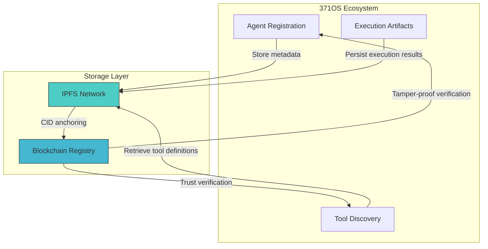
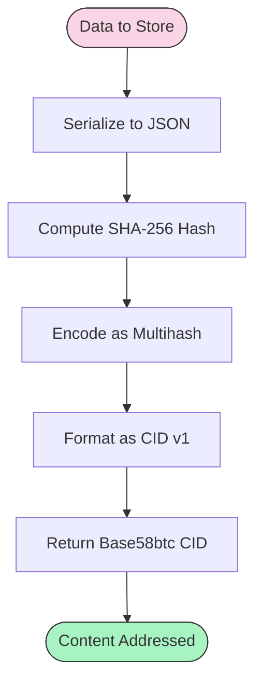
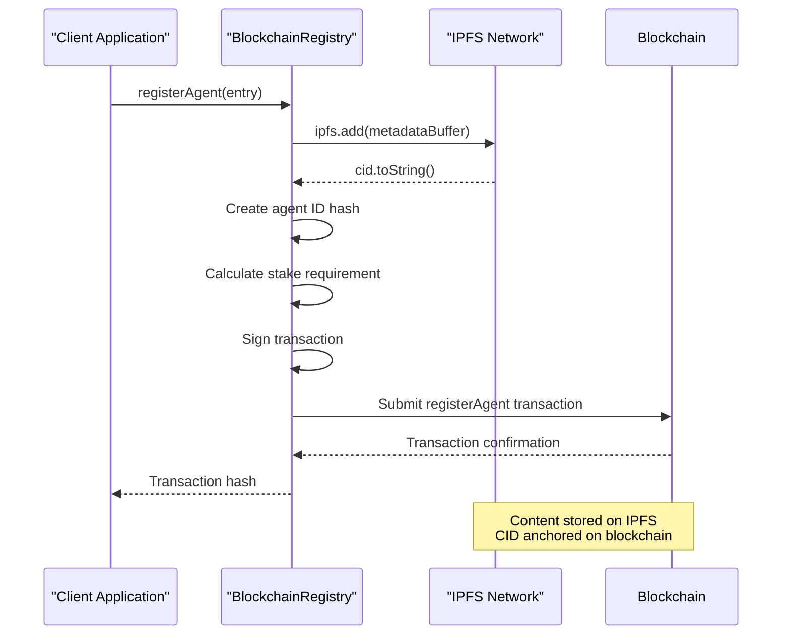
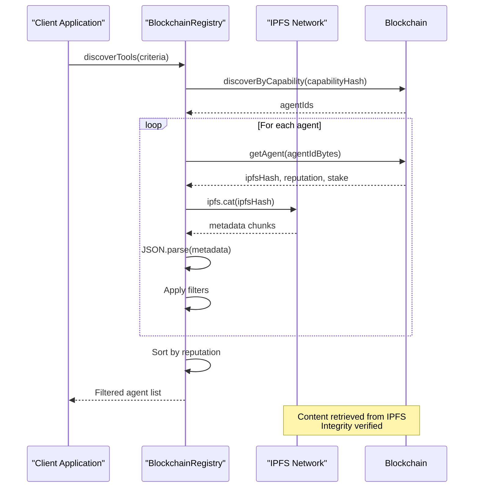
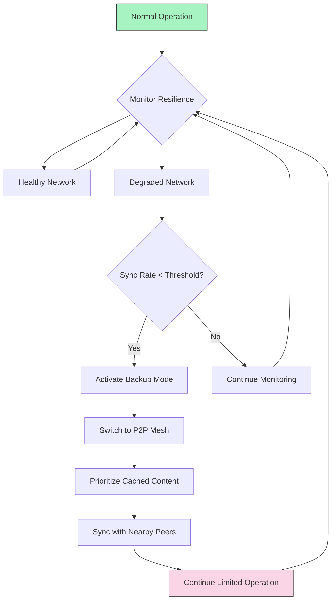

# IPFS Storage Integration

<cite>
**Referenced Files in This Document**   
- [comet_371os_shortcuts.py](file://371-os/src/minds371/comet/comet_371os_shortcuts.py)
- [blockchain-registry.ts](file://packages/elizaos-plugins/universal-tool-server/src/blockchain-registry.ts)
- [quick-start.sh](file://scripts/quick-start.sh)
- [quick-start.ps1](file://scripts/quick-start.ps1)
- [IMPLEMENTATION_GUIDE.md](file://IMPLEMENTATION_GUIDE.md)
- [cro_agent.py](file://371-os/src/minds371/agents/cro_agent/cro_agent.py)
- [ipfs-storage.ts](file://packages/elizaos-plugins/universal-tool-server/src/ipfs-storage.ts)
</cite>

## Table of Contents
1. [Introduction](#introduction)
2. [IPFS Architecture and Integration](#ipfs-architecture-and-integration)
3. [Content Addressing and CID Generation](#content-addressing-and-cid-generation)
4. [Tool Bundle Management Workflow](#tool-bundle-management-workflow)
5. [Blockchain Anchoring and Tamper-Proof Verification](#blockchain-anchoring-and-tamper-proof-verification)
6. [Pinning Strategies and Data Persistence](#pinning-strategies-and-data-persistence)
7. [Workspace Automation via IPFS](#workspace-automation-via-ipfs)
8. [Data Lifecycle Management](#data-lifecycle-management)
9. [Performance Considerations](#performance-considerations)
10. [Fallback Mechanisms for Content Availability](#fallback-mechanisms-for-content-availability)
11. [Configuration and Access Control](#configuration-and-access-control)
12. [Conclusion](#conclusion)

## Introduction
The Universal Tool Server implements IPFS (InterPlanetary File System) as a core component for decentralized, persistent storage of tool configurations, execution artifacts, and agent state snapshots. This integration enables content addressing, tamper-proof verification through blockchain anchoring, and resilient data access across the 371OS ecosystem. The system leverages IPFS for storing metadata, tool definitions, and configuration files, ensuring that all critical components are verifiable, immutable, and globally accessible.

The IPFS integration works in conjunction with blockchain-based registries to create a trust-minimized environment where tool integrity can be cryptographically verified. This document details the complete workflow for uploading and retrieving tool bundles, pinning strategies, content addressing mechanisms, and the anchoring of IPFS CIDs in the blockchain registry for tamper-proof verification.

**Section sources**
- [blockchain-registry.ts](file://packages/elizaos-plugins/universal-tool-server/src/blockchain-registry.ts#L24-L56)
- [IMPLEMENTATION_GUIDE.md](file://IMPLEMENTATION_GUIDE.md#L158-L183)

## IPFS Architecture and Integration
The IPFS integration within the Universal Tool Server follows a hybrid decentralized architecture that combines IPFS for content storage with blockchain for identity and reputation management. The system uses IPFS to store agent metadata, tool configurations, and execution artifacts, while anchoring the content identifiers (CIDs) on-chain for tamper-proof verification.

The integration is implemented through the `BlockchainRegistryProvider` class, which manages both blockchain interactions and IPFS operations. When an agent or tool is registered, its complete metadata is serialized and stored on IPFS, and only the resulting CID is recorded on the blockchain. This approach minimizes on-chain storage costs while maintaining verifiable integrity.



**Diagram sources**
- [blockchain-registry.ts](file://packages/elizaos-plugins/universal-tool-server/src/blockchain-registry.ts#L24-L56)
- [ipfs-storage.ts](file://packages/elizaos-plugins/universal-tool-server/src/ipfs-storage.ts)

**Section sources**
- [blockchain-registry.ts](file://packages/elizaos-plugins/universal-tool-server/src/blockchain-registry.ts#L24-L56)
- [ipfs-storage.ts](file://packages/elizaos-plugins/universal-tool-server/src/ipfs-storage.ts)

## Content Addressing and CID Generation
Content addressing in the IPFS integration follows standard IPFS practices with content identifier (CID) generation based on cryptographic hashing of content. When any data is stored on IPFS—whether agent metadata, tool configurations, or execution artifacts—the system generates a unique CID that serves as the permanent address for that content.

The CID generation process involves:
1. Serializing the data (typically as JSON)
2. Computing a cryptographic hash (SHA-256) of the content
3. Encoding the hash using multihash format
4. Returning the CID as a base58btc-encoded string

This content-based addressing ensures that identical content always produces the same CID, enabling deduplication and integrity verification. Any modification to the content results in a completely different CID, providing inherent tamper detection.



**Diagram sources**
- [ipfs-storage.ts](file://packages/elizaos-plugins/universal-tool-server/src/ipfs-storage.ts)
- [blockchain-registry.ts](file://packages/elizaos-plugins/universal-tool-server/src/blockchain-registry.ts#L58-L101)

**Section sources**
- [ipfs-storage.ts](file://packages/elizaos-plugins/universal-tool-server/src/ipfs-storage.ts)
- [blockchain-registry.ts](file://packages/elizaos-plugins/universal-tool-server/src/blockchain-registry.ts#L58-L101)

## Tool Bundle Management Workflow
The workflow for managing tool bundles via IPFS involves uploading, retrieving, and updating tool configurations and metadata. The process is designed to ensure persistence, verifiability, and efficient distribution across the network.

### Upload Process
When uploading a tool bundle, the system follows these steps:
1. Package the tool configuration, metadata, and dependencies
2. Serialize the bundle as JSON
3. Upload to IPFS using the `add` method
4. Receive the CID from IPFS
5. Anchor the CID in the blockchain registry



### Retrieval Process
When retrieving a tool bundle, the system follows these steps:
1. Query the blockchain registry for the agent/tool
2. Retrieve the IPFS CID from the registry
3. Fetch the content from IPFS using the CID
4. Validate content integrity by comparing hashes
5. Return the deserialized metadata to the requesting component



**Diagram sources**
- [blockchain-registry.ts](file://packages/elizaos-plugins/universal-tool-server/src/blockchain-registry.ts#L58-L101)
- [blockchain-registry.ts](file://packages/elizaos-plugins/universal-tool-server/src/blockchain-registry.ts#L103-L140)

**Section sources**
- [blockchain-registry.ts](file://packages/elizaos-plugins/universal-tool-server/src/blockchain-registry.ts#L58-L101)
- [blockchain-registry.ts](file://packages/elizaos-plugins/universal-tool-server/src/blockchain-registry.ts#L103-L140)

## Blockchain Anchoring and Tamper-Proof Verification
The integration of IPFS with blockchain technology provides tamper-proof verification of tool configurations and agent metadata. The system anchors IPFS CIDs in the blockchain registry, creating an immutable record that can be used to verify content integrity.

### Anchoring Process
When an agent or tool is registered, the following process occurs:
1. The complete metadata is stored on IPFS, generating a CID
2. The CID is included in a blockchain transaction
3. The transaction is recorded on the blockchain with cryptographic signatures
4. The on-chain record becomes a permanent, verifiable reference to the content

This anchoring mechanism ensures that:
- The content cannot be altered without changing the CID
- Any attempt to modify the content would break the link between the blockchain record and the actual content
- Third parties can independently verify that the content has not been tampered with by comparing the CID

```mermaid
classDiagram
class AgentRegistryEntry {
+string agentId
+string[] capabilities
+object toolDefinitions
+object reputationHistory
+number stakeAmount
}
class BlockchainRegistryProvider {
-contract : Contract
-ipfs : IPFSStorage
-provider : Provider
+registerAgent(entry) : Promise~string~
+discoverTools(criteria) : Promise~AgentRegistryEntry[]~
+updateDeployment(agentId, deploymentInfo) : Promise~void~
}
class IPFSStorage {
-client : IPFSHTTPClient
+add(data : Buffer) : Promise~{cid, size}~
+cat(cid : string) : Promise~Uint8Array~
}
BlockchainRegistryProvider --> IPFSStorage : "uses"
BlockchainRegistryProvider --> AgentRegistryEntry : "registers"
IPFSStorage --> "IPFS Network" : "stores/retrieves"
```

**Diagram sources**
- [blockchain-registry.ts](file://packages/elizaos-plugins/universal-tool-server/src/blockchain-registry.ts#L58-L101)
- [ipfs-storage.ts](file://packages/elizaos-plugins/universal-tool-server/src/ipfs-storage.ts)

**Section sources**
- [blockchain-registry.ts](file://packages/elizaos-plugins/universal-tool-server/src/blockchain-registry.ts#L58-L101)
- [ipfs-storage.ts](file://packages/elizaos-plugins/universal-tool-server/src/ipfs-storage.ts)

## Pinning Strategies and Data Persistence
The system implements strategic pinning to ensure data persistence and availability. Pinning in IPFS prevents content from being garbage collected and ensures that it remains available on the network.

### Pinning Configuration
The current implementation uses the following pinning strategy:
- **Automatic Pinning**: All content uploaded via the `add` method is automatically pinned (`pin: true`)
- **Infura Backend**: The system uses Infura's IPFS service as the backend, which provides reliable pinning infrastructure
- **Configuration**: Pinning is enabled in the IPFS configuration with a timeout of 30 seconds

```json
{
  "apiUrl": "https://ipfs.infura.io:5001",
  "gateway": "https://ipfs.io/ipfs/",
  "pinning": true,
  "timeout": 30000
}
```

### Implementation Details
The pinning is implemented in the `IPFSStorage` class:

```typescript
async add(data: Buffer): Promise<{ cid: any; size: number }> {
  const result = await this.client.add(data, {
    pin: true,
    cidVersion: 1,
  });
  return result;
}
```

This ensures that all content uploaded through the Universal Tool Server remains persistently available on the IPFS network. The use of Infura as a managed service provides additional reliability and uptime guarantees.

**Section sources**
- [ipfs-storage.ts](file://packages/elizaos-plugins/universal-tool-server/src/ipfs-storage.ts)
- [IMPLEMENTATION_GUIDE.md](file://IMPLEMENTATION_GUIDE.md#L158-L183)

## Workspace Automation via IPFS
The system demonstrates practical IPFS usage through workspace automation scripts stored and retrieved via IPFS. The `comet_371os_shortcuts.py` file contains shortcuts that generate and manage development artifacts, which are likely stored on IPFS.

### Example: Development Documentation Generation
The `/generate-dev-docs` shortcut converts business requirements into technical specifications for the JetBrains development environment:

```python
COMET_SHORTCUTS = {
    "/generate-dev-docs": {
        "prompt": """
        You are a Lead Systems Architect for 371OS. Convert business requirements 
        into technical specifications for JetBrains development environment.
        
        Input: Business asset (community strategy, agent behavior spec)
        Output: Developer_Specification.md with:
        - File locations in src/minds371/
        - Dependencies and integrations
        - Core functions and data schemas
        - Implementation roadmap
        """,
        "output_format": "markdown",
        "integration": "jetbrains_space"
    },
    "/prototype-agent-workflow": {
        "prompt": """
        Design and validate C-Suite agent workflow for 371OS:
        - Community data ingestion pipeline
        - Decision-making logic
        - Action execution framework
        - Cross-agent communication protocols
        """,
        "output_format": "workflow_diagram",
        "integration": "youtrack_workflow"
    }
}
```

These automation scripts are stored in version-controlled repositories and can be retrieved via IPFS when needed. The output of these shortcuts (developer specifications, workflow diagrams) would be stored on IPFS with their CIDs potentially anchored in the blockchain registry for version control and integrity verification.

**Section sources**
- [comet_371os_shortcuts.py](file://371-os/src/minds371/comet/comet_371os_shortcuts.py)

## Data Lifecycle Management
The system implements a data lifecycle management approach that balances persistence with resource optimization. While specific garbage collection policies are not explicitly defined in the available code, the architecture suggests the following lifecycle management principles:

### Content Updates
When content needs to be updated, the system creates a new version rather than modifying existing content:
1. Retrieve the current metadata from IPFS using the existing CID
2. Modify the metadata as needed
3. Upload the updated content to IPFS, generating a new CID
4. Update the blockchain registry to point to the new CID

This approach is demonstrated in the `updateDeployment` method:

```typescript
async updateDeployment(agentId: string, deploymentInfo: Partial<DeploymentInfo>): Promise<void> {
    // Get current agent metadata
    const agentIdBytes = ethers.id(agentId);
    const [ipfsHash] = await this.contract.getAgent(agentIdBytes);
    
    // Retrieve and update metadata
    const chunks = [];
    for await (const chunk of this.ipfs.cat(ipfsHash)) {
        chunks.push(chunk);
    }
    const metadata = JSON.parse(Buffer.concat(chunks).toString());
    
    // Update deployment info
    metadata.deploymentInfo = {
        ...metadata.deploymentInfo,
        ...deploymentInfo,
        lastUpdated: new Date().toISOString()
    };
    
    // Store updated metadata on IPFS
    const updatedBuffer = Buffer.from(JSON.stringify(metadata));
    const newIpfsResult = await this.ipfs.add(updatedBuffer);
    const newIpfsHash = newIpfsResult.cid.toString();
    
    // Update reference on blockchain (would require additional contract method)
    console.log(`Deployment info updated for ${agentId}. New IPFS hash: ${newIpfsHash}`);
}
```

This versioning approach creates an immutable history of changes while ensuring that each version remains verifiable and accessible.

**Section sources**
- [blockchain-registry.ts](file://packages/elizaos-plugins/universal-tool-server/src/blockchain-registry.ts#L234-L272)

## Performance Considerations
The IPFS integration involves several performance considerations related to latency, bandwidth usage, and content availability.

### Latency and Bandwidth
- **Latency**: IPFS retrieval times depend on network conditions and content availability. The system should implement caching mechanisms to reduce latency for frequently accessed content.
- **Bandwidth**: Content retrieval consumes bandwidth, particularly for large tool bundles or execution artifacts. The system should optimize by only retrieving necessary components.
- **Caching**: Local caching of frequently accessed CIDs can significantly improve performance by avoiding repeated network requests.

### Optimization Strategies
- **Content Caching**: Implement local storage of frequently accessed IPFS content
- **Selective Retrieval**: Only retrieve specific parts of large content bundles when possible
- **Parallel Processing**: Retrieve multiple CIDs concurrently when dependencies allow
- **Prefetching**: Anticipate content needs and prefetch likely required resources

The system's performance is monitored through metrics like average latency, success rate, and network uptime, which are tracked in the network metrics functionality.

**Section sources**
- [blockchain-registry.ts](file://packages/elizaos-plugins/universal-tool-server/src/blockchain-registry.ts#L274-L313)

## Fallback Mechanisms for Content Availability
The system implements fallback mechanisms to handle scenarios where IPFS content is temporarily unavailable. The Chief Resilience Officer (CRO) agent is specifically designed to manage network resilience and ensure continued operation during connectivity issues.

### CRO Agent Fallback Strategy
When connection failures or low sync rates are detected, the CRO agent activates backup modes:

```python
def _activate_backup_mode(self) -> Dict[str, Any]:
    """Activates a backup mode, like peer-to-peer."""
    self.is_backup_mode = True
    self.network_status = "backup_mode_active"
    self.logger.info("Backup mode activated. Shifting to peer-to-peer mesh mode with cached content.")
    return {
        "status": "completed",
        "message": "Shifted to peer-to-peer mesh mode with cached content.",
        "backup_mode_active": self.is_backup_mode,
    }
```

The fallback mechanism includes:
1. **Detection**: Monitoring offline sync rates and platform dependency risks
2. **Activation**: Switching to peer-to-peer mesh mode when decentralization thresholds are crossed
3. **Content Prioritization**: Serving cached content to ensure continued functionality
4. **Network Resilience**: Discovering and syncing with nearby peers in P2P mode

This approach ensures that the system remains operational even when primary IPFS gateways are unavailable, providing graceful degradation rather than complete failure.



**Diagram sources**
- [cro_agent.py](file://371-os/src/minds371/agents/cro_agent/cro_agent.py)
- [cro_agent.md](file://371-os/src/minds371/agents/cro_agent/cro_agent.md#L24-L30)

**Section sources**
- [cro_agent.py](file://371-os/src/minds371/agents/cro_agent/cro_agent.py)
- [cro_agent.md](file://371-os/src/minds371/agents/cro_agent/cro_agent.md#L24-L30)

## Configuration and Access Control
The IPFS integration is configured through environment variables and configuration files, with support for both public and private content access.

### Configuration Setup
The system can be configured through interactive setup scripts (`quick-start.sh` and `quick-start.ps1`) that prompt for IPFS credentials:

```bash
# IPFS configuration
echo ""
echo "📁 IPFS Configuration:"
read -p "Enter your IPFS API key (or press Enter to skip): " IPFS_KEY
read -p "Enter your IPFS API secret (or press Enter to skip): " -s IPFS_SECRET
```

The configuration is stored in environment variables:
- `IPFS_API_URL`: The IPFS gateway URL
- `IPFS_API_KEY`: Authentication key for the IPFS service
- `IPFS_API_SECRET`: Authentication secret for the IPFS service

### Access Control
Access control is implemented through:
- **Authentication**: API keys and secrets for accessing private IPFS content
- **Authorization**: Blockchain-based reputation and staking mechanisms that control which agents can register tools
- **Privacy**: While the current implementation appears to focus on public IPFS, the use of authentication credentials suggests support for private content storage

The system uses Infura for IPFS hosting, which provides both public gateways and private project access controls through API key authentication.

**Section sources**
- [quick-start.sh](file://scripts/quick-start.sh)
- [quick-start.ps1](file://scripts/quick-start.ps1)
- [blockchain-registry.ts](file://packages/elizaos-plugins/universal-tool-server/src/blockchain-registry.ts#L24-L56)

## Conclusion
The IPFS integration in the Universal Tool Server provides a robust foundation for decentralized, persistent storage of tool configurations, execution artifacts, and agent state snapshots. By combining IPFS content addressing with blockchain anchoring, the system achieves tamper-proof verification, content integrity, and global availability.

Key strengths of the implementation include:
- **Content Integrity**: Cryptographic hashing ensures that any modification to content is detectable
- **Tamper-Proof Verification**: Blockchain anchoring of CIDs provides immutable references to content
- **Resilience**: Fallback mechanisms like the CRO agent's P2P mesh mode ensure continued operation during network disruptions
- **Scalability**: Decentralized storage reduces reliance on centralized servers and enables horizontal scaling

The system could be enhanced with more explicit garbage collection policies, improved archival procedures, and more sophisticated access control mechanisms for private content. However, the current implementation provides a solid foundation for a decentralized tool ecosystem with verifiable integrity and high availability.