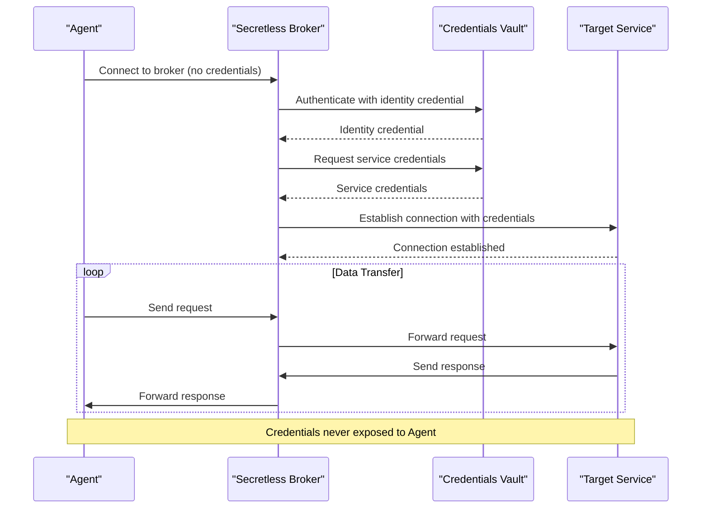
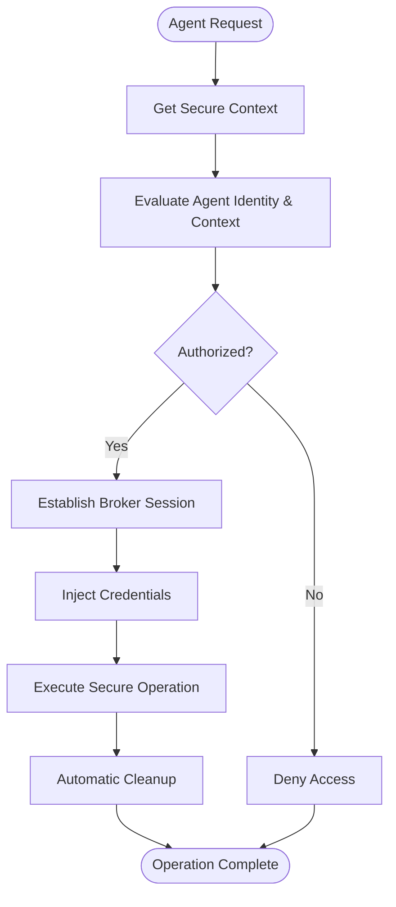
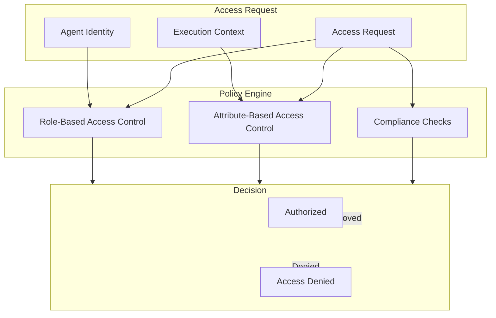
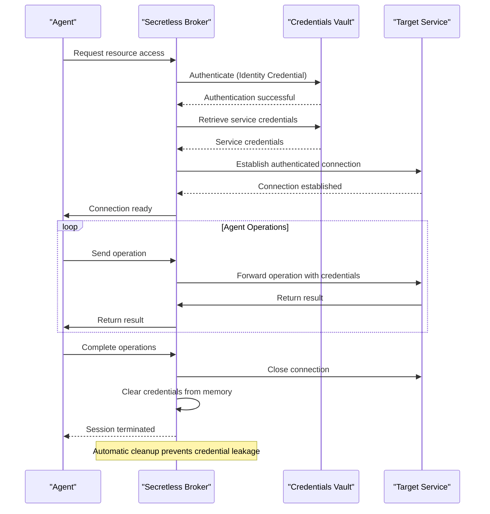

# Security Model and Credential Management

<cite>
**Referenced Files in This Document**   
- [credential_warehouse_agent.py](file://371-os/src/minds371/agents/utility/credential_warehouse_agent.py)
- [secretless-integration.ts](file://packages/enterprise-security/src/secretless-integration.ts)
- [aci-integration.ts](file://packages/enterprise-security/src/aci-integration.ts)
- [secretless.yml](file://config/security/secretless.yml)
- [start-with-security.sh](file://scripts/start-with-security.sh)
- [researchprotocol.md](file://thought_leadership/AASA/researchprotocol.md)
- [IMPLEMENTATION_GUIDE.md](file://IMPLEMENTATION_GUIDE.md)
</cite>

## Table of Contents
1. [Introduction](#introduction)
2. [Core Components of the Security Model](#core-components-of-the-security-model)
3. [Secretless Broker Integration](#secretless-broker-integration)
4. [Dynamic Credential Injection Architecture](#dynamic-credential-injection-architecture)
5. [ACI.dev Access Control Integration](#aci-dev-access-control-integration)
6. [Credential Lifecycle Management](#credential-lifecycle-management)
7. [Secure Execution Flow](#secure-execution-flow)
8. [Implementation Examples](#implementation-examples)
9. [Security Threat Mitigation](#security-threat-mitigation)
10. [Configuration and Policy Guidance](#configuration-and-policy-guidance)
11. [Compliance Considerations](#compliance-considerations)

## Introduction
The Universal Tool Server implements a robust security model designed to protect sensitive credentials while enabling seamless agent operations. This document details the integration of the Secretless Broker pattern and ACI.dev access control mechanisms to create a zero-trust credential management system. The architecture ensures that secrets are never exposed to agents or execution environments, mitigating risks of credential leakage, privilege escalation, and replay attacks. By combining dynamic credential injection with fine-grained access policies based on agent identity and context, the system provides enterprise-grade security for autonomous agent operations.

## Core Components of the Security Model

The security model consists of three primary components: the Secretless Broker for credential injection, the Credential Warehouse Agent for secure storage and access control, and the ACI.dev integration for identity-based access policies. These components work together to create a comprehensive security framework that protects credentials throughout their lifecycle.

The Credential Warehouse Agent serves as the central credential management system, providing secure storage, access control, and audit logging capabilities. It implements role-based access control where only authorized agents can retrieve or modify credentials. The agent enforces strict validation rules during credential creation and maintains detailed audit logs of all access attempts.

**Section sources**
- [credential_warehouse_agent.py](file://371-os/src/minds371/agents/utility/credential_warehouse_agent.py#L0-L203)

## Secretless Broker Integration

The Secretless Broker integration eliminates the need for agents to directly handle credentials by acting as a proxy between agents and target services. When an agent requires access to a protected service, it connects to the local Secretless Broker instance instead of connecting directly to the service. The broker authenticates with a secrets vault, retrieves the necessary credentials, and injects them into the connection request without exposing them to the agent.

This integration follows the standard Secretless workflow:
1. The agent connects to the local Secretless Broker
2. The broker authenticates with an external vault to obtain an identity credential
3. The broker uses the identity credential to retrieve secrets for the target service
4. The broker establishes a connection to the target service using the retrieved credentials
5. The broker seamlessly streams traffic between the agent and target service

The Secretless Broker supports various authentication methods including OAuth2, and can be configured to work with different credential stores. This abstraction allows agents to focus on their core functionality without implementing complex credential management logic.



**Diagram sources**
- [secretless-integration.ts](file://packages/enterprise-security/src/secretless-integration.ts)
- [researchprotocol.md](file://thought_leadership/AASA/researchprotocol.md#L858-L878)

## Dynamic Credential Injection Architecture

The dynamic credential injection architecture enables secure API access patterns by injecting credentials at runtime without exposing them to the agent code. This is achieved through a context-aware injection mechanism that evaluates agent identity, context, and policy rules before granting access.

The injection process follows these steps:
1. The agent requests a secure context from the SecretlessIntegration service
2. The service evaluates the agent's identity and context against policy rules
3. If authorized, the service establishes a secure session with the Secretless Broker
4. The broker injects credentials into the execution environment
5. The agent performs operations using the injected credentials
6. Credentials are automatically cleaned up when the session ends

This architecture ensures that credentials exist only in protected memory spaces managed by the broker and are never written to disk or exposed in environment variables. The injection is transparent to the agent, which simply performs its operations as if it had direct access to the service.



**Diagram sources**
- [secretless-integration.ts](file://packages/enterprise-security/src/secretless-integration.ts)
- [credential_warehouse_agent.py](file://371-os/src/minds371/agents/utility/credential_warehouse_agent.py#L116-L143)

## ACI.dev Access Control Integration

The integration with ACI.dev provides fine-grained access control based on agent identity, context, and policy rules. ACI.dev acts as a secure sandbox for AI agents, enforcing the principle of least privilege during external tool interactions. The access control system evaluates multiple factors including agent role, execution context, requested permissions, and compliance requirements.

Access decisions are made through a policy engine that evaluates rules defined in the security configuration. The system supports role-based access control (RBAC) and attribute-based access control (ABAC), allowing for complex policy definitions that consider multiple attributes of the agent and request.

The ACI.dev integration also provides secure deployment capabilities, ensuring that agents are deployed with appropriate security profiles and compliance frameworks. This includes device posture checks, endpoint security requirements, and secure connection enforcement.



**Diagram sources**
- [aci-integration.ts](file://packages/enterprise-security/src/aci-integration.ts)
- [researchprotocol.md](file://thought_leadership/AASA/researchprotocol.md#L1308-L1394)

## Credential Lifecycle Management

The credential management system implements comprehensive lifecycle management including lease management, rotation policies, and revocation mechanisms. Credentials are automatically rotated based on configurable schedules, and expired credentials are automatically revoked.

The Credential Warehouse Agent provides several key lifecycle management functions:
- **Lease Management**: Credentials are issued with time-limited leases that automatically expire
- **Rotation Policies**: Credentials can be configured with custom rotation intervals (e.g., every 15 days)
- **Revocation Mechanisms**: Credentials can be immediately revoked when no longer needed
- **Expiration Monitoring**: The system proactively identifies credentials approaching expiration

The benchmark example in the credential warehouse agent demonstrates these capabilities, showing how a database password can be rotated and how expiring credentials can be identified. The system maintains detailed audit logs of all lifecycle events, providing a complete chain of custody for credential management.

**Section sources**
- [credential_warehouse_agent.py](file://371-os/src/minds371/agents/utility/credential_warehouse_agent.py#L164-L192)

## Secure Execution Flow

The secure execution flow illustrates how credentials are retrieved, injected, and automatically cleaned up during agent operations. This flow ensures that secrets are protected throughout their entire lifecycle and never exposed to unauthorized components.

The execution flow begins when an agent requests access to a protected resource. The request is routed through the Secretless Broker, which handles authentication with the credentials vault. Once authenticated, the broker establishes a connection to the target service and begins streaming data between the agent and service.

Throughout the execution, the broker maintains control of the credentials, ensuring they remain in protected memory. When the agent completes its operations or the session times out, the broker automatically terminates the connection and clears the credentials from memory. This automatic cleanup prevents credential leakage and ensures that no residual secrets remain after execution.



**Diagram sources**
- [credential_warehouse_agent.py](file://371-os/src/minds371/agents/utility/credential_warehouse_agent.py)
- [start-with-security.sh](file://scripts/start-with-security.sh)

## Implementation Examples

The following examples demonstrate secure API access patterns using the Secretless Broker integration:

**Secretless Broker Configuration (YAML)**
```yaml
version: "2"
services:
  - name: elizaos-agents
    connector: generic_http
    authentication:
      - type: oauth2
        config:
          token_url: "${ACI_TOKEN_URL}"
          client_id: "${ACI_CLIENT_ID}"
          client_secret: "${ACI_CLIENT_SECRET}"
          scope: "agent:execute blockchain:read"
    config:
      headers:
        Authorization: "Bearer {{ .access_token }}"
```

**Secure Action Implementation (TypeScript)**
```typescript
export const secureAction: Action = {
  name: 'SECURE_OPERATION',
  handler: async (runtime, message, state, options, callback) => {
    const security = new SecretlessIntegration();
    
    return await security.injectCredentials(async () => {
      // Actual operation with injected credentials
      const result = await performSecureOperation();
      return result;
    });
  }
};
```

**Security Startup Script (Bash)**
```bash
#!/bin/bash
# Start Secretless Broker
secretless-broker -f config/security/secretless.yml &

# Wait for Secretless to be ready
sleep 5

# Start agents with security context
npm run start:agents:production
```

These examples show how the system can be configured to use OAuth2 authentication with ACI.dev, how secure actions can be implemented using the injectCredentials pattern, and how the security components can be started in the correct order.

**Section sources**
- [secretless.yml](file://config/security/secretless.yml)
- [secretless-integration.ts](file://packages/enterprise-security/src/secretless-integration.ts)
- [start-with-security.sh](file://scripts/start-with-security.sh)

## Security Threat Mitigation

The security model addresses several common threats through specific architectural and implementation choices:

**Credential Leakage Prevention**
- Secrets are never exposed to agent code or execution environments
- Credentials exist only in the protected memory space of the Secretless Broker
- Automatic cleanup ensures no residual secrets remain after execution
- Audit logs track all credential access attempts

**Privilege Escalation Protection**
- Principle of least privilege enforced through ACI.dev integration
- Role-based and attribute-based access control limit agent permissions
- Just-in-time access provisioning for sensitive operations
- Device posture checks prevent unauthorized access

**Replay Attack Defense**
- Time-limited credential leases prevent reuse of intercepted credentials
- One-time use tokens for sensitive operations
- Session-based authentication with automatic expiration
- Cryptographic verification of all requests

The combination of these measures creates a defense-in-depth approach that protects against multiple attack vectors while maintaining usability for legitimate agents.

**Section sources**
- [researchprotocol.md](file://thought_leadership/AASA/researchprotocol.md#L822-L837)
- [credential_warehouse_agent.py](file://371-os/src/minds371/agents/utility/credential_warehouse_agent.py)

## Configuration and Policy Guidance

Effective security requires proper configuration of policy rules, identity mapping, and audit logging. The following guidance provides best practices for configuring the security model:

**Policy Definition**
- Define granular policies based on agent role, context, and required permissions
- Implement least privilege principles by default
- Use attribute-based rules for complex access requirements
- Regularly review and update policies to reflect changing requirements

**Identity Mapping**
- Establish clear identity providers for agent authentication
- Implement multi-factor authentication for privileged agents
- Use consistent naming conventions for agent identities
- Map external identities to internal roles and permissions

**Audit Logging**
- Enable comprehensive logging for all credential access attempts
- Store logs in tamper-evident, immutable storage
- Implement separation of log storage from operational systems
- Configure automated alerts for suspicious activities

The IMPLEMENTATION_GUIDE.md provides detailed instructions for setting up the security components, including creating the security configuration directory, defining the secretless.yml configuration, and setting up the startup script.

**Section sources**
- [IMPLEMENTATION_GUIDE.md](file://IMPLEMENTATION_GUIDE.md)
- [credential_warehouse_agent.py](file://371-os/src/minds371/agents/utility/credential_warehouse_agent.py#L139-L166)

## Compliance Considerations

The security model addresses key compliance requirements for data privacy regulations and enterprise security standards:

**Data Privacy Regulations**
- GDPR: Implements data minimization and purpose limitation principles
- CCPA: Provides audit trails for data access and processing
- HIPAA: Ensures protected health information is never exposed to agents
- PCI DSS: Protects cardholder data through secure credential management

**Enterprise Security Standards**
- SOC 2: Supports security, availability, and confidentiality principles
- ISO 27001: Implements comprehensive information security controls
- NIST CSF: Aligns with identify, protect, detect, respond, and recover functions
- CIS Controls: Implements secure configuration and access control measures

The system's audit logging capabilities provide evidence for compliance audits, while the secure sandbox environment ensures that sensitive data remains protected. Regular security assessments, including penetration testing and data leakage assessments, help maintain compliance over time.

**Section sources**
- [researchprotocol.md](file://thought_leadership/AASA/researchprotocol.md#L1464-L1558)
- [credential_warehouse_agent.py](file://371-os/src/minds371/agents/utility/credential_warehouse_agent.py#L189-L202)