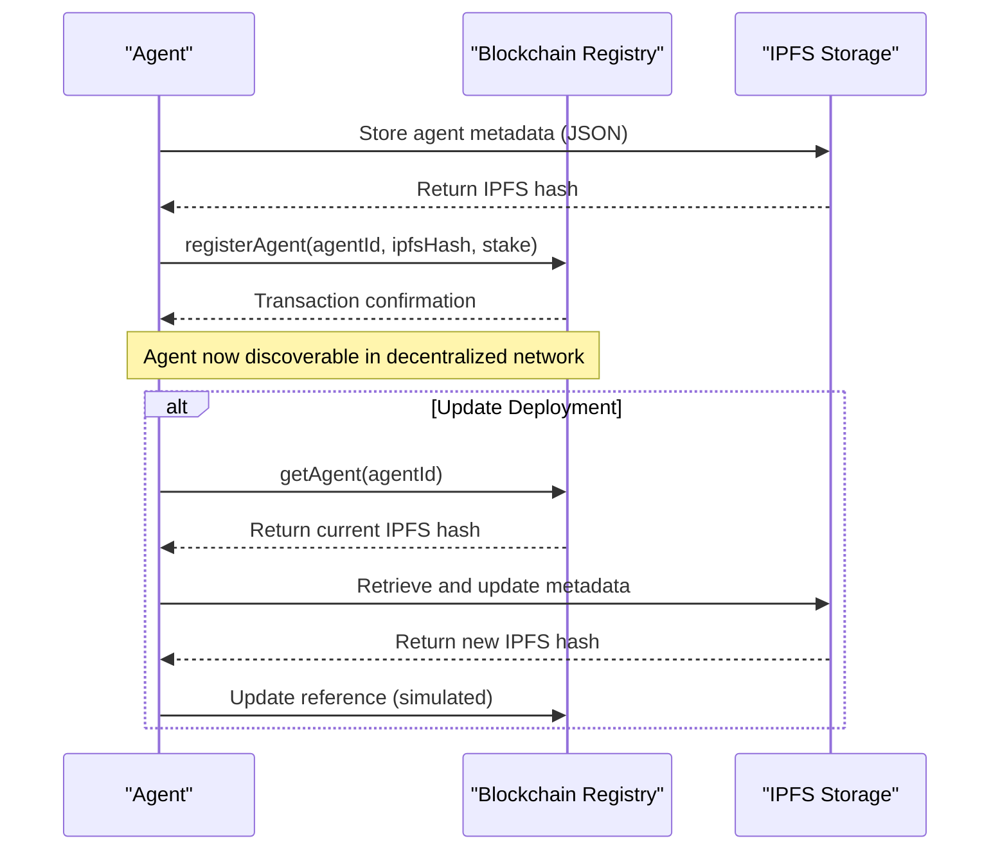
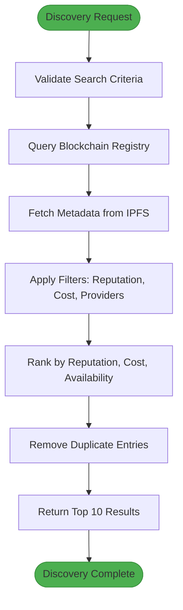
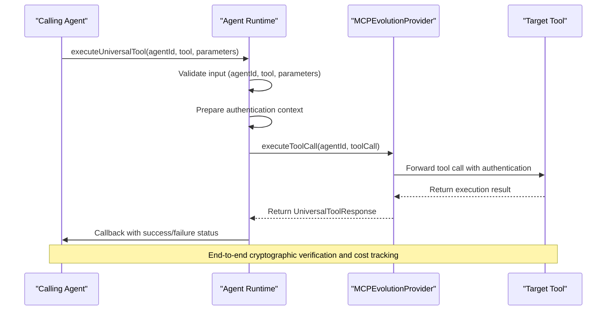
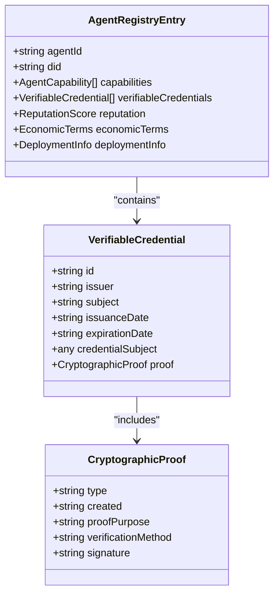
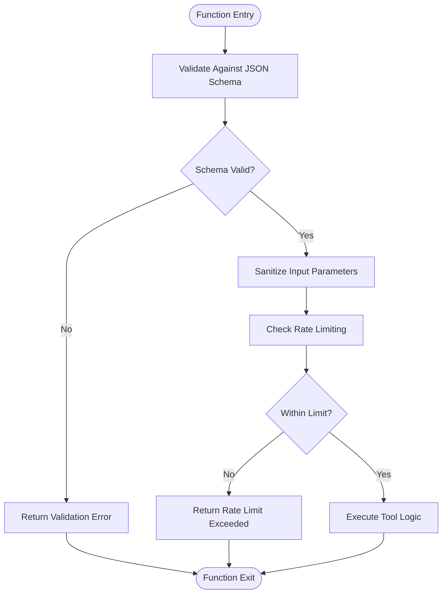
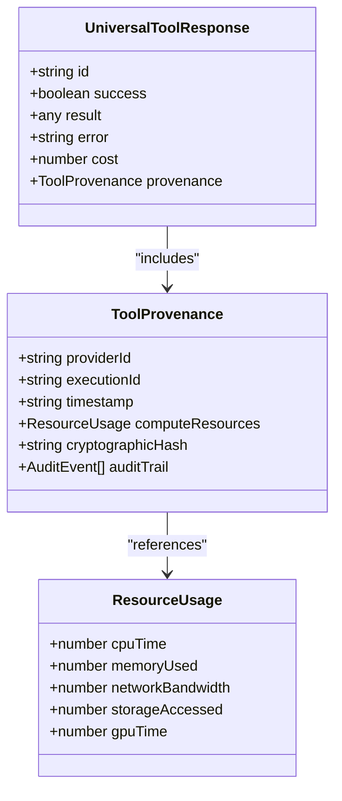
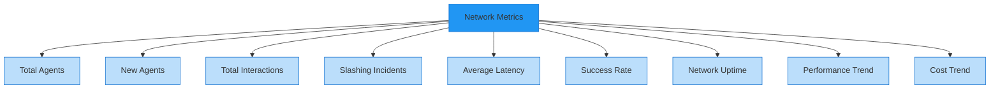

# Tool Registration and Invocation Workflow

<cite>
**Referenced Files in This Document**   
- [comet_371os_shortcuts.py](file://371-os/src/minds371/comet/comet_371os_shortcuts.py)
- [blockchain-registry.ts](file://packages/elizaos-plugins/universal-tool-server/src/blockchain-registry.ts)
- [types.ts](file://packages/elizaos-plugins/universal-tool-server/src/types.ts)
- [actions.ts](file://packages/elizaos-plugins/universal-tool-server/src/actions.ts)
- [ref-tools-mcp.md](file://371-os/src/minds371/mcp_servers/ref-tools-mcp.md)
</cite>

## Table of Contents
1. [Introduction](#introduction)
2. [Tool Registration Lifecycle](#tool-registration-lifecycle)
3. [Discovery and Selection Process](#discovery-and-selection-process)
4. [Invocation Protocol and Execution](#invocation-protocol-and-execution)
5. [Security and Trust Mechanisms](#security-and-trust-mechanisms)
6. [Error Handling and Resilience](#error-handling-and-resilience)
7. [Observability and Monitoring](#observability-and-monitoring)
8. [Code Examples and Usage Patterns](#code-examples-and-usage-patterns)
9. [Conclusion](#conclusion)

## Introduction
The Universal Tool Server provides a decentralized framework for agent-tool interaction that transcends traditional Model Context Protocol (MCP) limitations. This document details the complete workflow from tool registration and discovery to secure execution and performance monitoring. The system leverages blockchain-based registries, cryptographic verification, and economic coordination to enable trustless agent collaboration. At the core of this architecture is a comprehensive lifecycle management system that ensures tools are properly registered, securely executed, and continuously monitored for performance and reliability.

**Section sources**
- [actions.ts](file://packages/elizaos-plugins/universal-tool-server/src/actions.ts#L1-L50)
- [types.ts](file://packages/elizaos-plugins/universal-tool-server/src/types.ts#L1-L20)

## Tool Registration Lifecycle

The tool registration process establishes a verifiable identity for agents within the decentralized ecosystem. Agents register their capabilities on a blockchain-based registry, storing comprehensive metadata on IPFS while anchoring the hash on-chain for cryptographic verification.



**Diagram sources**
- [blockchain-registry.ts](file://packages/elizaos-plugins/universal-tool-server/src/blockchain-registry.ts#L100-L150)
- [types.ts](file://packages/elizaos-plugins/universal-tool-server/src/types.ts#L50-L100)

**Section sources**
- [blockchain-registry.ts](file://packages/elizaos-plugins/universal-tool-server/src/blockchain-registry.ts#L100-L150)
- [actions.ts](file://packages/elizaos-plugins/universal-tool-server/src/actions.ts#L50-L100)

## Discovery and Selection Process

The discovery mechanism enables agents to find compatible tools based on capability requirements, reputation scores, and economic constraints. The system queries a decentralized registry to identify agents with matching capabilities, applying filters for minimum reputation and maximum cost.



**Diagram sources**
- [blockchain-registry.ts](file://packages/elizaos-plugins/universal-tool-server/src/blockchain-registry.ts#L150-L250)
- [actions.ts](file://packages/elizaos-plugins/universal-tool-server/src/actions.ts#L125-L166)

**Section sources**
- [blockchain-registry.ts](file://packages/elizaos-plugins/universal-tool-server/src/blockchain-registry.ts#L150-L250)
- [actions.ts](file://packages/elizaos-plugins/universal-tool-server/src/actions.ts#L125-L166)

## Invocation Protocol and Execution

The Universal Tool Calling Protocol (UTCP) governs the execution of registered tools, ensuring secure and verifiable interactions. The protocol handles parameter validation, authentication delegation, and provenance tracking for every tool invocation.



**Diagram sources**
- [actions.ts](file://packages/elizaos-plugins/universal-tool-server/src/actions.ts#L168-L244)
- [types.ts](file://packages/elizaos-plugins/universal-tool-server/src/types.ts#L20-L40)

**Section sources**
- [actions.ts](file://packages/elizaos-plugins/universal-tool-server/src/actions.ts#L168-L244)
- [types.ts](file://packages/elizaos-plugins/universal-tool-server/src/types.ts#L20-L40)

## Security and Trust Mechanisms

The Universal Tool Server implements a multi-layered security model that combines cryptographic verification, economic incentives, and runtime protection to ensure secure tool execution.

### Code Signing and Verification
All agent registrations include verifiable credentials that establish cryptographic identity. The system uses decentralized identifiers (DIDs) and digital signatures to verify agent authenticity.



**Diagram sources**
- [types.ts](file://packages/elizaos-plugins/universal-tool-server/src/types.ts#L60-L90)
- [blockchain-registry.ts](file://packages/elizaos-plugins/universal-tool-server/src/blockchain-registry.ts#L100-L150)

### Input Validation and Sanitization
The system implements comprehensive input validation to prevent injection attacks and ensure data integrity. All parameters are validated against JSON schemas defined in the agent's capability declaration.



**Diagram sources**
- [types.ts](file://packages/elizaos-plugins/universal-tool-server/src/types.ts#L70-L80)
- [actions.ts](file://packages/elizaos-plugins/universal-tool-server/src/actions.ts#L168-L244)

**Section sources**
- [types.ts](file://packages/elizaos-plugins/universal-tool-server/src/types.ts#L60-L90)
- [actions.ts](file://packages/elizaos-plugins/universal-tool-server/src/actions.ts#L168-L244)

## Error Handling and Resilience

The system implements comprehensive error handling patterns to ensure resilience against failures, timeouts, and version mismatches.

### Timeout Management
All external operations include timeout protection to prevent hanging requests and resource exhaustion.

```typescript
const timeoutProvider: Provider = {
  name: 'TIMEOUT_SAFE',
  get: async (runtime, message) => {
    try {
      const fetchData = async () => {
        const service = runtime.getService('externalAPI');
        if (!service) {
          return { values: {}, data: {}, text: '' };
        }
        const data = await service.fetchData();
        return {
          values: { apiData: data.summary },
          data: { apiData: data },
          text: `API data: ${data.summary}`,
        };
      };

      const result = await Promise.race([
        fetchData(),
        new Promise((_, reject) => setTimeout(() => reject(new Error('Timeout')), 5000)),
      ]);
      return result;
    } catch (error) {
      runtime.logger.warn(`Provider TIMEOUT_SAFE timed out`);
      return { values: {}, data: {}, text: '' };
    }
  },
};
```

### Retry Logic with Exponential Backoff
Critical operations implement retry logic with exponential backoff to handle transient failures.

```typescript
export async function withRetry<T>(
  operation: () => Promise<T>,
  options: {
    maxAttempts?: number;
    delay?: number;
    backoff?: number;
    onError?: (error: Error, attempt: number) => void;
  } = {}
): Promise<T> {
  const {
    maxAttempts = 3,
    delay = 1000,
    backoff = 2,
    onError
  } = options;

  let lastError: Error;

  for (let attempt = 1; attempt <= maxAttempts; attempt++) {
    try {
      return await operation();
    } catch (error) {
      lastError = error;
      onError?.(error, attempt);

      if (attempt < maxAttempts) {
        const waitTime = delay * Math.pow(backoff, attempt - 1);
        elizaLogger.warn(`Attempt ${attempt} failed, retrying in ${waitTime}ms`, {
          error: error.message
        });
        await new Promise(resolve => setTimeout(resolve, waitTime));
      }
    }
  }

  throw lastError;
}
```

**Section sources**
- [elizaos/Guides/State Management.md](file://elizaos/Guides/State Management.md#L833-L931)
- [elizaos/Plugins/DeFi Plugins/Solana/Developer Guide.md](file://elizaos/Plugins/DeFi Plugins/Solana/Developer Guide.md#L583-L641)

## Observability and Monitoring

The system provides comprehensive observability features for execution logging, performance monitoring, and audit trails.

### Execution Provenance and Audit Trails
Every tool execution generates a verifiable provenance record that includes cryptographic hashes and detailed audit trails.



**Diagram sources**
- [types.ts](file://packages/elizaos-plugins/universal-tool-server/src/types.ts#L240-L270)
- [actions.ts](file://packages/elizaos-plugins/universal-tool-server/src/actions.ts#L204-L244)

### Performance Metrics and Network Health
The system monitors network-wide performance metrics, including latency, reliability, and cost efficiency.



**Diagram sources**
- [blockchain-registry.ts](file://packages/elizaos-plugins/universal-tool-server/src/blockchain-registry.ts#L300-L400)
- [actions.ts](file://packages/elizaos-plugins/universal-tool-server/src/actions.ts#L450-L500)

**Section sources**
- [types.ts](file://packages/elizaos-plugins/universal-tool-server/src/types.ts#L240-L270)
- [blockchain-registry.ts](file://packages/elizaos-plugins/universal-tool-server/src/blockchain-registry.ts#L300-L400)
- [actions.ts](file://packages/elizaos-plugins/universal-tool-server/src/actions.ts#L450-L500)

## Code Examples and Usage Patterns

### Tool Publishing Pattern
Agents register their capabilities in the decentralized registry with comprehensive metadata.

```typescript
// Register agent capabilities in blockchain registry
const registryEntry: AgentRegistryEntry = {
  agentId: runtime.agentId,
  did: `did:371minds:${runtime.agentId}`,
  capabilities: [
    {
      toolId: "dev-doc-generator",
      name: "Generate Developer Documentation",
      description: "Convert business requirements to technical specifications",
      inputSchema: {
        type: "object",
        properties: {
          businessAsset: { type: "string" }
        },
        required: ["businessAsset"]
      },
      outputSchema: {
        type: "object",
        properties: {
          specification: { type: "string" }
        }
      },
      costModel: {
        basePrice: 0.05,
        scalingFactors: [
          { metric: "complexity", multiplier: 1.2 }
        ]
      },
      permissions: ["read:business-assets"],
      availability: { schedule: "24/7" }
    }
  ],
  verifiableCredentials: [],
  reputation: { overall: 0.5, categories: [], history: [], attestations: [], slashingHistory: [] },
  economicTerms: {
    paymentModel: "per-call",
    basePrice: 0.05,
    currency: "AKT",
    escrowRequired: true
  },
  deploymentInfo: {
    platforms: [
      {
        platform: "jetbrains-extension",
        endpoint: "https://tools.371minds.com/dev-docs",
        authentication: { type: "oauth2" },
        capabilities: ["dev-doc-generator"],
        limitations: []
      }
    ],
    constraints: {},
    monitoring: {}
  }
};

// Register with blockchain
const txHash = await registryProvider.registerAgent(registryEntry);
```

### Tool Consumption Pattern
Agents discover and execute tools from the decentralized registry.

```typescript
// Discover tools by capability
const searchCriteria = {
  capabilities: ["dev-doc-generator"],
  minReputation: 0.7,
  maxCost: 0.1
};

const availableTools = await registryProvider.discoverTools(searchCriteria);

// Execute tool call
const toolCall: UniversalToolCall = {
  id: `call_${Date.now()}_${Math.random().toString(36).substr(2, 9)}`,
  tool: "generate-dev-docs",
  parameters: {
    businessAsset: "community strategy document"
  },
  authentication: {
    method: "delegated-oauth",
    credentials: {
      userId: runtime.userId,
      delegationToken: options.delegationToken,
      scope: ["read", "write"],
      expiresAt: new Date(Date.now() + 3600000).toISOString()
    }
  },
  context: {
    userId: runtime.userId,
    sessionId: state.sessionId,
    platform: runtime.platform || 'eliza-os',
    capabilities: runtime.capabilities || [],
    preferences: options.userPreferences || {},
    budget: options.budgetConstraints
  }
};

const response: UniversalToolResponse = await mcpProvider.executeToolCall(
  availableTools[0].agentId, 
  toolCall
);
```

### Automation Workflow Definition
The comet_371os_shortcuts.py file defines executable shortcuts for common automation workflows.

```python
# Save as: comet_371os_shortcuts.py
COMET_SHORTCUTS = {
    "/generate-dev-docs": {
        "prompt": """
        You are a Lead Systems Architect for 371OS. Convert business requirements 
        into technical specifications for JetBrains development environment.
        
        Input: Business asset (community strategy, agent behavior spec)
        Output: Developer_Specification.md with:
        - File locations in src/minds371/
        - Dependencies and integrations
        - Core functions and data schemas
        - Implementation roadmap
        """,
        "output_format": "markdown",
        "integration": "jetbrains_space"
    },
    "/prototype-agent-workflow": {
        "prompt": """
        Design and validate C-Suite agent workflow for 371OS:
        - Community data ingestion pipeline
        - Decision-making logic
        - Action execution framework
        - Cross-agent communication protocols
        """,
        "output_format": "workflow_diagram",
        "integration": "youtrack_workflow"
    }
}
```

**Section sources**
- [comet_371os_shortcuts.py](file://371-os/src/minds371/comet/comet_371os_shortcuts.py#L1-L29)
- [actions.ts](file://packages/elizaos-plugins/universal-tool-server/src/actions.ts#L50-L100)
- [ref-tools-mcp.md](file://371-os/src/minds371/mcp_servers/ref-tools-mcp.md#L1-L32)

## Conclusion
The Universal Tool Server represents a significant evolution beyond traditional MCP implementations, providing a decentralized, secure, and economically coordinated framework for agent-tool interaction. By leveraging blockchain-based registries, cryptographic verification, and economic incentives, the system enables trustless collaboration between agents while maintaining strong security and performance guarantees. The comprehensive lifecycle management from registration to execution ensures that tools are properly discovered, securely invoked, and continuously monitored for reliability and efficiency. This architecture enables a new paradigm of decentralized AI agent ecosystems where capabilities can be shared, verified, and monetized in a trustless manner.