# Universal Tool Server Architecture

<cite>
**Referenced Files in This Document**   
- [blockchain-registry.ts](file://os-workspace\packages\universal-tool-server\src\blockchain-registry.ts) - *Updated in recent commit*
- [types.ts](file://os-workspace\packages\universal-tool-server\src\types.ts) - *Updated in recent commit*
- [index.ts](file://os-workspace\packages\universal-tool-server\src\index.ts) - *Updated in recent commit*
- [universal_mcp_architecture.md](file://371-os\docs\architecture\universal_mcp_architecture.md) - *Added in recent commit*
- [comet_371os_shortcuts.py](file://_legacy\comet\comet_371os_shortcuts.py)
</cite>

## Update Summary
**Changes Made**   
- Integrated Universal MCP Architecture concepts into the Universal Tool Server documentation
- Added cross-platform compatibility requirements and blockchain coordination principles
- Enhanced security model with Zero-Trust Architecture details
- Updated component diagrams to reflect MCP evolution
- Added implementation guidelines for cross-platform MCP development

## Table of Contents
1. [Introduction](#introduction)
2. [Core Architecture Components](#core-architecture-components)
3. [Blockchain-Based Coordination System](#blockchain-based-coordination-system)
4. [IPFS Integration for Persistent Storage](#ipfs-integration-for-persistent-storage)
5. [Security Model](#security-model)
6. [Tool Registration, Discovery, and Invocation Workflows](#tool-registration-discovery-and-invocation-workflows)
7. [Scalability and Fault Tolerance](#scalability-and-fault-tolerance)
8. [Economic Incentive Models](#economic-incentive-models)
9. [Implementation Examples](#implementation-examples)
10. [Component Diagrams](#component-diagrams)

## Introduction
The Universal Tool Server (UTS) in 371OS represents a paradigm shift in AI agent tool coordination, moving from centralized, stateful architectures to a decentralized, blockchain-based model. This architecture enables trustless agent discovery, capability verification, and economic coordination without reliance on centralized authorities. The system leverages blockchain technology for establishing cryptographic trust, IPFS for decentralized storage of tool configurations, and integrates with distributed infrastructure providers like Akash Network for scalable tool hosting. This document provides a comprehensive analysis of the UTS architecture, detailing its components, workflows, security model, and implementation patterns.

## Core Architecture Components

The Universal Tool Server architecture consists of several key components that work together to enable decentralized agent tool sharing and execution. The core components include the Blockchain Registry Provider, Universal Tool Server Actions, and integration with external infrastructure providers.

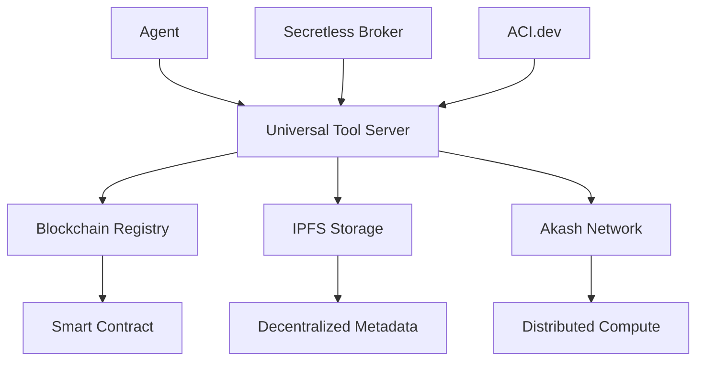

**Diagram sources**
- [index.ts](file://os-workspace\packages\universal-tool-server\src\index.ts#L1-L16) - *Updated in recent commit*
- [blockchain-registry.ts](file://os-workspace\packages\universal-tool-server\src\blockchain-registry.ts#L1-L400) - *Updated in recent commit*

**Section sources**
- [index.ts](file://os-workspace\packages\universal-tool-server\src\index.ts#L1-L16) - *Updated in recent commit*
- [blockchain-registry.ts](file://os-workspace\packages\universal-tool-server\src\blockchain-registry.ts#L1-L400) - *Updated in recent commit*

## Blockchain-Based Coordination System

The Universal Tool Server implements a stateless, blockchain-based coordination system that enables decentralized agent tool sharing and execution. This system leverages blockchain technology for agent discovery, capability verification, and trust establishment through cryptographic proofs and economic incentives.

### Agent Registry and Discovery
The Blockchain Registry Provider serves as the core component for agent discovery and reputation management. It implements a decentralized registry where agents can register their capabilities and be discovered by other agents without centralized coordination.

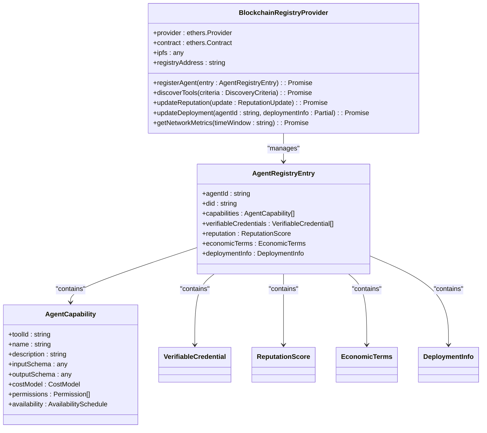

**Diagram sources**
- [blockchain-registry.ts](file://os-workspace\packages\universal-tool-server\src\blockchain-registry.ts#L1-L400) - *Updated in recent commit*
- [types.ts](file://os-workspace\packages\universal-tool-server\src\types.ts#L1-L271) - *Updated in recent commit*

**Section sources**
- [blockchain-registry.ts](file://os-workspace\packages\universal-tool-server\src\blockchain-registry.ts#L1-L400) - *Updated in recent commit*
- [types.ts](file://os-workspace\packages\universal-tool-server\src\types.ts#L1-L271) - *Updated in recent commit*

### Capability Verification and Trust Establishment
The system establishes trust through a combination of verifiable credentials, reputation scoring, and economic incentives. Agents can verify each other's capabilities through cryptographic proofs stored on the blockchain.

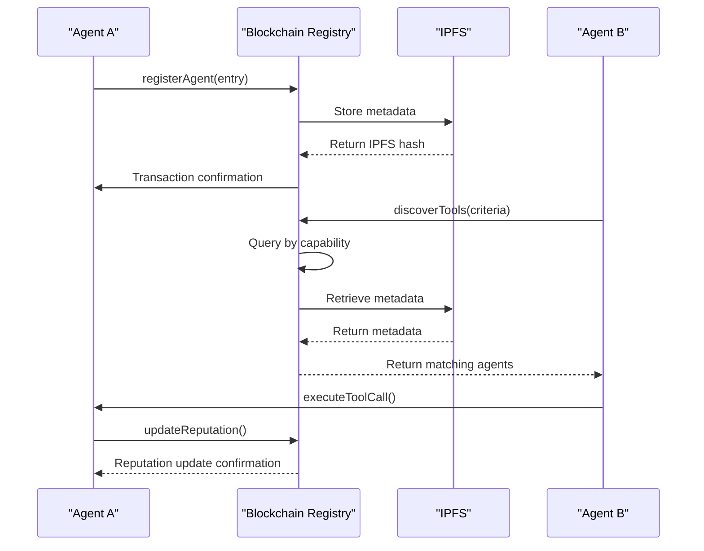

**Diagram sources**
- [blockchain-registry.ts](file://os-workspace\packages\universal-tool-server\src\blockchain-registry.ts#L1-L400) - *Updated in recent commit*
- [types.ts](file://os-workspace\packages\universal-tool-server\src\types.ts#L1-L271) - *Updated in recent commit*

**Section sources**
- [blockchain-registry.ts](file://os-workspace\packages\universal-tool-server\src\blockchain-registry.ts#L1-L400) - *Updated in recent commit*
- [types.ts](file://os-workspace\packages\universal-tool-server\src\types.ts#L1-L271) - *Updated in recent commit*

## IPFS Integration for Persistent Storage

The Universal Tool Server leverages IPFS (InterPlanetary File System) for persistent storage of tool configurations and execution artifacts. This decentralized storage approach ensures that agent metadata and tool configurations are available even if individual nodes go offline.

### Metadata Storage Pattern
Agent metadata, including capabilities, tool definitions, and reputation history, is stored on IPFS with the content hash registered on the blockchain. This separation of data and metadata enables efficient discovery while ensuring data persistence.

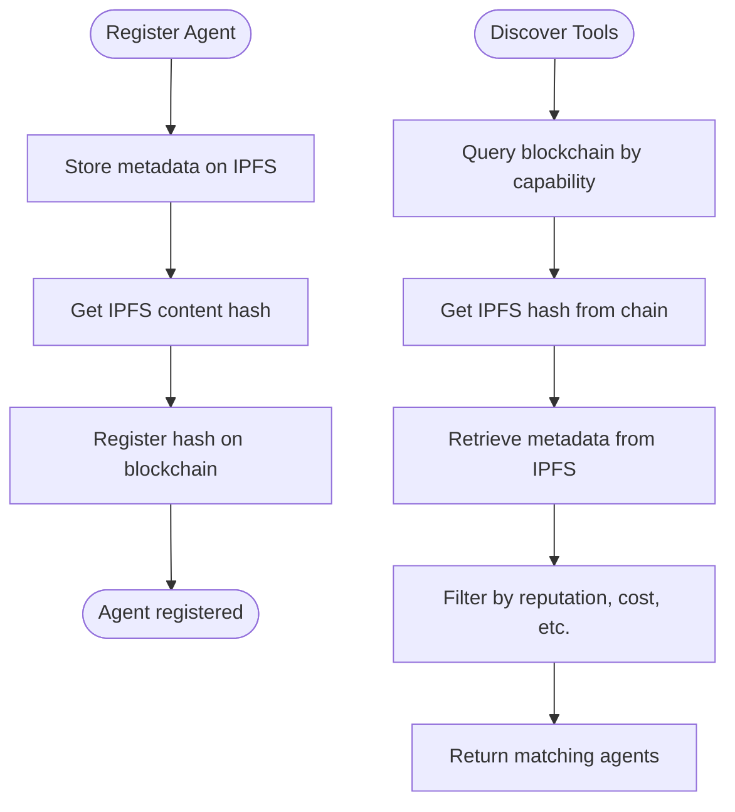

**Diagram sources**
- [blockchain-registry.ts](file://os-workspace\packages\universal-tool-server\src\blockchain-registry.ts#L1-L400) - *Updated in recent commit*
- [types.ts](file://os-workspace\packages\universal-tool-server\src\types.ts#L1-L271) - *Updated in recent commit*

**Section sources**
- [blockchain-registry.ts](file://os-workspace\packages\universal-tool-server\src\blockchain-registry.ts#L1-L400) - *Updated in recent commit*
- [types.ts](file://os-workspace\packages\universal-tool-server\src\types.ts#L1-L271) - *Updated in recent commit*

## Security Model

The Universal Tool Server implements a comprehensive security model that addresses credential management, access control, and secure execution of agent tools.

### Secretless Broker Integration
The system integrates with Secretless Broker to eliminate credential exposure in applications. This approach ensures that applications never handle or store sensitive credentials directly.

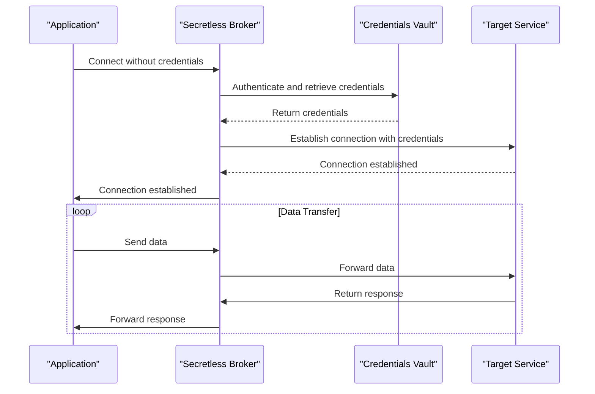

**Section sources**
- [universal_mcp_architecture.md](file://371-os\docs\architecture\universal_mcp_architecture.md#L1-L240) - *Added in recent commit*

### ACI.dev for Access Control
ACI.dev serves as a secure execution layer for AI agents, enforcing the principle of least privilege when interacting with external tools and APIs. This secure sandbox ensures that agents only have the minimum permissions necessary for their tasks.

**Section sources**
- [universal_mcp_architecture.md](file://371-os\docs\architecture\universal_mcp_architecture.md#L1-L240) - *Added in recent commit*

### Zero-Trust Architecture
The Universal Tool Server implements a Zero-Trust Architecture based on NIST 800-207 ZTA tenets, ensuring per-session least-privilege access, dynamic policy enforcement, and continuous telemetry collection.

**Section sources**
- [universal_mcp_architecture.md](file://371-os\docs\architecture\universal_mcp_architecture.md#L1-L240) - *Added in recent commit*

## Tool Registration, Discovery, and Invocation Workflows

The Universal Tool Server implements a comprehensive workflow for tool registration, discovery, and invocation that leverages blockchain for trust and IPFS for decentralized storage.

### Tool Registration Workflow
Agents register their capabilities in the decentralized registry, making them discoverable by other agents. The registration process involves storing metadata on IPFS and registering the content hash on the blockchain.

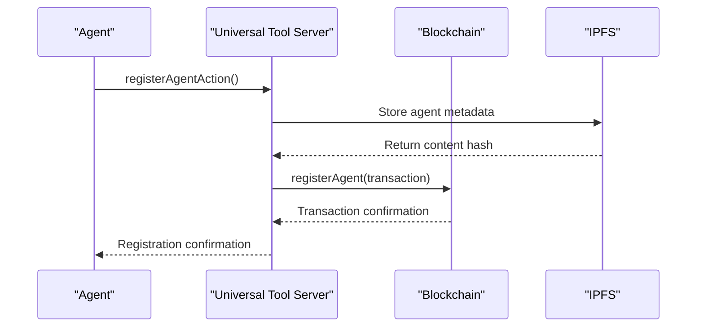

**Diagram sources**
- [blockchain-registry.ts](file://os-workspace\packages\universal-tool-server\src\blockchain-registry.ts#L1-L400) - *Updated in recent commit*
- [types.ts](file://os-workspace\packages\universal-tool-server\src\types.ts#L1-L271) - *Updated in recent commit*

### Tool Discovery Workflow
Agents can discover tools based on capability requirements, reputation filters, and cost constraints. The discovery process queries the blockchain registry and retrieves detailed metadata from IPFS.

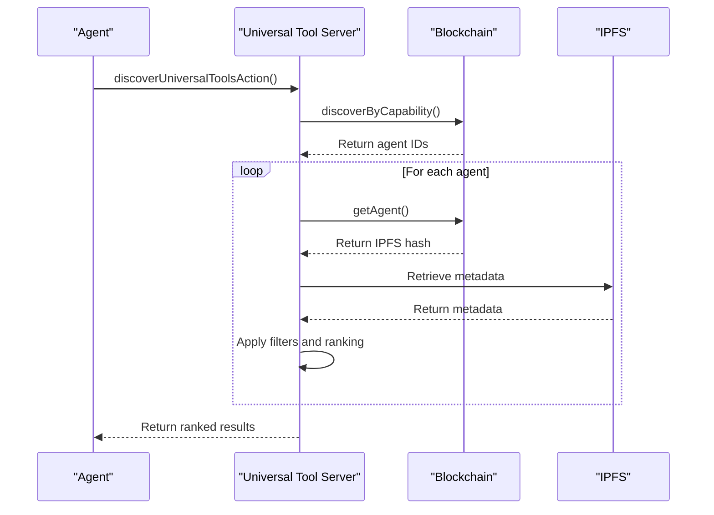

**Diagram sources**
- [blockchain-registry.ts](file://os-workspace\packages\universal-tool-server\src\blockchain-registry.ts#L1-L400) - *Updated in recent commit*
- [types.ts](file://os-workspace\packages\universal-tool-server\src\types.ts#L1-L271) - *Updated in recent commit*

### Tool Invocation Workflow
Once a tool is discovered, agents can invoke it using the Universal Tool Calling Protocol (UTCP) with automatic authentication, cost management, and provenance tracking.

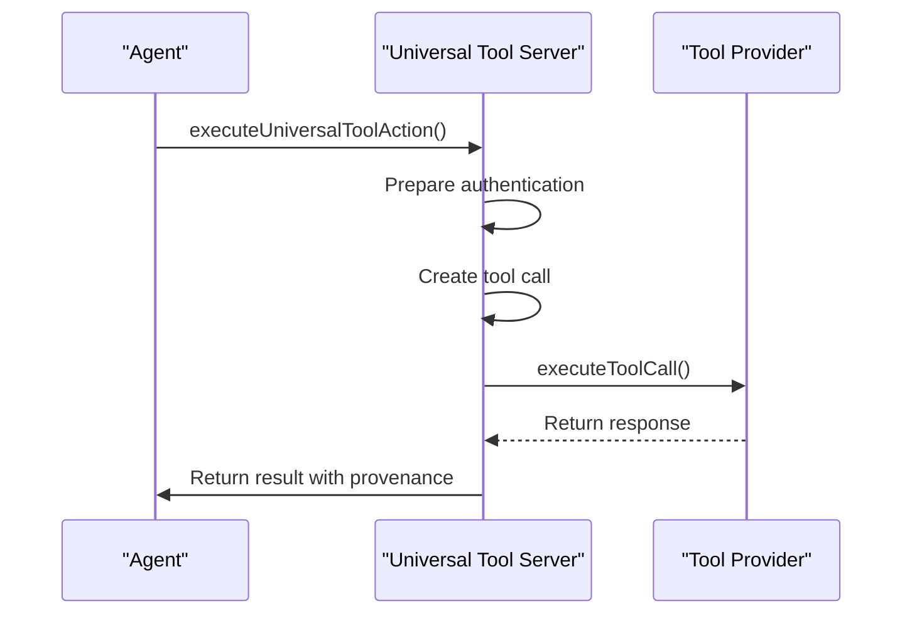

**Diagram sources**
- [blockchain-registry.ts](file://os-workspace\packages\universal-tool-server\src\blockchain-registry.ts#L1-L400) - *Updated in recent commit*
- [types.ts](file://os-workspace\packages\universal-tool-server\src\types.ts#L1-L271) - *Updated in recent commit*

**Section sources**
- [blockchain-registry.ts](file://os-workspace\packages\universal-tool-server\src\blockchain-registry.ts#L1-L400) - *Updated in recent commit*
- [types.ts](file://os-workspace\packages\universal-tool-server\src\types.ts#L1-L271) - *Updated in recent commit*

## Scalability and Fault Tolerance

The Universal Tool Server architecture is designed for scalability and fault tolerance through distributed tool hosting and redundant tool instances.

### Distributed Tool Hosting
The system integrates with Akash Network for distributed infrastructure hosting, enabling agents to deploy their tools across multiple regions and providers.

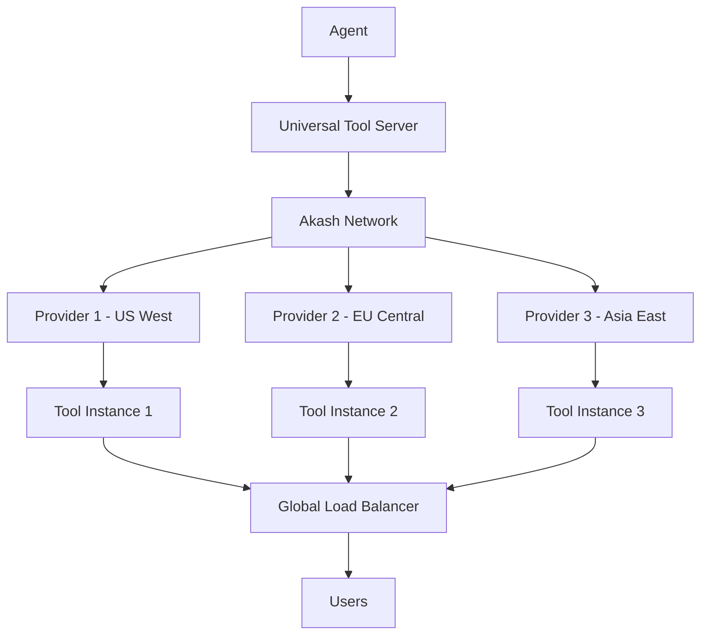

**Section sources**
- [blockchain-registry.ts](file://os-workspace\packages\universal-tool-server\src\blockchain-registry.ts#L1-L400) - *Updated in recent commit*
- [types.ts](file://os-workspace\packages\universal-tool-server\src\types.ts#L1-L271) - *Updated in recent commit*

### Fault Tolerance through Redundancy
The architecture supports redundant tool instances across multiple providers and regions, ensuring high availability and fault tolerance.

**Section sources**
- [blockchain-registry.ts](file://os-workspace\packages\universal-tool-server\src\blockchain-registry.ts#L1-L400) - *Updated in recent commit*
- [types.ts](file://os-workspace\packages\universal-tool-server\src\types.ts#L1-L271) - *Updated in recent commit*

## Economic Incentive Models

The Universal Tool Server implements economic incentive models that reward reliable tool providers through staking mechanisms, reputation systems, and payment escrow.

### Staking and Reputation System
Agents must stake tokens to register their tools, with the stake amount determined by the complexity and risk level of their capabilities. This staking mechanism aligns incentives and discourages malicious behavior.

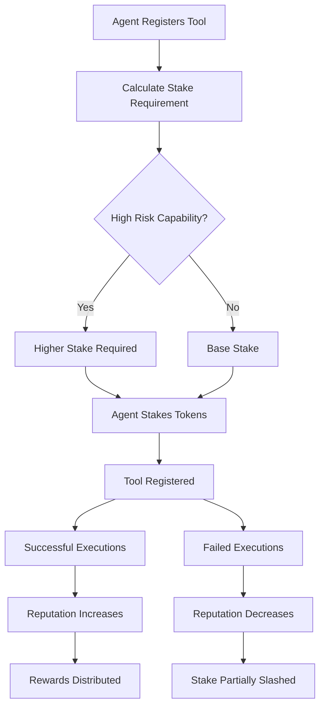

**Section sources**
- [blockchain-registry.ts](file://os-workspace\packages\universal-tool-server\src\blockchain-registry.ts#L1-L400) - *Updated in recent commit*
- [types.ts](file://os-workspace\packages\universal-tool-server\src\types.ts#L1-L271) - *Updated in recent commit*

### Payment and Escrow Mechanism
The system implements a payment escrow mechanism where payments are held until the tool execution is verified for quality, ensuring that providers are only rewarded for successful outcomes.

**Section sources**
- [blockchain-registry.ts](file://os-workspace\packages\universal-tool-server\src\blockchain-registry.ts#L1-L400) - *Updated in recent commit*
- [types.ts](file://os-workspace\packages\universal-tool-server\src\types.ts#L1-L271) - *Updated in recent commit*

## Implementation Examples

The Universal Tool Server architecture is demonstrated through implementation examples that show workspace automation and tool orchestration capabilities.

### Workspace Automation with Comet Shortcuts
The `comet_371os_shortcuts.py` file demonstrates how the Universal Tool Server can be used for workspace automation through predefined shortcuts that trigger specific workflows.

```python
# comet_371os_shortcuts.py
COMET_SHORTCUTS = {
    "/generate-dev-docs": {
        "prompt": """
        You are a Lead Systems Architect for 371OS. Convert business requirements 
        into technical specifications for JetBrains development environment.
        
        Input: Business asset (community strategy, agent behavior spec)
        Output: Developer_Specification.md with:
        - File locations in src/minds371/
        - Dependencies and integrations
        - Core functions and data schemas
        - Implementation roadmap
        """,
        "output_format": "markdown",
        "integration": "jetbrains_space"
    },
    "/prototype-agent-workflow": {
        "prompt": """
        Design and validate C-Suite agent workflow for 371OS:
        - Community data ingestion pipeline
        - Decision-making logic
        - Action execution framework
        - Cross-agent communication protocols
        """,
        "output_format": "workflow_diagram",
        "integration": "youtrack_workflow"
    }
}
```

This implementation shows how the Universal Tool Server can be used to automate common development tasks by triggering specific agent workflows based on user commands. The shortcuts integrate with development platforms like JetBrains Space and YouTrack to generate documentation and workflow diagrams automatically.

**Section sources**
- [comet_371os_shortcuts.py](file://_legacy\comet\comet_371os_shortcuts.py#L1-L29)

## Component Diagrams

### Universal Tool Server Architecture Overview
The following diagram illustrates the complete architecture of the Universal Tool Server, showing the interactions between agents, the Universal Tool Server, blockchain registry, and external infrastructure providers.

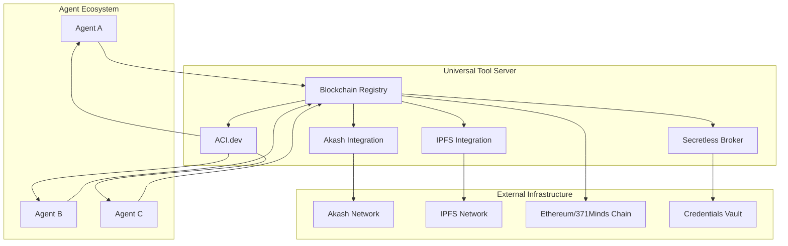

**Diagram sources**
- [index.ts](file://os-workspace\packages\universal-tool-server\src\index.ts#L1-L16) - *Updated in recent commit*
- [blockchain-registry.ts](file://os-workspace\packages\universal-tool-server\src\blockchain-registry.ts#L1-L400) - *Updated in recent commit*
- [types.ts](file://os-workspace\packages\universal-tool-server\src\types.ts#L1-L271) - *Updated in recent commit*

### Tool Orchestration Workflow
The following diagram illustrates the complete workflow for tool orchestration in the Universal Tool Server, from registration to execution and reputation update.

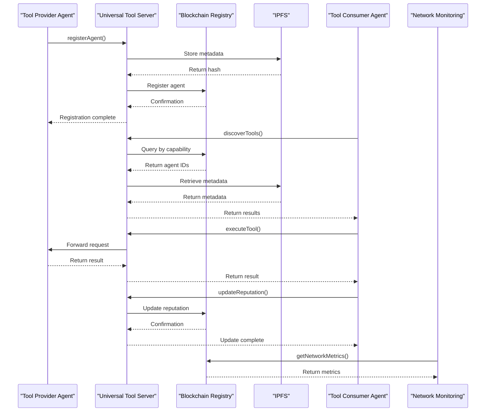

**Diagram sources**
- [blockchain-registry.ts](file://os-workspace\packages\universal-tool-server\src\blockchain-registry.ts#L1-L400) - *Updated in recent commit*
- [types.ts](file://os-workspace\packages\universal-tool-server\src\types.ts#L1-L271) - *Updated in recent commit*