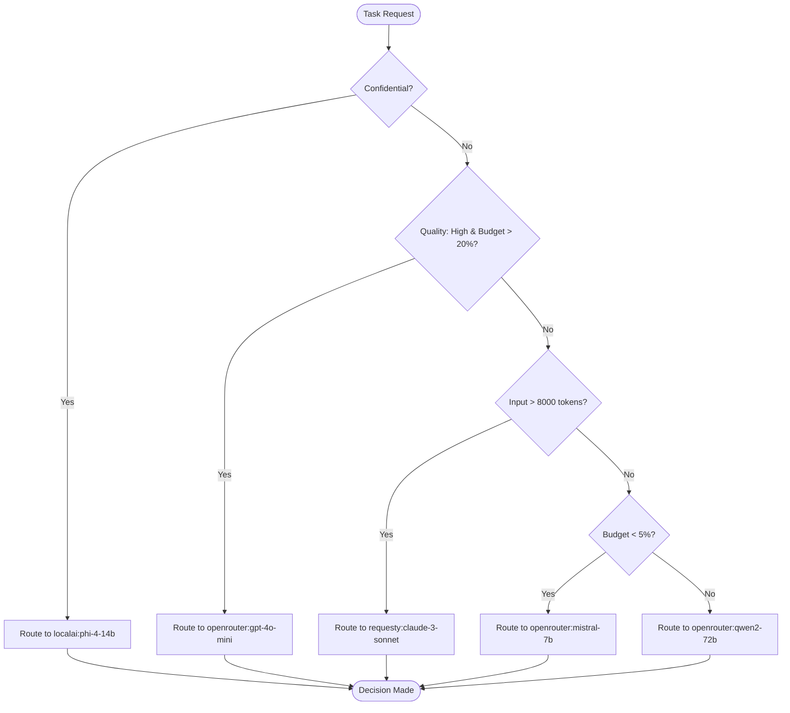
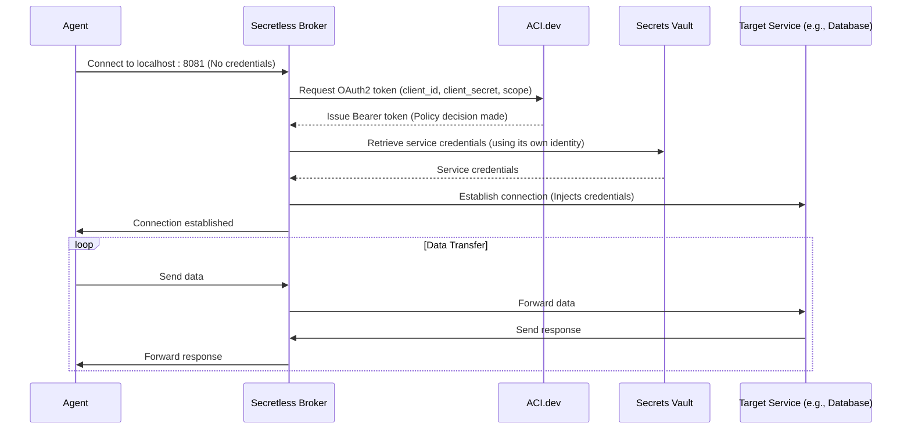

# ACI.dev Policy Enforcement

<cite>
**Referenced Files in This Document**   
- [Consulting\Legal and Compliance Guide.txt](file://Consulting/Legal and Compliance Guide.txt)
- [thought_leadership\AASA\researchprotocol.md](file://thought_leadership/AASA/researchprotocol.md)
- [IMPLEMENTATION_GUIDE.md](file://IMPLEMENTATION_GUIDE.md)
- [sotalogic\Claude Sonnet 4\Alignment Review of 371OS_launch Project Plan\now can you create a guide for me .md](file://sotalogic/Claude Sonnet 4/Alignment Review of 371OS_launch Project Plan/now can you create a guide for me .md)
- [371-os\src\minds371\adaptive_llm_router\policy_engine.py](file://371-os/src/minds371/adaptive_llm_router/policy_engine.py)
- [371-os\src\minds371\adaptive_llm_router\budget_guard.py](file://371-os/src/minds371/adaptive_llm_router/budget_guard.py)
</cite>

## Table of Contents
1. [Introduction](#introduction)
2. [ACI.dev as the Central Policy Decision Point](#aci.dev-as-the-central-policy-decision-point)
3. [Policy Evaluation Logic: ABAC and RBAC Models](#policy-evaluation-logic-abac-and-rbac-models)
4. [Policy Language Syntax and Structure](#policy-language-syntax-and-structure)
5. [Policy Definition Examples](#policy-definition-examples)
6. [Integration Flow: Agents, Secretless Broker, and ACI.dev](#integration-flow-agents-secretless-broker-and-aci.dev)
7. [Monitoring and Auditing Policy Decisions](#monitoring-and-auditing-policy-decisions)
8. [Policy Versioning, Testing, and Deployment](#policy-versioning-testing-and-deployment)
9. [Conclusion](#conclusion)

## Introduction
This document provides a comprehensive overview of ACI.dev's role in enforcing zero-trust security within the 371 OS agent ecosystem. ACI.dev functions as the central policy decision point (PDP), governing access to tools, data, and inter-agent communication. It integrates with the Secretless Broker to ensure secure, credential-less access to external services while enforcing fine-grained access controls based on dynamic policies. The system leverages both attribute-based and role-based access control models, with policy decisions logged for comprehensive auditing. This documentation details the architecture, implementation, and operational workflows necessary to maintain a secure and reliable agent environment.

## ACI.dev as the Central Policy Decision Point

ACI.dev serves as the core Policy Decision Point (PDP) within the zero-trust security model, acting as the authoritative source for all access control decisions. It operates in conjunction with Policy Enforcement Points (PEPs) located at the agent and service boundaries, ensuring that no access is granted without explicit authorization. The system is designed around the principle of least privilege, where every agent, tool, and data resource interaction is evaluated against a dynamic policy engine.

The integration of ACI.dev with the Secretless Broker creates a robust security layer. While ACI.dev makes the authorization decision, the Secretless Broker acts as a secure conduit, ensuring that credentials for external services (like databases or APIs) are never exposed to the requesting agent. This separation of duties—decision from enforcement and credential management—creates a defense-in-depth strategy that is fundamental to the zero-trust architecture.

**Section sources**
- [Consulting\Legal and Compliance Guide.txt](file://Consulting/Legal and Compliance Guide.txt#L1300-L1394)
- [thought_leadership\AASA\researchprotocol.md](file://thought_leadership/AASA/researchprotocol.md#L749-L793)

## Policy Evaluation Logic: ABAC and RBAC Models

The policy evaluation logic within the 371 OS ecosystem is implemented through a combination of Attribute-Based Access Control (ABAC) and Role-Based Access Control (RBAC) principles, primarily driven by the `policy_engine.py` module. This engine evaluates a set of attributes to make real-time decisions on resource access, particularly for routing LLM (Large Language Model) requests to the appropriate provider.

The current implementation demonstrates a simplified ABAC model where the decision is based on multiple attributes of the task, such as confidentiality, quality requirements, input size, and budget status. For example, a task marked as `confidential` is automatically routed to a local model (`localai:phi-4-14b`) to ensure data privacy, regardless of other factors. This is a direct application of ABAC, where the policy decision is derived from the attributes of the subject (the task) and the environment (budget).



**Diagram sources**
- [371-os\src\minds371\adaptive_llm_router\policy_engine.py](file://371-os/src/minds371/adaptive_llm_router/policy_engine.py#L1-L33)

While a formal RBAC model is not explicitly coded in the provided `policy_engine.py`, the concept is present in the broader system architecture. The `Legal and Compliance Guide.txt` mentions "Role-based access controls with least privilege principles" as a key security measure. This implies that higher-level system policies, likely managed by ACI.dev, assign roles (e.g., CEO, CTO, CFO) to agents, and these roles determine their baseline permissions. The `policy_engine` then applies ABAC rules as a secondary, more granular layer on top of these role-based permissions.

**Section sources**
- [371-os\src\minds371\adaptive_llm_router\policy_engine.py](file://371-os/src/minds371/adaptive_llm_router/policy_engine.py#L1-L33)
- [Consulting\Legal and Compliance Guide.txt](file://Consulting/Legal and Compliance Guide.txt#L1308-L1394)

## Policy Language Syntax and Structure

The provided codebase does not contain a formal, standalone policy language definition file (e.g., a `.policy` or `.rego` file). Instead, the policy logic is implemented directly in Python within the `policy_engine.py` module. The structure of the policy is procedural and conditional, using a series of `if` statements to evaluate task metadata.

The policy is defined by the `select_provider` function, which takes three parameters:
- `meta`: A dictionary containing task-specific attributes (e.g., `{"confidential": True, "quality": "high"}`).
- `est_in`: An integer representing the estimated number of input tokens.
- `est_out`: An integer representing the estimated number of output tokens (not used in the current logic).

The policy rules are structured as a decision tree, where each rule is a condition on these input parameters. The syntax is straightforward Python, making it accessible but less formal than a dedicated policy language. The rules are evaluated in a specific order of precedence, with the first matching condition determining the outcome. This structure allows for clear, readable policies but may become unwieldy as the number of rules grows.

**Section sources**
- [371-os\src\minds371\adaptive_llm_router\policy_engine.py](file://371-os/src/minds371/adaptive_llm_router/policy_engine.py#L1-L33)

## Policy Definition Examples

The `policy_engine.py` file provides several concrete examples of policy definitions in action:

1.  **Data Privacy Policy (ABAC):**
    ```python
    if meta.get("confidential"):
        return "localai:phi-4-14b"
    ```
    *Description:* This policy enforces data privacy by routing any task with the `confidential` attribute to a local, on-premise LLM. This ensures sensitive data never leaves the secure environment.

2.  **High-Quality Task Policy (ABAC):**
    ```python
    if meta.get("quality") == "high" and budget_percentage > 0.20:
        return "openrouter:gpt-4o-mini"
    ```
    *Description:* This policy prioritizes task quality when budget allows. High-quality tasks are routed to a premium model, but only if more than 20% of the budget remains, balancing performance with cost.

3.  **Resource Optimization Policy (ABAC):**
    ```python
    if est_in > 8000:
        return "requesty:claude-3-sonnet"
    ```
    *Description:* This policy optimizes for resource capability. Tasks with very large input contexts (over 8000 tokens) are routed to a model known for its long context window, ensuring the task can be processed correctly.

4.  **Cost-Saving Policy (ABAC):**
    ```python
    if budget_percentage < 0.05:
        return "openrouter:mistral-7b"
    ```
    *Description:* This policy enforces cost control. When the budget is critically low (less than 5%), all tasks are routed to the cheapest available model to prevent overspending.

5.  **Default Routing Policy (Baseline):**
    ```python
    return "openrouter:qwen2-72b"
    ```
    *Description:* This is the default action for any task that does not match the preceding rules. It provides a balanced choice for general-purpose tasks.

These examples illustrate how policies are defined to cover common operational scenarios, combining security, performance, and financial constraints.

**Section sources**
- [371-os\src\minds371\adaptive_llm_router\policy_engine.py](file://371-os/src/minds371/adaptive_llm_router/policy_engine.py#L1-L33)

## Integration Flow: Agents, Secretless Broker, and ACI.dev

The integration flow between agents, the Secretless Broker, and ACI.dev is a critical component of the zero-trust model. This flow ensures that agents can perform their duties without ever handling sensitive credentials, while all access is governed by centralized policy.

The process begins when an agent needs to access an external service (e.g., a database or an HTTP API). Instead of making a direct connection, the agent is configured to connect to the local Secretless Broker. The Secretless Broker acts as a PEP, intercepting the connection request.

The Secretless Broker configuration (`secretless.yml`) is key to this integration. It defines a service named `elizaos-agents` that uses the `generic_http` connector. The authentication block specifies an OAuth2 flow where the broker obtains a token from the `ACI_TOKEN_URL` using client credentials (`ACI_CLIENT_ID`, `ACI_CLIENT_SECRET`). The scope `agent:execute blockchain:read` defines the permissions the agent is requesting.



**Diagram sources**
- [IMPLEMENTATION_GUIDE.md](file://IMPLEMENTATION_GUIDE.md#L398-L440)
- [sotalogic\Claude Sonnet 4\Alignment Review of 371OS_launch Project Plan\now can you create a guide for me .md](file://sotalogic/Claude Sonnet 4/Alignment Review of 371OS_launch Project Plan/now can you create a guide for me .md#L414-L456)

When the agent makes a request, the Secretless Broker uses the OAuth2 token (obtained from ACI.dev) to authenticate itself with the secrets vault and retrieve the actual credentials for the target service. The broker then uses these credentials to establish a connection to the target service. The data stream between the agent and the target service is then proxied through the Secretless Broker, but the agent's code never sees or handles the actual credentials. This flow ensures that ACI.dev is the central authority for granting access, the Secretless Broker enforces the secure connection, and the agent operates in a credential-less environment.

**Section sources**
- [IMPLEMENTATION_GUIDE.md](file://IMPLEMENTATION_GUIDE.md#L398-L440)
- [thought_leadership\AASA\researchprotocol.md](file://thought_leadership/AASA/researchprotocol.md#L806-L878)

## Monitoring and Auditing Policy Decisions

Comprehensive monitoring and auditing are essential for maintaining accountability and compliance. The system is designed to generate detailed audit trails for all critical actions, including policy decisions and data access.

The `Legal and Compliance Guide.txt` explicitly mandates "Comprehensive audit logging and complete audit trails for all critical system actions and data access." This includes logging user access, system configuration changes, data access, and AI agent actions. To ensure integrity, logs are designed to be tamper-evident with cryptographic verification and stored immutably, separate from operational systems.

An example of auditing in code is found in the `code_mern_agent.py` file, where a bias detection system logs an alert to an `AiAuditLog` collection. This demonstrates the pattern of creating structured log entries with metadata (e.g., `userId`, `action`, `modelName`, `timestamp`, `metadata`) for any significant event. While this specific example is for bias detection, the same pattern would be applied to policy decisions made by ACI.dev. A policy decision event would be logged with details such as the requesting agent, the requested resource, the decision (allow/deny), the policy rule applied, and a timestamp.

Alerting configurations are implied by the logging of warnings to the console (e.g., `console.warn('Bias detected...')`), which could be integrated with external alerting systems like Slack or email. This allows for real-time notification of critical security events or policy violations.

**Section sources**
- [Consulting\Legal and Compliance Guide.txt](file://Consulting/Legal and Compliance Guide.txt#L1235-L1316)
- [371-os\src\minds371\agents\technical\code_mern_agent.py](file://371-os/src/minds371/agents/technical/code_mern_agent.py#L567-L591)

## Policy Versioning, Testing, and Deployment

The provided documentation outlines a robust workflow for the deployment of the overall system, which includes the components governed by ACI.dev policies. While specific policy versioning is not detailed, the deployment process ensures reliability and security.

The `IMPLEMENTATION_GUIDE.md` describes a deployment process to the Akash Network that includes a final system check with `npm run test:integration` before the go-live process. This indicates that integration testing is a mandatory step, ensuring that new versions of agents and their associated policies function correctly within the ecosystem before being deployed to production.

The presence of unit and integration tests for agents, such as the `deployment_agent.py` test file, demonstrates a commitment to testing. These tests use mocking to simulate external dependencies (like `mock_clone_build`, `mock_provision_deploy`) and verify that the agent behaves as expected under various conditions. This testing framework would be essential for validating any changes to policy logic before deployment.

The deployment itself is scripted and automated using Akash Network commands (`akash tx deployment create`). This ensures consistency and repeatability. The use of versioned Docker images (e.g., `371minds/ceo-agent:latest`) provides a mechanism for versioning the agent software, which inherently includes its policy configuration. A rollback strategy is also implied by the `deployment_agent.yaml` test case for "rollback deployment," ensuring that if a new version (and its policies) causes issues, the system can be reverted to a known good state.

**Section sources**
- [IMPLEMENTATION_GUIDE.md](file://IMPLEMENTATION_GUIDE.md#L640-L695)
- [371-os\src\minds371\agents\technical\deployment_agent.py](file://371-os/src/minds371/agents/technical/deployment_agent.py#L92-L146)
- [prompts\technical_agents\deployment_agent.yaml](file://prompts/technical_agents/deployment_agent.yaml#L9-L27)

## Conclusion
ACI.dev is the cornerstone of the zero-trust security model in the 371 OS ecosystem, functioning as the central Policy Decision Point. It enforces access control through a combination of ABAC and RBAC principles, with policy logic currently implemented in a procedural Python module. The integration with the Secretless Broker creates a powerful security layer, enabling agents to access external services without ever handling credentials, thereby minimizing the attack surface. Comprehensive auditing and a structured deployment workflow ensure that the system remains reliable, accountable, and secure. This architecture provides a scalable and robust foundation for managing autonomous AI agents in a high-security environment.