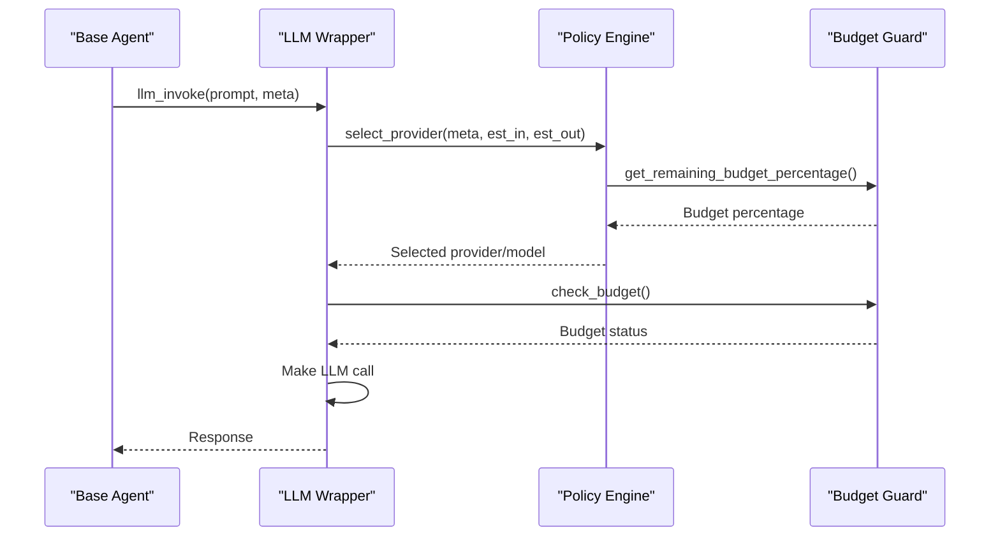
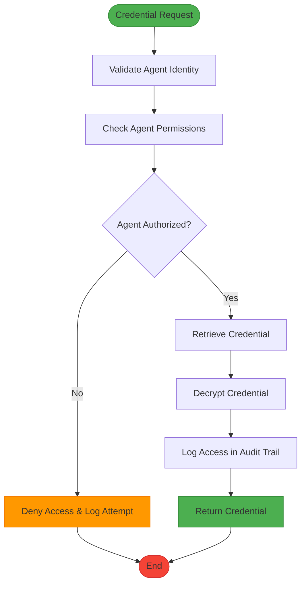

# Agent Authentication and Authorization

<cite>
**Referenced Files in This Document**   
- [base_agent.py](file://371-os/src/minds371/agents/base_agent/base_agent.py)
- [policy_engine.py](file://371-os/src/minds371/adaptive_llm_router/policy_engine.py)
- [clo_sage.py](file://371-os/src/minds371/agents/business/clo_sage.py)
- [cto_alex.py](file://371-os/src/minds371/agents/business/cto_alex.py)
- [ceo_mimi.py](file://371-os/src/minds371/agents/business/ceo_mimi.py)
- [credential_warehouse_agent.py](file://371-os/src/minds371/agents/utility/credential_warehouse_agent.py)
- [llm.py](file://371-os/src/minds371/adaptive_llm_router/llm.py)
- [budget_guard.py](file://371-os/src/minds371/adaptive_llm_router/budget_guard.py)
- [config.py](file://371-os/src/minds371/adaptive_llm_router/config.py)
</cite>

## Table of Contents
1. [Introduction](#introduction)
2. [Core Authentication Mechanisms](#core-authentication-mechanisms)
3. [Authorization Framework](#authorization-framework)
4. [Policy Engine Integration](#policy-engine-integration)
5. [Credential Management System](#credential-management-system)
6. [Leadership Agent Roles](#leadership-agent-roles)
7. [Compliance and Oversight](#compliance-and-oversight)
8. [Configuration and Security Patterns](#configuration-and-security-patterns)
9. [Conclusion](#conclusion)

## Introduction
The 371OS agent authentication and authorization system implements a comprehensive security framework that ensures continuous verification of agent identity and enforces least privilege access across all interactions. This document details the implementation of identity verification at each interaction point, the authorization framework based on agent roles and capabilities, and the integration between the base agent and policy engine for access control decisions. The system leverages cryptographic principles, role-based access control, and contextual factors to maintain security while enabling autonomous agent operations.

**Section sources**
- [base_agent.py](file://371-os/src/minds371/agents/base_agent/base_agent.py#L1-L50)
- [policy_engine.py](file://371-os/src/minds371/adaptive_llm_router/policy_engine.py#L1-L10)

## Core Authentication Mechanisms

The authentication system in 371OS is built on a foundation of agent identity verification and continuous authentication at each interaction point. The `BaseAgent` class serves as the foundation for all agents in the system, providing a standardized authentication framework.

```mermaid
classDiagram
class BaseAgent {
+string agent_id
+AgentType agent_type
+AgentCapability[] capabilities
+Logger logger
+bool is_busy
+Task current_task
+__init__(agent_id, agent_type, capabilities)
+process_task(task) Dict~str, Any~
+health_check() bool
+get_capabilities() AgentCapability[]
+llm_invoke(prompt, meta) Dict~str, Any~
+execute_task(task) Task
}
class AgentCapability {
+string name
+string description
+str[] required_credentials
+Optional~int~ estimated_duration
}
class Task {
+string id
+string description
+AgentType agent_type
+Dict~str, Any~ payload
+TaskStatus status
+datetime created_at
+Optional~datetime~ completed_at
+Optional~Dict~str, Any~~ result
+bool requires_human_approval
+Optional~str~ human_approval_message
}
enum AgentType {
INTELLIGENT_ROUTER
CODE_GENERATION
MARKETING_ASSET
BUSINESS_LOGIC
DEPLOYMENT
CREDENTIAL_MANAGER
MARKETING_AUTOMATION
REPOSITORY_INTAKE
QA_AUTOMATION
TECH_STACK_SPECIALIST
AGENT_UTILITY_BELT
CEO
CTO
CMO
CFO
CLO
FINANCIAL
}
enum TaskStatus {
PENDING
IN_PROGRESS
COMPLETED
FAILED
REQUIRES_HUMAN_APPROVAL
PROVISIONING
DEPLOYING
CONFIGURING
FINALIZING
}
BaseAgent --> AgentCapability : "has"
BaseAgent --> Task : "processes"
```

**Diagram sources**
- [base_agent.py](file://371-os/src/minds371/agents/base_agent/base_agent.py#L30-L159)

**Section sources**
- [base_agent.py](file://371-os/src/minds371/agents/base_agent/base_agent.py#L30-L159)

## Authorization Framework

The authorization framework in 371OS implements a least privilege access model based on agent roles, capabilities, and contextual factors. Each agent is assigned specific capabilities that define what actions they can perform within the system.

The `AgentCapability` class defines the permissions and requirements for each agent capability:

```python
@dataclass
class AgentCapability:
    """Represents a capability of an agent"""
    name: str
    description: str
    required_credentials: List[str] = field(default_factory=list)
    estimated_duration: Optional[int] = None  # in seconds
```

This structure enables fine-grained access control where each capability can specify the credentials required to perform the associated action. The framework ensures that agents can only perform actions for which they have been explicitly granted capabilities.

When an agent processes a task, the system verifies that the agent has the necessary capabilities to complete the requested operation. This verification occurs at the beginning of the `execute_task` method in the `BaseAgent` class:

```python
async def execute_task(self, task: Task) -> Task:
    """Execute a task and update its status"""
    self.is_busy = True
    self.current_task = task
    task.status = TaskStatus.IN_PROGRESS

    try:
        self.logger.info(f"Starting task {task.id}: {task.description}")
        result = await self.process_task(task)
        # ... rest of implementation
```

The framework also supports human approval workflows through the `REQUIRES_HUMAN_APPROVAL` task status, allowing for exceptional access requests to be reviewed and approved by authorized personnel.

**Section sources**
- [base_agent.py](file://371-os/src/minds371/agents/base_agent/base_agent.py#L87-L92)
- [base_agent.py](file://371-os/src/minds371/agents/base_agent/base_agent.py#L140-L159)

## Policy Engine Integration

The integration between the base agent and the ACI.dev policy engine is a critical component of the authorization system. The policy engine, implemented in `policy_engine.py`, makes access control decisions based on task metadata, budget constraints, and security requirements.



**Diagram sources**
- [policy_engine.py](file://371-os/src/minds371/adaptive_llm_router/policy_engine.py#L1-L33)
- [llm.py](file://371-os/src/minds371/adaptive_llm_router/llm.py#L1-L91)

**Section sources**
- [policy_engine.py](file://371-os/src/minds371/adaptive_llm_router/policy_engine.py#L1-L33)
- [llm.py](file://371-os/src/minds371/adaptive_llm_router/llm.py#L1-L91)

The policy engine evaluates several factors when making access control decisions:

1. **Privacy Flag**: Tasks marked as confidential are routed to local models (e.g., LocalAI) to ensure data privacy
2. **Task Criticality**: High-quality models are selected for critical tasks when budget allows
3. **Context Length**: Long-context models are selected for tasks with large input sizes
4. **Budget Constraints**: When budget is low, the system defaults to the most cost-effective model
5. **Default Selection**: A balanced default model is used for all other cases

The `select_provider` function in the policy engine implements these decision rules:

```python
def select_provider(meta: Dict[str, Any], est_in: int, est_out: int) -> str:
    """
    Selects the best provider and model based on task metadata and budget.
    This is a simplified implementation of the decision graph.
    """
    budget_percentage = budget_manager.get_remaining_budget_percentage()

    # 1. Privacy Flag: forces LocalAI
    if meta.get("confidential"):
        return "localai:phi-4-14b"

    # 2. Task Criticality: high-quality model for critical tasks if budget allows
    if meta.get("quality") == "high" and budget_percentage > 0.20:
        return "openrouter:gpt-4o-mini"

    # 3. Context Length: long-context model for large inputs
    if est_in > 8000:
        return "requesty:claude-3-sonnet"

    # 4. Low Budget Mode: cheapest model when budget is low
    if budget_percentage < 0.05:
        return "openrouter:mistral-7b"

    # 5. Balanced Default: the default choice for all other cases
    return "openrouter:qwen2-72b"
```

This integration ensures that access to computational resources is governed by organizational policies, security requirements, and financial constraints.

## Credential Management System

The credential management system in 371OS is implemented through the `SecureCredentialWarehouse` agent, which provides secure storage, retrieval, and access control for sensitive credentials.



**Diagram sources**
- [credential_warehouse_agent.py](file://371-os/src/minds371/agents/utility/credential_warehouse_agent.py#L1-L200)

**Section sources**
- [credential_warehouse_agent.py](file://371-os/src/minds371/agents/utility/credential_warehouse_agent.py#L1-L200)

The credential warehouse implements several security features:

- **Role-Based Access Control**: Agents can only access credentials for which they have been granted permission
- **Creator-Centric Access Management**: Only the agent that created a credential can grant access to other agents
- **Audit Logging**: All credential access attempts are logged for compliance and security monitoring
- **Credential Rotation**: Credentials can be rotated on a schedule or on demand
- **Expiration Monitoring**: The system monitors for credentials that are approaching expiration

The system demonstrates these capabilities through its test cases, which verify that:
- Agents can store credentials with appropriate metadata
- Agents can only retrieve credentials for which they have access
- Attempts to access unauthorized credentials are denied with appropriate error messages
- Audit logs capture all access attempts
- Credential rotation works as expected

## Leadership Agent Roles

The leadership agent roles in 371OS form a hierarchical authorization structure that mirrors organizational leadership. These agents (CEO, CTO, CLO) provide oversight and handle exceptional access requests.

### CEO Agent (Mimi)
The CEO agent serves as the strategic decision-maker, delegating tasks to appropriate C-suite agents based on task content:

```python
async def process_task(self, task: Task) -> Dict[str, Any]:
    """
    Processes a task by delegating it to the appropriate agent.
    """
    description = task.description.lower()

    if any(keyword in description for keyword in ["financial", "budget", "quarterly"]):
        return {"status": "success", "message": "Delegating to CFO Cash"}
    elif any(keyword in description for keyword in ["feature", "application", "security", "infrastructure"]):
        return {"status": "success", "message": "Delegating to CTO Alex"}
    elif any(keyword in description for keyword in ["marketing", "campaign"]):
        return {"status": "success", "message": "Delegating to CMO Anova"}
    elif any(keyword in description for keyword in ["community", "outreach"]):
        return {"status": "success", "message": "Delegating to CCO Sage"}
    else:
        return {"status": "success", "message": "Task noted. No specific C-suite agent identified for delegation."}
```

**Section sources**
- [ceo_mimi.py](file://371-os/src/minds371/agents/business/ceo_mimi.py#L1-L99)

### CTO Agent (Alex)
The CTO agent specializes in technical strategy and oversight, handling tasks related to architecture, technology evaluation, security response, and infrastructure planning:

```python
class CtoAlexAgent(BaseAgent):
    """
    CTO Alex Agent specializes in technical strategy and oversight.
    """

    def __init__(self):
        agent_id = f"cto-alex-{uuid.uuid4()}"
        capabilities = [
            AgentCapability(name="design_architecture", description="Design technical architecture for new services."),
            AgentCapability(name="evaluate_technology", description="Evaluate and select new technologies."),
            AgentCapability(name="handle_security_response", description="Oversee responses to security vulnerabilities."),
            AgentCapability(name="plan_infrastructure", description="Plan infrastructure scaling and management.")
        ]
        super().__init__(agent_id=agent_id, agent_type=AgentType.CTO, capabilities=capabilities)
```

**Section sources**
- [cto_alex.py](file://371-os/src/minds371/agents/business/cto_alex.py#L1-L100)

## Compliance and Oversight

The CLO Agent (Alex) plays a crucial role in overseeing compliance with authorization policies and handling exceptional access requests. As the Compliance and Legal Officer, this agent ensures that all agent activities adhere to organizational policies and regulatory requirements.

```python
class CloSageAgent(BaseAgent):
    """
    CLO Sage Agent: An agent focused on continuous learning and optimization
    of other agents and the system as a whole.
    """

    def __init__(self):
        """
        Initializes the CLO Sage Agent.
        """
        agent_id = "clo_sage_001"
        agent_type = AgentType.CLO
        capabilities = [
            AgentCapability(
                name="assess_agent_performance",
                description="Analyzes performance metrics of other agents.",
                required_credentials=[]
            ),
            AgentCapability(
                name="identify_patterns",
                description="Identifies successful and failed patterns in agent behavior.",
                required_credentials=[]
            ),
            AgentCapability(
                name="propose_optimizations",
                description="Proposes optimizations for agent workflows.",
                required_credentials=[]
            ),
            AgentCapability(
                name="design_knowledge_transfer",
                description="Designs new knowledge transfer loops and protocols.",
                required_credentials=[]
            )
        ]
        super().__init__(agent_id, agent_type, capabilities)
```

The CLO agent's capabilities focus on system-wide optimization and compliance rather than direct task execution. It analyzes agent performance, identifies patterns in behavior, proposes workflow optimizations, and designs knowledge transfer protocols to improve overall system efficiency and compliance.

This agent serves as the primary mechanism for handling exceptional access requests and ensuring that the authorization framework evolves based on observed patterns and performance data.

**Section sources**
- [clo_sage.py](file://371-os/src/minds371/agents/business/clo_sage.py#L1-L77)

## Configuration and Security Patterns

The configuration options for defining agent roles, permissions, and trust levels are implemented through a combination of code-level definitions and external configuration files.

### Configuration Files
The system uses configuration files to define security parameters such as budget caps:

```python
"""
Configuration for the Adaptive LLM Router.
"""

# The monthly budget cap for LLM usage in USD.
MONTHLY_BUDGET_CAP = 20.00
```

This configuration is used by the `BudgetManager` to enforce financial constraints on agent activities:

```python
class BudgetManager:
    """
    Manages the LLM budget by checking usage against a monthly cap.
    """
    def __init__(self, monthly_cap: float, ledger: UsageLedger):
        self.monthly_cap = monthly_cap
        self.ledger = ledger

    def get_remaining_budget_percentage(self) -> float:
        """
        Calculates the percentage of the budget that remains.
        """
        if self.monthly_cap <= 0:
            return 0.0

        current_spend = self.ledger.get_total_cost_for_current_month()
        remaining = self.monthly_cap - current_spend

        if remaining <= 0:
            return 0.0

        return (remaining / self.monthly_cap)
```

### Secure Configuration Patterns
The system implements several secure configuration patterns:

1. **Environment Variable Management**: Sensitive configuration is managed through environment variables rather than hardcoded values
2. **Secretless Architecture**: Credentials are injected at runtime through a secretless broker pattern
3. **Role-Based Configuration**: Different agent types have configuration tailored to their specific responsibilities
4. **Audit-Enabled Operations**: All configuration changes and access attempts are logged for compliance

The enterprise security integration demonstrates the secretless broker pattern:

```bash
# Create Secretless configuration
mkdir -p config/security

cat > config/security/secretless.yml << 'EOF'
version: "2"
services:
  - name: elizaos-agents
    connector: generic_http
    authentication:
      - type: oauth2
        config:
          token_url: "${ACI_TOKEN_URL}"
          client_id: "${ACI_CLIENT_ID}"
          client_secret: "${ACI_CLIENT_SECRET}"
          scope: "agent:execute blockchain:read"
    config:
      headers:
        Authorization: "Bearer {{ .access_token }}"
EOF
```

These patterns ensure that the system maintains security while enabling flexible configuration and management of agent roles and permissions.

**Section sources**
- [config.py](file://371-os/src/minds371/adaptive_llm_router/config.py#L1-L6)
- [budget_guard.py](file://371-os/src/minds371/adaptive_llm_router/budget_guard.py#L1-L49)
- [IMPLEMENTATION_GUIDE.md](file://IMPLEMENTATION_GUIDE.md#L398-L440)

## Conclusion
The agent authentication and authorization system in 371OS implements a comprehensive security framework that combines continuous identity verification, least privilege access control, and policy-based decision making. The system leverages the `BaseAgent` class as a foundation for all agents, ensuring consistent authentication and authorization across the platform.

Key components of the system include:
- The policy engine that makes access control decisions based on task metadata, budget constraints, and security requirements
- The credential warehouse that securely manages sensitive credentials with role-based access control
- Leadership agents (CEO, CTO, CLO) that provide hierarchical oversight and handle exceptional access requests
- Configuration patterns that enable secure management of agent roles, permissions, and trust levels

The integration between the base agent and the policy engine ensures that all agent interactions are governed by organizational policies, security requirements, and financial constraints. This comprehensive approach to authentication and authorization enables secure, autonomous agent operations while maintaining compliance and accountability.

The system demonstrates best practices in agent security, including continuous authentication, fine-grained access control, audit logging, and exception handling through leadership agents. These features make 371OS well-suited for enterprise environments where security, compliance, and accountability are paramount.