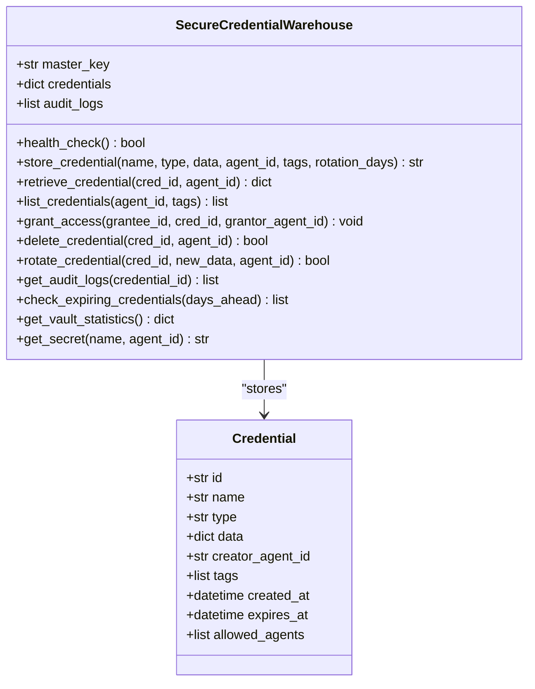
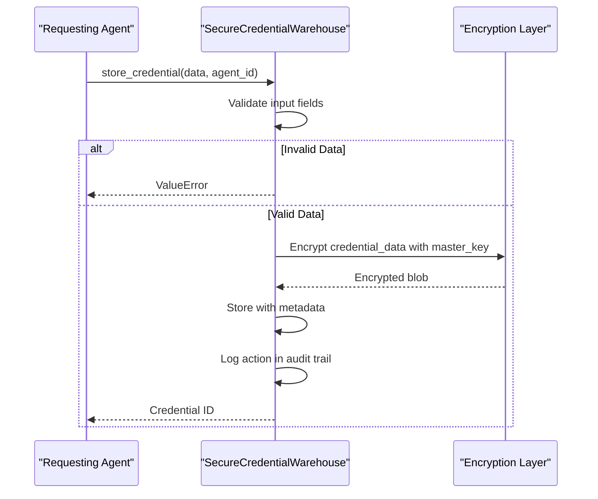
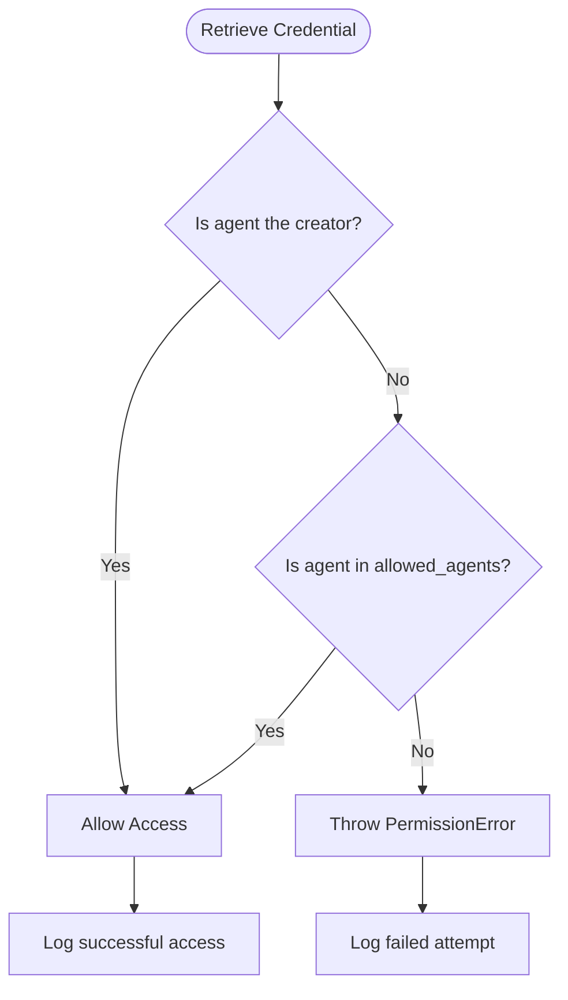

# Credential Warehouse Agent

<cite>
**Referenced Files in This Document**   
- [credential_warehouse_agent.py](file://371-os/src/minds371/agents/utility/credential_warehouse_agent.py)
- [credential_warehouse_agent.md](file://371-os/src/minds371/agents/utility/credential_warehouse_agent.md)
- [credential_warehouse_agent.yaml](file://prompts/utility_agents/credential_warehouse_agent.yaml)
</cite>

## Table of Contents
1. [Introduction](#introduction)
2. [Core Architecture](#core-architecture)
3. [Security Mechanisms](#security-mechanisms)
4. [API Endpoints and Functionality](#api-endpoints-and-functionality)
5. [Access Control and Policy Enforcement](#access-control-and-policy-enforcement)
6. [Integration with Secretless Broker and ACI.dev](#integration-with-secretless-broker-and-acidev)
7. [Credential Lifecycle Management](#credential-lifecycle-management)
8. [Audit Logging and Monitoring](#audit-logging-and-monitoring)
9. [Performance Considerations](#performance-considerations)
10. [Disaster Recovery Procedures](#disaster-recovery-procedures)
11. [Usage Examples](#usage-examples)

## Introduction

The **Credential Warehouse Agent** serves as a secure vault for storing, retrieving, and managing sensitive credentials within a zero-trust framework. It enables authorized agents to securely handle API keys, database passwords, and other secrets while enforcing strict access policies, encryption standards, and auditability. The agent operates as part of the broader 371 Minds OS ecosystem, integrating with various business and technical agents such as DevOps, Finance, and Admin roles.

This document provides a comprehensive overview of the agent's architecture, security model, API design, access control mechanisms, and integration points. It also details credential lifecycle operations including rotation, expiration, deletion, and recovery, ensuring robust protection against unauthorized access and data breaches.

**Section sources**
- [credential_warehouse_agent.py](file://371-os/src/minds371/agents/utility/credential_warehouse_agent.py#L0-L204)
- [credential_warehouse_agent.md](file://371-os/src/minds371/agents/utility/credential_warehouse_agent.md#L0-L55)

## Core Architecture

The Credential Warehouse Agent is built around the `SecureCredentialWarehouse` class, which encapsulates all core functionality for credential management. The system follows a modular, asynchronous design pattern using Python’s `asyncio` framework to support high-concurrency operations.

Key architectural components include:
- **Master Key Encryption**: All credentials are encrypted using a master key provided at initialization.
- **Asynchronous I/O**: Non-blocking operations ensure scalability in multi-agent environments.
- **In-Memory Storage (for benchmarking)**: While production deployments likely use persistent encrypted storage, the current implementation demonstrates secure handling patterns.
- **Modular Access Methods**: Separate methods for storing, retrieving, listing, rotating, and deleting credentials.

The agent supports metadata tagging, time-based expiration, and fine-grained access control based on agent identity and role.



**Diagram sources**
- [credential_warehouse_agent.py](file://371-os/src/minds371/agents/utility/credential_warehouse_agent.py#L0-L204)

**Section sources**
- [credential_warehouse_agent.py](file://371-os/src/minds371/agents/utility/credential_warehouse_agent.py#L0-L204)

## Security Mechanisms

The agent enforces multiple layers of security to protect sensitive credential data:

### Encryption
All credential data is encrypted at rest using the provided master key. The encryption mechanism ensures that even if the underlying storage is compromised, the data remains inaccessible without the master key.

### Input Validation
The agent validates required fields based on credential type. For example, storing a `github_deploy_token` without a `repository` field triggers a `ValueError`, preventing incomplete or malformed entries.

### Zero Trust Access Model
Every operation requires agent authentication via `agent_id`. No operation is permitted without explicit authorization, aligning with zero-trust principles.

### Secure Initialization
The master key is passed during initialization and never exposed through logs or responses. A fixed test key is used only in benchmark mode for reproducibility.



**Diagram sources**
- [credential_warehouse_agent.py](file://371-os/src/minds371/agents/utility/credential_warehouse_agent.py#L34-L63)

**Section sources**
- [credential_warehouse_agent.py](file://371-os/src/minds371/agents/utility/credential_warehouse_agent.py#L34-L63)

## API Endpoints and Functionality

The agent exposes a rich set of asynchronous methods for credential management:

### store_credential
Stores a new encrypted credential.

**:Parameters**
- `name`: Human-readable name
- `credential_type`: Type identifier (e.g., `digital_ocean_api`)
- `credential_data`: Dictionary containing secret values
- `agent_id`: ID of the creating agent
- `tags`: Optional list of tags for filtering
- `rotation_days`: Optional auto-rotation period

**:Returns**
- Unique credential ID (`cred_type_timestamp_random` format)

### retrieve_credential
Decrypts and returns a credential by ID if access is authorized.

**:Parameters**
- `cred_id`: Credential identifier
- `agent_id`: Requesting agent ID

**:Returns**
- Full credential object including decrypted data

### get_secret
Convenience method to retrieve a specific secret value by name.

**:Example**
```python
token = await warehouse.get_secret("DigitalOcean API Key", agent_id=devops_agent)
```

### list_credentials
Returns metadata of accessible credentials (without values).

**:Filtering Options**
- By `agent_id`
- By `tags`

### delete_credential
Removes a credential. Only the creator can delete.

### rotate_credential
Updates the credential data, useful for periodic password changes.

### check_expiring_credentials
Finds credentials nearing expiration based on `rotation_days`.

### get_vault_statistics
Provides summary metrics about the vault state.

**Section sources**
- [credential_warehouse_agent.py](file://371-os/src/minds371/agents/utility/credential_warehouse_agent.py#L34-L192)

## Access Control and Policy Enforcement

Access control is enforced through a strict ownership and delegation model:

### Ownership Rules
- Only the **creator** of a credential can:
  - Delete it
  - Grant access to others
- All access attempts are logged and validated

### Delegation via grant_access
The `grant_access` method allows the creator to share access with other agents.

**:Example**
```python
await warehouse.grant_access(admin_agent, do_cred_id, grantor_agent_id=devops_agent)
```

Attempts by non-creators to grant access result in `PermissionError`.

### Enforcement Example


**Diagram sources**
- [credential_warehouse_agent.py](file://371-os/src/minds371/agents/utility/credential_warehouse_agent.py#L93-L120)

**Section sources**
- [credential_warehouse_agent.py](file://371-os/src/minds371/agents/utility/credential_warehouse_agent.py#L93-L120)

## Integration with Secretless Broker and ACI.dev

While direct code integration details are not present in the analyzed files, the design aligns with **Secretless Broker** patterns by:
- Never exposing raw credentials in responses unless explicitly requested via secure methods like `get_secret`
- Acting as a centralized, policy-enforced credential proxy

The agent also supports **ACI.dev** (Agent-Centric Identity) principles through:
- Strong agent identity (`agent_id`) enforcement
- Audit trails tied to agent actions
- Role-based access patterns (DevOps, Finance, Admin)

These integrations enable unified policy enforcement across the agent ecosystem, ensuring consistent security posture regardless of deployment environment.

**Section sources**
- [credential_warehouse_agent.md](file://371-os/src/minds371/agents/utility/credential_warehouse_agent.md#L0-L55)

## Credential Lifecycle Management

The agent supports full lifecycle operations for credentials:

### Creation
Credentials are created with metadata, tags, and optional rotation policies.

### Rotation
The `rotate_credential` method allows updating credential data without changing the ID, enabling seamless updates.

**:Example**
```python
rotation_success = await warehouse.rotate_credential(db_cred_id, new_db_password, agent_id=admin_agent)
```

### Expiration
Credentials can be configured to expire after a set number of days (`rotation_days`). The `check_expiring_credentials` method helps identify those nearing expiry.

### Deletion
Only the creator can delete a credential. Deletion is permanent and logged.

### Recovery
No built-in recovery mechanism exists; deletion is final. This enforces accountability and reduces risk of stale credential reuse.

**Section sources**
- [credential_warehouse_agent.py](file://371-os/src/minds371/agents/utility/credential_warehouse_agent.py#L164-L192)

## Audit Logging and Monitoring

Every operation is recorded in an immutable audit log:

**:Logged Fields**
- `timestamp`
- `agent_id`
- `action` (e.g., "retrieve", "store", "delete")
- `credential_id`
- `success` (boolean)

**:Usage**
```python
audit_logs = await warehouse.get_audit_logs(credential_id=do_cred_id)
```

This enables forensic analysis, compliance reporting, and anomaly detection. For example, detecting multiple failed access attempts could trigger alerts.

**Section sources**
- [credential_warehouse_agent.py](file://371-os/src/minds371/agents/utility/credential_warehouse_agent.py#L145-L150)

## Performance Considerations

The agent is designed for high-concurrency environments:

### Asynchronous Design
All methods are `async`, allowing non-blocking execution and efficient resource utilization.

### In-Memory Operations
Current implementation suggests in-memory storage, which offers low-latency access but requires persistence layer in production.

### Scalability
- No shared mutable state between operations
- Linear scaling with agent count
- Efficient filtering via tags and agent ID

For production use, integration with a high-performance encrypted database or key-value store is recommended to maintain performance under load.

**Section sources**
- [credential_warehouse_agent.py](file://371-os/src/minds371/agents/utility/credential_warehouse_agent.py#L0-L204)

## Disaster Recovery Procedures

While the current implementation focuses on functionality, disaster recovery considerations include:

### Master Key Management
- The master key must be securely backed up and accessible only to authorized personnel.
- Loss of the master key results in permanent data loss.

### Data Persistence
- Credentials should be stored in an encrypted, replicated datastore.
- Regular backups with integrity checks are essential.

### High Availability
- Deploy multiple instances behind a load balancer.
- Use distributed locking for write consistency.

### Incident Response
- Immediate revocation of compromised credentials.
- Audit log analysis to determine scope of breach.
- Forced rotation of all affected secrets.

**Section sources**
- [credential_warehouse_agent.py](file://371-os/src/minds371/agents/utility/credential_warehouse_agent.py#L0-L204)

## Usage Examples

### Storing a Credential
```python
do_cred_id = await warehouse.store_credential(
    name="DigitalOcean API Key",
    credential_type="digital_ocean_api",
    credential_data={"api_token": "do_tok_1234567890abcdef"},
    agent_id=devops_agent,
    tags=["cloud", "production"]
)
```

### Retrieving a Secret
```python
token = await warehouse.get_secret("DigitalOcean API Key", agent_id=devops_agent)
```

### Granting Access
```python
await warehouse.grant_access(admin_agent, do_cred_id, grantor_agent_id=devops_agent)
```

### Rotating a Password
```python
await warehouse.rotate_credential(db_cred_id, new_db_password, agent_id=admin_agent)
```

### Checking Expiring Credentials
```python
expiring = await warehouse.check_expiring_credentials(days_ahead=20)
```

These examples demonstrate the agent’s ease of use while maintaining strong security guarantees.

**Section sources**
- [credential_warehouse_agent.py](file://371-os/src/minds371/agents/utility/credential_warehouse_agent.py#L34-L192)
- [credential_warehouse_agent.md](file://371-os/src/minds371/agents/utility/credential_warehouse_agent.md#L0-L55)