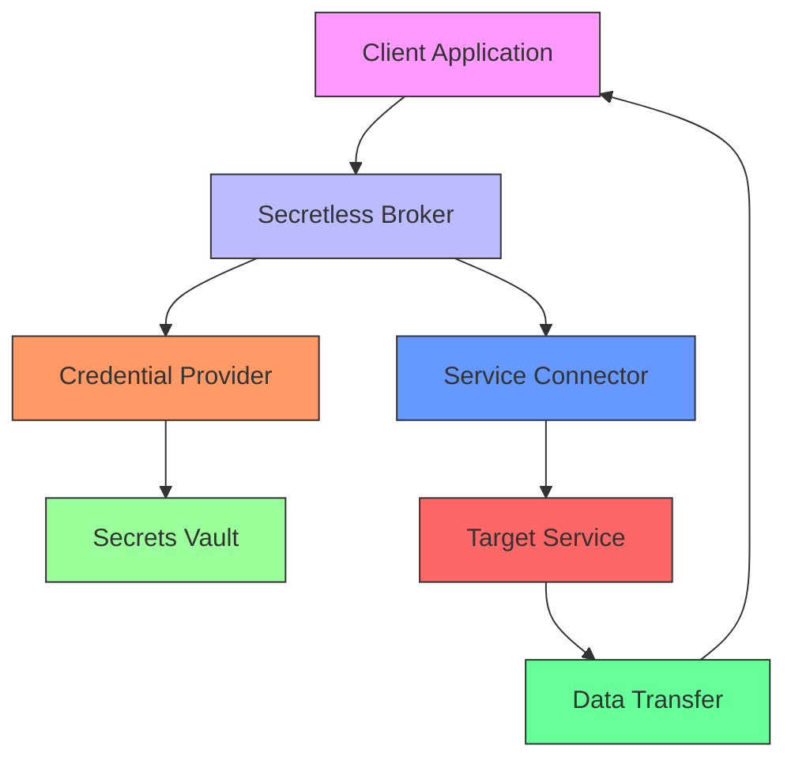
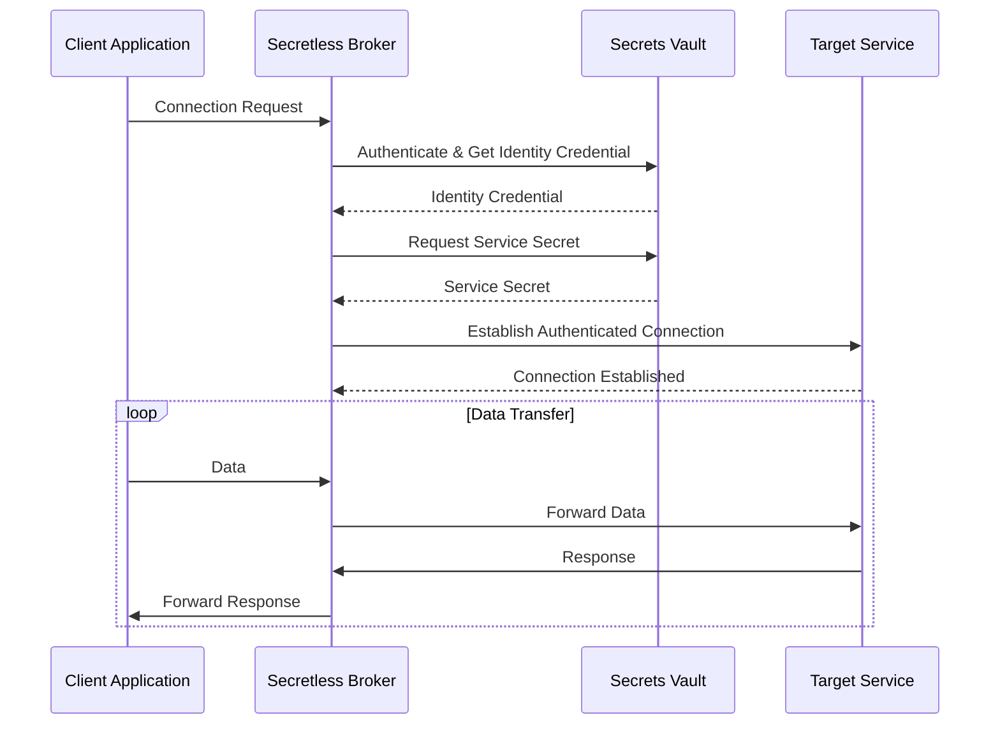

# Secretless Broker Integration

<cite>
**Referenced Files in This Document**   
- [IMPLEMENTATION_GUIDE.md](file://IMPLEMENTATION_GUIDE.md#L398-L440)
- [thought_leadership/AASA/researchprotocol.md](file://thought_leadership/AASA/researchprotocol.md#L806-L919)
- [sotalogic/Claude Sonnet 4/Alignment Review of 371OS_launch Project Plan/i'm setting up Qoder..md](file://sotalogic/Claude Sonnet 4/Alignment Review of 371OS_launch Project Plan/i'm setting up Qoder..md#L1164-L1205)
- [sotalogic/Claude Sonnet 4/Alignment Review of 371OS_launch Project Plan/now can you create a guide for me .md](file://sotalogic/Claude Sonnet 4/Alignment Review of 371OS_launch Project Plan/now can you create a guide for me .md#L414-L456)
- [src/minds371/agents/utility/credential_warehouse_agent.py](file://src/minds371/agents/utility/credential_warehouse_agent.py#L0-L203)
</cite>

## Table of Contents
1. [Introduction](#introduction)
2. [Core Architecture](#core-architecture)
3. [Authentication Flows](#authentication-flows)
4. [Secret Retrieval Mechanisms](#secret-retrieval-mechanisms)
5. [Secure Injection into Agent Environments](#secure-injection-into-agent-environments)
6. [Integration Patterns with External Services](#integration-patterns-with-external-services)
7. [Security Benefits of Ephemeral Credential Delivery](#security-benefits-of-ephemeral-credential-delivery)
8. [Failure Modes and Fallback Strategies](#failure-modes-and-fallback-strategies)
9. [Monitoring and Audit Logging](#monitoring-and-audit-logging)
10. [Configuration Examples](#configuration-examples)
11. [ACI.dev Integration for Policy Enforcement](#acidev-integration-for-policy-enforcement)

## Introduction
The Secretless Broker integration in 371OS represents a paradigm shift in how agents handle sensitive credentials. By eliminating hardcoded credentials and enabling dynamic secret injection at runtime, the system achieves a zero-trust security model where applications never directly handle secrets. This document details the implementation, architecture, and operational patterns of the Secretless Broker within the 371OS ecosystem, focusing on how it enables secure, scalable, and maintainable agent operations without compromising on functionality or performance.

**Section sources**
- [thought_leadership/AASA/researchprotocol.md](file://thought_leadership/AASA/researchprotocol.md#L201-L225)
- [thought_leadership/AASA/researchprotocol.md](file://thought_leadership/AASA/researchprotocol.md#L806-L820)

## Core Architecture
The Secretless Broker operates as a connection broker that intercepts traffic between client applications and target services, performing the authentication phase of the backend protocol while allowing data-transfer phases to pass directly between the client and service. This architectural pattern ensures that credentials are never exposed to the client application, effectively removing applications from the threat surface.

The broker typically runs locally alongside the client application, either as a sidecar container in containerized environments or as a local service. Authentication between the client and Secretless Broker is managed by the operating system through mechanisms such as Unix sockets or HTTP connections to 127.0.0.1. When a connection request is received, the Proxy Service invokes appropriate Credential Providers to retrieve required credentials and Service Connectors to perform the authentication handshake before seamlessly streaming the connection.



**Diagram sources**
- [thought_leadership/AASA/researchprotocol.md](file://thought_leadership/AASA/researchprotocol.md#L880-L909)
- [thought_leadership/AASA/researchprotocol.md](file://thought_leadership/AASA/researchprotocol.md#L858-L878)

## Authentication Flows
The authentication flow in the Secretless Broker follows a standardized pattern that begins when a client needs access to a target service. Instead of making a direct connection, the client sends the request through its local Secretless Broker instance. The broker then authenticates with an external secrets vault to obtain an identity credential, which is securely managed within the broker process.

Using this identity credential, the Secretless Broker retrieves the specific secrets needed to access the target service, such as database passwords or API keys. These connection secrets are managed entirely within the Secretless Broker process and are never exposed to the client application. The broker uses these secrets to establish a connection to the target service and then pipes traffic between the client and target, creating a seamless experience for the application.



**Diagram sources**
- [thought_leadership/AASA/researchprotocol.md](file://thought_leadership/AASA/researchprotocol.md#L858-L878)
- [thought_leadership/AASA/researchprotocol.md](file://thought_leadership/AASA/researchprotocol.md#L839-L856)

## Secret Retrieval Mechanisms
The Secretless Broker employs a flexible architecture for secret retrieval, supporting multiple credential stores through its built-in Secret Providers. This allows the system to integrate with existing workflows regardless of the current secrets management infrastructure. The broker can retrieve credentials from various sources including CyberArk Conjur, HashiCorp Vault, AWS Secrets Manager, and other enterprise-grade secrets management solutions.

When a connection request is received, the Proxy Service invokes the appropriate Credential Provider(s) configured for that service. These providers handle the specific protocols and authentication mechanisms required by each secrets management system, abstracting away the complexity from the client application. The Secretless Broker supports a variety of vault solutions, ensuring consistent security across different technologies and platforms.

The credential retrieval process is designed to be transparent to the client application, which simply connects to the broker without needing to know how credentials are fetched or managed. This abstraction allows organizations to change their underlying secrets management infrastructure without requiring modifications to application code, reducing the probability of human error and bugs during platform transitions.

**Section sources**
- [thought_leadership/AASA/researchprotocol.md](file://thought_leadership/AASA/researchprotocol.md#L227-L228)
- [thought_leadership/AASA/researchprotocol.md](file://thought_leadership/AASA/researchprotocol.md#L822-L837)

## Secure Injection into Agent Environments
The Secretless Broker enables secure credential injection into agent environments through its proxy-based architecture. Agents in the 371OS ecosystem connect to local Secretless Broker instances rather than directly to target services, eliminating the need to store credentials in configuration files or environment variables. This approach ensures that sensitive credentials are never present in the agent's memory space or persisted in any form.

The integration pattern is implemented through a combination of configuration and code patterns. The broker is configured via YAML files that define services, connectors, and authentication mechanisms. For example, the configuration for ElizaOS agents includes OAuth2 authentication with ACI.dev, where the broker retrieves tokens and injects them into HTTP headers for service requests.

```bash
version: "2"
services:
  - name: elizaos-agents
    connector: generic_http
    authentication:
      - type: oauth2
        config:
          token_url: "${ACI_TOKEN_URL}"
          client_id: "${ACI_CLIENT_ID}"
          client_secret: "${ACI_CLIENT_SECRET}"
          scope: "agent:execute blockchain:read"
    config:
      headers:
        Authorization: "Bearer {{ .access_token }}"
```

Agents interact with the broker through standard connection protocols, unaware that their requests are being authenticated by the broker. This transparent proxying allows agents to focus on their core functionality while security concerns are handled by the specialized broker module.

**Section sources**
- [IMPLEMENTATION_GUIDE.md](file://IMPLEMENTATION_GUIDE.md#L398-L440)
- [sotalogic/Claude Sonnet 4/Alignment Review of 371OS_launch Project Plan/now can you create a guide for me .md](file://sotalogic/Claude Sonnet 4/Alignment Review of 371OS_launch Project Plan/now can you create a guide for me .md#L414-L456)

## Integration Patterns with External Services
The Secretless Broker supports integration with a wide range of external services through its extensible connector architecture. The system can broker connections to database protocols such as Oracle, PostgreSQL, MySQL, and various NoSQL databases, as well as HTTP services via Authorization headers and SSH connections through MITM or ssh-agent implementations.

In the 371OS ecosystem, this capability enables agents to securely interact with diverse external systems without handling credentials directly. For example, a financial agent can access payment processing APIs, a DevOps agent can manage cloud infrastructure, and a marketing agent can connect to analytics platforms—all without ever seeing the underlying API keys or credentials.

The integration pattern follows a consistent workflow across different service types:
1. Define the target service in the broker configuration
2. Specify the appropriate connector for the service protocol
3. Configure authentication with the secrets vault
4. Set up any required connection parameters
5. Connect client applications to the broker's listening port

This standardized approach simplifies integration while maintaining strong security guarantees, allowing new services to be added to the ecosystem with minimal configuration changes.

**Section sources**
- [thought_leadership/AASA/researchprotocol.md](file://thought_leadership/AASA/researchprotocol.md#L880-L909)
- [thought_leadership/AASA/researchprotocol.md](file://thought_leadership/AASA/researchprotocol.md#L911-L919)

## Security Benefits of Ephemeral Credential Delivery
The Secretless Broker provides significant security advantages through its ephemeral credential delivery model. By never exposing credentials to client applications, the system eliminates several common attack vectors including accidental credential leakage to log files, source control repositories, or error messages. This approach also mitigates risks from attacks on privileged users, such as phishing or developer machine compromises.

One of the key benefits is the reduction of the application's threat surface. Since applications no longer store secrets in memory, they cannot be compromised through remote code execution vulnerabilities or environment variable dumps. Even if an application is breached, attackers cannot extract valid credentials from the compromised instance.

The broker also enables seamless secret rotation without requiring service restarts. When a secret is changed manually or through an automated rotator, the broker automatically obtains the new secret and uses it for subsequent connections. This capability ensures that security policies can be enforced without operational disruption, maintaining continuous availability while improving security posture.

**Section sources**
- [thought_leadership/AASA/researchprotocol.md](file://thought_leadership/AASA/researchprotocol.md#L822-L837)
- [thought_leadership/AASA/researchprotocol.md](file://thought_leadership/AASA/researchprotocol.md#L839-L856)

## Failure Modes and Fallback Strategies
The Secretless Broker implementation includes robust handling of failure modes to ensure system reliability. When the broker cannot retrieve credentials from the vault—due to network issues, authentication failures, or vault unavailability—the connection request fails securely without exposing any sensitive information.

The system employs several fallback strategies to maintain availability while preserving security:
- **Caching**: The broker can cache credentials for a configurable period, allowing continued operation during temporary vault outages
- **Graceful degradation**: Non-critical services may operate with reduced functionality when authentication is unavailable
- **Circuit breaking**: After repeated failures, the broker can temporarily stop attempting connections to prevent cascading failures
- **Health checks**: Regular monitoring ensures the broker's availability and performance

In the 371OS implementation, additional safeguards are provided by the credential_warehouse_agent, which manages access controls, audit logging, and permission validation. This layered approach ensures that even if one component fails, others can maintain security boundaries and provide visibility into the failure.

**Section sources**
- [src/minds371/agents/utility/credential_warehouse_agent.py](file://src/minds371/agents/utility/credential_warehouse_agent.py#L0-L203)
- [thought_leadership/AASA/researchprotocol.md](file://thought_leadership/AASA/researchprotocol.md#L806-L820)

## Monitoring and Audit Logging
The Secretless Broker provides comprehensive monitoring and audit logging capabilities that are essential for security and compliance. Every credential access attempt is logged with details including the requesting agent, timestamp, target service, and success/failure status. These audit logs are stored securely and can be integrated with centralized logging systems for analysis and reporting.

In the 371OS ecosystem, the credential_warehouse_agent implements additional auditing features, tracking all operations related to credential management including storage, retrieval, rotation, and deletion. This detailed audit trail enables organizations to meet regulatory requirements and investigate security incidents effectively.

Monitoring metrics include:
- Connection success/failure rates
- Authentication latency
- Credential retrieval frequency
- Vault interaction statistics
- System health and resource utilization

These metrics can be visualized through dashboards and used to trigger alerts for anomalous behavior, such as unexpected spikes in credential requests or failed authentication attempts from unusual sources.

**Section sources**
- [src/minds371/agents/utility/credential_warehouse_agent.py](file://src/minds371/agents/utility/credential_warehouse_agent.py#L0-L203)
- [thought_leadership/AASA/researchprotocol.md](file://thought_leadership/AASA/researchprotocol.md#L839-L856)

## Configuration Examples
The Secretless Broker is configured through YAML files that define services, connectors, and authentication mechanisms. The following example demonstrates the configuration for ElizaOS agents connecting to services protected by ACI.dev:

```yaml
version: "2"
services:
  - name: elizaos-agents
    connector: generic_http
    authentication:
      - type: oauth2
        config:
          token_url: "${ACI_TOKEN_URL}"
          client_id: "${ACI_CLIENT_ID}"
          client_secret: "${ACI_CLIENT_SECRET}"
          scope: "agent:execute blockchain:read"
    config:
      headers:
        Authorization: "Bearer {{ .access_token }}"
```

This configuration specifies OAuth2 authentication with ACI.dev, where the broker retrieves tokens using client credentials and injects them into HTTP Authorization headers. Environment variables are used for sensitive values, which are securely managed by the deployment infrastructure.

A startup script orchestrates the broker and agent lifecycle:

```bash
#!/bin/bash
# Start Secretless Broker
secretless-broker -f config/security/secretless.yml &
# Wait for Secretless to be ready
sleep 5
# Start agents with security context
npm run start:agents:production
echo "Agents started with enterprise security enabled"
```

These configuration patterns enable secure, maintainable deployments where credentials are never hardcoded and security policies can be enforced consistently across the ecosystem.

**Section sources**
- [IMPLEMENTATION_GUIDE.md](file://IMPLEMENTATION_GUIDE.md#L398-L440)
- [sotalogic/Claude Sonnet 4/Alignment Review of 371OS_launch Project Plan/now can you create a guide for me .md](file://sotalogic/Claude Sonnet 4/Alignment Review of 371OS_launch Project Plan/now can you create a guide for me .md#L414-L456)

## ACI.dev Integration for Policy Enforcement
The integration with ACI.dev enables sophisticated policy enforcement and real-time revocation capabilities within the 371OS ecosystem. By leveraging ACI.dev's identity and access management features, the Secretless Broker can enforce fine-grained access controls based on agent roles, permissions, and contextual factors.

The OAuth2 authentication flow with ACI.dev allows for centralized policy management, where access decisions are made based on dynamic factors such as time of day, geographic location, and risk assessment. This enables real-time revocation of access when security policies are violated or when agents are decommissioned.

The policy engine can enforce rules such as:
- Role-based access control (RBAC) for different agent types
- Time-based access restrictions
- Rate limiting for credential requests
- Context-aware authentication requirements
- Automated revocation based on behavioral analysis

This integration creates a comprehensive security framework where the Secretless Broker acts as the enforcement point for policies defined in ACI.dev, ensuring consistent application of security rules across all agent interactions with external services.

**Section sources**
- [sotalogic/Claude Sonnet 4/Alignment Review of 371OS_launch Project Plan/i'm setting up Qoder..md](file://sotalogic/Claude Sonnet 4/Alignment Review of 371OS_launch Project Plan/i'm setting up Qoder..md#L1164-L1205)
- [IMPLEMENTATION_GUIDE.md](file://IMPLEMENTATION_GUIDE.md#L398-L440)