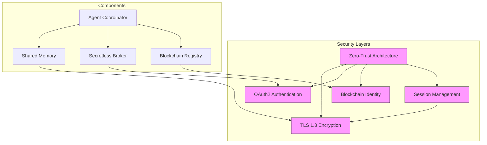
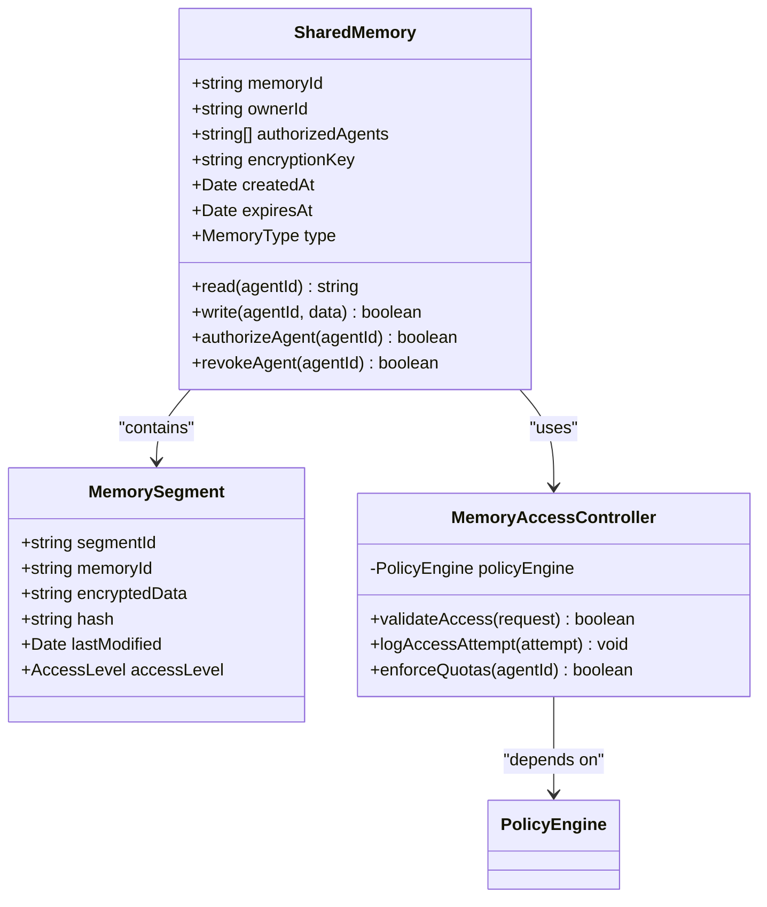
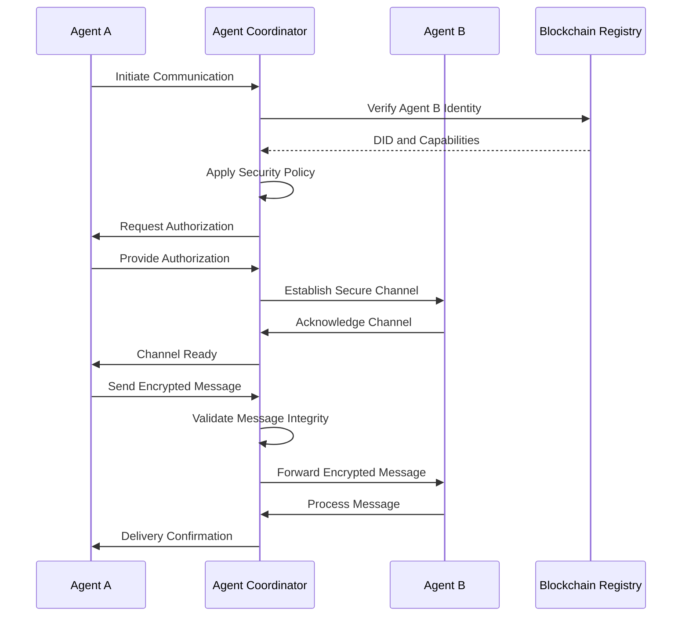
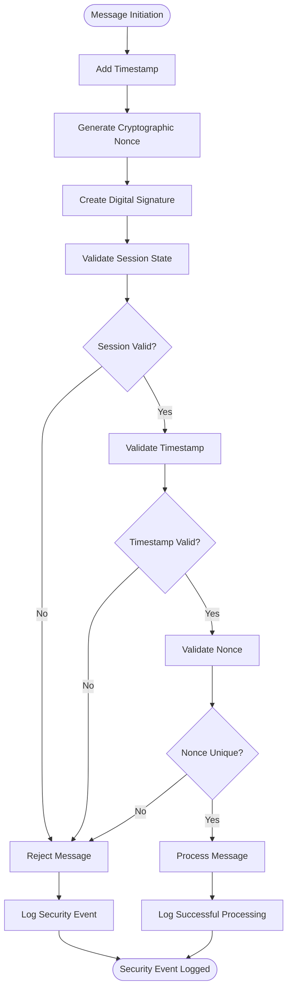

# Secure Agent Communication

<cite>
**Referenced Files in This Document**   
- [agent-coordinator-extension.js](file://371-os/src/minds371/platforms/typingmind/extensions/agent-coordinator-extension.js)
- [shared_memory.js](file://371-os/src/minds371/platforms/typingmind/extensions/shared_memory.js)
- [system_architecture.html](file://371-os/docs/architecture/system_architecture.html)
- [Sessions API Guide.md](file://elizaos/Guides/Sessions API Guide.md)
- [Sessions Architecture Deep Dive.md](file://elizaos/Deep Dive/Sessions Architecture Deep Dive.md)
- [secretless.yml](file://config/security/secretless.yml)
- [blockchain-registry.ts](file://packages/elizaos-plugins/universal-tool-server/src/blockchain-registry.ts)
</cite>

## Table of Contents
1. [Introduction](#introduction)
2. [Core Security Architecture](#core-security-architecture)
3. [End-to-End Encryption Implementation](#end-to-end-encryption-implementation)
4. [Shared Memory Architecture](#shared-memory-architecture)
5. [Agent Coordinator Extension](#agent-coordinator-extension)
6. [Communication Workflow](#communication-workflow)
7. [Threat Protection Mechanisms](#threat-protection-mechanisms)
8. [Configuration and Best Practices](#configuration-and-best-practices)
9. [Conclusion](#conclusion)

## Introduction
The 371OS ecosystem implements a comprehensive security framework for agent-to-agent communication, combining zero-trust principles, end-to-end encryption, and blockchain-based identity verification. This document details the implementation of secure communication channels between autonomous agents, focusing on cryptographic protocols, shared memory architecture, and security policy enforcement. The system ensures confidentiality, integrity, and availability of inter-agent communications while maintaining strict isolation between agents.

## Core Security Architecture



**Diagram sources**
- [system_architecture.html](file://371-os/docs/architecture/system_architecture.html#L550-L571)
- [Sessions API Guide.md](file://elizaos/Guides/Sessions API Guide.md)

**Section sources**
- [system_architecture.html](file://371-os/docs/architecture/system_architecture.html#L550-L571)

## End-to-End Encryption Implementation

The 371OS ecosystem implements end-to-end encryption for all agent communications using TLS 1.3 as the foundational cryptographic protocol. All communications are encrypted regardless of network location, adhering to zero-trust principles.

### Cryptographic Protocols
The system employs TLS 1.3 for transport layer security, providing forward secrecy and protection against downgrade attacks. Key exchange mechanisms include:

- **ECDHE (Elliptic Curve Diffie-Hellman Ephemeral)**: Provides forward secrecy
- **AES-256-GCM**: Authenticated encryption with high performance
- **SHA-384**: Cryptographic hashing for message authentication

### Key Exchange Mechanism
The key exchange process follows a zero-trust model:

1. Agent identity verification through blockchain-based DID (Decentralized Identifier)
2. Mutual TLS authentication with client certificates
3. Ephemeral key generation for each session
4. Certificate pinning to prevent man-in-the-middle attacks

### OAuth2 Implementation
Authentication is managed through OAuth2 with the Secretless Broker pattern:

```yaml
version: "2"
services:
  - name: elizaos-agents
    connector: generic_http
    authentication:
      - type: oauth2
        config:
          token_url: "${ACI_TOKEN_URL}"
          client_id: "${ACI_CLIENT_ID}"
          client_secret: "${ACI_CLIENT_SECRET}"
          scope: "agent:execute blockchain:read"
    config:
      headers:
        Authorization: "Bearer {{ .access_token }}"
```

This configuration ensures agents never directly handle credentials, eliminating credential leakage risks.

**Section sources**
- [system_architecture.html](file://371-os/docs/architecture/system_architecture.html#L550-L571)
- [secretless.yml](file://config/security/secretless.yml)

## Shared Memory Architecture

The shared memory architecture enables secure data sharing between agents while maintaining isolation through strict access controls and encryption.

### Architecture Design


**Diagram sources**
- [shared_memory.js](file://371-os/src/minds371/platforms/typingmind/extensions/shared_memory.js)

### Security Features
The shared memory system implements multiple security layers:

- **Data Encryption**: All memory segments are encrypted at rest using AES-256
- **Access Control**: Role-based access with time-limited permissions
- **Integrity Verification**: SHA-256 hashing for data integrity checks
- **Expiration Policies**: Automatic cleanup of expired memory segments
- **Audit Logging**: Comprehensive logging of all access attempts

The system ensures that agents can only access shared memory segments for which they have explicit authorization, with all access requests subject to policy validation.

**Section sources**
- [shared_memory.js](file://371-os/src/minds371/platforms/typingmind/extensions/shared_memory.js)

## Agent Coordinator Extension

The agent-coordinator-extension.js manages communication channels and enforces security policies across the agent network.

### Implementation Analysis
```javascript
// Simplified representation of agent-coordinator-extension.js
class AgentCoordinator {
    constructor() {
        this.activeChannels = new Map();
        this.securityPolicies = new PolicyEngine();
        this.messageValidator = new MessageIntegrityChecker();
    }
    
    createSecureChannel(agentA, agentB, policyConfig) {
        // Generate unique channel ID
        const channelId = this.generateChannelId(agentA, agentB);
        
        // Apply security policy
        const policy = this.securityPolicies.applyPolicy(policyConfig);
        
        // Establish encrypted channel
        const channel = new EncryptedChannel(channelId, policy);
        
        // Register channel
        this.activeChannels.set(channelId, channel);
        
        // Emit security event
        this.emit('channel.secure.created', { channelId, agents: [agentA, agentB] });
        
        return channel;
    }
    
    routeMessage(message, sourceAgent, targetAgent) {
        // Validate message integrity
        if (!this.messageValidator.verify(message)) {
            throw new SecurityError('Message integrity check failed');
        }
        
        // Check authorization
        if (!this.securityPolicies.isAuthorized(sourceAgent, targetAgent, 'message')) {
            throw new AuthorizationError('Agent not authorized to send messages');
        }
        
        // Find or create channel
        const channelId = this.findChannelId(sourceAgent, targetAgent);
        const channel = this.activeChannels.get(channelId);
        
        // Encrypt and send message
        const encryptedMessage = channel.encrypt(message);
        return channel.transmit(encryptedMessage);
    }
}
```

### Security Policy Enforcement
The coordinator enforces the following security policies:

- **Authentication**: Verifies agent identities through blockchain registry
- **Authorization**: Checks agent permissions for specific actions
- **Message Validation**: Ensures message integrity and format compliance
- **Rate Limiting**: Prevents denial-of-service attacks
- **Audit Logging**: Records all communication events

The extension acts as a central security enforcement point, ensuring all inter-agent communications comply with the system's security policies.

**Section sources**
- [agent-coordinator-extension.js](file://371-os/src/minds371/platforms/typingmind/extensions/agent-coordinator-extension.js)

## Communication Workflow

The complete communication workflow from message initiation to delivery involves multiple security checks.

### Message Flow Sequence


**Diagram sources**
- [agent-coordinator-extension.js](file://371-os/src/minds371/platforms/typingmind/extensions/agent-coordinator-extension.js)
- [blockchain-registry.ts](file://packages/elizaos-plugins/universal-tool-server/src/blockchain-registry.ts)

### Security Checks at Each Stage
1. **Initiation**: Agent identity verification and capability validation
2. **Channel Establishment**: Mutual authentication and key exchange
3. **Message Preparation**: Data encryption and integrity signing
4. **Transmission**: Secure transport with TLS 1.3
5. **Receipt**: Message decryption and integrity verification
6. **Processing**: Policy compliance and access control checks
7. **Confirmation**: Secure acknowledgment with non-repudiation

Each stage implements specific security measures to protect against various threats, ensuring end-to-end security.

**Section sources**
- [agent-coordinator-extension.js](file://371-os/src/minds371/platforms/typingmind/extensions/agent-coordinator-extension.js)
- [Sessions API Guide.md](file://elizaos/Guides/Sessions API Guide.md)

## Threat Protection Mechanisms

The 371OS ecosystem implements comprehensive protection against common security threats.

### Eavesdropping Protection
- **TLS 1.3 Encryption**: All communications encrypted in transit
- **Perfect Forward Secrecy**: Ephemeral keys prevent decryption of past communications
- **Network Segmentation**: Isolated communication channels between agents
- **Certificate Pinning**: Prevents man-in-the-middle attacks

### Tampering Protection
- **Message Authentication Codes (MACs)**: Ensures message integrity
- **Digital Signatures**: Provides non-repudiation
- **Hash Verification**: SHA-256 checksums for data integrity
- **Immutable Logging**: Blockchain-based audit trails

### Replay Attack Protection
The system prevents replay attacks through multiple mechanisms:



**Diagram sources**
- [Sessions Architecture Deep Dive.md](file://elizaos/Deep Dive/Sessions Architecture Deep Dive.md)

Key replay attack protections include:
- **Session-based authentication**: Time-limited sessions with automatic expiration
- **Cryptographic nonces**: Unique tokens for each message
- **Timestamp validation**: Messages must be within acceptable time windows
- **Sequence numbers**: Monotonically increasing message counters

The session management system implements configurable timeout policies:

```typescript
interface SessionTimeoutConfig {
    timeoutMinutes: number; // Inactivity timeout (5-1440 minutes)
    autoRenew: boolean; // Whether to automatically renew on activity
    maxDurationMinutes: number; // Maximum total session duration
    warningThresholdMinutes: number; // Minutes before expiration to warn
}
```

Sessions are automatically renewed on activity but cannot exceed their maximum duration, preventing indefinite session lifetimes.

**Section sources**
- [Sessions Architecture Deep Dive.md](file://elizaos/Deep Dive/Sessions Architecture Deep Dive.md)
- [Sessions API Guide.md](file://elizaos/Guides/Sessions API Guide.md)

## Configuration and Best Practices

### Security Configuration Options
The system provides multiple configuration options for communication security:

**Session Configuration**
```json
{
  "timeoutMinutes": 30,
  "autoRenew": true,
  "maxDurationMinutes": 720,
  "warningThresholdMinutes": 5
}
```

**Security Policy Configuration**
```yaml
policies:
  communication:
    encryption: "TLS_1.3"
    key_exchange: "ECDHE"
    cipher_suite: "AES_256_GCM"
  access_control:
    default_deny: true
    role_based: true
    time_limited: true
  monitoring:
    audit_logging: true
    anomaly_detection: true
    automatic_alerts: true
```

### Best Practices for Secure Inter-Agent Collaboration
1. **Principle of Least Privilege**: Grant agents only the minimum permissions necessary
2. **Short-Lived Sessions**: Use shorter session durations for sensitive operations
3. **Regular Credential Rotation**: Implement automated credential rotation
4. **Comprehensive Monitoring**: Enable audit logging and anomaly detection
5. **Secure Development**: Follow secure coding practices for agent implementation
6. **Regular Security Testing**: Conduct penetration testing and vulnerability assessments
7. **Incident Response Planning**: Establish procedures for security incidents

### Enterprise Security Integration
For high-security environments, implement the following enhancements:

```bash
# Enterprise security startup script
#!/bin/bash

# Start Secretless Broker
secretless-broker -f config/security/secretless.yml &

# Wait for Secretless to be ready
sleep 5

# Start agents with security context
npm run start:agents:production

echo "🔒 Agents started with enterprise security enabled"
```

This approach eliminates credential exposure and provides zero-trust security.

**Section sources**
- [secretless.yml](file://config/security/secretless.yml)
- [Sessions API Guide.md](file://elizaos/Guides/Sessions API Guide.md)

## Conclusion
The 371OS ecosystem implements a robust security framework for agent-to-agent communication, combining zero-trust architecture, end-to-end encryption, and blockchain-based identity verification. The system protects against eavesdropping, tampering, and replay attacks through multiple layered defenses, including TLS 1.3 encryption, cryptographic nonces, and time-limited sessions. The agent coordinator extension enforces security policies across communication channels, while the shared memory architecture enables secure data sharing with strict access controls. By following best practices and leveraging the available configuration options, organizations can establish secure inter-agent collaboration that meets enterprise security requirements.