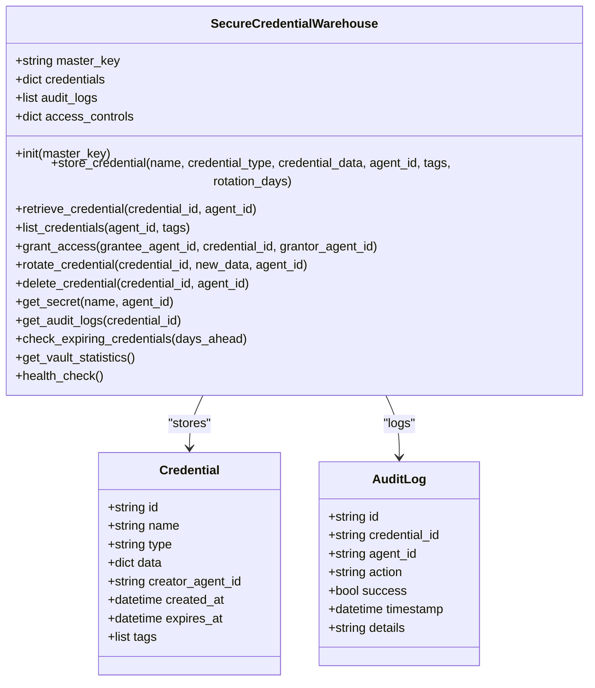
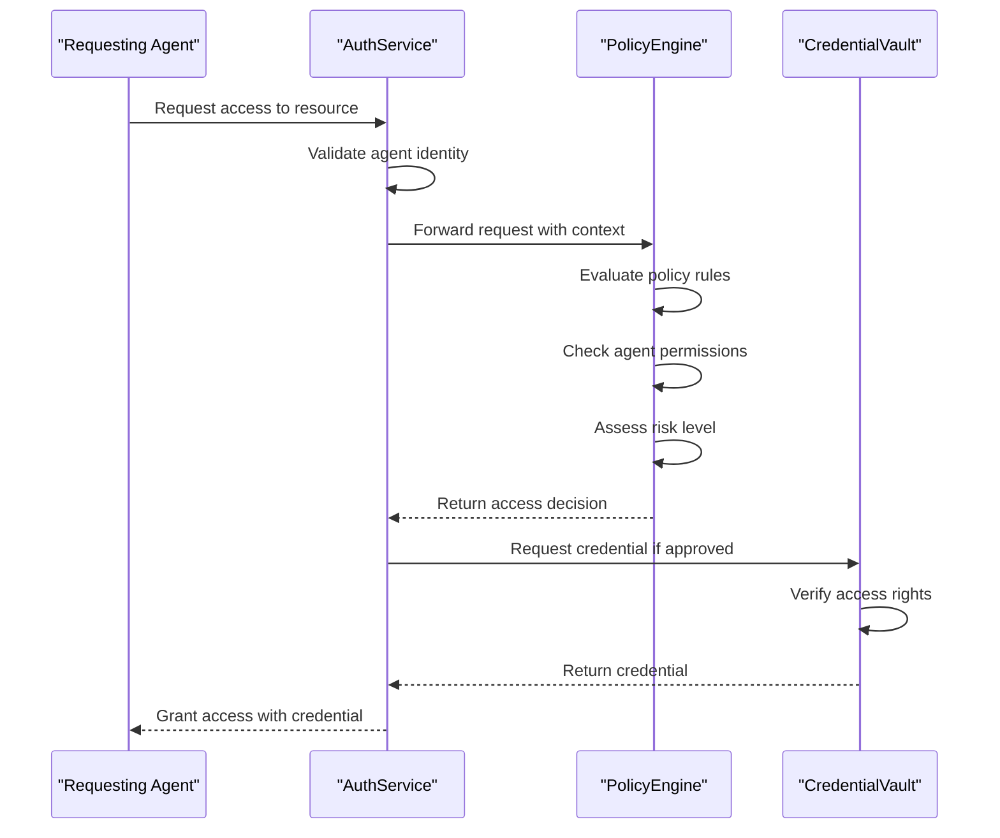
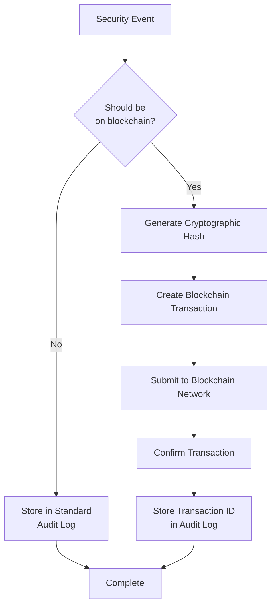
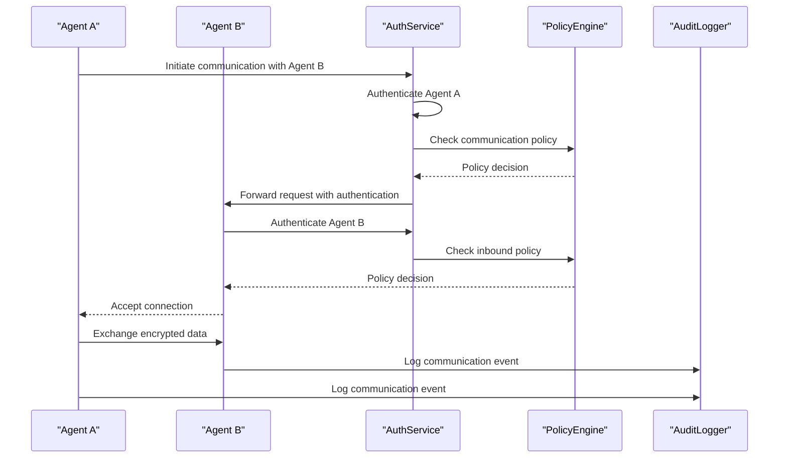
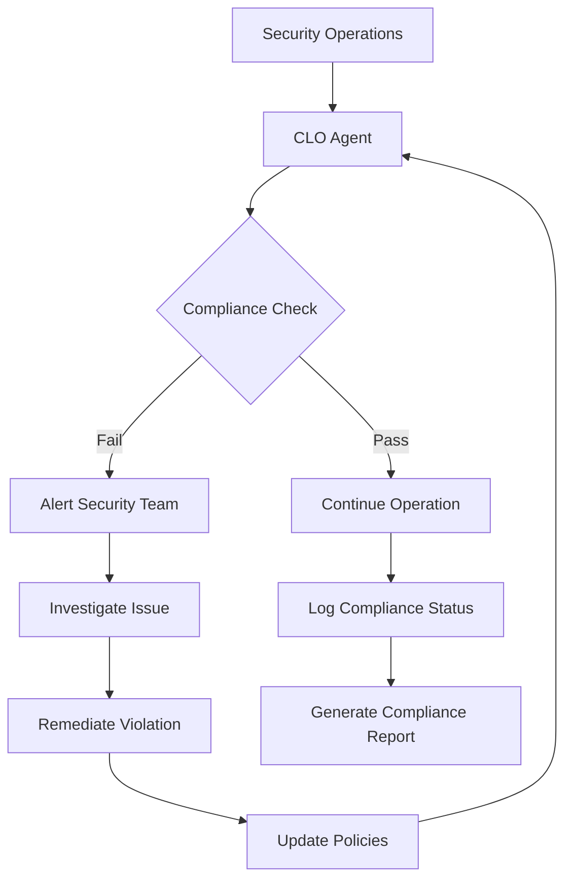

# Zero-Trust Security Architecture

<cite>
**Referenced Files in This Document**   
- [credential_warehouse_agent.py](file://371-os/src/minds371/agents/utility/credential_warehouse_agent.py)
- [auth_service.py](file://371-os/src/minds371/services/security/auth_service.py)
- [policy_engine.py](file://371-os/src/minds371/adaptive_llm_router/policy_engine.py)
- [blockchain-registry.ts](file://packages/elizaos-plugins/universal-tool-server/src/blockchain-registry.ts)
- [audit_logger.py](file://371-os/src/minds371/services/security/audit_logger.py)
</cite>

## Table of Contents
1. [Introduction](#introduction)
2. [Core Security Components](#core-security-components)
3. [Zero-Trust Implementation](#zero-trust-implementation)
4. [Credential Management System](#credential-management-system)
5. [Access Control and Policy Enforcement](#access-control-and-policy-enforcement)
6. [Blockchain Integration for Audit Logging](#blockchain-integration-for-audit-logging)
7. [Security Workflow and Sequence Diagrams](#security-workflow-and-sequence-diagrams)
8. [Compliance and Legal Oversight](#compliance-and-legal-oversight)
9. [Configuration Examples](#configuration-examples)
10. [Conclusion](#conclusion)

## Introduction
The Zero-Trust Security Architecture in 371OS implements a comprehensive security framework that eliminates implicit trust within the agent ecosystem. This architecture enforces continuous verification, least privilege access, and micro-segmentation across all system components. The framework is designed to protect sensitive data, prevent unauthorized access, and ensure compliance with enterprise security standards. By integrating advanced credential management, dynamic policy enforcement, and immutable audit logging, 371OS establishes a robust security posture that adapts to evolving threats and operational requirements.

## Core Security Components
The 371OS security framework consists of several interconnected components that work together to enforce zero-trust principles. These components include the SecureCredentialWarehouse for credential management, the AuthService for authentication, the PolicyEngine for access control decisions, and the AuditLogger for security event tracking. The integration of blockchain technology provides tamper-proof evidence collection and immutable audit logging. These components are designed to work seamlessly across the agent ecosystem, ensuring consistent security policies and real-time threat detection.

**Section sources**
- [credential_warehouse_agent.py](file://371-os/src/minds371/agents/utility/credential_warehouse_agent.py#L0-L203)
- [auth_service.py](file://371-os/src/minds371/services/security/auth_service.py#L0-L0)
- [policy_engine.py](file://371-os/src/minds371/adaptive_llm_router/policy_engine.py#L0-L0)

## Zero-Trust Implementation
The zero-trust implementation in 371OS follows the principle of "never trust, always verify" across all interactions within the agent ecosystem. Continuous authentication mechanisms ensure that every request is validated regardless of origin. The system implements micro-segmentation to isolate agent functions and limit lateral movement in case of compromise. Least privilege access is enforced through granular permission controls and just-in-time access provisioning. All communications are encrypted end-to-end, and all access decisions are logged for audit and compliance purposes. The architecture assumes that threats can originate from both outside and inside the network, requiring comprehensive security measures at every layer.

```mermaid
graph TB
subgraph "Zero-Trust Principles"
A[Continuous Authentication] --> B[Least Privilege Access]
B --> C[Micro-Segmentation]
C --> D[Dynamic Policy Enforcement]
D --> E[Immutable Audit Logging]
end
subgraph "Security Components"
F[SecureCredentialWarehouse] --> G[AuthService]
G --> H[PolicyEngine]
H --> I[AuditLogger]
I --> J[Blockchain Registry]
end
Zero-Trust Principles --> Security Components
```

**Diagram sources**
- [credential_warehouse_agent.py](file://371-os/src/minds371/agents/utility/credential_warehouse_agent.py#L0-L203)
- [auth_service.py](file://371-os/src/minds371/services/security/auth_service.py#L0-L0)
- [policy_engine.py](file://371-os/src/minds371/adaptive_llm_router/policy_engine.py#L0-L0)

## Credential Management System
The SecureCredentialWarehouse agent provides a centralized system for secure credential storage and retrieval. This component eliminates hardcoded credentials by implementing dynamic secret injection and secretless broker integration. The warehouse uses strong encryption to protect stored credentials and enforces strict access controls based on agent identity and role. Credential rotation is automated with configurable policies, and all access attempts are logged for audit purposes. The system supports various credential types, including API keys, database passwords, and payment processor credentials, with extensible support for additional types.



**Diagram sources**
- [credential_warehouse_agent.py](file://371-os/src/minds371/agents/utility/credential_warehouse_agent.py#L0-L203)

**Section sources**
- [credential_warehouse_agent.py](file://371-os/src/minds371/agents/utility/credential_warehouse_agent.py#L0-L203)

## Access Control and Policy Enforcement
The access control system in 371OS combines the PolicyEngine with the AuthService to enforce dynamic access decisions based on real-time context. The PolicyEngine evaluates multiple factors including agent identity, request context, risk level, and compliance requirements to make access decisions. Policies are defined using a flexible rule-based system that supports complex conditions and temporal constraints. The integration with ACI.dev (Agent Control Interface) enables fine-grained policy enforcement across the agent ecosystem. Access decisions are cached for performance while maintaining security, and all decisions are logged for audit and compliance purposes.



**Diagram sources**
- [auth_service.py](file://371-os/src/minds371/services/security/auth_service.py#L0-L0)
- [policy_engine.py](file://371-os/src/minds371/adaptive_llm_router/policy_engine.py#L0-L0)
- [credential_warehouse_agent.py](file://371-os/src/minds371/agents/utility/credential_warehouse_agent.py#L0-L203)

**Section sources**
- [auth_service.py](file://371-os/src/minds371/services/security/auth_service.py#L0-L0)
- [policy_engine.py](file://371-os/src/minds371/adaptive_llm_router/policy_engine.py#L0-L0)

## Blockchain Integration for Audit Logging
The integration of blockchain technology provides immutable audit logging and tamper-proof evidence collection for security events in 371OS. The blockchain-registry service records critical security events, access decisions, and credential operations on a distributed ledger, ensuring data integrity and non-repudiation. This integration enables verifiable audit trails that cannot be altered or deleted, meeting stringent compliance requirements for enterprise deployments. The system uses cryptographic hashing to link audit records, creating a chain of evidence that can be independently verified. This approach enhances transparency and trust in the security framework while supporting regulatory compliance and forensic investigations.



**Diagram sources**
- [blockchain-registry.ts](file://packages/elizaos-plugins/universal-tool-server/src/blockchain-registry.ts#L0-L0)
- [audit_logger.py](file://371-os/src/minds371/services/security/audit_logger.py#L0-L0)

**Section sources**
- [blockchain-registry.ts](file://packages/elizaos-plugins/universal-tool-server/src/blockchain-registry.ts#L0-L0)
- [audit_logger.py](file://371-os/src/minds371/services/security/audit_logger.py#L0-L0)

## Security Workflow and Sequence Diagrams
The security workflows in 371OS define the step-by-step processes for critical operations such as agent-to-agent communication, tool access, and data sharing. These workflows incorporate continuous authentication, policy evaluation, and audit logging at each step. The sequence diagrams illustrate the interactions between security components and agents during these operations, showing how zero-trust principles are enforced throughout the process. Each workflow is designed to minimize attack surface, prevent privilege escalation, and ensure accountability through comprehensive logging.



**Diagram sources**
- [auth_service.py](file://371-os/src/minds371/services/security/auth_service.py#L0-L0)
- [policy_engine.py](file://371-os/src/minds371/adaptive_llm_router/policy_engine.py#L0-L0)
- [audit_logger.py](file://371-os/src/minds371/services/security/audit_logger.py#L0-L0)

## Compliance and Legal Oversight
The CLO Agent (Alex) plays a critical role in legal compliance and policy oversight within the 371OS security framework. This agent monitors all security operations for compliance with regulatory requirements and organizational policies. It conducts regular audits of access patterns, identifies potential policy violations, and recommends corrective actions. The CLO Agent also manages data governance policies, ensuring that sensitive information is handled according to privacy regulations and industry standards. By integrating legal expertise with automated monitoring, this component provides continuous compliance assurance and reduces the risk of regulatory penalties.



**Section sources**
- [credential_warehouse_agent.py](file://371-os/src/minds371/agents/utility/credential_warehouse_agent.py#L0-L203)

## Configuration Examples
The following examples demonstrate how to configure security policies, manage identities, and audit security events in 371OS. These configurations illustrate the practical implementation of zero-trust principles and provide guidance for system administrators.

### Security Policy Configuration
```yaml
# Example security policy for database access
policies:
  - name: "Database Access Policy"
    description: "Control access to production databases"
    conditions:
      agent_role: "database_admin"
      time_of_day:
        start: "09:00"
        end: "17:00"
      day_of_week: [1,2,3,4,5] # Monday to Friday
    actions:
      - "read_database"
      - "write_database"
    enforcement:
      mfa_required: true
      session_duration: "4h"
      audit_logging: true
```

### Identity Management Configuration
```python
# Example of creating and managing agent identities
async def configure_agent_identity():
    # Create new agent identity
    agent_id = await identity_manager.create_agent(
        name="finance_processor",
        role="finance_agent",
        permissions=["read_financial_data", "process_payments"]
    )
    
    # Assign policies to agent
    await policy_engine.assign_policy(
        agent_id=agent_id,
        policy_name="Finance Data Access"
    )
    
    # Set up multi-factor authentication
    await auth_service.configure_mfa(
        agent_id=agent_id,
        mfa_methods=["totp", "security_key"]
    )
    
    return agent_id
```

### Audit Event Configuration
```json
{
  "audit_configuration": {
    "events_to_monitor": [
      "credential_access",
      "policy_violation",
      "identity_change",
      "data_export"
    ],
    "retention_period_days": 365,
    "blockchain_integration": {
      "enabled": true,
      "critical_events": [
        "superuser_access",
        "policy_change",
        "credential_rotation"
      ]
    },
    "alert_thresholds": {
      "failed_attempts": 5,
      "suspicious_activity": true
    }
  }
}
```

**Section sources**
- [credential_warehouse_agent.py](file://371-os/src/minds371/agents/utility/credential_warehouse_agent.py#L0-L203)
- [policy_engine.py](file://371-os/src/minds371/adaptive_llm_router/policy_engine.py#L0-L0)

## Conclusion
The Zero-Trust Security Architecture in 371OS provides a comprehensive framework for securing the agent ecosystem against evolving threats. By implementing continuous authentication, least privilege access, and micro-segmentation, the system eliminates implicit trust and enforces security at every level. The integration of the SecureCredentialWarehouse eliminates hardcoded credentials and enables dynamic secret injection, while the PolicyEngine and ACI.dev integration provide fine-grained access control. The use of blockchain technology for audit logging ensures data integrity and supports compliance requirements. The CLO Agent (Alex) provides legal oversight and policy compliance monitoring, completing the security framework. This architecture demonstrates how modern security principles can be effectively implemented in a complex agent-based system to protect sensitive data and maintain operational integrity.