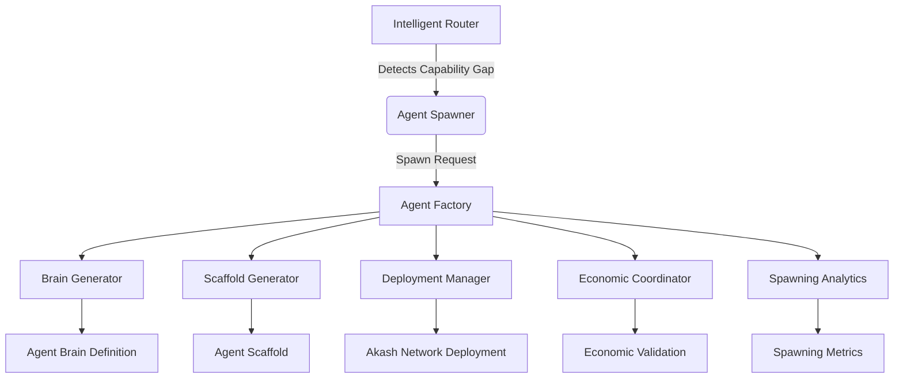
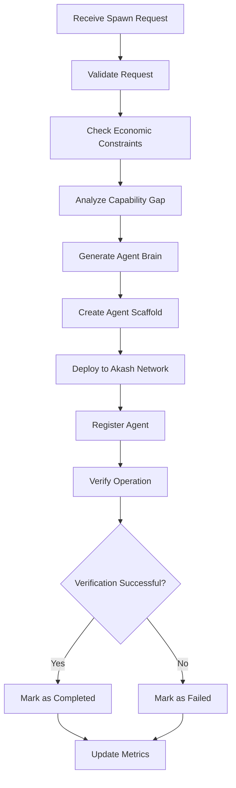
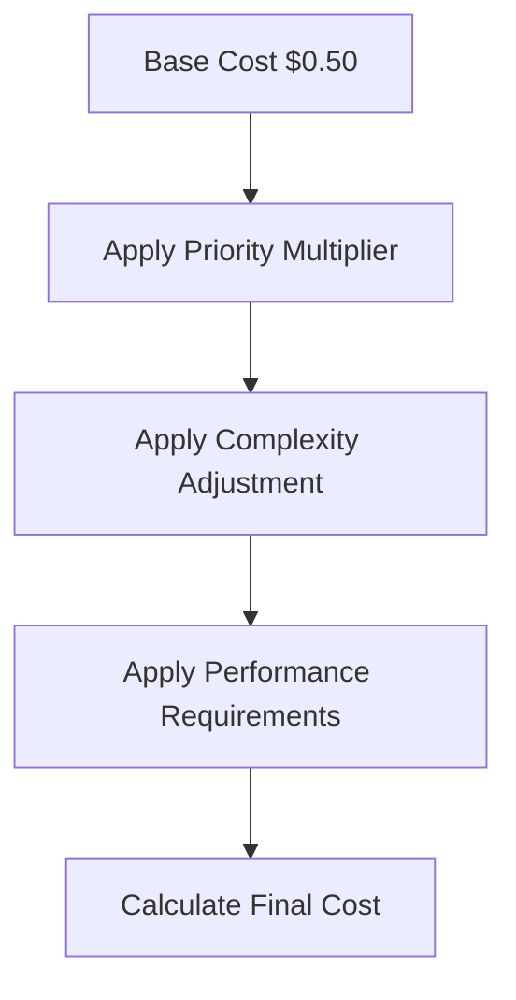
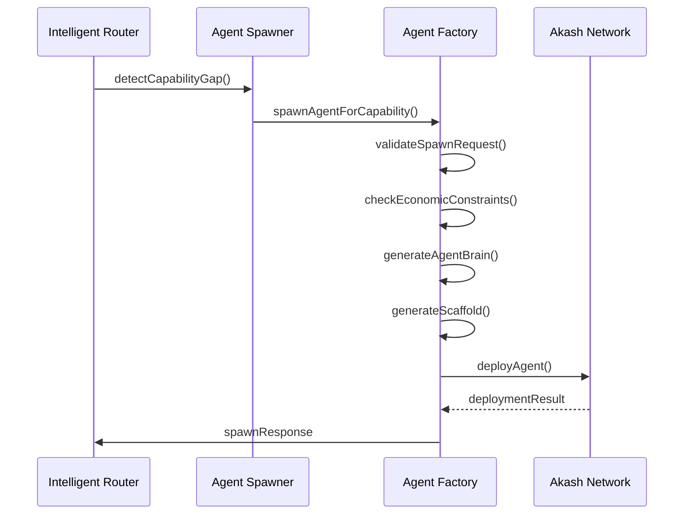

# Autonomous Agent Spawning

<cite>
**Referenced Files in This Document **   
- [index.ts](file://os-workspace/apps/agent-factory/src/index.ts)
- [factory-controller.ts](file://os-workspace/apps/agent-factory/src/factory-controller.ts)
- [types.ts](file://os-workspace/apps/agent-factory/src/types.ts)
- [brain-generator.ts](file://os-workspace/apps/agent-factory/src/brain-generator.ts)
- [scaffold-generator.ts](file://os-workspace/apps/agent-factory/src/scaffold-generator.ts)
- [deployment-manager.ts](file://os-workspace/apps/agent-factory/src/deployment-manager.ts)
- [economic-coordinator.ts](file://os-workspace/apps/agent-factory/src/economic-coordinator.ts)
- [agent-spawner.ts](file://os-workspace/apps/intelligent-router/src/agent-spawner.ts)
</cite>

## Table of Contents
1. [Introduction](#introduction)
2. [System Architecture](#system-architecture)
3. [Core Components](#core-components)
4. [Spawning Process Flow](#spawning-process-flow)
5. [Resource Allocation Model](#resource-allocation-model)
6. [Integration with Agent Ecosystem](#integration-with-agent-ecosystem)
7. [Practical Spawning Scenarios](#practical-spawning-scenarios)
8. [Troubleshooting Failed Spawn Operations](#troubleshooting-failed-spawn-operations)
9. [Conclusion](#conclusion)

## Introduction

The Autonomous Agent Spawning system is a core component of the 371 OS ecosystem, responsible for dynamically creating specialized agents to address capability gaps within the agent network. This self-organizing system enables the platform to adapt to evolving requirements by autonomously generating new agents when existing capabilities are insufficient or unavailable.

The spawning process is triggered by the Intelligent Router when it detects a capability gap during task routing. The system follows a structured workflow that includes brain generation, body scaffolding, deployment, and registration, ensuring that newly created agents are fully integrated into the ecosystem. Economic safeguards and performance monitoring ensure responsible resource utilization and maintain system stability.

This documentation provides comprehensive details about the spawning system's architecture, implementation, activation triggers, resource allocation model, and integration points with the broader Agent Ecosystem.

**Section sources**
- [index.ts](file://os-workspace/apps/agent-factory/src/index.ts#L0-L233)
- [factory-controller.ts](file://os-workspace/apps/agent-factory/src/factory-controller.ts#L0-L574)

## System Architecture

The Autonomous Agent Spawning system follows a modular architecture with distinct components handling different aspects of the spawning process. The system is designed as a microservice that can be invoked by other components in the ecosystem, particularly the Intelligent Router.



**Diagram sources **
- [index.ts](file://os-workspace/apps/agent-factory/src/index.ts#L0-L233)
- [factory-controller.ts](file://os-workspace/apps/agent-factory/src/factory-controller.ts#L0-L574)
- [agent-spawner.ts](file://os-workspace/apps/intelligent-router/src/agent-spawner.ts#L0-L361)

## Core Components

The Autonomous Agent Spawning system consists of several core components that work together to create and deploy new agents:

### Agent Factory
The central orchestrator that coordinates the entire spawning process. It receives spawn requests, validates them, and manages the workflow through various phases including brain generation, scaffolding, deployment, and registration.

### Brain Generator
Responsible for creating the cognitive framework of the new agent. It analyzes the required capabilities and generates a YAML definition containing the agent's personality traits, core instructions, tool requirements, and performance targets.

### Scaffold Generator
Creates the application structure for the new agent using the nx-workspace plugin. It generates the necessary project files, configuration, and build scripts to create a fully functional agent application.

### Deployment Manager
Handles the deployment of the generated agent to the Akash Network. It coordinates containerization, deployment manifest creation, and health monitoring to ensure successful deployment.

### Economic Coordinator
Implements economic safeguards to prevent excessive resource consumption. It validates spawn requests against cost thresholds, budget allocations, and rate limits to ensure responsible spawning behavior.

### Spawning Analytics
Tracks metrics related to the spawning process, including success rates, average spawn times, cost efficiency, and capability gap trends.

**Section sources**
- [index.ts](file://os-workspace/apps/agent-factory/src/index.ts#L0-L233)
- [factory-controller.ts](file://os-workspace/apps/agent-factory/src/factory-controller.ts#L0-L574)
- [brain-generator.ts](file://os-workspace/apps/agent-factory/src/brain-generator.ts#L0-L578)
- [scaffold-generator.ts](file://os-workspace/apps/agent-factory/src/scaffold-generator.ts#L0-L252)
- [deployment-manager.ts](file://os-workspace/apps/agent-factory/src/deployment-manager.ts#L0-L201)
- [economic-coordinator.ts](file://os-workspace/apps/agent-factory/src/economic-coordinator.ts#L0-L199)

## Spawning Process Flow

The autonomous agent spawning process follows a well-defined sequence of phases, each with specific responsibilities and validation checkpoints.



**Diagram sources **
- [factory-controller.ts](file://os-workspace/apps/agent-factory/src/factory-controller.ts#L0-L574)
- [types.ts](file://os-workspace/apps/agent-factory/src/types.ts#L0-L372)

## Resource Allocation Model

The Autonomous Agent Spawning system implements a sophisticated resource allocation model that balances performance requirements with economic constraints. The model considers multiple factors when allocating resources to new agents.

### Resource Categories
The system allocates resources across several categories:

<table>
  <thead>
    <tr>
      <th>Resource Type</th>
      <th>Description</th>
      <th>Allocation Method</th>
    </tr>
  </thead>
  <tbody>
    <tr>
      <td>CPU</td>
      <td>Processing power allocated to the agent</td>
      <td>Based on complexity and priority of tasks</td>
    </tr>
    <tr>
      <td>Memory</td>
      <td>RAM allocated for agent operation</td>
      <td>Determined by agent type and expected workload</td>
    </tr>
    <tr>
      <td>Storage</td>
      <td>Disk space for agent data and logs</td>
      <td>Standard allocation with potential for expansion</td>
    </tr>
    <tr>
      <td>Network</td>
      <td>Bandwidth and connectivity requirements</td>
      <td>Based on communication patterns and integration needs</td>
    </tr>
  </tbody>
</table>

### Cost Calculation
The Economic Coordinator calculates spawn costs based on multiple factors:



The final cost is determined by:
- Base cost: $0.50
- Priority multiplier (0.7x to 2.0x)
- Complexity adjustment (up to +1.0x)
- Performance requirements (up to +1.5x)

**Section sources**
- [economic-coordinator.ts](file://os-workspace/apps/agent-factory/src/economic-coordinator.ts#L0-L199)
- [types.ts](file://os-workspace/apps/agent-factory/src/types.ts#L0-L372)
- [deployment-manager.ts](file://os-workspace/apps/agent-factory/src/deployment-manager.ts#L0-L201)

## Integration with Agent Ecosystem

The Autonomous Agent Spawning system is deeply integrated with the broader Agent Ecosystem, enabling seamless coordination between components.

### Trigger Mechanism
The spawning process is initiated by the Intelligent Router when it detects a capability gap during task routing. The router evaluates incoming tasks and determines whether existing agents can handle them effectively.



**Diagram sources **
- [agent-spawner.ts](file://os-workspace/apps/intelligent-router/src/agent-spawner.ts#L0-L361)
- [factory-controller.ts](file://os-workspace/apps/agent-factory/src/factory-controller.ts#L0-L574)

### Self-Registration Protocol
Newly spawned agents implement a self-registration protocol to integrate with the ecosystem:

1. Upon initialization, the agent contacts the Blockchain Registry
2. It registers its capabilities, performance characteristics, and availability
3. The registry updates its index to include the new agent
4. The Intelligent Router begins routing relevant tasks to the new agent

### Monitoring Integration
The spawning system integrates with the monitoring infrastructure to provide real-time insights into spawning operations and agent performance.

**Section sources**
- [agent-spawner.ts](file://os-workspace/apps/intelligent-router/src/agent-spawner.ts#L0-L361)
- [factory-controller.ts](file://os-workspace/apps/agent-factory/src/factory-controller.ts#L0-L574)
- [types.ts](file://os-workspace/apps/agent-factory/src/types.ts#L0-L372)

## Practical Spawning Scenarios

The Autonomous Agent Spawning system handles various scenarios based on the nature of capability gaps and system requirements.

### Scenario 1: Critical Capability Gap
When a critical capability is missing from the ecosystem, the system prioritizes rapid spawning with performance optimization.

**Example**: A security vulnerability requires immediate attention, but no specialized security agents exist.

```json
{
  "capability": "security-audit-specialist",
  "taskDescription": "Conduct comprehensive security audit of all system components",
  "priority": "CRITICAL",
  "performanceRequirements": {
    "maxResponseTime": 2000,
    "minSuccessRate": 0.95
  },
  "economicConstraints": {
    "budgetPriority": "performance-optimized"
  }
}
```

### Scenario 2: Performance Gap
When existing agents are underperforming, the system spawns specialized agents with enhanced capabilities.

**Example**: Marketing analysis tasks are taking too long, requiring a more specialized analytics agent.

```json
{
  "capability": "advanced-marketing-analyst",
  "taskDescription": "Process complex marketing data sets and generate strategic insights",
  "priority": "HIGH",
  "performanceRequirements": {
    "maxResponseTime": 3000,
    "minSuccessRate": 0.90
  },
  "domainHints": ["analytics", "marketing"]
}
```

### Scenario 3: Availability Gap
When agents are available but overloaded, the system spawns additional instances to handle demand.

**Example**: Customer support requests exceed current capacity during peak hours.

```json
{
  "capability": "customer-support-agent",
  "taskDescription": "Handle customer inquiries and resolve technical issues",
  "priority": "MEDIUM",
  "performanceRequirements": {
    "maxResponseTime": 5000,
    "minSuccessRate": 0.85
  },
  "economicConstraints": {
    "budgetPriority": "cost-optimized"
  }
}
```

**Section sources**
- [types.ts](file://os-workspace/apps/agent-factory/src/types.ts#L0-L372)
- [factory-controller.ts](file://os-workspace/apps/agent-factory/src/factory-controller.ts#L0-L574)
- [agent-spawner.ts](file://os-workspace/apps/intelligent-router/src/agent-spawner.ts#L0-L361)

## Troubleshooting Failed Spawn Operations

Despite robust design, spawn operations may occasionally fail. This section outlines common failure modes and troubleshooting strategies.

### Common Failure Modes

<table>
  <thead>
    <tr>
      <th>Failure Type</th>
      <th>Possible Causes</th>
      <th>Troubleshooting Steps</th>
    </tr>
  </thead>
  <tbody>
    <tr>
      <td>Economic Validation Failed</td>
      <td>Budget exceeded, cost thresholds reached</td>
      <td>Review budget allocations, adjust priority, optimize requirements</td>
    </tr>
    <tr>
      <td>Container Build Failed</td>
      <td>Missing dependencies, build configuration errors</td>
      <td>Verify dependencies, check build configuration, validate Dockerfile</td>
    </tr>
    <tr>
      <td>Deployment Failed</td>
      <td>Network issues, resource constraints, Akash configuration</td>
      <td>Check Akash network status, verify resource availability, validate SDL</td>
    </tr>
    <tr>
      <td>Health Check Failed</td>
      <td>Application errors, startup issues, connectivity problems</td>
      <td>Review application logs, verify configuration, test connectivity</td>
    </tr>
  </tbody>
</table>

### Diagnostic Commands
The system provides several commands for diagnosing spawn operations:

- `healthCheck()`: Verifies the health of all spawning components
- `getSpawnStatus(spawnId)`: Retrieves the current status of a specific spawn operation
- `getMetrics()`: Provides detailed metrics on spawning performance and success rates
- `cleanupCompletedSpawns()`: Removes completed spawn records to free resources

### Recovery Strategies
When a spawn operation fails, the system implements the following recovery strategies:

1. **Retry with Adjusted Parameters**: Modify spawn request parameters and retry
2. **Fallback to Existing Agents**: Route tasks to less specialized but available agents
3. **Manual Intervention Required**: Escalate to human operators for complex issues
4. **System-Wide Analysis**: Analyze failure patterns to identify systemic issues

**Section sources**
- [factory-controller.ts](file://os-workspace/apps/agent-factory/src/factory-controller.ts#L0-L574)
- [economic-coordinator.ts](file://os-workspace/apps/agent-factory/src/economic-coordinator.ts#L0-L199)
- [deployment-manager.ts](file://os-workspace/apps/agent-factory/src/deployment-manager.ts#L0-L201)

## Conclusion

The Autonomous Agent Spawning system represents a significant advancement in adaptive AI ecosystems, enabling the 371 OS to dynamically respond to changing requirements and capability gaps. By automating the creation and deployment of specialized agents, the system enhances the platform's flexibility, resilience, and overall effectiveness.

Key strengths of the system include its modular architecture, economic safeguards, and deep integration with the broader Agent Ecosystem. The spawning process follows a well-defined workflow that ensures consistent quality and reliable operation.

Future enhancements could include machine learning-based prediction of capability needs, more sophisticated resource optimization algorithms, and enhanced collaboration protocols between newly spawned agents and existing ones. As the ecosystem evolves, the Autonomous Agent Spawning system will continue to play a crucial role in maintaining the platform's adaptability and competitive advantage.

[No sources needed since this section summarizes without analyzing specific files]