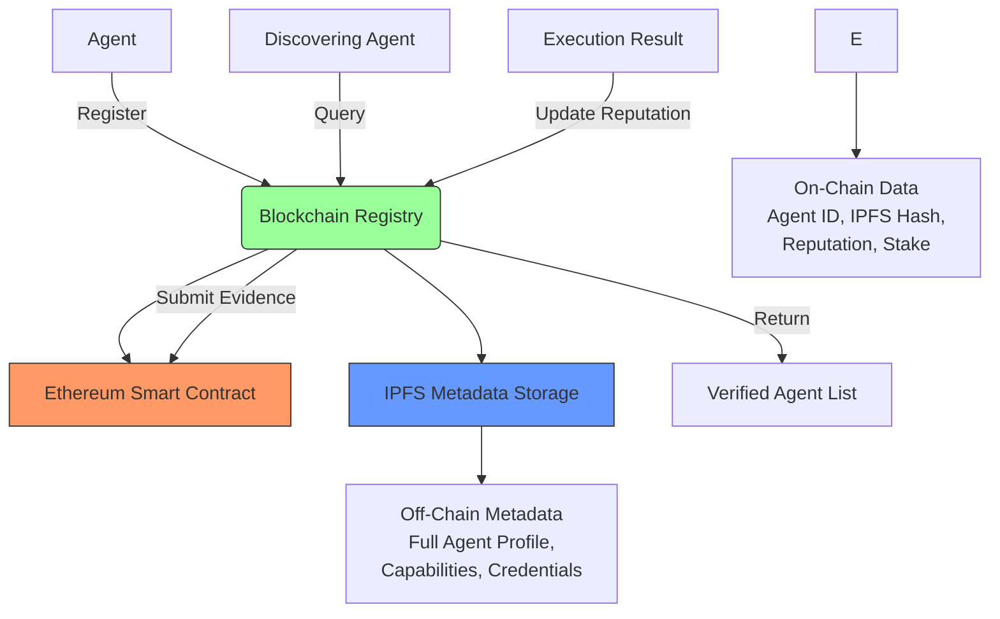
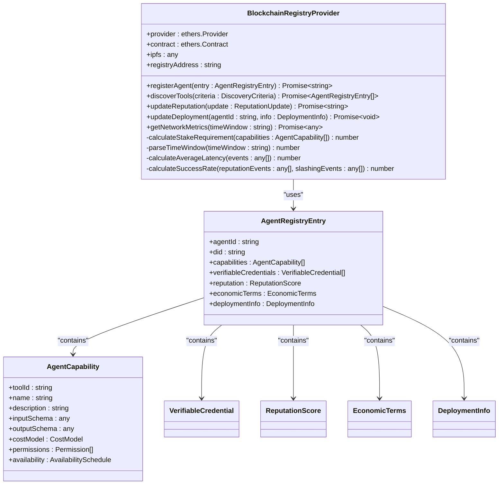
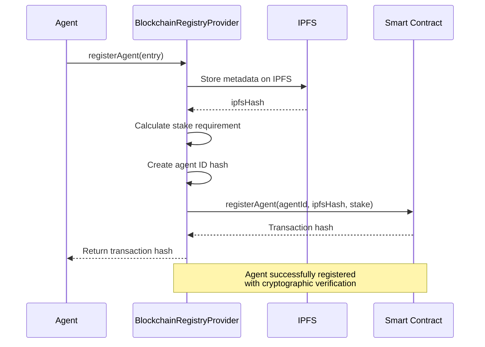
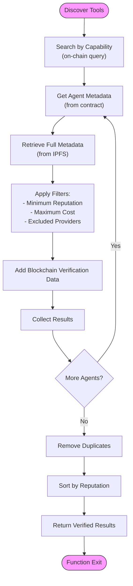
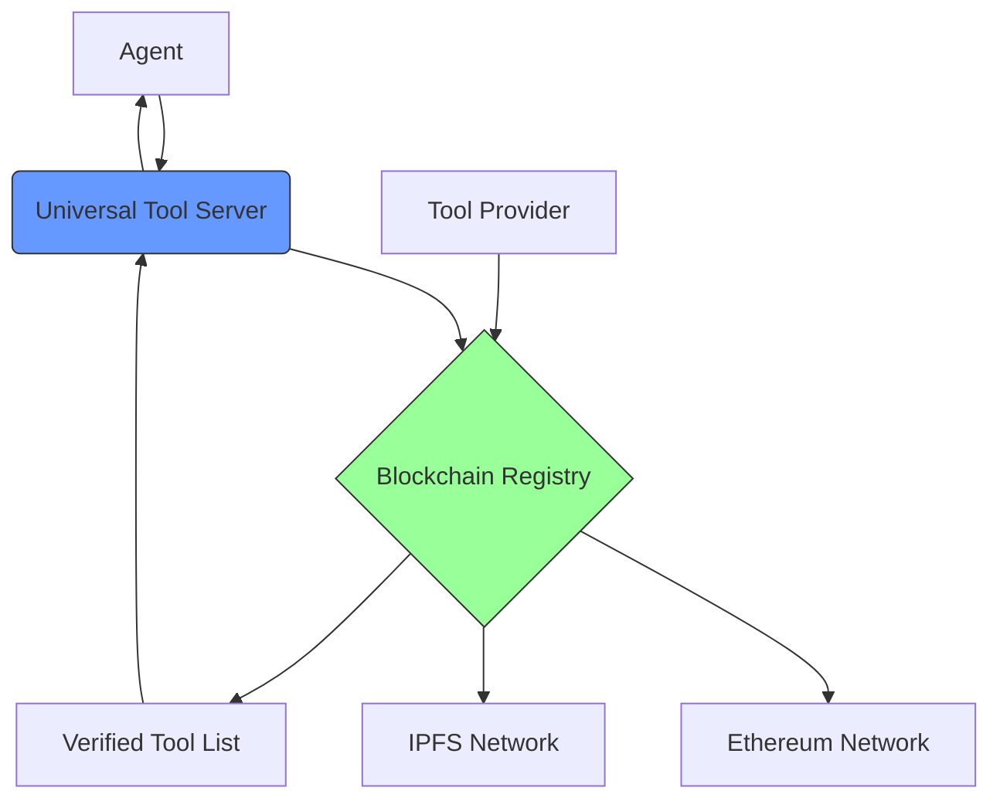
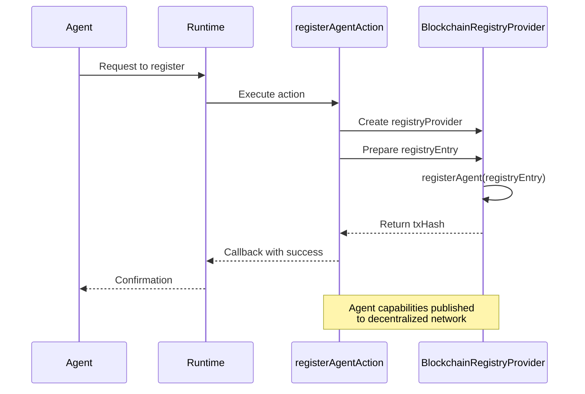

# Blockchain Registry Documentation

<cite>
**Referenced Files in This Document**   
- [blockchain-registry.ts](file://os-workspace/packages/universal-tool-server/src/blockchain-registry.ts)
- [types.ts](file://os-workspace/packages/universal-tool-server/src/types.ts)
- [index.ts](file://os-workspace/libs/blockchain-registry/src/index.ts)
- [index.test.ts](file://os-workspace/libs/blockchain-registry/src/index.test.ts)
- [README.md](file://os-workspace/libs/blockchain-registry/README.md)
- [here's the thing.md](file://_legacy/sotalogic/Claude Sonnet 4/Alignment Review of 371OS_launch Project Plan/here's the thing.md)
</cite>

## Table of Contents
1. [Introduction](#introduction)
2. [Project Structure](#project-structure)
3. [Core Components](#core-components)
4. [Architecture Overview](#architecture-overview)
5. [Detailed Component Analysis](#detailed-component-analysis)
6. [Integration Patterns](#integration-patterns)
7. [API Interfaces](#api-interfaces)
8. [Practical Examples](#practical-examples)
9. [Troubleshooting Guide](#troubleshooting-guide)

## Introduction
The Blockchain Registry system is a decentralized agent coordination and discovery mechanism within the 371 Minds OS ecosystem. It enables trustless interaction between autonomous agents by leveraging blockchain technology for cryptographic verification, reputation management, and economic coordination. The registry stores agent metadata on IPFS and anchors cryptographic hashes on-chain, creating a tamper-proof record of capabilities, credentials, and performance history. This documentation provides comprehensive coverage of the system's architecture, implementation details, API interfaces, and integration patterns.

## Project Structure
The Blockchain Registry implementation spans multiple components across the repository, with core functionality distributed between shared libraries and service implementations. The primary components are organized as follows:

```mermaid
graph TB
subgraph "Core Library"
A[blockchain-registry<br/>@371minds/blockchain-registry]
B[index.ts]
C[index.test.ts]
end
subgraph "Universal Tool Server"
D[blockchain-registry.ts]
E[types.ts]
end
subgraph "Documentation"
F[README.md]
end
A --> D
B --> A
C --> A
E --> D
F --> A
style A fill:#f9f,stroke:#333
style D fill:#bbf,stroke:#333
```

**Diagram sources**
- [blockchain-registry.ts](file://os-workspace/packages/universal-tool-server/src/blockchain-registry.ts)
- [index.ts](file://os-workspace/libs/blockchain-registry/src/index.ts)
- [types.ts](file://os-workspace/packages/universal-tool-server/src/types.ts)

**Section sources**
- [README.md](file://os-workspace/libs/blockchain-registry/README.md)

## Core Components
The Blockchain Registry system consists of several key components that work together to enable decentralized agent discovery and coordination. The core interface `BlockchainRegistryProvider` defines the contract for registry operations, while `BlockchainRegistryProviderImpl` serves as the reference implementation. Agent metadata is structured using rich type definitions that capture capabilities, reputation, economic terms, and deployment information. The system integrates with IPFS for decentralized metadata storage and Ethereum-based smart contracts for on-chain verification.

**Section sources**
- [index.ts](file://os-workspace/libs/blockchain-registry/src/index.ts)
- [types.ts](file://os-workspace/packages/universal-tool-server/src/types.ts)

## Architecture Overview
The Blockchain Registry follows a hybrid decentralized architecture that combines on-chain verification with off-chain data storage. This design balances security, scalability, and cost efficiency while maintaining full transparency and auditability.



**Diagram sources**
- [blockchain-registry.ts](file://os-workspace/packages/universal-tool-server/src/blockchain-registry.ts)
- [types.ts](file://os-workspace/packages/universal-tool-server/src/types.ts)

## Detailed Component Analysis

### Blockchain Registry Provider
The `BlockchainRegistryProvider` class implements the core functionality for agent registration, discovery, and reputation management. It serves as the primary interface between agents and the decentralized registry system.



**Diagram sources**
- [blockchain-registry.ts](file://os-workspace/packages/universal-tool-server/src/blockchain-registry.ts)
- [types.ts](file://os-workspace/packages/universal-tool-server/src/types.ts)

**Section sources**
- [blockchain-registry.ts](file://os-workspace/packages/universal-tool-server/src/blockchain-registry.ts)

### Agent Registration Flow
The agent registration process combines decentralized storage with on-chain verification to establish cryptographic trust in agent identities and capabilities.



**Diagram sources**
- [blockchain-registry.ts](file://os-workspace/packages/universal-tool-server/src/blockchain-registry.ts#L66-L101)
- [here's the thing.md](file://_legacy/sotalogic/Claude Sonnet 4/Alignment Review of 371OS_launch Project Plan/here's the thing.md#L5888-L5933)

**Section sources**
- [blockchain-registry.ts](file://os-workspace/packages/universal-tool-server/src/blockchain-registry.ts#L66-L101)

### Tool Discovery Algorithm
The tool discovery mechanism enables agents to find suitable service providers based on capabilities, reputation, and economic constraints through a multi-step filtering process.



**Diagram sources**
- [blockchain-registry.ts](file://os-workspace/packages/universal-tool-server/src/blockchain-registry.ts#L101-L139)

**Section sources**
- [blockchain-registry.ts](file://os-workspace/packages/universal-tool-server/src/blockchain-registry.ts#L101-L139)

## Integration Patterns
The Blockchain Registry integrates with various components of the 371 Minds OS ecosystem through well-defined patterns that enable seamless agent coordination and discovery.

### Universal Tool Server Integration
The registry is tightly integrated with the Universal Tool Server, which serves as the primary access point for agent-tool interactions. This integration enables decentralized discovery of tools and services without relying on centralized directories.



**Diagram sources**
- [README.md](file://os-workspace/libs/blockchain-registry/README.md#L66-L72)

**Section sources**
- [README.md](file://os-workspace/libs/blockchain-registry/README.md#L66-L72)

### Agent Action Integration
The registry functionality is exposed through agent actions that enable autonomous agents to register their capabilities and discover other agents in the network.



**Diagram sources**
- [here's the thing.md](file://_legacy/sotalogic/Claude Sonnet 4/Alignment Review of 371OS_launch Project Plan/here's the thing.md#L5259-L5326)

**Section sources**
- [here's the thing.md](file://_legacy/sotalogic/Claude Sonnet 4/Alignment Review of 371OS_launch Project Plan/here's the thing.md#L5259-L5326)

## API Interfaces
The Blockchain Registry exposes a comprehensive API for agent registration, discovery, and reputation management. These interfaces are designed to support decentralized coordination while maintaining strong cryptographic guarantees.

### Registration Interface
The `registerAgent` method enables agents to register their capabilities in the blockchain registry, making them discoverable by other agents.

**Method Signature**
```
async registerAgent(entry: AgentRegistryEntry): Promise<string>
```

**Parameters**
- `entry`: AgentRegistryEntry containing agent metadata

**Returns**
- Transaction hash as string

**Error Conditions**
- Invalid agent metadata
- Insufficient stake
- Network connectivity issues
- Smart contract execution failure

**Section sources**
- [blockchain-registry.ts](file://os-workspace/packages/universal-tool-server/src/blockchain-registry.ts#L66-L101)

### Discovery Interface
The `discoverTools` method allows agents to search for service providers that match specific capability requirements.

**Method Signature**
```
async discoverTools(criteria: DiscoveryCriteria): Promise<AgentRegistryEntry[]>
```

**Parameters**
- `criteria`: Object containing capability requirements and filters

**Returns**
- Array of matching AgentRegistryEntry objects

**Filtering Options**
- Capabilities: Required functional capabilities
- minReputation: Minimum reputation threshold
- maxCost: Maximum cost limit
- preferredProviders: Preferred agent IDs
- excludedProviders: Blocked agent IDs

**Section sources**
- [blockchain-registry.ts](file://os-workspace/packages/universal-tool-server/src/blockchain-registry.ts#L101-L139)

### Reputation Interface
The `updateReputation` method enables agents to submit reputation updates for service providers based on interaction outcomes.

**Method Signature**
```
async updateReputation(update: ReputationUpdate): Promise<string>
```

**Parameters**
- `update`: Object containing reputation update details

**Returns**
- Transaction hash as string

**Update Fields**
- agentId: Target agent identifier
- raterDid: Rater's decentralized identifier
- rating: Numerical rating (0-100)
- category: Reputation category
- evidence: Supporting evidence hashes
- executionId: Associated execution identifier

**Section sources**
- [blockchain-registry.ts](file://os-workspace/packages/universal-tool-server/src/blockchain-registry.ts#L139-L172)

## Practical Examples

### Agent Registration Example
This example demonstrates how an agent registers itself in the blockchain registry with its capabilities and economic terms.

```typescript
import { BlockchainRegistryProvider } from '@371minds/universal-tool-server';

const registry = new BlockchainRegistryProvider();

const registryEntry = {
  agentId: 'content-generation-agent-001',
  did: 'did:371minds:content-gen-001',
  capabilities: [
    {
      toolId: 'text-generation',
      name: 'Text Generation',
      description: 'Generate high-quality text content',
      inputSchema: { /* JSON Schema */ },
      outputSchema: { /* JSON Schema */ },
      costModel: { basePrice: 0.01 },
      permissions: ['read', 'write'],
      availability: { timezone: 'UTC', hours: '00:00-23:59' }
    }
  ],
  verifiableCredentials: [],
  reputation: { overall: 0.85, categories: [], history: [], attestations: [], slashingHistory: [] },
  economicTerms: { 
    paymentModel: 'per-call', 
    basePrice: 0.01, 
    currency: 'AKT', 
    escrowRequired: true 
  },
  deploymentInfo: { 
    platforms: ['vscode-extension'], 
    constraints: {}, 
    monitoring: {} 
  }
};

try {
  const txHash = await registry.registerAgent(registryEntry);
  console.log(`Agent registered with transaction: ${txHash}`);
} catch (error) {
  console.error('Registration failed:', error);
}
```

**Section sources**
- [blockchain-registry.ts](file://os-workspace/packages/universal-tool-server/src/blockchain-registry.ts#L66-L101)

### Tool Discovery Example
This example shows how an agent discovers content generation tools with specific reputation and cost requirements.

```typescript
import { BlockchainRegistryProvider } from '@371minds/universal-tool-server';

const registry = new BlockchainRegistryProvider();

const criteria = {
  capabilities: ['text-generation', 'content-optimization'],
  minReputation: 0.7,
  maxCost: 0.05,
  excludedProviders: ['unreliable-provider-001']
};

try {
  const tools = await registry.discoverTools(criteria);
  console.log(`Found ${tools.length} matching tools:`);
  tools.forEach(tool => {
    console.log(`- ${tool.agentId}: ${tool.reputation.overall} reputation, ${tool.economicTerms.basePrice} AKT`);
  });
} catch (error) {
  console.error('Discovery failed:', error);
}
```

**Section sources**
- [blockchain-registry.ts](file://os-workspace/packages/universal-tool-server/src/blockchain-registry.ts#L101-L139)

## Troubleshooting Guide
This section addresses common issues encountered when working with the Blockchain Registry system and provides solutions for resolving them.

### Registration Failures
**Symptom**: `registerAgent` call fails with "insufficient stake" error.

**Cause**: The agent's capabilities require a higher stake than available.

**Solution**: 
1. Check the stake requirement calculation in `calculateStakeRequirement`
2. Ensure sufficient funds are available in the agent's wallet
3. Consider reducing the number of high-value capabilities in the registration

**Section sources**
- [blockchain-registry.ts](file://os-workspace/packages/universal-tool-server/src/blockchain-registry.ts#L250-L265)

### Discovery Timeouts
**Symptom**: `discoverTools` call times out or returns incomplete results.

**Cause**: Network latency or IPFS connectivity issues.

**Solution**:
1. Verify IPFS node connectivity
2. Check network configuration and firewall settings
3. Implement retry logic with exponential backoff
4. Consider caching results for frequently used queries

**Section sources**
- [blockchain-registry.ts](file://os-workspace/packages/universal-tool-server/src/blockchain-registry.ts#L101-L139)

### Reputation Update Errors
**Symptom**: `updateReputation` fails with cryptographic verification error.

**Cause**: Invalid signature or mismatched identifiers.

**Solution**:
1. Verify the agent's private key and wallet configuration
2. Ensure the rater's DID matches the signing key
3. Check timestamp validity and nonce uniqueness
4. Validate evidence hash calculation

**Section sources**
- [blockchain-registry.ts](file://os-workspace/packages/universal-tool-server/src/blockchain-registry.ts#L139-L172)