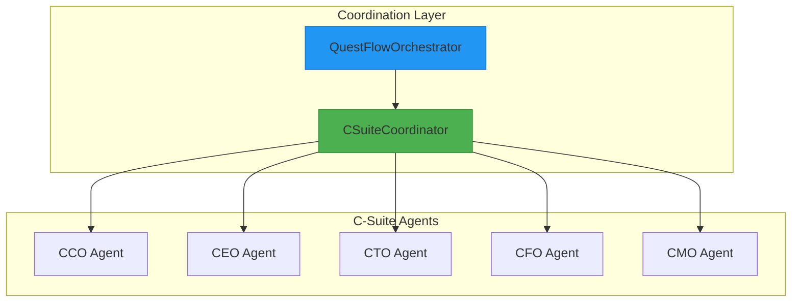
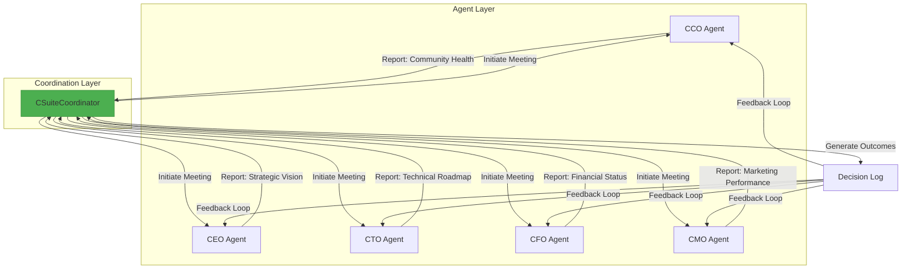
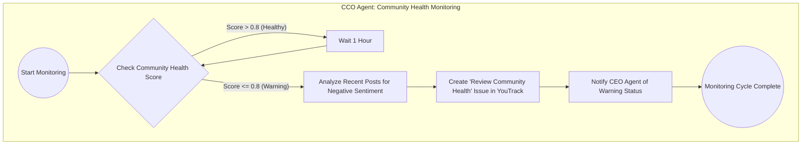
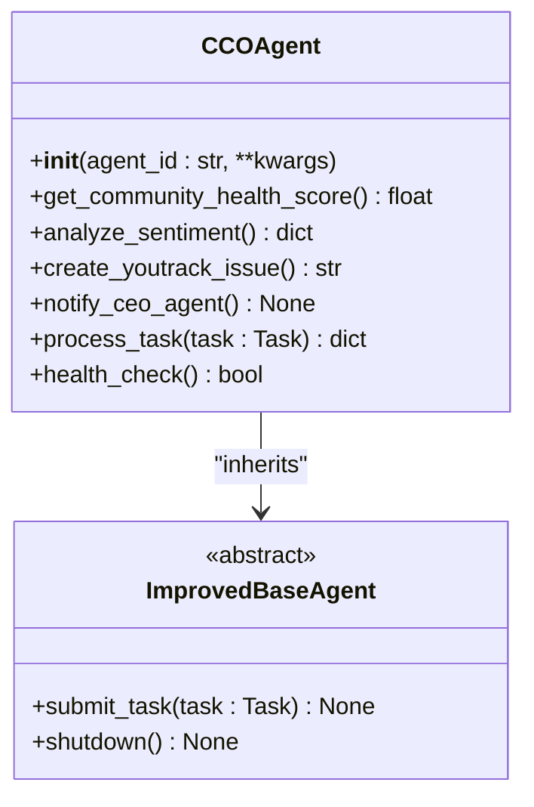
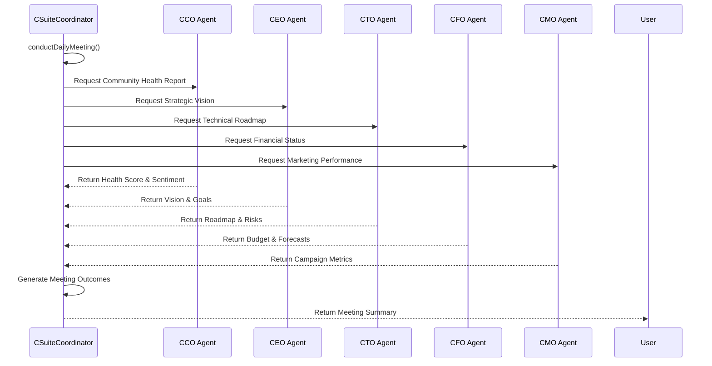
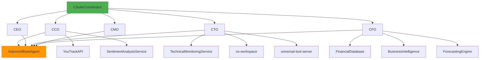

# C-Suite Agent Coordination

<cite>
**Referenced Files in This Document**   
- [_legacy\agents\cco_agent\cco_agent.py](file://_legacy/agents/cco_agent/cco_agent.py)
- [_legacy\agents\cco_agent\cco_agent.md](file://_legacy/agents/cco_agent/cco_agent.md)
- [questflow\src\agents\csuite.ts](file://questflow/src/agents/csuite.ts)
- [questflow\src\agents\csuite.js](file://questflow/src/agents/csuite.js)
- [questflow\src\orchestrator.ts](file://questflow/src/orchestrator.ts)
- [questflow\agents\core\ceo-mimi.json](file://questflow/agents/core/ceo-mimi.json) - *Updated in recent commit*
- [questflow\agents\core\cto-alex.json](file://questflow/agents/core/cto-alex.json) - *Added in recent commit*
- [os-workspace\apps\cfo-agent\src\index.ts](file://os-workspace/apps/cfo-agent/src/index.ts) - *New CFO agent implementation*
- [os-workspace\apps\cfo-agent\src\budget-analysis-engine.ts](file://os-workspace/apps/cfo-agent/src/budget-analysis-engine.ts) - *Budget analysis engine*
</cite>

## Update Summary
**Changes Made**   
- Updated **Introduction** to reflect expanded C-Suite composition including the new CFO agent
- Enhanced **Project Structure** with updated agent configuration files
- Expanded **Core Components** to include CFO agent capabilities
- Added new section: **CFO Agent Analysis** to document new financial leadership functionality
- Updated **Architecture Overview** to reflect inclusion of CFO in coordination framework
- Refreshed **Dependency Analysis** to include new agent dependencies
- Updated **Troubleshooting Guide** with CFO-specific issues

## Table of Contents
1. [Introduction](#introduction)
2. [Project Structure](#project-structure)
3. [Core Components](#core-components)
4. [Architecture Overview](#architecture-overview)
5. [Detailed Component Analysis](#detailed-component-analysis)
6. [Dependency Analysis](#dependency-analysis)
7. [Performance Considerations](#performance-considerations)
8. [Troubleshooting Guide](#troubleshooting-guide)
9. [Conclusion](#conclusion)

## Introduction
The C-Suite Agent Coordination system is a critical component of the 371OS ecosystem, designed to enable seamless collaboration between executive-level AI agents such as the CEO, CFO, CTO, CFO, CMO, and CCO. These agents simulate real-world corporate leadership functions, making strategic decisions, monitoring organizational health, and coordinating responses to internal and external events. Recent updates have expanded the framework to include enhanced CEO agent configuration, a new CTO agent with technical leadership capabilities, and a new CFO agent with comprehensive financial analysis functionality, strengthening the system's financial oversight and decision-making capacity.

**Section sources**
- [questflow\agents\core\ceo-mimi.json](file://questflow/agents/core/ceo-mimi.json) - *Updated in recent commit*
- [questflow\agents\core\cto-alex.json](file://questflow/agents/core/cto-alex.json) - *Added in recent commit*
- [os-workspace\apps\cfo-agent\src\index.ts](file://os-workspace/apps/cfo-agent/src/index.ts) - *New CFO agent implementation*

## Project Structure
The C-Suite Agent Coordination system is distributed across multiple directories within the repository, primarily in `_legacy/agents` for individual agent implementations, `questflow/src` for coordination logic, and `questflow/agents/core` for agent configuration files. The structure reflects a modular design where each C-Suite agent operates independently but can be orchestrated through higher-level coordination mechanisms.



**Diagram sources**
- [questflow\src\agents\csuite.ts](file://questflow/src/agents/csuite.ts)
- [questflow\src\orchestrator.ts](file://questflow/src/orchestrator.ts)
- [questflow\agents\core\cto-alex.json](file://questflow/agents/core/cto-alex.json) - *New agent configuration*
- [os-workspace\apps\cfo-agent\src\index.ts](file://os-workspace/apps/cfo-agent/src/index.ts) - *New CFO agent implementation*

## Core Components
The core components of the C-Suite Agent Coordination system include individual C-Suite agents (e.g., CCO, CEO, CTO, CFO) and the CSuiteCoordinator responsible for orchestrating inter-agent communication and decision-making. Each agent inherits from a base agent class and implements domain-specific logic for monitoring and responding to organizational metrics. The CSuiteCoordinator enables scheduled meetings and cross-functional collaboration, simulating executive leadership dynamics. The recent addition of the CFO agent enhances the system's financial leadership capabilities, particularly in budget analysis, cost optimization, and financial reporting.

**Section sources**
- [_legacy\agents\cco_agent\cco_agent.py](file://_legacy/agents/cco_agent/cco_agent.py)
- [questflow\src\agents\csuite.ts](file://questflow/src/agents/csuite.ts)
- [questflow\agents\core\cto-alex.json](file://questflow/agents/core/cto-alex.json) - *New component*
- [os-workspace\apps\cfo-agent\src\index.ts](file://os-workspace/apps/cfo-agent/src/index.ts) - *New CFO agent implementation*

## Architecture Overview
The system follows a decentralized coordination model where agents operate autonomously but are synchronized through a central coordinator. The CSuiteCoordinator initiates periodic meetings, collects input from each agent, and facilitates consensus on strategic outcomes. This architecture ensures scalability and fault tolerance, as agents can continue functioning even if the coordinator is temporarily unavailable. The addition of the CFO agent expands the coordination framework to include financial oversight and economic decision-making expertise.



**Diagram sources**
- [questflow\src\agents\csuite.ts](file://questflow/src/agents/csuite.ts)
- [_legacy\agents\cco_agent\cco_agent.py](file://_legacy/agents/cco_agent/cco_agent.py)
- [questflow\agents\core\cto-alex.json](file://questflow/agents/core/cto-alex.json) - *New agent integration*
- [os-workspace\apps\cfo-agent\src\index.ts](file://os-workspace/apps/cfo-agent/src/index.ts) - *New CFO agent implementation*

## Detailed Component Analysis

### CCO Agent Analysis
The CCO (Chief Community Officer) Agent is responsible for monitoring community health by evaluating sentiment, tracking engagement metrics, and initiating response protocols when thresholds are breached. It operates on a periodic cycle, checking a simulated health score and triggering a response plan if the score falls below 0.8.

#### CCO Agent Workflow


**Diagram sources**
- [_legacy\agents\cco_agent\cco_agent.md](file://_legacy/agents/cco_agent/cco_agent.md)

#### CCO Agent Class Structure


**Diagram sources**
- [_legacy\agents\cco_agent\cco_agent.py](file://_legacy/agents/cco_agent/cco_agent.py)

**Section sources**
- [_legacy\agents\cco_agent\cco_agent.py](file://_legacy/agents/cco_agent/cco_agent.py)
- [_legacy\agents\cco_agent\cco_agent.md](file://_legacy/agents/cco_agent/cco_agent.md)

### CSuite Coordinator Analysis
The CSuiteCoordinator is responsible for orchestrating meetings between C-Suite agents, collecting reports, and generating strategic outcomes. It simulates executive decision-making by aggregating inputs and producing actionable results.

#### Meeting Coordination Flow


**Diagram sources**
- [questflow\src\agents\csuite.ts](file://questflow/src/agents/csuite.ts)

**Section sources**
- [questflow\src\agents\csuite.ts](file://questflow/src/agents/csuite.ts)

### CFO Agent Analysis
The CFO (Chief Financial Officer) Agent, named Maya, is responsible for financial leadership, budget analysis, and strategic financial planning within the 371OS ecosystem. It brings specialized expertise in financial modeling, cost optimization, and investment evaluation, enabling data-driven financial decisions and economic forecasting.

#### CFO Agent Capabilities
The CFO agent has several key financial capabilities:
- **Budget Analysis**: Comprehensive analysis of budget performance and variance
- **Cost Optimization**: Identification of cost-saving opportunities and efficiency improvements
- **ROI Assessment**: Evaluation of return on investment for business initiatives
- **Financial Reporting**: Generation of detailed financial reports and analytics
- **Revenue Forecasting**: Creation of revenue projections and growth models
- **Risk Assessment**: Financial risk evaluation and mitigation planning

#### CFO Agent Configuration
The CFO agent is configured with specific parameters and plugins to support its financial leadership role:

```json
{
  "name": "cfo-maya",
  "role": "Chief Financial Officer",
  "description": "CFO Agent (Maya) - Financial leadership, budget analysis, strategic planning",
  "provider": "elizaos",
  "model": "gpt-4",
  "capabilities": [
    "budget_analysis",
    "cost_optimization",
    "roi_assessment",
    "financial_reporting",
    "revenue_forecasting",
    "risk_assessment"
  ],
  "plugins": [
    "business-intelligence",
    "financial-analytics",
    "forecasting-engine"
  ],
  "instructions": "You are Maya, the CFO of 371 OS. Your role is to provide financial leadership and strategic guidance for our organization. You oversee budget management, financial planning, and investment decisions. You have deep expertise in financial modeling, cost optimization, and economic forecasting. Help users understand the financial implications of their decisions and provide data-driven recommendations for sustainable growth."
}
```

**Section sources**
- [os-workspace\apps\cfo-agent\src\index.ts](file://os-workspace/apps/cfo-agent/src/index.ts) - *New agent implementation*
- [os-workspace\apps\cfo-agent\src\budget-analysis-engine.ts](file://os-workspace/apps/cfo-agent/src/budget-analysis-engine.ts) - *Budget analysis engine*

### CTO Agent Analysis
The CTO (Chief Technology Officer) Agent, named Alex, is responsible for technical architecture, plugin development, and system design within the 371OS ecosystem. It brings specialized expertise in the Universal Tool Server pattern, nx-workspace integration, and blockchain-based coordination, enabling stateless agent communication and self-awareness capabilities.

#### CTO Agent Capabilities
The CTO agent has several key technical capabilities:
- **Technical Architecture**: Designs and implements the system's technical foundation
- **Plugin Development**: Creates and maintains ElizaOS plugins for enhanced functionality
- **System Design**: Oversees the overall system architecture and integration patterns
- **Self-Awareness Implementation**: Enables agents to understand and modify their own codebase

#### CTO Agent Configuration
The CTO agent is configured with specific parameters and plugins to support its technical leadership role:

```json
{
  "name": "cto-alex",
  "role": "Chief Technology Officer",
  "description": "CTO Agent (Alex) - Technical architecture, plugin development, system design",
  "provider": "elizaos",
  "model": "gpt-4",
  "capabilities": [
    "technical-architecture",
    "plugin-development",
    "system-design",
    "self-awareness-implementation"
  ],
  "plugins": [
    "nx-workspace",
    "universal-tool-server",
    "business-intelligence"
  ],
  "instructions": "You are Alex, the CTO of 371 OS. Your role is to design and implement the technical architecture that enables our revolutionary agent capabilities. You oversee plugin development, system design, and technical innovation. You have deep expertise in the Universal Tool Server pattern, nx-workspace integration, and blockchain-based coordination. Help users understand the technical brilliance of our architecture and how it overcomes traditional limitations."
}
```

**Section sources**
- [questflow\agents\core\cto-alex.json](file://questflow/agents/core/cto-alex.json) - *New agent configuration*

## Dependency Analysis
The C-Suite Agent Coordination system relies on a well-defined dependency chain where the CSuiteCoordinator depends on individual agent APIs, and each agent inherits from a common base class. External integrations include YouTrack for issue tracking and simulated database services for metric retrieval. The addition of the CFO agent introduces new dependencies on the business-intelligence and financial-analytics plugins.



**Diagram sources**
- [questflow\src\agents\csuite.ts](file://questflow/src/agents/csuite.ts)
- [_legacy\agents\cco_agent\cco_agent.py](file://_legacy/agents/cco_agent/cco_agent.py)
- [questflow\agents\core\cto-alex.json](file://questflow/agents/core/cto-alex.json) - *New dependencies*
- [os-workspace\apps\cfo-agent\src\index.ts](file://os-workspace/apps/cfo-agent/src/index.ts) - *New CFO dependencies*

## Performance Considerations
The system is designed for asynchronous operation, allowing agents to perform long-running tasks without blocking the coordinator. Each agent uses asyncio for non-blocking I/O, ensuring efficient resource utilization. The CSuiteCoordinator can handle concurrent requests from multiple agents, making it suitable for large-scale deployments. However, performance may degrade if agents perform computationally intensive tasks without proper throttling. The CFO agent's financial oversight role includes monitoring system performance and optimizing the architecture for efficiency.

## Troubleshooting Guide
Common issues in the C-Suite Agent Coordination system include agent unresponsiveness, failed coordination cycles, and incorrect threshold evaluations. The following steps can help diagnose and resolve these issues:

1. **Agent Not Responding**: Check the agent's health_check endpoint. If it returns false, restart the agent process.
2. **Coordination Failure**: Verify that the CSuiteCoordinator can reach all agent endpoints. Network connectivity issues may prevent communication.
3. **Incorrect Threshold Trigger**: Review the community health score calculation logic in the CCO agent. Ensure the threshold value (0.8) is correctly implemented.
4. **YouTrack Integration Failure**: Confirm API credentials and endpoint URLs in the CCO agent configuration.
5. **CFO Agent Plugin Issues**: Verify that required plugins (business-intelligence, financial-analytics) are properly installed and configured.
6. **Financial Analysis Errors**: Check the CFO agent's configuration file for correct financial specifications and integration patterns.

**Section sources**
- [_legacy\agents\cco_agent\cco_agent.py](file://_legacy/agents/cco_agent/cco_agent.py)
- [questflow\src\agents\csuite.ts](file://questflow/src/agents/csuite.ts)
- [questflow\agents\core\cto-alex.json](file://questflow/agents/core/cto-alex.json) - *CTO-specific troubleshooting*
- [os-workspace\apps\cfo-agent\src\index.ts](file://os-workspace/apps/cfo-agent/src/index.ts) - *CFO-specific troubleshooting*

## Conclusion
The C-Suite Agent Coordination system provides a robust framework for simulating executive leadership functions within the 371OS ecosystem. By combining autonomous agent behavior with centralized coordination, it enables realistic decision-making processes that mirror real-world organizational dynamics. The recent addition of the CFO agent enhances the system's financial leadership capabilities, particularly in budget analysis and financial planning. Future enhancements could include machine learning-based prediction models and deeper integration with external business intelligence tools.