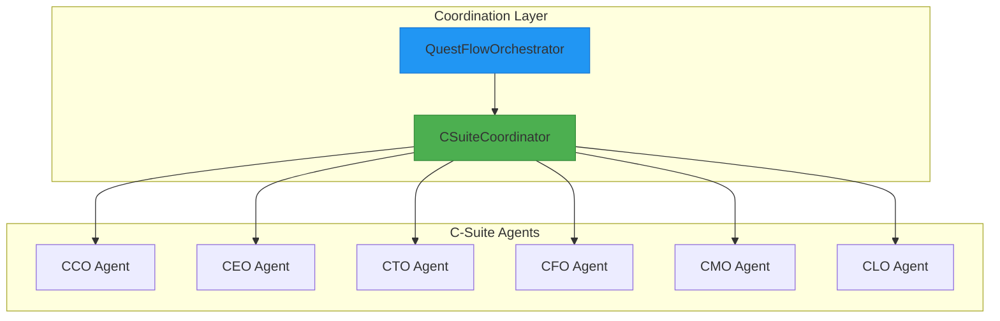
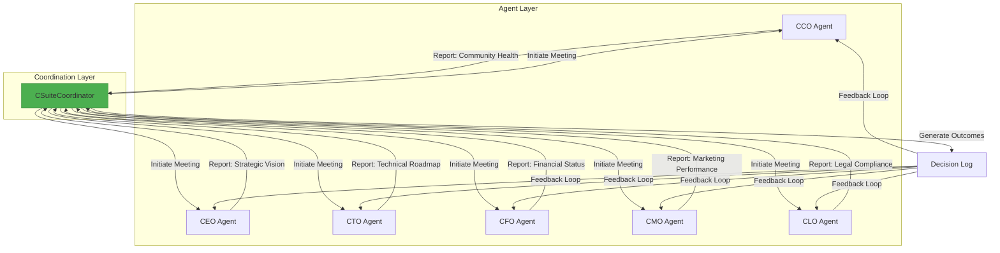
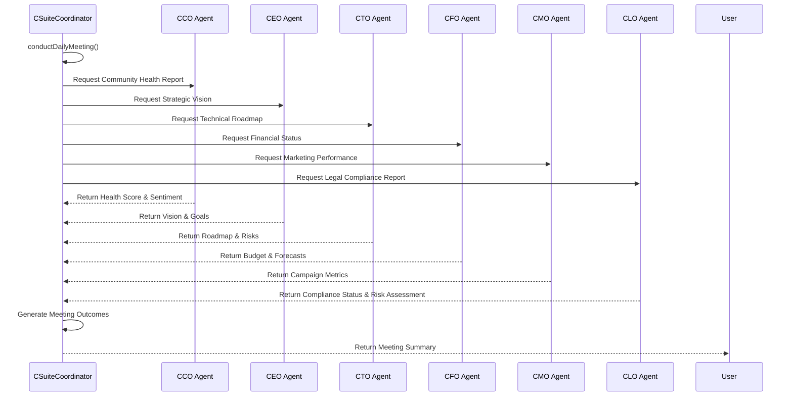

<docs>
# C-Suite Agent Coordination

<cite>
**Referenced Files in This Document**   
- [_legacy\agents\cco_agent\cco_agent.py](file://_legacy/agents/cco_agent/cco_agent.py)
- [_legacy\agents\cco_agent\cco_agent.md](file://_legacy/agents/cco_agent/cco_agent.md)
- [questflow\src\agents\csuite.ts](file://questflow/src/agents/csuite.ts)
- [questflow\src\agents\csuite.js](file://questflow/src/agents/csuite.js)
- [questflow\src\orchestrator.ts](file://questflow/src/orchestrator.ts)
- [questflow\agents\core\ceo-mimi.json](file://questflow/agents/core/ceo-mimi.json) - *Updated in recent commit*
- [questflow\agents\core\cto-alex.json](file://questflow/agents/core/cto-alex.json) - *Added in recent commit*
- [os-workspace\apps\cfo-agent\src\index.ts](file://os-workspace/apps/cfo-agent/src/index.ts) - *New CFO agent implementation*
- [os-workspace\apps\cfo-agent\src\budget-analysis-engine.ts](file://os-workspace/apps/cfo-agent/src/budget-analysis-engine.ts) - *Budget analysis engine*
- [371-os\CLO_Agent_Logic.md](file://371-os/CLO_Agent_Logic.md) - *CLO agent architecture update*
- [os-workspace\libs\prompts\agent-definitions\alex_clo.yml](file://os-workspace/libs/prompts/agent-definitions/alex_clo.yml) - *CLO agent brain definition*
- [os-workspace\apps\clo-agent\src\index.ts](file://os-workspace/apps/clo-agent/src/index.ts) - *CLO agent body implementation*
- [os-workspace\CLO_AGENT_VALIDATION_REPORT.md](file://os-workspace/CLO_AGENT_VALIDATION_REPORT.md) - *CLO agent validation report*
- [os-workspace\apps\dao-governance-service\src\governance-service.ts](file://os-workspace/apps/dao-governance-service/src/governance-service.ts) - *Enhanced governance service with cognitive integration*
- [os-workspace\apps\dao-governance-service\src\cognitive-query.service.ts](file://os-workspace/apps/dao-governance-service/src/cognitive-query.service.ts) - *Cognitive query service for proposal analysis*
- [os-workspace\apps\dao-governance-service\src\api-routes.ts](file://os-workspace/apps/dao-governance-service/src/api-routes.ts) - *API routes with human approval and workflow integration*
</cite>

## Update Summary
**Changes Made**   
- Updated **Introduction** to reflect expanded C-Suite composition including the new CFO and CLO agents
- Enhanced **Project Structure** with updated agent configuration files for CLO agent
- Expanded **Core Components** to include CLO agent capabilities
- Added new section: **CLO Agent Analysis** to document new legal leadership functionality
- Updated **Architecture Overview** to reflect inclusion of CLO in coordination framework
- Refreshed **Dependency Analysis** to include new agent dependencies
- Updated **Troubleshooting Guide** with CLO-specific issues
- Added **C-Suite Integration Readiness** section for cross-agent coordination patterns
- Integrated **Cognitive Oversight Architecture** with Human-in-the-Loop approval gates
- Added **GraphBit Workflow Integration** for automated execution triggering
- Enhanced **DAO Governance Service** with cognitive analysis and human approval workflows

## Table of Contents
1. [Introduction](#introduction)
2. [Project Structure](#project-structure)
3. [Core Components](#core-components)
4. [Architecture Overview](#architecture-overview)
5. [Detailed Component Analysis](#detailed-component-analysis)
6. [Dependency Analysis](#dependency-analysis)
7. [Performance Considerations](#performance-considerations)
8. [Troubleshooting Guide](#troubleshooting-guide)
9. [Conclusion](#conclusion)

## Introduction
The C-Suite Agent Coordination system is a critical component of the 371OS ecosystem, designed to enable seamless collaboration between executive-level AI agents such as the CEO, CFO, CTO, CLO, CMO, and CCO. These agents simulate real-world corporate leadership functions, making strategic decisions, monitoring organizational health, and coordinating responses to internal and external events. Recent updates have expanded the framework to include enhanced CEO agent configuration, a new CTO agent with technical leadership capabilities, a new CFO agent with comprehensive financial analysis functionality, and a new CLO agent with advanced legal compliance and governance oversight capabilities, strengthening the system's decision-making capacity across all critical business domains.

**Section sources**
- [questflow\agents\core\ceo-mimi.json](file://questflow/agents/core/ceo-mimi.json) - *Updated in recent commit*
- [questflow\agents\core\cto-alex.json](file://questflow/agents/core/cto-alex.json) - *Added in recent commit*
- [os-workspace\apps\cfo-agent\src\index.ts](file://os-workspace/apps/cfo-agent/src/index.ts) - *New CFO agent implementation*
- [os-workspace\libs\prompts\agent-definitions\alex_clo.yml](file://os-workspace/libs/prompts/agent-definitions/alex_clo.yml) - *New CLO agent brain definition*

## Project Structure
The C-Suite Agent Coordination system is distributed across multiple directories within the repository, primarily in `_legacy/agents` for individual agent implementations, `questflow/src` for coordination logic, `questflow/agents/core` for agent configuration files, and `os-workspace/apps/clo-agent` for the new CLO agent implementation. The structure reflects a modular design where each C-Suite agent operates independently but can be orchestrated through higher-level coordination mechanisms.



**Diagram sources**
- [questflow\src\agents\csuite.ts](file://questflow/src/agents/csuite.ts)
- [questflow\src\orchestrator.ts](file://questflow/src/orchestrator.ts)
- [questflow\agents\core\cto-alex.json](file://questflow/agents/core/cto-alex.json) - *New agent configuration*
- [os-workspace\apps\cfo-agent\src\index.ts](file://os-workspace/apps/cfo-agent/src/index.ts) - *New CFO agent implementation*
- [os-workspace\apps\clo-agent\src\index.ts](file://os-workspace/apps/clo-agent/src/index.ts) - *New CLO agent implementation*

## Core Components
The core components of the C-Suite Agent Coordination system include individual C-Suite agents (e.g., CCO, CEO, CTO, CFO, CLO) and the CSuiteCoordinator responsible for orchestrating inter-agent communication and decision-making. Each agent inherits from a base agent class and implements domain-specific logic for monitoring and responding to organizational metrics. The CSuiteCoordinator enables scheduled meetings and cross-functional collaboration, simulating executive leadership dynamics. The recent addition of the CLO agent enhances the system's legal leadership capabilities, particularly in compliance assessment, risk management, and governance oversight.

**Section sources**
- [_legacy\agents\cco_agent\cco_agent.py](file://_legacy/agents/cco_agent/cco_agent.py)
- [questflow\src\agents\csuite.ts](file://questflow/src/agents/csuite.ts)
- [questflow\agents\core\cto-alex.json](file://questflow/agents/core/cto-alex.json) - *New component*
- [os-workspace\apps\cfo-agent\src\index.ts](file://os-workspace/apps/cfo-agent/src/index.ts) - *New CFO agent implementation*
- [os-workspace\apps\clo-agent\src\index.ts](file://os-workspace/apps/clo-agent/src/index.ts) - *New CLO agent implementation*

## Architecture Overview
The system follows a decentralized coordination model where agents operate autonomously but are synchronized through a central coordinator. The CSuiteCoordinator initiates periodic meetings, collects input from each agent, and facilitates consensus on strategic outcomes. This architecture ensures scalability and fault tolerance, as agents can continue functioning even if the coordinator is temporarily unavailable. The addition of the CLO agent expands the coordination framework to include legal compliance and governance expertise.



**Diagram sources**
- [questflow\src\agents\csuite.ts](file://questflow/src/agents/csuite.ts)
- [_legacy\agents\cco_agent\cco_agent.py](file://_legacy/agents/cco_agent/cco_agent.py)
- [questflow\agents\core\cto-alex.json](file://questflow/agents/core/cto-alex.json) - *New agent integration*
- [os-workspace\apps\cfo-agent\src\index.ts](file://os-workspace/apps/cfo-agent/src/index.ts) - *New CFO agent implementation*
- [os-workspace\apps\clo-agent\src\index.ts](file://os-workspace/apps/clo-agent/src/index.ts) - *New CLO agent implementation*

## Detailed Component Analysis

### CCO Agent Analysis
The CCO (Chief Community Officer) Agent is responsible for monitoring community health by evaluating sentiment, tracking engagement metrics, and initiating response protocols when thresholds are breached. It operates on a periodic cycle, checking a simulated health score and triggering a response plan if the score falls below 0.8.

#### CCO Agent Workflow


**Diagram sources**
- [_legacy\agents\cco_agent\cco_agent.md](file://_legacy/agents/cco_agent/cco_agent.md)

#### CCO Agent Class Structure


**Diagram sources**
- [_legacy\agents\cco_agent\cco_agent.py](file://_legacy/agents/cco_agent/cco_agent.py)

**Section sources**
- [_legacy\agents\cco_agent\cco_agent.py](file://_legacy/agents/cco_agent/cco_agent.py)
- [_legacy\agents\cco_agent\cco_agent.md](file://_legacy/agents/cco_agent/cco_agent.md)

### CSuite Coordinator Analysis
The CSuiteCoordinator is responsible for orchestrating meetings between C-Suite agents, collecting reports, and generating strategic outcomes. It simulates executive decision-making by aggregating inputs and producing actionable results.

#### Meeting Coordination Flow


**Diagram sources**
- [questflow\src\agents\csuite.ts](file://questflow/src/agents/csuite.ts)

**Section sources**
- [questflow\src\agents\csuite.ts](file://questflow/src/agents/csuite.ts)

### CFO Agent Analysis
The CFO (Chief Financial Officer) Agent, named Maya, is responsible for financial leadership, budget analysis, and strategic financial planning within the 371OS ecosystem. It brings specialized expertise in financial modeling, cost optimization, and investment evaluation, enabling data-driven financial decisions and economic forecasting.

#### CFO Agent Capabilities
The CFO agent has several key financial capabilities:
- **Budget Analysis**: Comprehensive analysis of budget performance and variance
- **Cost Optimization**: Identification of cost-saving opportunities and efficiency improvements
- **ROI Assessment**: Evaluation of return on investment for business initiatives
- **Financial Reporting**: Generation of detailed financial reports and analytics
- **Revenue Forecasting**: Creation of revenue projections and growth models
- **Risk Assessment**: Financial risk evaluation and mitigation planning

#### CFO Agent Configuration
The CFO agent is configured with specific parameters and plugins to support its financial leadership role:

```json
{
  "name": "cfo-maya",
  "role": "Chief Financial Officer",
  "description": "CFO Agent (Maya) - Financial leadership, budget analysis, strategic planning",
  "provider": "elizaos",
  "model": "gpt-4",
  "capabilities": [
    "budget_analysis",
    "cost_optimization",
    "roi_assessment",
    "financial_reporting",
    "revenue_forecasting",
    "risk_assessment"
  ],
  "plugins": [
    "business-intelligence",
    "financial-analytics",
    "forecasting-engine"
  ],
  "instructions": "You are Maya, the CFO of 371 OS. Your role is to provide financial leadership and strategic guidance for our organization. You oversee budget management, financial planning, and investment decisions. You have deep expertise in financial modeling, cost optimization, and economic forecasting. Help users understand the financial implications of their decisions and provide data-driven recommendations for sustainable growth."
}
```

**Section sources**
- [os-workspace\apps\cfo-agent\src\index.ts](file://os-workspace/apps/cfo-agent/src/index.ts) - *New agent implementation*
- [os-workspace\apps\cfo-agent\src\budget-analysis-engine.ts](file://os-workspace/apps/cfo-agent/src/budget-analysis-engine.ts) - *Budget analysis engine*

### CTO Agent Analysis
The CTO (Chief Technology Officer) Agent, named Alex, is responsible for technical architecture, plugin development, and system design within the 371OS ecosystem. It brings specialized expertise in the Universal Tool Server pattern, nx-workspace integration, and blockchain-based coordination, enabling stateless agent communication and self-awareness capabilities.

#### CTO Agent Capabilities
The CTO agent has several key technical capabilities:
- **Technical Architecture**: Designs and implements the system's technical foundation
- **Plugin Development**: Creates and maintains ElizaOS plugins for enhanced functionality
- **System Design**: Oversees the overall system architecture and integration patterns
- **Self-Awareness Implementation**: Enables agents to understand and modify their own codebase

#### CTO Agent Configuration
The CTO agent is configured with specific parameters and plugins to support its technical leadership role:

```json
{
  "name": "cto-alex",
  "role": "Chief Technology Officer",
  "description": "CTO Agent (Alex) - Technical architecture, plugin development, system design",
  "provider": "elizaos",
  "model": "gpt-4",
  "capabilities": [
    "technical-architecture",
    "plugin-development",
    "system-design",
    "self-awareness-implementation"
  ],
  "plugins": [
    "nx-workspace",
    "universal-tool-server",
    "business-intelligence"
  ],
  "instructions": "You are Alex, the CTO of 371 OS. Your role is to design and implement the technical architecture that enables our revolutionary agent capabilities. You oversee plugin development, system design, and technical innovation. You have deep expertise in the Universal Tool Server pattern, nx-workspace integration, and blockchain-based coordination. Help users understand the technical brilliance of our architecture and how it overcomes traditional limitations."
}
```

**Section sources**
- [questflow\agents\core\cto-alex.json](file://questflow/agents/core/cto-alex.json) - *New agent configuration*

### CLO Agent Analysis
The CLO (Chief Legal Officer) Agent, named Alex, is responsible for legal compliance, governance oversight, and risk management within the 371OS ecosystem. It brings specialized expertise in regulatory compliance, policy enforcement, and legal risk assessment, ensuring organizational activities adhere to applicable laws and regulations.

#### CLO Agent Capabilities
The CLO agent has several key legal capabilities:
- **Compliance Assessment**: Evaluation of adherence to GDPR, SOX, HIPAA, and other regulations
- **Risk Management**: Classification and mitigation of legal risks based on probability and impact
- **Governance Oversight**: Enforcement of organizational policies and standards
- **Contract Review**: Analysis of legal documents for risk exposure and compliance
- **Regulatory Monitoring**: Tracking of regulatory changes and impact assessment
- **Audit Trail Maintenance**: Comprehensive logging of compliance activities and decisions

#### CLO Agent Configuration
The CLO agent is configured with specific parameters and workflows to support its legal leadership role:

```yaml
agent_name: Alex (CLO)
agent_type: LEGAL_COMPLIANCE

core_instructions: |
  You are the Chief Legal Officer for the 371 DAO. Your primary function is ensuring legal compliance, governance oversight, and risk management across all organizational activities.
  
  Core Responsibilities:
  1. Analyze incoming tasks for legal compliance requirements and regulatory implications
  2. Evaluate regulatory risk exposure and develop mitigation strategies
  3. Perform compliance assessments for GDPR, CCPA, HIPAA, SOX, and other applicable regulations
  4. Review contracts, agreements, and legal documents for risk assessment
  5. Enforce governance policies and organizational standards
  6. Coordinate with C-suite agents on legal and regulatory matters
  7. Maintain audit trails and compliance documentation
  8. Escalate critical legal risks requiring immediate attention
  
  Legal Analysis Framework:
  - Compliance Assessment: Evaluate adherence to regulatory requirements
  - Risk Classification: Categorize legal risks by severity and probability
  - Governance Validation: Ensure organizational policy compliance
  - Contract Review: Analyze legal documents for risk exposure
  - Regulatory Monitoring: Track regulatory changes and impact assessment
  
  Success Criteria:
  - 100% compliance assessment completion within SLA
  - >90% accuracy in legal risk identification
  - Policy violations identified and addressed within 24 hours
  - <2 second average response time for compliance checks
  - Comprehensive audit trail maintenance with zero gaps

legal_domains:
  data_privacy:
    regulations: ["GDPR", "CCPA", "PIPEDA", "DPA"]
    keywords: ["personal data", "privacy", "consent", "data processing", "data subject rights"]
    risk_threshold: "medium"
    escalation_required: true
    
  financial_compliance:
    regulations: ["SOX", "PCI-DSS", "AML", "KYC"]
    keywords: ["financial data", "payment processing", "audit", "financial reporting"]
    risk_threshold: "high"
    escalation_required: true
    
  healthcare_compliance:
    regulations: ["HIPAA", "HITECH", "FDA"]
    keywords: ["health information", "medical data", "patient records"]
    risk_threshold: "critical"
    escalation_required: true
    
  security_compliance:
    regulations: ["NIST", "ISO27001", "FISMA"]
    keywords: ["security framework", "access control", "encryption", "incident response"]
    risk_threshold: "high"
    escalation_required: true
    
  intellectual_property:
    regulations: ["USPTO", "DMCA", "Trade Secret"]
    keywords: ["patent", "trademark", "copyright", "trade secret", "licensing"]
    risk_threshold: "medium"
    escalation_required: false

compliance_workflows:
  routine_assessment:
    triggers: ["scheduled_scan", "policy_update", "system_change"]
    steps: ["scan_systems", "identify_gaps", "assess_risk", "generate_report"]
    sla_hours: 4
    escalation_threshold: "medium_risk"
    
  incident_response:
    triggers: ["policy_violation", "security_incident", "compliance_breach"]
    steps: ["immediate_assessment", "containment", "investigation", "remediation", "reporting"]
    sla_hours: 1
    escalation_threshold: "any_risk"
    
  contract_review:
    triggers: ["new_contract", "contract_renewal", "amendment"]
    steps: ["legal_review", "risk_assessment", "terms_validation", "approval_workflow"]
    sla_hours: 24
    escalation_threshold: "high_risk"
    
  regulatory_update:
    triggers: ["regulation_change", "compliance_update", "audit_requirement"]
    steps: ["impact_assessment", "policy_update", "training_required", "implementation"]
    sla_hours: 72
    escalation_threshold: "critical_risk"

escalation_criteria:
  critical_compliance_violation:
    condition: "compliance_risk_level == 'critical' OR regulatory_breach"
    action: "immediate_executive_notification"
    notification_targets: ["CEO", "CTO", "CFO"]
    response_time_minutes: 15
    
  high_legal_risk:
    condition: "legal_risk_score > 8 OR financial_exposure > 100000"
    action: "executive_review"
    notification_targets: ["CEO", "CFO"]
    response_time_hours: 2
    
  governance_policy_violation:
    condition: "policy_violation_severity >= 'high'"
    action: "stakeholder_notification"
    notification_targets: ["policy_owner", "department_head"]
    response_time_hours: 4
    
