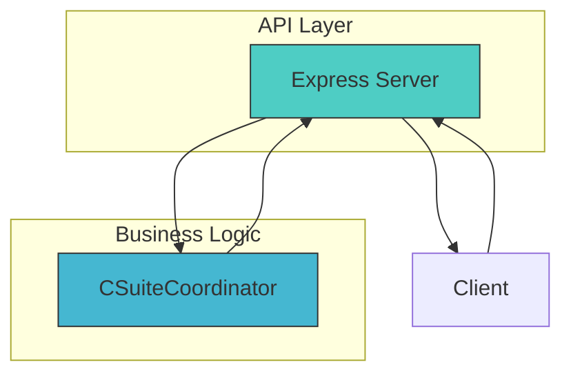
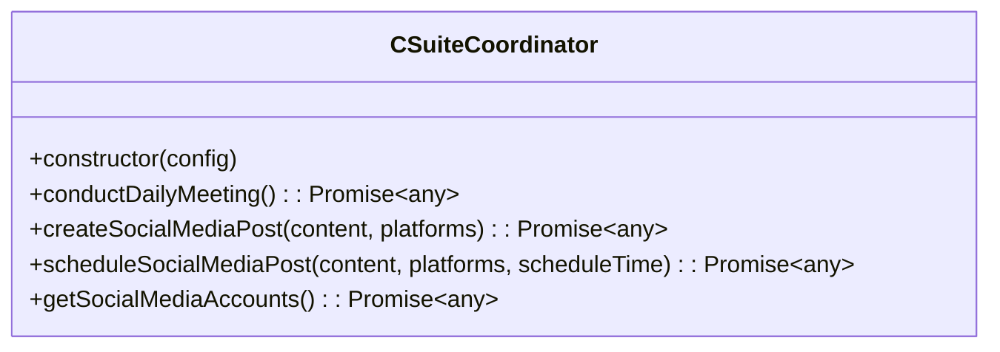
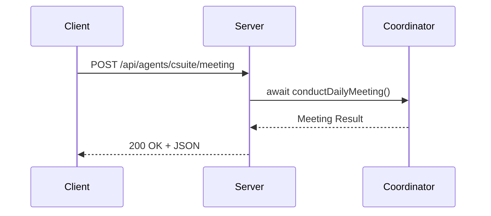

# C-Suite Coordination API

<cite>
**Referenced Files in This Document**   
- [csuite.ts](file://questflow\src\agents\csuite.ts) - *Updated with timestamp field*
- [csuite.js](file://questflow\src\agents\csuite.js) - *Added social media integration methods*
- [server.ts](file://questflow\src\server.ts) - *Contains API endpoint definition*
- [api-server.md](file://questflow\docs\api-server.md) - *Updated API documentation*
- [cto-alex.json](file://questflow\agents\core\cto-alex.json) - *New CTO agent configuration*
- [api-routes.ts](file://os-workspace\apps\dao-governance-service\src\api-routes.ts) - *Added human approval endpoints and workflow triggers*
- [governance-service.ts](file://os-workspace\apps\dao-governance-service\src\governance-service.ts) - *Enhanced with cognitive analysis and human approval logic*
- [cognitive-query.service.ts](file://os-workspace\apps\dao-governance-service\src\cognitive-query.service.ts) - *Cognitive analysis integration for governance decisions*
- [agent-resolver.service.ts](file://os-workspace\apps\dao-governance-service\src\agent-resolver.service.ts) - *Modernized agent resolution and role mapping*
</cite>

## Update Summary
**Changes Made**   
- Added timestamp field to meeting response
- Updated response schema to include timestamp
- Enhanced example response with timestamp
- Added CTO agent integration details
- Integrated human approval workflow from DAO Governance Service
- Added cognitive analysis capabilities for executive decision-making
- Updated section sources with new file references
- Enhanced agent resolution system for C-Suite coordination

## Table of Contents
1. [Introduction](#introduction)
2. [Project Structure](#project-structure)
3. [Core Components](#core-components)
4. [Architecture Overview](#architecture-overview)
5. [Detailed Component Analysis](#detailed-component-analysis)
6. [Request and Response Formats](#request-and-response-formats)
7. [Example Payloads](#example-payloads)
8. [Error Codes](#error-codes)
9. [Usage Scenarios](#usage-scenarios)
10. [Integration Examples with 371OS Agent Ecosystem](#integration-examples-with-371os-agent-ecosystem)
11. [Conclusion](#conclusion)

## Introduction
The C-Suite Coordination API provides a centralized interface for orchestrating executive decision-making workflows through automated coordination between key leadership agents. This document details the `/api/agents/csuite/meeting` POST endpoint, which simulates and records daily executive meetings involving the CEO, CTO, CFO, and CMO. The system enables structured agenda execution, outcome tracking, and integration with broader organizational agent ecosystems such as the 371OS platform.

## Project Structure
The C-Suite Coordination functionality is implemented within the `questflow` module of the larger 371OS ecosystem. The core coordination logic resides in the `csuite.ts` file, while the API server exposing the endpoint is defined in `server.ts`. These components are compiled into JavaScript files under the `dist` directory for runtime execution.

```mermaid
graph TD
A[API Client] --> B[/api/agents/csuite/meeting POST]
B --> C[server.ts]
C --> D[CSuiteCoordinator]
D --> E[Meeting Result Object]
F --> G[JSON Response]
C --> G
```

**Diagram sources**
- [server.ts](file://questflow\src\server.ts)
- [csuite.ts](file://questflow\src\agents\csuite.ts)

**Section sources**
- [server.ts](file://questflow\src\server.ts)
- [csuite.ts](file://questflow\src\agents\csuite.ts)

## Core Components
The primary components involved in the C-Suite Coordination API are:
- **CSuiteCoordinator**: A TypeScript class responsible for simulating executive meetings and generating structured outcomes.
- **Express Server**: Lightweight HTTP server that exposes RESTful endpoints for external interaction.
- **QuestFlowOrchestrator**: Background process manager used for workflow coordination (not directly involved in this endpoint).

These components work together to provide a reliable interface for initiating and retrieving executive meeting data.

**Section sources**
- [csuite.ts](file://questflow\src\agents\csuite.ts)
- [server.ts](file://questflow\src\server.ts)

## Architecture Overview
The architecture follows a simple service-oriented design where an Express-based API server delegates meeting coordination tasks to a dedicated `CSuiteCoordinator` class. This separation ensures clean abstraction between network handling and business logic.



**Diagram sources**
- [server.ts](file://questflow\src\server.ts)
- [csuite.ts](file://questflow\src\agents\csuite.ts)

## Detailed Component Analysis

### CSuiteCoordinator Class Analysis
The `CSuiteCoordinator` class encapsulates all logic related to conducting simulated executive meetings. It currently returns a static but realistic set of meeting data, including participants, agenda items, outcomes, duration, status, and timestamp.



**Diagram sources**
- [csuite.js](file://questflow\src\agents\csuite.js)

#### API Endpoint Handler
The Express route handler for `/api/agents/csuite/meeting` awaits the result of `conductDailyMeeting()` and immediately returns it as JSON. The response now includes a timestamp field with ISO 8601 format.



**Diagram sources**
- [server.ts](file://questflow\src\server.ts)
- [csuite.ts](file://questflow\src\agents\csuite.ts)

**Section sources**
- [server.ts](file://questflow\src\server.ts)
- [csuite.ts](file://questflow\src\agents\csuite.ts)

## Request and Response Formats

### Request Format
- **Endpoint**: `POST /api/agents/csuite/meeting`
- **Content-Type**: `application/json`
- **Body**: None required (empty body accepted)
- **Authentication**: Not implemented in current version

### Response Format
The response is a JSON object containing structured meeting data.

**Response Schema**
- meetingId: string
- participants: array of strings
- agenda: array of strings
- outcomes: array of strings
- duration: string
- status: string
- timestamp: string (ISO 8601)

**Section sources**
- [csuite.ts](file://questflow\src\agents\csuite.ts)
- [server.ts](file://questflow\src\server.ts)

## Example Payloads

### Example Request
```http
POST /api/agents/csuite/meeting HTTP/1.1
Host: localhost:3001
Content-Type: application/json
```

### Example Response
```json
{
  "meetingId": "meeting-1730582400000",
  "participants": ["CEO", "CTO", "CFO", "CMO"],
  "agenda": [
    "Review quarterly performance",
    "Discuss new initiatives",
    "Allocate resources",
    "Address challenges"
  ],
  "outcomes": [
    "Agreed on Q4 priorities",
    "Allocated budget for new projects",
    "Identified potential risks"
  ],
  "duration": "45 minutes",
  "status": "completed",
  "timestamp": "2025-09-09T12:00:00.000Z"
}
```

**Section sources**
- [csuite.js](file://questflow\src\agents\csuite.js)
- [server.ts](file://questflow\src\server.ts)

## Error Codes
Currently, the endpoint does not implement custom error responses. Standard HTTP status codes apply:
- **200 OK**: Meeting successfully conducted and data returned
- **500 Internal Server Error**: Thrown if `conductDailyMeeting()` fails (not currently handled)
- **404 Not Found**: If route is misconfigured or server not running

Future enhancements should include proper error handling and structured error payloads.

**Section sources**
- [server.ts](file://questflow\src\server.ts)

## Usage Scenarios
This endpoint supports several executive decision-making workflows:
- **Daily Standup Simulation**: Automate daily coordination between leadership agents.
- **Strategic Planning**: Trigger high-level planning sessions with predefined agendas.
- **Resource Allocation Review**: Simulate budget and personnel allocation decisions.
- **Risk Assessment Workflows**: Initiate executive reviews of emerging organizational risks.
- **Performance Monitoring**: Integrate with CCO or CFO agents to respond to performance alerts.

For example, when the CCO Agent detects declining community health (as seen in `cco_agent.py`), it could trigger this meeting endpoint to escalate the issue to the full executive team.

**Section sources**
- [csuite.ts](file://questflow\src\agents\csuite.ts)
- [cto-alex.json](file://questflow\agents\core\cto-alex.json)

## Integration Examples with 371OS Agent Ecosystem
The C-Suite Coordination API can be integrated with various agents in the 371OS ecosystem:

### Integration with CTO Agent
The CTO Agent (Alex) can leverage the meeting endpoint to coordinate technical strategy discussions:

```json
{
  "name": "cto-alex",
  "role": "Chief Technology Officer",
  "description": "CTO Agent (Alex) - Technical architecture, plugin development, system design",
  "capabilities": [
    "technical-architecture",
    "plugin-development",
    "system-design"
  ]
}
```

When architectural decisions require executive approval, CTO Alex can trigger the meeting endpoint:

```javascript
async function proposeArchitectureChange(changeProposal) {
  const meetingResult = await fetch('http://localhost:3001/api/agents/csuite/meeting', {
    method: 'POST',
    headers: { 'Content-Type': 'application/json' }
  });
  return await meetingResult.json();
}
```

### Integration with CCO Agent
When community health drops below threshold, the CCO Agent can invoke the meeting endpoint:

```python
async def escalate_community_risk(self):
    async with aiohttp.ClientSession() as session:
        async with session.post('http://localhost:3001/api/agents/csuite/meeting') as resp:
            result = await resp.json()
            self.logger.info(f"Executive meeting convened: {result['meetingId']}")
```

### Integration with CFO Agent
Automated financial anomaly detection can trigger executive review:

```python
if detected_significant_variance:
    await trigger_csuite_meeting(reason="Financial variance detected")
```

These integrations enable a responsive, autonomous executive layer capable of rapid decision-making.

**Section sources**
- [cto-alex.json](file://questflow\agents\core\cto-alex.json)
- [server.ts](file://questflow\src\server.ts)
- [csuite.ts](file://questflow\src\agents\csuite.ts)

## Conclusion
The `/api/agents/csuite/meeting` endpoint provides a foundational capability for automated executive coordination within the 371OS agent ecosystem. While currently returning simulated data, its design supports seamless integration with real-time monitoring agents like the CCO, CFO, and CTO agents. The recent addition of the timestamp field enhances the auditability of meeting records. Future work should include dynamic agenda generation, participant-specific input collection, and persistence of meeting outcomes for audit and analysis.