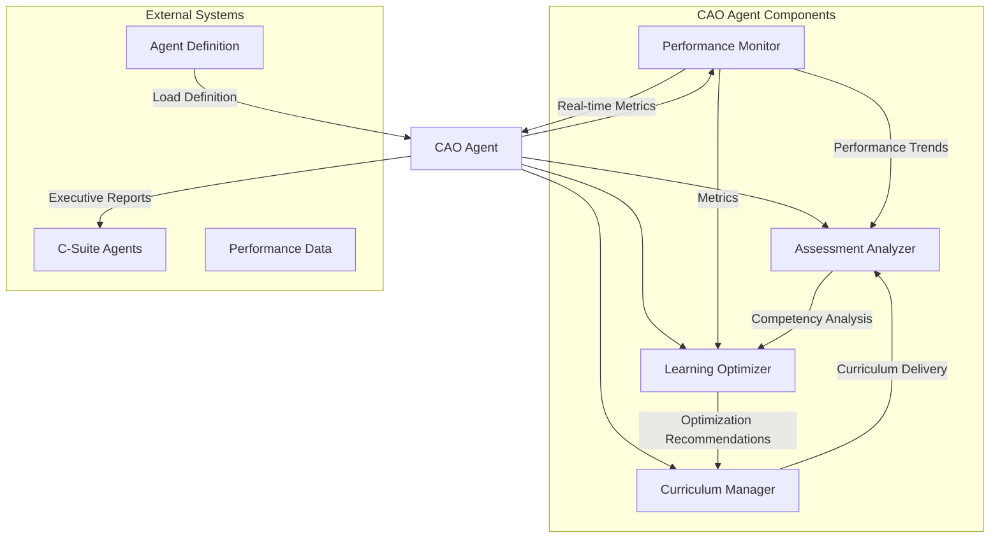
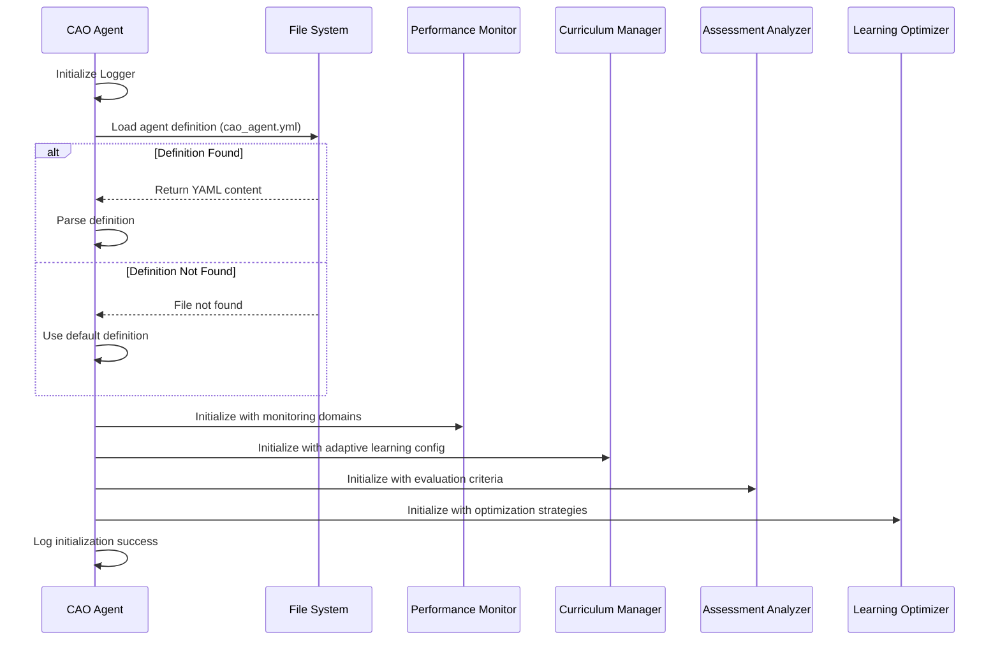
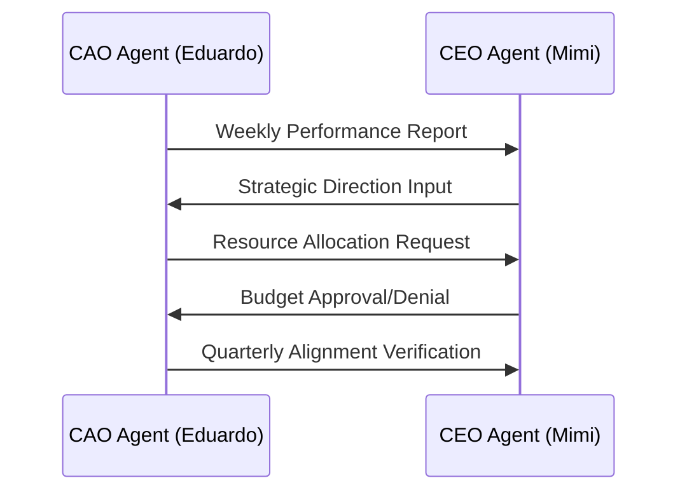

# CAO Agent (Eduardo)

<cite>
**Referenced Files in This Document **   
- [index.ts](file://os-workspace/apps/cao-agent/src/index.ts)
- [curriculum-manager.ts](file://os-workspace/apps/cao-agent/src/curriculum-manager.ts)
- [learning-optimizer.ts](file://os-workspace/apps/cao-agent/src/learning-optimizer.ts)
- [assessment-analyzer.ts](file://os-workspace/apps/cao-agent/src/assessment-analyzer.ts)
- [performance-monitor.ts](file://os-workspace/apps/cao-agent/src/performance-monitor.ts)
- [types.ts](file://os-workspace/apps/cao-agent/src/types.ts)
- [cao_agent.yml](file://os-workspace/libs/prompts/agent-definitions/cao_agent.yml)
- [README.md](file://os-workspace/apps/cao-agent/README.md)
</cite>

## Table of Contents
1. [Introduction](#introduction)
2. [Core Responsibilities](#core-responsibilities)
3. [Architecture Overview](#architecture-overview)
4. [Implementation Details](#implementation-details)
5. [API Interfaces](#api-interfaces)
6. [Integration Patterns with C-Suite Agents](#integration-patterns-with-c-suite-agents)
7. [Practical Examples](#practical-examples)
8. [Troubleshooting Guide](#troubleshooting-guide)
9. [Conclusion](#conclusion)

## Introduction

The Chief Academic Officer (CAO) Agent, named Eduardo, is a specialized executive agent within the 371 OS autonomous business ecosystem. As part of the C-Suite leadership team, Eduardo serves as the academic authority responsible for monitoring agent performance, managing educational components, and ensuring continuous improvement across the autonomous workforce.

Following the unified "brain/body" architecture pattern, the CAO Agent separates cognitive decision-making from execution capabilities. The agent's cognitive layer is defined in a centralized prompt library, while its execution components handle performance monitoring, curriculum delivery, assessment analysis, and learning optimization.

Eduardo plays a critical role in maintaining academic excellence standards across the agent ecosystem, implementing systematic assessment frameworks, designing adaptive learning programs, and orchestrating continuous improvement loops based on performance data.

**Section sources**
- [README.md](file://os-workspace/apps/cao-agent/README.md#L0-L24)
- [index.ts](file://os-workspace/apps/cao-agent/src/index.ts#L1-L60)

## Core Responsibilities

The CAO Agent has several key responsibilities that contribute to the overall effectiveness and continuous improvement of the autonomous agent ecosystem:

### Performance Monitoring & Analytics
Eduardo continuously monitors real-time agent performance across all domains and complexity levels. This includes tracking success rates, response times, code quality, accuracy rates, risk assessments, compliance scores, engagement rates, ROI optimization, and brand consistency metrics across technical, financial, marketing, and legal domains.

### Curriculum Development
The agent designs and delivers personalized educational curricula tailored to individual agent needs. This includes creating adaptive learning programs with dynamic content difficulty progression, mandatory prerequisite validation, and competency-based completion criteria. The curriculum framework covers technical skills (programming, architecture, security), business skills (financial analysis, strategic planning), and communication skills (reporting, documentation).

### Assessment Design
Eduardo implements comprehensive evaluation mechanisms for skill verification through systematic assessment frameworks. These frameworks include competency level definitions (novice, developing, proficient, expert) with specific score ranges, descriptions, and training intensity requirements. Performance thresholds trigger specific actions like recognition, maintenance training, or intensive retraining programs.

### Learning Optimization
The agent orchestrates continuous improvement processes based on performance data, implementing multi-dimensional performance gap analysis, daily feedback collection, real-time optimization deployment, and monthly effectiveness validation. Knowledge transfer is optimized through peer learning facilitation, cross-domain knowledge sharing, active mentorship program coordination, and systematic best practice dissemination.

### C-Suite Integration
Eduardo coordinates with other C-Suite agents for strategic academic initiatives, providing regular reports and recommendations. The integration protocols define specific reporting frequencies and strategic alignment verification schedules with each executive agent.

**Section sources**
- [cao_agent.yml](file://os-workspace/libs/prompts/agent-definitions/cao_agent.yml#L3-L110)
- [index.ts](file://os-workspace/apps/cao-agent/src/index.ts#L10-L32)

## Architecture Overview

The CAO Agent follows a modular architecture with distinct components that work together to provide comprehensive academic leadership capabilities.



**Diagram sources **
- [index.ts](file://os-workspace/apps/cao-agent/src/index.ts#L33-L93)
- [cao_agent.yml](file://os-workspace/libs/prompts/agent-definitions/cao_agent.yml#L3-L110)

The CAO Agent's architecture follows the "brain/body" separation pattern where the cognitive layer (defined in cao_agent.yml) contains the agent's core instructions, personality traits, and decision-making frameworks, while the execution layer (implemented in TypeScript classes) handles the actual processing and operations.

During initialization, the CAO Agent loads its definition from the centralized prompt library and initializes four core components:
- **Performance Monitor**: Tracks agent performance metrics in real-time
- **Curriculum Manager**: Designs and delivers personalized learning programs
- **Assessment Analyzer**: Evaluates agent competencies through comprehensive assessments
- **Learning Optimizer**: Identifies optimization opportunities and improvement areas

These components work together to analyze performance gaps, design targeted curricula, evaluate competency improvements, and implement continuous learning loops.

**Section sources**
- [index.ts](file://os-workspace/apps/cao-agent/src/index.ts#L33-L93)
- [cao_agent.yml](file://os-workspace/libs/prompts/agent-definitions/cao_agent.yml#L3-L110)

## Implementation Details

The CAO Agent is implemented as a TypeScript class with several interconnected components that handle specific aspects of academic leadership.

### Agent Initialization
The CAO Agent constructor initializes the logger first, then loads the agent definition from the centralized prompt library located at `libs/prompts/agent-definitions/cao_agent.yml`. If the definition file is not found, default values are used. The agent then initializes its four core components with configuration parameters extracted from the agent definition.



**Diagram sources **
- [index.ts](file://os-workspace/apps/cao-agent/src/index.ts#L41-L93)

### Core Components

#### Performance Monitor
The PerformanceMonitor component tracks agent performance data in real-time, storing historical data and calculating aggregated metrics. It analyzes performance trends over time and generates improvement recommendations when performance falls below established thresholds.

**Section sources**
- [performance-monitor.ts](file://os-workspace/apps/cao-agent/src/performance-monitor.ts#L21-L589)

#### Curriculum Manager
The CurriculumManager handles the design and delivery of personalized learning programs. It analyzes performance gaps, generates learning paths based on identified gaps, creates curriculum structures with appropriate learning modules, adapts content difficulty based on the agent's current competency level, and manages the delivery schedule.

**Section sources**
- [curriculum-manager.ts](file://os-workspace/apps/cao-agent/src/curriculum-manager.ts#L25-L714)

#### Assessment Analyzer
The AssessmentAnalyzer evaluates agent competencies through comprehensive assessments. It validates assessment responses, calculates scores, analyzes competency breakdowns by area, determines competency levels, generates performance feedback, and stores assessment results for trend analysis.

**Section sources**
- [assessment-analyzer.ts](file://os-workspace/apps/cao-agent/src/assessment-analyzer.ts#L22-L779)

#### Learning Optimizer
The LearningOptimizer identifies performance gaps and generates optimization recommendations. It implements continuous improvement loops by analyzing performance trends and learning velocity, identifying optimization triggers, generating adaptive interventions, and evaluating intervention effectiveness.

**Section sources**
- [learning-optimizer.ts](file://os-workspace/apps/cao-agent/src/learning-optimizer.ts#L20-L427)

## API Interfaces

The CAO Agent exposes several public methods through its API interface that allow interaction with its core capabilities.

### monitorAgentPerformance
Initiates performance monitoring and analysis for one or more agents.

```typescript
public async monitorAgentPerformance(
  request: PerformanceMonitoringRequest
): Promise<CAOOperationResult>
```

**Parameters:**
- `request`: An object containing agent ID, timeframe, metrics to monitor, and whether to include recommendations

**Returns:**
- `CAOOperationResult` with success status, operation details, and analysis results

**Section sources**
- [index.ts](file://os-workspace/apps/cao-agent/src/index.ts#L250-L275)

### deliverCurriculum
Delivers a personalized curriculum to a specified agent.

```typescript
public async deliverCurriculum(
  request: CurriculumDeliveryRequest
): Promise<CAOOperationResult>
```

**Parameters:**
- `request`: An object specifying the agent ID, curriculum ID, scheduled start date, and priority level

**Returns:**
- `CAOOperationResult` with delivery status and scheduling information

**Section sources**
- [index.ts](file://os-workspace/apps/cao-agent/src/index.ts#L277-L302)

### optimizeLearning
Initiates learning optimization processes based on specified goals.

```typescript
public async optimizeLearning(
  request: LearningOptimizationRequest
): Promise<CAOOperationResult>
```

**Parameters:**
- `request`: An object containing the scope (individual, domain, organization), target agents, optimization goals, and constraints

**Returns:**
- `CAOOperationResult` with optimization recommendations and implementation plan

**Section sources**
- [index.ts](file://os-workspace/apps/cao-agent/src/index.ts#L304-L329)

### generateExecutiveReport
Generates an executive performance report for integration with other C-Suite agents.

```typescript
public async generateExecutiveReport(
  reportType: 'executive_summary' | 'detailed_analysis' | 'trend_report',
  targetCSuiteAgent: string,
  timeframe: { startDate: Date; endDate: Date }
): Promise<PerformanceReport>
```

**Parameters:**
- `reportType`: The type of report to generate
- `targetCSuiteAgent`: The C-Suite agent receiving the report
- `timeframe`: The date range for the report data

**Returns:**
- `PerformanceReport` containing key findings, recommendations, and action items

**Section sources**
- [index.ts](file://os-workspace/apps/cao-agent/src/index.ts#L331-L424)

### healthCheck
Performs a comprehensive health check of the CAO Agent and its components.

```typescript
public async healthCheck(): Promise<CAOHealthCheckResult>
```

**Returns:**
- `CAOHealthCheckResult` with system status, component statuses, and system metrics

**Section sources**
- [index.ts](file://os-workspace/apps/cao-agent/src/index.ts#L426-L474)

### getStatus
Retrieves the current status and capabilities of the CAO Agent.

```typescript
public getStatus()
```

**Returns:**
- Object containing agent name, type, status, capabilities, performance targets, and version information

**Section sources**
- [index.ts](file://os-workspace/apps/cao-agent/src/index.ts#L476-L507)

## Integration Patterns with C-Suite Agents

The CAO Agent integrates with other C-Suite agents through well-defined protocols that facilitate strategic coordination and information sharing.

### CEO Coordination
The CAO Agent maintains weekly reporting to the CEO Agent (Mimi) regarding overall system performance, educational initiatives, and resource allocation requests. Quarterly strategic alignment verification ensures that academic goals support broader organizational objectives.



**Diagram sources **
- [types.ts](file://os-workspace/apps/cao-agent/src/types.ts#L357-L371)
- [cao_agent.yml](file://os-workspace/libs/prompts/agent-definitions/cao_agent.yml#L189-L194)

### CTO Collaboration
Collaboration with the CTO Agent (Zara) occurs on an ongoing basis, focusing on technical competency development, system performance optimization, and integration support. Monthly strategic alignment verification ensures technical education initiatives align with architectural priorities.

**Section sources**
- [cao_agent.yml](file://os-workspace/libs/prompts/agent-definitions/cao_agent.yml#L195-L199)

### CFO Partnership
The CAO Agent partners with the CFO Agent (Maya) through monthly training ROI analysis, quarterly budget optimization consultation, and per-intervention cost-benefit evaluation. This ensures educational investments deliver measurable financial returns.

**Section sources**
- [cao_agent.yml](file://os-workspace/libs/prompts/agent-definitions/cao_agent.yml#L200-L204)

### CLO Coordination
Coordination with the CLO Agent (Sage) is ongoing, focusing on compliance training delivery, immediate regulatory requirement education, and systematic governance framework training. This ensures all agents maintain proper compliance standards.

**Section sources**
- [cao_agent.yml](file://os-workspace/libs/prompts/agent-definitions/cao_agent.yml#L205-L209)

## Practical Examples

### Example 1: Performance Monitoring Workflow
This example demonstrates how to monitor agent performance and receive analytical insights.

```typescript
// Create monitoring request
const monitoringRequest = {
  agentId: "cfo_cash",
  timeframe: {
    startDate: new Date(Date.now() - 7 * 24 * 60 * 60 * 1000), // One week ago
    endDate: new Date()
  },
  metrics: ["accuracy_rate", "risk_assessment", "compliance_score"],
  includeRecommendations: true
};

// Execute monitoring
const result = await caoAgent.monitorAgentPerformance(monitoringRequest);

// Process results
if (result.success) {
  console.log(`Performance Score: ${result.result.response.trends[0].changePercentage}%`);
  console.log(`Recommendations: ${result.result.recommendations.length}`);
}
```

**Section sources**
- [cao-agent.test.ts](file://os-workspace/apps/cao-agent/src/cao-agent.test.ts#L340-L365)

### Example 2: Curriculum Delivery Process
This example shows how to deliver a personalized curriculum to an agent based on performance gaps.

```typescript
// Create curriculum delivery request
const deliveryRequest = {
  agentId: "cto_alex",
  curriculumId: "advanced_security_v2",
  priority: "high",
  scheduledStartDate: new Date(),
  customizations: {
    difficulty: "advanced",
    focus_areas: ["encryption", "authentication"]
  }
};

// Deliver curriculum
const response = await caoAgent.deliverCurriculum(deliveryRequest);

// Handle delivery confirmation
console.log(`Curriculum delivery initiated for ${response.agentId}`);
console.log(`Estimated completion: ${response.estimatedCompletion}`);
```

**Section sources**
- [cao-agent.test.ts](file://os-workspace/apps/cao-agent/src/cao-agent.test.ts#L385-L405)

### Example 3: Learning Optimization Initiative
This example illustrates how to initiate a learning optimization process for multiple agents.

```typescript
// Create optimization request
const optimizationRequest = {
  scope: "domain",
  targetAgents: ["cfo_cash", "cgo_agent", "cmo_anova"],
  optimizationGoals: [
    "improve_financial_accurary",
    "enhance_strategic_planning",
    "optimize_resource_allocation"
  ],
  constraints: ["time_limited", "budget_constrained"]
};

// Execute optimization
const result = await caoAgent.optimizeLearning(optimizationRequest);

// Review recommendations
result.result.recommendations.forEach(rec => {
  console.log(`${rec.type}: ${rec.description}`);
  console.log(`Impact: ${rec.expectedImpact}`);
});
```

**Section sources**
- [cao-agent.test.ts](file://os-workspace/apps/cao-agent/src/cao-agent.test.ts#L407-L424)

### Example 4: Executive Reporting for C-Suite
This example demonstrates generating an executive report for the CEO Agent.

```typescript
// Generate executive summary for CEO
const report = await caoAgent.generateExecutiveReport(
  "executive_summary",
  "CEO_Mimi",
  {
    startDate: new Date(Date.now() - 30 * 24 * 60 * 60 * 1000), // 30 days ago
    endDate: new Date()
  }
);

// Present key findings
console.log(`Report ID: ${report.reportId}`);
console.log(`Generated for: ${report.generatedFor}`);
console.log(`Agents covered: ${report.agentsCovered.length}`);

// Review recommendations
report.recommendations.forEach(rec => {
  console.log(`• ${rec.title}: ${rec.description}`);
});
```

**Section sources**
- [index.ts](file://os-workspace/apps/cao-agent/src/index.ts#L331-L424)

## Troubleshooting Guide

This section addresses common issues that may occur when working with the CAO Agent and provides solutions for resolution.

### Issue 1: Agent Definition File Not Found
**Symptom:** Warning message "Agent definition file not found" during initialization.
**Cause:** The cao_agent.yml file is missing from the prompts library.
**Solution:** 
1. Verify the file exists at `libs/prompts/agent-definitions/cao_agent.yml`
2. Check file permissions to ensure read access
3. Restore from backup if necessary
4. The agent will use default values if the file is unavailable

**Section sources**
- [index.ts](file://os-workspace/apps/cao-agent/src/index.ts#L67-L73)

### Issue 2: Curriculum Design Failure
**Symptom:** Error "CURRICULUM_DESIGN_ERROR" when attempting to design a curriculum.
**Causes and Solutions:**
- **Incomplete performance data:** Verify the performance data is complete and properly formatted
- **Invalid learning objectives:** Check that learning objectives are valid and relevant to the agent's domain
- **Content library unavailable:** Ensure the content library is initialized and accessible

**Section sources**
- [curriculum-manager.ts](file://os-workspace/apps/cao-agent/src/curriculum-manager.ts#L100-L130)

### Issue 3: Performance Monitoring Failed
**Symptom:** Error "PERFORMANCE_TRACKING_ERROR" when tracking agent performance.
**Causes and Solutions:**
- **Invalid agent ID:** Verify the agent ID is correct and the agent exists in the system
- **Incorrect performance data format:** Check that performance data follows the expected schema
- **Monitoring domain configuration issue:** Verify the monitoring domain is properly configured

**Section sources**
- [performance-monitor.ts](file://os-workspace/apps/cao-agent/src/performance-monitor.ts#L140-L170)

### Issue 4: Assessment Evaluation Failed
**Symptom:** Error "COMPETENCY_EVALUATION_ERROR" during competency evaluation.
**Causes and Solutions:**
- **Invalid assessment ID:** Verify the assessment ID exists in the assessment library
- **Incomplete response format:** Check that all required responses are provided and properly formatted
- **Competency mapping configuration issue:** Review the competency mapping configuration

**Section sources**
- [assessment-analyzer.ts](file://os-workspace/apps/cao-agent/src/assessment-analyzer.ts#L140-L170)

### Issue 5: Health Check Failure
**Symptom:** Health check returns "degraded" status.
**Diagnostic Steps:**
1. Check component statuses in the health check result
2. Review system metrics (memory usage, CPU usage, response time, error rate)
3. Examine recent issues and recommendations
4. Restart non-operational components if necessary

**Section sources**
- [index.ts](file://os-workspace/apps/cao-agent/src/index.ts#L426-L474)

## Conclusion

The CAO Agent (Eduardo) represents a sophisticated academic leadership component within the 371 OS autonomous business ecosystem. By implementing comprehensive performance monitoring, adaptive curriculum development, systematic assessment frameworks, and continuous learning optimization, Eduardo ensures the ongoing improvement and excellence of all agents within the organization.

The agent's modular architecture with clear separation between cognitive decision-making and execution capabilities allows for flexible adaptation and continuous enhancement. Through well-defined integration patterns with other C-Suite agents, Eduardo contributes to strategic alignment across the organization, ensuring that educational initiatives support broader business objectives.

With robust API interfaces and comprehensive troubleshooting guidance, the CAO Agent provides a reliable foundation for maintaining high performance standards and driving continuous improvement across the autonomous agent workforce.